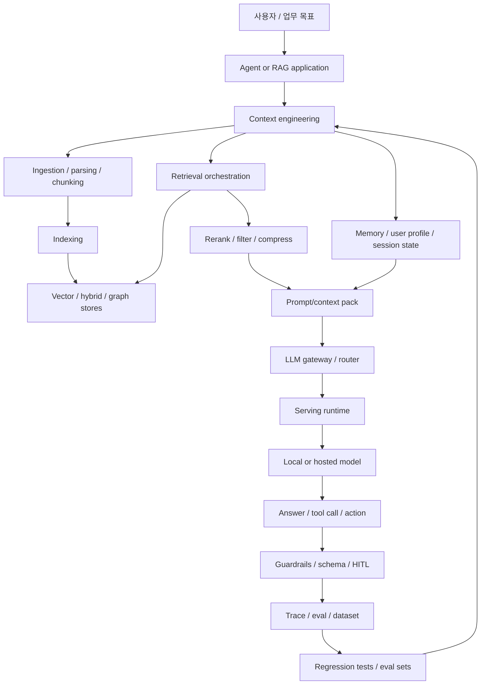
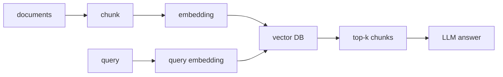
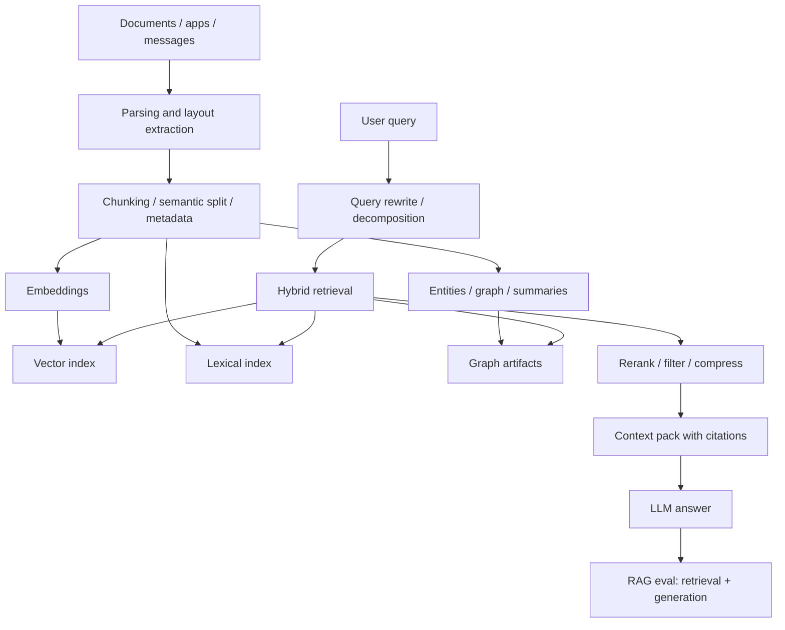
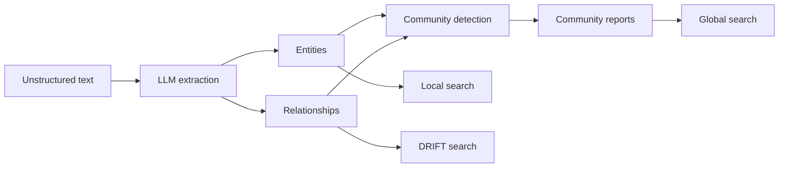
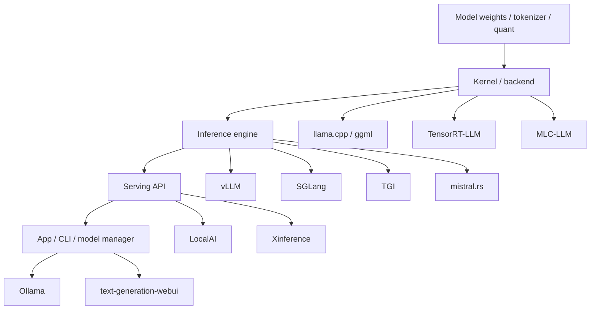
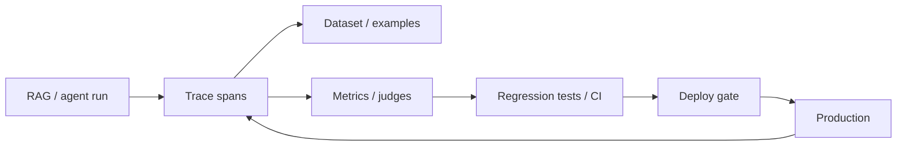
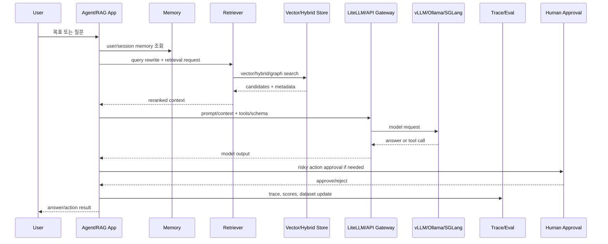

# 컨텍스트 엔지니어링, RAG, vLLM/local LLM, 에이전트 하네스 최신 트렌드 분석

기준일: 2026-06-13 KST.  
대상: 새로 선정/clone한 50개 오픈소스 레포지토리와 공식 문서.  
관련 데이터: `data/adjacent-tech-repositories.json`, `data/adjacent-tech-source-inventory.json`, `reports/adjacent-tech-source-inventory.md`.

## 1. 결론 요약

기존 30개 AI 코딩 에이전트 분석이 "agent가 무엇을 호출하고 어떻게 일하는가"를 봤다면, 이번 50개는 그 agent가 의존하는 하부 스택이다. 2026년 현재 흐름은 다음처럼 압축된다.

1. RAG는 죽지 않았다. 오히려 단순 vector search에서 `hybrid search`, `GraphRAG`, `memory`, `document intelligence`, `RAG evaluation`으로 분화했다.
2. Context engineering은 prompt engineering의 후속이라기보다 RAG, memory, tool selection, long-context serving, eval을 묶는 운영 계층이 되었다.
3. vLLM/SGLang/TensorRT-LLM/TGI는 production serving, llama.cpp/Ollama/LocalAI/text-generation-webui는 local/private inference와 developer UX, MLC/BitNet은 edge/efficient inference 쪽으로 갈라진다.
4. Vector DB는 "embedding 저장소"에서 `hybrid lexical+vector`, `filtering`, `multi-vector`, `tenant isolation`, `Postgres-native vector`, `local-first lakehouse`로 이동했다.
5. Eval/observability 도구는 RAG와 agent를 제품화하기 위한 필수 하네스가 되었다. Promptfoo, Ragas, DeepEval, TruLens, Phoenix, Langfuse, Agenta, Promptflow는 모두 조금씩 다른 평가 단위를 가진다.
6. Agent harness의 핵심은 모델 호출이 아니라 `context assembly -> retrieval -> inference serving -> tool/action -> validation -> trace -> feedback dataset`의 닫힌 루프다.

## 2. 전체 스택 지도

이 스택에서 이번 50개 레포는 다음 계층에 배치된다.

| 계층 | 대표 레포 | 역할 |
|---|---|---|
| LLM serving/local inference | `vllm`, `llama.cpp`, `ollama`, `sglang`, `TGI`, `TensorRT-LLM`, `MLC-LLM`, `LocalAI`, `Xinference` | 모델을 실제로 빠르고 싸게 실행하는 계층 |
| RAG framework/app | `llama_index`, `langchain`, `haystack`, `graphrag`, `LightRAG`, `ragflow`, `quivr`, `khoj`, `Verba` | 문서/데이터를 context로 바꾸는 계층 |
| Memory/context | `mem0`, `zep`, `DSPy`, `Pydantic AI` | 장기 memory, typed output, prompt/program optimization |
| Vector/hybrid search | `qdrant`, `milvus`, `chroma`, `weaviate`, `lancedb`, `pgvector`, `pgvectorscale`, `faiss`, `typesense` | retrieval index와 검색 성능/운영 계층 |
| Eval/observability/harness | `ragas`, `promptfoo`, `deepeval`, `trulens`, `phoenix`, `langfuse`, `agenta`, `promptflow`, `openai/evals` | 품질, 회귀, trace, red-team, 실험 관리 |
| Gateway/control | `litellm`, `guardrails`, `humanlayer` | provider routing, validation, human approval |

## 3. 트렌드 A: RAG의 중심이 "검색"에서 "컨텍스트 운영"으로 이동

### 기존 RAG

초기 RAG는 대체로 다음 흐름이었다.

이 방식은 단순하고 강력하지만, 2026년 기준으로는 다음 문제가 반복된다.

- chunk가 작으면 맥락이 깨지고, 크면 irrelevant context가 늘어난다.
- vector similarity만으로는 exact keyword, 날짜, 엔티티 관계, 권한 필터를 잘 처리하지 못한다.
- retrieval이 맞았는지, 답변이 retrieved context를 실제로 따랐는지 평가하기 어렵다.
- RAG 결과가 agent memory와 충돌할 수 있다.
- 문서 ingestion이 실패하면 이후 모든 단계가 조용히 틀린다.

### 현재 RAG

현재 트렌드는 다음으로 확장된다.

### 레포 연결

- `run-llama/llama_index`: data connector, index, retriever, query engine, agent workflow를 넓게 제공한다. GraphRAG 예제도 공식 문서에 있다.
- `langchain-ai/langchain`: RAG와 agent component를 제공하되, durable agent orchestration은 LangGraph 쪽으로 분리되는 추세다.
- `deepset-ai/haystack`: component/pipeline 중심 RAG다. production pipeline으로 이해하기 좋다.
- `microsoft/graphrag`: LLM으로 entity/relationship/community report를 만들고 global/local/DRIFT search를 수행한다. README가 indexing 비용 경고를 직접 둔다.
- `HKUDS/LightRAG`: GraphRAG의 비용/복잡도 문제를 더 가볍게 풀려는 흐름이다.
- `infiniflow/ragflow`: document intelligence와 enterprise RAG workflow를 전면에 둔다.
- `khoj`, `quivr`, `Verba`: RAG framework라기보다 실제 knowledge app/reference app에 가깝다.

## 4. 트렌드 B: GraphRAG는 만능이 아니라 "전역 질문"에 대한 비용 있는 선택지

GraphRAG 계열은 단순 top-k chunk 검색의 약점을 보완한다. 특히 "이 문서 전체에서 중요한 행위자와 관계가 무엇인가", "전체 데이터셋의 큰 테마는 무엇인가" 같은 질문에 강하다.

Microsoft GraphRAG의 README는 프로젝트를 "unstructured text에서 meaningful structured data를 추출하는 data pipeline and transformation suite"로 설명하며, indexing 비용이 크니 작게 시작하라고 경고한다. clone된 소스에서는 `packages/graphrag-vectors`, `packages/graphrag-input`, global search notebook, DRIFT search notebook이 핵심 단서다.

### 장점

- 전역 요약과 narrative discovery에 강하다.
- entity/relationship 기반으로 context를 설명 가능하게 만들 수 있다.
- chunk similarity가 놓치는 연결 관계를 잡는다.

### 비용

- indexing이 비싸다. LLM extraction과 report generation이 필요하다.
- configuration/prompt migration이 중요하다.
- small corpus나 단순 FAQ에는 과하다.
- graph가 틀리면 retrieval explainability가 오히려 가짜 확신이 된다.

### 판단

GraphRAG는 기본값이 아니라 선택지다. 긴 narrative, policy, legal/medical/enterprise 문서처럼 관계/전역 질문이 중요한 데이터셋에는 가치가 크다. 반면 API 문서, FAQ, 단순 code docs는 hybrid search + rerank + citations가 더 실용적일 수 있다.

## 5. 트렌드 C: Local LLM 스택은 한 층위가 아니라 네 층위

local LLM 도구를 모두 "로컬 모델 실행"으로 묶으면 비교가 어색해진다. 이번 15개 추론/서빙 레포는 실제로 서로 다른 문제를 푼다.

### 층위별 역할

| 층위 | 질문 | 대표 |
|---|---|---|
| Kernel/backend | 특정 하드웨어에서 토큰을 어떻게 계산하는가 | `llama.cpp`, `TensorRT-LLM`, `MLC-LLM`, `BitNet` |
| Engine | batching, KV cache, scheduling, structured generation을 어떻게 하는가 | `vLLM`, `SGLang`, `TGI`, `mistral.rs` |
| Serving API | 여러 모델과 backend를 어떻게 OpenAI-compatible API로 노출하는가 | `LocalAI`, `Xinference`, `vLLM serve`, `TGI` |
| UX/model manager | 개발자가 모델을 어떻게 설치/실행/관리하는가 | `Ollama`, `text-generation-webui` |

### vLLM과 SGLang

`vllm` README는 PagedAttention과 OpenAI-compatible API server를 핵심 기능으로 둔다. clone된 repo에는 `vllm.entrypoints.openai`와 `vllm serve` CLI가 명확하다. 즉 vLLM은 "내 agent/RAG app 뒤에 붙는 production-ish inference server"다.

`sglang`은 serving framework이면서 structured generation, RadixAttention, multi-modal serving, router/gateway 성격을 가진다. shared-prefix workload, RAG, chat, agent처럼 여러 요청이 같은 system/context prefix를 공유할 때 강점을 주장하는 흐름과 맞물린다.

### llama.cpp와 Ollama

`llama.cpp`는 GGUF/quantization/local backend의 표준 reference에 가깝다. agent 관점에서는 "작은 서버 또는 edge runtime에 모델을 심을 수 있게 해주는 하부 엔진"이다.

`ollama`는 모델 packaging/registry/desktop/server UX가 강하다. 소스의 `docs/context-length.mdx`는 VRAM에 따라 기본 context length를 다르게 잡고, agents/coding tools는 64k 이상이 필요할 수 있다고 설명한다. 이 점은 local LLM에서도 context engineering과 memory budget이 제품 기능이라는 뜻이다.

## 6. 트렌드 D: Vector DB는 top-k ANN에서 hybrid retrieval substrate로

이번 9개 검색/벡터 레포는 다음 세 방향으로 갈린다.

| 방향 | 대표 | 특징 |
|---|---|---|
| 전용 vector DB | `qdrant`, `milvus`, `chroma`, `weaviate`, `lancedb` | vector search, filtering, collection/schema, distributed/local 운영 |
| SQL/Postgres-native | `pgvector`, `pgvectorscale` | 기존 Postgres 운영 모델 안에 vector search를 넣음 |
| 검색 엔진/라이브러리 | `faiss`, `typesense` | ANN library 또는 keyword+semantic hybrid search |

### 왜 hybrid가 중요해졌나

- lexical keyword가 필요한 질의가 많다.
- vector embedding은 숫자, 코드 symbol, 정확한 error message, 날짜/버전 필터에 약할 수 있다.
- enterprise RAG는 metadata filter, tenant boundary, ACL이 중요하다.
- rerank 이전 후보군을 다양하게 뽑아야 한다.

### 선택 기준

| 요구 | 우선 후보 |
|---|---|
| local/simple dev | `chroma`, `lancedb`, `pgvector` |
| Rust 기반 production vector DB | `qdrant` |
| 대규모 distributed vector infra | `milvus`, `weaviate` |
| 기존 Postgres 중심 조직 | `pgvector`, `pgvectorscale` |
| 검색 엔진 UX와 hybrid search | `typesense`, `weaviate` |
| library-level ANN 실험 | `faiss` |

## 7. 트렌드 E: Eval/observability가 하네스의 중심으로 이동

RAG와 agent는 실패가 조용하다. API는 200을 반환하고 문장은 자연스럽지만, 답은 틀릴 수 있다. 그래서 eval/observability 도구는 단순 monitoring이 아니라 하네스의 안전장치가 된다.

### 도구별 초점

| 도구 | 핵심 초점 | 적합한 사용 |
|---|---|---|
| `ragas` | RAG metrics, synthetic/eval data, faithfulness/context metrics | RAG pipeline 품질 측정 |
| `promptfoo` | CLI/CI 기반 prompt/model/provider test, red teaming | 회귀 테스트와 red-team |
| `deepeval` | pytest-like LLM unit testing, RAG/agent metrics | 개발자 테스트 코드 |
| `trulens` | feedback functions, RAG triads, app instrumentation | RAG app 관측/평가 |
| `phoenix` | OpenTelemetry/OpenInference trace, eval, experiments | trace-first observability |
| `langfuse` | traces, prompt management, evals, datasets | self-hostable product observability |
| `agenta` | prompt management/eval/deployment workflow | LLMOps platform |
| `promptflow` | flow, eval, deployment | Azure/Microsoft 계열 flow harness |
| `openai/evals` | eval registry/framework | 역사적/실험적 eval harness |

clone된 README 단서도 이 흐름을 뒷받침한다. Langfuse는 LLM call뿐 아니라 retrieval, embedding, agent actions를 trace한다고 설명한다. Phoenix는 OpenTelemetry 기반 tracing과 RAG relevance/answer relevance eval을 제공한다. Promptfoo 문서는 RAG 평가를 retrieval 단계와 generation 단계로 나누라고 설명한다.

## 8. 트렌드 F: Gateway, guardrail, human approval이 product boundary가 됨

`litellm`, `guardrails`, `humanlayer`, `pydantic-ai`, `dspy`는 서로 다르지만 모두 "모델 호출 앞뒤의 contract"를 다룬다.

- `LiteLLM`: provider routing, OpenAI-compatible proxy, budget/cost/fallback, logging. 여러 모델을 쓰는 agent/RAG app에서 gateway가 된다.
- `Guardrails`: output validation, schema/rail, safety/format constraints. structured output 실패를 runtime contract로 다룬다.
- `HumanLayer`: human approval과 human-in-the-loop control. tool action을 사람이 승인하는 경계를 만든다.
- `Pydantic AI`: typed agent framework. output/tool/state를 Pydantic type으로 강제해 testability를 높인다.
- `DSPy`: prompt를 문자열 수작업이 아니라 optimizable program/module/signature로 다룬다.

이 흐름은 context engineering과 직접 연결된다. 좋은 context를 넣어도 output contract와 action approval이 없으면 agent는 운영하기 어렵다.

## 9. 트렌드 G: "local/private"와 "production throughput"은 다른 선택

로컬 LLM을 선택하는 이유는 보통 두 가지다.

1. privacy/control: 코드, 문서, 고객 데이터가 외부 API로 나가지 않게 한다.
2. cost/latency/control plane: 대량 요청에서 inference cost와 latency를 직접 최적화한다.

하지만 두 이유는 필요한 스택이 다르다.

| 목적 | 우선순위 | 대표 스택 |
|---|---|---|
| 개인/개발자 로컬 실험 | 설치 쉬움, 모델 pull/run, UI | `Ollama`, `llama.cpp`, `text-generation-webui` |
| private enterprise API | OpenAI-compatible API, auth/proxy, multi-model | `LocalAI`, `Xinference`, `LiteLLM` |
| high-throughput serving | batching, KV cache, GPU utilization, metrics | `vLLM`, `SGLang`, `TGI`, `TensorRT-LLM` |
| edge/browser/mobile | compilation, quantization, device portability | `MLC-LLM`, `llama.cpp`, `BitNet` |

따라서 "vLLM vs Ollama"는 대부분 잘못된 질문이다. Ollama는 model UX/manager에 가깝고, vLLM은 serving engine에 가깝다. 둘은 대체 관계라기보다 다른 층위다.

## 10. RAG + local LLM + agent harness의 실제 플로우

이 플로우의 병목은 상황에 따라 다르다.

- 답이 틀리면 retrieval/eval 문제일 수 있다.
- 느리면 inference server 또는 rerank 문제일 수 있다.
- 비용이 높으면 GraphRAG indexing 또는 long-context serving 문제일 수 있다.
- 위험하면 memory/approval/tool boundary 문제일 수 있다.
- 재현이 안 되면 trace/dataset/eval harness 문제가 먼저다.

## 11. 위험요소

| 위험 | 나타나는 계층 | 예시 |
|---|---|---|
| Context poisoning | RAG, memory, docs ingestion | 악성 문서가 agent instruction처럼 들어감 |
| Silent retrieval failure | vector/hybrid search | top-k는 반환하지만 정답 근거가 없음 |
| Graph hallucination | GraphRAG | LLM extraction이 만든 entity/relationship이 틀림 |
| Long context overconfidence | local/serving/context | 많은 context를 넣지만 모델이 중간 정보를 놓침 |
| GPU memory/cost blow-up | serving | 긴 context, large batch, KV cache, quant setting |
| Eval overfitting | eval harness | metric을 통과하도록 prompt만 튜닝 |
| Trace privacy | observability | prompts, retrieved docs, tool args가 trace에 저장 |
| Provider routing drift | gateway | fallback 모델이 tool/schema behavior를 다르게 처리 |
| Human approval fatigue | HITL | 승인 prompt가 많아져 사용자가 읽지 않음 |
| License mismatch | local/RAG app | AGPL/GPL/other 라이선스가 제품 배포와 충돌 |

## 12. 이번 50개에서 특히 주목할 포인트

- `huggingface/text-generation-inference`와 `weaviate/Verba`는 GitHub metadata상 archived다. 보고서에서는 역사적/참조적 가치와 현재 채택 리스크를 분리해야 한다.
- `ollama`, `transformers`, `langchain`, `llama.cpp`, `vllm`, `ragflow`, `mem0`, `litellm`, `llama_index`는 star/생태계 지표가 특히 크다.
- `GraphRAG`, `LightRAG`, `mem0`, `zep`은 "RAG가 memory/graph/context engineering으로 이동"하는 증거다.
- `Phoenix`, `Langfuse`, `Promptfoo`, `Ragas`, `DeepEval`은 "agent/RAG 품질은 trace와 eval 없이는 운영 불가"라는 trend를 보여준다.
- `LiteLLM`은 agent/RAG app이 여러 모델과 local/hosted provider를 동시에 쓰면서 gateway가 필수 인프라가 되는 흐름을 보여준다.

## 13. 공식 자료 핵심 근거

- [Anthropic, Effective context engineering for AI agents](https://www.anthropic.com/engineering/effective-context-engineering-for-ai-agents): context window에 무엇을 넣을지와 tool set pruning을 agent reliability의 핵심으로 둔다.
- [Anthropic, Effective harnesses for long-running agents](https://www.anthropic.com/engineering/effective-harnesses-for-long-running-agents): long-running agent는 session 간 memory, progress, compaction, recovery가 필요하다고 설명한다.
- [LangChain, Context engineering for agents](https://www.langchain.com/blog/context-engineering-for-agents): context engineering 전략을 write/select/compress/isolate로 정리한다.
- [LangChain docs, Context engineering](https://docs.langchain.com/oss/python/langchain/context-engineering): context engineering을 AI engineer의 핵심 업무로 둔다.
- [vLLM docs](https://docs.vllm.ai/): vLLM을 빠르고 사용하기 쉬운 LLM inference/serving library로 설명하고 OpenAI-compatible serving을 제공한다.
- [Ollama docs](https://docs.ollama.com/): Modelfile, context length, local model management를 설명한다.
- [Microsoft GraphRAG docs](https://microsoft.github.io/graphrag/): graph-based indexing/search와 global/local/DRIFT retrieval 흐름을 설명한다.
- [Promptfoo RAG eval docs](https://www.promptfoo.dev/docs/guides/evaluate-rag/): RAG 평가를 retrieval과 generation 두 단계로 나눈다.
- [Langfuse RAG with Ragas guide](https://langfuse.com/guides/cookbook/evaluation_of_rag_with_ragas): production traces 위에서 RAGAS eval을 돌리는 패턴을 제시한다.
- [Phoenix docs](https://arize.com/docs/phoenix): OpenTelemetry 기반 tracing, eval, experiments를 LLM app 관측의 중심으로 둔다.

## 14. 설계 판단 요약

1. 단순 Q&A라면 GraphRAG보다 hybrid search + rerank + citation + eval이 먼저다.
2. 긴 문서 전체의 관계/테마를 묻는다면 GraphRAG/LightRAG를 검토한다.
3. local privacy가 목적이면 Ollama/llama.cpp/LocalAI가 시작점이다.
4. throughput이 목적이면 vLLM/SGLang/TGI/TensorRT-LLM을 검토한다.
5. agent가 여러 provider를 써야 하면 LiteLLM 같은 gateway를 먼저 설계한다.
6. RAG나 agent를 운영하려면 Ragas/Promptfoo/Phoenix/Langfuse/DeepEval 중 최소 하나의 eval/trace 루프가 필요하다.
7. Memory는 성능 기능이면서 privacy/poisoning 위험이다. mem0/Zep 계열은 사용 전 write policy와 deletion policy가 필요하다.
8. 모든 local LLM 선택은 hardware, quantization, context length, model format, serving API compatibility까지 같이 판단해야 한다.
