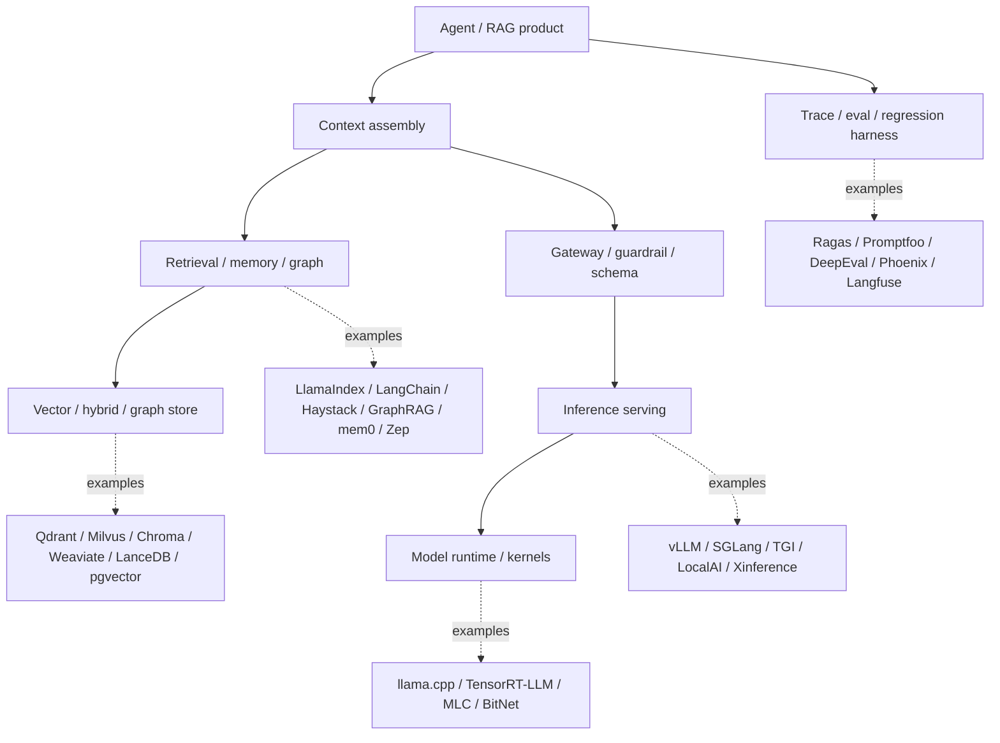
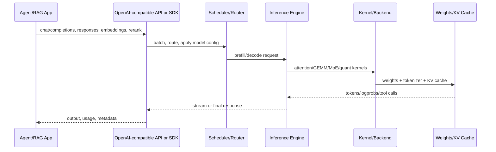
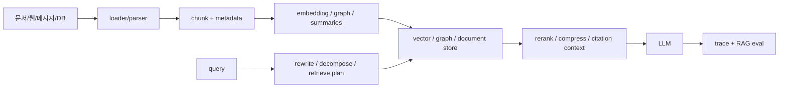
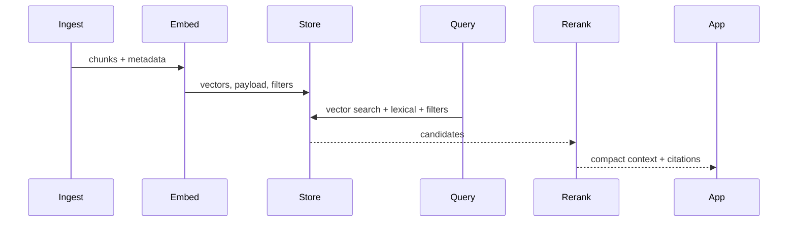
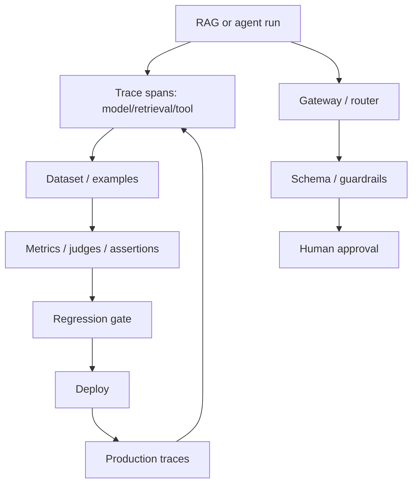
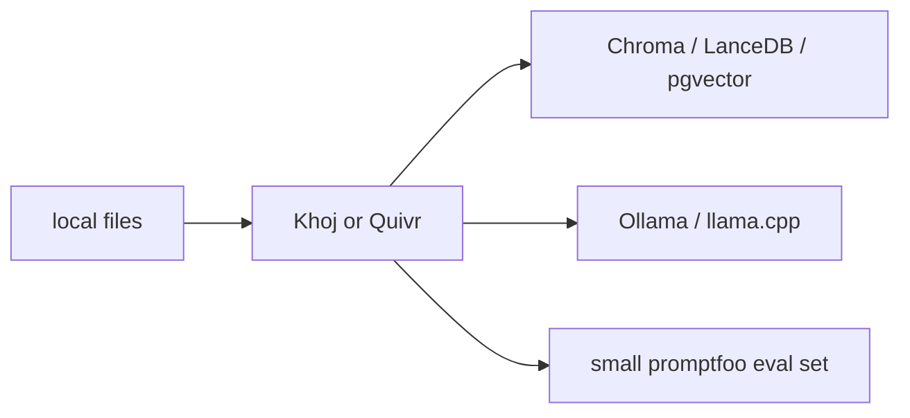
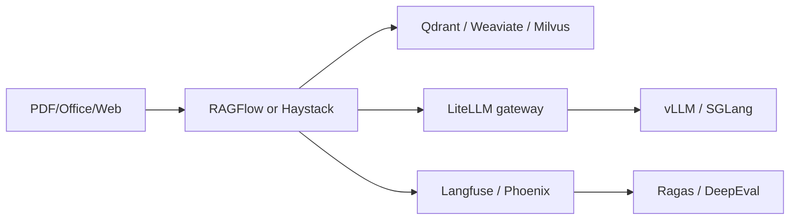
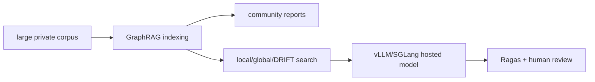
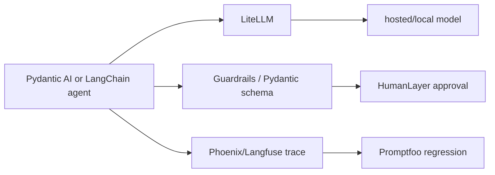

# 컨텍스트/RAG/vLLM/local LLM/하네스 50개 레포지토리 상세 분석

기준일: 2026-06-13 KST.  
분석 근거: `data/adjacent-tech-repositories.json`, `data/adjacent-tech-github-metadata.json`, `data/adjacent-tech-source-inventory.json`, `reports/adjacent-tech-source-inventory.md`, 각 clone의 README/docs/source tree, 공식 문서.  
clone 위치: `sources/` 아래 `owner__repo` 형식. `sources/`는 git에 커밋하지 않고, 보고서와 메타데이터만 커밋한다.

## 1. 읽는 법

이번 50개는 기존 AI 코딩 에이전트 30개와 직접 경쟁하는 레포가 아니라, 에이전트와 RAG 제품이 의존하는 하부 스택이다. 따라서 단순 star 순위보다 "어느 계층을 책임지는가"가 중요하다.

핵심 판단:

- `vLLM vs Ollama`처럼 다른 계층의 도구를 직접 비교하면 결론이 어긋난다. vLLM은 serving engine, Ollama는 local model UX/runtime에 가깝다.
- RAG framework, vector DB, eval harness는 서로 대체재가 아니라 한 파이프라인 안에서 연결되는 경우가 많다.
- agent harness의 실전 실패 지점은 대부분 모델 자체보다 context 선택, retrieval 품질, tool boundary, trace/eval 부재에서 나온다.
- archived, AGPL/GPL, "other" license, telemetry, trace privacy, indexing cost는 채택 전에 반드시 별도 점검해야 한다.

## 2. LLM serving / local inference 계층

### 공통 실행 흐름

| # | 레포 | snapshot | 아키텍처/호출 흐름 | 차별점 | 리스크와 점검 포인트 |
| -: | --- | --- | --- | --- | --- |
| 1 | `vllm-project/vllm` | Python, commit `a30addc`, Apache-2.0, 82k+ stars | `vllm.entrypoints.openai`와 CLI `vllm serve`가 app-facing surface다. 요청은 OpenAI-compatible server로 들어오고 scheduler/engine이 PagedAttention, continuous batching, prefix cache, structured output parser, tool/reasoning parser로 넘긴다. `csrc/`, `rust/`, `vllm/`, `benchmarks/`가 핵심 구조다. | production inference의 중심축. PagedAttention, continuous batching, chunked prefill, prefix caching, parallelism, tool calling, Anthropic Messages/gRPC support까지 포함해 agent/RAG backend로 쓰기 쉽다. | GPU memory, CUDA/ROCm dependency, model support matrix, version skew가 크다. 긴 context는 throughput과 KV cache 비용을 같이 폭발시킨다. |
| 2 | `ggml-org/llama.cpp` | C++, commit `ebc1077`, MIT, 116k+ stars | `src/`, `ggml/`, `tools/server`, `examples/`, GGUF 변환 도구가 중심이다. 앱은 CLI/server를 호출하고, 내부는 GGUF model loading, quantized tensor backend, CPU/GPU offload, token loop로 동작한다. | local inference reference에 가깝다. GGUF, quantization, CPU-first portability, embedded/edge 시나리오에 강하다. | production multi-tenant serving이라기보다 runtime/kernel에 가깝다. 모델 변환/quant 선택에 따라 품질과 속도 편차가 크다. |
| 3 | `ollama/ollama` | Go, commit `12e0437`, MIT, 173k+ stars | `cmd/`, `server/`, `api/`, `app/`, `docs/`가 중심이다. 사용자는 `ollama pull/run/serve` 또는 HTTP API로 모델을 호출한다. server는 Modelfile, registry, model blob, prompt/context management를 관리한다. | 설치/운영 UX가 압도적으로 쉽다. local developer와 desktop agent의 기본 model manager로 적합하다. context length 문서가 VRAM별 기본값과 agent/coding tool의 64k+ 필요성을 명시한다. | OpenAI API 완전 호환 serving engine으로만 보면 vLLM/SGLang보다 범위가 다르다. 긴 context는 VRAM을 크게 먹고 CPU offload가 성능을 떨어뜨린다. |
| 4 | `sgl-project/sglang` | Python/Rust, commit `9f6b233`, Apache-2.0, 28k+ stars | `python/`, `sgl-kernel/`, `sgl-model-gateway/`, `experimental/sgl-router/`가 핵심이다. OpenAI-compatible API로 요청을 받고 RadixAttention, prefix caching, multi-GPU routing, structured generation을 적용한다. | shared-prefix workload, structured generation, multimodal serving, large-scale serving을 한 프레임으로 묶는다. vLLM과 같은 계층이지만 prefix/reuse와 routing 철학이 더 전면에 있다. | 빠르게 변하는 대규모 프로젝트라 버전과 hardware backend 호환성 확인이 필요하다. Kubernetes/router/gateway까지 쓰면 운영 복잡도가 커진다. |
| 5 | `huggingface/text-generation-inference` | Python/Rust, commit `b4adbf2`, Apache-2.0, archived | `launcher/`, `router/`, `server/`, `backends/`, `clients/`로 구성된다. launcher가 backend server를 띄우고 router가 HTTP/gRPC 요청을 받아 generation backend로 넘긴다. | Hugging Face production serving의 역사적 reference. router/server/backend 분리, multi-backend Docker, client 구조를 보기 좋다. | GitHub metadata상 archived다. 신규 채택보다는 기존 배포 유지보수나 architecture reference로 보는 편이 안전하다. |
| 6 | `huggingface/transformers` | Python, commit `f208766`, Apache-2.0, 161k+ stars | `src/transformers`의 model/tokenizer/config/pipeline 계층이 중심이다. inference server라기보다 model definition/runtime library이며, vLLM/TGI/Ollama 같은 도구의 upstream model ecosystem 역할을 한다. | 모델 지원 폭과 생태계가 최대 강점이다. 새로운 model architecture, tokenizer, processor, quantization bridge가 가장 먼저 들어오는 경우가 많다. | serving 최적화 자체는 별도 엔진이 필요하다. dependency와 model-specific behavior가 방대해 버전 고정이 중요하다. |
| 7 | `huggingface/accelerate` | Python, commit `fb77442`, Apache-2.0 | `src/accelerate`, config CLI, distributed launcher가 중심이다. 학습/추론 스크립트가 Accelerate를 통해 device placement, mixed precision, distributed strategy를 추상화한다. | multi-GPU/FSDP/DeepSpeed/TPU 같은 distributed 실행을 간단하게 만든다. model serving보다는 training/inference script portability layer다. | agent/RAG runtime에 직접 붙이는 도구는 아니다. 배포 서버와 혼동하면 안 된다. |
| 8 | `mlc-ai/mlc-llm` | Python/C++/TVM, commit `2008fe8`, Apache-2.0 | `python/`, `cpp/`, `3rdparty/`, `docs/`가 중심이다. 모델을 compile/quantize하고 TVM 기반 runtime으로 다양한 device에 배포한다. | browser/mobile/edge/device portability에 강하다. "서버에서 빠르게"보다 "다양한 hardware에서 굴러가게"가 철학이다. | toolchain과 compilation flow가 복잡하다. vLLM식 online serving과 바로 비교하면 안 된다. |
| 9 | `EricLBuehler/mistral.rs` | Rust, commit `c22c2e2`, MIT | Rust runtime으로 모델 loading, quantization, OpenAI-compatible serving, multimodal/agentic 기능을 제공한다. `mistralrs-server` 류 server entrypoint가 주요 사용면이다. | Rust 기반 단일 binary/성능/안정성 지향 local inference. Python-heavy serving stack의 대안이다. | 생태계 규모는 vLLM/llama.cpp보다 작다. model/backend 지원 범위를 사전에 확인해야 한다. |
| 10 | `mudler/LocalAI` | Go, commit `4ce0f61`, MIT, 46k+ stars | `backend/`, `core/`, `api/`, `pkg/`, `docs/`가 중심이다. 앱은 OpenAI-compatible API를 호출하고 LocalAI가 llama.cpp, transformers, diffusion, audio 등 backend로 route한다. | "self-hosted OpenAI-compatible local AI server"에 가깝다. LLM뿐 아니라 image/audio/embedding까지 local/private API로 묶는다. | backend가 많아 operational surface가 넓다. 어떤 backend가 실제 production path인지 고정하지 않으면 장애 추적이 어려워진다. |
| 11 | `oobabooga/text-generation-webui` | Python, commit `ed888c7`, AGPL-3.0 | `modules/`, `extensions/`, UI/server script가 중심이다. 사용자는 웹 UI에서 model loader, parameters, extensions를 바꿔 local generation을 실행한다. | local experimentation UI로 강하다. loader/extension ecosystem이 풍부해 모델 비교와 prompt 실험에 적합하다. | AGPL-3.0 라이선스가 제품 배포와 충돌할 수 있다. 운영형 API 서버보다 실험/개인 UI 성격이 강하다. |
| 12 | `lm-sys/FastChat` | Python, commit `587d5cf`, Apache-2.0 | controller, model worker, OpenAI API server, web UI/eval로 구성된다. worker가 모델을 실행하고 controller가 routing한다. | Vicuna/Chatbot Arena 초기 생태계의 실험/평가/serving reference. 분산 worker-controller 구조가 명료하다. | 최근 production serving의 최적화는 vLLM/SGLang 쪽이 더 활발하다. historical architecture로 보는 것이 적절하다. |
| 13 | `NVIDIA/TensorRT-LLM` | Python/C++/CUDA, commit `db7161b`, other license, 13k+ stars | `cpp/`, `tensorrt_llm/`, `examples/`, `benchmarks/`, `docs/` 중심. 모델을 TensorRT engine으로 변환하고 optimized runtime에서 실행한다. | NVIDIA GPU 최적화, FP8/quant, kernel/plugin, high-throughput production inference에 강하다. | NVIDIA stack lock-in이 크고 build/runtime matrix가 무겁다. 라이선스가 `other`로 수집되어 별도 법무 확인이 필요하다. |
| 14 | `microsoft/BitNet` | Python/C++, commit `01eb415`, MIT | BitNet b1.58 계열의 low-bit 모델 실행/실험 코드다. 작은 repo이며 `src/`, scripts, docs 중심이다. | 1-bit/low-bit inference라는 효율성 철학이 분명하다. edge/local cost reduction trend를 보여준다. | 범용 serving framework가 아니다. 모델 선택지가 제한적이고 연구/실험 성격이 강하다. |
| 15 | `xorbitsai/inference` | Python, commit `1fbae04`, Apache-2.0 | Xinference server/frontend/worker 구조다. 모델 family별 registration, REST/API server, worker execution으로 local/cloud model serving을 제공한다. | LLM, embedding, rerank, image/audio 등 다양한 model type을 관리하는 self-hosted model platform 성격이다. | 기능 범위가 넓어 운영 표준을 정하지 않으면 복잡해진다. backend별 dependency와 model cache 관리가 중요하다. |

### 이 계층의 선택 기준

| 목적 | 우선 후보 | 이유 |
| --- | --- | --- |
| 빠른 개인 로컬 실행 | `Ollama`, `llama.cpp`, `text-generation-webui` | 설치, 모델 pull, GGUF/quant, UI가 중요 |
| OpenAI-compatible private API | `LocalAI`, `Xinference`, `vLLM serve`, `SGLang` | agent/RAG app이 API 형태로 붙기 쉬움 |
| high-throughput GPU serving | `vLLM`, `SGLang`, `TensorRT-LLM` | batching, KV cache, kernel, parallelism이 핵심 |
| edge/device portability | `llama.cpp`, `MLC-LLM`, `BitNet` | quantization, compilation, CPU/mobile/device support |
| architecture reference | `TGI`, `FastChat` | server/router/worker 구조와 historical design을 보기 좋음 |

## 3. RAG, context, memory, knowledge app 계층

### 공통 실행 흐름

| # | 레포 | snapshot | 아키텍처/호출 흐름 | 차별점 | 리스크와 점검 포인트 |
| -: | --- | --- | --- | --- | --- |
| 16 | `run-llama/llama_index` | Python, commit `d8d7ffb`, MIT, 50k+ stars | data connector, node parser, index, retriever, query engine, agent/workflow 계층으로 구성된다. app은 loader로 데이터를 넣고 index/query engine으로 context를 구성한 뒤 LLM으로 보낸다. | RAG abstraction의 폭이 넓다. connectors, graph RAG, agent, workflow, observability integration이 많아 "데이터를 context로 바꾸는 레이어"로 강하다. | abstraction이 많아 단순 RAG에서는 과할 수 있다. 어떤 retriever/query engine을 쓰는지 명확히 고정해야 재현성이 생긴다. |
| 17 | `langchain-ai/langchain` | Python, commit `0392b6b`, MIT, 139k+ stars | models, messages, tools, retrievers, middleware, agents가 중심이다. 최근 durable graph orchestration은 LangGraph로 분리되는 흐름이 강하다. | integration 생태계와 agent/context engineering 문서가 강하다. middleware로 model context, tool context, lifecycle context를 제어하는 철학이 뚜렷하다. | 과거 chain abstraction과 최신 agent/middleware 패턴이 섞여 혼란이 생길 수 있다. production agent는 LangGraph/LangSmith와 같이 봐야 한다. |
| 18 | `deepset-ai/haystack` | MDX/Python, commit `acbf725`, Apache-2.0 | component와 pipeline 중심이다. DocumentStore, Retriever, Ranker, Generator, Evaluator를 pipeline graph로 연결한다. | enterprise RAG pipeline을 읽기 좋다. "component orchestration" 철학이 명확해 운영 파이프라인 설계에 좋다. | Python package와 docs가 큰 편이다. LangChain/LlamaIndex 대비 ecosystem 선택은 조직 표준에 맞춰야 한다. |
| 19 | `microsoft/graphrag` | Python, commit `6d02c23`, MIT, 33k+ stars | indexing pipeline이 text units를 만들고 entity/relationship/claims를 추출한 뒤 community detection/report를 생성한다. query는 local/global/DRIFT search로 graph artifacts를 context화한다. | baseline vector RAG가 약한 전역/관계 질문에 강하다. `packages/graphrag-vectors`, notebooks, prompt tuning/config docs가 설계 단서를 제공한다. | indexing cost가 높고 prompt/config migration이 중요하다. graph hallucination이 생기면 설명 가능해 보이는 오답이 된다. |
| 20 | `HKUDS/LightRAG` | Python, commit `ad7161b`, MIT, 36k+ stars | 문서 ingestion 후 lightweight graph/index artifacts를 만들고 query-time retrieval에 graph와 vector를 결합한다. | GraphRAG 계열의 비용/복잡도를 줄이려는 흐름. 빠른 실험과 경량 graph retrieval을 검토할 때 유용하다. | 빠른 성장 repo라 algorithm claim과 실제 데이터셋 성능을 별도 검증해야 한다. |
| 21 | `mem0ai/mem0` | Python, commit `06d33f6`, Apache-2.0, 58k+ stars | message/event를 memory extraction pipeline에 넣고 vector/graph/profile store에 저장한다. query 시 relevant memory를 가져와 agent prompt에 주입한다. server/cli/docs가 같이 있다. | agent memory를 제품 기능으로 분리한다. "모든 것을 context에 넣기"보다 기억 추출/검색/삭제 policy를 설계하게 만든다. | privacy, deletion, poisoning, stale memory가 핵심 위험이다. memory write policy와 audit trail이 없으면 장기 오염이 생긴다. |
| 22 | `getzep/zep` | Python, commit `faf2ace`, Apache-2.0 | conversation memory, entity/fact extraction, graph memory, user/session context를 agent가 조회할 수 있는 API로 제공한다. | agent memory를 service/API화한다. session memory와 long-term memory를 분리해 multi-session agent에 적합하다. | 외부 memory service가 추가되므로 auth, tenant isolation, retention 정책이 필요하다. |
| 23 | `stanford-oval/storm` | Python, commit `fb951af`, MIT | topic research, source discovery, outline generation, long-form writing pipeline으로 구성된다. frontend가 포함된 research writing system이다. | 단순 RAG Q&A가 아니라 "자료를 조사해 구조화된 글을 작성"하는 end-to-end knowledge agent reference다. | research prototype 성격이 강하다. factuality, citation quality, source freshness를 별도 검증해야 한다. |
| 24 | `weaviate/Verba` | Python, commit `70b6cfb`, BSD-3-Clause, archived | Weaviate 기반 RAG app/reference implementation이다. ingestion, retrieval, chat frontend를 묶은 sample product 형태다. | vector DB vendor가 제공한 RAG reference app으로 architecture 학습 가치가 있다. | GitHub metadata상 archived다. 신규 제품 기반으로 삼기보다 reference로만 보는 편이 안전하다. |
| 25 | `khoj-ai/khoj` | Python, commit `9258f57`, AGPL-3.0, 35k+ stars | personal knowledge assistant. local/remote docs, chat, search, agents, server/web/mobile integration을 포함한다. | 개인 지식/RAG + local assistant 제품에 가깝다. privacy/local-first 요구를 가진 사용자 경험을 보기 좋다. | AGPL-3.0 라이선스가 제품 배포와 충돌할 수 있다. 기능 범위가 넓어 operational hardening이 필요하다. |
| 26 | `QuivrHQ/quivr` | Python/TS, commit `947a785`, other license, 39k+ stars | documents를 brain/knowledge base에 넣고 retrieval/chat UI로 사용한다. API, frontend, storage, vector DB integration이 결합된 RAG app이다. | "사용자가 문서 기반 second brain을 만든다"는 UX가 명확하다. RAG 제품화의 user flow를 보기 좋다. | 라이선스가 `other`로 수집되어 확인 필요. product app 특성상 core framework로 재사용할 때 결합도가 높을 수 있다. |
| 27 | `infiniflow/ragflow` | Python/TS, commit `d32e05d`, Apache-2.0, 82k+ stars | document intelligence, parsing, chunking, workflow, agent, UI, retrieval을 묶은 RAG platform이다. `agent/`, `api/`, `web/`, `docs/`가 중심이다. | "문서를 제대로 읽고 쪼개는 것"을 RAG 품질의 핵심으로 둔다. enterprise document RAG에 실용적인 범위가 넓다. | 구성 요소가 많아 deploy/upgrade가 무겁다. 문서 parsing 결과와 chunking 품질을 데이터별로 검증해야 한다. |

### 이 계층의 선택 기준

| 요구 | 우선 후보 | 이유 |
| --- | --- | --- |
| 빠른 RAG prototype | `LlamaIndex`, `LangChain`, `Haystack` | loader/retriever/generator abstraction이 준비됨 |
| enterprise pipeline | `Haystack`, `RAGFlow`, `LlamaIndex` | component/pipeline/document intelligence가 중요 |
| 전역/관계 질문 | `GraphRAG`, `LightRAG` | entity/relationship/community summary가 필요 |
| 개인 지식 앱 | `Khoj`, `Quivr`, `Verba` | product UX와 reference flow를 보기 좋음 |
| long-term agent memory | `mem0`, `Zep` | session/store/profile memory가 별도 계층으로 필요 |
| research writing agent | `STORM` | web/source/outline/report generation loop를 분석하기 좋음 |

## 4. Vector / hybrid retrieval 계층

### 공통 실행 흐름

| # | 레포 | snapshot | 아키텍처/호출 흐름 | 차별점 | 리스크와 점검 포인트 |
| -: | --- | --- | --- | --- | --- |
| 28 | `qdrant/qdrant` | Rust, commit `44ad62f`, Apache-2.0, 32k+ stars | Rust service가 collections, points, payload filters, HNSW/vector search, quantization, snapshots를 관리한다. app은 REST/gRPC/client로 upsert/search한다. | Rust 기반 전용 vector DB. filtering과 payload를 포함한 production vector search가 강하다. | distributed/replication 설정, payload schema, filter 성능, backup/snapshot 운영이 중요하다. |
| 29 | `milvus-io/milvus` | Go/C++/Rust, commit `14c4cf6`, Apache-2.0, 44k+ stars | proxy, query node, data node, index node, coordinator 등 distributed vector DB 구조다. ingestion과 search가 여러 service로 분리된다. | 대규모 distributed vector infrastructure. Zilliz ecosystem과 production scale 사례가 많다. | Kubernetes/ops complexity가 높다. 작은 팀의 단순 RAG에는 과할 수 있다. |
| 30 | `chroma-core/chroma` | Rust/Python, commit `b8bf764`, Apache-2.0, 28k+ stars | Python/JS client가 collection에 documents/embeddings/metadata를 저장하고 local/server mode로 query한다. Rust core와 server 구조로 이동한 흔적이 있다. | developer-friendly local vector store. RAG prototype의 기본 선택지로 자주 쓰인다. | production multi-tenant/large-scale 요구에서는 storage/ops maturity를 확인해야 한다. |
| 31 | `weaviate/weaviate` | Go, commit `24163af`, BSD-3-Clause | Go service가 schema/class, modules, vectorizers, hybrid search, generative modules를 제공한다. app은 GraphQL/REST/gRPC client로 접근한다. | vector DB와 hybrid/generative search를 결합한 feature-rich platform. | module 선택과 schema 설계가 복잡하다. vendor ecosystem 의존도를 점검해야 한다. |
| 32 | `lancedb/lancedb` | Rust/Python, commit `dfbe5be`, Apache-2.0 | Lance columnar format 위에 vector/table search를 제공한다. Python/TS clients와 local/cloud docs가 중심이다. | lakehouse/local-first vector data에 강하다. embedding, multimodal, large local dataset 실험에 좋다. | distributed DB라기보다 storage/table engine 성격도 강하다. concurrency/serving 요구를 확인해야 한다. |
| 33 | `pgvector/pgvector` | C, commit `1f68c73`, other license | PostgreSQL extension으로 vector type, indexes, distance operators를 추가한다. app은 SQL로 insert/search/filter/join을 수행한다. | 기존 Postgres 운영 모델 안에 vector search를 넣는다. ACL, backup, transaction, SQL join을 그대로 활용 가능하다. | 대규모 ANN 전용 DB와 같은 성능을 기대하면 안 된다. index type, vacuum, query plan, embedding dimension을 점검해야 한다. |
| 34 | `timescale/pgvectorscale` | Rust, commit `57c88b7`, PostgreSQL license | pgvector와 함께 쓰는 Postgres extension으로 vector index/search 성능을 개선하는 방향이다. | Postgres-native vector를 더 production-friendly하게 만들려는 흐름. 기존 DB를 유지하려는 조직에 적합하다. | Postgres version/extension compatibility, operational tuning, license를 확인해야 한다. |
| 35 | `facebookresearch/faiss` | C++/Python, commit `20afed0`, MIT, 40k+ stars | C++ ANN library와 Python bindings. app이 직접 index를 만들고 train/add/search를 호출한다. | vector search algorithm/library의 reference. IVF, PQ, HNSW, GPU search 등 실험과 custom infra에 강하다. | DB가 아니라 library다. persistence, metadata filter, auth, serving은 직접 설계해야 한다. |
| 36 | `typesense/typesense` | C++, commit `c5e2e5b`, GPL-3.0, 25k+ stars | search server가 collection/schema, typo-tolerant keyword search, vector/hybrid search를 제공한다. app은 HTTP client로 query한다. | keyword-first search UX와 vector/hybrid retrieval을 결합한다. RAG에서 exact keyword와 semantic candidate를 같이 뽑기 좋다. | GPL-3.0 라이선스와 hosted/commercial option을 확인해야 한다. pure vector DB와는 설계 철학이 다르다. |

### 검색 계층 판단

| 상황 | 추천 방향 |
| --- | --- |
| 이미 Postgres 중심 | `pgvector`부터 시작하고 성능 병목 시 `pgvectorscale` 또는 전용 DB 검토 |
| local/dev-first RAG | `Chroma` 또는 `LanceDB` |
| Rust 기반 전용 vector DB | `Qdrant` |
| 대규모 distributed vector infra | `Milvus`, `Weaviate` |
| exact keyword와 semantic search 동시 필요 | `Typesense`, `Weaviate`, hybrid retriever |
| algorithm research / custom index | `Faiss` |

## 5. Eval / observability / harness / gateway / control 계층

### 공통 실행 흐름

| # | 레포 | snapshot | 아키텍처/호출 흐름 | 차별점 | 리스크와 점검 포인트 |
| -: | --- | --- | --- | --- | --- |
| 37 | `explodinggradients/ragas` | Python, commit `298b682`, Apache-2.0 | datasets, metrics, evaluators, testset generation, integrations로 구성된다. RAG output과 retrieved context를 metric에 넣어 faithfulness, context precision/recall 등을 산출한다. | RAG 품질 평가에 특화. "vibe check"에서 systematic eval loop로 넘어가는 대표 도구다. | LLM-as-judge 비용과 bias가 있다. metric을 맹신하지 말고 golden set/human review와 섞어야 한다. |
| 38 | `promptfoo/promptfoo` | TypeScript, commit `30dc14b`, MIT, 22k+ stars | YAML config, provider abstraction, assertions, red-team, web UI/CLI가 중심이다. `promptfoo eval`이 provider를 호출하고 assertions를 검증한다. | CLI/CI 기반 prompt/model/provider 회귀 테스트가 강하다. RAG 평가를 retrieval과 generation으로 나누는 문서가 실용적이다. | test fixture 품질이 낮으면 false confidence가 생긴다. provider secret/trace redaction을 점검해야 한다. |
| 39 | `confident-ai/deepeval` | Python, commit `c399fb4`, Apache-2.0 | pytest-like test runner, metrics, datasets, tracing/integrations 중심이다. 개발자는 test code에 LLM output과 metric threshold를 넣는다. | LLM unit test를 Python test culture에 붙인다. CI에 넣기 쉽다. | judge model 비용/불안정성, threshold overfitting, flaky eval을 관리해야 한다. |
| 40 | `truera/trulens` | Python, commit `3fb807e`, MIT | app instrumentation, feedback functions, records, dashboards가 중심이다. RAG triad 같은 feedback을 trace 위에 계산한다. | RAG/LLM app feedback function 철학이 명확하다. 관측과 평가를 같이 다룬다. | instrumentation이 app code에 들어가므로 framework compatibility와 overhead를 확인해야 한다. |
| 41 | `Arize-ai/phoenix` | Python/TS, commit `3d33799`, other license | OpenTelemetry/OpenInference trace ingestion, evals, datasets, experiments, prompt playground가 중심이다. app은 spans를 보내고 Phoenix에서 디버깅/평가한다. | trace-first observability. model call, retrieval, tool use, custom logic까지 span으로 본다. | trace에는 민감한 prompt/context/tool args가 들어간다. retention, masking, access control이 필수다. |
| 42 | `langfuse/langfuse` | TypeScript, commit `de483b3`, other license | Next.js/TS app, ingestion API, SDK, prompt management, evals, datasets, scores로 구성된다. app/agent가 traces를 전송하고 Langfuse가 관측/평가/프롬프트 버전을 관리한다. | self-hostable LLM observability platform. traces, prompt management, evals, datasets가 한 제품으로 이어진다. | production trace privacy, sampling, storage cost, multi-tenant RBAC를 점검해야 한다. |
| 43 | `agenta-ai/agenta` | TypeScript/Python, commit `a2e9150`, other license | prompt management, playground, evaluation, deployment/workspace UI 중심의 LLMOps platform이다. | prompt/eval/deployment workflow를 제품화한다. 팀 단위 LLM app iteration에 적합하다. | full platform 도입은 workflow lock-in이 생긴다. license와 self-host 운영 비용을 확인해야 한다. |
| 44 | `BerriAI/litellm` | Python, commit `729b005`, other license, 50k+ stars | Python SDK와 proxy server가 핵심이다. app은 OpenAI format으로 호출하고 LiteLLM이 provider별 endpoint 변환, fallback, budget, logging, virtual keys를 처리한다. | multi-provider gateway 표준에 가깝다. hosted API와 local Ollama/vLLM을 같은 interface 뒤에 둘 수 있다. | gateway 장애가 전체 LLM traffic 장애가 된다. fallback model의 tool/schema behavior drift와 cost control을 점검해야 한다. |
| 45 | `stanfordnlp/dspy` | Python, commit `85027b1`, MIT, 35k+ stars | Signature, Module, Teleprompter/optimizer, evaluation set으로 prompt/program을 최적화한다. | prompt를 문자열이 아니라 optimizable program으로 다룬다. RAG/prompt tuning의 실험적이면서 강력한 방향이다. | optimizer가 eval set에 overfit될 수 있다. production readability와 deterministic control을 확보해야 한다. |
| 46 | `pydantic/pydantic-ai` | Python, commit `3c98a10`, MIT, 17k+ stars | Pydantic model/type system 위에 agent, tools, structured output, dependency injection을 구성한다. | typed agent framework. schema, tool args, result type을 Python type으로 강제해 testability가 좋다. | Pydantic ecosystem에 강하게 맞춰진다. 복잡한 long-running orchestration은 별도 설계가 필요하다. |
| 47 | `guardrails-ai/guardrails` | Python, commit `6fa9524`, Apache-2.0 | validators, schema, rail/spec, reask/repair loop를 통해 LLM output을 검증한다. | output contract를 runtime guard로 만든다. format/safety/policy validation이 필요한 app에 적합하다. | guardrail은 모델 이해를 대체하지 않는다. 과도한 repair loop는 latency/cost를 늘리고 실패를 숨길 수 있다. |
| 48 | `humanlayer/humanlayer` | TypeScript/Python, commit `bdea199`, other license | SDK/API/app으로 human approval, contact channel, tool-call approval loop를 제공한다. risky action이 발생하면 human approval을 받고 결과를 agent로 돌려준다. | human-in-the-loop를 별도 control plane으로 분리한다. email/Slack/approval flow가 필요한 agent에 중요하다. | approval fatigue와 delayed execution이 문제다. 어떤 action이 사람 승인을 요구하는지 policy를 작게 설계해야 한다. |
| 49 | `microsoft/promptflow` | Python, commit `3928a72`, MIT | flow DAG, nodes, prompt variants, evaluation, deployment integration으로 구성된다. Azure/Microsoft ecosystem과 연결된다. | prompt/LLM workflow를 flow artifact로 관리한다. enterprise ML/AI workflow와 이어지기 좋다. | Azure 중심 workflow에 맞춰질 수 있다. agentic dynamic loop보다는 flow harness 성격이 강하다. |
| 50 | `openai/evals` | Python, commit `8eac7a7`, other license | eval registry, completion functions, solvers, graders, datasets로 구성된다. 모델/프롬프트를 benchmark task에 대해 채점한다. | LLM eval harness의 역사적 reference. custom eval 작성 패턴과 grading structure를 배우기 좋다. | 현대 RAG/agent observability 제품으로는 Phoenix/Langfuse/Promptfoo/Ragas가 더 직접적이다. license와 maintenance 방향을 확인해야 한다. |

### 이 계층의 선택 기준

| 요구 | 우선 후보 | 이유 |
| --- | --- | --- |
| RAG 품질 metric | `Ragas`, `DeepEval`, `TruLens` | context precision/recall, faithfulness, groundedness |
| CI 회귀 테스트 | `Promptfoo`, `DeepEval`, `openai/evals` | YAML/pytest/eval registry 형태로 자동화 가능 |
| trace-first debugging | `Phoenix`, `Langfuse`, `TruLens` | model/retrieval/tool span을 볼 수 있음 |
| prompt/eval workflow product | `Langfuse`, `Agenta`, `Promptflow` | team workflow, datasets, prompt versioning |
| multi-provider gateway | `LiteLLM` | OpenAI format, fallback, budget, virtual keys |
| output/action control | `Guardrails`, `Pydantic AI`, `HumanLayer` | schema validation, typed agent, human approval |
| prompt/program optimization | `DSPy` | eval-driven optimizer로 prompt를 프로그램화 |

## 6. 숨은 표면과 이상 징후

| 신호 | 해당 레포 | 의미 |
| --- | --- | --- |
| archived | `huggingface/text-generation-inference`, `weaviate/Verba` | 신규 표준으로 채택하기보다 architecture/historical reference로 분리해야 한다. |
| AGPL/GPL | `oobabooga/text-generation-webui`, `khoj-ai/khoj`, `typesense/typesense` | SaaS/제품 배포 전 라이선스 해석이 필요하다. |
| `other` license로 수집 | `TensorRT-LLM`, `Quivr`, `pgvector`, `Phoenix`, `Langfuse`, `Agenta`, `LiteLLM`, `HumanLayer`, `openai/evals` 등 | SPDX가 명확히 잡히지 않은 상태다. 실제 LICENSE 파일과 commercial terms를 확인해야 한다. |
| trace/privacy risk | `Phoenix`, `Langfuse`, `TruLens`, `Agenta`, `Promptflow` | retrieved docs, prompts, tool args, user identifiers가 저장될 수 있다. masking/retention/RBAC가 필요하다. |
| memory poisoning risk | `mem0`, `Zep`, `Khoj` | 잘못되거나 악성인 memory가 long-term state로 남을 수 있다. write policy, deletion, audit가 필요하다. |
| indexing cost risk | `GraphRAG`, `LightRAG`, `RAGFlow` | LLM extraction, parsing, graph/community summaries가 expensive path가 될 수 있다. |
| gateway blast radius | `LiteLLM`, `LocalAI`, `Xinference` | 모든 model traffic이 한 proxy/server를 지나면 장애와 policy drift가 중앙화된다. |
| hardware lock-in | `TensorRT-LLM`, 일부 `vLLM`/`SGLang` paths | CUDA/NVIDIA 최적화 path가 강하면 portability가 낮아진다. |

## 7. 최종 아키텍처 조합 예시

### 개인 로컬 지식 assistant

추천: `Ollama + Chroma/LanceDB + Khoj/Quivr + Promptfoo`.  
주의: AGPL 앱을 제품에 넣는지, local 파일이 trace/eval로 외부에 나가는지 확인한다.

### 회사 내부 문서 RAG

추천: `RAGFlow/Haystack + Qdrant/Weaviate + LiteLLM + vLLM/SGLang + Phoenix/Langfuse + Ragas`.  
주의: document ACL, hybrid retrieval, prompt/context trace redaction, evaluation dataset ownership.

### 전역 관계 질문이 많은 research corpus

추천: `GraphRAG/LightRAG + hybrid vector store + Ragas + human review`.  
주의: GraphRAG는 기본값이 아니다. relation/global/narrative 질문이 많은 corpus에서만 비용을 정당화하기 쉽다.

### 고위험 tool/action agent

추천: `Pydantic AI/LangChain + LiteLLM + Guardrails + HumanLayer + Phoenix/Langfuse + Promptfoo`.  
주의: human approval은 모든 tool에 붙이면 실패한다. irreversible, external side effect, privileged action만 좁게 승인 대상으로 둔다.

## 8. 결론

50개 레포를 하나의 ranking으로 보지 말고, 다음 6개 질문으로 선택해야 한다.

1. 모델을 어디서 실행할 것인가: local UX, private API, high-throughput GPU, edge?
2. context는 어떻게 만들 것인가: basic RAG, hybrid, graph, memory, document intelligence?
3. 검색 저장소는 무엇인가: Postgres-native, dedicated vector DB, hybrid search engine, ANN library?
4. provider와 model routing은 어디서 통제할 것인가: app 내부, LiteLLM gateway, serving layer?
5. output과 action은 어떻게 계약화할 것인가: schema, guardrail, HITL, typed agent?
6. 실패를 어떻게 볼 것인가: trace, eval dataset, CI regression, production feedback?

이 질문에 답하면 "어떤 레포가 더 유명한가"보다 "내 agent/RAG architecture에서 무엇이 무엇을 호출해야 하는가"가 선명해진다.
