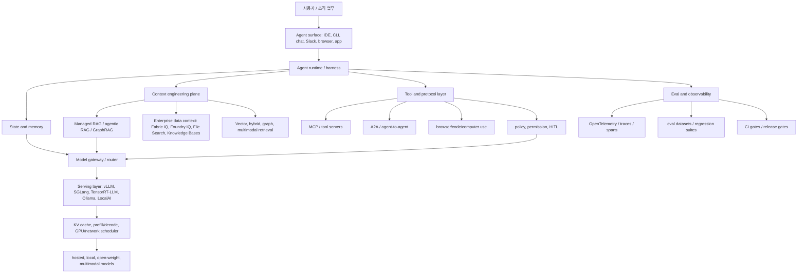
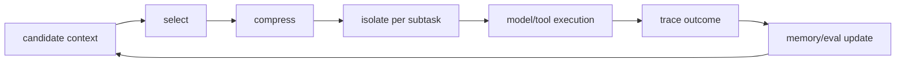
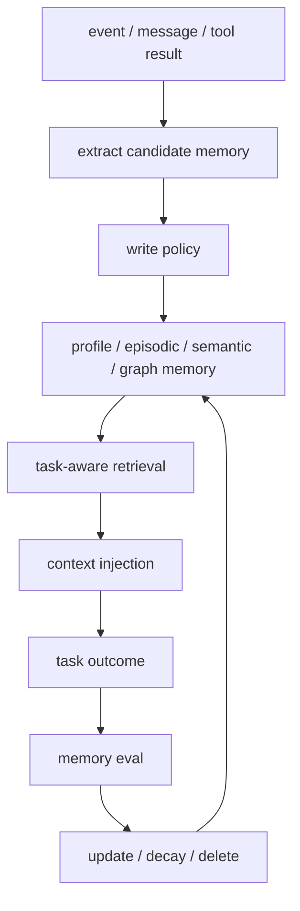
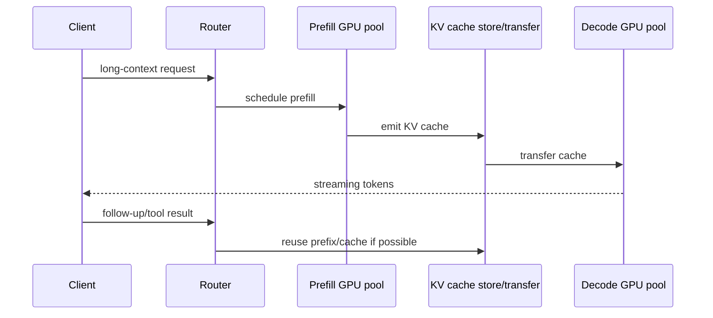
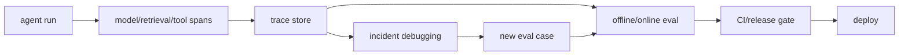

# 2026 최신 자료 레이더: 논문, 빅테크 발표, 에이전트/RAG/로컬 LLM 트렌드

기준일: 2026-06-13 KST.
범위: context engineering, RAG/GraphRAG/agentic RAG, local LLM/vLLM serving, agent memory, eval/observability, MCP/A2A, agent platform/harness.
자료 우선순위: 공식 발표/공식 문서 > arXiv/논문 > 표준 문서 > 산업 분석/시장 기사.
이 문서는 앞선 50개 레포 분석에 "최신 외부 근거"를 추가하는 보강 보고서다.

## 1. 핵심 결론

2026년 6월 기준 최신 흐름은 명확하다. 빅테크와 연구 커뮤니티가 같은 방향을 보고 있다.

1. 모델 API 경쟁에서 agent runtime 경쟁으로 이동했다.
2. context engineering은 prompt 기술이 아니라 runtime data plane, memory, retrieval, tool surface, eval을 묶는 운영 계층이 되었다.
3. RAG는 vector search에서 managed RAG, multimodal file search, dynamic grounding API, agentic RAG로 확장됐다.
4. GraphRAG는 "무조건 다음 단계"가 아니라 dense RAG와 agentic search 대비 비용 대비 효과를 검증해야 하는 선택지가 됐다.
5. local/open model과 hosted frontier model은 양자택일이 아니라 router/gateway 뒤에서 같이 쓰는 방향으로 간다.
6. LLM serving은 vLLM/SGLang/TensorRT-LLM 경쟁을 넘어, disaggregated prefill/decode, KV cache mobility, network-aware scheduling으로 이동한다.
7. memory는 "대화 기록을 길게 넣기"가 아니라 쓰기 정책, 삭제 정책, 평가 benchmark, privacy control이 필요한 별도 계층이다.
8. eval/observability는 dashboard가 아니라 deploy gate, policy control, incident debugging, agent regression harness가 됐다.
9. MCP/A2A/NLWeb 같은 protocol은 agent ecosystem을 여는 동시에 새로운 supply-chain/security surface를 만든다.

## 2. 최신 흐름을 반영한 업데이트된 스택 지도

이 지도에서 중요한 변화는 `Context`와 `Eval`이 부가 기능이 아니라 중심 control plane이 되었다는 점이다. 2024-2025년에는 "어떤 모델을 쓰는가"가 질문이었다면, 2026년에는 "agent가 어떤 context를 어떤 권한으로 가져오고, 무엇을 trace하고, 어떤 gate를 통과해야 action 하는가"가 질문이다.

## 3. 빅테크 공식 발표에서 보이는 신호

### OpenAI: Responses API, Agents SDK, Codex plugin, internal data agent

공식 자료:

- [New tools for building agents](https://openai.com/index/new-tools-for-building-agents/)
- [Agents SDK docs](https://developers.openai.com/api/docs/guides/agents)
- [Web search tool docs](https://developers.openai.com/api/docs/guides/tools-web-search)
- [Inside OpenAI's in-house data agent](https://openai.com/index/inside-our-in-house-data-agent/)
- [Codex for every role, tool, and workflow](https://openai.com/index/codex-for-every-role-tool-workflow/)
- [Dreaming: Better memory for a more helpful ChatGPT](https://openai.com/index/chatgpt-memory-dreaming/)

핵심 신호:

- Responses API는 tool use, file search, web search, computer use, tracing/evals를 한 API primitive로 묶는다.
- Agents SDK 문서는 application이 orchestration, tool execution, approvals, state를 소유할 때 SDK를 쓰라고 분리한다.
- OpenAI의 in-house data agent 발표는 enterprise data agent의 실제 구조를 보여준다. 핵심은 table-level knowledge, product/organizational context, memory, semantic/exact retrieval, Codex/MCP entrypoints다.
- Codex의 2026년 발표는 role-specific plugin, Sites, annotations를 내세운다. 즉 coding agent가 knowledge-work agent surface로 확장되고 있다.

아키텍처 영향:

- OpenAI stack에서는 `Responses API`가 simple agent primitive, `Agents SDK`가 orchestration primitive, `Codex/plugin`이 role/workflow primitive다.
- RAG는 별도 vector DB만의 문제가 아니라 file search, web search, memory, MCP connector, evals와 결합된 hosted context layer가 된다.
- internal data agent 사례는 "RAG + SQL + institutional knowledge + memory + permission"을 하나의 agent data plane으로 설계해야 함을 보여준다.

### Anthropic: context engineering, containment, MCP, long-running harness

공식 자료:

- [Effective context engineering for AI agents](https://www.anthropic.com/engineering/effective-context-engineering-for-ai-agents)
- [Effective harnesses for long-running agents](https://www.anthropic.com/engineering/effective-harnesses-for-long-running-agents)
- [Code execution with MCP: building more efficient AI agents](https://www.anthropic.com/engineering/code-execution-with-mcp)
- [How we contain Claude across products](https://www.anthropic.com/engineering/how-we-contain-claude)
- [Anthropic Engineering index](https://www.anthropic.com/engineering)
- [Introducing Claude Opus 4.7](https://www.anthropic.com/news/claude-opus-4-7)

핵심 신호:

- Anthropic은 context engineering을 "매 step마다 context window에 무엇을 넣을지 고르는 문제"로 공식화했다.
- MCP tool이 수백/수천 개로 늘어나면 tool definition과 중간 결과가 context window를 잡아먹는다. Anthropic은 code execution을 통해 on-demand tool loading, filtering, complex logic execution을 제안한다.
- 2026년 containment 글은 agent가 커질수록 blast radius를 줄이는 것이 핵심 engineering 문제가 된다고 본다.
- Opus 4.7 발표는 long-running coding workflows, file-system memory, higher effort control, prompt/harness retuning을 강조한다.

아키텍처 영향:

- MCP는 tool catalog를 전부 prompt에 넣는 방식으로 쓰면 실패한다. tool discovery, narrowing, code execution, permission boundary가 필요하다.
- agent runtime은 `brain`이 아니라 sandbox, state, permission, compaction, retry, human approval을 포함한 harness다.
- model upgrade 때 prompt만 바꾸는 것이 아니라 harness/eval도 재조정해야 한다. Opus 4.7의 tokenizer/effort/token usage 변화처럼 모델 특성이 runtime budget에 영향을 준다.

### Google: Gemini API managed agents, multimodal File Search, enterprise Agent Platform

공식 자료:

- [I/O 2026 developer highlights](https://blog.google/innovation-and-ai/technology/developers-tools/google-io-2026-developer-highlights/)
- [Gemini Enterprise Agent Platform](https://cloud.google.com/blog/products/ai-machine-learning/introducing-gemini-enterprise-agent-platform)
- [Gemini API File Search is now multimodal](https://blog.google/innovation-and-ai/technology/developers-tools/expanded-gemini-api-file-search-multimodal-rag/)
- [Gemini Embedding 2](https://blog.google/innovation-and-ai/models-and-research/gemini-models/gemini-embedding-2/)
- [Agent2Agent protocol announcement](https://developers.googleblog.com/en/a2a-a-new-era-of-agent-interoperability/)

핵심 신호:

- I/O 2026 발표는 prompt에서 action으로 이동한다고 설명하고, Gemini API Managed Agents를 Linux code execution environment와 결합한다.
- File Search는 multimodal support, custom metadata, page-level citations로 확장됐다. RAG가 텍스트 chunk만이 아니라 image/text/document mixed corpus를 다루기 시작한 것이다.
- Gemini Enterprise Agent Platform은 Vertex AI의 모델 선택, 모델 빌드, agent build, integration, DevOps, orchestration, security를 한 platform으로 묶는다.
- A2A는 agent-to-agent interoperability를 표준화하려는 시도다. MCP가 tool/data 연결이라면 A2A는 agent 사이 협업 protocol에 가깝다.

아키텍처 영향:

- managed RAG는 단순 file upload가 아니라 multimodal embedding, metadata, page citation까지 포함한다.
- agent platform은 model platform과 data platform, DevOps, security가 합쳐진다.
- multi-agent는 framework 내부 pattern이 아니라 vendor/organization 사이 protocol 문제가 된다.

### Microsoft: Foundry IQ, Fabric IQ, enterprise data context

공식 자료:

- [Build 2026: Building agentic apps with Microsoft Fabric and Microsoft Databases](https://azure.microsoft.com/en-us/blog/microsoft-build-2026-building-agentic-apps-with-microsoft-fabric-and-microsoft-databases/)
- [Build and scale AI agents with Microsoft Foundry](https://azure.microsoft.com/en-us/blog/microsoft-foundry-scale-innovation-on-a-modular-interoperable-and-secure-agent-stack/)
- [Responses API and Computer-Using Agent in Azure AI Foundry](https://azure.microsoft.com/en-us/blog/announcing-the-responses-api-and-computer-using-agent-in-azure-ai-foundry/)
- [Deep Research in Azure AI Foundry Agent Service](https://azure.microsoft.com/en-us/blog/introducing-deep-research-in-azure-ai-foundry-agent-service/)

핵심 신호:

- Microsoft Build 2026 메시지는 "모델 능력보다 일관된 shared data context가 병목"이라는 점을 전면에 둔다.
- Fabric은 organizational context의 foundation으로 OneLake, semantic model, ontology, operational intelligence를 묶는다.
- Foundry IQ는 RAG를 one-time lookup이 아니라 dynamic reasoning process로 재정의한다. cross-source grounding, no upfront indexing, iterative retrieval, reflection, permission/data classification을 포함한다.
- Rayfin은 agent가 만든 app이 production backend, auth, data model, policy를 바로 갖추도록 하는 방향이다.

아키텍처 영향:

- enterprise RAG는 "문서 검색"이 아니라 business semantic layer, ontology, permissions, data classification 문제다.
- 데이터 플랫폼이 agent platform의 context source가 된다. LangChain/LlamaIndex/Haystack 같은 framework도 이 enterprise context layer를 붙여야 한다.
- agent-created application에는 backend generation뿐 아니라 identity, policy, observability, data governance가 함께 필요하다.

### AWS: Bedrock AgentCore가 runtime, memory, observability, eval, policy를 묶음

공식 자료:

- [Amazon Bedrock AgentCore Memory](https://aws.amazon.com/blogs/machine-learning/amazon-bedrock-agentcore-memory-building-context-aware-agents/)
- [AgentCore quality evaluations and policy controls](https://aws.amazon.com/blogs/aws/amazon-bedrock-agentcore-adds-quality-evaluations-and-policy-controls-for-deploying-trusted-ai-agents/)
- [AgentOps with Amazon Bedrock AgentCore](https://aws.amazon.com/blogs/machine-learning/agentops-operationalize-agentic-ai-at-scale-with-amazon-bedrock-agentcore/)
- [Building multi-tenant agents with Amazon Bedrock AgentCore](https://aws.amazon.com/blogs/machine-learning/building-multi-tenant-agents-with-amazon-bedrock-agentcore/)
- [Introducing Amazon Bedrock AgentCore](https://aws.amazon.com/blogs/aws/introducing-amazon-bedrock-agentcore-securely-deploy-and-operate-ai-agents-at-any-scale/)

핵심 신호:

- AgentCore는 Runtime, Memory, Observability, Identity, Gateway, Browser, Code Interpreter를 agent production primitives로 둔다.
- eval과 policy control이 "나중에 붙이는 도구"가 아니라 trusted agent deployment의 핵심 기능으로 들어갔다.
- AgentOps 글은 traces, cost, latency, tokens, metadata를 CloudWatch/OpenTelemetry로 보는 구조와 PII redaction, IAM access control을 강조한다.
- multi-tenant agent 글은 tenant isolation, identity, observability, data isolation, cost attribution, noisy-neighbor mitigation을 agent architecture의 기본 문제로 본다.

아키텍처 영향:

- SaaS agent는 memory/retrieval보다 먼저 tenant boundary를 설계해야 한다.
- open-source stack으로 비슷한 구조를 만들려면 `runtime isolation + memory store + LiteLLM gateway + Phoenix/Langfuse + policy/HITL + eval gate` 조합이 필요하다.

### NVIDIA: Dynamo, KV cache, disaggregated serving, multimodal open sub-agents

공식 자료:

- [NVIDIA Dynamo](https://developer.nvidia.com/blog/introducing-nvidia-dynamo-a-low-latency-distributed-inference-framework-for-scaling-reasoning-ai-models/)
- [KV cache bottlenecks with NVIDIA Dynamo](https://developer.nvidia.com/blog/how-to-reduce-kv-cache-bottlenecks-with-nvidia-dynamo/)
- [NVIDIA Nemotron 3 Nano Omni](https://developer.nvidia.com/blog/nvidia-nemotron-3-nano-omni-powers-multimodal-agent-reasoning-in-a-single-efficient-open-model/)
- [LLM inference benchmarking fundamentals](https://developer.nvidia.com/blog/llm-benchmarking-fundamental-concepts/)
- [TensorRT-LLM docs](https://nvidia.github.io/TensorRT-LLM/)

핵심 신호:

- Dynamo는 vLLM, SGLang, TensorRT-LLM 같은 engine 위에서 distributed inference orchestration을 담당한다.
- 핵심 최적화는 disaggregated prefill/decode, dynamic GPU scheduling, LLM-aware routing, async GPU transfer, KV cache offload다.
- Nemotron 3 Nano Omni는 multimodal sub-agent를 위한 open model로 포지셔닝된다. vLLM/SGLang/TensorRT-LLM/Dynamo deployment recipes를 함께 제공한다.
- NVIDIA는 model, inference engine, benchmark, NIM microservice, cluster orchestration까지 full stack으로 묶는다.

아키텍처 영향:

- vLLM/SGLang/TensorRT-LLM만 고르는 것으로 끝나지 않는다. 대규모 serving에서는 KV cache가 network/storage/scheduler 문제로 변한다.
- multimodal agent는 단일 거대 모델 하나보다 perception sub-agent, planning model, execution model로 나누는 modular architecture가 실용적이다.

### Cloudflare: AutoRAG, NLWeb, agentic web

공식 자료:

- [AutoRAG on Cloudflare](https://blog.cloudflare.com/introducing-autorag-on-cloudflare/)
- [Conversational search with NLWeb and AutoRAG](https://blog.cloudflare.com/conversational-search-with-nlweb-and-autorag/)
- [Cloudflare Agents MCP docs](https://developers.cloudflare.com/agents/model-context-protocol/)

핵심 신호:

- AutoRAG는 R2, Vectorize, Workers AI, AI Gateway를 묶어 managed RAG를 제공한다.
- NLWeb + AutoRAG는 웹사이트를 people과 trusted agents가 자연어로 query할 수 있는 endpoint로 바꾸려 한다.
- `/ask` endpoint와 `/mcp` endpoint가 같이 등장한다. 즉 website가 사람용 검색 UI와 agent용 structured interface를 동시에 제공하는 방향이다.

아키텍처 영향:

- future web content는 HTML page만이 아니라 agent-queryable endpoint를 함께 제공할 가능성이 크다.
- RAG pipeline 운영 부담은 platform으로 흡수되고, 차별점은 data freshness, policy, access control, source attribution으로 이동한다.

### Meta, GitHub: consumer/business agent와 coding-agent governance

공식 자료:

- [Meta Business Agent](https://about.fb.com/news/2026/06/meta-business-agent/)
- [Muse Spark](https://ai.meta.com/blog/introducing-muse-spark-msl/)
- [Llama 4](https://ai.meta.com/blog/llama-4-multimodal-intelligence/)
- [GitHub Copilot CLI enhanced agents and context management](https://github.blog/changelog/2026-01-14-github-copilot-cli-enhanced-agents-context-management-and-new-ways-to-install/)
- [Secret scanning in AI coding agents via GitHub MCP Server](https://github.blog/changelog/2026-03-17-secret-scanning-in-ai-coding-agents-via-the-github-mcp-server/)
- [Agent HQ](https://github.blog/news-insights/company-news/welcome-home-agents/)

핵심 신호:

- Meta Business Agent는 customer-facing business operations agent를 messaging surfaces에 붙인다. catalog, lead qualification, appointments, sales, handoff, enterprise guardrails를 포함한다.
- Muse Spark는 tool-use, visual chain-of-thought, multi-agent orchestration, parallel reasoning mode를 전면에 둔다.
- Llama 4는 open-weight, native multimodal, MoE, long context, single-H100 deployment를 강조한다.
- GitHub Copilot CLI는 built-in custom agents, context compaction, context visualization, MCP config, web access controls를 제공한다.
- GitHub MCP secret scanning은 agent가 commit/PR 이전에 security tool을 호출하는 흐름을 보여준다.

아키텍처 영향:

- agent는 "한 앱 안의 기능"이 아니라 messaging, IDE, CLI, browser, business suite에 내장된다.
- agent security는 post-hoc scan이 아니라 development loop 안의 tool call이 된다.
- local/open-weight model은 proprietary agent platform 내부에서도 cost/performance/control 전략으로 계속 중요하다.

## 4. 최신 논문/연구 레이더

| 영역 | 자료 | 날짜/상태 | 핵심 내용 | 설계 영향 |
| --- | --- | --- | --- | --- |
| Context engineering | [A Survey of Context Engineering for Large Language Models](https://arxiv.org/abs/2507.13334) | 2025-07, arXiv v2 | 1400+ papers를 바탕으로 context retrieval/generation, processing, management, RAG, memory, tool reasoning, multi-agent를 하나의 taxonomy로 정리한다. | context engineering을 독립 discipline으로 봐야 한다. RAG, memory, tool selection을 따로 보지 않는다. |
| Agentic RAG | [Agentic Retrieval-Augmented Generation: A Survey on Agentic RAG](https://arxiv.org/html/2501.09136v4) | 2026-04 전후 v4 | static RAG를 넘어 reflection, planning, tool use, multi-agent collaboration이 retrieval 전략을 동적으로 조정하는 흐름을 정리한다. | retriever는 함수 호출 하나가 아니라 agent policy의 일부가 된다. |
| Agentic RAG SoK | [SoK: Agentic RAG](https://arxiv.org/html/2603.07379v1) | 2026-03 | agentic RAG를 sequential decision-making system으로 formalize하고 planning, retrieval orchestration, memory, tool coordination, trajectory-level eval을 다룬다. | RAG 평가는 answer metric만으로 부족하고 retrieval trajectory와 decision policy를 봐야 한다. |
| Agentic retrieval scaling | [A-RAG](https://arxiv.org/html/2602.03442v1) | 2026-02 | model size와 test-time compute에 따라 agentic RAG가 어떻게 scale되는지 다룬다. | "retrieved tokens를 많이 넣기"보다 hierarchical retrieval interface와 compute budget이 중요하다. |
| GraphRAG 검증 | [Do We Still Need GraphRAG?](https://arxiv.org/html/2604.09666v1) | 2026-04 | RAGSearch benchmark로 dense RAG와 GraphRAG를 agentic search setting에서 비교한다. | GraphRAG는 기본값이 아니라 corpus/question type/retrieval budget별로 검증해야 한다. |
| Long-term memory | [LongMemEval-V2](https://arxiv.org/html/2605.12493v1) | 2026-05 | 100M-token급 multimodal web-agent histories로 memory가 specialized environment operator를 만드는지 평가한다. | memory benchmark가 "대화 기억"에서 "경험 있는 동료처럼 행동"하는지로 이동한다. |
| Agent memory survey | [Memory for Autonomous LLM Agents](https://arxiv.org/html/2603.07670v1) | 2026-03 | autonomous software agents에서 memory mechanism, evaluation, frontier를 정리한다. | memory는 RAG cache가 아니라 long-horizon adaptation mechanism이다. |
| Memory architecture | [Memory in the LLM Era](https://arxiv.org/html/2604.01707v1) | 2026-04 | LoCoMo, LongMemEval 등 memory eval categories와 modular architecture를 다룬다. | memory store 선택보다 memory write/read/update/delete lifecycle이 중요하다. |
| LLM/RAG readiness | [Evaluation, Observability, and CI Gates for LLM/RAG Applications](https://arxiv.org/html/2603.27355v2) | 2026-03 | eval을 deployment decision workflow로 만들고 OpenTelemetry, CI quality gates, readiness score를 결합한다. | RAG/agent release는 unit test가 아니라 readiness gate를 통과해야 한다. |
| Agent eval survey | [A Survey on Evaluation of LLM-based Agents](https://arxiv.org/html/2503.16416v2) | 2026-05 v2 | agent eval을 planning/tool use, application benchmarks, generalist agents, benchmark dimensions, developer tools 관점으로 정리한다. | agent eval은 task success와 trajectory quality를 같이 봐야 한다. |
| Harness evolution | [Observability-Driven Automatic Evolution of Coding-Agent Harnesses](https://arxiv.org/html/2604.25850v1) | 2026-04 | observability signal로 coding-agent harness를 자동 개선하는 방향을 탐구한다. | harness가 고정 코드가 아니라 trace/eval feedback으로 진화할 수 있다. |
| Disaggregated serving | [Prefill-as-a-Service](https://arxiv.org/html/2604.15039v1) | 2026-04 | cross-datacenter prefill offload, bandwidth-aware scheduling, cache-aware placement을 다룬다. | long-context serving에서 prefill은 별도 service가 될 수 있다. |
| Network-aware KV routing | [NetKV](https://arxiv.org/html/2606.03910v1) | 2026-06 | disaggregated inference에서 KV cache transfer가 TTFT 예산에 직접 들어가며 network cost oracle이 필요하다고 주장한다. | serving scheduler는 GPU load뿐 아니라 network topology/congestion을 알아야 한다. |
| Multi-round disagg | [Efficient Multi-round LLM Inference over Disaggregated Serving](https://arxiv.org/html/2602.14516v1) | 2026-02 | prefill/decode phase의 compute-bound/memory-bound 차이와 multi-round serving 최적화를 다룬다. | chat/agent workload는 단발 completion보다 KV reuse와 multi-round scheduling이 중요하다. |
| KV compression | [Ultra Fast Lossless KV Compression for Disaggregated LLM Serving](https://arxiv.org/html/2605.01708v1) | 2026-05 | disaggregated serving에서 KV compression/transfer/decompression pipeline을 다룬다. | KV cache는 memory뿐 아니라 bandwidth/storage artifact로 취급해야 한다. |
| Evolving contexts | [Evolving Contexts for Self-Improving Language Models](https://arxiv.org/abs/2510.04618) | 2025-10 | ACE가 context를 evolving playbook으로 다룬다. | prompts/instructions/memory가 runtime feedback으로 진화하는 방향을 보여준다. |

## 5. 기술 트렌드별 해석

### 5.1 Context engineering은 "정보 페이로드 최적화"다

Context engineering survey는 context retrieval, generation, processing, management를 foundational component로 본다. Anthropic과 LangChain의 engineering 글도 같은 방향이다. 실무적으로는 다음 4개 질문으로 떨어진다.

1. 무엇을 가져올 것인가: RAG, web search, file search, memory, database, tool output.
2. 무엇을 버릴 것인가: stale context, irrelevant tool, 중복 retrieved chunk, 불필요한 history.
3. 어디에 저장할 것인가: session state, long-term memory, vector store, graph, file-system notes.
4. 어떻게 검증할 것인가: citation, trace, eval, human review, policy gate.

기존 보고서의 50개 레포에 대응하면:

- `mem0`, `Zep`: persistent memory.
- `LlamaIndex`, `LangChain`, `Haystack`: retrieval/context assembly.
- `GraphRAG`, `LightRAG`: graph/global context.
- `Ragas`, `Promptfoo`, `Phoenix`, `Langfuse`: validation/trace.
- `LiteLLM`, `Guardrails`, `Pydantic AI`, `HumanLayer`: model/action contract.

### 5.2 RAG는 managed, multimodal, dynamic, agentic으로 이동한다

Google File Search, OpenAI file search, Microsoft Foundry IQ, AWS Knowledge Bases/AgentCore, Cloudflare AutoRAG 모두 같은 방향이다. RAG를 개별 app 개발자가 매번 vector DB glue code로 만드는 대신 platform이 ingestion, chunking, embedding, metadata, citation, observability를 흡수한다.

중요 변화:

- text-only에서 image/text/document multimodal retrieval로 확장.
- top-k dense retrieval에서 metadata, page citation, iterative retrieval, reflection, permission-aware grounding으로 이동.
- static retrieval에서 agentic retrieval policy로 이동.
- vector DB 선택보다 data freshness, source attribution, ACL, trace가 중요해짐.

실무 결론:

- 사내 문서 RAG는 `RAGFlow/Haystack/LlamaIndex + Qdrant/Weaviate/pgvector`만으로 끝나지 않는다.
- 반드시 `permission-aware retrieval`, `citation`, `retrieval eval`, `trace privacy`, `document update cycle`을 설계해야 한다.
- GraphRAG는 global reasoning이 필요한 corpus에만 비용을 정당화하기 쉽다.

### 5.3 Agent memory는 "긴 context"가 아니라 별도 제품 계층이다

OpenAI memory, AWS AgentCore Memory, Anthropic file-system memory, mem0/Zep, LongMemEval-V2가 같은 흐름을 만든다. memory는 대화 기록을 그대로 넣는 것이 아니라 다음 lifecycle을 가진다.

위험:

- 잘못된 memory가 장기 오염된다.
- 사용자가 잊히길 원하는 정보가 남는다.
- retrieval memory와 source-of-truth document가 충돌한다.
- memory benchmark가 쉬운 context recall test로 변질될 수 있다.

따라서 memory 설계에는 write policy, deletion policy, scope, tenant isolation, trace redaction, benchmark가 필요하다.

### 5.4 LLM serving은 KV cache와 network가 중심 병목이 된다

vLLM, SGLang, TensorRT-LLM, Dynamo, Mooncake 계열 연구가 모두 같은 문제를 본다. long-context와 agent workload는 prompt가 길고 multi-turn이며, tool call 이후 재호출이 많다. 이때 bottleneck은 raw FLOPS만이 아니다.

핵심 개념:

- prefill: 입력 전체를 처리해 KV cache를 만든다. compute-bound.
- decode: token을 하나씩 생성한다. memory bandwidth-bound.
- disaggregated serving: prefill과 decode를 다른 GPU/node에서 돌린다.
- KV cache transfer: 분리의 이득을 network transfer가 잡아먹을 수 있다.
- prefix/cache reuse: agent/tool loop의 반복 context를 재사용할 수 있다.

실무 결론:

- vLLM의 disaggregated prefill이 experimental이며 throughput 개선이 아니라 TTFT/ITL 분리와 tail latency control 목적이라는 점을 기억해야 한다.
- GPU load-balancing만으로는 부족하고 network topology, prefix locality, KV cache location이 scheduler input이 된다.
- local/Ollama와 production/vLLM은 같은 계층이 아니다. 로컬 UX와 large-scale serving은 선택 기준이 완전히 다르다.

### 5.5 Eval/observability는 release gate가 된다

AWS AgentCore, OpenAI tracing/evals, Phoenix, Langfuse, OpenTelemetry GenAI semantic conventions, Ragas/Promptfoo/DeepEval 모두 eval/trace를 agent runtime의 중앙에 둔다.

OpenTelemetry GenAI semantic conventions는 model call, token counts, prompts/completions/tool calls/tool results 같은 telemetry shape를 표준화한다. Cloud/AWS/GitHub/OpenAI/Anthropic 방향과 결합하면 다음 구조가 자연스럽다.

실무 결론:

- RAG answer quality는 `retrieval hit rate`, `faithfulness`, `citation correctness`, `latency`, `cost`, `policy compliance`를 같이 봐야 한다.
- agent quality는 final answer만이 아니라 trajectory, tool call correctness, rollback/retry, approval events, error recovery를 봐야 한다.
- trace에는 민감정보가 들어가므로 PII redaction, retention, sampling, RBAC가 필요하다.

### 5.6 Protocol 표준화는 생산성과 공격면을 동시에 키운다

MCP, A2A, NLWeb은 모두 "agent가 외부 세계와 연결되는 방식"을 표준화한다.

- MCP: model/agent와 tool/data source 연결.
- A2A: agent와 agent 사이의 discovery, coordination, action delegation.
- NLWeb: website가 natural-language query endpoint와 MCP server처럼 동작.

장점:

- one-off integration 감소.
- tool ecosystem 증가.
- agent가 web/app/data source를 structured 방식으로 호출 가능.

위험:

- tool permission이 넓어질수록 blast radius 증가.
- MCP server supply-chain 위험.
- prompt injection이 tool invocation으로 이어질 가능성.
- agent-to-agent delegation에서 책임 소재와 audit trail이 흐려질 수 있음.

GitHub의 MCP secret scanning은 좋은 방향의 예다. 위험한 action 이전에 보안 tool을 agent loop 안으로 넣는다.

## 6. 앞선 50개 레포 분석에 대한 업데이트

| 기존 레포/계층 | 최신 자료가 주는 추가 해석 |
| --- | --- |
| `vllm`, `sglang`, `TensorRT-LLM` | 단일 engine 비교에서 `Dynamo`, `disagg prefill`, `KV cache transfer`, `network-aware scheduler`까지 봐야 한다. |
| `ollama`, `llama.cpp`, `LocalAI`, `Xinference` | local/private의 중요성은 유지된다. 다만 production agent는 gateway/eval/memory/permission을 붙여야 한다. |
| `GraphRAG`, `LightRAG` | GraphRAG는 비용 있는 선택지다. RAGSearch 같은 benchmark 흐름 때문에 dense RAG + agentic search와 비교가 필요하다. |
| `LlamaIndex`, `LangChain`, `Haystack` | framework는 "RAG library"에서 context orchestration plane으로 봐야 한다. |
| `mem0`, `Zep` | memory는 product differentiator가 됐지만 privacy/poisoning/deletion policy 없이는 위험하다. |
| `Qdrant`, `Milvus`, `Weaviate`, `Chroma`, `LanceDB`, `pgvector` | vector DB 선택보다 hybrid retrieval, ACL, freshness, multimodal metadata, citation pipeline이 더 중요해졌다. |
| `Ragas`, `Promptfoo`, `DeepEval`, `TruLens` | eval은 local dev tool에서 release gate로 올라간다. CI와 production traces를 연결해야 한다. |
| `Phoenix`, `Langfuse`, `Agenta`, `Promptflow` | observability는 prompt log가 아니라 OpenTelemetry-compatible trace, dataset, eval, incident loop가 되어야 한다. |
| `LiteLLM` | multi-model routing은 cost optimization뿐 아니라 policy, fallback behavior, local/hosted mix를 통제하는 gateway다. |
| `Guardrails`, `Pydantic AI`, `HumanLayer` | containment, policy control, HITL이 빅테크 공통 주제가 되면서 이 계층의 중요성이 커졌다. |

## 7. 2026년 중반 기준 채택 전략

### 개인/소규모 local-first

- `Ollama` 또는 `llama.cpp`로 local model UX를 확보한다.
- `Chroma/LanceDB/pgvector`로 단순 retrieval을 시작한다.
- `Promptfoo` 또는 `DeepEval`로 작은 regression suite를 만든다.
- memory는 일단 off-by-default로 두고, 사용자 승인 기반으로 저장한다.

### 회사 내부 RAG/knowledge assistant

- `RAGFlow/Haystack/LlamaIndex` 중 하나를 ingestion/retrieval orchestration 계층으로 둔다.
- `Qdrant/Weaviate/pgvector` 중 조직 운영 모델에 맞는 store를 고른다.
- `Phoenix/Langfuse`로 traces를 남기고, `Ragas/DeepEval`로 retrieval/generation을 분리 평가한다.
- ACL, data classification, citation, trace masking을 필수 요구사항으로 둔다.

### 고성능 model serving

- online serving은 `vLLM/SGLang/TensorRT-LLM` 중 hardware/model support 기준으로 선택한다.
- long-context workload가 있으면 prefill/decode 분리, prefix cache, KV transfer overhead를 benchmark한다.
- `GenAI-Perf`, engine-native metrics, p95/p99 TTFT/ITL을 함께 본다.
- 모델 router/gateway는 `LiteLLM` 같은 계층으로 분리해 fallback/cost/policy를 통제한다.

### production action agent

- agent runtime은 sandbox, tool permission, state, compaction, retry, approval, trace를 포함해야 한다.
- MCP tool은 allowlist/permission/review를 통과해야 하고, tool definition을 무조건 context에 넣지 않는다.
- `HumanLayer`류 승인, `Guardrails`/schema validation, GitHub secret scanning 같은 pre-action checks를 넣는다.
- release는 eval gate와 manual review gate를 분리한다.

## 8. 충돌하는 이론과 아직 불확실한 지점

| 쟁점 | 한쪽 주장 | 반대/주의 | 현재 판단 |
| --- | --- | --- | --- |
| Long context vs RAG | context window가 커지면 retrieval이 덜 필요하다. | 긴 context는 비용, latency, lost-in-the-middle, privacy 문제가 있다. | RAG는 사라지지 않고 context selection layer로 이동한다. |
| GraphRAG 필요성 | graph가 전역 관계와 explainability를 준다. | indexing cost와 graph hallucination이 크고 dense RAG + agentic search가 대체할 수 있다. | corpus/question별 benchmark 후 선택해야 한다. |
| Memory 자동화 | agent가 자동으로 배운 memory가 생산성을 높인다. | stale/poisoned/private memory가 장기 위험이 된다. | write policy와 deletion/audit 없는 memory는 위험하다. |
| Managed platform vs OSS stack | AWS/Google/Microsoft/OpenAI가 runtime과 RAG를 관리하면 편하다. | vendor lock-in, data residency, cost control, custom policy 한계가 있다. | enterprise는 managed와 OSS hybrid가 현실적이다. |
| Disaggregated serving | prefill/decode 분리로 large-scale efficiency가 오른다. | KV transfer/network overhead가 이득을 상쇄할 수 있다. | long-context/high-load 환경에서만 workload benchmark가 필요하다. |
| MCP/A2A 표준화 | integration 비용이 줄고 ecosystem이 열린다. | supply-chain, permission, audit, auth complexity가 증가한다. | protocol adoption은 필수 흐름이지만 security wrapper가 필요하다. |

## 9. 앞으로 계속 추적할 자료

1. vLLM disaggregated prefill의 experimental 상태가 production-ready로 올라오는지.
2. SGLang router/gateway와 Mooncake/KV cache store integration의 실제 운영 사례.
3. GraphRAG vs dense RAG + agentic search benchmark의 후속 결과.
4. LongMemEval-V2, BEAM, LoCoMo 계열 memory benchmark의 데이터 품질 논쟁.
5. OpenTelemetry GenAI semantic conventions의 vendor adoption.
6. MCP security advisories, auth/authorization spec 변화, registry trust model.
7. A2A protocol의 실제 multi-vendor agent deployment.
8. Google/Microsoft/AWS managed RAG의 ACL/citation/eval 기능 확장.
9. OpenAI/Anthropic/GitHub coding agent의 containment, permission, eval report.
10. open-weight multimodal/MoE model이 local/private agent에 들어가는 속도.

## 10. 자료 카탈로그

### Big Tech / 공식 발표

- OpenAI, New tools for building agents: <https://openai.com/index/new-tools-for-building-agents/>
- OpenAI, Agents SDK docs: <https://developers.openai.com/api/docs/guides/agents>
- OpenAI, Web search tool docs: <https://developers.openai.com/api/docs/guides/tools-web-search>
- OpenAI, Inside in-house data agent: <https://openai.com/index/inside-our-in-house-data-agent/>
- OpenAI, Codex for every role, tool, and workflow: <https://openai.com/index/codex-for-every-role-tool-workflow/>
- OpenAI, Better memory for ChatGPT: <https://openai.com/index/chatgpt-memory-dreaming/>
- Anthropic, Effective context engineering: <https://www.anthropic.com/engineering/effective-context-engineering-for-ai-agents>
- Anthropic, Effective harnesses for long-running agents: <https://www.anthropic.com/engineering/effective-harnesses-for-long-running-agents>
- Anthropic, Code execution with MCP: <https://www.anthropic.com/engineering/code-execution-with-mcp>
- Anthropic, How we contain Claude: <https://www.anthropic.com/engineering/how-we-contain-claude>
- Anthropic, Claude Opus 4.7: <https://www.anthropic.com/news/claude-opus-4-7>
- Google, I/O 2026 developer highlights: <https://blog.google/innovation-and-ai/technology/developers-tools/google-io-2026-developer-highlights/>
- Google, Gemini Enterprise Agent Platform: <https://cloud.google.com/blog/products/ai-machine-learning/introducing-gemini-enterprise-agent-platform>
- Google, Gemini API File Search multimodal: <https://blog.google/innovation-and-ai/technology/developers-tools/expanded-gemini-api-file-search-multimodal-rag/>
- Google, Gemini Embedding 2: <https://blog.google/innovation-and-ai/models-and-research/gemini-models/gemini-embedding-2/>
- Google, A2A protocol: <https://developers.googleblog.com/en/a2a-a-new-era-of-agent-interoperability/>
- Microsoft, Build 2026 Fabric and Databases: <https://azure.microsoft.com/en-us/blog/microsoft-build-2026-building-agentic-apps-with-microsoft-fabric-and-microsoft-databases/>
- Microsoft, Foundry modular agent stack: <https://azure.microsoft.com/en-us/blog/microsoft-foundry-scale-innovation-on-a-modular-interoperable-and-secure-agent-stack/>
- Microsoft, Deep Research in Azure AI Foundry: <https://azure.microsoft.com/en-us/blog/introducing-deep-research-in-azure-ai-foundry-agent-service/>
- AWS, AgentCore Memory: <https://aws.amazon.com/blogs/machine-learning/amazon-bedrock-agentcore-memory-building-context-aware-agents/>
- AWS, AgentCore evaluations and policy controls: <https://aws.amazon.com/blogs/aws/amazon-bedrock-agentcore-adds-quality-evaluations-and-policy-controls-for-deploying-trusted-ai-agents/>
- AWS, AgentOps with AgentCore: <https://aws.amazon.com/blogs/machine-learning/agentops-operationalize-agentic-ai-at-scale-with-amazon-bedrock-agentcore/>
- AWS, Multi-tenant agents with AgentCore: <https://aws.amazon.com/blogs/machine-learning/building-multi-tenant-agents-with-amazon-bedrock-agentcore/>
- NVIDIA, Dynamo: <https://developer.nvidia.com/blog/introducing-nvidia-dynamo-a-low-latency-distributed-inference-framework-for-scaling-reasoning-ai-models/>
- NVIDIA, KV cache bottlenecks: <https://developer.nvidia.com/blog/how-to-reduce-kv-cache-bottlenecks-with-nvidia-dynamo/>
- NVIDIA, Nemotron 3 Nano Omni: <https://developer.nvidia.com/blog/nvidia-nemotron-3-nano-omni-powers-multimodal-agent-reasoning-in-a-single-efficient-open-model/>
- NVIDIA, LLM inference benchmarking: <https://developer.nvidia.com/blog/llm-benchmarking-fundamental-concepts/>
- Cloudflare, AutoRAG: <https://blog.cloudflare.com/introducing-autorag-on-cloudflare/>
- Cloudflare, NLWeb and AutoRAG: <https://blog.cloudflare.com/conversational-search-with-nlweb-and-autorag/>
- Cloudflare, MCP docs: <https://developers.cloudflare.com/agents/model-context-protocol/>
- Meta, Business Agent: <https://about.fb.com/news/2026/06/meta-business-agent/>
- Meta, Muse Spark: <https://ai.meta.com/blog/introducing-muse-spark-msl/>
- Meta, Llama 4: <https://ai.meta.com/blog/llama-4-multimodal-intelligence/>
- GitHub, Copilot CLI agents/context management: <https://github.blog/changelog/2026-01-14-github-copilot-cli-enhanced-agents-context-management-and-new-ways-to-install/>
- GitHub, MCP secret scanning: <https://github.blog/changelog/2026-03-17-secret-scanning-in-ai-coding-agents-via-the-github-mcp-server/>
- GitHub, Agent HQ: <https://github.blog/news-insights/company-news/welcome-home-agents/>

### 논문 / 연구

- A Survey of Context Engineering for Large Language Models: <https://arxiv.org/abs/2507.13334>
- Agentic Retrieval-Augmented Generation survey: <https://arxiv.org/html/2501.09136v4>
- SoK: Agentic RAG: <https://arxiv.org/html/2603.07379v1>
- A-RAG: <https://arxiv.org/html/2602.03442v1>
- Do We Still Need GraphRAG?: <https://arxiv.org/html/2604.09666v1>
- LongMemEval-V2: <https://arxiv.org/html/2605.12493v1>
- Memory for Autonomous LLM Agents: <https://arxiv.org/html/2603.07670v1>
- Memory in the LLM Era: <https://arxiv.org/html/2604.01707v1>
- Evaluation, Observability, and CI Gates for LLM/RAG Applications: <https://arxiv.org/html/2603.27355v2>
- A Survey on Evaluation of LLM-based Agents: <https://arxiv.org/html/2503.16416v2>
- Observability-Driven Automatic Evolution of Coding-Agent Harnesses: <https://arxiv.org/html/2604.25850v1>
- Prefill-as-a-Service: <https://arxiv.org/html/2604.15039v1>
- NetKV: <https://arxiv.org/html/2606.03910v1>
- Efficient Multi-round LLM Inference over Disaggregated Serving: <https://arxiv.org/html/2602.14516v1>
- Ultra Fast Lossless KV Compression for Disaggregated LLM Serving: <https://arxiv.org/html/2605.01708v1>
- Evolving Contexts for Self-Improving Language Models: <https://arxiv.org/abs/2510.04618>

### 표준 / protocol / observability

- OpenTelemetry GenAI semantic conventions: <https://opentelemetry.io/docs/specs/semconv/gen-ai/>
- OpenTelemetry, GenAI observability blog: <https://opentelemetry.io/blog/2026/genai-observability/>
- Model Context Protocol specification: <https://modelcontextprotocol.io/specification/2025-03-26>
- MCP authorization guide: <https://modelcontextprotocol.io/docs/tutorials/security/authorization>
- A2A GitHub project: <https://github.com/a2aproject/A2A>
- vLLM disaggregated prefill docs: <https://docs.vllm.ai/en/latest/features/disagg_prefill/>
