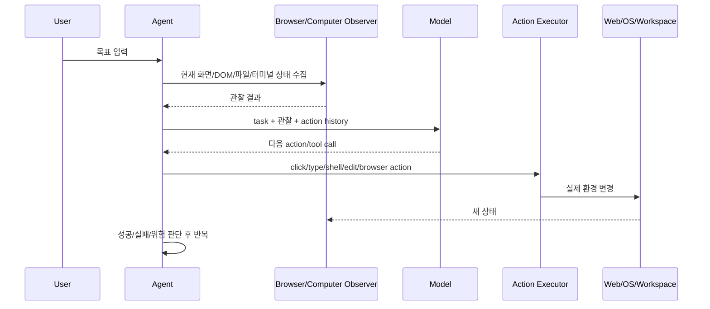
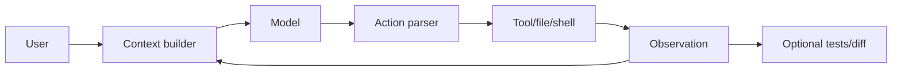
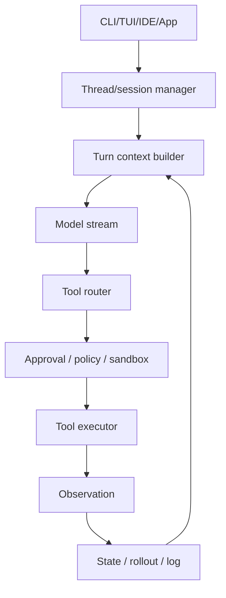
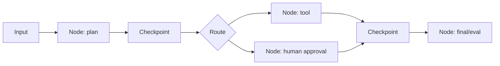
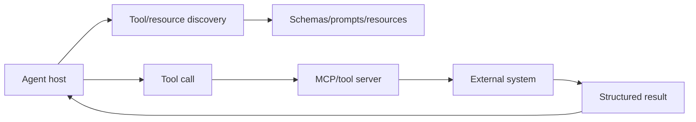

# 30개 오픈소스 AI 코딩/에이전트 프로젝트 비교 분류 보고서

기준일: 2026-06-11 KST.  
기반 자료: `reports/repositories/*.md` 30개 상세 분석, `data/source-inventory.json`, `data/project-comparison-matrix.json`.

이 문서는 각 레포지토리의 세부 구현을 반복하지 않고, 사용자가 실제 설계 판단을 할 때 필요한 비교 축으로 재배열한다. 핵심 결론은 다음과 같다.

1. 이 30개는 모두 "AI 코딩 에이전트"로 보이지만 같은 층위의 제품이 아니다. 완제품 CLI/IDE agent, agent runtime framework, tool/context infrastructure, browser/computer-use harness, benchmark repair harness, vendor-agent workflow layer가 섞여 있다.
2. 가장 중요한 차이는 모델이 아니라 harness다. 어떤 프로젝트가 더 강한지는 "어떤 모델을 호출하는가"보다 "어떤 context를 모으고, 어떤 tool을 허용하고, 어떤 승인/격리/검증 루프를 두는가"로 갈린다.
3. 성숙한 프로젝트일수록 단순 chat loop가 아니라 `context selection -> model turn -> tool routing -> execution guard -> observation -> persistence -> validation`으로 흐름을 분리한다.
4. 위험 역시 기능에서 나온다. shell/file/browser/MCP/OAuth가 강할수록 실제 일을 더 많이 하지만, prompt injection, secret exposure, supply chain, benchmark overfitting, 장기 memory 오염 위험도 같이 커진다.

## 1. 비교 축

| 축 | 봐야 하는 질문 | 강한 구현의 신호 | 위험 신호 |
|---|---|---|---|
| 사용자 표면 | 사용자는 CLI, IDE, 웹 UI, 브라우저 확장, SDK 중 어디에서 쓰는가 | 표면별 권한과 상태가 명확히 분리됨 | 여러 표면이 같은 credential을 불투명하게 공유 |
| 실행 loop | 모델 호출 전후에 무엇이 실행되는가 | tool routing, approval, sandbox, retry, validation이 분리됨 | 모델 출력이 곧 shell/file/browser 실행으로 이어짐 |
| context 전략 | 무엇을 넣고 무엇을 빼는가 | repo map, selected file, checkpoint, memory, retrieval, compaction이 명확함 | "큰 context"만 믿고 noise와 민감정보를 무제한 주입 |
| tool 표면 | 어떤 외부 행동을 할 수 있는가 | tool schema, permission, audit log, idempotency가 있음 | OAuth/shell/browser action의 scope가 과도함 |
| 상태 보존 | 세션/메모리/체크포인트를 어떻게 남기는가 | thread/session/run 단위가 명확하고 삭제/복구 가능 | 장기 memory와 로그에 secret이 남음 |
| 격리/승인 | destructive action을 어떻게 막는가 | sandbox, approval policy, diff review, HITL interrupt가 있음 | extension/hook/plugin이 숨은 실행 경로가 됨 |
| 검증 | 결과가 맞는지 어떻게 확인하는가 | test/lint/benchmark/eval loop와 실패 처리 | final answer만 있고 재현 가능한 검증 없음 |
| 생태계 위치 | 완제품인가, 하부 런타임인가, 인프라인가 | 자신이 담당하는 층위가 좁고 선명함 | SDK/agent/app/infra가 뒤섞여 책임 경계가 불명확 |

## 2. 전체 지도

```mermaid
flowchart TB
    U["사용자 작업 요청"] --> S{"주 표면"}

    S --> CLI["터미널 코딩 에이전트"]
    S --> IDE["IDE 코딩 에이전트"]
    S --> GUI["브라우저/컴퓨터 제어"]
    S --> PERS["개인 상주 에이전트"]
    S --> FW["에이전트 프레임워크"]
    S --> INFRA["Tool/Context 인프라"]
    S --> BENCH["벤치마크/수리 하네스"]
    S --> LAYER["Vendor-agent 운영 레이어"]

    CLI --> C1["openai/codex"]
    CLI --> C2["google-gemini/gemini-cli"]
    CLI --> C3["QwenLM/qwen-code"]
    CLI --> C4["anomalyco/opencode"]
    CLI --> C5["ultraworkers/claw-code"]
    CLI --> C6["aider-ai/aider"]

    IDE --> I1["cline/cline"]
    IDE --> I2["RooCodeInc/Roo-Code"]
    IDE --> I3["Kilo-Org/kilocode"]
    IDE --> I4["continuedev/continue"]
    IDE --> I5["TabbyML/tabby"]

    GUI --> G1["browser-use/browser-use"]
    GUI --> G2["nanobrowser/nanobrowser"]
    GUI --> G3["openinterpreter/open-interpreter"]
    GUI --> G4["All-Hands-AI/OpenHands"]

    PERS --> P1["openclaw/openclaw"]
    PERS --> P2["NousResearch/hermes-agent"]
    PERS --> P3["nesquena/hermes-webui"]
    PERS --> P4["aaif-goose/goose"]

    FW --> F1["microsoft/autogen"]
    FW --> F2["langchain-ai/langgraph"]
    FW --> F3["crewAIInc/crewAI"]
    FW --> F4["agno-agi/agno"]

    INFRA --> T1["modelcontextprotocol/servers"]
    INFRA --> T2["upstash/context7"]
    INFRA --> T3["ComposioHQ/composio"]

    BENCH --> B1["SWE-agent/SWE-agent"]
    BENCH --> B2["All-Hands-AI/OpenHands"]
    BENCH --> B3["aider-ai/aider"]

    LAYER --> L1["Yeachan-Heo/oh-my-claudecode"]
    LAYER --> L2["Yeachan-Heo/oh-my-codex"]
    LAYER --> L3["openai/codex-plugin-cc"]
```

주의할 점은 일부 프로젝트가 두 군에 걸친다는 것이다. 예를 들어 OpenHands는 실제 사용자는 웹 UI/CLI 개발 workspace로 접하지만, 내부적으로는 browser/computer-use와 SWE-bench류 repair harness 성격도 가진다. Aider는 terminal pair programmer지만 benchmark repair agent와도 비교된다. Goose는 general desktop/CLI agent이면서 personal agent 계열과 terminal agent 계열을 연결한다.

## 3. 군별 평가

### 3.1 공식/준공식 터미널 코딩 에이전트

대상: `openai/codex`, `google-gemini/gemini-cli`, `QwenLM/qwen-code`, `anomalyco/opencode`, `ultraworkers/claw-code`, `aider-ai/aider`.

이 군은 사용자가 터미널에서 직접 agent에게 repository를 맡기는 흐름이다. 공통 실행 루프는 `prompt -> repo/file context -> model/tool decision -> file edit/shell command -> observation -> next turn`이다. 차이는 실행 guard와 context 선별 방식에서 난다.

| 프로젝트 | 핵심 철학 | 강점 | 약점/위험 | 가장 가까운 선택지 |
|---|---|---|---|---|
| `openai/codex` | 로컬 thread runtime 위에 모델, tool, sandbox, state, app/MCP를 올린다 | thread/session/turn 구조, `apply_patch` primitive, approval/sandbox 계층 | 권한 matrix와 plugin/skill 표면이 복잡함 | Gemini CLI, Qwen Code, Aider |
| `google-gemini/gemini-cli` | Gemini 대형 context와 공식 CLI 경험을 결합한다 | 큰 context, Google provider 결합, MCP/built-in tool | 큰 context가 noise와 비용을 키울 수 있음 | Codex, Qwen Code |
| `QwenLM/qwen-code` | Qwen 모델에 맞춘 terminal coding agent를 제공한다 | skills/subagents, Qwen 생태계 최적화 | 특정 모델 behavior에 과적합 가능 | Codex, Gemini CLI |
| `anomalyco/opencode` | terminal-native coding UX를 plan/build 모드로 나눈다 | plan/build 분리, subagent 구조, desktop beta | 자동 편집/shell guard 확인 필요 | Codex, Qwen Code |
| `ultraworkers/claw-code` | Claude Code류 경험을 Rust/Python으로 재구성한다 | Rust CLI, 단순한 배포 목표 | provenance/clean-room 검증 필요 | Codex, opencode |
| `aider-ai/aider` | Git과 repo map을 중심으로 좁고 강한 pair programming loop를 만든다 | repo map, git-native diff/test/commit, 성숙도 | full autonomous workspace보다는 범위가 좁음 | Codex, SWE-agent |

이 군에서 가장 설계적으로 성숙한 축은 Codex와 Aider다. Codex는 runtime과 permission을 넓게 만들었고, Aider는 Git/repo map/test loop를 좁고 깊게 만들었다. Gemini CLI와 Qwen Code는 vendor/model ecosystem의 힘이 강점이고, opencode/claw-code는 UX와 호환성/재구현 방향이 비교 포인트다.

### 3.2 IDE 코딩 에이전트

대상: `cline/cline`, `RooCodeInc/Roo-Code`, `Kilo-Org/kilocode`, `continuedev/continue`, `TabbyML/tabby`.

이 군은 터미널보다 더 많은 implicit context를 얻는다. 열린 파일, 선택 영역, editor diagnostics, workspace tree, terminal panel, extension settings가 모두 context가 된다. 반대로 IDE extension 권한과 update supply chain이 위험면이다.

| 프로젝트 | 포지션 | 차별점 | 위험 포인트 |
|---|---|---|---|
| `cline/cline` | Plan/Act IDE agent 계열의 원형 | 승인 UX, MCP, IDE 내 terminal/file action | extension 권한, approval fatigue |
| `RooCodeInc/Roo-Code` | Cline/Roo lineage의 mode 강화형 | mode/workflow 세분화 | fork governance, mode instruction 충돌 |
| `Kilo-Org/kilocode` | IDE/CLI 통합 agentic engineering platform | Cline/Roo 계열을 플랫폼화 | 기능 범위가 넓어 attack surface 증가 |
| `continuedev/continue` | IDE assistant와 CLI, indexing/context provider | autocomplete/chat/edit 균형, self-host flexibility | code indexing privacy, provider routing |
| `TabbyML/tabby` | self-hosted Copilot alternative | on-prem code completion/chat | autonomous agent 기능은 상대적으로 제한 |

IDE 군은 두 갈래로 나뉜다. Cline/Roo/Kilo는 agentic action, terminal command, file edit를 강하게 밀고 간다. Continue/Tabby는 developer augmentation, completion, chat, indexing, self-hosting의 색이 강하다. 즉 "agent에게 일을 맡기는 도구"와 "개발자의 흐름을 보강하는 도구"가 같은 IDE 표면 안에서 갈라진다.

### 3.3 브라우저/컴퓨터 사용 에이전트

대상: `browser-use/browser-use`, `nanobrowser/nanobrowser`, `openinterpreter/open-interpreter`, `All-Hands-AI/OpenHands`.

이 군은 코드 편집보다 더 넓은 환경을 다룬다. 브라우저 DOM, screenshot, extension API, local shell, GUI action이 모두 tool이 된다. 강력하지만 웹 prompt injection과 credential 노출 위험이 높다.

| 프로젝트 | 관찰 대상 | 실행 대상 | 특징 | 주요 위험 |
|---|---|---|---|---|
| `browser-use/browser-use` | 페이지 DOM/element tree/browser state | browser navigation, click, type, extraction | 웹 자동화 agent의 대표 harness | prompt injection, cookie/session 노출 |
| `nanobrowser/nanobrowser` | 브라우저 tab/page state | extension API, DOM action | BYOK/브라우저 확장 기반 web agent | extension 권한, key storage |
| `openinterpreter/open-interpreter` | 로컬 파일/명령/컴퓨터 상태 | Python/JS/shell/computer control | 컴퓨터 전체 자연어 제어 | 로컬 credential과 destructive command |
| `OpenHands` | workspace, terminal, browser, event stream | sandbox file/shell/browser action | full software development workspace | sandbox/credential/network 경계 |

브라우저 agent는 "구조화된 API tool"보다 현실 웹을 직접 다룰 수 있다는 장점이 있다. 그러나 웹은 agent를 공격하는 instruction을 페이지에 심을 수 있고, 로그인된 브라우저는 이미 권한 있는 세션이다. 따라서 이 군의 안전성은 모델 성능보다 observation filtering, allowlist, human confirmation, cookie/credential boundary에 좌우된다.

### 3.4 개인 상주/일반 목적 에이전트

대상: `openclaw/openclaw`, `NousResearch/hermes-agent`, `nesquena/hermes-webui`, `aaif-goose/goose`, 일부 `openinterpreter`.

이 군은 "특정 repository를 고치는 agent"라기보다 개인 workflow와 장기 상태를 다루는 assistant에 가깝다.

| 프로젝트 | 핵심 자산 | 차별점 | 설계상 주의 |
|---|---|---|---|
| `openclaw/openclaw` | 개인 장치 상주형 assistant 표면 | coding-only가 아닌 personal AI assistant | 빠른 성장과 실제 성숙도/권한 검증 |
| `NousResearch/hermes-agent` | memory, skills, MCP, cron, messaging gateway | 장기 실행 personal agent | scheduled task와 memory의 민감정보 |
| `nesquena/hermes-webui` | Hermes Agent web/mobile UI | backend agent를 쓰기 쉽게 하는 조작 표면 | 인증, CORS, backend action 노출 |
| `aaif-goose/goose` | desktop/CLI/API + MCP extension | provider-agnostic general agent | extension supply chain과 권한 UX |

이 군에서 핵심 설계 질문은 "에이전트가 얼마나 오래 살아 있는가"다. 장기 실행 agent는 memory와 scheduled task를 통해 유용해지지만, 같은 이유로 오래된 instruction, 잘못된 memory, secret, OAuth token, 개인 메시지를 계속 품는다.

### 3.5 Multi-agent/runtime framework

대상: `microsoft/autogen`, `langchain-ai/langgraph`, `crewAIInc/crewAI`, `agno-agi/agno`.

이 군은 완제품보다 builder layer다. 사용자가 직접 agent를 만들 때 control flow, memory, tools, team/process를 제공한다.

| 프로젝트 | 추상화 | 실행 철학 | 가장 큰 장점 | 가장 큰 함정 |
|---|---|---|---|---|
| `microsoft/autogen` | agents/messages/teams/extensions | agent 간 async messaging과 multi-agent collaboration | Magentic-One 같은 orchestrator+specialist 패턴 | multi-agent overhead와 오류 증폭 |
| `langchain-ai/langgraph` | StateGraph/Pregel/checkpoint | 상태 그래프와 durable execution | human-in-loop, checkpoint, resumability | sandbox가 아니며 graph 복잡도 높음 |
| `crewAIInc/crewAI` | Agent/Task/Crew/Process | 역할 기반 업무 자동화 crew | 이해 쉬운 role/task metaphor | 역할극 prompt가 검증을 대체할 위험 |
| `agno-agi/agno` | Agent/Team/Workflow/Memory/Knowledge | agent platform SDK | memory/knowledge/toolkit 통합 | 추상화가 control flow를 숨길 수 있음 |

프레임워크 군은 서로 "multi-agent"라는 단어를 공유하지만 실제 철학이 다르다. AutoGen은 대화/메시지와 specialist team, LangGraph는 durable graph runtime, CrewAI는 업무 역할 분장, Agno는 agent platform SDK에 가깝다.

### 3.6 Tool/context infrastructure

대상: `modelcontextprotocol/servers`, `upstash/context7`, `ComposioHQ/composio`.

이 군은 agent가 아니다. agent가 외부 세계를 안전하고 일관되게 호출하도록 tool/context boundary를 제공한다.

| 프로젝트 | 제공하는 것 | 왜 중요한가 | 위험 |
|---|---|---|---|
| `modelcontextprotocol/servers` | MCP server collection | agent와 tool/resource provider를 protocol로 분리 | third-party server supply chain, scope 과다 |
| `upstash/context7` | 최신 문서 context MCP | 모델의 낡은 API 지식과 hallucination을 줄임 | context poisoning, source freshness |
| `ComposioHQ/composio` | tool integration, auth, workbench | OAuth와 SaaS action을 agent에 연결 | token storage, external side effects |

이 군의 설계 철학은 "모델에게 모든 것을 prompt로 넣지 말고, 필요한 순간 구조화된 context/tool로 가져오라"다. 현대 agent 설계에서 tool/context infra는 runtime만큼 중요해졌다.

### 3.7 Benchmark/repair harness

대상: `SWE-agent/SWE-agent`, 일부 `OpenHands`, `aider-ai/aider`.

이 군은 실제 제품 UX보다 재현 가능한 issue repair와 평가 루프가 중요하다.

| 프로젝트 | 평가 중심 | 강점 | 해석 주의 |
|---|---|---|---|
| `SWE-agent/SWE-agent` | SWE-bench/GitHub issue repair | environment harness, trajectory, patch/test loop | benchmark overfitting과 실사용 일반화 |
| `OpenHands` | full workspace에서 software task 수행 | browser/terminal/file 통합 | 자동 개발 workspace의 비용/안전성 |
| `aider-ai/aider` | 실제 repo edit/test/git loop | 실사용 pair programming evidence | benchmark 환경과 interactive UX 차이 |

SWE-bench 계열 하네스는 agent를 객관화하는 데 강하지만, 벤치마크가 유명해질수록 training contamination, prompt tuning, task memorization, benchmark-specific harness 최적화 위험이 커진다.

### 3.8 Vendor-agent workflow/bridge layer

대상: `Yeachan-Heo/oh-my-claudecode`, `Yeachan-Heo/oh-my-codex`, `openai/codex-plugin-cc`.

이 군은 새 agent runtime을 만들기보다 기존 상용/공식 CLI를 더 잘 운용하는 layer다.

| 프로젝트 | 붙는 대상 | 차별점 | 위험 |
|---|---|---|---|
| `oh-my-claudecode` | Claude Code | workflow, hook, subagent template | hook이 숨은 실행 경로가 됨 |
| `oh-my-codex` | OpenAI Codex CLI | planning, agent-team, hook layer | Codex 업데이트와 template 호환성 |
| `codex-plugin-cc` | Claude Code + Codex | Claude Code에서 Codex를 reviewer/delegate로 호출 | provider 간 context leakage, 중복 권한 |

이 군은 "agent engineering"이 tool 자체 구현보다 운영 패턴으로 이동하고 있음을 보여준다. 좋은 점은 빠르게 생산성을 얻는 것이고, 나쁜 점은 상위 CLI의 권한과 하위 hook/script 권한이 합쳐지면서 사용자가 실제 실행 경로를 놓칠 수 있다는 것이다.

## 4. 핵심 기능별 비교

| 기능/관심사 | 가장 강한 프로젝트 | 이유 | 보완이 필요한 프로젝트 |
|---|---|---|---|
| 로컬 코딩 agent runtime | `openai/codex` | thread/session/turn, sandbox, MCP, app server까지 포함 | 단순 wrapper 계열은 권한/상태 구조 확인 필요 |
| Git 기반 pair programming | `aider-ai/aider` | repo map, diff, test, commit loop가 성숙 | full workspace agent는 Git discipline이 약해질 수 있음 |
| IDE agentic edit | `cline`, `Roo Code`, `Kilo Code` | editor context와 approval UX 결합 | extension 권한/lineage governance |
| Self-hosted assistant | `TabbyML/tabby`, `continue` | on-prem/indexing/provider flexibility | autonomous action은 별도 설계 필요 |
| Stateful graph runtime | `langchain-ai/langgraph` | checkpoint, interrupt, durable execution | sandbox와 tool safety는 별도 구현 |
| Multi-agent orchestration | `microsoft/autogen`, `crewAI`, `agno` | 역할/agent/team/process 추상화 | 불필요한 multi-agent overhead |
| Browser automation | `browser-use`, `nanobrowser` | DOM/browser action loop | prompt injection과 credential boundary |
| Full software workspace | `OpenHands` | browser/terminal/file/sandbox workspace 통합 | sandbox와 장기 task governance |
| Tool/context 표준 | `modelcontextprotocol/servers`, `context7`, `composio` | agent와 외부 시스템을 protocol/tool layer로 분리 | third-party server와 OAuth scope 관리 |
| Vendor CLI 운영 | `oh-my-claudecode`, `oh-my-codex`, `codex-plugin-cc` | 빠르게 workflow를 얹을 수 있음 | hook/template/plugin provenance |

## 5. 아키텍처 패턴 비교

### 5.1 단일 agent loop

주로 `aider`, 초기 CLI agent, 간단한 tool agent에서 보인다.

장점은 단순하고 디버깅하기 쉽다는 것이다. 단점은 long-running task, human approval, multi-tool orchestration, durable resume을 직접 설계해야 한다.

### 5.2 Thread/session runtime

`openai/codex`, 일부 `Gemini CLI`, `Qwen Code`, `opencode` 계열의 방향이다.

장점은 실제 제품에 필요한 policy와 state가 들어갈 자리가 있다는 것이다. 단점은 복잡도가 높아져 권한/상태 조합이 실수하기 쉬워진다.

### 5.3 Graph/durable runtime

`langgraph`가 가장 선명하고, `autogen`, `crewai`, `agno`도 넓은 의미에서 이 방향에 있다.

장점은 중단/재개, human-in-loop, multi-agent, retry를 표현하기 쉽다는 것이다. 단점은 "그래프가 맞는 문제"와 "단순 loop가 충분한 문제"를 구분하지 않으면 프레임워크가 문제보다 커진다.

### 5.4 Tool/context bus

`MCP servers`, `Context7`, `Composio`의 구조다.

장점은 agent와 외부 시스템 연결을 표준화한다는 것이다. 단점은 server가 많아질수록 supply chain과 permission scope가 실제 보안 경계가 된다.

## 6. 프로젝트별 한 줄 포지셔닝

| # | 프로젝트 | 가장 짧은 정의 | 비교할 때 봐야 할 것 |
|---:|---|---|---|
| 1 | `openclaw/openclaw` | 개인 장치 상주형 AI assistant | 개인 권한/장기 상태/성숙도 |
| 2 | `ultraworkers/claw-code` | Claude Code류 CLI 재구현 | provenance, shell/file guard |
| 3 | `NousResearch/hermes-agent` | memory/skills/cron personal agent | gateway, memory, scheduled task |
| 4 | `anomalyco/opencode` | terminal-native coding agent | plan/build loop, subagent, desktop beta |
| 5 | `google-gemini/gemini-cli` | Gemini 공식 terminal agent | 대형 context와 provider coupling |
| 6 | `browser-use/browser-use` | browser automation agent harness | DOM/action abstraction과 web injection |
| 7 | `openai/codex` | 공식 local coding agent runtime | thread/tool/sandbox/state 구조 |
| 8 | `modelcontextprotocol/servers` | MCP tool server collection | tool boundary와 server supply chain |
| 9 | `All-Hands-AI/OpenHands` | full software development workspace agent | sandbox workspace와 browser/terminal 통합 |
| 10 | `openinterpreter/open-interpreter` | 자연어 local computer controller | 로컬 권한과 destructive action |
| 11 | `cline/cline` | IDE Plan/Act agent 원형 | extension 권한과 approval UX |
| 12 | `microsoft/autogen` | multi-agent conversation framework | async messaging과 team orchestration |
| 13 | `upstash/context7` | 최신 docs context MCP | source freshness와 context poisoning |
| 14 | `crewAIInc/crewAI` | role-based agent crew framework | role/task abstraction의 실효성 |
| 15 | `aaif-goose/goose` | desktop/CLI/API general agent | MCP extension ecosystem |
| 16 | `aider-ai/aider` | Git-native pair programmer | repo map, diff/test/commit loop |
| 17 | `agno-agi/agno` | agent platform SDK | memory/knowledge/toolkit 추상화 |
| 18 | `oh-my-claudecode` | Claude Code workflow layer | hooks/templates provenance |
| 19 | `langchain-ai/langgraph` | durable state graph runtime | checkpoint, interrupt, state schema |
| 20 | `continuedev/continue` | IDE assistant/indexing platform | code index privacy와 provider routing |
| 21 | `TabbyML/tabby` | self-hosted Copilot alternative | on-prem server/index security |
| 22 | `oh-my-codex` | Codex CLI workflow layer | hook/script와 Codex compatibility |
| 23 | `ComposioHQ/composio` | agent tool auth/integration platform | OAuth scope와 external side effects |
| 24 | `QwenLM/qwen-code` | Qwen-optimized coding CLI | skills/subagents와 model coupling |
| 25 | `RooCodeInc/Roo-Code` | Cline/Roo lineage IDE agent | mode governance와 extension safety |
| 26 | `openai/codex-plugin-cc` | Claude Code to Codex bridge | cross-provider context leakage |
| 27 | `Kilo-Org/kilocode` | IDE/CLI agentic engineering platform | scope breadth와 fork lineage |
| 28 | `SWE-agent/SWE-agent` | SWE-bench repair harness | benchmark overfitting과 env isolation |
| 29 | `nesquena/hermes-webui` | Hermes Agent web/mobile UI | backend action exposure |
| 30 | `nanobrowser/nanobrowser` | browser extension web agent | extension permissions와 BYOK key storage |

## 7. 선택 기준

### 코딩 업무를 직접 맡기려는 경우

- 터미널 중심이면 `openai/codex`, `aider`, `gemini-cli`, `qwen-code`, `opencode`를 비교한다.
- IDE 안에서 쓰려면 `cline`, `Roo Code`, `Kilo Code`, `Continue`를 비교한다.
- benchmark/research repair가 목적이면 `SWE-agent`와 `OpenHands`를 같이 본다.

### agent framework를 직접 만들려는 경우

- durable execution, checkpoint, human approval이 중요하면 `LangGraph`.
- multi-agent team과 specialist orchestration이 중요하면 `AutoGen`.
- 역할 기반 업무 자동화가 중요하면 `CrewAI`.
- SDK/agent platform 형태로 빠르게 제품화하려면 `Agno`.

### tool/context 생태계를 붙이려는 경우

- 표준 tool bus는 `modelcontextprotocol/servers`.
- 최신 라이브러리 문서 주입은 `Context7`.
- 외부 SaaS action과 auth까지 관리하려면 `Composio`.

### 개인 상주 agent나 컴퓨터 제어가 목적이면

- general desktop/CLI agent는 `Goose`, `Open Interpreter`.
- 장기 personal agent는 `OpenClaw`, `Hermes Agent`.
- browser web automation은 `browser-use`, `nanobrowser`.

## 8. 가장 중요한 차이

1. `Codex`, `Gemini CLI`, `Qwen Code`, `opencode`, `aider`는 "내 repo를 고쳐라"에 가깝다.
2. `Cline`, `Roo`, `Kilo`, `Continue`, `Tabby`는 "내 IDE 안에서 계속 보조하라"에 가깝다.
3. `OpenHands`, `browser-use`, `nanobrowser`, `Open Interpreter`는 "실제 환경을 조작하라"에 가깝다.
4. `LangGraph`, `AutoGen`, `CrewAI`, `Agno`는 "내가 agent product를 만들겠다"에 가깝다.
5. `MCP servers`, `Context7`, `Composio`는 "agent에게 외부 세계를 붙이겠다"에 가깝다.
6. `SWE-agent`는 "agent를 평가하고 software repair trajectory를 재현하겠다"에 가깝다.
7. `oh-my-*`, `codex-plugin-cc`는 "이미 있는 vendor agent를 더 강하게 운용하겠다"에 가깝다.

이 차이를 놓치면 서로 다른 층위의 프로젝트를 잘못 비교하게 된다. 예를 들어 LangGraph와 Codex를 직접 비교하면 "어느 agent가 더 좋은가"가 아니라 "완제품 runtime과 하부 graph runtime 중 무엇을 원하는가"를 묻는 셈이다. Context7과 browser-use도 마찬가지다. 하나는 context 공급 인프라이고, 다른 하나는 실제 브라우저 행동 harness다.
