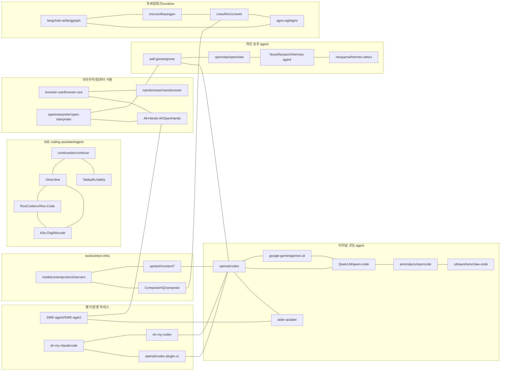
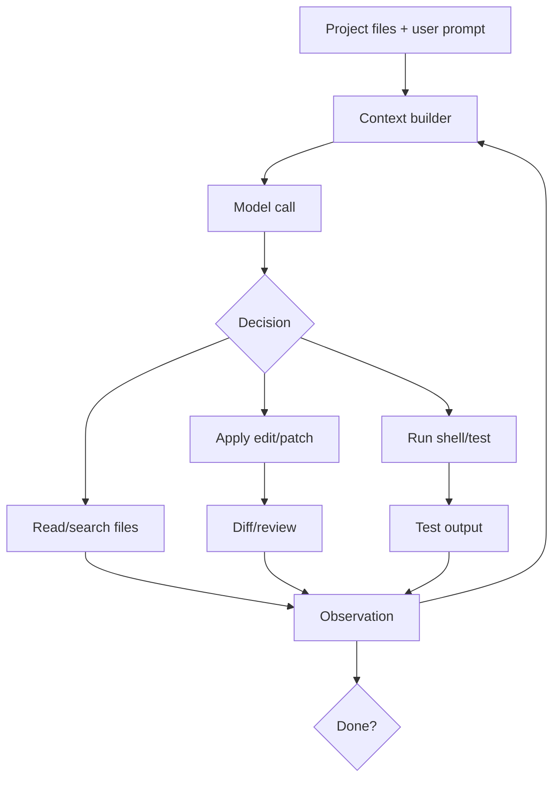
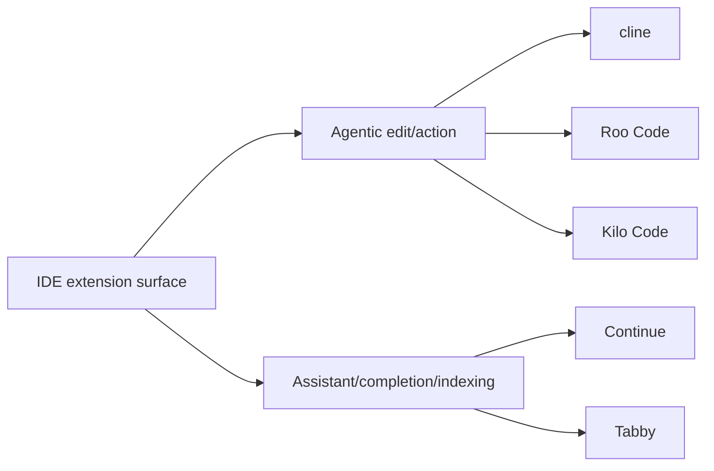
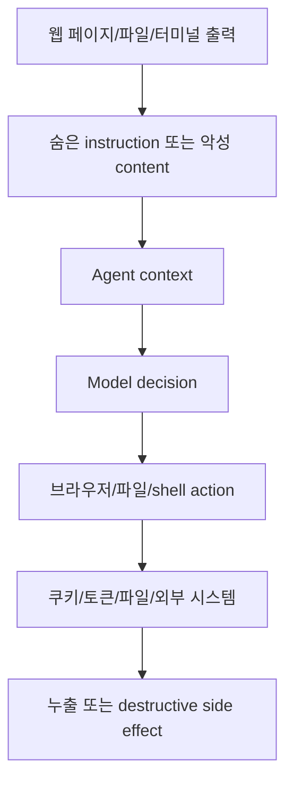
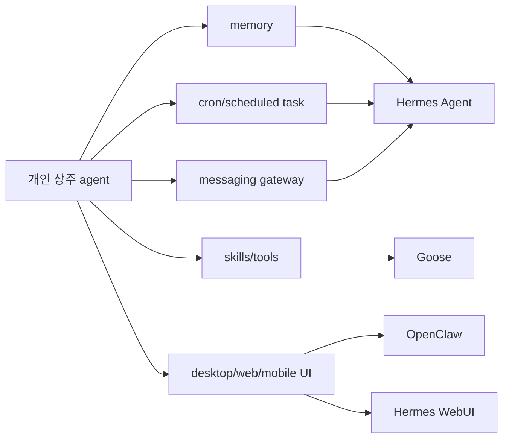
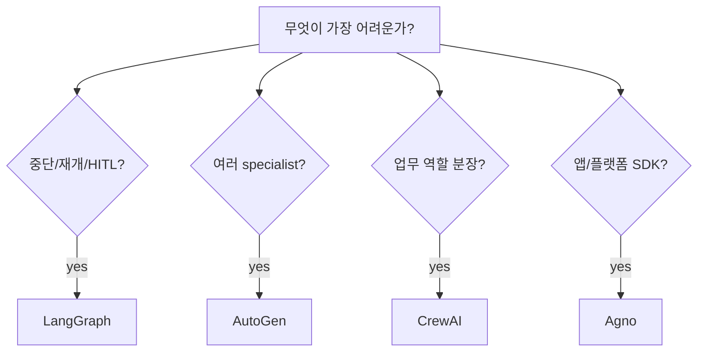
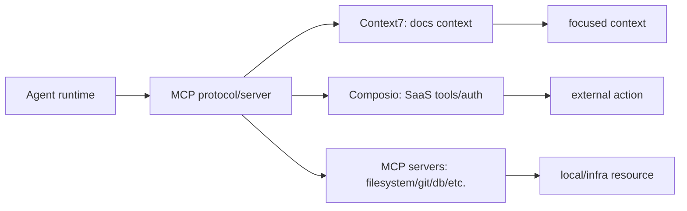
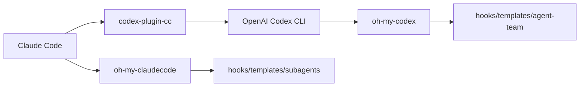

# 유사군별 비교와 관계 지도

기준일: 2026-06-11 KST.  
대상: 30개 레포지토리 전체.

이 문서는 `01-project-taxonomy-and-feature-comparison.md`보다 관계 중심이다. 목적은 "이 레포와 비슷한 레포가 무엇인가", "같은 군에서 어떤 프로젝트를 먼저 봐야 하는가", "설계 철학이 어디서 갈라지는가"를 정리하는 것이다.

## 1. 전체 유사도 지도

## 2. 클러스터 A: 공식/터미널 코딩 에이전트

### 구성

- 핵심: `openai/codex`, `google-gemini/gemini-cli`, `QwenLM/qwen-code`
- 근접: `anomalyco/opencode`, `ultraworkers/claw-code`
- 성숙한 다른 축: `aider-ai/aider`

### 공통점

- 사용자는 터미널에서 작업을 지시한다.
- 에이전트는 repository file을 읽고, patch를 만들고, shell/test 명령을 실행한다.
- 실행 기록은 다음 model turn의 observation으로 들어간다.
- 모델 provider보다 중요한 것은 context builder, tool router, approval/sandbox, diff/test 루프다.

### 차이점

| 기준 | Codex | Gemini CLI | Qwen Code | opencode | claw-code | Aider |
|---|---|---|---|---|---|---|
| 주 정체성 | 공식 OpenAI local runtime | 공식 Google Gemini CLI | Qwen 최적화 CLI | 오픈 terminal coding agent | Claude Code류 재구현 | Git-native pair programmer |
| 중심 가치 | thread/sandbox/state | 대형 context/provider integration | Qwen skills/subagents | plan/build UX | Rust CLI/호환성 | repo map/diff/test/git |
| 실행 경계 | approval/sandbox/tool router | built-in tools/MCP | skills/tools/subagents | tool/file/shell | shell/file | Git diff/test 중심 |
| 학습 가치 | 제품형 runtime architecture | 대형 context agent 운영 | model-specific CLI 설계 | mode/subagent UX | clean-room 구현 검토 | 좁고 강한 편집 loop |

### 내부 흐름 비교

Codex는 이 loop를 thread/session/turn runtime으로 감싼다. Aider는 Git과 repo map으로 context를 절제한다. Gemini CLI와 Qwen Code는 vendor/model ecosystem에 더 가까운 장점을 갖는다. opencode와 claw-code는 UX와 호환성 실험의 성격이 더 강하다.

### 학습 순서

1. `aider`: 최소한의 agentic coding loop가 실제로 어떻게 오래 살아남았는지 보기 좋다.
2. `openai/codex`: 현대 공식 CLI가 얼마나 많은 runtime 계층을 필요로 하는지 보기 좋다.
3. `gemini-cli`와 `qwen-code`: vendor/model-specific CLI가 context와 tool을 어떻게 상품화하는지 비교한다.
4. `opencode`와 `claw-code`: 독립 구현이 어떤 UX와 호환성 판단을 하는지 본다.

## 3. 클러스터 B: IDE agent/assistant

### 구성

- Agentic IDE lineage: `cline/cline`, `RooCodeInc/Roo-Code`, `Kilo-Org/kilocode`
- Assistant/indexing lineage: `continuedev/continue`, `TabbyML/tabby`

### 공통점

- IDE extension이 workspace를 관찰하고 editor action을 실행한다.
- 선택 영역, 열린 파일, diagnostics, terminal output이 자연스럽게 context가 된다.
- 사용자의 승인 UX가 터미널보다 시각적으로 제공된다.

### 두 갈래

### 비교

| 기준 | Cline/Roo/Kilo | Continue/Tabby |
|---|---|---|
| 사용자 기대 | agent가 파일 수정과 terminal action까지 수행 | 개발자가 쓰는 IDE assistant/completion |
| context | workspace, task history, mode instruction, terminal, MCP | index, selected code, retrieval, model routing |
| 강점 | agentic workflow, approval UI, MCP/tool action | privacy/self-host/indexing, completion/chat |
| 위험 | extension이 shell/file action을 강하게 가짐 | code index와 provider routing의 privacy |

### 설계 판단

IDE agent는 UX가 강한 만큼 "사용자가 실제로 무엇을 승인했는지"를 명확히 보여줘야 한다. 특히 Cline/Roo/Kilo 계열은 Plan/Act, mode, subtask, terminal command가 모두 섞일 수 있어, approval log와 diff visibility가 제품 신뢰도를 좌우한다. Continue/Tabby 계열은 agentic autonomy보다 code intelligence와 privacy가 핵심이다.

## 4. 클러스터 C: Browser/computer-use

### 구성

- Web automation harness: `browser-use/browser-use`
- Browser extension web agent: `nanobrowser/nanobrowser`
- Local computer controller: `openinterpreter/open-interpreter`
- Full software workspace: `All-Hands-AI/OpenHands`

### 공통점

- 모델은 텍스트 답변만 하지 않고 실제 환경을 바꾼다.
- observation이 단순 file content가 아니라 DOM, screenshot, browser state, terminal state, OS state일 수 있다.
- 실패 원인이 모델 reasoning인지, 관찰 추출인지, UI flake인지, 권한 문제인지 분리하기 어렵다.

### 관계

| 프로젝트 | 가장 닮은 것 | 다른 점 |
|---|---|---|
| `browser-use` | Playwright류 browser harness | agent가 보는 browser state abstraction이 핵심 |
| `nanobrowser` | browser-use + extension product | 설치형 extension, BYOK, user browser session |
| `open-interpreter` | local shell/code execution agent | 웹보다 OS 전체 control 범위가 넓음 |
| `OpenHands` | software workspace + browser/shell agent | sandboxed dev workspace와 UI/SDK를 포함 |

### 위험 흐름

이 군에서는 "agent가 무엇을 보았는가"가 보안 경계다. 브라우저가 보는 페이지, 터미널이 출력한 텍스트, repository 파일 속 instruction 모두 모델에게는 명령처럼 보일 수 있다. 따라서 observation filtering과 action allowlist가 필수다.

## 5. 클러스터 D: Personal/general agents

### 구성

- `openclaw/openclaw`
- `NousResearch/hermes-agent`
- `nesquena/hermes-webui`
- `aaif-goose/goose`
- 일부 관점의 `openinterpreter/open-interpreter`

### 공통점

- repository 단위가 아니라 사용자 개인 작업/메시지/장치/도구를 다룬다.
- 장기 상태와 memory가 중요하다.
- scheduler, messaging, desktop UI, mobile/web UI, extension이 붙기 쉽다.

### 관계

### 핵심 판단

이 군은 편리해질수록 위험해진다. 장기 memory는 개인화의 원천이지만 오염과 민감정보 축적의 원천이다. scheduled task는 자동화의 원천이지만 사용자가 잊은 권한 실행의 원천이다. desktop/web/mobile UI는 접근성을 높이지만 인증/노출면을 키운다.

## 6. 클러스터 E: Multi-agent/runtime frameworks

### 구성

- `microsoft/autogen`
- `langchain-ai/langgraph`
- `crewAIInc/crewAI`
- `agno-agi/agno`

### 유사하지만 다른 철학

| 프로젝트 | 설계 원자 | 철학 | 어울리는 문제 |
|---|---|---|---|
| `LangGraph` | StateGraph node/edge/checkpoint | agent는 상태ful graph runtime 위에서 실행되어야 한다 | long-running, HITL, durable workflow |
| `AutoGen` | agents/messages/teams | 여러 specialist agent가 메시지로 협업한다 | multi-agent research, Magentic-One식 orchestration |
| `CrewAI` | role/task/crew/process | 역할과 작업을 선언하면 crew가 수행한다 | 업무 자동화, role-based workflows |
| `Agno` | agent/team/workflow/memory/knowledge | agent platform을 SDK로 빠르게 구성한다 | 제품형 agent app, knowledge/memory/toolkit |

### 프레임워크 선택 기준

### 공통 위험

- agent가 여러 개가 되면 trace가 길어지고 비용이 늘어난다.
- 역할 분리는 reasoning quality를 보장하지 않는다.
- tool safety와 sandbox는 framework가 자동으로 해결하지 않는 경우가 많다.
- state/memory/checkpoint가 장기 저장되면 privacy와 삭제 정책이 필요하다.

## 7. 클러스터 F: Tool/context infrastructure

### 구성

- `modelcontextprotocol/servers`
- `upstash/context7`
- `ComposioHQ/composio`

### 관계

### 차이

| 프로젝트 | 가장 중요한 질문 | 제품적 의미 |
|---|---|---|
| `modelcontextprotocol/servers` | agent와 tool provider 사이 표준 경계를 어떻게 둘 것인가 | tool ecosystem의 공용 연결면 |
| `Context7` | 최신 문서/API 지식을 어떻게 즉시 넣을 것인가 | coding hallucination 감소용 context server |
| `Composio` | agent가 외부 SaaS를 안전히 호출하려면 auth를 누가 관리하는가 | agent action layer와 OAuth/workbench |

이 클러스터는 agent의 성능을 직접 높이기보다 agent가 실패하는 원인을 줄인다. 낡은 API 지식, 불명확한 tool schema, 토큰 관리, 외부 시스템 side effect가 모두 이 층위의 문제다.

## 8. 클러스터 G: Benchmark/repair/evaluation harness

### 구성

- `SWE-agent/SWE-agent`
- `All-Hands-AI/OpenHands`
- `aider-ai/aider`

### 비교

| 기준 | SWE-agent | OpenHands | Aider |
|---|---|---|---|
| 주 목표 | benchmark issue repair | full dev workspace 자동화 | 실제 repo pair programming |
| 평가 단위 | problem instance, patch, tests | workspace task, event stream | diff, tests, git commit |
| 강점 | 재현성, trajectory, SWE-bench 연결 | 더 넓은 software task | 실사용 편집 loop |
| 한계 | benchmark-specific 최적화 | 복잡하고 비용 큼 | full autonomy보다 협업 중심 |

### 왜 같이 봐야 하는가

SWE-agent는 "평가 가능한 agent"를 보여주고, Aider는 "오래 쓰이는 coding loop"를 보여주며, OpenHands는 "full workspace agent"를 보여준다. 세 프로젝트를 같이 보면 benchmark 점수, 실제 사용성, 완전 자동화 사이의 긴장이 드러난다.

## 9. 클러스터 H: Vendor-agent workflow/bridge

### 구성

- `Yeachan-Heo/oh-my-claudecode`
- `Yeachan-Heo/oh-my-codex`
- `openai/codex-plugin-cc`

### 공통점

- agent 자체를 새로 만들기보다 기존 vendor agent를 조합/운용한다.
- prompt template, hook, workflow, plugin, subagent/team 설정이 핵심 자산이다.
- 사용자에게는 작은 설정 파일처럼 보이지만 실제 행동을 크게 바꾼다.

### 관계

### 판단

이 클러스터는 앞으로 더 중요해질 가능성이 크다. 모델과 공식 CLI가 계속 강해질수록, 개인과 팀은 agent를 새로 만들기보다 운영 규칙, hook, instruction, review delegation을 설계하게 된다. 다만 숨은 hook/script와 cross-provider context 이동이 가장 큰 위험이다.

## 10. 학습 경로

### agent runtime을 이해하려면

1. `aider-ai/aider`: Git 기반 edit loop의 최소 강한 형태.
2. `openai/codex`: 현대 CLI runtime의 thread/tool/sandbox/state 계층.
3. `langchain-ai/langgraph`: long-running agent를 graph/checkpoint 문제로 보는 방식.
4. `microsoft/autogen`: multi-agent orchestration과 specialist team.

### 실제 제품을 고르려면

1. 터미널을 쓸지 IDE를 쓸지 먼저 결정한다.
2. 로컬/self-hosting/privacy가 핵심이면 `Aider`, `Tabby`, `Continue`, `Goose`를 우선 본다.
3. 공식 vendor ecosystem이 핵심이면 `Codex`, `Gemini CLI`, `Qwen Code`를 본다.
4. full workspace automation이 핵심이면 `OpenHands`, `SWE-agent`, `browser-use`를 본다.

### agent product를 만들려면

1. 외부 tool 연결은 `MCP servers`, `Composio`, `Context7`를 먼저 이해한다.
2. durable workflow는 `LangGraph`.
3. multi-agent specialist는 `AutoGen`.
4. role/task abstraction은 `CrewAI`.
5. memory/knowledge/toolkit platform은 `Agno`.

## 11. 이상 징후와 검토 우선순위

| 우선순위 | 징후 | 해당 군 | 검토 방법 |
|---|---|---|---|
| 높음 | hidden hook/script가 실제 명령을 실행 | vendor workflow layer, IDE extension | 설치 스크립트, hook registry, postinstall, extension activation event 확인 |
| 높음 | OAuth/API key를 agent tool gateway가 보관 | Composio, browser extension, personal agent | token storage, scope, refresh flow, tenant isolation 확인 |
| 높음 | browser/DOM content가 그대로 model instruction으로 들어감 | browser-use, nanobrowser, OpenHands | observation filtering, system/user/tool message 분리 확인 |
| 높음 | benchmark 점수를 product quality처럼 홍보 | SWE-agent, OpenHands, browser agent | benchmark task leakage, hidden tests, real-world eval 확인 |
| 중간 | long context를 품질 보장처럼 제시 | Gemini CLI, large-context agents | context pruning, relevance ranking, compaction 여부 확인 |
| 중간 | multi-agent를 기본값처럼 사용 | AutoGen, CrewAI, Agno | single-agent baseline 대비 비용/성능 비교 |
| 중간 | extension/fork lineage가 빠르게 바뀜 | Cline/Roo/Kilo family | governance, maintainer, release signing, dependency update 확인 |
| 중간 | memory가 장기 보존됨 | Hermes, OpenClaw, Goose, Agno | deletion, encryption, secret redaction, memory write policy 확인 |

## 12. 결론

30개 프로젝트는 하나의 순위표로 세우기보다 층위별로 읽어야 한다.

- 제품 사용 관점에서는 `Codex`, `Gemini CLI`, `Aider`, `Cline`, `Continue`, `OpenHands`, `Goose`가 우선 비교 대상이다.
- 설계 학습 관점에서는 `Codex`, `Aider`, `LangGraph`, `AutoGen`, `MCP servers`, `browser-use`, `SWE-agent`가 핵심 레퍼런스다.
- 보안 검토 관점에서는 `browser-use`, `nanobrowser`, `Open Interpreter`, `Composio`, `MCP servers`, `oh-my-*`, `IDE extension family`가 먼저 봐야 할 표면이다.
- 미래 트렌드 관점에서는 agent 자체보다 harness, context engineering, tool protocol, durable execution, workflow/hook 운영 계층이 더 중요해지고 있다.
