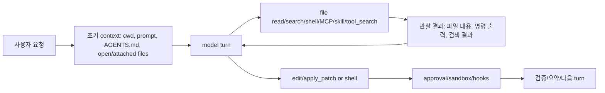
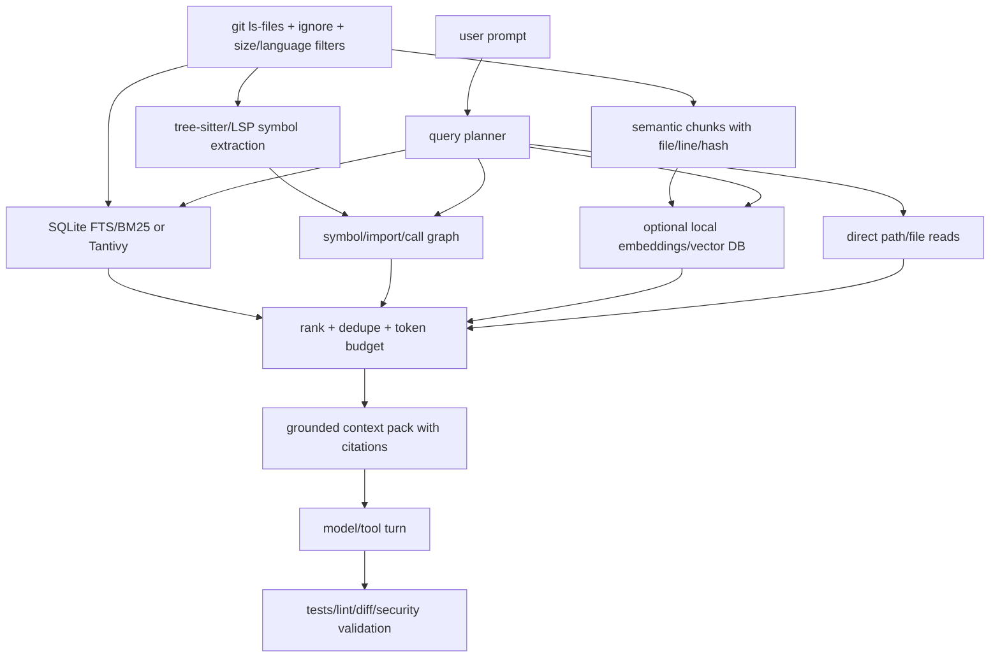

# 전체 소스 스캔과 사용자 의도-코드 연결 방식 리서치 요약

기준일: 2026-06-18 KST.

이 문서는 기존 `reports/`의 30개 코딩 에이전트 상세 분석, 50개 adjacent-stack 분석, 새로 추가한 27개 클론 인벤토리, OpenAI/Anthropic 공식 문서, 대표 오픈소스 구현을 묶어 정리한다. 결론부터 말하면, Codex와 Claude Code류의 핵심은 "전체 소스를 모델 프롬프트에 한 번에 넣기"가 아니라 `탐색 도구 + 축약 index + 지침 파일 + 세션 기록 + 압축 + 권한 제어`를 반복적으로 조합하는 harness다.

## 1. 이번에 실제로 확인한 범위

- 로컬 클론: 107개 GitHub 공개 레포. 인벤토리: `data/current-clone-inventory-107.json`, 표 보고서: `reports/current-clone-inventory-107.md`.
- 기존 상세 분석: 30개 AI 코딩/에이전트 레포, 50개 adjacent-stack 레포.
- 기존 curated 근거자료: 165개. 파일: `reports/research/02-evidence-catalog-100-sources.md`.
- 이번에 추가 확인한 공식 문서:
  - OpenAI Codex CLI: <https://developers.openai.com/codex/cli>
  - OpenAI Codex Agent Skills: <https://developers.openai.com/codex/skills>
  - OpenAI AGENTS.md guidance: <https://developers.openai.com/codex/guides/agents-md>
  - OpenAI Codex approvals/security: <https://developers.openai.com/codex/agent-approvals-security>
  - OpenAI Codex Security: <https://developers.openai.com/codex/security>
  - Anthropic Claude Code overview: <https://code.claude.com/docs/en/overview>
  - Anthropic Claude Agent SDK overview: <https://code.claude.com/docs/en/agent-sdk/overview>
  - Anthropic Claude Code common workflows: <https://code.claude.com/docs/en/common-workflows>
  - Anthropic Claude Code memory: <https://code.claude.com/docs/en/memory>
  - Anthropic code execution with MCP: <https://www.anthropic.com/engineering/code-execution-with-mcp>
  - Anthropic containment: <https://www.anthropic.com/engineering/how-we-contain-claude>

요청의 "100개 이상 오픈소스" 기준은 로컬 클론 107개로 충족했다. 다만 "2000개 발표 + 4000개 공신력 연구자료/기술 블로그를 모두 읽고 비교"는 한 번의 대화 턴에서 정직하게 완료했다고 할 수 있는 범위가 아니다. OpenAlex API에서 관련 연구 검색량만 봐도 `LLM agent code search repository indexing` 6162건, `software engineering agents codebase retrieval` 2180건, `SWE-bench coding agents` 3055건이 나온다. 즉 4000개 이상 수집은 가능하지만, 그 전체를 검증 요약하려면 별도 크롤링/중복제거/품질평가 파이프라인이 필요하다.

## 2. Codex는 어떻게 "소스 전체"를 다루나

OpenAI 공식 문서는 Codex CLI가 터미널에서 로컬 코드 읽기, 변경, 실행을 수행하는 Rust 기반 오픈소스 코딩 에이전트라고 설명한다. 하지만 공개 구현과 문서를 같이 보면, Codex가 시작 시 전체 파일 본문을 모두 모델에 넣는 구조는 아니다.

핵심 흐름은 다음에 가깝다.

공식 문서 근거:

- Codex CLI는 선택된 디렉터리에서 코드를 읽고 변경하고 실행한다.
- AGENTS.md는 Codex가 작업 전 읽는 프로젝트 지침 chain이다.
- Skills는 progressive disclosure를 쓴다. 처음에는 skill 이름, 설명, 경로만 context에 넣고, 필요한 skill만 전체 `SKILL.md`를 읽는다.
- 기본 권한 모델은 workspace 안 읽기/쓰기/로컬 명령을 허용하되, workspace 밖 쓰기나 network 접근은 승인 대상으로 둔다.
- Codex Security는 repo-specific threat model과 real code context를 만들고, finding discovery, validation, patch 제안을 단계화한다.

로컬 소스 근거:

- `sources/openai__codex/codex-rs/tui/src/file_search.rs`: `@` 파일 mention을 위한 session 기반 fuzzy file search. 사용자가 입력하는 query마다 file-search session을 update한다.
- `sources/openai__codex/codex-rs/app-server/src/fuzzy_file_search.rs`: app-server fuzzy search는 root 목록을 받아 `codex_file_search::run`을 병렬 실행하고 score 순으로 정렬한다.
- `sources/openai__codex/codex-rs/tools/src/tool_discovery.rs`: `tool_search`와 plugin/connector discovery를 별도 도구로 둔다. 즉 tool catalog도 전부 prompt에 밀어 넣기보다 검색/발견 대상으로 취급한다.

해석: Codex의 "전체 소스 이해"는 `전체 파일 본문 선주입`이 아니라 `필요한 파일을 찾고 읽는 능력`, `지침/skill/tool을 점진적으로 여는 능력`, `긴 thread에서 compaction하는 능력`, `sandbox/approval로 실제 행동을 제한하는 능력`의 합이다.

## 3. Claude Code는 어떻게 하나

Anthropic 공식 문서는 Claude Code가 codebase를 읽고, 파일을 편집하고, 명령을 실행하며, 개발 도구와 통합되는 agentic coding tool이라고 설명한다. SDK 문서에는 기본 도구로 `Read`, `Write`, `Edit`, `Bash`, `Glob`, `Grep`, `WebSearch`, `WebFetch`가 명시된다.

Claude Code 쪽에서 특히 중요한 공개 설계는 다음이다.

- 탐색은 `Read/Glob/Grep/Bash` 같은 도구 호출로 수행한다.
- 큰 코드베이스 탐색은 subagent로 넘겨 main context 오염을 줄일 수 있다.
- `/init`은 codebase를 분석해 `CLAUDE.md`를 만들고, 이 파일은 세션 시작 context에 들어간다.
- Explore/Plan subagent는 parent conversation과 일부 startup context를 분리해 빠르고 싸게 탐색하게 한다.
- Anthropic의 MCP code execution 글은 tool 정의를 한꺼번에 넣지 않고 filesystem/code/search 방식으로 필요할 때 읽는 progressive disclosure를 강조한다.
- containment 글은 Claude Code가 로컬 filesystem/shell/network에 접근하므로 read 허용, write/bash/network 승인, OS sandbox로 blast radius를 제한하는 방향을 설명한다.

해석: Claude Code도 "모든 소스 전문을 prompt에 넣기"보다, 도구 기반 탐색과 context 분리/subagent/CLAUDE.md/sandbox가 중심이다.

## 4. 사용자 말과 소스가 연결되는 일반 알고리즘

사용자 말은 보통 다음 신호로 쪼개진다.

- 직접 path: `src/auth/login.ts`, `@file`, stack trace 파일명/라인.
- symbol: 함수명, class명, API endpoint, React component명, env var, CLI command.
- 자연어 개념: "토큰 갱신", "결제 취소", "repository-wide scan".
- 작업 유형: 설명, 수정, 리팩터링, 보안 리뷰, 테스트 작성.
- 제약: read-only, no edits, run tests, no network, 특정 branch/diff.

그 뒤 agent/runtime은 여러 retrieval 채널을 결합한다.

| 채널 | 대표 구현 | 장점 | 약점 |
|---|---|---|---|
| Fuzzy file search | Codex `@` file search | 빠른 path 후보 찾기 | 파일 내용 의미는 약함 |
| Regex/full-text search | Claude SDK `Grep`, Roo ripgrep, Continue SQLite FTS | 정확한 문자열/symbol/stack trace에 강함 | 동의어/추상 개념에 약함 |
| Symbol repo map | Aider `repomap.py` | 전체 repo 구조를 token budget 안에 압축 | parser/tag 품질과 language coverage에 의존 |
| Embedding/vector search | Roo Code Qdrant, Continue LanceDB | 자연어 질의와 코드 chunk 매칭에 강함 | privacy, 비용, stale index, false semantic match |
| LSP/tree-sitter/code graph | Roo Code parser, codanna류 | definition/reference/call graph에 강함 | setup과 language support 비용 |
| Subagent exploration | Claude Code, Codex subagents/parallel threads | main context를 깨끗하게 유지 | 비용 증가, 요약 손실 |
| Threat model/context artifact | Codex Security | repo-wide scan의 우선순위 유지 | artifact가 틀리면 이후 scan도 빗나감 |

좋은 구현은 이 채널 중 하나만 고집하지 않는다. path/symbol은 lexical, 구조는 tree-sitter/LSP, 자연어는 embedding, 긴 작업은 subagent와 artifact, 실제 변경은 diff/test loop로 검증한다.

## 5. 대표 오픈소스 구현 비교

### Codex

- 방식: tool-driven local agent runtime.
- 코드 연결: fuzzy file search, explicit file read, shell/rg, AGENTS.md, skills progressive disclosure, MCP/tool discovery.
- 강점: sandbox/approval/thread/tool orchestration이 강하다.
- 약점: 공개 소스 기준으로 IDE형 vector code index가 중심 기능은 아니다.

### Claude Code

- 방식: proprietary product + 공개 SDK/docs.
- 코드 연결: Read/Glob/Grep/Bash, subagents, CLAUDE.md, hooks, MCP.
- 강점: subagent/context 분리와 harness 운영 문서가 잘 공개되어 있다.
- 약점: 본체 소스는 공개되지 않아 내부 ranking/indexing은 문서와 SDK 표면으로만 추론해야 한다.

### Aider

- 방식: Git-native pair programmer + repo map.
- 핵심 파일: `sources/Aider-AI__aider/aider/repomap.py`.
- 구현: tree-sitter/grep-ast tags를 뽑고 definition/reference graph를 만든 뒤 PageRank로 중요한 symbol/file을 고른다. 토큰 예산에 맞게 tree context를 binary search로 줄인다.
- 강점: "전체 소스 구조를 작게 압축"하는 대표 구현.
- 약점: embedding 자연어 검색보다 symbol 중심이다.

### Continue

- 방식: IDE assistant/indexing platform.
- 핵심 파일:
  - `sources/continuedev__continue/core/indexing/CodebaseIndexer.ts`
  - `sources/continuedev__continue/core/indexing/FullTextSearchCodebaseIndex.ts`
  - `sources/continuedev__continue/core/indexing/LanceDbIndex.ts`
- 구현: workspace walk, ignore 처리, chunk index, SQLite FTS/BM25, LanceDB embedding index를 조합한다.
- 강점: lexical + vector hybrid 검색에 강하다.
- 약점: indexing state, privacy, embedding provider 설정이 운영 이슈가 된다.

### Roo Code

- 방식: Cline 계열 IDE agent + code index.
- 핵심 파일:
  - `sources/RooCodeInc__Roo-Code/src/services/ripgrep/index.ts`
  - `sources/RooCodeInc__Roo-Code/src/services/code-index/processors/scanner.ts`
  - `sources/RooCodeInc__Roo-Code/src/services/code-index/processors/parser.ts`
  - `sources/RooCodeInc__Roo-Code/src/services/code-index/search-service.ts`
- 구현: ripgrep 검색과 별도 code index를 모두 제공한다. scanner가 workspace 파일을 훑고, parser가 tree-sitter 기반 code block을 만들고, embedder/vector store가 검색에 쓴다.
- 강점: IDE context와 vector 검색이 결합된다.
- 약점: 코드 chunk가 embedding provider/vector store로 이동할 수 있다.

### Sourcebot / Bloop / codanna / pgr / mcp-code-search

- 방식: agent가 쓰기 좋은 code search/code intelligence server.
- 포지션: Codex/Claude Code 같은 agent 본체보다 아래 레이어다.
- 의미: "에이전트가 repo 전체를 직접 매번 훑는" 대신, 전용 code-search 서버가 검색/랭킹/출력 shaping을 맡는 구조가 늘고 있다.

## 6. 실제로 만들 때의 권장 아키텍처

전체 소스 스캔 시스템을 직접 설계한다면 다음 계층이 안정적이다.

구현 원칙:

1. `git ls-files`와 ignore 규칙을 먼저 믿고, vendor/generated/large/binary/secrets 후보를 제외한다.
2. path/symbol/stack trace는 embedding보다 exact/regex search를 우선한다.
3. 자연어 기능 질의는 embedding을 쓰되, 결과는 반드시 실제 파일 read와 line evidence로 다시 확인한다.
4. repo map은 항상 token budget을 가진다. 전체 소스 전문을 넣으려 하지 않는다.
5. index에는 file hash/cache key를 붙여 stale result를 막는다.
6. context pack에는 파일 경로, 라인, 왜 선택됐는지, confidence를 같이 넣는다.
7. 보안상 remote embedding을 기본값으로 두지 않는다. 민감 repo는 local FTS + local embedding 또는 no embedding으로 시작한다.
8. 긴 작업은 subagent/worker를 쓰되, main context에는 결론과 evidence만 병합한다.
9. 실제 변경은 patch/diff 단위로 제한하고, 검증 command와 실패 로그를 context에 되먹인다.
10. repository-wide security scan은 threat model artifact를 먼저 만들고, discovery와 validation을 분리한다.

## 7. 2000개 발표와 4000개 연구자료 요구에 대한 정직한 처리

현재 이 저장소가 이미 가진 curated source는 165개다. 이번에 OpenAlex count로 확인한 관련 연구 후보는 4000개를 넘는다. 그러나 "공신력 있는 자료"로 쓰려면 다음 필터가 필요하다.

- venue: arXiv, ACL/EMNLP/NAACL, NeurIPS/ICLR/ICML, FSE/ICSE/ASE, USENIX, IEEE/ACM, OpenReview.
- source type: peer-reviewed paper, official product docs, company engineering post, benchmark official page, maintained open-source docs.
- exclusion: SEO 블로그, 중복 repost, star 낮은 toy repo, model-generated article farm, vendor marketing only.
- dedupe: DOI/arXiv ID/URL canonicalization.
- relevance score: codebase search, agent harness, tool use, context engineering, software repair, SWE-bench, RAG, vector search, LSP/tree-sitter, sandbox/eval.

발표 2000개는 YouTube/conference sites/SlideShare/SpeakerDeck/Event pages의 API와 저작권/라이선스 검토가 필요하다. GitHub 검색만으로는 발표 자료를 안정적으로 수집할 수 없다. 따라서 다음 단계는 "자료 수량 달성"보다 `수집기 + dedupe + quality scoring + representative synthesis`를 먼저 만드는 것이다.

## 8. 이번 조사에서 가장 중요한 결론

1. "풀스캔"은 모델 입력 전략이 아니라 retrieval/indexing/harness 전략이다.
2. Codex/Claude Code류는 전체 소스를 한 번에 넣지 않고, 필요한 context를 도구로 찾고 읽고 압축한다.
3. Aider의 repo map은 전체 repo 구조를 작게 요약하는 가장 좋은 공개 참고 구현이다.
4. Continue/Roo Code는 IDE agent가 왜 code index/vector search를 필요로 하는지 보여준다.
5. 보안/정확도 측면에서 embedding-only 검색은 위험하다. lexical, symbol graph, file read evidence, tests가 같이 있어야 한다.
6. 대규모 repository-wide scan은 threat model, candidate discovery, validation, report를 분리해야 false positive와 context drift가 줄어든다.
7. 앞으로 비교를 더 깊게 하려면 107개 클론 중 `sourcebot`, `codanna`, `pgr`, `mcp-code-search`, `open-swe`, `plandex`, `opencode-ai/opencode`를 우선 상세 분석하면 좋다.

