# ComposioHQ/composio 분석 보고서

- 대상 저장소: https://github.com/ComposioHQ/composio
- 로컬 경로: `/Users/shinjoungeun/Documents/중은v2/sources/ComposioHQ__composio`
- 분석 기준 커밋: `094aed6`
- 기본 브랜치: `next`
- 생성일: 2024-02-23
- 주 언어: TypeScript
- 라이선스 표기: GitHub metadata는 MIT, TypeScript 패키지는 ISC, Python classifier는 Apache Software License로 혼재
- 최신 릴리스: `@composio/cli@0.2.31` (2026-06-09)
- 규모: 공개 메타데이터 기준 stars 28,708 / forks 4,617 / watchers 66
- 로컬 파일 수: 전체 2,245개, `ts`와 `python` 아래 1,543개

## 1. 한 줄 결론

Composio는 “AI 코딩 에이전트” 자체라기보다, 에이전트가 Gmail, GitHub, Slack, 브라우저, 로컬 GUI, iMessage, 원격 워크벤치 같은 외부 행동 표면을 도구로 호출하게 만드는 인증/툴 라우팅/스키마/파일/CLI 제어 계층이다.

코드가 공개된 부분은 SDK, CLI, provider wrapper, Tool Router client, 로컬 툴 런타임, 테스트/문서/생성 코드이고, 실제 500개 이상 툴킷의 카탈로그와 실행 구현 상당수는 `https://backend.composio.dev`와 OpenAPI 생성 클라이언트 뒤에 있다. 따라서 이 저장소를 이해할 때는 “공개 SDK의 제어 흐름”과 “비공개 또는 원격 백엔드에서 수행되는 실제 액션”을 분리해서 봐야 한다.

## 2. 레포지토리 평가

### 2.1 강점

1. 다양한 에이전트 프레임워크를 같은 툴 추상화로 묶는다.
   - TypeScript provider: OpenAI, OpenAI Agents, Anthropic, LangChain, LangGraph, LlamaIndex, Vercel AI SDK, Gemini, Google ADK, Mastra, Cloudflare Workers AI, CrewAI, AutoGen 등.
   - Python provider도 동일한 방향으로 구성되어 있다.

2. 인증과 연결 계정 모델이 SDK 표면에 명확하게 노출된다.
   - `authConfigs`, `connectedAccounts`, `toolkits.authorize`, `toolRouter.authorize`, `mcp.create/generate`가 분리되어 있다.
   - OAuth/API key/shared connection/ACL이 독립 모델로 다뤄진다.

3. Tool Router가 에이전트 실행에 맞는 session 단위 추상화를 제공한다.
   - 한 사용자에 대해 session을 만들고, 검색, 권한 연결, 실행, 파일 마운트, custom tool, MCP 서버 설정을 한 단위로 묶는다.

4. 파일 업로드 방어 장치가 비교적 명시적이다.
   - 자동 파일 업로드는 `dangerouslyAllowAutoUploadDownloadFiles`를 켜야 한다.
   - 기본 allowlist는 `~/.composio/temp`이고, `.ssh`, `.aws`, `.env`, private key basename 등은 denylist로 막는다.
   - 다만 manual upload는 별도 위험으로 봐야 한다.

5. CLI는 단순 실행기가 아니라 “에이전트 스크립트 런타임”에 가깝다.
   - `composio run`은 TS/JS에 `execute`, `search`, `proxy`, `experimental_subAgent`, `z`를 주입한다.
   - local tools, Tool Router, permission gate, file upload, sub-agent 호출까지 연결한다.

### 2.2 약점과 한계

1. 핵심 액션 실행부가 원격 백엔드에 의존한다.
   - `client.tools.execute`, `client.toolRouter.session.execute`, `client.toolRouter.session.executeMeta`, `client.tools.proxy`가 실제 행동의 중심이다.
   - 공개 저장소만으로 각 외부 앱별 실제 구현, rate limit, data handling, sandbox 정책을 완전히 검증할 수 없다.

2. 기본 편의 설정이 강하다.
   - SDK telemetry는 기본 true다.
   - toolkit version 기본값은 `latest`다.
   - provider 경유 실행은 `dangerouslySkipVersionCheck: true`를 자동으로 넣는다.
   - permission snapshot이 없거나 enhanced controls가 없으면 permission 해석은 `allow_all`로 떨어진다.

3. 로컬 CLI 툴은 권한 반경이 매우 넓다.
   - Chrome DevTools MCP를 `npx -y --package chrome-devtools-mcp@0.24.0 chrome-devtools`로 호출한다.
   - Peekaboo는 macOS 화면/GUI 자동화 권한을 요구한다.
   - Beeper iMessage 툴은 메시지 읽기/전송과 PII 접근이 가능하다.
   - command/MCP/FFI 실행은 `process.env`를 상속한다.

4. 라이선스와 버전 표기가 일관되지 않다.
   - GitHub는 MIT, `@composio/core`와 CLI 패키지는 ISC, Python package classifier는 Apache Software License로 보인다.
   - root `0.10.0-alpha.1`, TS core `0.10.0`, CLI `0.2.31`, Python `0.14.0`, Python workspace dev dependency `composio==1.0.0rc6`, docs lock의 `@composio/core@0.9.1` 등이 섞여 있다.

5. 숨은 개발 에이전트 지시층이 포함되어 있다.
   - `.agents/skills/*`
   - `.claude/skills/*`
   - `.claude/commands/*`
   - `.claude/rules/*`
   - 일반 SDK 사용자 실행 경로는 아니지만, 저장소를 AI agent로 작업할 때 별도 행동 규칙으로 작동할 수 있다.

## 3. 발전 과정과 철학

### 3.1 초점의 이동

README와 코드 구조를 기준으로 보면 Composio는 단순 “toolkit SDK”에서 “에이전트가 외부 세계를 안정적으로 조작하는 action layer”로 확장되어 왔다.

초기 형태는 `composio.tools.get(...)`으로 특정 toolkit의 tool schema를 가져와 OpenAI/Anthropic/LangChain 등 provider가 요구하는 format으로 감싸는 SDK에 가깝다. 현재 `next` 브랜치에서는 다음 계층이 추가되어 있다.

- Tool Router session
- MCP server 생성/관리
- CLI `run` 스크립팅 런타임
- local tools
- enhanced permission controls
- remote workbench / remote bash meta tool
- custom tools/custom toolkits
- file mount / file upload/download
- trigger realtime subscription

즉 철학은 “에이전트가 어떤 모델/프레임워크를 쓰든 같은 외부 행동 인프라를 쓰게 하자”에 가깝다.

### 3.2 설계 철학

1. Provider adapter 철학
   - 핵심 tool schema는 Composio API에서 가져오고, provider별 wrapper가 OpenAI function/tool, Anthropic tool, LangChain tool 등으로 변환한다.
   - `BaseProvider`는 agentic/non-agentic provider 구분과 execute function 주입을 담당한다.

2. Remote-first 철학
   - 툴 검색, 실행, 인증, Tool Router session, proxy, realtime trigger는 Composio backend를 전제로 한다.
   - SDK는 안전한 local library라기보다 원격 action platform의 client runtime이다.

3. User/session 중심 철학
   - 대부분의 실행 API는 `userId`를 요구한다.
   - Tool Router는 사용자별 연결 계정과 세션 단위의 action context를 만든다.

4. Progressive safety 철학
   - 위험 기능은 이름에 `dangerously`를 붙이고 기본 off로 둔다.
   - 그러나 연결 계정 기반 툴 실행 자체는 기본적으로 “개발자가 이 연결을 허용했다”는 전제를 둔다.

5. Developer-experience 우선 철학
   - `toolkits: ['GITHUB']`, `search: 'send email'`, `composio run 'await execute(...)'` 같은 빠른 사용성을 강조한다.
   - 이 덕분에 onboarding은 쉽지만, 프로덕션 안전성은 별도 설정과 운영 정책이 필요하다.

## 4. 저장소 구조

```text
ComposioHQ__composio/
  README.md
  package.json
  pyproject.toml
  ts/
    packages/
      core/                 # TypeScript SDK 핵심
      cli/                  # composio CLI
      cli-local-tools/      # 로컬 툴킷 런타임
      cli-keyring/
      json-schema-to-zod/
      providers/            # provider별 TypeScript adapter
    examples/
    e2e-tests/
  python/
    composio/               # Python SDK 핵심
    providers/              # provider별 Python adapter
    tests/
  docs/                     # 문서 사이트
  .agents/skills/           # 저장소 작업용 agent skill
  .claude/skills/           # Claude Code용 skill
  .claude/commands/
  .claude/rules/
```

## 5. 전체 아키텍처

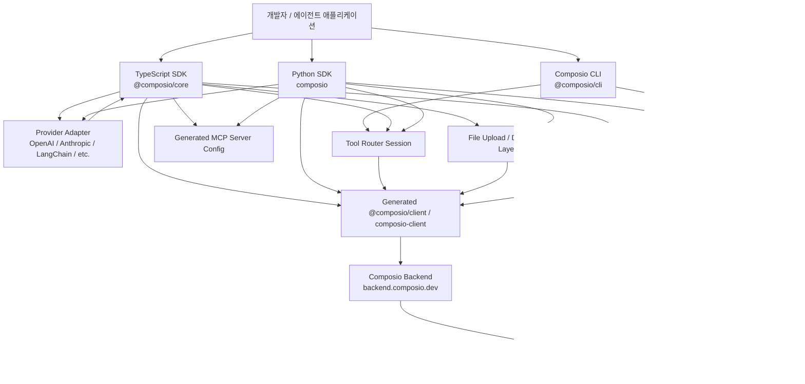
```mermaid
flowchart TB
  User["개발자 / 에이전트 애플리케이션"]
  TS["TypeScript SDK<br/>@composio/core"]
  PY["Python SDK<br/>composio"]
  CLI["Composio CLI<br/>@composio/cli"]
  Provider["Provider Adapter<br/>OpenAI / Anthropic / LangChain / etc."]
  Router["Tool Router Session"]
  MCP["Generated MCP Server Config"]
  Files["File Upload / Download Layer"]
  Triggers["Trigger / Pusher / Webhook Layer"]
  Client["Generated @composio/client / composio-client"]
  Backend["Composio Backend<br/>backend.composio.dev"]
  External["External Apps<br/>GitHub / Gmail / Slack / Browser / etc."]
  Local["Local Tools<br/>Chrome DevTools / Peekaboo / iMessage"]

  User --> TS
  User --> PY
  User --> CLI
  TS --> Provider
  PY --> Provider
  Provider --> TS
  TS --> Client
  PY --> Client
  CLI --> Router
  TS --> Router
  PY --> Router
  TS --> MCP
  PY --> MCP
  TS --> Files
  PY --> Files
  TS --> Triggers
  PY --> Triggers
  Router --> Client
  Files --> Client
  Triggers --> Client
  Client --> Backend
  Backend --> External
  CLI --> Local
  Local --> External
```

핵심은 `Composio` class가 모든 모델 객체를 초기화하고, 각 모델 객체가 생성 클라이언트를 통해 원격 API를 호출하는 방식이다.

TypeScript 기준 주요 객체:

- `Composio`
- `Tools`
- `Toolkits`
- `Triggers`
- `AuthConfigs`
- `ConnectedAccounts`
- `Experimental`
- `MCP`
- `ToolRouter`
- `ToolRouterSession`
- `Files`

Python도 거의 같은 이름의 모델을 가진다.

## 6. TypeScript SDK 실행 흐름

### 6.1 초기화 흐름

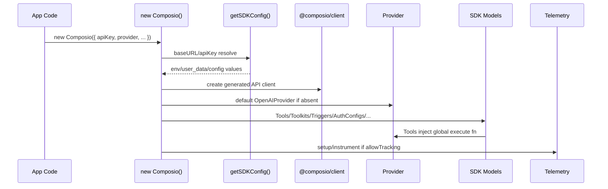
```mermaid
sequenceDiagram
  participant App as App Code
  participant C as new Composio()
  participant Config as getSDKConfig()
  participant Client as @composio/client
  participant Provider as Provider
  participant Models as SDK Models
  participant Telemetry as Telemetry

  App->>C: new Composio({ apiKey, provider, ... })
  C->>Config: baseURL/apiKey resolve
  Config-->>C: env/user_data/config values
  C->>Client: create generated API client
  C->>Provider: default OpenAIProvider if absent
  C->>Models: Tools/Toolkits/Triggers/AuthConfigs/...
  Models->>Provider: Tools inject global execute fn
  C->>Telemetry: setup/instrument if allowTracking
```

설정 우선순위:

1. constructor argument
2. 환경변수 `COMPOSIO_BASE_URL`, `COMPOSIO_API_KEY`
3. `~/.composio/user_data.json`
4. baseURL 기본값 `https://backend.composio.dev`

주의할 점:

- `getSDKConfig`는 debug log에서 실제 API key를 출력하는 코드 경로가 있다.
- `Composio` constructor 자체의 debug log는 `[REDACTED]` 처리한다.
- debug logging을 켤 수 있는 환경에서는 API key 노출 여부를 별도 확인해야 한다.

### 6.2 tool 조회 흐름

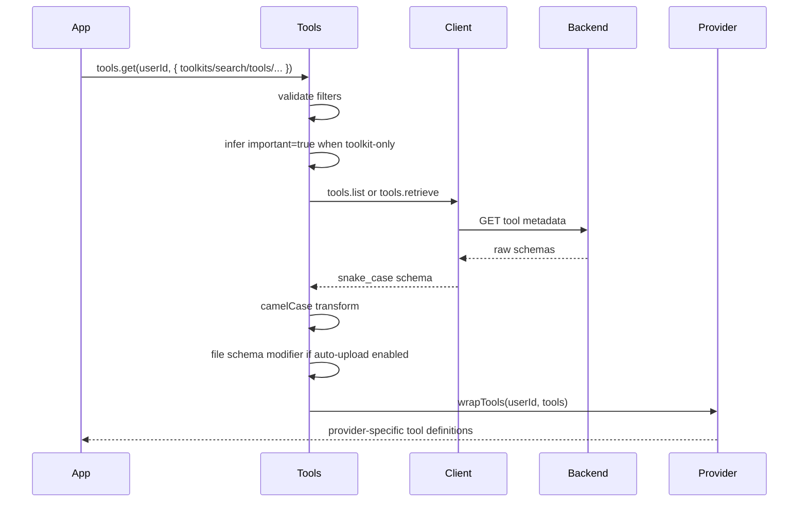
```mermaid
sequenceDiagram
  participant App
  participant Tools
  participant Client
  participant Backend
  participant Provider

  App->>Tools: tools.get(userId, { toolkits/search/tools/... })
  Tools->>Tools: validate filters
  Tools->>Tools: infer important=true when toolkit-only
  Tools->>Client: tools.list or tools.retrieve
  Client->>Backend: GET tool metadata
  Backend-->>Client: raw schemas
  Client-->>Tools: snake_case schema
  Tools->>Tools: camelCase transform
  Tools->>Tools: file schema modifier if auto-upload enabled
  Tools->>Provider: wrapTools(userId, tools)
  Provider-->>App: provider-specific tool definitions
```

주요 분기:

- `tools`와 `toolkits` 필터를 동시에 쓰면 ValidationError.
- `toolkits`만 주고 `limit`, `tags`, `search`가 없으면 `important=true`를 자동 적용한다.
- `tools`로 slug 목록을 주면 limit를 9999로 올린다.
- `toolkitVersions`는 기본 `latest`이며 env `COMPOSIO_TOOLKIT_VERSION_<TOOLKIT>`로 override 가능하다.

### 6.3 provider-wrapped tool 실행 흐름

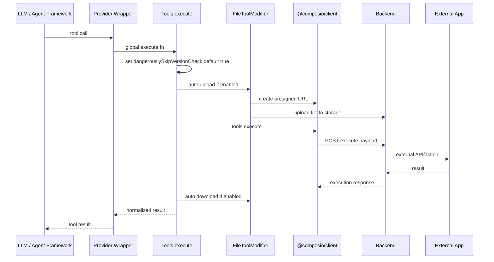
```mermaid
sequenceDiagram
  participant LLM as LLM / Agent Framework
  participant Provider as Provider Wrapper
  participant Tools as Tools.execute
  participant FileMod as FileToolModifier
  participant Client as @composio/client
  participant Backend
  participant App as External App

  LLM->>Provider: tool call
  Provider->>Tools: global execute fn
  Tools->>Tools: set dangerouslySkipVersionCheck default true
  Tools->>FileMod: auto upload if enabled
  FileMod->>Client: create presigned URL
  FileMod->>Backend: upload file to storage
  Tools->>Client: tools.execute
  Client->>Backend: POST execute payload
  Backend->>App: external API/action
  App-->>Backend: result
  Backend-->>Client: execution response
  Tools->>FileMod: auto download if enabled
  Tools-->>Provider: normalized result
  Provider-->>LLM: tool result
```

중요한 점:

- provider-controlled execution은 version check를 자동으로 건너뛴다.
- 직접 `tools.execute()`를 호출할 때는 version이 `latest`로 resolve되면 오류가 나며, 구체 버전이나 `dangerouslySkipVersionCheck`를 요구한다.
- provider 경유는 LLM framework의 일반 tool call ergonomics를 위해 이 안전장치를 완화한다.

## 7. Tool Router 아키텍처

Tool Router는 Composio에서 가장 중요한 변화다. 단순 “tool schema 목록”이 아니라 사용자별 세션을 만들고, 검색/연결/실행/파일/커스텀 툴을 세션 내부에서 관리한다.

### 7.1 session 생성 흐름

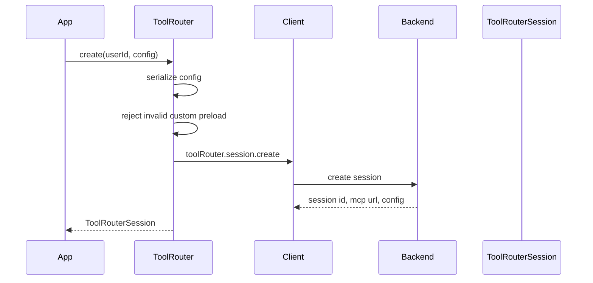
```mermaid
sequenceDiagram
  participant App
  participant TR as ToolRouter
  participant Client
  participant Backend
  participant Session as ToolRouterSession

  App->>TR: create(userId, config)
  TR->>TR: serialize config
  TR->>TR: reject invalid custom preload
  TR->>Client: toolRouter.session.create
  Client->>Backend: create session
  Backend-->>Client: session id, mcp url, config
  TR-->>App: ToolRouterSession
```

session config에 들어갈 수 있는 항목:

- `toolkits`
- `tools`
- `tags`
- `authConfigs`
- `connectedAccounts`
- `manageConnections`
- `workbench`
- `multiAccount`
- `preload`
- `sessionPreset`
- `direct_tools`
- `experimental.custom_tools`
- `experimental.custom_toolkits`
- `assistivePrompt`

### 7.2 session tools 흐름

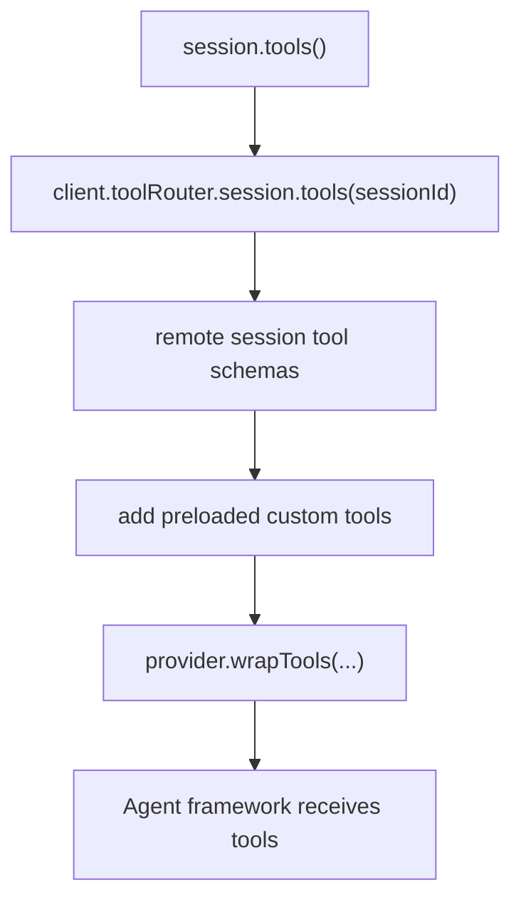
```mermaid
flowchart TD
  A["session.tools()"] --> B["client.toolRouter.session.tools(sessionId)"]
  B --> C["remote session tool schemas"]
  C --> D["add preloaded custom tools"]
  D --> E["provider.wrapTools(...)"]
  E --> F["Agent framework receives tools"]
```

custom tool이 있으면 `COMPOSIO_MULTI_EXECUTE_TOOL`과 local custom tool 실행은 session이 가로챈다. remote tool은 backend로 간다.

### 7.3 session execute 흐름

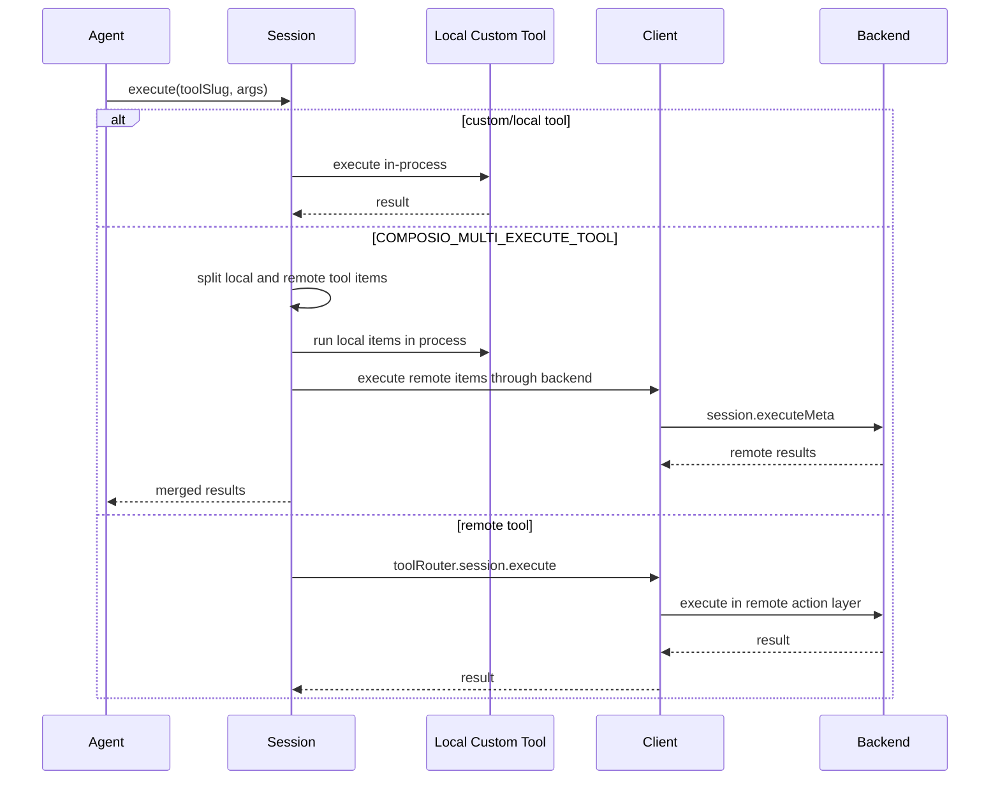
```mermaid
sequenceDiagram
  participant Agent
  participant Session
  participant Local as Local Custom Tool
  participant Client
  participant Backend

  Agent->>Session: execute(toolSlug, args)
  alt custom/local tool
    Session->>Local: execute in-process
    Local-->>Session: result
  else COMPOSIO_MULTI_EXECUTE_TOOL
    Session->>Session: split local and remote tool items
    Session->>Local: run local items in process
    Session->>Client: execute remote items through backend
    Client->>Backend: session.executeMeta
    Backend-->>Client: remote results
    Session-->>Agent: merged results
  else remote tool
    Session->>Client: toolRouter.session.execute
    Client->>Backend: execute in remote action layer
    Backend-->>Client: result
    Client-->>Session: result
  end
```

### 7.4 MCP 생성 흐름

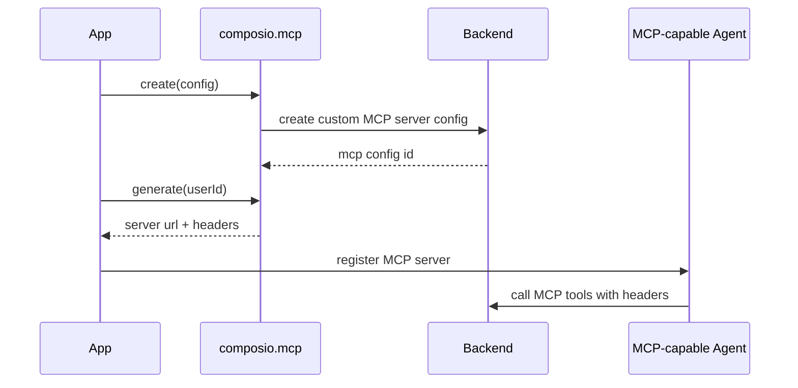
```mermaid
sequenceDiagram
  participant App
  participant MCP as composio.mcp
  participant Backend
  participant Client as MCP-capable Agent

  App->>MCP: create(config)
  MCP->>Backend: create custom MCP server config
  Backend-->>MCP: mcp config id
  App->>MCP: generate(userId)
  MCP-->>App: server url + headers
  App->>Client: register MCP server
  Client->>Backend: call MCP tools with headers
```

주의:

- TS `ToolRouter.createMCPServerConfig`는 API key가 있으면 MCP server header에 `x-api-key`를 넣는다.
- 이 config가 다른 사람에게 공유되면 권한 범위가 같이 노출될 수 있다.
- `allowedTools`, `toolkits`, `auth_config_ids`, `managed_auth_via_composio` 같은 설정을 좁게 잡아야 한다.

## 8. CLI 아키텍처

CLI는 `@composio/cli` 패키지에 있다. 단순 CRUD CLI가 아니라 agent runtime helper에 가깝다.

### 8.1 CLI 전체 흐름

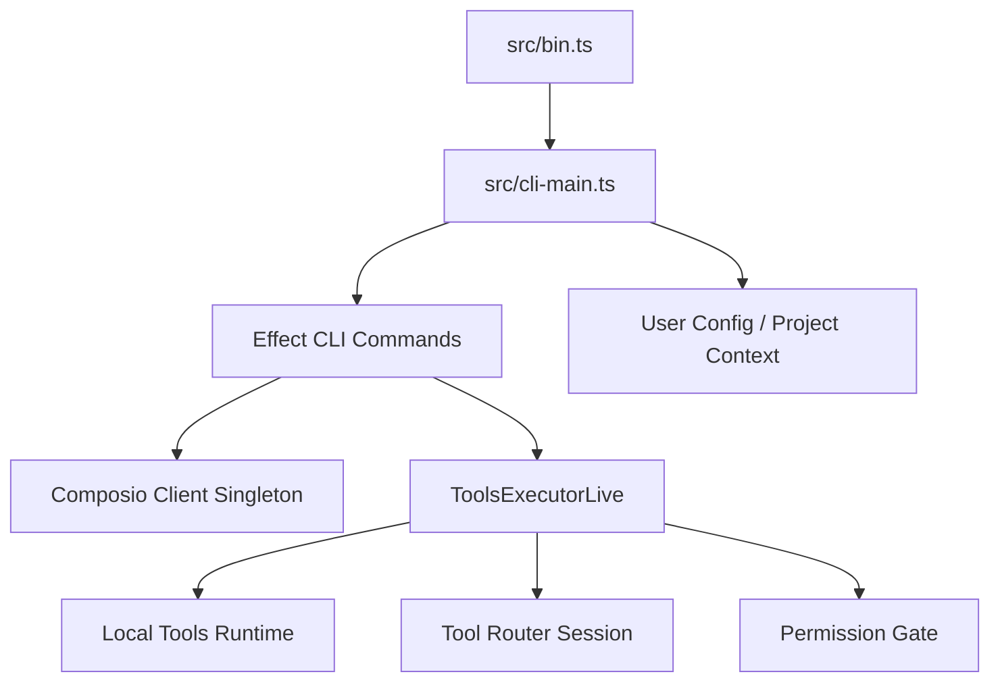
```mermaid
flowchart TB
  Bin["src/bin.ts"]
  Main["src/cli-main.ts"]
  Commands["Effect CLI Commands"]
  Config["User Config / Project Context"]
  Client["Composio Client Singleton"]
  ToolExec["ToolsExecutorLive"]
  Router["Tool Router Session"]
  Perm["Permission Gate"]
  Local["Local Tools Runtime"]

  Bin --> Main
  Main --> Config
  Main --> Commands
  Commands --> Client
  Commands --> ToolExec
  ToolExec --> Local
  ToolExec --> Router
  ToolExec --> Perm
```

### 8.2 `composio run` 흐름

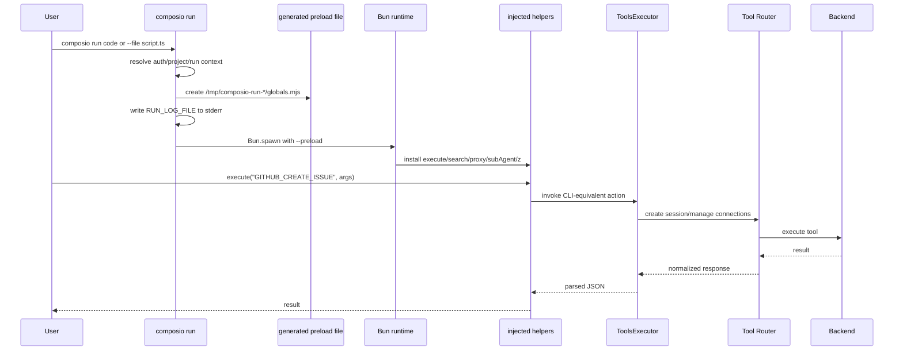
```mermaid
sequenceDiagram
  participant User
  participant CLI as composio run
  participant Preload as generated preload file
  participant Bun as Bun runtime
  participant Helpers as injected helpers
  participant Exec as ToolsExecutor
  participant Router as Tool Router
  participant Backend

  User->>CLI: composio run code or --file script.ts
  CLI->>CLI: resolve auth/project/run context
  CLI->>Preload: create /tmp/composio-run-*/globals.mjs
  CLI->>CLI: write RUN_LOG_FILE to stderr
  CLI->>Bun: Bun.spawn with --preload
  Bun->>Helpers: install execute/search/proxy/subAgent/z
  User->>Helpers: execute("GITHUB_CREATE_ISSUE", args)
  Helpers->>Exec: invoke CLI-equivalent action
  Exec->>Router: create session/manage connections
  Router->>Backend: execute tool
  Backend-->>Router: result
  Router-->>Exec: normalized response
  Exec-->>Helpers: parsed JSON
  Helpers-->>User: result
```

`composio run`이 주입하는 global helper:

- `execute(slug, data?, options?)`
- `search(query, options?)`
- `experimental_subAgent(prompt, options?)`
- `invokeAgent(prompt, options?)`
- `proxy(toolkit)`
- `z`, `zod`
- `__composioRunContext`
- `__composioConsumerContext`

중요한 내부 동작:

- inline code는 마지막 expression을 return하도록 감싼다.
- `--file`은 원본 파일 옆에 `.composio-run-<tmpid>.<ext>` wrapper를 만든 뒤 정리한다.
- preload file은 `/tmp/composio-run-*` 아래 생성된다.
- run log 경로는 `RUN_LOG_FILE=<path>`로 stderr에 출력된다.
- `BUN_BE_BUN=1`을 넣어 compiled Bun binary가 plain Bun runtime처럼 동작하게 한다.

### 8.3 ToolsExecutor 흐름

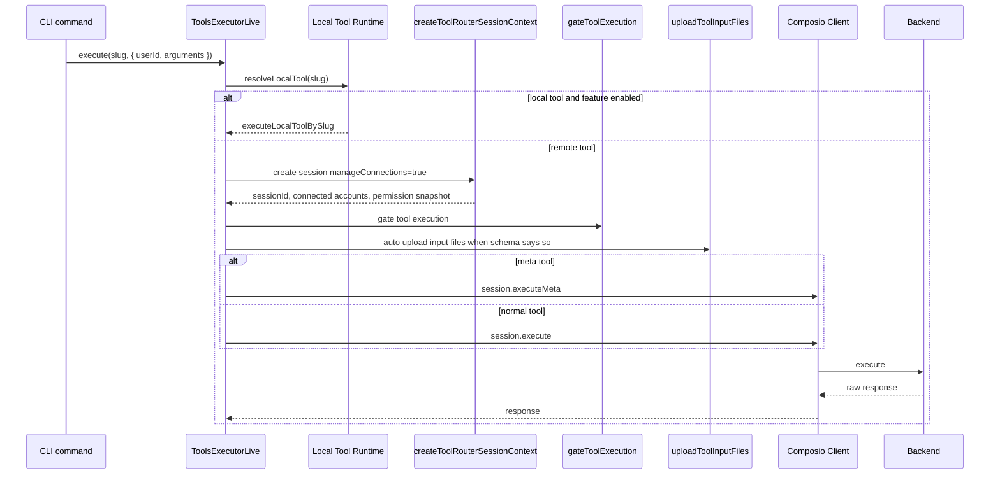
```mermaid
sequenceDiagram
  participant Command as CLI command
  participant Exec as ToolsExecutorLive
  participant Local as Local Tool Runtime
  participant SessionCtx as createToolRouterSessionContext
  participant Perm as gateToolExecution
  participant Upload as uploadToolInputFiles
  participant Client as Composio Client
  participant Backend

  Command->>Exec: execute(slug, { userId, arguments })
  Exec->>Local: resolveLocalTool(slug)
  alt local tool and feature enabled
    Local-->>Exec: executeLocalToolBySlug
  else remote tool
    Exec->>SessionCtx: create session manageConnections=true
    SessionCtx-->>Exec: sessionId, connected accounts, permission snapshot
    Exec->>Perm: gate tool execution
    Exec->>Upload: auto upload input files when schema says so
    alt meta tool
      Exec->>Client: session.executeMeta
    else normal tool
      Exec->>Client: session.execute
    end
    Client->>Backend: execute
    Backend-->>Client: raw response
    Client-->>Exec: response
  end
```

Meta tool slugs:

- `COMPOSIO_SEARCH_TOOLS`
- `COMPOSIO_MULTI_EXECUTE_TOOL`
- `COMPOSIO_MANAGE_CONNECTIONS`
- `COMPOSIO_WAIT_FOR_CONNECTIONS`
- `COMPOSIO_REMOTE_WORKBENCH`
- `COMPOSIO_REMOTE_BASH_TOOL`
- `COMPOSIO_GET_TOOL_SCHEMAS`
- `COMPOSIO_UPSERT_RECIPE`
- `COMPOSIO_GET_RECIPE`

`COMPOSIO_REMOTE_WORKBENCH`와 `COMPOSIO_REMOTE_BASH_TOOL`은 이름 그대로 원격 작업대/셸 실행 표면이므로 툴 노출 범위를 좁게 잡아야 한다.

## 9. Permission gate

enhanced controls는 CLI에서 tool 실행 전에 승인 UI를 띄우는 장치다.

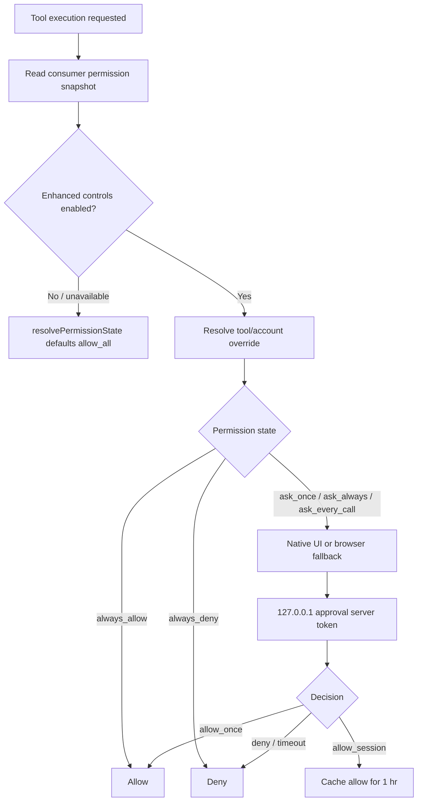
```mermaid
flowchart TD
  A["Tool execution requested"] --> B["Read consumer permission snapshot"]
  B --> C{"Enhanced controls enabled?"}
  C -- "No / unavailable" --> D["resolvePermissionState defaults allow_all"]
  C -- "Yes" --> E["Resolve tool/account override"]
  E --> F{"Permission state"}
  F -- "always_allow" --> G["Allow"]
  F -- "always_deny" --> H["Deny"]
  F -- "ask_once / ask_always / ask_every_call" --> I["Native UI or browser fallback"]
  I --> J["127.0.0.1 approval server token"]
  J --> K{"Decision"}
  K -- "allow_once" --> G
  K -- "allow_session" --> L["Cache allow for 1 hr"]
  K -- "deny / timeout" --> H
```

핵심 관찰:

- enhanced controls 미지원 플랫폼: `darwin-x64`.
- permission snapshot TTL: 5분.
- allow session cache: 1시간.
- 승인 UI timeout은 30초이며 timeout은 deny로 처리된다.
- 그러나 snapshot이 없거나 enhanced controls가 꺼져 있으면 기본이 `allow_all`이다.

## 10. 로컬 툴 아키텍처

`ts/packages/cli-local-tools`는 Composio CLI에 내장되는 실험적 local toolkit이다.

### 10.1 registry

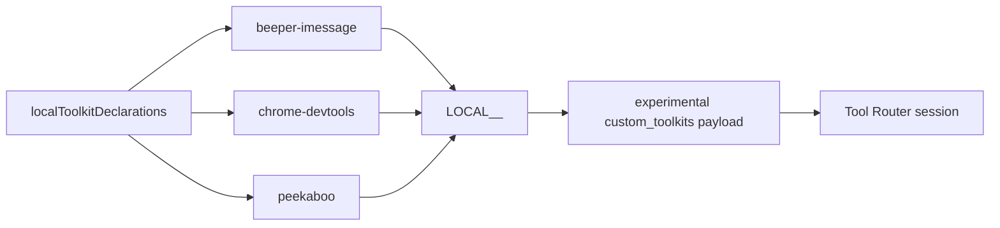
```mermaid
flowchart LR
  Registry["localToolkitDeclarations"]
  Registry --> Beeper["beeper-imessage"]
  Registry --> Chrome["chrome-devtools"]
  Registry --> Peekaboo["peekaboo"]
  Beeper --> LocalSlug["LOCAL_<TOOLKIT>_<TOOL>"]
  Chrome --> LocalSlug
  Peekaboo --> LocalSlug
  LocalSlug --> CustomToolkit["experimental custom_toolkits payload"]
  CustomToolkit --> ToolRouter["Tool Router session"]
```

### 10.2 runtime execution kinds

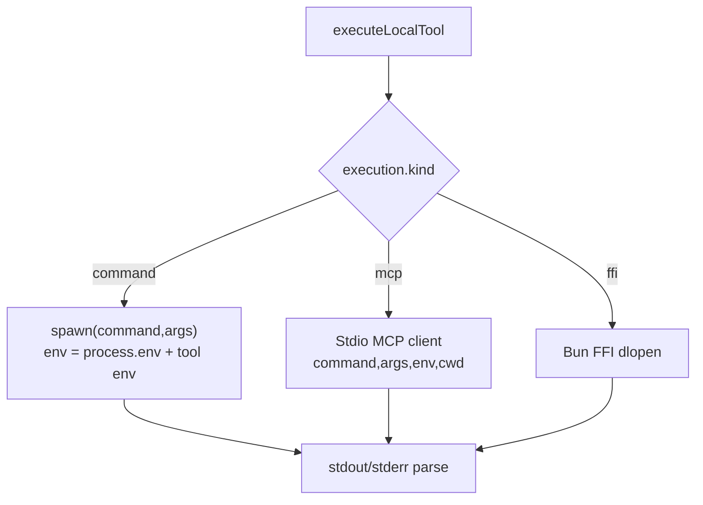
```mermaid
flowchart TD
  A["executeLocalTool"] --> B{"execution.kind"}
  B -- "command" --> C["spawn(command,args)<br/>env = process.env + tool env"]
  B -- "mcp" --> D["Stdio MCP client<br/>command,args,env,cwd"]
  B -- "ffi" --> E["Bun FFI dlopen"]
  C --> F["stdout/stderr parse"]
  D --> F
  E --> F
```

중요 툴킷:

- Chrome DevTools
  - `npx -y --package chrome-devtools-mcp@0.24.0 chrome-devtools`
  - page list, snapshot, click/type/navigate/evaluate 등 browser automation surface.
  - supply chain/network 실행과 브라우저 세션 접근 위험이 있다.

- Peekaboo
  - macOS screen/GUI automation.
  - Screen Recording, Accessibility, Automation 권한이 필요하다.
  - GUI 상태와 화면 내용이 tool input/output에 노출될 수 있다.

- Beeper iMessage
  - iMessage 읽기/전송/목록 기능.
  - 개인 메시지, 연락처, 대화 내용 접근 위험이 크다.

## 11. 파일 업로드/다운로드 흐름

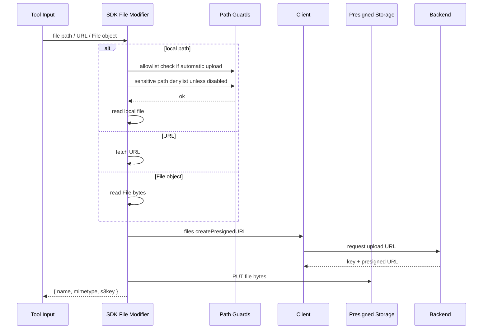
```mermaid
sequenceDiagram
  participant Tool as Tool Input
  participant SDK as SDK File Modifier
  participant Guard as Path Guards
  participant Client
  participant S3 as Presigned Storage
  participant Backend

  Tool->>SDK: file path / URL / File object
  alt local path
    SDK->>Guard: allowlist check if automatic upload
    SDK->>Guard: sensitive path denylist unless disabled
    Guard-->>SDK: ok
    SDK->>SDK: read local file
  else URL
    SDK->>SDK: fetch URL
  else File object
    SDK->>SDK: read File bytes
  end
  SDK->>Client: files.createPresignedURL
  Client->>Backend: request upload URL
  Backend-->>Client: key + presigned URL
  SDK->>S3: PUT file bytes
  SDK-->>Tool: { name, mimetype, s3key }
```

보호 장치:

- automatic upload는 `dangerouslyAllowAutoUploadDownloadFiles: true`일 때만.
- automatic upload local path는 `fileUploadDirs` allowlist를 통과해야 한다.
- default allowlist는 `~/.composio/temp`.
- sensitive denylist:
  - `.ssh`
  - `.aws`
  - `.azure`
  - `.gnupg`
  - `.kube`
  - `.docker`
  - `.claude`
  - `.password-store`
  - `keychains`
  - `.env*`
  - `.netrc`
  - `.pgpass`
  - `id_rsa`, `id_ed25519`, `id_ecdsa`, `id_dsa`, `id_ecdsa_sk`
  - basename `credentials`

위험:

- manual `composio.files.upload()`는 upload dir allowlist를 적용하지 않는다.
- URL 입력은 path allowlist와 sensitive path check를 타지 않고 fetch된다.
- `sensitiveFileUploadProtection: false`가 가능하다.
- 자동 업로드를 넓은 allowlist로 켜면 prompt-injected tool이 프로세스가 읽을 수 있는 파일을 외부로 올릴 수 있다.

## 12. 인증/연결 계정 흐름

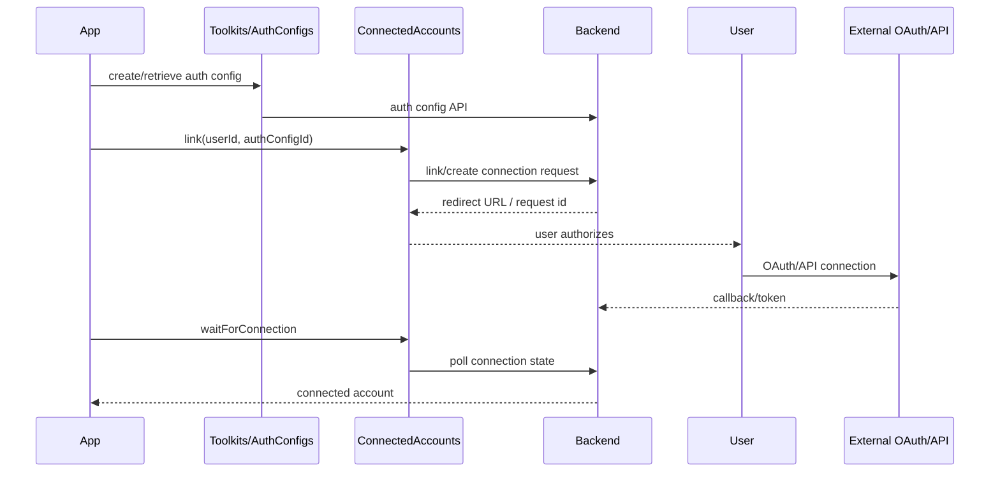
```mermaid
sequenceDiagram
  participant App
  participant Toolkit as Toolkits/AuthConfigs
  participant CA as ConnectedAccounts
  participant Backend
  participant User
  participant External as External OAuth/API

  App->>Toolkit: create/retrieve auth config
  Toolkit->>Backend: auth config API
  App->>CA: link(userId, authConfigId)
  CA->>Backend: link/create connection request
  Backend-->>CA: redirect URL / request id
  CA-->>User: user authorizes
  User->>External: OAuth/API connection
  External-->>Backend: callback/token
  App->>CA: waitForConnection
  CA->>Backend: poll connection state
  Backend-->>App: connected account
```

특징:

- `ConnectedAccounts.link()`가 Composio-managed redirectable OAuth의 주 흐름이다.
- `initiate()`는 legacy endpoint로 retirement warning이 들어 있다.
  - 2026-05-08: new org cutover
  - 2026-07-03: remaining org cutover
- 동일 user/authConfig에 active account가 있으면 `allowMultiple` 없이 중복 생성을 막는다.
- shared connection ACL은 experimental update path로 관리한다.

## 13. Trigger / webhook / realtime 흐름

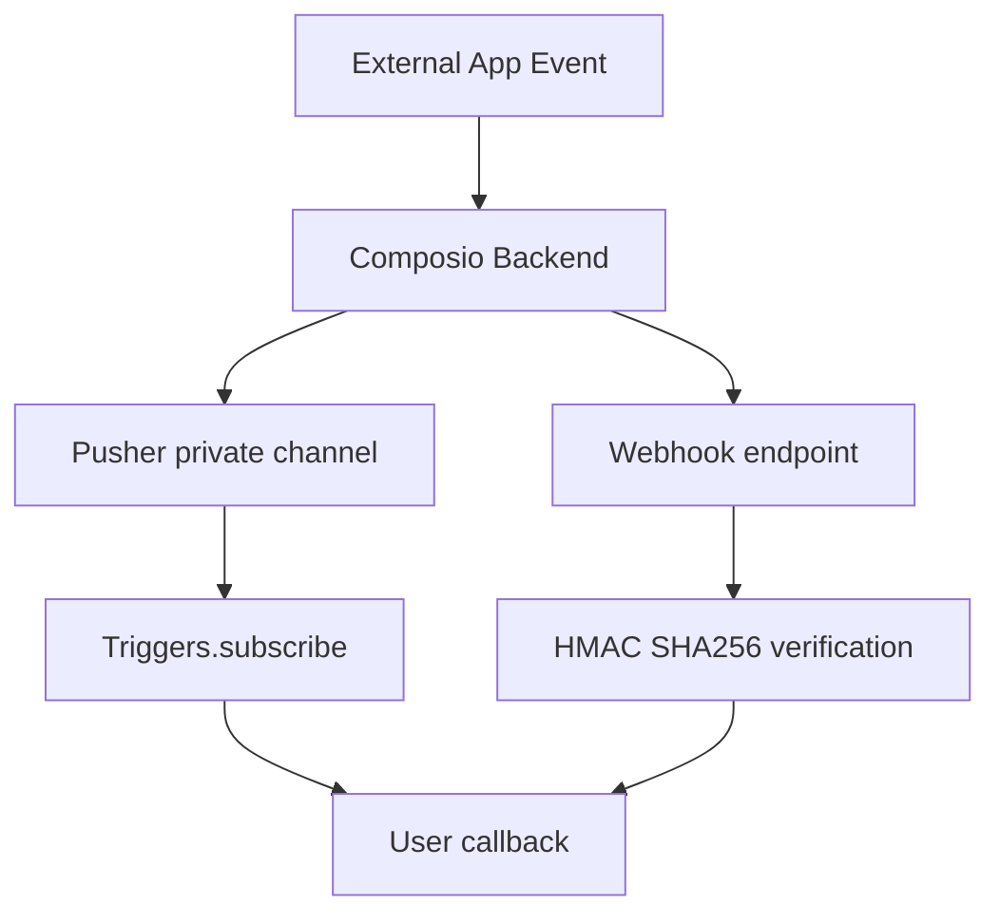
```mermaid
flowchart TB
  External["External App Event"]
  Backend["Composio Backend"]
  Pusher["Pusher private channel"]
  SDK["Triggers.subscribe"]
  Callback["User callback"]
  Webhook["Webhook endpoint"]
  Verify["HMAC SHA256 verification"]

  External --> Backend
  Backend --> Pusher
  Pusher --> SDK
  SDK --> Callback
  Backend --> Webhook
  Webhook --> Verify
  Verify --> Callback
```

구현 특징:

- realtime credentials는 internal API로 받아온다.
- channel은 `private-${projectId}_triggers` 형태다.
- auth endpoint는 `${baseURL}/api/v3/internal/sdk/realtime/auth`, header는 `x-api-key`.
- chunked event reassembly와 JSON parse 로직이 있다.
- webhook verification은 HMAC SHA256 기반이다.

위험:

- trigger payload에는 외부 앱 이벤트 데이터가 들어간다. Gmail/Slack/GitHub 등에서는 PII와 민감한 업무 이벤트가 포함될 수 있다.
- debug logging이 켜져 있으면 trigger raw data를 자세히 찍는 경로가 있다.

## 14. Python SDK

Python SDK는 TypeScript SDK와 거의 같은 모델 구조를 가진다.

주요 객체:

- `Composio`
- `Tools`
- `Toolkits`
- `Triggers`
- `AuthConfigs`
- `ConnectedAccounts`
- `MCP`
- `Experimental`
- `ToolRouter`

초기화 특징:

- `api_key` argument 또는 `COMPOSIO_API_KEY`를 요구한다.
- default provider는 OpenAIProvider.
- `allow_tracking` contextvar 기본값은 true.
- `dangerously_allow_auto_upload_download_files` 기본값은 false.

검증 결과:

- 핵심 Python 파일 문법 컴파일은 통과했다.
- 실제 import는 현재 환경에 `typing_extensions`가 없어 실패했다.

## 15. 숨겨진/보이지 않는 부분

### 15.1 원격 백엔드

공개 저장소에서 보이지 않는 것:

- 각 외부 앱별 실제 tool implementation.
- action 실행 sandbox.
- credential storage.
- backend-side authorization policy.
- toolkit catalog generation.
- remote workbench / remote bash backend.
- Tool Router search ranking.
- managed MCP server runtime.

SDK는 대부분 다음 호출로 넘어간다.

- `client.tools.list`
- `client.tools.retrieve`
- `client.tools.execute`
- `client.tools.proxy`
- `client.toolRouter.session.create`
- `client.toolRouter.session.execute`
- `client.toolRouter.session.executeMeta`
- `client.link.create`
- `client.connectedAccounts.*`
- `client.files.createPresignedURL`

### 15.2 생성 코드

`@composio/client`와 Python `composio-client`는 OpenAPI spec 기반 생성 클라이언트다. README는 spec을 `https://backend.composio.dev/api/v3/openapi.json`에서 pull한다고 설명한다.

따라서 공개 repo에 있는 source는 “API 호출 모양”은 보여주지만, backend implementation까지 보여주지는 않는다.

### 15.3 agent instruction surface

다음 디렉터리는 일반 SDK runtime이 아니라 저장소 작업 agent에게 영향을 주는 숨은 운영 표면이다.

- `.agents/skills`
- `.claude/skills`
- `.claude/commands`
- `.claude/rules`
- `.claude/scheduled_tasks.lock`

이들은 repository contributor workflow에는 중요하지만, SDK 사용자 보안 경계와는 별도로 봐야 한다.

## 16. 주요 차별점

1. 외부 앱 액션 layer를 SDK와 CLI 모두에서 제공한다.
   - 다른 agent framework는 reasoning/orchestration 중심인 경우가 많다.
   - Composio는 “실제 외부 SaaS/API 행동”을 연결하는 데 초점을 둔다.

2. framework adapter 범위가 넓다.
   - OpenAI, Anthropic, LangChain, LangGraph, CrewAI, AutoGen 등으로 같은 tool catalog를 감싼다.

3. Tool Router session 추상화가 강하다.
   - tool search, connection management, workbench, local/custom tools, MCP config를 session에 담는다.

4. CLI scripting이 강하다.
   - `composio run`은 shell command가 아니라 mini runtime이다.
   - injected helper와 sub-agent를 통해 에이전트 자동화 스크립트를 쉽게 만든다.

5. 로컬 툴과 원격 툴을 같은 Tool Router로 합친다.
   - Chrome DevTools, Peekaboo, iMessage 같은 로컬 capability를 `LOCAL_` slug로 노출한다.

## 17. 위험 요소와 이상한 점

### 17.1 API key logging 위험

`ts/packages/core/src/utils/sdk.ts`의 `getSDKConfig`는 debug log에서 실제 API key를 출력하는 경로가 있다.

영향:

- debug log가 수집/공유되는 환경에서 Composio API key가 노출될 수 있다.

완화:

- debug logging에서 key redaction 적용.
- `API Key: ${apiKeyParsed}` 같은 문자열 제거.
- CI/log collector에서 `COMPOSIO_API_KEY` pattern redaction.

### 17.2 telemetry 기본 enabled

TypeScript와 Python 모두 telemetry가 기본 true다.

영향:

- SDK initialization과 method invocation metric/error telemetry가 `https://telemetry.composio.dev/v1`로 전송될 수 있다.

완화:

- 프로덕션/보안 테스트에서는 `allowTracking: false` 또는 Python `allow_tracking=False`.
- CLI는 `COMPOSIO_CLI_TELEMETRY_DISABLED`, `TELEMETRY_DISABLED`, `COMPOSIO_DISABLE_TELEMETRY` 확인.

### 17.3 provider 실행의 version check skip

provider wrapper 경유 실행은 `dangerouslySkipVersionCheck: true`를 자동 적용한다.

영향:

- `latest` toolkit이 바뀌면 같은 agent prompt라도 schema/action behavior가 달라질 수 있다.

완화:

- `toolkitVersions`를 pinning.
- `COMPOSIO_TOOLKIT_VERSION_<TOOLKIT>` 사용.
- 중요한 업무 자동화는 latest 금지.

### 17.4 Tool Router MCP header 노출

MCP config 생성 시 `x-api-key` header가 포함될 수 있다.

영향:

- MCP config 파일을 공유하면 API key도 같이 공유될 수 있다.
- MCP client가 로그에 headers를 찍으면 key가 노출될 수 있다.

완화:

- MCP config를 secret file로 취급.
- allowed tools/toolkits를 최소화.
- key rotation.

### 17.5 local tools 실행 반경

local tools runtime은 command spawn, stdio MCP, Bun FFI를 지원하고 `process.env`를 상속한다.

영향:

- local tool이 환경변수, 로컬 파일, GUI, 브라우저, 메시지 앱에 접근할 수 있다.
- `npx -y --package ...` 실행은 supply chain과 네트워크 의존성을 가진다.

완화:

- local tools experimental feature를 기본 off로 유지.
- 별도 sandbox user 계정에서 실행.
- environment allowlist 적용.
- GUI/메시지 권한은 별도 프로파일에서만 허용.

### 17.6 enhanced controls의 fail-open 성격

enhanced controls가 없으면 permission state 기본값은 `allow_all`이다.

영향:

- 개발자는 권한 승인 UI가 항상 보호한다고 오해할 수 있다.
- 실제로는 org/project consumer config가 켜져 있고 snapshot이 있어야 gate가 의미를 갖는다.

완화:

- permission gate status를 CLI 출력에 명확히 표시.
- 조직 정책으로 ask mode 강제.
- high-risk tool 실행 전 별도 확인.

### 17.7 proxy 기능

`tools.proxy`와 CLI `proxy(toolkit)`은 toolkit 연결 계정으로 API 요청을 대신 보내는 fetch-like surface다.

영향:

- 잘못 쓰면 tool schema로 제한된 액션보다 넓은 API surface를 열 수 있다.
- OAuth scope가 넓으면 arbitrary endpoint 접근이 가능해질 수 있다.

완화:

- proxy를 high-risk feature로 분류.
- toolkit별 allowed endpoint policy 필요.
- audit log 필수.

### 17.8 remote workbench / remote bash

CLI meta tools에 `COMPOSIO_REMOTE_WORKBENCH`, `COMPOSIO_REMOTE_BASH_TOOL`이 있다.

영향:

- 원격 코드 실행/셸 실행 표면이다.
- prompt injection과 결합하면 외부 코드 실행으로 이어질 수 있다.

완화:

- default tool exposure에서 제외.
- session config `workbench: false` 또는 allowedTools 최소화.
- network/file/secret isolation 확인.

### 17.9 manual file upload allowlist bypass

manual `composio.files.upload()`는 upload dir allowlist 대상이 아니다. 주석에도 명시되어 있다.

영향:

- SDK 사용자가 allowlist가 모든 파일 업로드에 적용된다고 오해할 수 있다.

완화:

- manual upload에도 옵션으로 allowlist enforcement 제공.
- 문서에 더 강하게 표시.

### 17.10 URL file fetch

file upload에서 URL은 allowlist/sensitive path check를 타지 않고 fetch된다.

영향:

- 런타임 환경에서 내부망 URL fetch가 가능하면 SSRF-like 문제가 될 수 있다.

완화:

- URL upload allow/deny policy.
- private IP/link-local block.
- production에서는 explicit domain allowlist.

### 17.11 여러 연결 계정 처리

일부 경로는 여러 auth config/connected account가 있을 때 첫 번째를 선택하거나 warning 후 진행한다.

예:

- `Toolkits.authorize`에서 multiple auth configs.
- `Triggers.create`에서 connected account id가 없으면 첫 연결 계정을 선택하는 흐름.

영향:

- 사용자가 의도하지 않은 계정으로 이벤트/액션이 실행될 수 있다.

완화:

- production에서는 connected account id를 명시.
- multi-account mode에서는 account selector를 강제.

### 17.12 라이선스/버전 불일치

GitHub metadata, TypeScript package license, Python classifier가 다르다. 패키지 버전도 여러 계층에서 다르게 보인다.

영향:

- compliance와 dependency 정책에서 혼선.
- docs와 source의 API 차이 가능성.

완화:

- root LICENSE와 모든 package metadata 정합성 확인.
- release notes와 docs lock version을 함께 검토.

## 18. 실행 검증 결과

현재 로컬 환경:

```text
Node.js: v23.4.0
pnpm: 11.5.1
Bun: not installed
uv: not installed
Python: 3.13.1
node_modules: missing
Python venv: missing
```

실행한 검증:

```text
git rev-parse --short HEAD
-> 094aed6

find . -path ./.git -prune -o -type f | wc -l
-> 2245

find ts python -type f | wc -l
-> 1543

python3 -m py_compile 핵심 Python 파일들
-> 통과

PYTHONPATH=python python3 -c "import composio"
-> ModuleNotFoundError: No module named 'typing_extensions'

pnpm --filter @composio/core typecheck
-> 실패
   - 저장소 요구 pnpm: 10.28.2
   - 현재 pnpm: 11.5.1
   - 저장소 요구 Node: 20.20.2
   - 현재 Node: 23.4.0
   - preinstall에서 Bun 없음으로 실패
```

빌드 실패는 코드 오류라기보다 의존성/런타임 전제 불일치다. 이 저장소는 Bun이 CLI 빌드와 `composio run` 경로의 핵심 전제다.

## 19. 실제 사용자 플로우

### 19.1 SDK로 OpenAI Agent에 HackerNews tool 붙이기

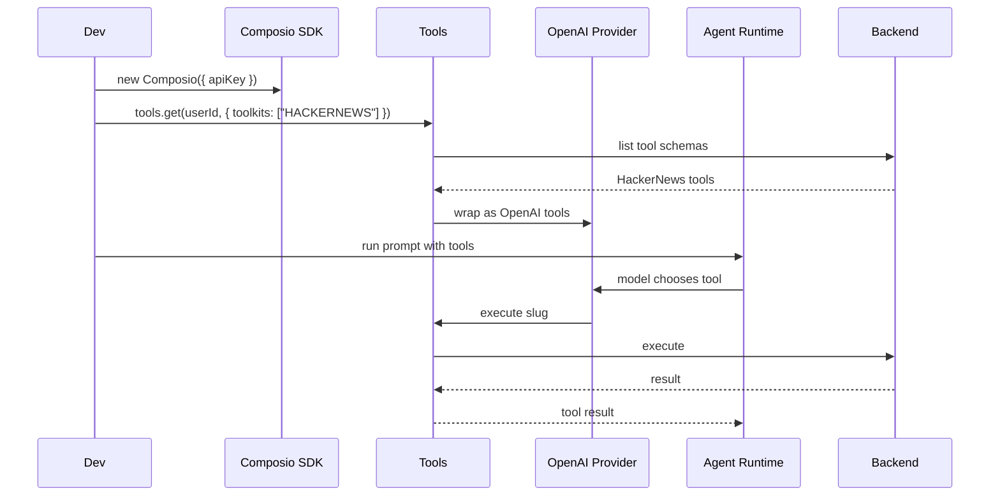
```mermaid
sequenceDiagram
  participant Dev
  participant SDK as Composio SDK
  participant Tools
  participant OpenAI as OpenAI Provider
  participant Agent as Agent Runtime
  participant Backend

  Dev->>SDK: new Composio({ apiKey })
  Dev->>Tools: tools.get(userId, { toolkits: ["HACKERNEWS"] })
  Tools->>Backend: list tool schemas
  Backend-->>Tools: HackerNews tools
  Tools->>OpenAI: wrap as OpenAI tools
  Dev->>Agent: run prompt with tools
  Agent->>OpenAI: model chooses tool
  OpenAI->>Tools: execute slug
  Tools->>Backend: execute
  Backend-->>Tools: result
  Tools-->>Agent: tool result
```

### 19.2 OAuth 연결 후 GitHub issue 만들기

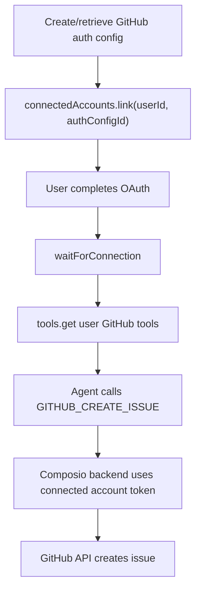
```mermaid
flowchart TD
  A["Create/retrieve GitHub auth config"] --> B["connectedAccounts.link(userId, authConfigId)"]
  B --> C["User completes OAuth"]
  C --> D["waitForConnection"]
  D --> E["tools.get user GitHub tools"]
  E --> F["Agent calls GITHUB_CREATE_ISSUE"]
  F --> G["Composio backend uses connected account token"]
  G --> H["GitHub API creates issue"]
```

### 19.3 CLI scripting

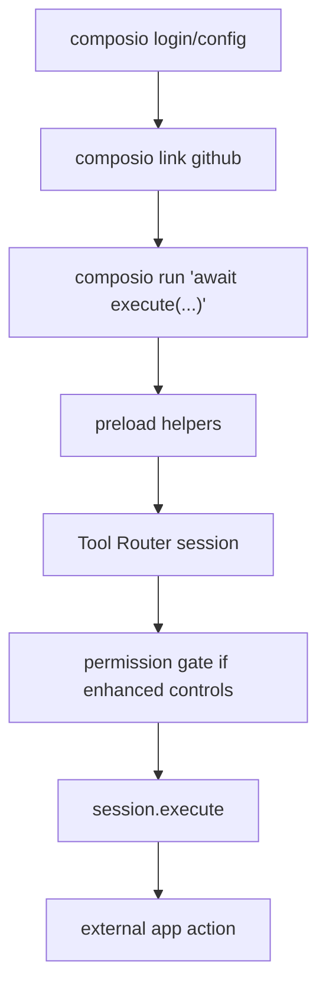
```mermaid
flowchart TD
  A["composio login/config"] --> B["composio link github"]
  B --> C["composio run 'await execute(...)'"]
  C --> D["preload helpers"]
  D --> E["Tool Router session"]
  E --> F["permission gate if enhanced controls"]
  F --> G["session.execute"]
  G --> H["external app action"]
```

### 19.4 MCP export

```mermaid
flowchart TD
  A["composio.mcp.create(config)"] --> B["Backend creates server config"]
  B --> C["generate(userId)"]
  C --> D["MCP URL + headers"]
  D --> E["Claude/Codex/IDE registers MCP"]
  E --> F["Agent calls MCP tool"]
  F --> G["Composio backend executes external action"]
```

## 20. 소스 호출 관계 요약

```mermaid
flowchart TB
  Composio["src/composio.ts<br/>Composio"]
  Tools["models/Tools.ts"]
  Toolkits["models/Toolkits.ts"]
  Connected["models/ConnectedAccounts.ts"]
  Auth["models/AuthConfigs.ts"]
  Router["models/ToolRouter.ts"]
  Session["models/ToolRouterSession.ts"]
  MCP["models/MCP.ts"]
  Triggers["models/Triggers.ts"]
  Files["models/Files.node.ts"]
  Client["@composio/client"]

  Composio --> Tools
  Composio --> Toolkits
  Composio --> Connected
  Composio --> Auth
  Composio --> Router
  Composio --> MCP
  Composio --> Triggers
  Composio --> Files
  Tools --> Client
  Toolkits --> Client
  Connected --> Client
  Auth --> Client
  Router --> Client
  Router --> Session
  Session --> Client
  MCP --> Client
  Triggers --> Client
  Files --> Client
```

## 21. 운영 권장사항

1. toolkit version pinning을 기본 정책으로 둔다.
2. telemetry는 보안/기업 환경에서 명시적으로 끈다.
3. local tools는 별도 sandbox 계정에서만 켠다.
4. MCP config와 Composio API key는 secret으로 취급한다.
5. `proxy`, `REMOTE_BASH`, `REMOTE_WORKBENCH`, file upload를 high-risk action으로 분류한다.
6. Tool Router session은 allowed tool/toolkit을 좁게 생성한다.
7. connection account id를 명시해서 “첫 계정 선택”을 피한다.
8. manual file upload와 URL upload에 별도 정책을 둔다.
9. debug log redaction을 확인한다.
10. `.agents`와 `.claude` 디렉터리는 repo 작업 자동화 지시로 별도 검토한다.

## 22. 최종 평가

Composio는 코딩 에이전트의 두뇌를 만드는 저장소가 아니라, 에이전트가 외부 세계에 손을 뻗는 action/control plane을 만드는 저장소다. 아키텍처의 핵심 가치는 provider adapter, Tool Router session, connection/auth management, MCP export, CLI scripting, local tools 결합에 있다.

동시에 이 장점이 그대로 위험 표면이 된다. 연결 계정이 많고 툴 노출이 넓을수록 LLM prompt injection, 잘못된 계정 선택, API key 노출, 파일 업로드, remote shell, local GUI/message automation 위험이 커진다. 공개 repo만으로 backend 실행 정책을 완전히 검증할 수 없기 때문에, 실제 도입 판단은 SDK 코드뿐 아니라 Composio backend policy, audit log, workspace isolation, org permission settings까지 함께 봐야 한다.

잘 운영하면 “에이전트의 외부 액션 버스”로 매우 강력하고, 느슨하게 운영하면 “LLM이 너무 많은 실제 권한을 가진 실행 브로커”가 된다.
