# Kilo-Org/kilocode 상세 분석 보고서

## 1. 기본 평가

- 대상: `https://github.com/Kilo-Org/kilocode`
- 로컬 소스: `sources/Kilo-Org__kilocode`
- 분석 기준 커밋: `5637375874d80dacf7d7365ba5a3e97ca29110b8` (`5637375`)
- 기준 브랜치: `main`
- 마지막 커밋 시각: 2026-06-10 15:27:05 +0200
- 최신 릴리스: `v7.3.41`, 2026-06-09
- 생성일: 2025-03-10
- 주 언어: TypeScript
- 라이선스: MIT
- 로컬 파일 수: 6,880개
- GitHub 지표: stars 19,983, forks 2,643, watchers 101
- 공식 설명: “Kilo is the all-in-one agentic engineering platform. Build, ship, and iterate faster with the most popular open source coding agent.”

`Kilo-Org/kilocode`는 단일 CLI 도구라기보다 “OpenCode 계열 에이전트 런타임을 중심에 둔 다중 제품 플랫폼”이다. 같은 저장소 안에 `kilo` CLI/TUI/headless server, VS Code 확장, JetBrains 플러그인, 게이트웨이 provider, 코드베이스 인덱싱 엔진, 텔레메트리, 웹 UI, SDK, 플러그인 시스템이 함께 들어 있다.

README는 Kilo를 “all-in-one agentic engineering platform”으로 설명하고, VS Code, JetBrains, CLI, Slack, Cloud를 모두 제품 표면으로 제시한다. 소스 기준으로 가장 핵심이 되는 런타임은 `packages/opencode`다. 이 패키지가 `kilo run`, `kilo serve`, TUI, session, LLM 호출, tool registry, permission, MCP, plugin, worktree 관련 서버 API를 제공한다. VS Code 확장은 별도 에이전트 엔진을 들고 있지 않고, 번들된 `kilo` 바이너리를 로컬 서버로 띄운 뒤 SDK/SSE로 붙는다.

이 레포의 핵심 평가는 다음과 같다.

1. 기능 폭은 대상 30개 중 최상위권이다.
   - CLI, IDE, Agent Manager, worktree 병렬 세션, 코드 인덱싱, MCP, cloud session, autocomplete, gateway provider, session export까지 한 저장소에서 다룬다.

2. 구조는 OpenCode fork를 기반으로 하되 Kilo 전용 제품 레이어가 상당히 크다.
   - `AGENTS.md`가 명시하듯 CLI는 upstream OpenCode fork이며, 공유 파일의 Kilo 변경에는 `kilocode_change` marker를 붙여 upstream merge 비용을 관리한다.

3. 보안 경계는 “사용자 확인을 거친 local agent”에 가깝다.
   - 기본 permission layer는 shell/edit/MCP/semantic search/Agent Manager 등을 묻도록 구성되어 있지만, `kilo run --auto`, `--dangerously-skip-permissions`, `permission.allowEverything` API, VS Code Agent Manager, background process tool은 강한 권한을 가진다.

4. 오픈소스 코드 밖의 의존도도 높다.
   - Kilo Gateway, Kilo account, free model eligibility, cloud session import/export, session ingest endpoint, model catalog, remote status 같은 경로는 공개 코드와 외부 호스팅 서비스가 결합되어 동작한다.

## 2. 철학과 포지션

Kilo의 철학은 “모든 개발 접점에서 같은 에이전트 런타임을 재사용한다”에 가깝다. `AGENTS.md`는 제품 구성을 다음처럼 설명한다.

- 모든 제품은 CLI의 client다.
- `packages/opencode`가 AI agent runtime, HTTP server, session management를 가진다.
- 각 client는 `kilo serve`를 spawn하거나 연결하고 `@kilocode/sdk`로 HTTP + SSE 통신을 한다.
- VS Code Agent Manager도 worktree마다 서버를 띄우지 않고, 하나의 공유 backend에 directory context를 넘긴다.

이 포지션은 Cline/Roo 계열 IDE agent와 OpenCode류 CLI agent의 중간에 있다. Cline/Roo가 VS Code extension 경험을 중심에 두고, OpenCode가 terminal-first를 중심에 둔다면 Kilo는 CLI 런타임을 중앙 엔진으로 삼고 IDE, cloud, Slack, console, JetBrains를 얹으려 한다.

Kilo가 중요하게 보는 설계 방향은 다음이다.

1. CLI를 platform kernel로 둔다
   - `packages/opencode`가 session, permission, tool, MCP, provider, server, TUI를 모두 가진다.
   - 제품 클라이언트는 CLI server를 호출한다.

2. 사용자 경험은 IDE와 CLI 양쪽에 맞춘다
   - CLI: `kilo`, `kilo run`, `kilo run --interactive`, `kilo serve`.
   - VS Code: Sidebar, editor tab, Agent Manager, marketplace, autocomplete, KiloClaw, cloud session.
   - JetBrains: 별도 Gradle 기반 plugin package.

3. 모델 접근은 Kilo Gateway와 BYO provider를 병행한다
   - README는 “500+ models”, “API keys optional”, “transparent provider pricing”을 전면에 둔다.
   - 소스에는 `@kilocode/kilo-gateway`, `createKilo`, OpenRouter/Anthropic/OpenAI/Mistral/Alibaba provider wrapper가 포함된다.

4. upstream fork 비용을 명시적으로 관리한다
   - `AGENTS.md`는 OpenCode와 공유되는 파일에는 `kilocode_change` marker를 붙이라고 요구한다.
   - 이는 단순 fork가 아니라 지속적으로 upstream merge를 하려는 구조라는 뜻이다.

5. 자동화에 공격적이다
   - Agent Manager는 worktree를 만들고 여러 세션을 띄운다.
   - background process tool은 개발 서버 같은 장기 실행 프로세스를 agent가 관리하게 한다.
   - `kilo run --auto`는 autonomous/pipeline 사용을 위해 모든 권한을 자동 승인한다.

## 3. 모노레포 구조

상위 `package.json`은 `@kilocode/kilo`, version `7.3.42`, `bun@1.3.13`을 package manager로 지정한다. root script의 `test`는 “root에서 test를 돌리지 말라”고 실패하도록 되어 있고, 패키지별 `bun test`, `tsgo --noEmit`, `bun turbo typecheck`를 쓰는 구조다.

핵심 패키지는 다음과 같다.

| 경로 | 역할 |
| --- | --- |
| `packages/opencode` | `@kilocode/cli`. CLI/TUI/headless server/session/tool/permission/MCP/provider core. OpenCode fork 기반 |
| `packages/core` | `@opencode-ai/core`. logging, global path, installation, filesystem, flags, provider utility |
| `packages/llm` | LLM protocol/provider 계층 |
| `packages/sdk/js` | HTTP API client SDK. VS Code/외부 client가 사용 |
| `packages/kilo-vscode` | VS Code extension. Sidebar, Agent Manager, autocomplete, marketplace, cloud session, telemetry proxy |
| `packages/kilo-jetbrains` | JetBrains plugin |
| `packages/kilo-gateway` | Kilo provider/gateway/auth/model catalog/FIM/edit/cloud-session API wrapper |
| `packages/kilo-indexing` | 코드베이스 인덱싱 엔진. scanner/parser/embedder/vector store/search service |
| `packages/kilo-telemetry` | PostHog 기반 telemetry와 identity |
| `packages/kilo-ui`, `packages/ui` | UI component 계층 |
| `packages/kilo-web-ui`, `packages/kilo-console` | 웹/콘솔 제품 표면 |
| `packages/plugin`, `packages/plugin-atomic-chat` | Kilo/OpenCode plugin surface |
| `packages/http-recorder`, `packages/storybook`, `packages/script` | 개발/테스트/문서 보조 |

숨겨진 repo-local agent surface도 중요하다.

| 경로 | 의미 |
| --- | --- |
| `.kilo/agent/upstream-merge.md` | Kilo agent용 upstream merge 지시 |
| `.kilo/command/review-upstream-merge.md` | Kilo command |
| `.kilo/plans/*.md` | 과거 planning 산출물 |
| `.kilo/skills/*/SKILL.md` | Kilo 전용 skill |
| `.kilo/run-script` | Agent Manager가 실행할 수 있는 repo run script |
| `.opencode/agent/duplicate-pr.md`, `.opencode/agent/triage.md` | OpenCode agent 정의 |
| `.opencode/command/*.md` | slash command 정의 |
| `.opencode/tool/github-pr-search.ts`, `github-triage.ts` | repo-local custom tool |
| `.opencode/plugins/*.tsx`, `.opencode/themes/*` | OpenCode plugin/theme |
| `.opencode/opencode.jsonc`, `.opencode/tui.json` | OpenCode/Kilo runtime config |

이 파일들은 일반적인 소스 코드 폴더만 보면 놓치기 쉽다. 특히 `.opencode/tool/*.ts`는 dynamic import되어 custom tool로 등록될 수 있으므로, agent 실행 시 권한 표면으로 취급해야 한다.

## 4. 전체 아키텍처

Kilo의 전체 구조는 다음과 같다.

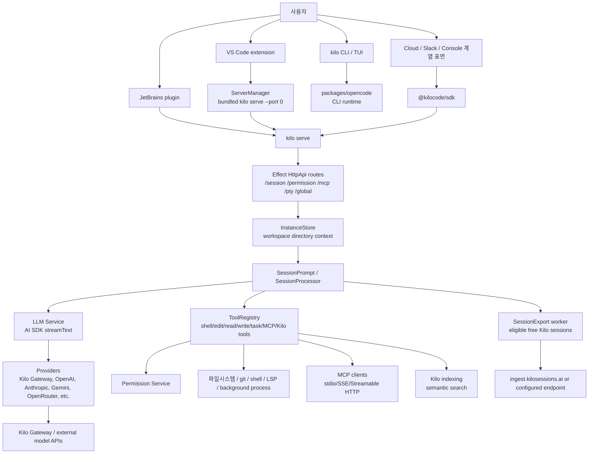

중요한 점은 `kilo serve`가 제품 간 공통 서버라는 것이다. CLI의 non-interactive local path는 실제 TCP listener를 띄우지 않고 `Server.Default().app.fetch`를 내부 fetch로 감싸 `http://kilo.internal` SDK client를 만든다. VS Code는 반대로 번들 binary를 별도 child process로 spawn하고 `http://127.0.0.1:<random>`에 붙는다.

## 5. CLI 엔트리포인트와 명령 체계

CLI 진입점은 `packages/opencode/src/index.ts`다. yargs 기반으로 다음 명령을 등록한다.

| 명령 | 역할 |
| --- | --- |
| `run` | 단일 prompt, interactive split-footer, attach, session resume/fork |
| `serve` | headless HTTP server |
| `mcp` | MCP 관리 |
| `acp` | Agent Client Protocol 계열 통신 |
| `thread`, `attach` | TUI thread/attach |
| `models`, `providers`, `account` | provider/model/account |
| `session`, `export`, `import`, `stats`, `db` | session/storage 운영 |
| `web`, `github`, `pr` | 웹/깃허브/PR 관련 |
| `agent`, `plug`, `debug`, `generate`, `upgrade`, `uninstall` | 개발/확장/유틸리티 |

`index.ts`는 실행 초기에 다음도 수행한다.

- `process.env.AGENT = "1"`, `OPENCODE = "1"`, `KILO_PID = process.pid` 설정
- one-time SQLite migration (`kilo.db`) 수행
- logging/heap/process metadata 초기화
- `--pure`이면 외부 plugin 비활성화를 위해 `KILO_PURE=1` 설정

CLI 명령의 흐름은 다음과 같다.

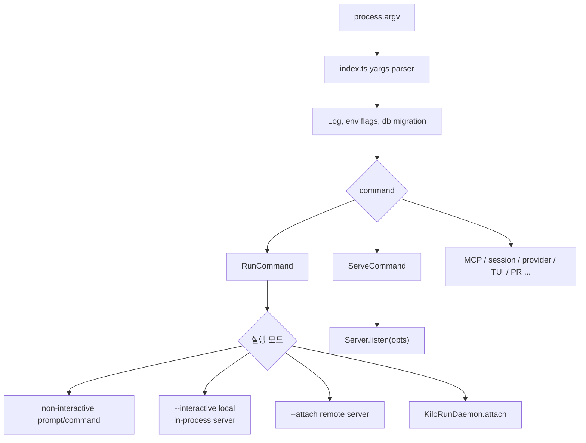

## 6. `kilo run` 상세 흐름

`packages/opencode/src/cli/cmd/run.ts`는 Kilo 사용자의 가장 직접적인 실행 경로다. 이 파일은 다음 모드를 모두 처리한다.

1. 기본 non-interactive
   - prompt를 하나 보내고 event stream을 stdout/UI에 반영한 뒤 session idle 시 종료한다.

2. `--interactive`
   - split-footer direct interactive TUI를 띄운다.
   - 새 local session이면 in-process server fetch를 사용한다.

3. `--attach`
   - 이미 실행 중인 `kilo serve`에 Basic Auth header로 붙는다.

4. `--continue`, `--session`, `--fork`, `--cloud-fork`
   - local session 또는 cloud session을 이어 받거나 fork한다.

5. `--command`
   - slash command 형태의 server endpoint를 호출한다.

6. `--format json`
   - raw event를 JSONL에 가깝게 stdout으로 내보낸다.

7. `--dangerously-skip-permissions`, `--auto`
   - 권한 요청을 자동 승인한다.

non-interactive 실행 흐름은 다음이다.

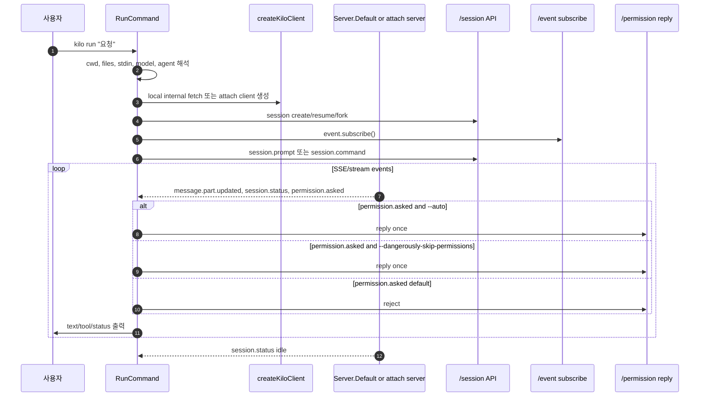

Kilo의 기본 non-interactive mode는 permission prompt를 사용자에게 묻는 UI가 아니라 “auto-reject”에 가깝다. `run.ts`는 `permission.asked`를 받으면 기본적으로 경고를 출력하고 `reply: "reject"`를 보낸다. 배치/CI 사용자는 `--dangerously-skip-permissions`나 `--auto`를 써야 한다.

`--auto`는 Kilo가 추가한 더 강한 자동 승인이다.

- root session ID를 허용 set에 넣는다.
- `task` tool의 running part metadata에서 child session ID를 추적한다.
- root 및 추적된 child task session의 permission을 `once`로 자동 승인한다.

즉 `--auto`는 단일 prompt만 승인하는 것이 아니라 task subagent가 만든 child session 권한까지 자동 승인한다.

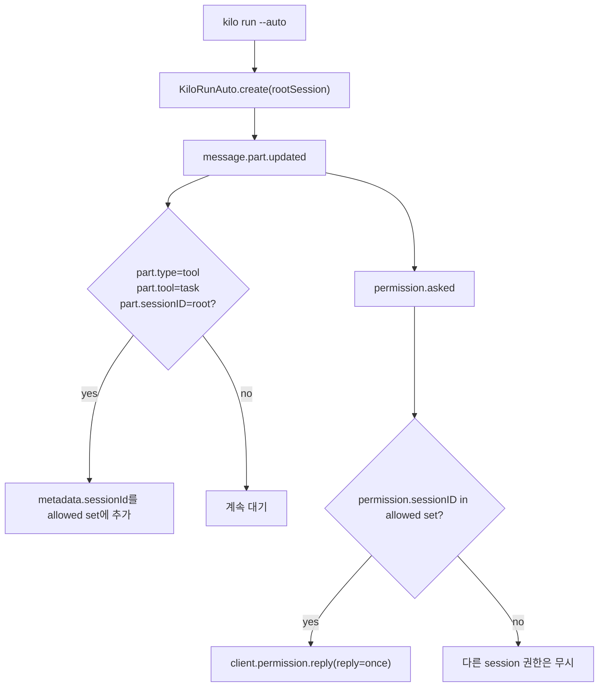

## 7. `kilo serve`와 HTTP 서버

`ServeCommand`는 `packages/opencode/src/cli/cmd/serve.ts`에 있다.

- `kilo serve`는 `Server.listen(opts)`를 호출한다.
- 기본 host는 `127.0.0.1`, 기본 port는 `0`이다.
- port가 명시적으로 `0`이면 내부적으로 4096을 먼저 시도하고 실패하면 임의 port를 사용한다.
- `--mdns`가 켜지고 hostname이 별도로 없으면 host를 `0.0.0.0`로 바꿔 mDNS publish를 허용한다.
- `KILO_SERVER_PASSWORD`가 없으면 “server is unsecured” 경고를 출력한다.
- SIGTERM/SIGINT/SIGHUP에서 `InstanceRuntime.disposeAllInstances()` 후 server stop을 수행한다.

인증은 Basic Auth다.

| 항목 | 동작 |
| --- | --- |
| env password | `KILO_SERVER_PASSWORD` |
| env username | `KILO_SERVER_USERNAME`, 기본 `kilo` |
| password 없음 | 인증 middleware가 사실상 통과 |
| credential 전달 | `Authorization: Basic base64(username:password)` |
| query token | `?auth_token=`도 credential으로 decode |
| 예외 | public UI path와 pty ticket URL은 일부 우회 |

VS Code 확장은 랜덤 32-byte hex password를 생성해 env로 주입한다. 반면 사용자가 terminal에서 `kilo serve --hostname 0.0.0.0 --mdns`를 직접 띄우면서 password를 설정하지 않으면 같은 네트워크에서 server API가 노출될 수 있다.

HTTP API 구조는 다음과 같다.

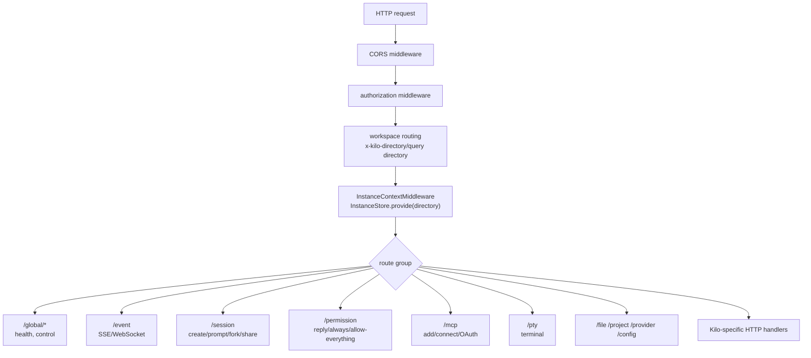

서버 라우팅은 Effect HttpApi 기반이다. `RootHttpApi`와 `InstanceHttpApi`가 나뉘고, instance route는 workspace routing과 instance context를 거쳐 project directory별 서비스 컨텍스트를 만든다.

## 8. VS Code 확장 플로우

VS Code package는 `packages/kilo-vscode`다. `package.json`은 extension id `kilo-code`, publisher `kilocode`, version `7.3.42`, VS Code engine `^1.105.1`을 선언한다. Activity Bar view, Sidebar webview, Agent Manager panel, KiloClaw, Marketplace, History, Profile, Settings, autocomplete commands를 제공한다.

핵심은 `KiloConnectionService`와 `ServerManager`다.

1. `KiloProvider`가 webview/sidebar provider 역할을 한다.
2. provider는 shared `KiloConnectionService`를 통해 SDK client와 SSE event를 받는다.
3. `KiloConnectionService`는 단일 `ServerManager`를 소유한다.
4. `ServerManager`는 extension directory의 `bin/kilo`를 `serve --port 0`로 spawn한다.
5. spawn env에는 랜덤 `KILO_SERVER_PASSWORD`, `KILO_CLIENT=vscode`, `KILO_ENABLE_QUESTION_TOOL=true`, telemetry/env/proxy/CA 설정이 들어간다.
6. stdout에서 “kilo server listening on ...” port를 파싱하고, `http://127.0.0.1:<port>` SDK client를 만든다.
7. `SdkSSEAdapter`가 global SSE stream을 열고, 여러 provider/webview listener에 broadcast한다.

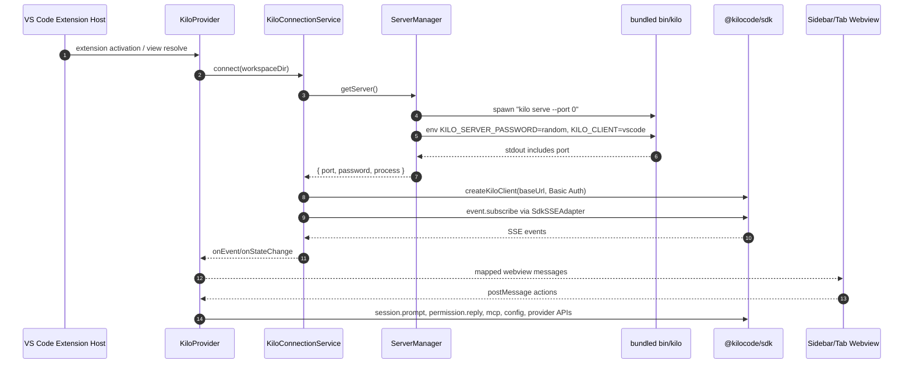

VS Code backend reuse는 장점과 리스크가 동시에 있다.

- 장점: 하나의 server process와 하나의 SSE stream을 공유해 메모리와 startup cost를 줄인다.
- 리스크: sidebar, editor tab, Agent Manager가 같은 SDK client와 event broadcaster를 공유한다. 코드에는 event의 sessionID/directory를 해석하는 mapping과 foreign project filter가 있지만, worktree/session event scope 처리가 틀어지면 UI 간 상태 혼선이 생길 수 있다.

`AGENTS.md`도 이 점을 명시한다. Agent Manager worktree session은 worktree마다 backend를 띄우는 것이 아니라 shared backend에 directory context를 넘긴다. directory-keyed `InstanceState`는 격리되지만, active service layer가 잡은 상태는 공유될 수 있다고 되어 있다.

## 9. Session, LLM, Tool 실행 흐름

Kilo의 핵심 turn loop는 `SessionPrompt`와 `SessionProcessor`, `LLM Service`에 있다.

큰 흐름은 다음이다.

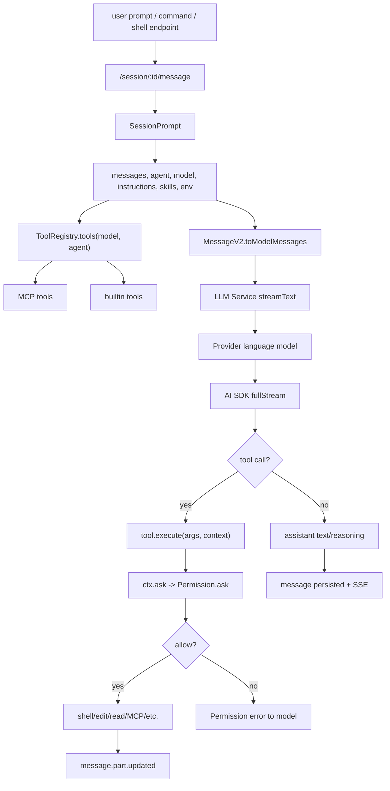

`SessionPrompt.resolveTools`가 각 tool에 실행 context를 주입한다. context에는 다음이 포함된다.

- `sessionID`
- `messageID`
- `callID`
- abort signal
- active agent
- previous messages
- `metadata()` 업데이트 함수
- `ask()` 권한 요청 함수
- plugin trigger 전/후 hook

MCP tool도 같은 tool context를 거친다. MCP tool 실행 전에는 `ctx.ask({ permission: key, patterns: ["*"], always: ["*"] })`를 호출하므로, MCP server가 제공하는 도구도 permission system 아래에 놓인다.

## 10. ToolRegistry와 도구 표면

`packages/opencode/src/tool/registry.ts`가 도구를 조립한다. 기본 도구와 Kilo 전용 도구는 다음이다.

| 도구 | 역할 |
| --- | --- |
| `bash` | shell command 실행 |
| `read`, `grep`, `glob` | 파일 읽기/검색 |
| `edit`, `write`, `apply_patch` | 파일 수정 |
| `task`, `task_status` | subagent/child session |
| `todo` | todo 작성 |
| `fetch`, `search` | web fetch/search |
| `code` | codebase search |
| `repo_clone`, `repo_overview` | experimental scout/repo 분석 |
| `skill` | skill instruction load |
| `question` | 사용자 질문 |
| `plan` | plan mode exit |
| `suggest` | Kilo suggestion/review actions |
| `lsp` | experimental LSP tool |
| `recall` | Kilo memory/recall 계열 |
| `background_process` | 개발 서버 등 장기 실행 프로세스 관리 |
| `semantic_search` | Kilo indexing 기반 자연어 코드 검색 |
| `agent_manager` | VS Code Agent Manager session/worktree 시작 |
| custom tools | `.opencode/tool/*.ts`, plugin tool |

Kilo 전용 registry는 `packages/opencode/src/kilocode/tool/registry.ts`에 있다. 이 registry는 config와 client flag에 따라 다음을 추가한다.

- `codebase` search: `experimental.codebase_search === true`
- `semantic_search`: indexing engine ready일 때
- `recall`: 항상 Kilo extra에 포함
- `background_process`: CLI 또는 VS Code client일 때
- `agent_manager`: VS Code client일 때만

custom tool 로딩도 눈여겨봐야 한다.

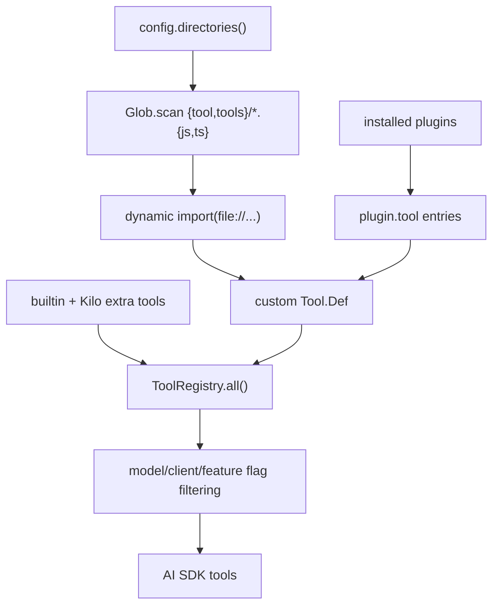

이는 강력하지만 supply-chain 관점에서는 중요하다. repo-local `.opencode/tool/*.ts`나 plugin tool은 agent process 안에서 동적 import되어 코드 실행 권한을 얻는다.

## 11. Shell tool과 permission 분석

`bash` tool은 `packages/opencode/src/tool/shell.ts`에 있다.

특징은 다음과 같다.

1. tree-sitter로 shell command를 파싱한다.
   - bash와 PowerShell wasm parser를 동적으로 로드한다.
   - command node를 수집해 command prefix와 file path 후보를 찾는다.

2. 외부 디렉터리 접근을 별도 permission으로 묻는다.
   - repo 외부 파일/디렉터리에 접근하면 `external_directory` permission을 요청한다.
   - `cat`/`get-content` 같은 read-only 명령은 metadata에 `access: "read"`를 붙인다.

3. shell command 자체도 `bash` permission으로 묻는다.
   - `patterns`에는 실제 command source가 들어간다.
   - `always`에는 `BashArity.prefix(tokens).join(" ") + " *"`가 들어간다.
   - 즉 “명령어 prefix + wildcard” 형태로 저장 승인을 만들려 한다.

4. 실행은 `ChildProcessSpawner`를 통해 수행된다.
   - POSIX는 `ChildProcess.make(command, [], { shell })`.
   - Windows PowerShell은 `-NoLogo -NoProfile -NonInteractive -Command`.
   - timeout, abort, output truncation, full output temp file 저장을 처리한다.

shell permission 흐름은 다음이다.

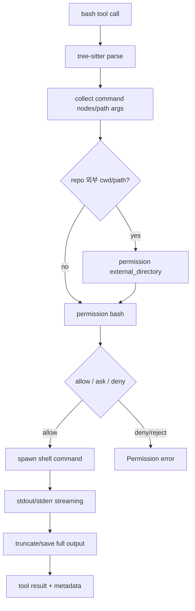

이 설계는 명령어를 사용자에게 설명하고 저장 승인을 만들기 좋다. 하지만 shell은 본질적으로 dynamic language라서 parser 기반 path 추론이 완전할 수 없다. 변수, command substitution, script file, shell function, alias, heredoc, redirection이 섞이면 permission pattern이 실제 효과를 충분히 설명하지 못할 수 있다.

## 12. 파일 편집 도구

`write` tool은 절대/상대 path를 workspace 기준으로 정규화하고, 외부 디렉터리인지 검사한 뒤 diff를 만들어 `edit` permission을 요청한다.

특징은 다음이다.

- BOM/encoding aware read/write를 한다.
- `createTwoFilesPatch`와 Kilo의 `buildFileDiff`를 metadata에 넣는다.
- 파일 write 후 formatter와 LSP diagnostics를 실행한다.
- Kilo config validation 결과를 output에 붙인다.
- current file뿐 아니라 다른 파일 diagnostics도 일부 보고한다.

`edit`, `write`, `apply_patch`는 permission layer에서 모두 `edit` permission으로 묶인다. `Permission.disabled`도 `EDIT_TOOLS = ["edit", "write", "apply_patch"]`를 `edit`로 매핑한다.

## 13. Permission Service

`packages/opencode/src/permission/index.ts`가 권한 결정의 중심이다.

권한 입력은 다음으로 구성된다.

- permission: `bash`, `edit`, `external_directory`, `mcp server name`, `semantic_search`, `agent_manager` 등
- patterns: 승인/거부 대상
- always: “항상 허용” 저장 후보
- metadata: command, diff, filepath, query 등 UI가 보여줄 상세정보
- ruleset: agent/session/config에서 온 정책
- hardRuleset: 세션 allow가 덮어쓰면 안 되는 hard deny/ask

결정 순서는 요약하면 다음이다.

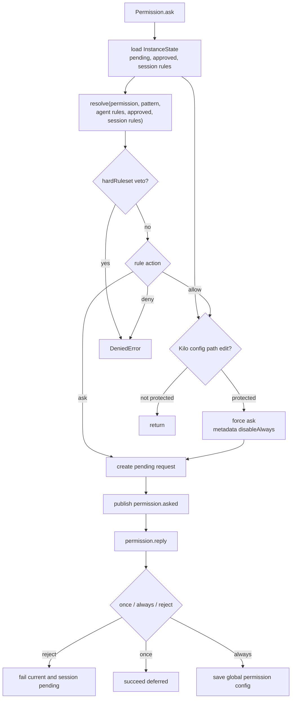

Kilo가 추가한 중요한 hardening은 다음이다.

- config file edit는 기존 saved allow가 있어도 다시 묻는다.
- config file edit에 대한 `always`는 `once`로 downgrade된다.
- read permission hardening과 external directory evaluation이 별도 처리된다.
- hardRuleset은 saved/session approval이 덮어쓰지 못한다.

반대로 위험한 경로도 있다.

- `permission.allowEverything` API는 session 또는 global 수준으로 `*/* allow`를 넣을 수 있다.
- `saveAlwaysRules`는 pending request의 allow/deny rule을 전역 config에 저장한다.
- `kilo run --auto`와 `--dangerously-skip-permissions`는 permission UI 없이 `reply: once`를 보낸다.
- VS Code UI에서 allow-everything이 켜질 경우, agent가 shell/edit/MCP/background process를 광범위하게 사용할 수 있다.

## 14. Workflow model toolExecutor

`packages/opencode/src/session/llm.ts`에는 GitLab DWS workflow model에 대한 특수 처리도 있다. `language instanceof GitLabWorkflowLanguageModel`이면 모델 객체에 다음을 주입한다.

- `sessionID`
- `systemPrompt`
- `toolExecutor`
- `sessionPreapprovedTools`
- `approvalHandler`

`toolExecutor`는 workflow service가 넘긴 tool name과 JSON args를 Kilo의 `sortedTools[toolName].execute`로 직접 실행한다. approval handler는 `workflow_tool_approval` permission을 만들고, 승인된 tool name을 session set에 저장해 반복 승인 루프를 줄인다.

이 구조는 server-side workflow 모델과 local Kilo tool system을 연결하는 강력한 bridge다. 일반 AI SDK tool call path와 약간 다른 권한/승인 흐름을 가지므로, 보안 검토에서는 별도 경로로 보아야 한다.

## 15. Agent Manager와 worktree 플로우

Kilo의 큰 차별점 중 하나는 VS Code Agent Manager다. `packages/kilo-vscode/src/agent-manager`에 worktree 생성, 상태 복구, terminal, setup script, PR polling, diff polling, import/promote/handoff 관련 코드가 있다.

agent가 직접 시작할 수 있는 tool도 있다. `agent_manager` tool은 다음 입력을 받는다.

- mode: `worktree` 또는 `local`
- versions: 여러 버전을 비교하는지 여부
- tasks: 최대 20개, prompt/name/branchName 포함

tool은 `agent_manager` permission을 요청한 뒤 `AgentManagerEvent.Start`를 bus에 publish한다. VS Code extension은 이 event를 받고 실제 worktree/session 생성을 비동기로 수행한다.

worktree 생성은 `WorktreeManager`가 담당한다.

- repo 여부 확인
- Git LFS 사용 시 git-lfs 존재 확인
- `.kilo/worktrees` 디렉터리 준비
- base branch/start point 해석
- remote fetch cache와 per-repo git lock 사용
- branch name 생성/sanitize
- 기존 worktree path가 있으면 cleanup 후 재생성
- `git worktree add -b <branch> <path> <startRef>` 실행
- metadata/session-id 저장

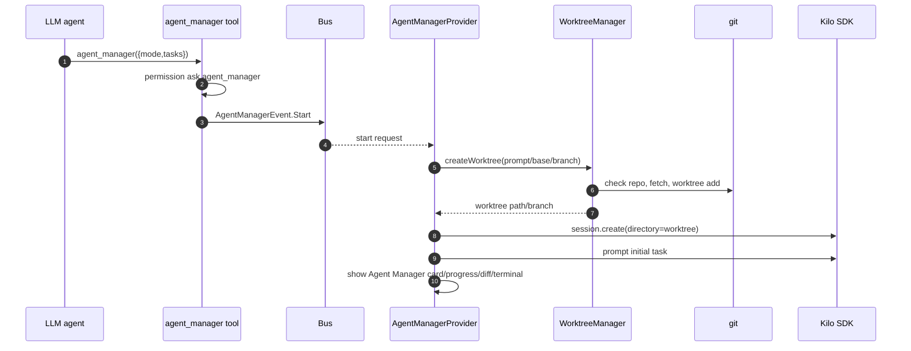

Agent Manager는 매우 유용하지만 위험도도 크다. branch/worktree 생성, setup script 실행, terminal 관리, PR 상태 polling, diff import/promotion까지 수행하므로, 사용자는 이 기능을 “IDE UI 기능”이 아니라 “git 작업과 로컬 프로세스 실행을 자동화하는 agent subsystem”으로 보아야 한다.

## 16. Background process tool

Kilo 전용 `background_process` tool은 agent가 장기 실행 프로세스를 시작/중지/재시작/로그 조회하게 한다.

입력:

- action: `start`, `list`, `status`, `logs`, `stop`, `restart`
- command
- workdir
- description
- ready probe

`start`에서는 다음 권한을 묻는다.

- workdir가 repo 밖이면 `external_directory`
- command에 대해 `bash`

승인되면 `BackgroundProcess.start`로 세션에 묶인 프로세스를 만든다. 개발 서버 실행, watcher 실행에는 편리하지만, agent가 persistent process를 관리한다는 점에서 일반 shell tool보다 추적이 더 필요하다.

## 17. 코드베이스 인덱싱과 semantic search

`packages/kilo-indexing`은 별도 엔진이다.

구성 요소:

- file scanner/watcher/ignore
- tree-sitter parser
- language별 query
- embedding providers: Kilo, OpenAI, OpenRouter, Ollama, Bedrock, Gemini, Mistral, Voyage, Vercel AI Gateway, OpenAI-compatible
- vector stores: LanceDB, Qdrant
- cache/state manager
- search service
- server routes

`packages/opencode/src/kilocode/indexing.ts`는 CLI runtime과 indexing package를 연결한다. workspace가 없으면 indexing을 disable하고, worktree path는 indexing disabled로 처리한다. Kilo embedder를 쓰는 경우 Kilo auth, base URL, organization ID, embedding model catalog를 resolve한다.

semantic search tool 흐름은 다음이다.

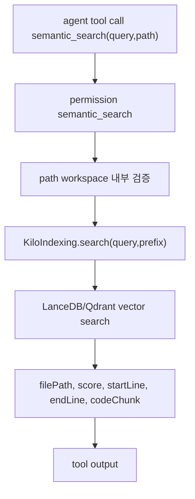

인덱싱은 coding agent 품질을 크게 높일 수 있지만, embedding provider 선택에 따라 코드 조각이 외부 API로 전송된다. Kilo embedder를 쓰면 Kilo gateway/auth와 연결되고, telemetry는 indexed file count, provider, vector store, errors를 추적한다.

## 18. MCP 구조

`packages/opencode/src/mcp/index.ts`는 MCP client manager다.

지원 transport:

- stdio
- SSE
- Streamable HTTP

지원 기능:

- MCP server connect/disconnect
- tool list
- prompts/resources list
- OAuth flow
- auth callback
- dynamic MCP add
- tools changed event
- Docker/podman `run` 명령에 `--rm` 자동 삽입
- output schema validation failure 시 tolerant schema로 retry

HTTP API는 `/mcp` 아래에 있다.

| endpoint | 역할 |
| --- | --- |
| `GET /mcp` | MCP server status |
| `POST /mcp` | server config 동적 추가 |
| `POST /mcp/:name/connect` | 연결 |
| `POST /mcp/:name/disconnect` | 연결 해제 |
| `POST /mcp/:name/auth` | OAuth 시작 |
| `POST /mcp/:name/auth/callback` | OAuth 완료 |
| `POST /mcp/:name/auth/authenticate` | browser open 포함 인증 |
| `DELETE /mcp/:name/auth` | credential 제거 |

MCP tool 실행은 Kilo tool context를 거쳐 permission을 묻는다. 그러나 MCP server 자체는 외부 process 또는 remote service이므로, stdio command나 remote URL을 추가하는 순간 해당 서버가 제공하는 tool/schema/prompt를 신뢰하게 된다.

## 19. Kilo Gateway와 cloud/session export

`packages/kilo-gateway`는 Kilo provider wrapper다.

주요 역할:

- `createKilo(options)` provider 생성
- Kilo/OpenRouter style base URL resolve
- Kilo auth token/API key resolve
- request header 구성
- model catalog/profile/notifications/modes API
- FIM/autocomplete/edit endpoint
- cloud session fetch/import

`createKilo`는 OpenRouter, Alibaba, Anthropic, OpenAI, OpenAI-compatible, Mistral provider wrapper를 같은 option으로 만든다. API key가 있으면 Bearer token을 붙이고, 없으면 anonymous API key fallback을 쓴다.

cloud session import는 `fetchCloudSessionForImport()`가 `https://ingest.kilosessions.ai` 또는 `KILO_SESSION_INGEST_URL` 기반 endpoint에서 session export JSON을 받아 local DB에 import한다.

더 민감한 부분은 `packages/opencode/src/kilocode/session-export`다. 이 subsystem은 특정 조건에서 session data를 export한다.

eligibility 조건:

- model API npm이 `@kilocode/kilo-gateway`
- model `isFree === true`
- active org가 personal
- kill switch가 꺼져 있음
- title agent는 제외

export 대상 event type에는 다음이 포함된다.

- `llm_request_started`
- `llm_request_completed`
- `workspace_baseline_started`
- `workspace_baseline_completed`
- `workspace_delta_captured`
- `tool_executed`
- `terminal_outcome`
- `permission_decided`
- `compaction_captured`
- `feedback_captured`
- `scrub_report`
- `session_degraded`

흐름은 다음이다.

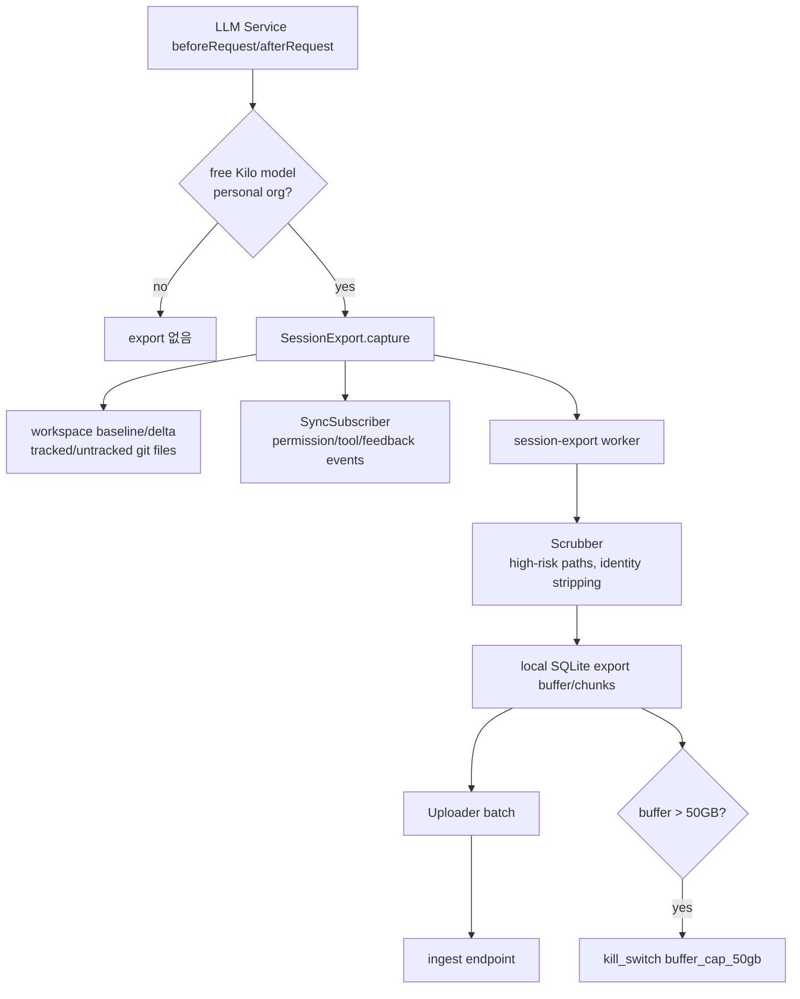

소스에는 scrubber, chunker, local buffer, uploader, retry/backoff, 4xx 처리, buffer cap kill switch가 있다. 그럼에도 이 기능은 단순 analytics보다 훨씬 민감하다. LLM input, assembled tools, permission sets, tool execution metadata, workspace baseline/delta가 포함될 수 있기 때문이다. 보고 시점 기준으로 remote ingest service의 저장/보존/접근 정책은 이 repo만으로 검증할 수 없다.

## 20. Telemetry

`packages/kilo-telemetry`는 PostHog integration으로 설명된다.

Telemetry가 추적하는 범주는 다음이다.

- CLI start/exit
- session start/end/message
- LLM completion
- command/tool/agent used
- suggestion shown/accepted
- indexing started/completed/errors/retries/file count
- share created/deleted
- MCP connected/error
- remote connection opened
- auth success

identity는 다음처럼 구성된다.

- `KILO_MACHINE_ID` env가 있으면 사용
- data path가 있으면 `telemetry-id` 파일을 만들고 UUID 저장
- Kilo auth token이 있으면 profile email을 가져와 user ID로 사용
- organization ID도 추적 가능

VS Code `ServerManager`는 `vscode.env.isTelemetryEnabled`에 따라 `KILO_TELEMETRY_LEVEL=all/off`를 서버 process env로 전달한다. 즉 VS Code telemetry setting이 Kilo CLI server telemetry enablement에 영향을 준다.

## 21. 사용자 플로우별 동작

### 21.1 CLI 단발 작업

```bash
kilo run "이 버그를 고쳐줘"
```

흐름:

1. yargs가 `RunCommand` 실행.
2. cwd와 stdin/piped text/file attachment를 해석.
3. local in-process server fetch를 만들거나 daemon/attach를 시도.
4. session을 create 또는 resume.
5. `event.subscribe()`를 시작.
6. `session.prompt()` 호출.
7. assistant text/tool part/session status를 stdout에 출력.
8. permission request는 기본적으로 reject된다.
9. idle status가 오면 종료.

실질적으로 파일 수정/명령 실행을 기대하려면 `--dangerously-skip-permissions`, `--auto`, 또는 interactive/IDE UI에서 approval을 사용해야 한다.

### 21.2 CLI autonomous/pipeline

```bash
kilo run --auto "테스트를 고치고 필요한 변경을 적용해"
```

흐름:

1. root session permission을 자동 승인.
2. task tool이 만든 child session metadata를 추적.
3. root/child permission을 `once`로 자동 승인.
4. network retry request는 최대 3회 exponential delay 후 reply, 초과 시 reject.

이 플로우는 CI 또는 sandbox 환경에서는 편리하지만, 일반 워크스테이션에서 실행하면 agent가 shell, edit, background process, MCP를 광범위하게 실행할 수 있다.

### 21.3 Interactive local

```bash
kilo run --interactive
```

흐름:

1. in-process server fetch를 만든다.
2. `runInteractiveLocalMode`가 split-footer UI lifecycle을 만든다.
3. keybind/diff style/model/session history를 병렬로 resolve한다.
4. prompt queue가 사용자 입력을 session prompt로 보낸다.
5. stream transport가 SSE/event를 받아 renderer/footer에 반영한다.

### 21.4 Headless server

```bash
KILO_SERVER_PASSWORD=... kilo serve --hostname 127.0.0.1 --port 4096
```

흐름:

1. network options를 CLI args/global config에서 resolve.
2. `Server.listen`이 Effect HttpApi route layer를 구성.
3. `/doc`, `/global/health`, `/session`, `/permission`, `/mcp`, `/pty` 등이 열린다.
4. client는 Basic Auth로 붙어 session을 조작한다.

password 없이 띄우면 server는 unsecured 경고를 내고 auth middleware는 통과한다.

### 21.5 VS Code sidebar

흐름:

1. extension activation 후 SidebarProvider가 만들어진다.
2. `KiloProvider.initializeConnection`이 shared connection service에 붙는다.
3. connection service가 bundled `kilo serve --port 0`를 시작한다.
4. SDK/SSE가 연결된다.
5. webview가 `requestProviders`, `requestConfig`, `sendMessage`, `permissionResponse`, `mcpStatus`, `cloudSession` 등 message를 주고받는다.
6. provider는 SDK client를 호출하고 결과를 webview message로 map한다.

### 21.6 VS Code Agent Manager

흐름:

1. 사용자가 Agent Manager panel을 열거나 agent가 `agent_manager` tool을 호출한다.
2. 작업 단위 task가 만들어진다.
3. worktree mode면 `.kilo/worktrees/<branch>`에 git worktree를 만든다.
4. optional setup script를 실행할 수 있다.
5. 각 worktree/session을 Kilo backend에 directory context로 생성한다.
6. UI는 terminal/progress/diff/PR status를 polling 또는 event로 업데이트한다.
7. 사용자는 결과 worktree를 import/promote하거나 정리한다.

## 22. 차별점

Kilo의 차별점은 다음이다.

1. CLI와 IDE를 하나의 server runtime으로 통합한다.
   - VS Code extension이 자체 engine이 아니라 `kilo serve`를 spawn한다.
   - 외부 SDK client도 같은 HTTP API를 사용할 수 있다.

2. Agent Manager/worktree orchestration이 매우 강하다.
   - 여러 agent session을 git worktree로 분리하고 비교/승격할 수 있다.

3. Kilo Gateway를 통한 모델 접근 전략이 있다.
   - API key 없이도 Kilo account/gateway로 모델 접근을 제공하려 한다.

4. 코드베이스 인덱싱/semantic search가 내장되어 있다.
   - 단순 grep이 아니라 vector search, tree-sitter chunking, embeddings, provider catalog가 붙어 있다.

5. session export와 cloud session import가 제품 레벨로 결합되어 있다.
   - local-only agent보다 cloud continuity/analytics/remote workflow 지향이 강하다.

6. OpenCode fork 관리 방식이 명시적이다.
   - `kilocode_change` marker, upstream merge agent/command/skill이 존재한다.

7. 도구 표면이 넓다.
   - shell/edit/write/apply_patch/task/MCP/background/Agent Manager/semantic search/web fetch/search/repo scout까지 있다.

## 23. 숨겨진/잘 보이지 않는 표면

분석 중 특히 주의해야 하는 숨겨진 표면은 다음이다.

| 표면 | 설명 |
| --- | --- |
| `.opencode/tool/*.ts` | repo-local custom tool로 dynamic import될 수 있음 |
| `.opencode/agent/*.md` | agent behavior instruction |
| `.opencode/command/*.md` | slash command instruction |
| `.kilo/skills/*` | Kilo agent skill instruction |
| `.kilo/run-script` | Agent Manager가 실행할 수 있는 script |
| `permission.allowEverything` API | UI/API에서 모든 권한 허용 상태를 만들 수 있음 |
| `--auto` | root와 task child session 권한 자동 승인 |
| `--dangerously-skip-permissions` | permission request 자동 승인 |
| `KILO_SERVER_PASSWORD` 없음 | `kilo serve` 인증 비활성 |
| `--mdns` | hostname 기본이 `0.0.0.0`로 바뀔 수 있음 |
| `session-export` | free Kilo model/personal org 조건에서 session/workspace event export |
| `MCP add/connect/OAuth` | 동적 외부 tool server 추가 |
| `background_process` | 장기 실행 local process 관리 |
| `KiloClaw` | VS Code에 별도 external/event service 성격의 표면 |
| `telemetry-id` | machine identity persistence |

## 24. 위험요소와 이상한 점

### 24.1 `kilo serve` 인증 비활성 가능성

`KILO_SERVER_PASSWORD`가 없으면 server는 경고만 하고 인증 없이 동작한다. 기본 host는 loopback이지만, config나 `--mdns`로 host가 `0.0.0.0`가 될 수 있다. `/session`, `/permission`, `/mcp`, `/pty`, `/file`, `/config` 같은 endpoint가 열리므로 비밀번호 없는 network-facing server는 위험하다.

### 24.2 `--auto`가 task child session까지 승인

`--auto`는 root session만이 아니라 `task` tool metadata에서 child session ID를 추적해 해당 child session permission도 승인한다. 이는 autonomous/pipeline에는 맞지만, 신뢰하지 않는 repo/prompt에서 실행하면 shell/edit/MCP/background process로 이어질 수 있다.

### 24.3 `allowEverything` API

`POST /permission/allow-everything`은 session 또는 global 수준으로 `*/* allow`를 활성화할 수 있다. UI가 의도적으로 제공하는 기능일 수 있으나, server auth가 약하거나 webview/message 경계가 깨지면 치명적이다.

### 24.4 session export의 민감도

무료 Kilo gateway model과 personal org 조건에서 LLM input, assembled tools, permission set, tool execution, workspace baseline/delta가 export worker로 들어간다. scrubber와 high-risk path omit이 있지만, 코드/프롬프트/도구 입력이 외부 ingest로 갈 수 있다는 사실 자체가 중요하다.

### 24.5 OpenCode fork drift

`kilocode_change` marker를 쓰는 점은 좋은 관리 방식이지만, 동시에 upstream과 Kilo 변경이 계속 충돌할 수 있음을 의미한다. OpenCode upstream의 security fix나 API 변화가 Kilo fork에 늦게 반영될 가능성을 관리해야 한다.

### 24.6 VS Code shared backend state

Agent Manager worktree session도 shared `kilo serve` backend에 directory context를 넘기는 구조다. directory-keyed `InstanceState`가 격리되더라도 active service singleton이나 event mapping이 잘못되면 session/directory 혼선이 가능하다.

### 24.7 MCP dynamic server trust

MCP server는 stdio/remote/OAuth를 통해 외부 tool surface를 가져온다. Kilo는 tool 실행 전 permission을 묻지만, server config 자체가 신뢰할 수 없는 경우 tool schema/prompt/resource가 agent context를 오염시킬 수 있다.

### 24.8 Shell parser permission의 한계

tree-sitter 기반 command parsing과 `BashArity.prefix`는 실용적이지만 shell semantics 전체를 커버하지 못한다. 변수, subshell, heredoc, sourced script, alias, shell function, redirection, glob expansion 등은 실제 파일/네트워크 효과를 숨길 수 있다.

### 24.9 Agent Manager git/worktree 자동화

Agent Manager는 branch/worktree 생성, cleanup, setup script 실행, PR polling, terminal management를 한다. 잘못된 branch base, worktree cleanup, setup script, env copy 정책이 사용자 repo 상태에 영향을 줄 수 있다.

### 24.10 코드 인덱싱 데이터 경로

Kilo indexing은 local LanceDB/Qdrant를 쓸 수 있지만, embedding provider가 remote이면 코드 chunk가 외부로 전송된다. Kilo embedder는 Kilo auth/gateway/model catalog와 연결된다.

### 24.11 telemetry와 product env

VS Code는 `KILO_TELEMETRY_LEVEL`을 VS Code telemetry setting에 맞춰 전달하지만, CLI 직접 실행에서는 config/env에 따라 다르다. telemetry identity는 machine ID와 auth email을 결합할 수 있다.

### 24.12 의존성/설치 표면

root package는 Bun 1.3.13, native deps, `@lydell/node-pty`, `bun-pty`, tree-sitter wasm, Electron/VS Code bundling, patched dependencies를 요구한다. 설치/빌드 환경이 복잡하고 supply-chain 표면이 넓다.

## 25. 소스 기준 호출 관계 요약

주요 호출 관계는 다음과 같다.

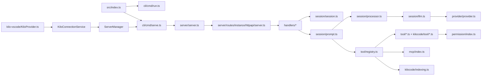

## 26. 실행 검증

현재 워크스페이스에서 수행한 검증:

- `find sources/Kilo-Org__kilocode -type f | wc -l` 결과: 6,880개
- `git -C sources/Kilo-Org__kilocode log -1`: `5637375 Merge pull request #11072 from Kilo-Org/curious-swordtail`
- `node --version`: `v22.22.3`
- `npm --version`: `10.9.8`
- `bun --version`: 실패. 현재 머신에 Bun 없음
- `node_modules` 확인: root, `packages/opencode`, `packages/kilo-vscode` 모두 없음

따라서 이 환경에서는 Kilo의 실제 `bun run dev`, `bun turbo typecheck`, `packages/opencode` test runner, VS Code extension build를 실행하지 못했다. Kilo는 root `package.json`에서 `bun@1.3.13`을 package manager로 요구하고, 각 패키지 script도 `bun`, `tsgo`, workspace dependency를 전제로 한다.

실행 검증 한계는 다음과 같이 해석해야 한다.

- 소스 경로, entrypoint, API route, permission, tool, VS Code spawn, Agent Manager, session export 흐름은 실제 파일을 기준으로 확인했다.
- dependency install/build 없이 runtime behavior를 end-to-end로 재현하지는 못했다.
- 특히 `kilo serve`의 실제 route exercise, VS Code webview message, Agent Manager worktree UI, session export uploader는 정적 분석으로 확인한 것이다.

## 27. 종합 결론

Kilo는 단순한 “AI 코딩 CLI”가 아니다. OpenCode fork를 기반으로 CLI/TUI/server를 만들고, VS Code extension이 그 server를 제품 runtime으로 재사용하며, Kilo Gateway, 코드 인덱싱, Agent Manager, cloud session, telemetry/session export까지 결합한 대형 agentic engineering platform이다.

가장 큰 장점은 통합성이다. 같은 session/tool/permission/provider runtime을 CLI와 IDE에서 공유하고, Agent Manager/worktree로 여러 작업을 병렬화하며, semantic search와 gateway provider를 붙여 end-to-end 개발 흐름을 만들려 한다.

가장 큰 리스크도 같은 지점에서 나온다. 로컬 HTTP 서버, broad tool registry, `--auto`, `allowEverything`, MCP, background process, worktree automation, session export가 모두 한 runtime에 모인다. 신뢰된 로컬 개발 환경에서는 강력하지만, password 없는 server, untrusted repo, remote MCP, 자동 승인 모드, cloud/free gateway session export 조건에서는 보안·프라이버시 경계를 명확히 이해하고 써야 한다.

