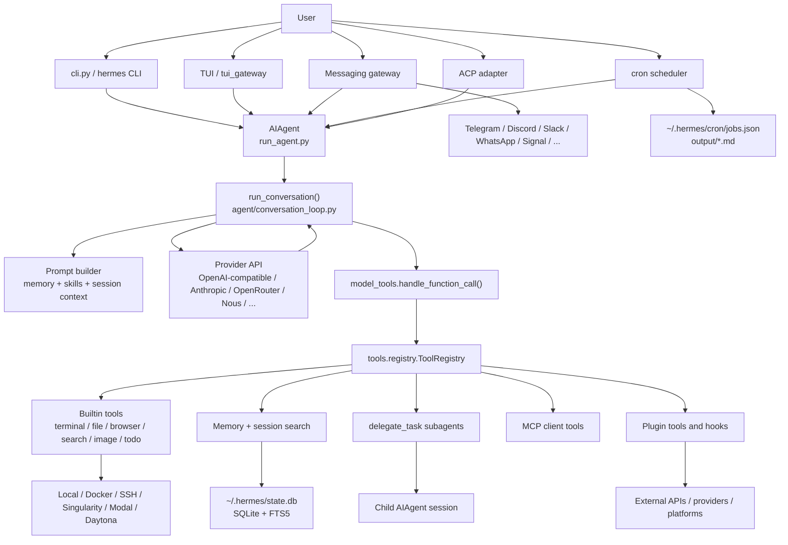
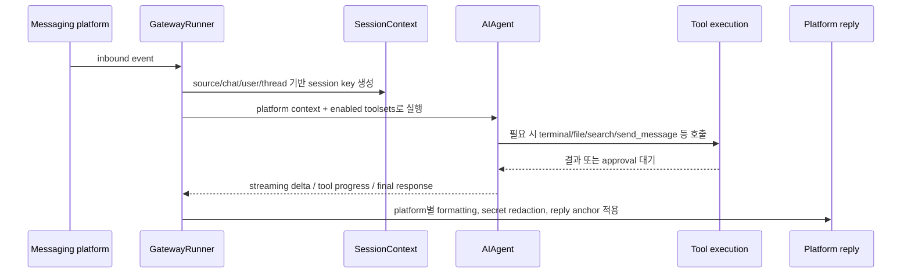
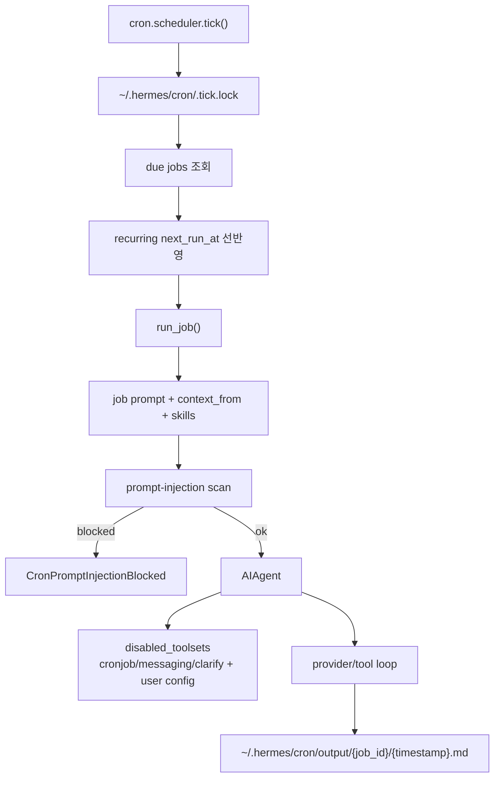
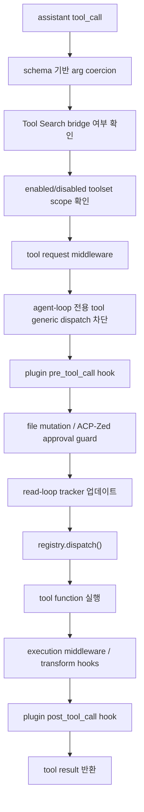
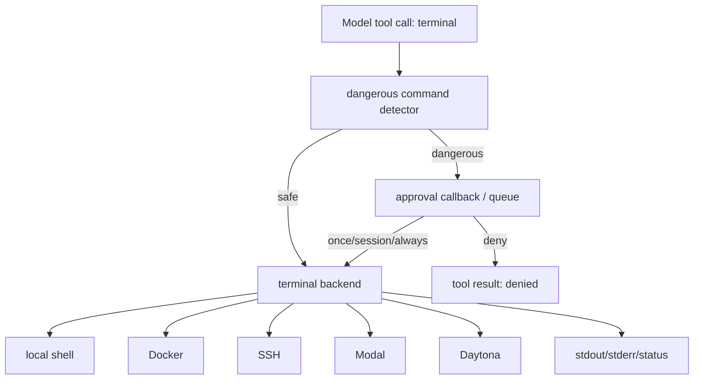
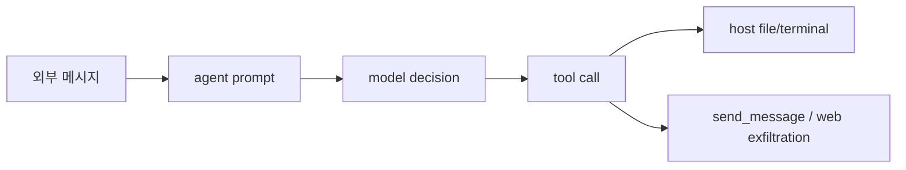

# NousResearch/hermes-agent 분석 보고서

## 1. 요약 평가

Hermes Agent는 Python 기반의 개인 AI agent 플랫폼이다. 단순한 CLI coding assistant가 아니라 CLI, TUI, messaging gateway, cron automation, MCP, plugin, memory provider, subagent delegation, terminal backend를 하나의 agent core 주변에 묶는 “항상 켜져 있는 개인 agent 운영체제”에 가깝다.

README의 핵심 주장은 “built-in learning loop”다. 사용자가 한 번 해결한 문제, 자주 쓰는 명령, 선호하는 방식, 대화에서 배운 사실을 memory와 skill로 보존하고, 이후 세션에서 그 지식을 검색하거나 prompt context로 다시 주입한다. 이 점에서 Codex/Gemini CLI/Aider류처럼 현재 작업 디렉터리를 고치는 도구와 겹치면서도, 더 장기적인 개인 assistant 방향을 가진다.

아키텍처의 중심은 `run_agent.py`의 `AIAgent`와 `agent/conversation_loop.py`의 `run_conversation()`이다. 이 루프가 provider API 호출, assistant message 처리, tool call 처리, context compression, memory sync, turn finalization을 담당한다. 도구 실행은 `model_tools.py`와 `tools/registry.py`로 위임되고, 실제 기능은 `tools/`, `plugins/`, MCP server, memory provider, terminal backend, browser backend 쪽으로 확장된다.

가장 중요한 설계 철학은 `AGENTS.md`에 직접 적혀 있다.

1. per-conversation prompt caching은 sacred하다.
   - 세션 도중 system prompt와 toolset을 함부로 바꾸지 않는다.
   - stable cached prefix를 유지해서 provider의 prompt cache 효율과 추론 일관성을 지킨다.
   - 예외는 context compression처럼 명시적인 전환 상황이다.

2. core는 narrow waist이고 capability는 edge에 둔다.
   - 새 core model tool을 추가하는 것은 비용이 크다고 본다.
   - 우선 existing code, CLI command, skill, service-gated tool, plugin, MCP catalog를 검토하고 마지막에 core tool을 추가한다.
   - 이 철학 때문에 core loop는 비교적 일정하고, 실제 기능 폭은 plugin/toolset/memory/gateway가 담당한다.

강점은 폭넓은 제품 surface와 방어적 엔지니어링이다. exact dependency pin, optional extras, lazy import, MCP discovery background thread, SQLite WAL fallback, malformed FTS schema recovery, memory-context injection scrubber, webhook-safe toolset, cron prompt-injection scanner, subagent approval callback isolation 같은 안전 장치가 곳곳에 있다.

반대로 위험도도 넓은 surface에서 나온다. Hermes는 terminal/file/browser/send_message/cron/delegate/MCP/plugin을 같은 agent 권한 안에 묶는다. 메시징 플랫폼이나 cron job처럼 사용자가 터미널 앞에 없는 입력도 agent loop에 들어올 수 있다. 프로젝트가 이를 인식하고 많은 guardrail을 두었지만, 운영자는 “개인 신뢰 경계 안에서만 강력한 도구를 켠다”는 전제를 명확히 가져야 한다.

## 2. 기본 정보

- 저장소: `NousResearch/hermes-agent`
- 분석 커밋: `a72bb03`
- 기본 브랜치: `main`
- 생성일: 2025-07-22
- 분석 기준일: 2026-06-10
- 최신 릴리스 관측값: `v2026.6.5` / “Hermes Agent v0.16.0 (2026.6.5) — The Surface Release”
- package name: `hermes-agent`
- package version: `0.16.0`
- 언어: Python
- Python 요구사항: `>=3.11,<3.14`
- 라이선스: MIT
- GitHub metadata 관측값:
  - stars: 189,565
  - forks: 32,782
  - watchers: 747
- 주요 topics:
  - `ai-agent`
  - `anthropic`
  - `chatgpt`
  - `claude`
  - `claude-code`
  - `codex`
  - `hermes-agent`
  - `openclaw`

주요 루트는 다음과 같다.

- `cli.py`: 대화형 CLI/TUI 진입점, prompt_toolkit 기반 shell, model/tool/config command 처리
- `run_agent.py`: `AIAgent` 본체, system prompt, tool execution, compression, provider orchestration
- `agent/conversation_loop.py`: 실제 대화 loop 구현
- `model_tools.py`: tool definition snapshot, tool call dispatch, plugin hook, approval guard 연결
- `toolsets.py`: CLI, messaging, webhook, cron 등 context별 toolset 정의
- `tools/registry.py`: tool self-registration과 dispatch registry
- `tools/terminal_tool.py`: local/Docker/SSH/Singularity/Modal/Daytona terminal backend
- `tools/delegate_tool.py`: subagent delegation
- `hermes_state.py`: SQLite session/message/FTS5 persistence
- `agent/memory_manager.py`: built-in/external memory provider orchestration과 prompt fencing
- `gateway/`: messaging platform gateway
- `cron/`: scheduled automation
- `plugins/`: bundled plugin tree
- `hermes_cli/`: config, plugin, MCP, command management
- `acp_adapter/`: agent client protocol adapter
- `skills/`: bundled/user skill system
- `ui-tui/`, `tui_gateway/`: terminal UI 관련 코드
- `website/`: project website
- `tests/`: unit/integration tests

## 3. 발전 과정과 제품 철학

Hermes는 Nous Research가 만든 개인 agent 플랫폼으로 포지셔닝되어 있다. README는 Claude Code/Codex류 로컬 coding agent와 비슷한 터미널 workflow를 제공하면서도, 다음 방향을 더 강하게 주장한다.

1. Agent가 사용자와 함께 성장한다.
   - memory, skill, session search, Honcho 같은 외부 기억 provider를 이용한다.
   - 작업 도중 반복되는 해결법을 skill로 만들거나 개선한다.
   - 과거 대화와 결과를 FTS5로 검색한다.

2. Agent가 laptop에 묶이지 않는다.
   - VPS, GPU cluster, serverless, cloud VM에서 계속 실행될 수 있다.
   - Telegram/Discord/Slack/WhatsApp/Signal 같은 채널을 통해 원격에서 조작한다.
   - terminal backend도 local뿐 아니라 Docker, SSH, Singularity, Modal, Daytona를 지원한다.

3. 특정 model vendor에 묶이지 않는다.
   - Nous Portal, OpenRouter, NovitaAI, NVIDIA NIM, Xiaomi MiMo, z.ai/GLM, Kimi/Moonshot, MiniMax, Hugging Face, OpenAI, 자체 endpoint를 README에서 언급한다.
   - `hermes model` 명령으로 provider/model을 전환하는 UX를 제공한다.

4. Core는 작게 유지하고 edge를 확장한다.
   - `AGENTS.md`가 명시하듯 새 기능은 core tool보다 plugin, MCP server, skill, service-gated tool이 우선이다.
   - core loop를 건드리면 prompt caching과 tool schema 안정성이 깨질 수 있다고 본다.

5. 공급망 리스크를 강하게 의식한다.
   - `pyproject.toml`은 dependency를 exact pin한다.
   - Mini Shai-Hulud/mistralai 관련 공급망 언급과 CVE 회피 주석이 들어 있다.
   - optional extras를 세분화해서 모든 사용자에게 모든 dependency를 설치시키지 않는다.

이 철학은 OpenClaw와 상당히 유사하다. 다만 OpenClaw가 TypeScript gateway/product monorepo에 가깝다면, Hermes는 Python agent core와 learning loop, provider/plugin/memory 생태계를 더 전면에 둔다.

## 4. 전체 아키텍처



핵심 구조는 네 계층이다.

- 입력 계층:
  - CLI, TUI, messaging gateway, cron, ACP, Python API가 agent를 호출한다.

- Agent core 계층:
  - `AIAgent`가 system prompt, provider config, toolsets, memory, session persistence를 들고 있다.
  - `run_conversation()`이 provider call과 tool loop를 반복한다.

- Capability 계층:
  - `tools/registry.py`와 `model_tools.py`가 tool schema와 dispatch를 제공한다.
  - 실제 capability는 builtin tools, plugins, MCP, memory provider, terminal backend, browser backend에 있다.

- Persistence/운영 계층:
  - SQLite `state.db`, FTS5, cron jobs/output, config YAML, `.env`, memory provider storage, plugin config가 장기 상태를 보존한다.

## 5. 사용자 실행 플로우

일반 CLI 세션의 흐름은 다음과 같다.

```mermaid
sequenceDiagram
  participant U as User
  participant CLI as cli.py
  participant Agent as AIAgent
  participant Loop as run_conversation
  participant LLM as Provider API
  participant Tools as model_tools + registry
  participant State as HermesState / memory

  U->>CLI: hermes 실행 및 prompt 입력
  CLI->>Agent: AIAgent 생성 또는 기존 세션 복원
  Agent->>State: session/context/memory/skills 로드
  Agent->>Loop: run_conversation(messages)
  Loop->>LLM: system + messages + tool schemas 전송
  LLM-->>Loop: assistant content 또는 tool_calls
  alt tool_calls 있음
    Loop->>Tools: handle_function_call(name,args)
    Tools->>Tools: toolset scope / plugin hook / approval guard 검사
    Tools-->>Loop: tool result
    Loop->>LLM: tool result 포함해 다음 turn 요청
  else 최종 답변
    Loop->>State: transcript, usage, memory sync, finalization
    Loop-->>CLI: assistant response
    CLI-->>U: 화면 표시
  end
```

messaging gateway 세션도 구조는 같다. 차이는 입력과 출력이 platform adapter를 거친다는 점이다.



cron automation은 사람이 바로 앞에 없는 실행이므로 toolset과 prompt-injection 방어가 더 중요하다.



## 6. 핵심 코드 경로

### 6.1 Agent 생성과 대화 루프

핵심 위치:

- `run_agent.py:320`: `class AIAgent`
- `run_agent.py:3167`: `_build_system_prompt()`
- `run_agent.py:4951`: `_compress_context()`
- `run_agent.py:5004`: `_execute_tool_calls()`
- `run_agent.py:5090`: `_execute_tool_calls_concurrent()`
- `run_agent.py:5095`: `_execute_tool_calls_sequential()`
- `run_agent.py:5105`: `AIAgent.run_conversation()`
- `agent/conversation_loop.py:371`: standalone `run_conversation()`

`AIAgent.run_conversation()` 자체는 매우 얇고, 실제 loop는 `agent/conversation_loop.py`로 위임한다. 이 구조는 원래 `run_agent.py`에 집중되던 책임을 점진적으로 분리하는 흔적이다. 그래도 `run_agent.py`는 여전히 provider setup, prompt assembly, compression, tool execution, state integration이 많아 큰 파일이다.

대화 loop의 주요 단계는 다음이다.

1. system prompt와 message list를 provider 형식에 맞게 구성한다.
2. enabled toolset을 기반으로 tool definitions snapshot을 만든다.
3. provider API를 호출한다.
4. assistant content, reasoning scratchpad, tool calls를 파싱한다.
5. invalid tool call이나 duplicate/capped delegate call을 처리한다.
6. tool call이 있으면 `agent._execute_tool_calls()`로 넘긴다.
7. tool result를 messages에 추가하고 다음 provider call로 이어간다.
8. 최종 content만 있으면 turn finalizer를 호출한다.
9. usage, prompt cache, context compression, memory sync, session persistence를 반영한다.
10. token/context error가 나면 compression이나 retry/fallback path를 탄다.

특징적인 설계는 “assistant가 content와 tool call을 동시에 낸 경우”의 처리다. Hermes는 content를 버리지 않고 보존하려고 하며, housekeeping tool(memory/todo/session_search/skill 등)은 post-response side effect처럼 다루는 경로를 갖는다. 이는 모델이 사용자에게 답변하면서 동시에 기억 업데이트나 할 일 관리를 하도록 허용하는 제품 UX와 연결된다.

### 6.2 Tool definition과 dispatch

핵심 위치:

- `model_tools.py:84`: `_run_async()`
- `model_tools.py:272`: `get_tool_definitions()`
- `model_tools.py:876`: `handle_function_call()`
- `tools/registry.py:57`: `discover_builtin_tools()`
- `tools/registry.py:151`: `class ToolRegistry`
- `tools/registry.py:234`: `ToolRegistry.register()`
- `tools/registry.py:390`: `ToolRegistry.dispatch()`
- `toolsets.py:31`: `_HERMES_CORE_TOOLS`
- `toolsets.py:81`: `_HERMES_WEBHOOK_SAFE_TOOLS`

`model_tools.py`는 과거식 giant dispatcher가 아니라 registry로 가는 orchestration layer다. builtin tool discovery는 `tools/` 아래 module import를 통해 self-registration을 유도한다. MCP discovery는 import side effect에서 빠져 있다. 주석상 MCP discovery가 gateway event loop를 최대 120초 막을 수 있어 entrypoint에서 명시적으로 background discovery를 하도록 바꾼 것이다.

Tool call 처리 흐름은 다음이다.



중요한 방어 장치는 다음이다.

- 현재 enabled toolsets 밖의 underlying tool call을 거부한다.
- `todo`, `memory`, `session_search`, `delegate_task` 같은 agent-loop tool은 generic dispatcher에서 직접 실행되지 않도록 분리한다.
- `write_file`, `patch` 같은 file mutation은 ACP/Zed approval guard가 실패하면 fail closed한다.
- plugin hook이 tool call을 block하거나 result를 변형할 수 있다.
- `_run_async()`는 이미 running event loop 안에서 호출되면 별도 thread로 coroutine을 실행해 event loop 중첩 문제를 피한다.

### 6.3 Toolsets

`toolsets.py`는 사용 context별 capability boundary다. `_HERMES_CORE_TOOLS`에는 대체로 다음 범주가 들어간다.

- web search / web extract
- terminal command / process control / terminal read
- file read/write/patch/search
- vision/image/video 관련 도구
- skills
- browser tools
- TTS
- todo
- memory
- session search
- clarify
- code execution
- delegate task
- cronjob
- send_message
- Home Assistant
- kanban
- computer use

반면 `_HERMES_WEBHOOK_SAFE_TOOLS`는 훨씬 좁다.

- `web_search`
- `web_extract`
- `vision_analyze`
- `clarify`

이 차이는 매우 중요하다. Webhook은 외부 시스템에서 들어오는 입력이라 prompt injection 위험이 높다. 그래서 Hermes는 webhook context에서 기본 도구를 거의 모두 제거하고, 외부 입력으로부터 terminal/file/send_message/cron/delegate 같은 권한이 바로 열리지 않도록 한다.

## 7. Terminal 실행 구조

`tools/terminal_tool.py`는 Hermes의 가장 강력하고 위험한 surface다. README와 코드상 terminal backend는 다음을 지원한다.

- local shell
- Docker container
- SSH host
- Singularity
- Modal
- Daytona

Terminal tool은 foreground command뿐 아니라 background task와 session cleanup도 다룬다. 또한 dangerous command approval은 `tools/approval.py`로 중앙화되어 있고, messaging platform에서도 interactive exec approval을 연결한다.

특히 subagent 쪽 주석이 중요한 위험 경계를 설명한다. `tools/delegate_tool.py`는 subagent가 worker thread에서 실행되기 때문에 terminal approval callback을 `threading.local()`로 설치한다. 이것이 없으면 worker thread에서 `input()` fallback이 발생할 수 있고, 부모 CLI와 충돌할 수 있다.

위험 흐름은 다음처럼 정리된다.



이 구조는 강력하지만 운영상 주의해야 한다. messaging gateway나 cron context에서 terminal tool이 활성화되어 있으면 사용자가 터미널 앞에 없어도 host나 remote backend에서 명령이 실행될 수 있다. Hermes는 approval과 disabled toolsets로 막으려 하지만, config 실수는 곧 실행 권한으로 이어진다.

## 8. Delegation / Subagent 구조

핵심 위치:

- `tools/delegate_tool.py:45`: `DELEGATE_BLOCKED_TOOLS`
- `tools/delegate_tool.py:132`: `_DEFAULT_MAX_CONCURRENT_CHILDREN = 3`
- `tools/delegate_tool.py:133`: `MAX_DEPTH = 1`
- `tools/delegate_tool.py:1546`: worker thread approval callback 설치
- `tools/delegate_tool.py:1970`: `delegate_task()`

Hermes의 `delegate_task`는 child `AIAgent`를 만든다. child는 별도 conversation, 별도 task id, 별도 terminal session, 제한된 toolsets를 갖는다. parent는 child의 전체 transcript를 그대로 보지 않고 summary를 받는 방식이다.

기본 차단 tool은 다음 성격이다.

- 다시 delegation을 하는 도구
- 사용자에게 clarification을 요구하는 도구
- memory를 직접 변경하는 도구
- send_message처럼 외부 채널에 말하는 도구
- execute_code처럼 별도 code runtime을 여는 도구

기본 depth는 parent -> child 한 단계다. `MAX_DEPTH=1`이고 config로 높일 수 있지만 명시적 opt-in이다. 기본 동시 child 수는 3이다.

Subagent approval 기본값은 보수적이다.

- `delegation.subagent_auto_approve=false`가 기본이다.
- 위험 command는 자동 deny된다.
- `delegation.subagent_auto_approve=true`로 켜면 subagent가 위험 command를 자동 승인할 수 있다.

이 설계는 유용하지만, batch/cron에서 YOLO처럼 쓰면 상당히 위험하다. child agent는 parent보다 context가 좁아 prompt injection 판단 능력이 낮아질 수 있고, parent가 summary만 받으면 중간의 위험한 tool 결과를 놓칠 수 있다.

## 9. Memory와 Learning Loop

핵심 위치:

- `agent/memory_provider.py:84`: `system_prompt_block()`
- `agent/memory_provider.py:107`: `queue_prefetch()`
- `agent/memory_provider.py:115`: `sync_turn()`
- `agent/memory_manager.py:51`: memory-context tag regex
- `agent/memory_manager.py:71`: streaming scrubber
- `agent/memory_manager.py:243`: `<memory-context>` fenced block 생성
- `agent/memory_manager.py:252`: `class MemoryManager`
- `agent/memory_manager.py:392`: `queue_prefetch_all()`

Hermes의 memory는 built-in memory와 external provider를 조합한다. `MemoryManager`는 at most one external provider를 붙이고, provider 실패가 전체 agent를 죽이지 않도록 격리한다. background sync/prefetch는 ThreadPoolExecutor로 처리되고, shutdown 시 제한된 시간 동안 drain한다.

Memory context는 그냥 prompt에 평문으로 섞이지 않고 fenced block으로 들어간다.

```text
<memory-context>
...
</memory-context>
```

그리고 provider output에 악의적 `<memory-context>` tag나 system note가 들어오는 상황을 막기 위해 sanitizer와 streaming scrubber가 있다. streaming scrubber는 tag가 delta 경계를 넘어 쪼개져 들어오는 경우까지 고려한다.

Memory flow는 다음이다.

```mermaid
sequenceDiagram
  participant Loop as Conversation loop
  participant MM as MemoryManager
  participant Provider as External memory provider
  participant Prompt as System prompt
  participant State as HermesState

  Loop->>MM: turn start / query prefetch
  MM->>Provider: queue_prefetch(query)
  Provider-->>MM: relevant memories
  MM->>MM: sanitize + fence
  MM-->>Prompt: system_prompt_block()
  Loop->>State: messages/session 저장
  Loop->>MM: sync_turn(user, assistant, tool results)
  MM->>Provider: background sync
```

이것이 Hermes의 차별점 중 하나다. 단발성 coding assistant는 보통 현재 repo와 대화 history만 보지만, Hermes는 세션을 넘어 사용자 성향과 기억을 유지하려고 한다.

리스크도 명확하다.

- memory provider가 외부 서비스라면 작업 내용, 파일명, 사용자 ID, 대화 내용이 외부로 나갈 수 있다.
- 잘못된 memory는 system prompt처럼 강한 영향력을 가질 수 있다.
- sanitizer가 있어도 “과거에 잘못 저장된 지식”은 장기적인 오답 원인이 된다.
- memory가 너무 강하면 현재 repo의 실제 상태보다 과거 preference를 우선시할 수 있다.

## 10. Session Persistence와 SQLite

핵심 위치:

- `hermes_state.py:5`: session storage와 FTS5 목적
- `hermes_state.py:10`: WAL mode 설명
- `hermes_state.py:12`: parent session chain 설명
- `hermes_state.py:162`: WAL 설정과 DELETE fallback
- `hermes_state.py:336`: malformed schema repair
- `hermes_state.py:436`: schema table 시작
- `hermes_state.py:447`: `parent_session_id`
- `hermes_state.py:503`: `compression_locks`

Hermes는 session을 단순 JSONL로만 저장하지 않고 SQLite `state.db`에 저장한다. 핵심 기능은 다음이다.

- sessions table
- messages table
- FTS5 virtual table
- parent_session_id를 통한 compression/delegation/branch chain
- compression_locks
- source tagging
- model configuration persistence

SQLite 설계에서 눈에 띄는 점은 운영 이슈를 꽤 많이 반영했다는 것이다.

- WAL mode를 기본으로 쓰되, NFS/SMB/FUSE처럼 WAL이 깨지는 파일시스템에서는 DELETE journal mode로 fallback한다.
- FTS schema corruption에 대한 recovery path가 있다.
- canonical sessions/messages row는 보존하고 FTS index만 재구축하는 경로를 둔다.
- malformed `sqlite_master` schema 문제까지 별도 처리한다.

이는 장시간 실행되는 gateway, 여러 platform, desktop/dashboard가 동시에 session을 읽는 환경에서 나온 설계로 보인다.

## 11. Messaging Gateway

핵심 위치:

- `gateway/run.py:59`: agent cache tuning
- `gateway/run.py:222`: gateway user-facing secret redaction
- `gateway/run.py:1161`: messaging platform dangerous command approval 활성화
- `gateway/run.py:1895`: `class GatewayRunner`
- `gateway/run.py:2015`: live AIAgent LRU cache
- `gateway/run.py:12463`: idle cached agent sweep
- `gateway/run.py:15529`: `start_gateway()`
- `gateway/session.py:31`: PII redaction helpers
- `gateway/session.py:71`: `SessionSource`
- `gateway/session.py:161`: `SessionContext`
- `gateway/session.py:233`: platform system context generation
- `gateway/session.py:627`: session key 생성 로직

Gateway는 Telegram/Discord/Slack/WhatsApp/Signal 등 messaging platform adapter를 묶는다. `GatewayRunner`는 platform adapter lifecycle, reconnect, voice mode, streaming response, tool progress, session cache, background task, restart notification 등을 관리한다.

Session identity는 `SessionSource`와 `SessionContext`로 모델에 들어간다. 모델은 “어느 platform, 어떤 chat, 어떤 thread, 어떤 connected platforms가 있는지”를 알 수 있다. 이 context 덕분에 `send_message` 같은 도구가 home channel이나 explicit target을 선택할 수 있다.

PII redaction도 platform별로 다르다.

- Telegram, WhatsApp, Signal, BlueBubbles 등 일부 platform은 ID를 hash할 수 있다.
- Discord는 mention system 때문에 raw ID가 필요할 수 있어 기본 redaction 대상이 아니다.
- plugin platform은 `pii_safe`를 선언할 수 있다.

Gateway의 장점은 사용자가 Hermes를 원격 personal assistant로 쓸 수 있다는 점이다. 단점은 외부 메시징 입력이 agent prompt와 tool authority에 연결된다는 점이다. Hermes는 webhook-safe toolset, platform context, redaction, approval, adapter별 formatting으로 이를 줄이지만, 운영자는 플랫폼 allowlist와 toolset을 매우 엄격하게 설정해야 한다.

## 12. Cron Automation

핵심 위치:

- `cron/jobs.py:5`: output 저장 위치
- `cron/jobs.py:63`: job id path traversal 방지
- `cron/jobs.py:162`: output dir `0700`
- `cron/jobs.py:171`: output file `0600`
- `cron/scheduler.py:49`: `CronPromptInjectionBlocked`
- `cron/scheduler.py:62`: cron disabled toolsets
- `cron/scheduler.py:235`: `.tick.lock`
- `cron/scheduler.py:1379`: prompt-injection scan block
- `cron/scheduler.py:1544`: blocked prompt 처리
- `cron/scheduler.py:1830`: disabled toolsets를 agent에 전달
- `cron/scheduler.py:2055`: `tick()`

Cron은 Hermes를 “정해진 시간에 스스로 일하는 agent”로 만든다. 예시는 일일 리포트, 정기 research, 알림, 파일 정리, monitoring 등이다.

중요한 보안 설계는 다음이다.

- `.tick.lock`으로 여러 ticker가 동시에 job을 실행하지 않도록 한다.
- recurring job은 실행 전 `next_run_at`을 먼저 advance해서 중복 재실행을 줄인다.
- 이미 running 중인 job id는 skip한다.
- cron context에서는 protected toolsets가 항상 disabled된다.
  - `cronjob`
  - `messaging`
  - `clarify`
- user-level `agent.disabled_toolsets`도 추가로 적용된다.
- prompt-injection scan이 assembled prompt와 loaded skill content를 검사한다.
- output은 `~/.hermes/cron/output/{job_id}/{timestamp}.md`에 저장하고 path traversal을 막는다.

Cron의 근본 리스크는 “비동기 agent 실행”이다. 사람이 prompt를 직접 확인하지 않은 상태에서 tool call이 일어날 수 있다. Hermes가 scanner와 toolset disable을 둔 것은 올바른 방향이지만, cron job에 terminal/file/browser가 열려 있으면 여전히 외부 데이터 기반 prompt injection이 위험하다.

## 13. Plugin Architecture

핵심 위치:

- `hermes_cli/plugins.py:12`: project plugin opt-in 설명
- `hermes_cli/plugins.py:16`: later source override
- `hermes_cli/plugins.py:128`: `VALID_HOOKS`
- `hermes_cli/plugins.py:290`: `class PluginContext`
- `hermes_cli/plugins.py:320`: `register_tool()`
- `hermes_cli/plugins.py:939`: `register_hook()`
- `hermes_cli/plugins.py:1112`: `HERMES_ENABLE_PROJECT_PLUGINS`
- `hermes_cli/plugins.py:1190`: bundled backend/platform auto-load

Plugin source는 다음 순서로 스캔된다.

- bundled plugins
- user plugins under `~/.hermes/plugins`
- project plugins under `./.hermes/plugins`
- Python package entry points

중요한 점은 later source가 earlier source를 override할 수 있다는 것이다. 사용자 또는 프로젝트 plugin이 bundled plugin과 같은 이름을 가지면 대체될 수 있다. project plugin은 기본 disabled이고 `HERMES_ENABLE_PROJECT_PLUGINS=1`이 있어야 켜진다.

Plugin이 할 수 있는 일은 강력하다.

- tool 등록
- hook 등록
- provider/backend 등록
- platform adapter 등록
- model provider 등록
- memory provider 등록
- observability hook 등록
- terminal/browser/web/image/video provider 등록

`VALID_HOOKS`에는 tool call 전후, LLM call 전후, API request 전후, session lifecycle, subagent lifecycle, approval 전후 등 agent의 거의 모든 중요한 지점이 포함된다.

번들 plugin 예시는 다음과 같다.

- browser providers: Browser Use, Browserbase, Firecrawl
- web providers: Tavily, Exa, SearXNG, Brave/DDGS 계열
- image/video generation: OpenAI, xAI, Fal, Krea
- memory providers: Hindsight, RetainDB, OpenViking, Holographic, Honcho, ByteRover, mem0, Supermemory
- platform adapters: Discord, Google Chat, IRC, ntfy, SimpleX, LINE, Teams, Mattermost, Photon
- observability: Langfuse, Nemo relay
- Google Meet, Spotify, dashboard auth, disk cleanup, security guidance

Plugin 구조는 Hermes의 확장성을 만든다. 동시에 공급망과 권한 상승 리스크도 만든다. 특히 project plugin을 켜면 현재 repo의 `.hermes/plugins` 코드가 agent process 안에서 실행될 수 있다. 이는 coding agent가 checkout한 저장소를 실행하는 것과 같은 신뢰 문제가 있다.

## 14. MCP 구조

핵심 위치:

- `hermes_cli/mcp_config.py:7`: config 위치
- `hermes_cli/mcp_config.py:35`: MCP preset
- `hermes_cli/mcp_config.py:36`: `codex` preset
- `hermes_cli/mcp_config.py:113`: Bearer prefix normalization
- `hermes_cli/mcp_config.py:128`: `KEY=VALUE` env parsing
- `hermes_cli/mcp_config.py:203`: single server probe
- `hermes_cli/mcp_startup.py:26`: background MCP discovery
- `hermes_cli/mcp_startup.py:54`: first snapshot wait
- `tools/mcp_tool.py:5`: stdio/HTTP/SSE support
- `tools/mcp_tool.py:57`: background event loop
- `tools/mcp_tool.py:103`: stdio stderr redirection

Hermes는 MCP server를 `~/.hermes/config.yaml`의 `mcp_servers` 아래에 저장한다. `hermes mcp` 명령으로 add/remove/list/test/configure가 가능하다.

지원 transport는 다음이다.

- stdio
- HTTP / StreamableHTTP
- SSE

MCP discovery는 daemon thread와 background event loop로 돌아간다. stdio MCP server의 stderr는 TTY를 오염시키지 않도록 shared log file 또는 devnull로 redirect한다.

MCP preset 중 `codex`는 command `codex`, args `mcp-server`다. 이는 Hermes가 OpenAI Codex CLI의 MCP server를 tool provider로 붙일 수 있음을 의미한다.

MCP 리스크는 표준적인 MCP 리스크와 같다.

- stdio server는 로컬 process 실행이다.
- HTTP/SSE server는 외부 endpoint와 credential/header를 다룬다.
- tool schema가 곧 모델에게 노출되는 capability surface다.
- 일부 server는 auth 없이 `tools/list`를 허용할 수 있어 probe 성공이 auth 성공을 의미하지 않는다.
- env placeholder와 Bearer token 처리는 편리하지만 secret 관리 실수 가능성이 있다.

Hermes의 mitigations는 background discovery, explicit config, Bearer normalization, env parsing validation, stderr redirection, OAuth cache reset 등이다.

## 15. Model Provider와 의존성 전략

`pyproject.toml`은 provider 다양성을 매우 강하게 보여준다. core dependency와 optional extras가 분리되어 있다.

Core dependency는 대략 다음 범주다.

- OpenAI-compatible client
- HTTP client
- Rich / prompt_toolkit UI
- Pydantic
- dotenv / YAML / config
- FastAPI / Uvicorn
- Pillow
- croniter / packaging / Markdown / PyJWT / psutil 등

Optional extras는 다음처럼 잘게 나뉜다.

- `anthropic`
- `exa`
- `firecrawl`
- `parallel-web`
- `fal`
- `modal`
- `daytona`
- `hindsight`
- `messaging`
- `slack`
- `matrix`
- `wecom`
- `cli`
- `tts-premium`
- `voice`
- `honcho`
- `mcp`
- `bedrock`
- `azure`
- `termux`
- `dingtalk`
- `feishu`
- `google`
- `web`
- `all`

의존성 전략의 특징은 exact pin이다. 공급망 공격과 CVE에 대한 주석이 직접 들어 있으며, optional extras로 blast radius를 줄이려 한다. 이는 운영 agent로서는 좋은 신호다.

그러나 모델/provider breadth 자체가 복잡성을 만든다.

- provider별 tool calling format이 다르다.
- reasoning/thinking field 처리 방식이 다르다.
- context window와 prompt cache 정책이 다르다.
- streaming delta와 tool call delta 형태가 다르다.
- error/retry/fallback 의미가 다르다.

Hermes가 provider abstraction을 많이 가진 것은 필연적이지만, 이런 시스템은 특정 provider에서는 잘 동작하고 다른 provider에서는 subtle bug가 날 수 있다.

## 16. 숨겨진 surface와 보이지 않는 운영 경계

사용자가 README만 보면 놓치기 쉬운 surface는 다음이다.

1. Plugin hook surface
   - plugin은 tool을 추가하는 데 그치지 않고 tool/LLM/API/session/subagent/approval lifecycle에 hook을 걸 수 있다.
   - observability plugin은 prompt, response, tool metadata를 외부로 보낼 수 있다.

2. Project plugin opt-in
   - 기본 disabled지만 `HERMES_ENABLE_PROJECT_PLUGINS=1`이면 현재 프로젝트의 plugin code가 로드될 수 있다.
   - 신뢰하지 않는 repo에서는 치명적이다.

3. MCP stdio process
   - MCP server 추가는 사실상 “외부 process를 agent process가 오래 실행한다”는 뜻이다.
   - tool 이름만 보고 안전하다고 판단하기 어렵다.

4. Memory provider
   - memory는 prompt context에 들어가므로 일반 log보다 영향력이 크다.
   - 외부 memory provider를 쓰면 대화와 작업 정보가 장기적으로 외부 서비스에 남는다.

5. Cron output
   - cron 결과는 `~/.hermes/cron/output`에 markdown으로 남는다.
   - chmod는 조심스럽게 설정하지만, 민감 데이터가 저장될 수 있다.

6. Gateway session identity
   - platform별 ID, chat_id, thread_id가 session key와 prompt context에 영향을 준다.
   - PII redaction은 platform별로 선택적이다.

7. Subagent approval
   - 기본 보수적이지만 `subagent_auto_approve`를 켜면 child agent가 위험 command를 진행할 수 있다.

8. Terminal backend 확장
   - local뿐 아니라 SSH/Modal/Daytona 같은 remote backend가 있어 데이터 위치와 실행 위치가 달라질 수 있다.

## 17. 위험 요소와 이상한 점

### 17.1 거대한 attack surface

Hermes는 terminal, file write/patch, browser, web search, messaging, cron, memory, plugin, MCP, delegation을 모두 가진다. 각 기능은 유용하지만 조합되면 권한이 커진다.

예를 들어 외부 메시징 입력이 prompt injection을 포함하고, 해당 session에서 terminal/file/send_message가 켜져 있으면 다음 흐름이 가능하다.



Hermes는 webhook-safe toolset과 approval을 두지만, 일반 messaging platform session의 toolset config가 너무 넓으면 여전히 위험하다.

### 17.2 Runtime dependency 미설치 시 실행 실패

소스 checkout에서 다음 확인을 수행했다.

- `python3 -m py_compile run_agent.py model_tools.py toolsets.py hermes_state.py gateway/run.py gateway/session.py cron/scheduler.py cron/jobs.py agent/conversation_loop.py agent/memory_manager.py agent/memory_provider.py`
  - 성공
- `python3 -c "import run_agent, model_tools; ..."`
  - 실패
  - 원인: `ModuleNotFoundError: No module named 'yaml'`
- `python3 cli.py --help`
  - 실패
  - 원인: `ModuleNotFoundError: No module named 'yaml'`

즉 clone 직후 현재 분석 환경에서는 source syntax는 통과하지만, package dependencies를 설치하지 않은 상태라 실제 CLI import는 불가능했다. 이는 프로젝트 문제라기보다 checkout 실행 조건 문제다. `uv sync` 또는 README의 installer로 dependency를 설치한 환경에서 다시 검증해야 한다.

### 17.3 큰 파일과 책임 집중

`run_agent.py`, `gateway/run.py`, `tools/delegate_tool.py`, `hermes_state.py`, `cron/scheduler.py`는 모두 상당히 크다. 주석과 방어 코드가 많아 의도가 보이지만, 변경 시 blast radius가 크다.

특히 `gateway/run.py`는 platform lifecycle, session, voice, streaming, tool progress, restart, cache, background tasks가 한 파일에 매우 많이 들어 있다. 제품 성숙의 흔적이기도 하지만, 신규 기여자가 전체 상태 전이를 이해하기 어렵다.

### 17.4 Memory poisoning

Memory context sanitization은 잘 되어 있지만, 장기 memory 자체가 잘못 저장되면 미래 세션에 반복적으로 영향을 준다. 외부 provider나 skill 생성 과정에서 잘못된 사실이 들어가면 “persistent prompt injection”처럼 작동할 수 있다.

### 17.5 Cron prompt injection

Cron scanner는 중요한 guardrail이다. 하지만 scanner는 known pattern 기반일 수밖에 없다. cron job이 웹 페이지나 외부 문서를 읽고 이를 agent prompt로 넣는다면, scanner를 우회하는 자연어 지시가 들어올 수 있다.

Cron에서는 terminal/file/send_message tool을 최소화하고, 필요한 job은 no-agent script mode나 read-only toolset으로 분리하는 것이 안전하다.

### 17.6 Project plugin supply-chain

`HERMES_ENABLE_PROJECT_PLUGINS=1`은 편리하지만 강력하다. 신뢰하지 않는 repo에서 이 값을 켜면 checkout한 code가 Hermes process 안에서 실행될 수 있다. Coding agent가 npm install script, Python setup hook, MCP stdio server를 조심해야 하는 것과 같은 문제다.

### 17.7 MCP server trust

MCP server는 tool provider지만 실제로는 subprocess 또는 remote service다. 특히 stdio MCP는 local command execution과 같다. Hermes가 stderr redirection과 background discovery를 잘 처리하지만, MCP server 자체의 신뢰성 문제는 별도다.

### 17.8 Messaging PII

PII redaction은 platform별로 적용된다. Discord처럼 mention 때문에 raw ID가 필요할 수 있는 플랫폼은 redaction이 제한된다. 또한 connected platforms/home channels가 system prompt context에 들어가므로, prompt와 logs에 platform metadata가 남을 수 있다.

### 17.9 Stars/forks 관측값

생성일이 2025-07-22이고 관측 시점 stars/forks가 매우 크다. Nous Research라는 브랜드와 릴리스 활동을 감안해도, 저장소 popularity/provenance는 별도 확인할 가치가 있다. 이는 코드 품질 문제가 아니라 신뢰/공급망 평가 관점의 관측이다.

## 18. 차별점

Hermes의 차별점은 다음이다.

1. Learning loop가 제품 핵심이다.
   - memory, skills, session search, Honcho/person model을 전면에 둔다.
   - 단발성 repo edit보다 장기 사용자 적응을 목표로 한다.

2. Prompt caching을 설계 원칙으로 명시한다.
   - toolset/system prompt를 중간에 바꾸지 않는다는 철학이 분명하다.
   - 이는 long-running personal agent에서 비용과 일관성 모두에 중요하다.

3. Edge-first 확장 철학이다.
   - core tool을 쉽게 늘리지 않고 plugin/MCP/skill/service-gated tool을 우선한다.
   - agent core를 narrow waist로 두려는 방향이 명확하다.

4. Messaging gateway가 1급 시민이다.
   - CLI 보조 기능이 아니라 원격 개인 assistant surface로 설계되어 있다.
   - platform context, session identity, PII redaction, tool progress, streaming response가 코드상 깊게 들어 있다.

5. Cron automation이 agent loop와 결합되어 있다.
   - 정기 작업을 agent가 수행하고 결과를 저장하거나 전달한다.
   - prompt-injection scanner와 disabled toolset 같은 방어 장치를 포함한다.

6. Subagent delegation이 내장되어 있다.
   - parent가 child agent를 만들어 병렬/분할 작업을 맡긴다.
   - default depth/concurrency 제한과 blocked toolset이 있다.

7. 운영 이슈를 많이 다룬다.
   - SQLite WAL fallback
   - malformed FTS repair
   - exact dependency pins
   - lazy imports
   - MCP background discovery
   - stderr redirection
   - memory-context scrubber

## 19. 레포지토리 평가

### 강점

- 개인 agent 플랫폼으로서 scope와 제품 surface가 매우 넓다.
- memory/skills/session search가 architecture의 주변 기능이 아니라 중심 기능이다.
- prompt caching과 narrow waist 철학이 명확하다.
- plugin/MCP/toolset 구조가 확장성에 유리하다.
- SQLite, cron, gateway, MCP, memory 등 운영 이슈에 대한 방어 코드가 많다.
- exact dependency pin과 optional extras가 공급망 리스크를 줄인다.
- webhook-safe toolset, cron disabled toolset, memory scrubber, approval callback 등 안전 장치가 구체적이다.

### 약점

- 코드베이스가 크고 파일 단위 책임이 큰 곳이 많다.
- plugin/gateway/cron/MCP/memory/terminal이 결합되면서 attack surface가 넓다.
- dependency를 설치하지 않은 checkout에서는 CLI import도 바로 실패한다.
- provider/model/transport breadth가 넓어 edge case가 많을 수 있다.
- 장기 memory는 value이면서 동시에 privacy/prompt-poisoning risk다.
- messaging/cron 같은 non-interactive surface에서 tool 권한 설정 실수가 큰 사고로 이어질 수 있다.

### 적합한 사용 사례

- 한 사람이 장기적으로 쓰는 개인 AI assistant
- 여러 메시징 채널에서 접근하는 always-on coding/research helper
- VPS나 cloud VM에서 agent를 계속 띄워두는 workflow
- memory와 skill을 축적하는 반복 업무
- scheduled research/reporting/monitoring automation
- 여러 provider/model을 상황에 맞게 바꾸는 실험적 agent 운영

### 부적합하거나 주의할 사용 사례

- 적대적인 다중 사용자가 같은 agent 권한을 공유하는 환경
- 신뢰하지 않는 repo에서 project plugin을 켜야 하는 환경
- 엄격한 data residency가 필요한 업무에서 외부 memory/provider/plugin을 섞는 환경
- human approval 없이 terminal/file/network/send_message가 열리는 cron 자동화
- 최소 surface, 단순 CLI coding assistant만 필요한 환경

## 20. 결론

Hermes Agent는 “AI coding CLI”보다 넓은 범주의 프로젝트다. 핵심은 `AIAgent` conversation loop이고, 그 주변에 memory, skills, session search, terminal backends, messaging gateway, cron, plugin, MCP, subagents가 붙어 있다. 철학적으로는 prompt cache를 지키는 안정적인 core와 넓은 edge capability를 동시에 추구한다.

가장 인상적인 부분은 learning loop와 운영 방어 코드다. Memory context fencing, prompt-injection scanner, exact dependency pins, SQLite recovery, MCP background discovery 같은 설계는 실제 long-running agent 운영에서 겪은 문제를 반영한다.

가장 큰 리스크는 같은 이유에서 나온다. 이 프로젝트는 사용자의 파일, 터미널, 메시징 채널, 외부 API, 장기 기억, scheduled task를 모두 연결한다. 그래서 안전하게 쓰려면 toolset, plugin, MCP, memory provider, cron, gateway platform 권한을 각각 분리해서 이해해야 한다. Hermes는 그 경계를 설정할 수 있는 도구를 제공하지만, 최종 보안 모델은 사용자의 운영 discipline에 크게 의존한다.
