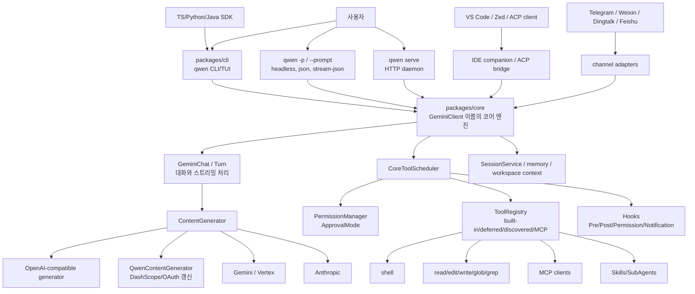
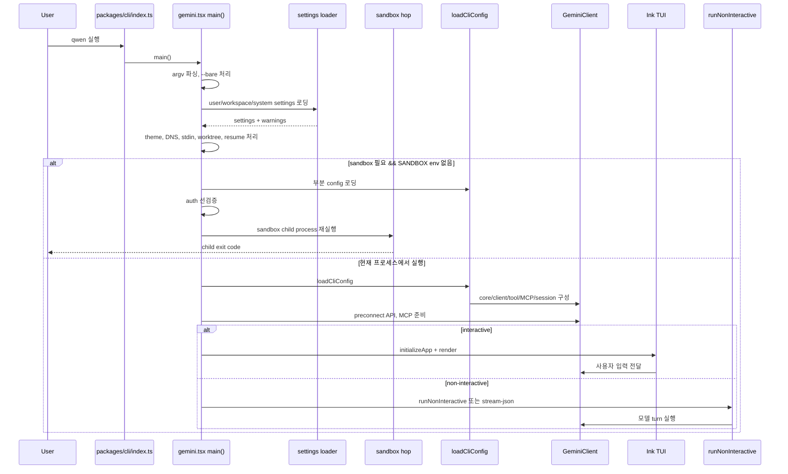
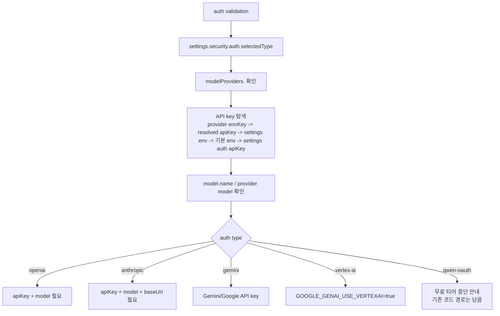
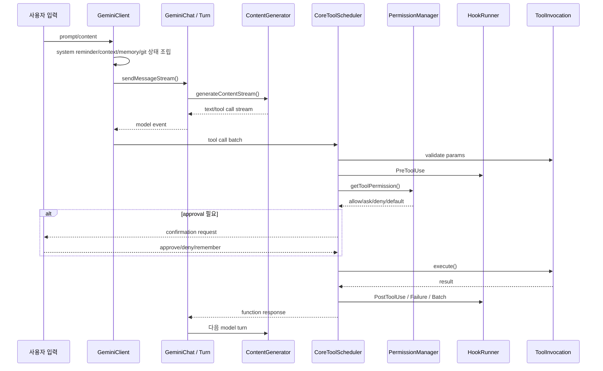
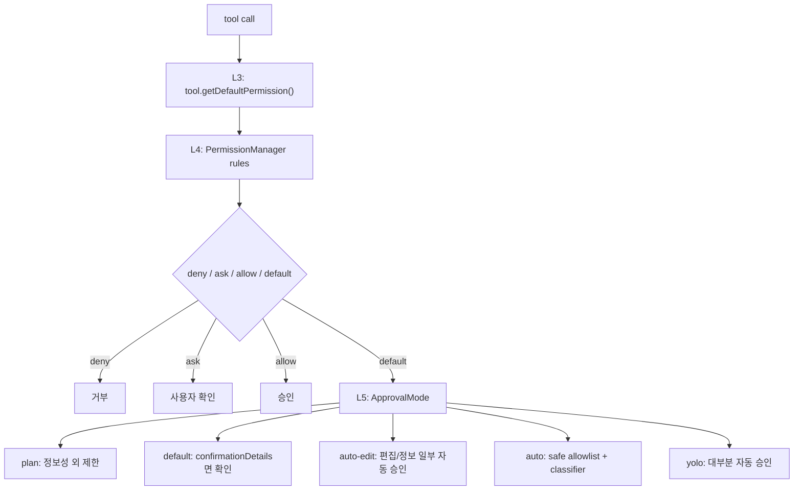
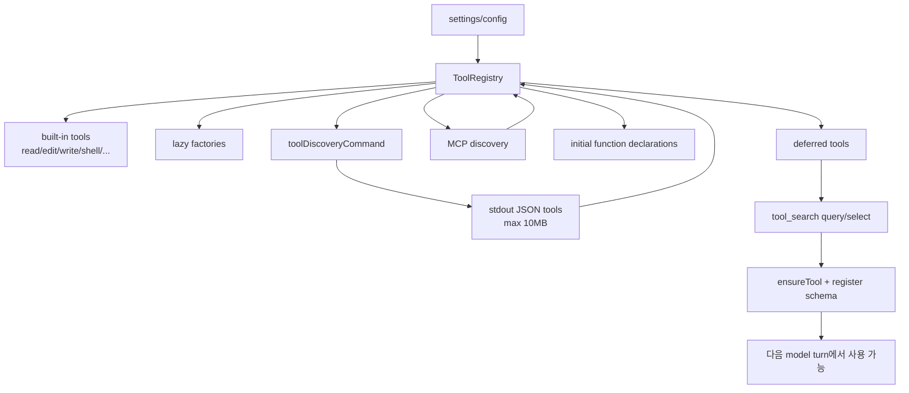
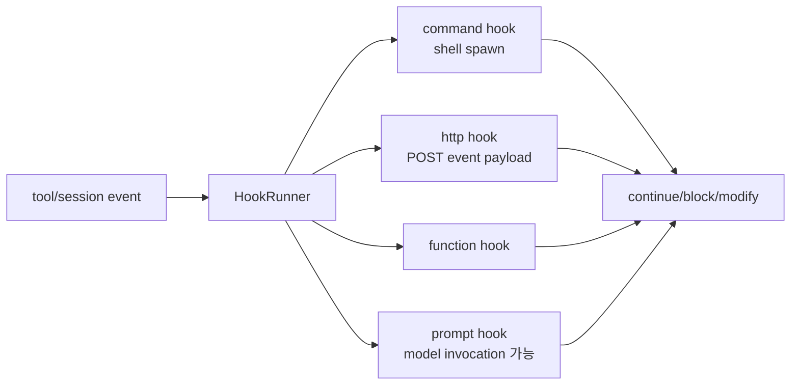
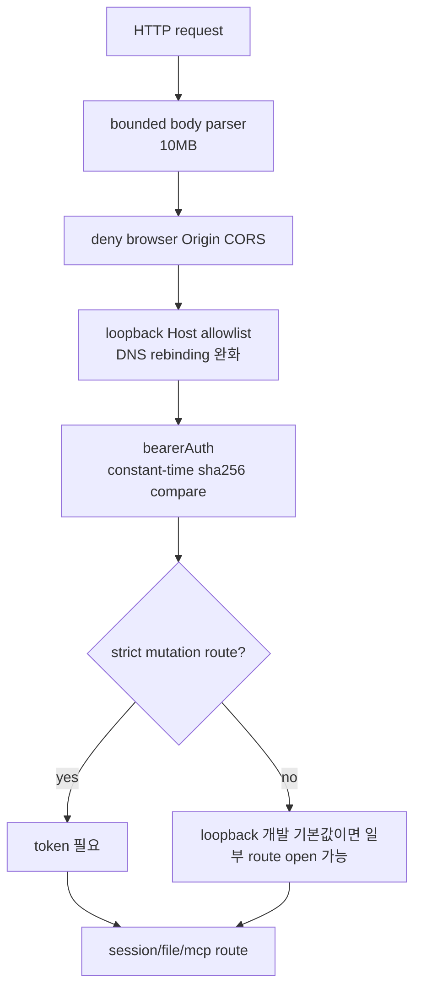
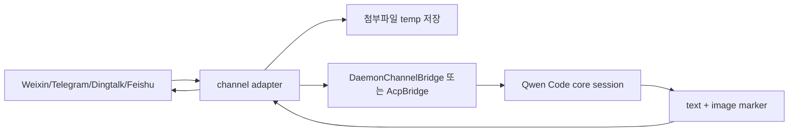

# QwenLM/qwen-code 상세 분석 보고서

## 1. 기본 평가

- 대상: `https://github.com/QwenLM/qwen-code`
- 로컬 소스: `sources/QwenLM__qwen-code`
- 분석 기준 커밋: `be62f0e93d4e2f59259650aa39a0a389fd033d44` (`be62f0e`)
- 기준 브랜치: `main`
- 마지막 커밋 시각: 2026-06-10 21:32:56 +0800
- GitHub 메타데이터 수집 시각: 2026-06-10T14:00:10.843Z
- 생성일: 2025-06-26
- 최신 릴리스: `v0.17.1`, 2026-06-03
- 주 언어: TypeScript
- 라이선스: Apache-2.0
- 규모: 약 3,115개 파일
- GitHub 지표: stars 25,065, forks 2,491, watchers 130
- 공식 설명: “An open-source AI coding agent that lives in your terminal.”

Qwen Code는 Qwen 모델을 1차 대상으로 삼은 터미널형 코딩 에이전트다. 구조적으로는 Google Gemini CLI 계열의 흔적이 강하게 남아 있다. 내부 핵심 클래스와 파일명에 `GeminiClient`, `gemini.tsx`, `geminiChat` 같은 이름이 유지되지만, 외부 제품 방향은 Qwen3-Coder/Qwen3.x 계열과 OpenAI/Anthropic/Gemini 호환 API를 폭넓게 묶는 “Qwen 중심 터미널 에이전트”다.

이 레포의 중요한 특징은 단순 CLI가 아니라, CLI/TUI, headless 실행, stream-json, ACP, IDE companion, `qwen serve` HTTP 데몬, 채널 어댑터, SDK, MCP, Skills/SubAgents, hooks, worktree, sandbox까지 한 저장소에 함께 들어 있다는 점이다. 따라서 사용자는 `qwen` 명령 하나로 시작하지만, 실제 런타임은 “터미널 UI + 코어 에이전트 엔진 + 모델 프로바이더 + 권한/도구 스케줄러 + 외부 확장 표면”의 복합 시스템이다.

## 2. 발전 방향과 철학

README와 루트 `AGENTS.md`, `.qwen/skills`, `.qwen/commands`, `.qwen/design`을 함께 보면 레포가 추구하는 방향은 다음과 같다.

1. Qwen 모델을 위한 최적화된 터미널 에이전트
   - 기본 설치 패키지는 `@qwen-code/qwen-code`이고 실행 명령은 `qwen`이다.
   - README는 Qwen3-Coder, Qwen3.5/3.6 Plus, Alibaba Cloud Coding Plan, OpenRouter, Fireworks, BYO API key를 전면에 둔다.
   - Qwen OAuth 무료 티어가 2026-04-15 기준 중단되었고, 이후에는 Alibaba Cloud Coding Plan 또는 자체 API key 사용을 권장한다.

2. Gemini CLI 계열을 Qwen 생태계에 맞게 확장
   - 핵심 엔진 이름이 아직 `GeminiClient`, `GeminiChat`, `gemini.tsx`다.
   - 하지만 인증 타입에는 `openai`, `qwen-oauth`, `gemini`, `vertex-ai`, `anthropic`가 있고, OpenAI-compatible provider 계층 위에 Qwen 전용 토큰 갱신/엔드포인트 갱신 계층이 얹혀 있다.
   - 이는 “기존 Gemini CLI 구조를 버리는 것”보다 “검증된 터미널 에이전트 구조를 Qwen/provider 중립 구조로 재사용하는 것”에 가깝다.

3. 터미널 우선, IDE와 채널은 보조 진입점
   - README는 터미널-first, IDE-friendly를 표방한다.
   - VS Code companion, Zed extension, ACP bridge, channel packages가 있으나 중심은 CLI/TUI다.

4. 에이전트 개발 자체를 에이전트 친화적으로 운영
   - 루트 `AGENTS.md`는 “Simplicity first”, “minimum code”, “no speculative abstraction”을 강조한다.
   - 비자명한 변경은 `.qwen/design/`, E2E 계획은 `.qwen/e2e-tests/`에 쓰도록 요구한다.
   - `.qwen/skills`에는 bugfix, feat-dev, e2e-testing, codegraph, memory-leak-debug, tmux-real-user-testing 등 내부 개발 워크플로가 묶여 있다.
   - 즉 이 레포는 제품인 동시에 “Qwen Code로 Qwen Code를 개발하기 위한 자기참조형 작업장”이다.

## 3. 최상위 구조

주요 패키지는 다음과 같다.

| 경로 | 역할 |
| --- | --- |
| `packages/cli` | `qwen` 터미널 CLI/TUI, headless 실행, `qwen serve`, 설정 로딩, 인증, sandbox hop |
| `packages/core` | 에이전트 코어, 모델 호출, 대화 상태, 도구 레지스트리, 권한, MCP, hooks, memory, sessions |
| `packages/acp-bridge` | ACP 연결용 브리지 |
| `packages/sdk-typescript` | TypeScript SDK |
| `packages/sdk-python` | Python SDK |
| `packages/sdk-java` | Java SDK |
| `packages/vscode-ide-companion` | VS Code companion extension |
| `packages/zed-extension` | Zed extension |
| `packages/webui`, `packages/web-templates` | 웹 UI/템플릿 표면 |
| `packages/channels/base` | 채널 브리지 공통 계층 |
| `packages/channels/telegram` | Telegram 채널 |
| `packages/channels/weixin` | WeChat/Weixin 채널 |
| `packages/channels/dingtalk` | Dingtalk 채널 |
| `packages/channels/feishu` | Feishu 채널 |
| `.qwen` | 레포 내부 에이전트 지침, 스킬, 명령, 설계 문서, E2E 계획 |

상위 아키텍처는 다음처럼 볼 수 있다.

## 4. CLI 시작 플로우

CLI의 진입점은 `packages/cli/index.ts`다. 여기서 CPU/startup profiler를 켜고 `packages/cli/src/gemini.tsx`의 `main()`을 호출한다. 예외 처리에서 `@lydell/node-pty` 계열의 알려진 EIO/EAGAIN/resize EBADF는 노이즈를 줄이고, `FatalError`는 지정 exit code로 종료한다.

`main()`의 흐름은 상당히 길지만 핵심은 다음 순서다.

특이점은 sandbox 처리가 “설정 로딩 뒤, 완전한 실행 전”에 한 번 더 프로세스를 띄우는 방식이라는 점이다. OAuth redirect 문제 때문에 sandbox 재실행 전에 인증을 선검증한다. 또한 `--worktree`는 `--acp`와 동시에 쓸 수 없고, `.qwen/worktrees/<slug>` 아래 별도 작업 디렉터리를 만들 수 있다.

## 5. 모델 프로바이더와 인증

모델 호출은 `packages/core/src/core/contentGenerator.ts`의 `ContentGenerator` 인터페이스로 추상화된다. 구현은 OpenAI-compatible, Qwen, Gemini/Vertex, Anthropic 계열로 나뉜다.

인증 타입은 다음과 같다.

| 인증 타입 | 의미 |
| --- | --- |
| `openai` | OpenAI-compatible API, BYO provider, OpenRouter/Fireworks/Alibaba 등 |
| `qwen-oauth` | Qwen OAuth. README 기준 무료 티어 중단. 코드에는 여전히 Qwen token manager가 존재 |
| `gemini` | Google Gemini API key |
| `vertex-ai` | Google Vertex AI |
| `anthropic` | Anthropic-compatible endpoint |

Qwen 전용 레이어는 `QwenContentGenerator`가 담당한다. 이 클래스는 OpenAI-compatible generator를 상속하고, DashScope provider와 `SharedTokenManager`를 통해 OAuth 토큰/엔드포인트 갱신을 수행한다. 즉 Qwen은 “완전히 별도의 프로토콜”이라기보다 OpenAI-compatible 호출 파이프라인 위에 Qwen 인증/갱신 로직을 덧댄 구조다.

프로바이더 프리셋에는 Alibaba Cloud Coding Plan, token plan, Alibaba standard, DeepSeek, MiniMax, Z.ai, ModelScope, OpenRouter, custom 등이 있다. Coding Plan provider는 `BAILIAN_CODING_PLAN_API_KEY`를 사용하고, 중국/글로벌 DashScope coding endpoint를 구분한다.

인증 검증 흐름은 다음처럼 요약할 수 있다.

## 6. 코어 대화/도구 실행 플로우

중심 클래스는 `packages/core/src/core/client.ts`의 `GeminiClient`다. 이름은 Gemini지만 실제로는 Qwen Code의 세션 엔진이다. 이 객체는 다음 상태를 관리한다.

- 현재 chat 객체
- session id와 turn count
- tool call count
- skills modified flag
- git status cache
- loop detector
- IDE context
- memory prefetch
- MCP tool reminder
- pending memory/background memory task
- stop hooks
- 마지막 API 완료 시각

사용자 입력이 들어오면 코어는 system reminder를 조립한다. 여기에는 현재 디렉터리, git 상태, custom/system prompts, plan mode reminder, active goals, IDE context, date injection, memory prefetch, auto skills, 추가 MCP tools reminder가 포함된다.

실제 한 turn은 다음 흐름으로 돈다.

## 7. 권한 모델

권한 모델은 이 레포에서 가장 중요한 안전 장치다. `ApprovalMode`는 다음이다.

| 모드 | 의미 |
| --- | --- |
| `plan` | 정보 수집과 계획 중심. 실행/수정성 도구는 차단 또는 확인 필요 |
| `default` | 위험 도구는 사용자 확인 |
| `auto-edit` | 편집/정보 도구 일부 자동 승인 |
| `auto` | 안전 도구와 classifier 결과에 따라 자동 승인 |
| `yolo` | `ask_user_question`을 제외하고 거의 모두 자동 승인 |

권한 판단은 여러 계층으로 나뉜다.

`PermissionManager`는 deny > ask > allow > default 우선순위로 규칙을 적용한다. legacy `coreTools` 설정은 레지스트리 수준의 도구 노출에도 영향을 준다. shell 명령의 경우 단순 문자열 매칭만 하지 않고 `shell-quote` 기반으로 compound command를 쪼개서 Read/Edit/Write/WebFetch와 동등한 가상 작업으로 분해하려 한다.

Auto 모드에는 세부 방어가 더 있다.

- read_file, grep, glob, ls, lsp, tool_search, todo_write, structured_output 등 안전 도구 allowlist
- workspace edit/write 빠른 승인 경로
- `.git`, `.github/workflows`, `package.json`, `.npmrc`, `.qwen/settings`, `.qwen/agents`, `.qwen/skills`, `.mcp.json` 등 protected path write 차단
- LLM classifier 기반 판정

단, YOLO는 이 구조를 거의 우회한다. headless YOLO 실행에서 sandbox가 없으면 경고를 띄우지만, 경고 자체가 차단은 아니다.

## 8. 도구 레지스트리와 deferred tools

`ToolRegistry`는 built-in tool, lazy factory, discovered tool, MCP tool을 하나로 묶는다. 중요한 점은 모든 도구가 처음부터 모델에게 노출되지 않는다는 것이다. 일부는 deferred tool로 숨겨지고, 모델이 `ToolSearch`를 통해 검색/선택하면 다음 turn부터 schema가 노출된다.

차별점은 다음이다.

- third-party MCP tool의 raw params를 classifier input으로 기본 제공하지 않도록 빈 sentinel을 둔다.
- MCP tool 이름이 충돌하면 `mcp__server__tool` 형식으로 qualification한다.
- `toolDiscoveryCommand`와 `toolCallCommand`를 통해 외부 프로세스가 도구를 동적으로 공급할 수 있다.
- `QWEN_CODE_LEGACY_MCP_BLOCKING=1` 테스트용 플래그가 있어 MCP discovery를 기존 blocking 방식으로 강제할 수 있다. 기본은 progressive discovery에 가깝다.

## 9. 주요 내장 도구

### 9.1 Shell

shell tool은 `child_process`와 ShellExecutionService/backgroundShellRegistry를 사용한다. 단순 실행 도구가 아니라 다음 기능을 포함한다.

- trailing `&` 제거
- git commit/PR 명령에서 co-author attribution 파싱
- shell segment tokenization
- read-only command 분류
- compound command의 root 추출
- background shell registry

권한 판단을 돕기 위해 shell 명령을 분석하지만, shell은 본질적으로 표현력이 큰 인터페이스다. 규칙이 보수적으로 작동해도 shell escaping, wrapper script, env, subshell, interpreter invocation을 모두 완벽히 의미론적으로 이해하기는 어렵다.

### 9.2 Edit

edit tool은 prior-read enforcement가 강하다. FileReadCache로 해당 파일을 먼저 읽었는지 확인하고, 편집 직전에 다시 확인해 TOCTOU를 줄인다. BOM, encoding, line ending 보존도 처리한다. 이는 “모델이 보지 않은 파일을 추측 편집하는 것”과 “읽은 뒤 사용자가 파일을 바꾼 상태에서 stale edit하는 것”을 줄이기 위한 설계다.

### 9.3 MCP

MCP client는 stdio, SSE, streamable HTTP, SDK control transport를 지원한다. HTTP streamable transport에서 GET SSE 400을 synthetic 405 fallback으로 정규화하는 로직도 있다. workspace roots를 MCP client에 등록하고, tool/prompt discovery를 수행한다.

MCP manager는 health monitor를 갖는다.

- 기본 interval 30초
- max failures 3
- auto reconnect true
- reconnect delay 5초

`qwen serve`에서는 MCP client 예산 guardrail도 있다. `QWEN_SERVE_MCP_CLIENT_BUDGET`, `QWEN_SERVE_MCP_BUDGET_MODE`로 enforce/warn/off를 설정할 수 있고, 75%에서 경고, 소진 시 refusal이 가능하다.

## 10. hooks 구조

hooks는 command/http/function/prompt 유형을 지원한다. 이벤트는 PreToolUse, PostToolUse, PostToolUseFailure, PostToolBatch, Notification, PermissionRequest 등과 연결된다.

HTTP hook에는 SSRF guard가 있다. 10/8, 100.64/10, 169.254/16, 172.16/12, 192.168/16, IPv6 ULA/link-local, mapped private v4 등을 차단하고, loopback은 허용한다. 다만 코드 주석상 DNS rebinding race 가능성은 남아 있다. command hook은 shell을 실행하므로, 사용자/프로젝트 설정에 따라 강력한 로컬 실행 표면이 된다.

## 11. `qwen serve` HTTP 데몬

`packages/cli/src/serve/server.ts`는 Express 기반 `qwen serve` 앱을 만든다. 주요 라우트는 다음 범주다.

- health/capabilities
- workspace/mcp
- workspace skills/providers/env/preflight
- session create/load/resume/context/supported-commands/prompt/cancel/heartbeat/model/events
- permission response
- workspace file read/write/edit
- memory/agents
- device flow auth

보안 레이어는 다음과 같다.

workspace file write/edit route는 expectedHash, BOM, encoding, lineEnding, client id 등을 받아 atomic write/edit를 수행한다. 실제 production `runQwenServe`는 workspace 존재와 factory/trust/audit 주입을 검증하지만, `createServeApp` 자체는 테스트를 위해 synthetic path도 받을 수 있다.

## 12. ACP와 채널

`packages/channels/base/src/AcpBridge.ts`는 ACP CLI bridge를 만든다. 내부적으로 `process.execPath [cliEntryPath, --acp]`를 spawn하고, stdio pipe로 ACP connection을 구성한다. 현재 `requestPermission` 구현은 “첫 번째 option/proceed_once를 자동 승인”하는 임시 구현으로 보인다. 실제 권한 UI가 붙기 전의 bridge로 사용하면 위험하다.

채널 패키지는 Telegram, Weixin, Dingtalk, Feishu가 있다. Weixin adapter를 보면 입력 미디어를 temp directory 아래로 다운로드/복호화하고, 에이전트 출력의 `[IMAGE: /absolute/path/to/file.png]` 마커를 이미지 전송으로 해석한다. 이는 사용자 편의 기능이지만, 메시징 플랫폼의 개인정보/첨부파일이 로컬 파일 시스템과 에이전트 컨텍스트로 들어오는 표면이기도 하다.

## 13. Skills/SubAgents와 숨겨진 개발 표면

이 레포에는 코드 외부의 중요한 에이전트 표면이 `.qwen` 아래에 들어 있다.

- `.qwen/agents/test-engineer.md`
- `.qwen/commands/qc/bugfix.md`
- `.qwen/commands/qc/code-review.md`
- `.qwen/commands/qc/commit.md`
- `.qwen/commands/qc/create-issue.md`
- `.qwen/commands/qc/create-pr.md`
- `.qwen/skills/bugfix`
- `.qwen/skills/codegraph`
- `.qwen/skills/e2e-testing`
- `.qwen/skills/feat-dev`
- `.qwen/skills/qwen-code-claw`
- `.qwen/skills/tmux-real-user-testing`
- `.qwen/skills/triage`
- `.qwen/design/*`
- `.qwen/e2e-tests/*`
- `.qwen/plans/*`
- `.qwen/specs/*`

이 파일들은 일반 소스 코드처럼 컴파일되지는 않지만, 에이전트가 이 레포를 다룰 때 행동을 강하게 유도한다. 예를 들어 `AGENTS.md`는 특정 상황에서 `test-engineer` agent를 쓰라고 지시한다. 즉 저장소에는 “제품 기능”과 “개발 에이전트 운영 지침”이 함께 섞여 있다.

Skills는 allowedTools 같은 선언을 통해 특정 도구 사용을 세션 동안 허용하는 흐름을 만들 수 있다. 따라서 `.qwen/skills`는 단순 문서가 아니라 권한 모델과 연결되는 잠재 실행 표면이다.

## 14. 사용자 플로우별 동작

### 14.1 대화형 터미널

1. 사용자가 `qwen` 실행
2. settings 로딩: user/workspace/system/default
3. 인증 타입과 모델 provider 확인
4. 필요하면 sandbox 재실행
5. MCP discovery 시작
6. Ink 기반 TUI 초기화
7. 사용자 입력 수집
8. `GeminiClient`가 context/system reminder 구성
9. 모델 스트림 호출
10. tool call이 나오면 `CoreToolScheduler`가 검증/권한/실행
11. 결과를 모델에게 function response로 되돌림
12. 최종 답변 출력

### 14.2 headless prompt

1. 사용자가 `qwen -p "..."` 또는 prompt option 사용
2. stdin/argv prompt 결합
3. `runNonInteractive` 실행
4. output adapter 선택: text/json/stream-json
5. `RunBudgetEnforcer`로 max wall time/tool calls 감시
6. slash command/at command 또는 일반 model turn 처리
7. tool result drain
8. structured output이 있으면 우선 반환
9. budget 초과는 지정 exit code로 종료

### 14.3 stream-json

1. stream-json 모드에서 session runner가 입력 이벤트를 읽음
2. prompt별 id를 만들고 `runNonInteractive`를 호출
3. 이벤트/도구/응답을 JSON stream으로 내보냄
4. cancel, heartbeat, session context와 결합 가능

### 14.4 IDE/ACP

1. IDE companion 또는 ACP client가 연결
2. ACP bridge가 `qwen --acp` child process를 spawn
3. session/prompt/permission 이벤트가 ACP connection으로 이동
4. 현재 base AcpBridge의 permission path는 자동 승인 구현이 있어 제품화 시 별도 UI/정책이 필요

### 14.5 `qwen serve`

1. 사용자가 `qwen serve` 실행
2. workspace-bound Express 앱 생성
3. Host/Origin/Auth/mutation gate 적용
4. 외부 UI 또는 channel bridge가 session/prompt route 호출
5. Core session 실행
6. permission request는 HTTP route로 응답
7. file read/write/edit route는 workspace file system을 통해 처리

## 15. 차별점

1. Qwen provider 최적화
   - Qwen/DashScope/Coding Plan 프리셋이 깊게 들어가 있고, Qwen OAuth/token 갱신 경로도 남아 있다.

2. Gemini CLI 계열의 검증된 구조를 빠르게 흡수
   - 내부 이름은 Gemini지만 기능 표면은 Qwen으로 확장되어 있다.
   - Google Gemini CLI와 유사한 tool scheduler, MCP, sandbox, TUI 구조를 재활용한다.

3. Skills/SubAgents를 제품 기능과 개발 운영 모두에 사용
   - `.qwen/skills`가 실제 개발 워크플로의 일부다.
   - 사용자는 Claude Code류 경험과 비슷한 skill/agent 확장을 얻는다.

4. 여러 인터페이스를 한 저장소에서 제공
   - CLI/TUI, non-interactive, stream-json, serve, ACP, IDE companion, messaging channels, SDK가 함께 들어 있다.

5. 권한 모델이 비교적 세분화됨
   - ApprovalMode, PermissionManager rules, safe allowlist, protected path, prior-read edit, shell virtual operation 분석이 결합된다.

## 16. 위험요소와 이상한 점

### 16.1 공급망/설치 표면

README의 설치 방식은 `curl | bash`, PowerShell remote installer, npm global install, Homebrew를 제공한다. 편의성은 높지만 hosted installer/CDN, npm 패키지, standalone Node runtime이 모두 신뢰 경계에 들어온다.

### 16.2 Qwen OAuth 중단과 코드 경로 잔존

README는 2026-04-15부터 Qwen OAuth 무료 티어가 중단되었다고 명시한다. 그러나 코드에는 `qwen-oauth`, `QwenContentGenerator`, `SharedTokenManager`가 남아 있다. 사용자는 “지원되는 인증 타입”과 “실제로 쓸 수 있는 무료 인증 경로”를 혼동할 수 있다.

### 16.3 YOLO와 sandbox

YOLO는 `ask_user_question`을 제외하고 거의 모든 도구를 자동 승인한다. headless YOLO에서 sandbox가 없으면 경고를 출력하지만, 실행 자체를 항상 막지는 않는다. shell/write/edit/MCP/hook이 결합된 상태에서 YOLO는 로컬 머신 권한으로 동작할 수 있다.

### 16.4 권한 규칙의 복잡성

PermissionManager는 shell 명령을 가상 Read/Edit/Write/WebFetch로 분해하려고 하지만, shell은 언어 자체가 복잡하다. 규칙이 보수적이어도 wrapper script, interpreter, env indirection, subshell은 완벽히 의미 분석하기 어렵다. 또한 `permissions.allow` 설정은 사용자 확인을 크게 줄일 수 있다.

### 16.5 ACP bridge 자동 승인

`packages/channels/base/src/AcpBridge.ts`의 `requestPermission`은 현재 첫 번째 option/proceed_once를 자동 승인한다. 이 코드는 “Phase 5에서 interactive approval 추가”라는 성격으로 보이며, 실제 운영 bridge로 쓸 때는 위험하다.

### 16.6 `qwen serve` loopback 개발 기본값

serve auth는 Host allowlist, Origin deny, bearer token, strict mutation gate를 갖는다. 그래도 loopback 개발 기본값에서 non-strict route가 토큰 없이 열릴 수 있다. 브라우저 Origin은 막지만, 로컬 프로세스나 잘못 프록시된 환경에서는 공격 표면이 생길 수 있다.

### 16.7 body parser가 strict mutation auth보다 먼저 실행

serve에서 body parser는 route-level strict auth보다 먼저 10MB까지 body를 읽는다. 큰 문제는 아니지만, 인증 전 리소스 소비 표면이다.

### 16.8 hooks의 실행 권한

command hook은 shell spawn이고, HTTP hook은 외부 URL로 이벤트 payload를 보낼 수 있다. SSRF guard는 있지만 loopback은 허용되고 DNS rebinding race 가능성이 코드 주석에 남아 있다. prompt hook은 모델 invocation과 결합될 수 있어 정책/비용/데이터 유출 측면에서 주의가 필요하다.

### 16.9 MCP와 tool discovery

MCP stdio는 로컬 command 실행과 env/cwd를 포함한다. HTTP/SSE MCP는 remote endpoint와 연결된다. `toolDiscoveryCommand`/`toolCallCommand`도 외부 프로세스가 도구 schema와 실행을 공급한다. 이는 강력한 확장성인 동시에 프로젝트 설정 기반 실행 표면이다.

### 16.10 deferred tool의 “나중에 나타나는 도구”

모델이 처음 보는 도구 목록은 전체가 아닐 수 있다. `ToolSearch`로 검색하면 나중에 schema가 노출된다. 사용자가 UI에 보이는 도구만 보고 안전성을 판단하면, deferred MCP/discovered tool을 놓칠 수 있다.

### 16.11 채널 어댑터의 개인정보 표면

Weixin/Telegram/Dingtalk/Feishu 채널은 메시지, 이미지, 첨부파일을 에이전트 세션으로 넣는다. Weixin adapter는 temp dir에 파일을 저장하고, 출력 마커로 이미지를 전송한다. 기업 채팅/개인 채팅 데이터가 로컬 에이전트/모델 provider/MCP tool에 흘러갈 수 있다.

### 16.12 설정 파일과 비밀정보

기본 설정은 `~/.qwen/settings.json`이며 `QWEN_HOME`, `QWEN_RUNTIME_DIR`가 있다. 프로젝트 `.env`가 이 경로를 바꾸지 못하도록 일부 env를 hard exclude하는 방어는 좋다. 그러나 model provider API key, auth apiKey, env 값 자체는 여전히 settings/env에 저장될 수 있어 파일 권한과 백업/동기화 정책이 중요하다.

### 16.13 telemetry/logging

telemetry 설정, OTLP, OpenAI logging directory, prompt logging 옵션이 있다. 디버그/로깅을 켜면 prompt, tool call, provider request 일부가 로컬 또는 외부 수집기로 갈 수 있다.

### 16.14 worktree 기능

`--worktree`는 `.qwen/worktrees` 아래 별도 작업 디렉터리를 구성한다. symlink path 검증과 `.git/.qwen` 차단이 있지만, 사용자는 현재 cwd와 실제 git 작업 디렉터리를 혼동하기 쉽다.

### 16.15 MCP transport 불일치 가능성

MCP config 타입에는 `tcp`가 있고 transport 분류에서는 websocket 계열로 매핑되는 흔적이 있으나, 실제 createTransport 구현 범위와 맞지 않는 부분이 있다. 기능 플래그/미완성 경로일 가능성이 있다.

## 17. 실제 실행 검증

현재 체크아웃에서 수행한 검증은 다음과 같다.

| 검증 | 결과 |
| --- | --- |
| `node --version` | repo 실행 시 Node v23.4.0 경로가 사용됨 |
| `npm --version` | 10.9.8 |
| `python3 --version` | 3.12.4 |
| root `node_modules` | 없음 |
| repo `node_modules` | 없음 |
| `python3 -m py_compile packages/sdk-python/src/qwen_code_sdk/*.py` | 통과 |
| `npm run typecheck --workspace=@qwen-code/qwen-code-core` | 실패. `tsc: command not found` |
| `node packages/cli/index.ts --help` | 실패. Node가 `.ts` extension을 직접 로드하지 못함 |

즉 소스 구조 분석은 가능하지만, 현재 클론 상태는 의존성 설치/빌드 전이므로 TypeScript CLI를 직접 실행할 수 없다. 실제 사용자는 npm package, standalone installer, 또는 의존성 설치 후 `npm run build`/`npm start` 경로를 써야 한다.

## 18. 종합 평가

Qwen Code는 “Qwen 모델용 Gemini CLI 계열 터미널 에이전트”로 보는 것이 가장 정확하다. 장점은 풍부한 실행 표면, 세분화된 권한 모델, MCP/Skills/SubAgents/serve/IDE/channel/SDK까지 포함한 확장성이다. 특히 Qwen/DashScope/Coding Plan provider를 1급 시민으로 다룬다는 점이 Google Gemini CLI, OpenAI Codex CLI, Cline/Roo/Kilo류와 구분된다.

반면 위험도도 그만큼 크다. shell, edit/write, MCP stdio, tool discovery subprocess, hooks, serve daemon, messaging channels, ACP bridge가 모두 같은 에이전트 런타임에 연결된다. 안전성은 ApprovalMode, PermissionManager, protected path, prior-read enforcement, sandbox, serve auth 같은 여러 방어층에 의존한다. 따라서 이 도구를 이해할 때는 “모델이 똑똑한가”보다 “어떤 도구가 언제, 어떤 권한으로, 어떤 경로를 통해 호출되는가”를 먼저 봐야 한다.

이 레포의 설계 철학은 빠른 제품 확장과 실전 에이전트 워크플로를 중시한다. 내부 개발을 위한 `.qwen` 자산까지 포함되어 있어, 사용자는 코드뿐 아니라 숨겨진 에이전트 지침/스킬/명령도 함께 검토해야 전체 동작을 이해할 수 있다.
