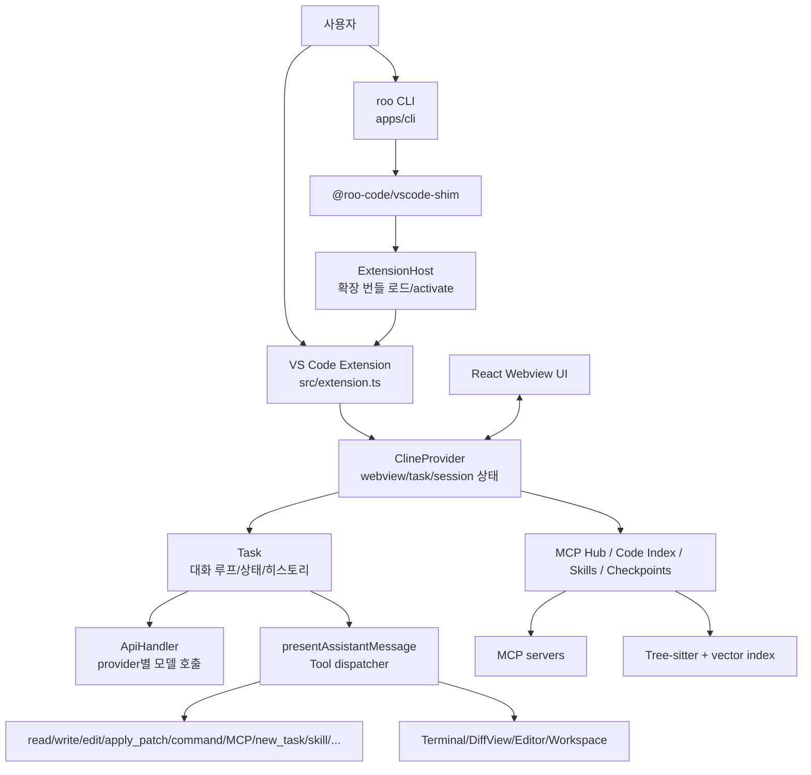
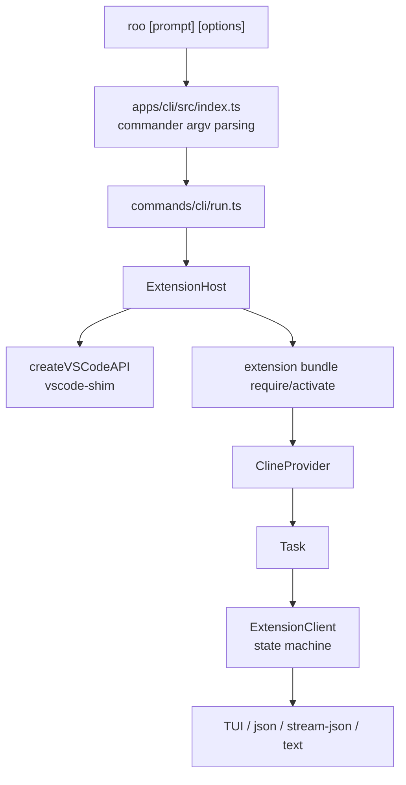
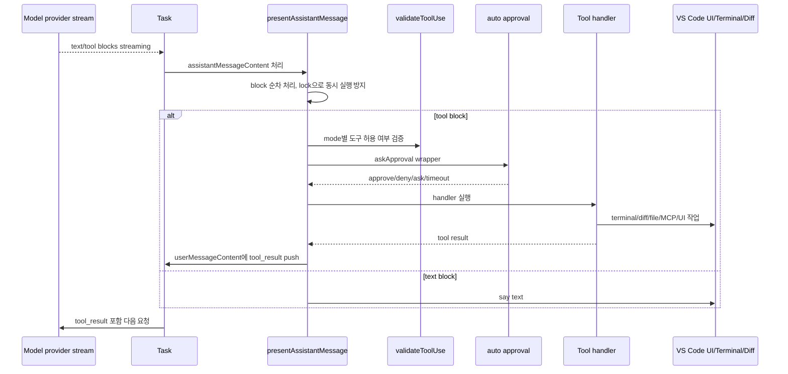
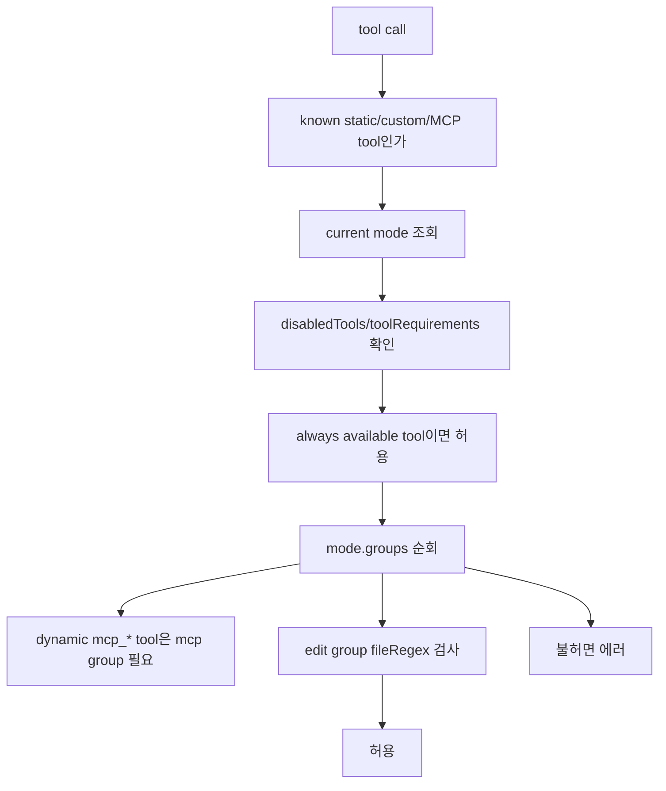
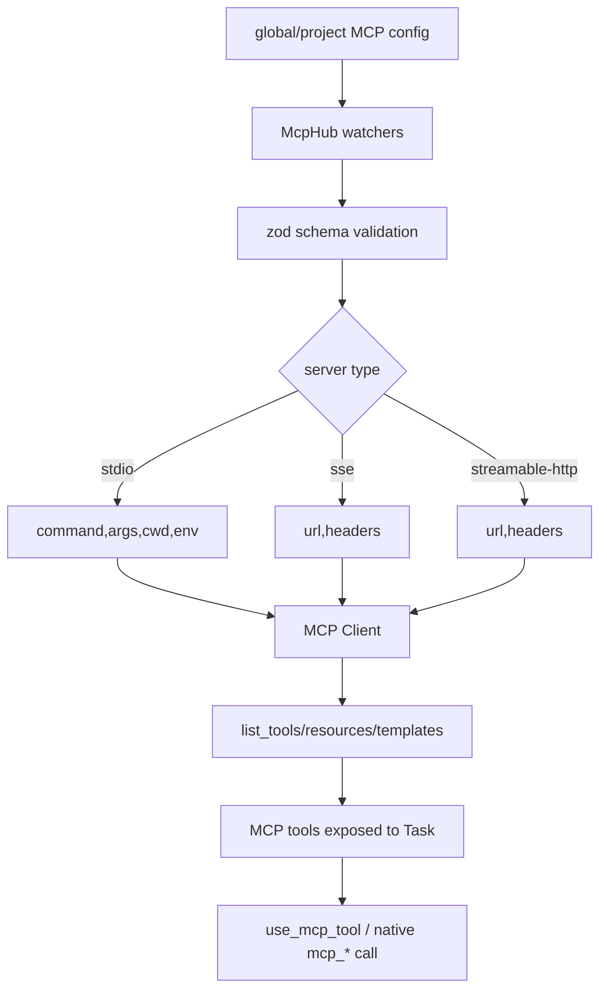

# RooCodeInc/Roo-Code 상세 분석 보고서

## 1. 기본 평가

- 대상: `https://github.com/RooCodeInc/Roo-Code`
- 로컬 소스: `sources/RooCodeInc__Roo-Code`
- 분석 기준 커밋: `b867ec9145750d0ae1ff7f02d35406e9bf2a0b16` (`b867ec9`)
- 기준 브랜치: `main`
- 마지막 커밋 시각: 2026-05-15 14:04:45 -0400
- 최신 릴리스: `v3.54.0`, 2026-05-15
- GitHub 상태: archived
- 생성일: 2024-10-31
- 주 언어: TypeScript
- 라이선스: Apache-2.0
- 규모: 약 3,053개 파일
- GitHub 지표: stars 24,227, forks 3,309, watchers 141
- 공식 설명: “Roo Code gives you a whole dev team of AI agents in your code editor.”

Roo Code는 Cline 계열에서 파생된 VS Code IDE 코딩 에이전트다. 그러나 2026년 6월 10일 기준 이 저장소는 archived 상태이고, README도 “The Roo Code Extension was shut down on May 15th.”라고 명시한다. 따라서 현재 분석 관점은 “현역 제품으로 도입할 오픈소스”라기보다 “Cline/Roo/Kilo 계열 IDE 에이전트가 어떤 구조를 가졌고 어떤 설계 선택을 했는가”에 맞추는 것이 정확하다.

Roo의 핵심은 VS Code 확장이다. CLI도 별도 agent core를 새로 구현하지 않고, `@roo-code/vscode-shim`으로 VS Code API mock을 만든 뒤 기존 확장 번들을 Node.js 환경에서 활성화한다. 즉 사용자에게는 `roo` CLI가 보일 수 있지만, 실제 중심축은 `src/extension.ts`, `ClineProvider`, `Task`, webview, VS Code terminal/diff/editor integration이다.

## 2. 발전 과정과 철학

README는 Roo를 “Your AI-Powered Dev Team, Right in Your Editor”라고 설명한다. 제공 모드는 Code, Architect, Ask, Debug, Custom Modes이며, 자연어 코드 생성, 리팩터링, 문서화, 질의응답, 반복 작업 자동화, MCP 서버 활용을 강조한다.

레포의 철학은 다음으로 정리된다.

1. 에디터 안에서 작업하는 다중 모드 에이전트
   - Roo는 터미널 CLI보다 VS Code sidebar/webview를 1차 UI로 둔다.
   - `Code`, `Architect`, `Ask`, `Debug`는 단순 프롬프트 프리셋이 아니라 도구 그룹 제한과 연결된다.

2. Cline 계열의 확장성 확대
   - 패키지명, 내부 클래스명, command id에 `cline` 흔적이 많이 남아 있다.
   - 하지만 Roo는 custom modes, MCP, skills, subtasks, CLI, code index, checkpoint를 더 적극적으로 확장한 형태다.

3. “개발팀” 메타포
   - `new_task`, `switch_mode`, custom mode, `.roomodes`, `.roo/commands`, `.roo/rules-*`를 통해 하나의 에이전트가 여러 역할로 전환하거나 하위 작업을 생성한다.

4. 빠른 제품화 후 종료
   - 릴리스 이미지와 changelog가 많고, 2026-05-15 최종 릴리스까지 빠르게 발전했다.
   - 같은 날짜에 “Remove roocode.com web app” 커밋이 있고, README가 종료 공지를 포함한다. 이는 기술 구조와 별개로 운영 지속성 리스크가 이미 현실화된 사례다.

## 3. 최상위 구조

| 경로 | 역할 |
| --- | --- |
| `src` | VS Code extension 본체. activation, provider, Task loop, tools, prompts, services |
| `webview-ui` | sidebar/editor webview UI |
| `apps/cli` | `roo` CLI. VS Code shim으로 extension bundle을 실행 |
| `apps/docs` | 문서 사이트 |
| `apps/vscode-nightly` | nightly extension packaging |
| `apps/vscode-e2e` | VS Code E2E |
| `packages/core` | platform-agnostic utility. custom tools, debug log, worktree, message utils |
| `packages/types` | 공유 타입과 default modes/tool settings |
| `packages/ipc` | IPC/API 관련 패키지 |
| `packages/vscode-shim` | CLI에서 VS Code API를 흉내내는 layer |
| `.roo` | 이 레포 자체를 다루기 위한 Roo command/rule/mode 설정 |
| `.roomodes` | 프로젝트 custom modes |
| `.rooignore` | Roo가 접근하지 말아야 할 파일 규칙 |

전체 구조는 다음과 같다.



## 4. VS Code 확장 시작 플로우

`src/extension.ts`의 `activate()`는 다음 일을 한다.

1. optional `.env` 로딩
2. network proxy 초기화
3. custom tool registry에 extension path 설정
4. settings migration
5. i18n 초기화
6. TerminalRegistry 초기화
7. OpenAI Codex OAuth manager 초기화
8. allowedCommands 기본값을 globalState에 세팅
9. ContextProxy 생성
10. workspace별 CodeIndexManager background 초기화
11. `ClineProvider` 생성 및 sidebar webview 등록
12. command, code action, terminal action 등록
13. diff virtual document provider 등록
14. URI handler와 API/IPC 활성화

```mermaid
sequenceDiagram
  participant VS as VS Code
  participant Ext as activate()
  participant Ctx as ContextProxy
  participant Provider as ClineProvider
  participant MCP as McpServerManager
  participant Index as CodeIndexManager
  participant UI as Webview UI

  VS->>Ext: extension activation
  Ext->>Ext: .env/proxy/migration/i18n 초기화
  Ext->>Index: workspace code index background init
  Ext->>Ctx: ContextProxy.getInstance()
  Ext->>Provider: new ClineProvider()
  Provider->>MCP: singleton McpHub 요청
  Provider->>Provider: SkillsManager, TaskHistoryStore 초기화
  Ext->>VS: webview/sidebar/commands 등록
  UI<->>Provider: webview messages
```

## 5. CLI 플로우

`apps/cli`는 독립형 에이전트가 아니라 VS Code 확장 실행 wrapper다. CLI README가 이 점을 직접 설명한다.



중요한 점은 CLI 기본값이다. `apps/cli/README.md`에는 interactive mode가 기본적으로 tool/command/browser/MCP actions를 auto-approved한다고 적혀 있다. 코드에서도 `ExtensionHost`가 non-interactive일 때 `autoApprovalEnabled`, `alwaysAllowReadOnly`, `alwaysAllowWrite`, `alwaysAllowMcp`, `alwaysAllowModeSwitch`, `alwaysAllowSubtasks`, `alwaysAllowExecute`, `allowedCommands: ["*"]`를 초기 설정으로 둔다. `--require-approval` 옵션을 써야 수동 승인 모드가 된다.

## 6. Task 대화 루프

중심 클래스는 `src/core/task/Task.ts`다. Task는 다음을 들고 있다.

- task id, parent/root task id, child task id
- mode와 provider profile
- todo list
- API handler
- message manager
- file context tracker
- RooIgnoreController
- RooProtectedController
- DiffViewProvider
- TerminalRegistry/output interceptor
- Checkpoint service
- MCP hub reference
- task persistence/history
- auto-approval handler
- tool repetition detector

한 번의 모델 응답 처리 흐름은 `presentAssistantMessage()`에 의해 수행된다.



`presentAssistantMessage()`는 MCP native tool call도 `use_mcp_tool` 실행 경로로 변환한다. 또한 tool result 중복을 막기 위해 `hasToolResult`를 추적하고, 사용자 승인 시 입력한 feedback을 실제 tool_result에 병합한다. 이 부분은 tool_call_id 중복으로 provider API가 실패하는 문제를 줄이기 위한 설계다.

## 7. 도구 체계

주요 도구는 `src/core/tools` 아래에 있다.

| 도구 | 역할 |
| --- | --- |
| `read_file` | 파일 읽기 |
| `list_files` | 파일 목록 |
| `search_files` | ripgrep 기반 검색 |
| `codebase_search` | code index 기반 검색 |
| `write_to_file` | 파일 생성/전체 쓰기 |
| `apply_diff` | diff 적용 |
| `edit`, `search_replace`, `edit_file` | 검색/치환형 편집 |
| `apply_patch` | patch 형식 적용 |
| `execute_command` | VS Code terminal 또는 execa 기반 명령 실행 |
| `read_command_output` | 실행 중/완료 command output 조회 |
| `use_mcp_tool` | MCP tool 호출 |
| `access_mcp_resource` | MCP resource 접근 |
| `ask_followup_question` | 사용자 질문 |
| `switch_mode` | 모드 전환 |
| `new_task` | 하위 작업 생성 |
| `attempt_completion` | 작업 완료 |
| `run_slash_command` | slash command 실행 |
| `skill` | skill 로딩 |
| `generate_image` | 이미지 생성 |
| `update_todo_list` | todo list 갱신 |

편집 도구들은 checkpoint 저장 후 실행된다. `write_to_file`은 diff view를 열고 patch preview를 만든 뒤 승인을 받으며, 승인 거부 시 revert한다. `execute_command`는 RooIgnoreController로 command access를 먼저 검사하고, VS Code terminal shell integration 실패 시 execa fallback을 사용한다.

## 8. 모드와 도구 제한

Roo의 모드는 도구 그룹 제한과 연결된다. `packages/types/src/mode.ts`에는 기본 모드가 있고, `.roomodes` 또는 사용자 설정으로 custom mode를 추가할 수 있다.

도구 그룹은 `src/shared/tools.ts`의 `TOOL_GROUPS`에 정의된다. 대표 그룹은 read, edit, command, mcp, mode/subtask 계열이다. `validateToolUse()`는 다음을 검사한다.

1. 도구 이름이 유효한가
2. 현재 mode가 존재하는가
3. toolRequirements나 disabledTools에 의해 비활성화되지 않았는가
4. always available tool인가
5. custom tool 또는 dynamic MCP tool인가
6. 현재 mode의 group이 해당 tool을 허용하는가
7. edit group에 fileRegex 제한이 있으면 대상 파일이 제한에 맞는가
8. `apply_patch`라면 patch 내부 Add/Delete/Update file path까지 regex를 검사



차별점은 Gemini 같은 provider가 “과거 tool call을 참조해야 하므로 전체 tool schema는 넘기되 allowedFunctionNames로 호출 가능 도구만 제한”하는 경로도 있다는 점이다. 이는 provider별 tool-calling 제약을 실용적으로 우회하는 설계다.

## 9. Auto-Approval 모델

`src/core/auto-approval/index.ts`는 ask type별 자동 승인 여부를 결정한다.

| ask type | 자동 승인 조건 |
| --- | --- |
| non-blocking ask | 즉시 approve |
| followup | `alwaysAllowFollowupQuestions`면 첫 suggestion을 timeout 후 자동 선택 가능 |
| use_mcp_server | `alwaysAllowMcp` + server tool의 `alwaysAllow` |
| command | `alwaysAllowExecute` + allowedCommands/deniedCommands longest-prefix rule |
| tool read-only | `alwaysAllowReadOnly`, outside workspace 옵션 확인 |
| tool write | `alwaysAllowWrite`, outside workspace/protected 옵션 확인 |
| switchMode | `alwaysAllowModeSwitch` |
| newTask/finishTask | `alwaysAllowSubtasks` |
| skill/updateTodoList | 의도적으로 자동 승인 |

command 자동 승인에는 위험 치환 보호가 있다. `${var@P}`, `${!var}`, here-string command substitution, zsh process substitution, zsh glob qualifier 같은 패턴은 자동 승인을 막는다. 또한 command chain을 파싱해 allow/deny longest prefix를 적용한다.

하지만 CLI non-interactive 기본 초기값은 `allowedCommands: ["*"]`, write protected 허용, MCP 허용까지 켜는 형태다. 실제 안전성은 사용자가 `--require-approval`을 쓰는지, GUI에서 auto approval을 어떻게 설정하는지에 크게 의존한다.

## 10. MCP 구조

`McpHub`는 global settings와 project MCP 파일을 감시하고, 서버 구성을 검증한 뒤 stdio/SSE/streamable-http client를 만든다.



MCP 서버는 `disabled`, `timeout`, `alwaysAllow`, `watchPaths`, `disabledTools`를 가질 수 있다. `McpServerManager`는 singleton으로 한 세트의 MCP 서버만 여러 webview가 공유하도록 만든다.

## 11. Code Index와 검색

Roo는 단순 grep 외에 code index service를 갖는다. `src/services/code-index`에는 다음이 있다.

- config/state/cache manager
- scanner/file watcher/parser
- Tree-sitter 기반 language parser
- vector-store/qdrant-client
- embedder: Bedrock, Gemini, Mistral, Ollama, OpenAI-compatible, OpenAI, OpenRouter, Vercel AI Gateway
- search service

즉 `codebase_search`는 단순 문자열 검색이 아니라 embedding/vector index 기반 코드 검색을 제공할 수 있다. 반면 이는 프로젝트 코드가 embedding provider나 로컬/원격 vector store에 들어갈 수 있음을 의미한다.

## 12. 숨겨진/비가시적 표면

이 레포에는 일반 사용자 UI 밖의 에이전트 설정이 많다.

- `.roomodes`: translate, issue-fixer, pr-fixer, merge-resolver, docs-extractor, issue-investigator, issue-writer 등 custom modes
- `.roo/commands`: release, commit, translate, conflict resolve 등 slash command
- `.roo/rules`: 레포 전용 coding/test/style rule
- `.roo/rules-code`, `.roo/rules-debug`, `.roo/rules-translate`
- `.roo/roomotes.yml`: `pnpm install` 같은 command 자동화
- `.rooignore`: Roo 접근 제한
- `AGENTS.md`: SettingsView race condition 관련 에이전트 지침

이 표면은 코드 실행 파일이 아니지만, Roo/Cline 계열 도구가 프로젝트를 열 때 모델 행동과 허용 도구를 바꿀 수 있다. 특히 custom mode는 특정 fileRegex에 대해서만 edit group을 허용할 수 있으므로, 프로젝트 정책과 권한 모델의 일부로 봐야 한다.

## 13. 사용자 플로우별 동작

### 13.1 VS Code sidebar에서 새 작업

1. 사용자가 Activity Bar의 Roo Code view를 연다.
2. `ClineProvider`가 webview와 메시지를 교환한다.
3. 사용자가 prompt를 입력한다.
4. Provider가 새 `Task`를 생성하고 mode/provider profile을 초기화한다.
5. Task가 environment details, prompts, tools를 구성해 모델 API를 호출한다.
6. 모델이 text/tool call을 스트리밍한다.
7. `presentAssistantMessage()`가 tool call을 순차 처리한다.
8. command/file/MCP 작업은 approval 또는 auto-approval을 거친다.
9. 결과가 task history와 API history에 저장된다.
10. 완료 시 `attempt_completion` 또는 idle state로 전환된다.

### 13.2 파일 편집

1. 모델이 `write_to_file`, `apply_diff`, `edit`, `apply_patch`를 호출한다.
2. mode/fileRegex/RooIgnore/RooProtected를 검사한다.
3. checkpoint를 저장한다.
4. DiffViewProvider가 preview를 만든다.
5. 사용자 승인 또는 auto-approval을 통과하면 저장한다.
6. 거부하면 revert한다.
7. file context tracker가 변경 사실을 기록한다.

### 13.3 명령 실행

1. 모델이 `execute_command`를 호출한다.
2. RooIgnoreController가 command 접근을 검사한다.
3. approval/auto-approval이 command string 기준으로 결정된다.
4. VS Code terminal 또는 execa로 실행한다.
5. OutputInterceptor가 output artifact를 저장하고 UI preview 크기를 제한한다.
6. timeout은 사용자 설정과 model-provided timeout, allowlist에 따라 달라진다.
7. `read_command_output`으로 장기 실행 명령 출력을 다시 읽을 수 있다.

### 13.4 CLI 실행

1. `roo "..." -w <workspace>` 실행
2. commander가 옵션을 파싱한다.
3. ExtensionHost가 VS Code shim을 만들고 확장 bundle을 activate한다.
4. ExtensionClient가 extension message를 state machine으로 처리한다.
5. TUI/print/json/stream-json으로 출력한다.
6. `--require-approval`이 없으면 CLI 문서상 기본 대화형 실행도 자동 승인 성격이 강하다.

### 13.5 MCP 호출

1. McpHub가 global/project MCP config를 읽고 서버에 연결한다.
2. 도구 목록이 prompt/tool schema에 반영된다.
3. 모델이 `use_mcp_tool` 또는 native `mcp_server_tool`을 호출한다.
4. 서버/도구 존재 여부와 disabled 상태를 확인한다.
5. auto-approval은 server tool의 `alwaysAllow` 여부까지 확인한다.
6. MCP 결과를 tool_result로 모델에게 돌려준다.

## 14. 차별점

1. VS Code 확장 중심 agent runtime
   - 터미널-first 계열과 달리 editor, terminal, diff view, diagnostics, workspace state를 1급 통합 대상으로 둔다.

2. CLI가 extension을 재사용
   - CLI와 IDE가 서로 다른 agent engine이 아니라 같은 extension core를 공유한다. 중복은 줄지만, CLI에서도 VS Code shim과 extension bundle 의존성이 생긴다.

3. 모드별 도구 제한
   - Code/Architect/Ask/Debug/Custom Modes가 prompt뿐 아니라 tool group과 fileRegex 제한까지 바꾼다.

4. rich tool set
   - 파일, diff, patch, command, MCP, codebase search, skills, image, subtask, slash command가 모두 도구화되어 있다.

5. task persistence와 checkpoint
   - 작업별 history, checkpoint, command output artifact, task metadata가 비교적 촘촘하다.

6. code index
   - Tree-sitter와 embedding/vector store 기반 코드 검색을 extension 안에 포함한다.

## 15. 위험요소와 이상한 점

### 15.1 프로젝트 종료/아카이브

가장 큰 리스크는 기술 문제가 아니라 운영 종료다. README가 2026년 5월 15일 extension shutdown을 명시하고 GitHub도 archived 상태다. 보안 업데이트, provider API 변경 대응, marketplace 배포 지속성을 기대하기 어렵다.

### 15.2 CLI 기본 자동 승인

CLI README는 interactive mode에서 tool, command, browser, MCP action이 auto-approved된다고 설명한다. non-interactive 초기 설정도 write protected/outside workspace/MCP/command `*` 자동 승인을 켠다. 로컬 코드 수정과 명령 실행을 수행하는 에이전트에서 이는 매우 큰 권한이다.

### 15.3 `curl | sh` 설치

CLI quick install은 GitHub raw install script를 shell에 pipe한다. 종료된 프로젝트라는 점을 고려하면 supply chain과 version pinning을 더 엄격하게 해야 한다.

### 15.4 VS Code 확장 권한

확장은 VS Code API로 workspace file, terminal, webview, globalState, secret/profile 설정, URI handler, code actions에 접근한다. 사용자는 단순 chat UI처럼 보지만 실제 권한은 editor extension 권한이다.

### 15.5 MCP stdio/remote surface

MCP config는 stdio command와 remote SSE/HTTP URL을 지원한다. project MCP 파일 감시와 자동 재연결이 있으므로, 신뢰하지 않는 프로젝트에서 MCP 설정을 그대로 활성화하면 로컬 명령 실행 또는 원격 tool 호출 표면이 생긴다.

### 15.6 auto-approval longest-prefix 한계

command allow/deny는 dangerous substitution 보호와 longest-prefix rule을 갖지만, shell 의미 전체를 완벽히 해석하지는 않는다. `allowedCommands: ["*"]`는 이 방어를 대부분 무의미하게 만든다.

### 15.7 custom modes와 fileRegex

fileRegex 제한은 유용하지만 정규식 오류나 누락, `apply_patch` 경로 추출 한계에 민감하다. custom mode가 프로젝트에 들어 있으면 사용자가 모르는 사이 edit 가능 범위가 바뀔 수 있다.

### 15.8 Skills 자동 승인

코드 주석은 skill tool이 미리 정의된 지침만 로드하므로 자동 승인이 의도적이라고 설명한다. 하지만 skill이 모델 지침과 허용 도구 흐름을 바꾸는 장치라면, “파일을 읽기만 한다”보다 영향이 크다.

### 15.9 telemetry 기본값

PRIVACY.md는 PostHog 기반 익명 사용/오류 telemetry를 수집하며 opt-out 가능하다고 설명한다. 코드와 prompt는 수집하지 않는다고 하지만, VS Code machine ID와 기능 사용 패턴/예외 보고는 수집 표면이다.

### 15.10 code index 데이터 이동

embedding provider로 OpenAI/OpenRouter/Gemini/Ollama 등 여러 선택지가 있다. 로컬 Ollama가 아닌 provider를 쓰면 코드 조각이 embedding API로 전송될 수 있다.

### 15.11 hidden repo policy

`.roo`, `.roomodes`, `AGENTS.md`는 일반 npm package 코드보다 덜 눈에 띄지만 에이전트 행동에 영향을 준다. 특히 issue/PR/merge resolver mode는 GitHub CLI와 command group을 포함한다.

### 15.12 모델 provider surface

Anthropic, OpenAI, OpenRouter, Bedrock, Gemini, LiteLLM, LM Studio, Ollama, Mistral, Moonshot, Qwen Code, Requesty, Vercel AI Gateway 등 provider가 매우 많다. 이는 선택권이 넓다는 뜻이지만 provider별 tool-calling, token accounting, privacy, rate limit, auth failure 동작이 달라지는 리스크다.

## 16. 실제 실행 검증

현재 체크아웃에서 수행한 검증은 다음과 같다.

| 검증 | 결과 |
| --- | --- |
| `node --version` | v22.22.3, 일부 실행 경로에서는 v23.4.0 |
| `pnpm --version` | 11.5.1 출력 후 레포에서는 packageManager 기준 pnpm 10.8.1 사용 |
| `npm --version` | 10.9.8 |
| `node_modules` | 없음 |
| `pnpm --filter @roo-code/core check-types` | 실패. Node engine은 20.19.2를 요구하고, 현재 Node는 v23.4.0. `tsc: command not found`, `node_modules missing` |
| `node apps/cli/src/index.ts --help` | 실패. Node가 `.ts` extension을 직접 로드하지 못함 |

따라서 현재 소스 체크아웃은 의존성 설치/빌드 없이 직접 실행할 수 없다. 실제 실행은 pnpm install, extension bundle build, 또는 release artifact 기반이어야 한다. 단, 프로젝트가 archived/종료 상태라 새 설치 자체를 권장하기 어렵다.

## 17. 종합 평가

Roo Code는 Cline 계열 IDE 에이전트의 중요한 진화형이다. 설계적으로는 VS Code extension, webview UI, Task loop, provider abstraction, rich tool set, MCP, custom modes, code index, checkpoint, CLI shim을 촘촘히 결합했다. 특히 CLI가 확장을 재사용하는 방식은 구조 재사용 측면에서 흥미롭다.

하지만 2026년 6월 기준 가장 중요한 결론은 “종료된 프로젝트”라는 점이다. 기술적으로는 여전히 배울 것이 많지만, 운영 중단과 기본 자동 승인 정책, MCP/command/file write 권한의 폭을 고려하면 실사용보다 계열 분석과 아키텍처 참고 대상으로 보는 것이 안전하다.
