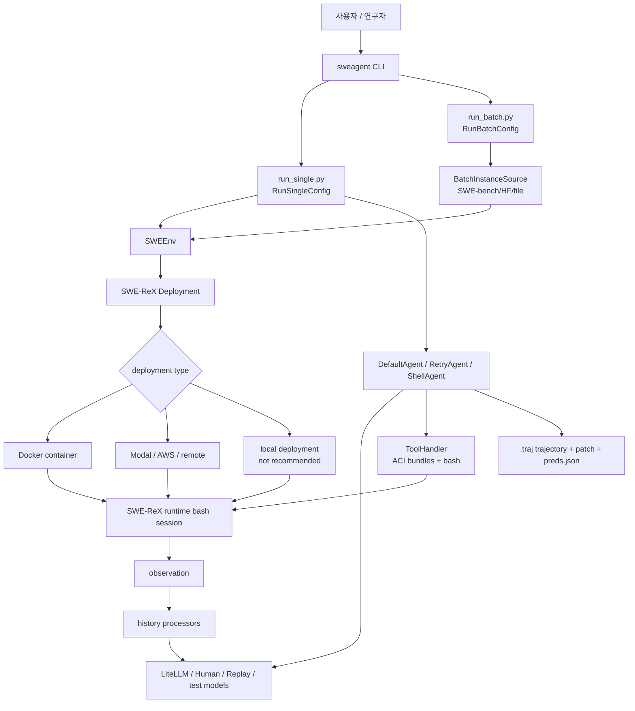
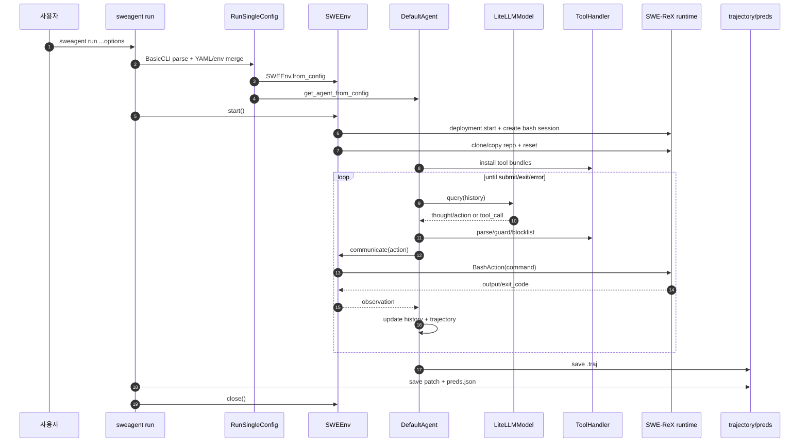
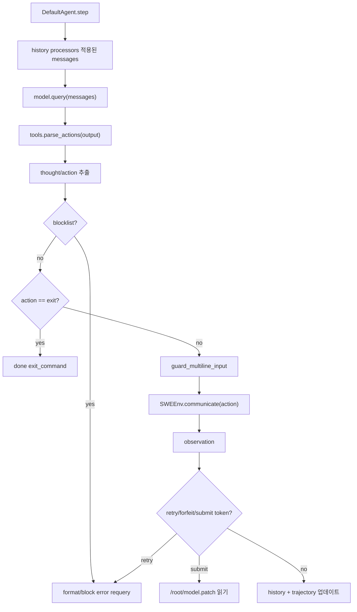
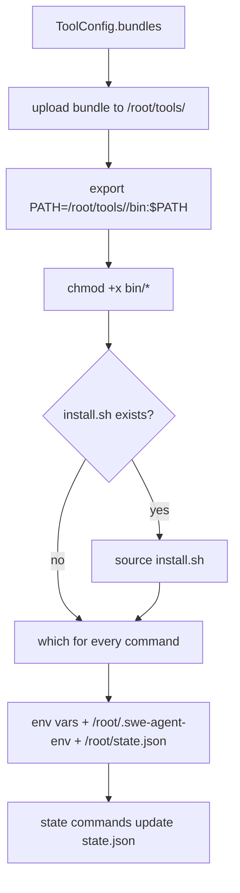
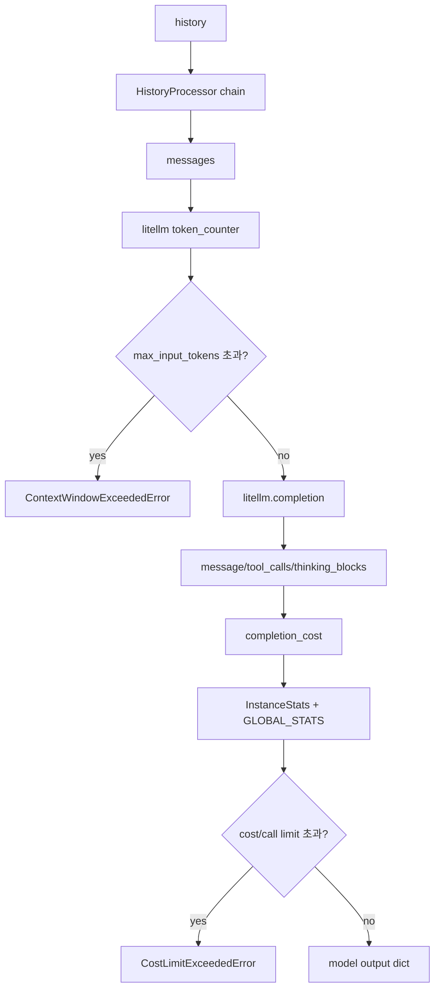
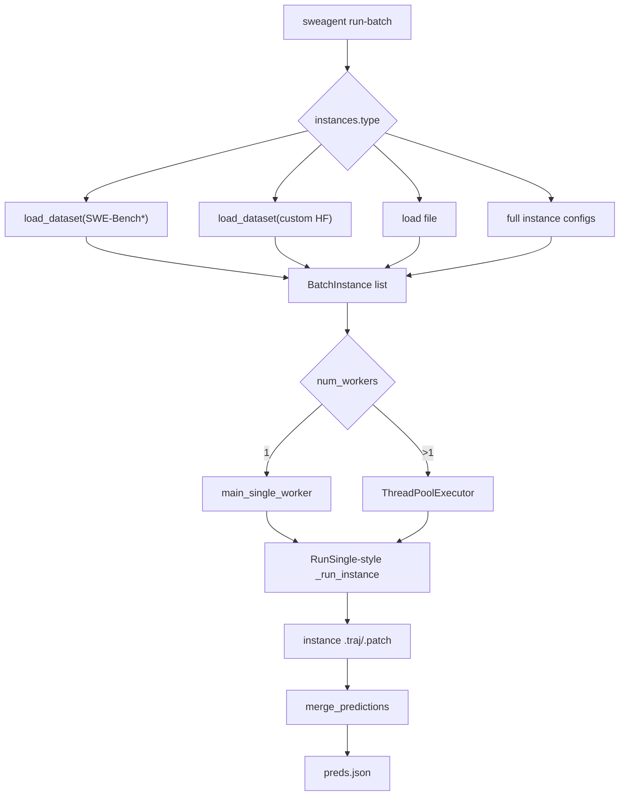

# SWE-agent/SWE-agent 상세 분석 보고서

## 1. 기본 평가

- 대상: `https://github.com/SWE-agent/SWE-agent`
- 로컬 소스: `sources/SWE-agent__SWE-agent`
- 분석 기준 커밋: `a3d018f` (`a3d018f Chore(deps): Bump codecov/codecov-action from 6.0.1 to 7.0.0`)
- 기준 브랜치: `main`
- 마지막 커밋 시각: 2026-06-09
- 최신 릴리스: `v1.1.0`, 2025-05-22
- 생성일: 2024-04-02
- 주 언어: Python
- 라이선스: MIT
- GitHub 지표: stars 19,475, forks 2,125, watchers 110
- 공식 설명: “SWE-agent takes a GitHub issue and tries to automatically fix it, using your LM of choice. It can also be employed for offensive cybersecurity or competitive coding challenges. [NeurIPS 2024]”

`SWE-agent/SWE-agent`는 제품형 IDE/CLI assistant라기보다 연구용 software engineering agent harness다. 주요 목표는 “GitHub issue 또는 SWE-bench instance를 받아 sandbox 환경에서 모델이 도구를 사용해 patch를 만들고, trajectory/prediction/evaluation을 남기는 것”이다.

README는 2026-06-10 기준 매우 중요한 경고를 포함한다. 현재 개발 노력 대부분은 `mini-swe-agent`로 이동했고, 일반 사용자는 mini-SWE-agent를 권장한다고 명시한다. 따라서 이 레포는 “현행 최우선 제품”이 아니라 NeurIPS 2024 SWE-agent 논문과 SWE-bench 연구 흐름의 원본/대형 harness로 보는 것이 정확하다.

강점은 다음이다.

1. SWE-bench 연구 생태계에 맞춘 실행/배치/trajectory 인프라가 잘 갖춰져 있다.
2. ACI, 즉 Agent-Computer Interface를 명확한 설계 철학으로 삼는다.
3. config 하나로 model, prompt template, tool bundle, environment, problem source를 바꿀 수 있다.
4. Docker/SWE-ReX 기반 sandbox 실행, GitHub issue, local repo, Hugging Face/SWE-bench batch source, replay, inspector가 결합되어 있다.

한계도 명확하다.

1. README가 mini-SWE-agent로의 이동을 공식 권장한다.
2. Python package import 단계부터 `swe-rex` 의존성이 필수다.
3. 기본적으로 모델 API key, Docker 또는 remote deployment가 필요하다.
4. agent에게 bash tool이 열려 있고, config에 따라 local deployment나 PR 생성 같은 실제 side effect가 가능하다.
5. CLI help에는 `run-api`가 남아 있으나 현재 checkout에는 `sweagent/api` package가 보이지 않는다.

## 2. 철학: Agent-Computer Interface

SWE-agent의 중심 철학은 ACI다. 문서 `docs/background/aci.md`는 ACI를 “agent가 컴퓨터 기반 환경과 상호작용하기 위한 도구와 interaction format”이라고 설명한다.

핵심은 단순히 LLM에게 shell을 던져주는 것이 아니라, software engineering에 맞춘 컴퓨터 인터페이스를 설계한다는 점이다.

문서에서 강조하는 ACI 요소는 다음이다.

1. edit command에 linter를 붙여 syntactically invalid edit가 들어가지 않게 한다.
2. `cat` 대신 특수 file viewer를 제공한다.
3. file viewer는 한 turn에 100줄 정도만 보여주는 식으로 context를 절제한다.
4. full-directory search는 너무 많은 context를 주지 않고 “매치가 있는 파일 목록”처럼 간결하게 설계한다.
5. 출력이 빈 command는 “성공했지만 output이 없음”이라고 명시해 모델의 혼동을 줄인다.

이 철학은 OpenHands/Cline류의 “풍부한 tool UI”와 다르게 연구적으로 정제된 command-line interface에 가깝다. 모델이 직접 bash와 custom command를 호출하되, command vocabulary와 observation 형식을 사람이 설계해 agent 성능을 끌어올린다.

## 3. 전체 아키텍처

공식 architecture 문서는 다음 흐름을 설명한다.

- `sweagent` CLI가 entrypoint다.
- `SWEEnv`가 environment를 관리한다.
- SWE-agent 1.0부터 `SWEEnv`는 `SWE-ReX` package 위의 thin wrapper다.
- SWE-ReX deployment는 local Docker container 또는 Modal/AWS 같은 remote system을 시작한다.
- container 안에서 shell session이 시작된다.
- custom ACI tools가 shell session에 설치된다.
- `Agent`는 YAML config를 받아 `forward()`로 모델을 호출하고 action을 실행한다.
- HistoryProcessor가 history를 압축/가공한다.
- parser가 model output에서 action을 추출한다.
- action은 `SWEEnv`를 통해 shell session에서 실행된다.



## 4. CLI 표면

진입점은 `sweagent/run/run.py`다. `pyproject.toml`은 console script를 다음처럼 선언한다.

```toml
[project.scripts]
sweagent = "sweagent.run.run:main"
```

CLI subcommand는 다음이다.

| 명령 | 역할 |
| --- | --- |
| `run`, `r` | 단일 problem statement/GitHub issue 실행 |
| `run-batch`, `b` | SWE-bench/Hugging Face/file batch 실행 |
| `run-replay` | trajectory/demo replay |
| `traj-to-demo` | trajectory를 demonstration으로 변환 |
| `merge-preds` | 여러 prediction 파일 병합 |
| `inspect`, `i` | terminal trajectory viewer |
| `inspector`, `I` | web trajectory viewer |
| `extract-pred` | trajectory에서 prediction 추출 |
| `compare-runs`, `cr` | run 비교 |
| `remove-unfinished`, `ru` | unfinished trajectory 제거 |
| `quick-stats`, `qs` | trajectory directory 통계 |
| `shell`, `sh` | SWE-agent shell |
| `run-api` | GUI backend용으로 보이나 현재 checkout에 `sweagent/api` package 없음 |

`run.py`는 import 비용을 줄이기 위해 command별 구현 모듈을 지연 import한다. 이 구조는 CLI startup을 빠르게 하지만, 존재하지 않는 optional command가 help에 남아 있어도 실행 전까지 발견되지 않는 문제가 있다.

## 5. 단일 실행 플로우

단일 실행은 `sweagent/run/run_single.py`의 `RunSingle`이 담당한다.

사용 예:

```bash
sweagent run \
  --config config/default.yaml \
  --agent.model.name gpt-4o \
  --agent.model.per_instance_cost_limit 2.00 \
  --env.repo.github_url=https://github.com/SWE-agent/test-repo \
  --problem_statement.github_url=https://github.com/SWE-agent/test-repo/issues/1
```

동작 단계:

1. `BasicCLI`가 pydantic settings 기반 config를 만든다.
2. `.env`를 읽어 환경변수를 로드한다.
3. output directory를 `trajectories/<user>/<config>__<model>___<problem_id>`로 만든다.
4. `get_agent_from_config()`로 agent를 만든다.
5. `SWEEnv.from_config()`로 environment를 만든다.
6. `SaveApplyPatchHook`와 optional `OpenPRHook`를 붙인다.
7. `env.start()`로 deployment/container/shell을 시작한다.
8. `agent.run()`이 action-observation loop를 돈다.
9. patch를 저장하고 `preds.json`에 prediction을 남긴다.
10. `env.close()`로 deployment를 종료한다.



## 6. Environment와 SWE-ReX

`sweagent/environment/swe_env.py`의 `SWEEnv`는 environment wrapper다. 자체 container runtime을 직접 구현하지 않고 `swe-rex`에 위임한다.

`EnvironmentConfig` 기본값:

- deployment: `DockerDeploymentConfig(image="python:3.11", python_standalone_dir="/root")`
- repo: optional
- post_startup_commands: optional list
- post_startup_command_timeout: 500초

`SWEEnv.start()`는 다음을 수행한다.

1. `_init_deployment()`
   - `deployment.start()`
   - `runtime.create_session(CreateBashSessionRequest(startup_source=["/root/.bashrc"]))`
   - `LANG`, `LC_ALL`, `PIP_PROGRESS_BAR`, `PAGER` 설정
2. `reset()`
   - `cd /`
   - repo copy/clone
   - git reset/checkout/clean
   - env hooks 호출
3. post startup commands 실행

repo reset은 다음 command를 기본으로 한다.

```bash
git fetch
git status
git restore .
git reset --hard
git checkout <base_commit>
git clean -fdq
```

repo source는 다음을 지원한다.

| RepoConfig | 동작 |
| --- | --- |
| `LocalRepoConfig` | local git repo를 deployment로 upload, dirty repo면 오류 |
| `GithubRepoConfig` | GitHub URL을 container 안에서 shallow fetch/checkout |
| `PreExistingRepoConfig` | deployment root에 이미 있는 repo 사용 |
| `SWESmithRepoConfig` | SWE-Smith private/mirror repo 처리 |

GitHub clone에서 `GITHUB_TOKEN`이 있으면 URL에 token을 넣는다. 이 값이 command/log에 노출될 수 있는지 deployment/runtime log policy를 확인해야 한다.

## 7. Agent 구조

`sweagent/agent/agents.py`가 agent loop를 구현한다.

지원 agent config:

| 타입 | 클래스 | 역할 |
| --- | --- | --- |
| `default` | `DefaultAgent` | 기본 action-observation loop |
| `retry` | `RetryAgent` | 여러 attempt를 돌리고 reviewer/chooser로 best 선택 |
| `shell` | `ShellAgent` | shell-oriented special agent |

`DefaultAgent.setup()`은 다음을 수행한다.

1. tool bundle 설치
2. env variables 설정
3. problem statement를 env에 `PROBLEM_STATEMENT`로 주입
4. system template을 history에 추가
5. demonstration을 history에 추가
6. instance template을 history에 추가

`DefaultAgent.step()`은 다음 wrapper다.

1. `forward_with_handling(self.messages)`
2. `add_step_to_history(step_output)`
3. `info["submission"]`, `info["exit_status"]`, edited file context, model stats 업데이트
4. `add_step_to_trajectory(step_output)`
5. hooks 호출

`forward()`는 순수한 model/action 실행이다.



## 8. Error handling과 autosubmission

SWE-agent는 실행 중 오류를 “모델에게 다시 고치라고 묻는 오류”와 “루프 종료 후 autosubmit 시도”로 나눈다.

재질문하는 오류:

- format error
- blocked action
- content policy violation
- bash syntax error
- tool이 출력한 retry token

종료/autosubmission 오류:

- forfeit token
- total execution time exceeded
- 여러 consecutive command timeout
- context window exceeded
- cost limit
- API retry error
- SWE-ReX environment error
- runtime/unknown error

autosubmission은 마지막 환경 상태에서 patch를 추출하려 한다.

- runtime이 살아 있으면 `git add -A && git diff --cached > /root/model.patch`
- runtime이 죽었으면 마지막 trajectory step의 `diff` state를 fallback으로 사용
- `/root/model.patch`가 있으면 submission으로 읽는다

이 설계는 benchmark에서는 유용하다. agent가 중간에 실패해도 partial patch를 회수할 수 있기 때문이다. 반면 실제 repo에서는 실패 상태의 patch가 “promising”해 보일 수도 있으므로 사람이 반드시 확인해야 한다.

## 9. ToolHandler와 ACI tool bundle

`sweagent/tools/tools.py`의 `ToolConfig`와 `ToolHandler`가 agent 도구를 관리한다.

기본 설정:

- `enable_bash_tool: true`
- `parse_function: FunctionCallingParser`
- `execution_timeout: 30`
- `install_timeout: 300`
- `total_execution_timeout: 1800`
- `max_consecutive_execution_timeouts: 3`
- env variables: `PAGER=cat`, `GIT_PAGER=cat`, `TQDM_DISABLE=1` 등

blocklist:

- prefix block: `vim`, `vi`, `emacs`, `nano`, `nohup`, `gdb`, `less`, `tail -f`, `python -m venv`, `make`
- standalone block: `python`, `python3`, `ipython`, `bash`, `sh`, `/bin/bash`, `/bin/sh`, `su` 등
- `radare2`, `r2`는 `-c`가 없으면 block

중요한 점은 이 blocklist가 “sandbox 안에서 agent가 interactive/hanging command를 쓰지 못하게 하는 UX/안정성 장치”에 가깝다는 것이다. security sandbox는 SWE-ReX deployment/Docker가 담당한다.

Tool bundle은 `tools/*/config.yaml`과 `bin/*`으로 구성된다.

| bundle | 주요 도구 |
| --- | --- |
| `registry` | `/root/.swe-agent-env`, `/root/state.json` registry helper |
| `edit_anthropic` | `str_replace_editor`, Anthropic-style edit/view/create/undo |
| `windowed` | `open`, `goto`, `scroll_up/down`, `create` |
| `windowed_edit_linting` | line range edit with linting |
| `windowed_edit_replace` | search/replace/insert |
| `windowed_edit_rewrite` | current window rewrite |
| `search` | `find_file`, `search_dir`, `search_file` |
| `filemap` | Python file summary |
| `diff_state` | diff state command |
| `submit`, `review_on_submit_m` | patch submission |
| `image_tools` | `view_image` |
| `web_browser` | browser open/click/type/screenshot/JS execution |
| `forfeit` | `exit_forfeit` |
| `multilingual_setup` | multilingual support setup |

도구 설치 흐름:



## 10. Parser와 function calling

Command는 `sweagent/tools/commands.py`에 정의된다. 각 command는 name, signature, docstring, arguments, optional end marker를 가진다. Function calling mode에서는 command가 OpenAI-style tool schema로 변환된다.

기본 `bash` command:

```text
name: bash
signature: <command>
docstring: runs the given command directly in bash
argument: command string
```

멀티라인 command는 `end_name`을 가진다. `ToolHandler.guard_multiline_input()`은 action을 heredoc 형태로 바꿔 shell에 안전하게 전달하려 한다. 예를 들어 line range edit tool은 `end_of_edit`로 종료된다.

지원 parser:

- function calling parser
- JSON parser
- thought/action parser
- action-only parser

HumanModel일 때는 parser가 action-only로 바뀌고, HumanThoughtModel은 thought/action 입력을 분리한다.

## 11. Model layer

`sweagent/agent/models.py`가 모델 abstraction을 담당한다.

지원 모델:

| 모델 | 역할 |
| --- | --- |
| `LiteLLMModel` | 일반 API 모델. `litellm.completion` 사용 |
| `HumanModel` | 사람이 직접 action 입력 |
| `HumanThoughtModel` | 사람이 thought와 action을 분리 입력 |
| `ReplayModel` | trajectory/replay action 재실행 |
| `InstantEmptySubmitTestModel` | 테스트용 즉시 빈 제출 |
| `PredeterminedTestModel` | 테스트용 정해진 output |

LiteLLMModel 특징:

- model name, api_base, api_version, api_key, fallbacks, retry 설정
- `api_key`는 `$ENV_VAR` 참조 가능
- 여러 key를 `:::`로 나누고 thread 이름 기준으로 key를 고정 선택
- input token count를 계산해 max input tokens 초과 시 context error
- function calling tool schema를 LiteLLM completion에 전달
- Anthropic provider에는 `max_tokens`를 명시
- User-Agent `swe-agent/<version>` 추가
- cost calculator로 instance/global cost 추적
- cost limit/call limit 초과 시 예외



## 12. Batch/SWE-bench 플로우

`run-batch`는 `sweagent/run/run_batch.py`와 `batch_instances.py`가 담당한다.

지원 instance source:

| source | 설명 |
| --- | --- |
| `swe_bench` | `princeton-nlp/SWE-Bench`, Lite, Verified, Full, Multimodal, Multilingual |
| `huggingface` | 임의 Hugging Face dataset |
| `file` | simple JSON/YAML/JSONL file |
| `expert_file` | Environment + ProblemStatement 완전 config file |
| `swesmith` | SWE-Smith instances |

Batch 흐름:

1. config를 읽고 instances를 로드한다.
2. output dir에 `run_batch.config.yaml`, `run_batch.log`를 만든다.
3. `num_workers`가 1이면 sequential, 2 이상이면 ThreadPoolExecutor.
4. 각 instance마다 environment/agent를 deep copy하고 run한다.
5. instance별 trajectory와 patch를 저장한다.
6. 끝나면 `merge_predictions()`로 `preds.json`을 만든다.
7. SWE-bench evaluate가 켜져 있으면 `sb-cli` 평가 hook을 붙인다.



## 13. RetryAgent와 reviewer loop

`RetryAgent`는 여러 attempt를 수행하고 reviewer/chooser로 best attempt를 고른다.

구성:

- 여러 `DefaultAgentConfig`
- `ScoreRetryLoop` 또는 `ChooserRetryLoop`
- cost limit
- max attempts
- reviewer model 또는 chooser model

동작:

1. attempt 0을 실행한다.
2. submit이 나오면 reviewer/chooser에 넘긴다.
3. retry 조건이 true면 environment를 hard reset한다.
4. 다음 agent config로 다시 시도한다.
5. 마지막에 best attempt를 trajectory top-level로 선택한다.

이 구조는 benchmark 성능을 높이기 위한 연구적 장치다. 같은 문제를 여러 번 풀고 별도 모델로 품질을 평가하는 방식이다.

## 14. Output, trajectory, prediction

SWE-agent는 작업의 재현성과 분석을 위해 산출물을 많이 남긴다.

| 산출물 | 설명 |
| --- | --- |
| `.traj` | history, trajectory, info, model stats, replay config |
| `.patch` | agent가 제출한 model patch |
| `preds.json` | benchmark/evaluation용 prediction |
| `*.trace/debug/info.log` | instance별 로그 |
| `run_batch.log` | batch 전체 로그 |
| `run_batch_exit_statuses.yaml` | batch status summary |

trajectory step에는 action, observation, response, thought, execution_time, state, query, extra_info가 저장된다. 이는 연구/디버깅에는 매우 유용하지만, prompt, issue text, repository snippets, command output, API/model stats가 담길 수 있으므로 민감한 repo에서 공유하면 안 된다.

## 15. GitHub PR/Open action

`RunSingleActionConfig`에는 실제 action 옵션이 있다.

- `open_pr`
- `apply_patch_locally`

`SaveApplyPatchHook`는 patch를 저장하고, local repo 실행에서 `apply_patch_locally`가 켜져 있으며 promising patch로 판단되면 `git apply`를 local repo에 수행한다.

`OpenPRHook`는 다음 조건에서 GitHub PR을 만든다.

- submission 있음
- exit_status가 `submitted`
- GitHub issue URL임
- issue open 상태
- issue가 assignee 없음
- issue가 locked 아님
- issue에 관련 commit이 없거나 skip config가 false

실제 PR 생성은 container 안에서 commit/push를 하고, `ghapi`로 draft PR을 만든다. 이는 연구용 benchmark보다 실제 repo 자동화에 가까운 기능이라 별도 권한 검토가 필요하다.

## 16. 차별점

SWE-agent의 차별점은 다음이다.

1. ACI를 논문/시스템의 중심으로 둔다.
   - tool design과 observation format을 성능 변수로 다룬다.

2. trajectory가 first-class artifact다.
   - 실행 결과만이 아니라 모델 입력, action, observation, state, replay config를 남긴다.

3. SWE-bench batch/evaluation에 최적화되어 있다.
   - dataset source, prediction merge, optional sb-cli evaluation, per-instance logs가 있다.

4. 환경 실행을 SWE-ReX로 분리했다.
   - Docker/local/remote deployment를 외부 package abstraction에 맡긴다.

5. config가 모든 것을 지배한다.
   - YAML 한 파일에서 prompt, parser, model, tools, environment, history processor를 바꾼다.

6. retry/reviewer loop가 내장되어 있다.
   - 여러 attempt를 평가해 best patch를 고르는 연구용 구성이 가능하다.

## 17. 위험요소와 이상한 점

### 17.1 개발 초점이 mini-SWE-agent로 이동

README는 현재 개발 대부분이 `mini-swe-agent`에 있고, 새 사용자는 mini-SWE-agent를 권장한다고 말한다. 이 레포를 새 제품 기반으로 삼으려면 유지보수 우선순위와 future compatibility를 확인해야 한다.

### 17.2 `run-api` 표면과 실제 패키지 불일치

`run.py` help와 command dispatch에는 `run-api`가 있고 `sweagent.api.server`를 import한다. 그러나 현재 checkout에는 `sweagent/api` package가 없다. 배포에서 제외된 기능, 문서 잔재, 또는 refactor 누락일 수 있다.

### 17.3 sandbox는 Docker/SWE-ReX 설정에 의존

agent action은 기본적으로 bash command다. 안전성은 SWE-ReX deployment, Docker isolation, remote deployment policy에 달려 있다. local deployment는 문서도 권장하지 않는다고 한다.

### 17.4 blocklist는 보안 경계가 아니다

`vim`, `python`, `bash`, `make` 등은 막지만, shell에는 우회 가능한 표현이 많다. blocklist는 interactive/hanging command를 줄이는 UX 장치이지 악성 prompt 방어 장치가 아니다.

### 17.5 환경 변수/API key 노출

`ToolConfig.propagate_env_variables` 문서가 직접 “debug log에서 API key가 읽힐 수 있으니 조심하라”고 경고한다. trajectory/log에도 command와 output이 남으므로 비밀정보 처리에 주의해야 한다.

### 17.6 GitHub token URL 삽입

`GithubRepoConfig._get_url_with_token()`은 token을 HTTPS URL에 삽입한다. command string이 runtime/log에 남으면 token이 노출될 수 있다.

### 17.7 OpenPRHook의 실제 side effect

`open_pr`는 container 안에서 branch/commit/push를 하고 GitHub draft PR을 만든다. token scope가 넓고 repo가 사용자 소유가 아니면 정책적 문제가 생길 수 있다.

### 17.8 trajectory 민감도

trajectory에는 prompt, problem statement, model response, command output, file context, edited file snippets가 저장된다. 연구 공유에는 유용하지만 private repo/secret-containing issue에는 위험하다.

### 17.9 web_browser tool의 공격 표면

multimodal/browser tasks를 위해 Playwright-like browser tool bundle이 있다. `execute_script_on_page`, click/type/screenshot, local file open이 가능하므로 사용 config에 포함하면 웹 자동화 공격 표면이 생긴다.

### 17.10 autosubmission의 품질 리스크

환경 오류/timeout/context/cost 초과에서도 patch를 autosubmit하려 한다. benchmark artifact 회수에는 좋지만 실제 적용을 자동화하면 불완전한 patch가 저장/적용될 수 있다.

## 18. 숨겨진/잘 보이지 않는 표면

| 표면 | 설명 |
| --- | --- |
| `tools/*/bin/*` | agent가 container에 설치해 실행하는 실제 shell/python 도구 |
| `tools/*/install.sh` | tool bundle 설치 script |
| `config/benchmarks/*.yaml` | benchmark별 prompt/model/tool 조합 |
| `config/sweagent_0_7/*.yaml` | 이전 버전 compatibility config |
| `.env.example` / `env_var_path` | API key/env 로딩 |
| `trajectories/` | 민감할 수 있는 실행 기록 |
| `OpenPRHook` | GitHub write action |
| `SaveApplyPatchHook(apply_patch_locally)` | local repo patch 적용 |
| `SWE_AGENT_CONFIG_DIR`, `SWE_AGENT_TOOLS_DIR`, `SWE_AGENT_TRAJECTORY_DIR` | config/tool/trajectory root override |
| `run-api` import path | 현재 소스에 없는 command |

## 19. 실행 검증

현재 워크스페이스에서 수행한 검증:

- `python3 --version`: `Python 3.12.4`
- `.venv`: 없음
- 핵심 파일 `py_compile`: 통과
  - `sweagent/run/run.py`
  - `sweagent/run/run_single.py`
  - `sweagent/agent/agents.py`
  - `sweagent/environment/swe_env.py`
  - `sweagent/tools/tools.py`
  - `sweagent/agent/models.py`
- `PYTHONPATH=sources/SWE-agent__SWE-agent python3 -m sweagent --help`: 실패
  - 원인: `ModuleNotFoundError: No module named 'swerex'`
- 직접 import도 `sweagent/__init__.py` 단계에서 `swe-rex` 의존성 때문에 실패

따라서 end-to-end run은 수행하지 않았다. 실제 실행에는 최소한 다음이 필요하다.

- Python 3.11+
- `pip install -e .` 또는 패키지 의존성 설치
- `swe-rex>=1.4.0`
- Docker 또는 remote deployment 설정
- model API key
- optional: GitHub token, Hugging Face dataset 접근, sb-cli

## 20. 종합 결론

SWE-agent는 “코딩 에이전트 제품”이라기보다 software engineering agent 연구를 위한 실행 프레임워크다. GitHub issue/SWE-bench instance를 containerized environment에 넣고, 모델에게 잘 설계된 ACI 도구를 제공하며, action-observation trajectory와 patch를 재현 가능하게 남기는 데 초점이 있다.

가장 중요한 설계 가치는 ACI다. 파일 viewer/editor/search/linting/submission command를 통해 모델이 소프트웨어 작업을 덜 혼란스럽게 수행하도록 인터페이스를 설계한다.

다만 2026년 현재 README가 mini-SWE-agent를 권장한다는 점은 큰 판단 요소다. 새 프로젝트에 가져다 쓸 때는 이 레포를 “풍부하고 연구 친화적인 원본 harness”로 보고, 운영용 단순 CLI를 원하면 mini-SWE-agent 또는 다른 현행 agent를 함께 비교하는 것이 맞다.

