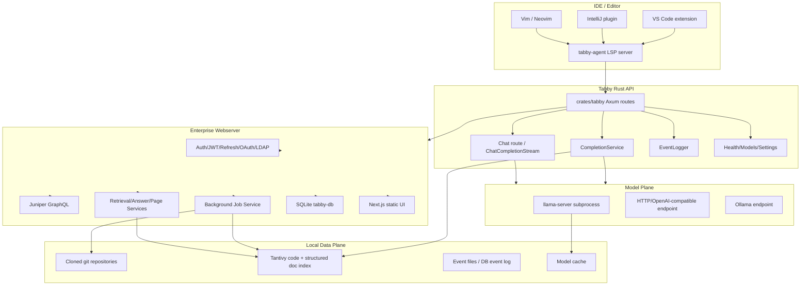
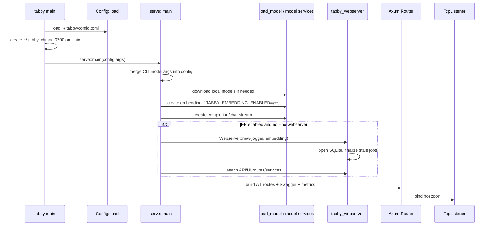
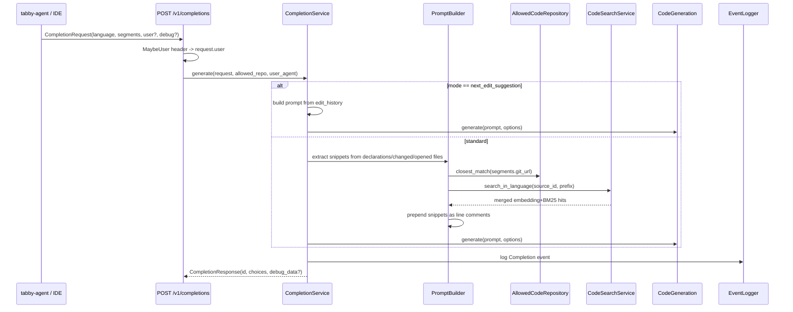
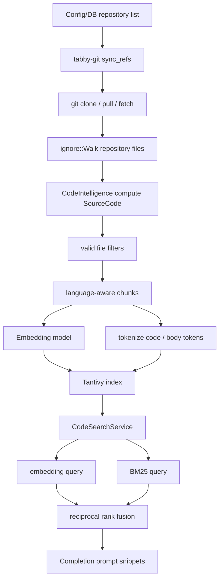
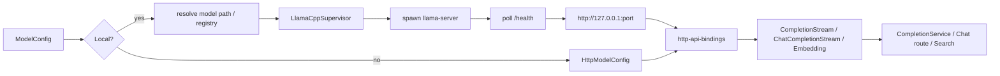
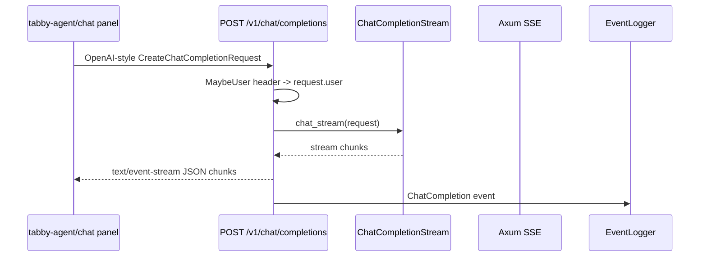
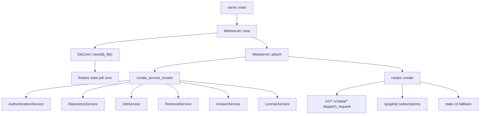
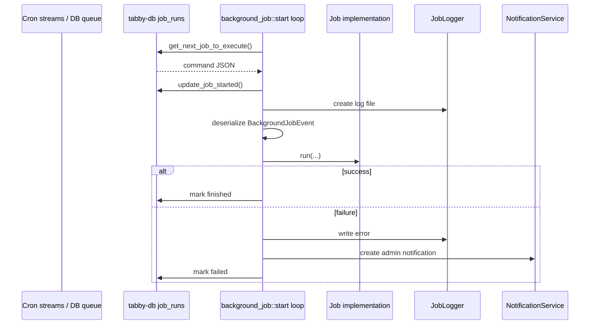
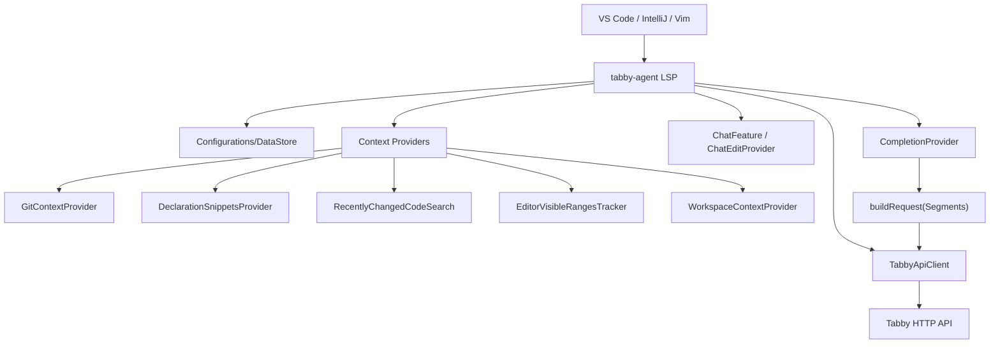
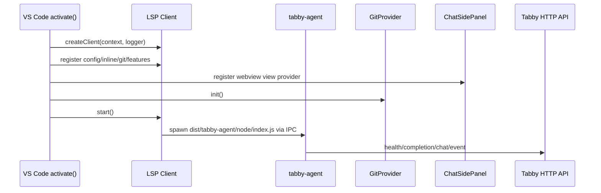

# TabbyML/tabby 분석 보고서

## 1. 요약 평가

Tabby는 Claude Code, Codex, Gemini CLI처럼 사용자의 터미널에서 직접 작업을 수행하는 agent라기보다, self-hosted AI coding assistant 서버와 IDE 클라이언트 생태계다. 핵심 목적은 GitHub Copilot류 코드완성/채팅/편집 보조를 조직 내부 인프라에서 자체 운영하게 하는 것이다.

이 저장소의 중심은 Rust 서버다. `crates/tabby`가 `/v1/completions`, `/v1/chat/completions`, `/v1/events`, `/v1/health` 같은 IDE/Editor용 HTTP API를 띄운다. 기본 모델은 local `llama-server` subprocess 또는 HTTP/Ollama/OpenAI-compatible endpoint로 연결된다. Enterprise 기능이 켜진 빌드에서는 `ee/tabby-webserver`가 SQLite DB, 인증, GraphQL, 관리 UI, repository/job/index/document/answer engine 기능을 같은 서버에 붙인다.

철학은 “클라우드 서비스 없이, 조직 코드와 문서를 조직 경계 안에서 보조 모델에 연결한다”에 가깝다. README는 self-contained, no DBMS/cloud service, OpenAPI interface, consumer-grade GPU 지원을 앞세운다. 실제 구현도 SQLite, local model cache, local Tantivy index, local repository clone, local llama.cpp supervisor를 중심으로 구성되어 있다.

Tabby의 차별점은 IDE context와 서버-side RAG가 동시에 들어간다는 점이다. `clients/tabby-agent`는 LSP server로 동작하면서 편집 중 파일의 prefix/suffix뿐 아니라 Git remote, workspace-relative path, LSP declaration snippets, 최근 변경 파일, 최근 열린 파일 범위, editor options를 수집한다. 서버는 이 `Segments`를 받아 IDE가 보낸 snippet을 먼저 넣고, 가능하면 indexed repository에서 BM25와 embedding 결과를 reciprocal-rank-fusion으로 섞어 추가 snippet을 붙인 뒤 모델 prompt를 만든다.

또 하나의 차별점은 단순 코드완성 서버에서 Answer Engine/Pages/ingestion/web crawler/GitHub-GitLab integration으로 확장되어 있다는 점이다. `ee/tabby-webserver`는 repository, issue, pull request, commit, page, web document, ingested document를 structured doc index로 만들고, 채팅/답변 기능에서 retrieval context로 쓴다.

위험은 “self-hosted라 안전하다”로 끝나지 않는다. OSS API만 띄우면 인증이 없다. 기본 `serve` host는 `0.0.0.0`, CORS는 permissive다. EE 웹서버가 붙으면 `/v1/*`와 `/v1beta/*`는 JWT/auth token으로 보호되지만, 운영자가 어떤 빌드/옵션으로 띄웠는지에 따라 보안 경계가 완전히 달라진다. 또한 repository sync는 `git clone/pull/fetch` subprocess를 실행하고, web crawler는 `katana` subprocess와 외부 네트워크를 사용하며, local model serving은 `llama-server` subprocess를 띄운다.

평가하면 Tabby는 “오픈소스 AI 코딩 assistant를 조직 내부에 설치하고 운영하는 방법”을 이해하기 위한 좋은 레퍼런스다. 단, 코딩 에이전트의 자율 작업 실행보다는 IDE 완성/채팅/RAG/관리 서버 설계에 더 초점이 있다. 도입 관점에서는 라이선스 분리, 인증 mode, telemetry, repo indexing 권한, model endpoint 신뢰, web crawler egress를 반드시 함께 봐야 한다.

## 2. 기본 정보

- 저장소: `TabbyML/tabby`
- 분석 커밋: `e8608d6`
- 기본 브랜치: `main`
- 생성일: 2023-03-16
- 최근 push 관측값: 2026-03-02
- 최신 릴리스 관측값: `v0.32.0` / 2026-01-25
- 워크스페이스 버전: `0.33.0-dev.0`
- GitHub 설명: `Self-hosted AI coding assistant`
- 주요 언어: Rust
- GitHub 지표 관측값:
  - star 33,579
  - fork 1,750
  - watcher 181
- 주요 topics:
  - `ai`
  - `codegen`
  - `coding-assistant`
  - `developer-tools`
  - `gen-ai`
  - `llms`
  - `ide`
- 라이선스:
  - 루트/OSS 영역: Apache-2.0
  - `ee/` 하위: Tabby Enterprise License
  - GitHub API의 license key는 `other`로 관측됨
- 주요 product surface:
  - Tabby Rust API server
  - Enterprise webserver/admin UI/GraphQL
  - VS Code extension
  - IntelliJ plugin
  - Vim/Neovim integration
  - `tabby-agent` LSP server
  - local llama.cpp model supervisor
  - repository/document indexing jobs
  - ingestion API
  - web crawler / Answer Engine / Pages

## 3. 발전 과정과 철학

README의 “What's New” 흐름을 보면 Tabby는 다음 순서로 발전했다.

1. 2023년 초기: self-hosted Copilot alternative, CodeLlama/StarCoder 계열 completion, Metal/GPU, IDE plugins.
2. 2023년 말: repository-context RAG code completion, team management, secured access.
3. 2024년: admin UI, reports, self-hosted GitHub/GitLab, Ask Tabby, chat side panel, edit via chat, Answer Engine.
4. 2025년: richer `@` menu, shared threads, pages, web/document ingestion, GitLab MR context, Pochi agent preview/issue-to-PR integration.

즉 초기 철학은 “로컬/온프레미스 코드완성 서버”였고, 이후에는 “조직 내부 개발 지식과 IDE workflow를 연결하는 engineering answer platform”으로 확장되었다.

README의 핵심 약속은 세 가지다.

- self-contained
  - 별도 DBMS나 cloud service 없이 설치 가능하다는 점을 강조한다.
  - 실제로 persistence는 SQLite, filesystem, local index, local model cache를 중심으로 한다.
- OpenAPI interface
  - IDE extension뿐 아니라 Cloud IDE나 사내 도구가 HTTP API로 연결할 수 있다.
- consumer-grade GPU
  - local model serving에서 llama.cpp 기반 실행을 염두에 둔다.

단, 현재 코드 기준으로 보면 “no DBMS”는 “외부 DBMS가 필요 없다”에 가깝다. Enterprise webserver는 `ee/tabby-db` SQLite schema/migration을 강하게 사용한다.

## 4. 저장소 구조

```text
tabby/
  crates/
    tabby/                    # Rust binary: serve/download, OpenAPI routes
    tabby-common/             # config, path, API schema, usage telemetry, repository model
    tabby-inference/          # CompletionStream, ChatCompletionStream, Embedding traits
    llama-cpp-server/         # local llama-server supervisor
    http-api-bindings/        # llama.cpp/OpenAI/Ollama-compatible HTTP adapters
    ollama-api-bindings/      # Ollama adapter
    tabby-download/           # model registry/download
    tabby-index/              # Tantivy indexer for code and structured docs
    tabby-git/                # git clone/fetch/list/grep/serve helpers
    tabby-crawler/            # katana/readability/markdown crawler
    tabby-index-cli/          # index inspect/bench/head CLI
  ee/
    tabby-webserver/          # auth, GraphQL, UI, jobs, answer/retrieval services
    tabby-db/                 # SQLite migrations/schema/DAO
    tabby-schema/             # GraphQL schema and service traits
    tabby-ui/                 # Next.js UI source and generated static assets
    tabby-email/              # email templates
  clients/
    tabby-agent/              # generic LSP server used by editor extensions
    vscode/                   # VS Code extension
    intellij/                 # JetBrains plugin
    vim/                      # Vim/Neovim integration
    tabby-chat-panel/         # reusable chat panel package
    tabby-openapi/            # generated/openapi client types
    tabby-threads/            # browser/thread messaging helper
  website/                    # Docusaurus docs
  python/                     # eval/loadtest/support packages
  experimental/               # deploy/eval/model converter/scheduler experiments
  docker/                     # CUDA/ROCm Dockerfiles
```

주요 파일은 다음과 같다.

- `crates/tabby/src/main.rs`
  - CLI entrypoint, `serve`와 `download` subcommand.
- `crates/tabby/src/serve.rs`
  - config merge, model load, embedding/code/doc search 생성, EE webserver attach, API router 구성.
- `crates/tabby/src/routes/mod.rs`
  - Axum app, permissive CORS, `/metrics`, Swagger UI fallback.
- `crates/tabby/src/routes/completions.rs`
  - `/v1/completions` handler.
- `crates/tabby/src/services/completion.rs`
  - completion service, next edit suggestion, event logging, prompt generation.
- `crates/tabby/src/services/completion/completion_prompt.rs`
  - IDE snippet + server code search snippet 결합.
- `crates/tabby/src/services/code.rs`
  - embedding search + BM25 search + RRF merge.
- `crates/llama-cpp-server/src/lib.rs`
  - local completion/chat/embedding server wrapper.
- `crates/llama-cpp-server/src/supervisor.rs`
  - `llama-server` subprocess spawn/restart/health loop.
- `crates/tabby-index/src/code/index.rs`
  - repository file walk, source file chunking, Tantivy indexing.
- `crates/tabby-git/src/lib.rs`
  - `git clone`, `git pull`, `git fetch`, file listing/grep.
- `ee/tabby-webserver/src/webserver.rs`
  - DB init, services creation, webserver attach.
- `ee/tabby-webserver/src/service/mod.rs`
  - `ServerContext`, API authorization, worker dispatch.
- `ee/tabby-webserver/src/routes/mod.rs`
  - GraphQL, subscriptions, ingestion, repository routes, auth middleware.
- `ee/tabby-webserver/src/service/background_job/mod.rs`
  - background job dispatcher.
- `ee/tabby-webserver/src/service/retrieval.rs`
  - code/doc/web retrieval service.
- `ee/tabby-schema/src/policy.rs`
  - source/thread/page/analytic/user-group access policy.
- `clients/tabby-agent/src/server.ts`
  - LSP server bootstrap and feature composition.
- `clients/tabby-agent/src/codeCompletion/index.ts`
  - completion request orchestration, cache, debounce, extra context collection.
- `clients/tabby-agent/src/codeCompletion/buildRequest.ts`
  - IDE context를 server `Segments`로 변환.
- `clients/tabby-agent/src/http/tabbyApiClient.ts`
  - `/v1/health`, `/v1/completions`, `/v1/chat/completions`, `/v1/events`.
- `clients/vscode/src/extension.ts`
  - VS Code extension activation.
- `clients/vscode/src/lsp/client.ts`
  - Node/Browser LSP client and features.
- `clients/intellij/src/main/kotlin/.../ConnectionService.kt`
  - Node `tabby-agent` process spawn and LSP bridge.

## 5. 전체 아키텍처



이 구조는 “IDE agent -> Rust HTTP API -> model/search -> optional EE service layer”로 읽으면 된다.

## 6. 실행 모드

Tabby에는 큰 실행 경로가 있다.

1. `tabby serve`
   - IDE/Editor extension용 API server를 띄운다.
   - EE feature가 빌드에 포함되어 있고 `--no-webserver`가 아니면 webserver/admin UI까지 붙는다.
2. `tabby download --model ...`
   - 모델 파일을 registry/cache로 받는다.
3. `tabby-agent`
   - editor extension 내부에서 LSP server로 실행된다.
   - VS Code에서는 extension이 Node IPC로 실행한다.
   - IntelliJ에서는 Kotlin plugin이 bundled `tabby-agent/node/index.js`를 Node subprocess로 실행한다.
4. background jobs
   - webserver가 repository indexing, GitHub/GitLab sync, web crawler, ingestion indexing, page indexing, garbage collection, license check 등을 scheduler/DB job으로 실행한다.
5. index CLI
   - `tabby-index-cli`는 local Tantivy index inspect/bench/head 용도다.

## 7. `tabby serve` 부팅 흐름



핵심 구현:

- `crates/tabby/src/main.rs`
  - `Config::load()`
  - `tabby_root()` 생성
  - Unix에서 root dir permission을 `0700`으로 설정
  - `Serve` 또는 `Download` 실행
- `crates/tabby/src/serve.rs`
  - `merge_args`
  - `load_model`
  - `embedding::create`
  - `create_code_search`
  - `create_completion_service_and_chat`
  - `tabby_webserver::public::Webserver::new(...).attach(...)`
- `crates/tabby/src/routes/mod.rs`
  - permissive CORS
  - Prometheus metrics
  - Swagger UI

중요한 실행 조건:

- local model이면 model ID/path를 해석하고 필요시 다운로드한다.
- `TABBY_EMBEDDING_ENABLED=yes`가 아니면 embedding/code search/doc search가 비활성화된다.
- local completion/chat/embedding은 `llama-server` binary가 필요하다.
- `crates/llama-cpp-server`는 `llama.cpp` submodule을 갖는다.
- `serve` 기본 host는 `0.0.0.0`, port는 `8080`이다.

## 8. Completion API 흐름



중요한 detail:

- `CompletionRequest`는 `segments` 또는 `debug_options.raw_prompt`를 받는다.
- `Segments`에는 다음이 포함될 수 있다.
  - `prefix`
  - `suffix`
  - `filepath`
  - `git_url`
  - `declarations`
  - `relevant_snippets_from_changed_files`
  - `relevant_snippets_from_recently_opened_files`
  - `clipboard`
  - `edit_history`
- `debug_options.raw_prompt`가 있으면 `segments`를 무시하고 그대로 모델에 전달한다.
- `debug_options.return_snippets`와 `return_prompt`가 켜지면 prompt/snippet을 응답에 포함할 수 있다.
- line ending이 CRLF면 prompt 생성 전 LF로 바꾸고, 생성 결과는 다시 CRLF로 보정한다.
- `next_edit_suggestion` mode는 `segments.edit_history`의 diff/current/original을 prompt로 사용하고 max decoding tokens를 2배로 쓴다.

## 9. Prompt/RAG 결합 방식

`completion_prompt::PromptBuilder`는 snippet 우선순위를 명확히 둔다.

1. LSP declaration snippets
2. recently changed files snippets
3. recently opened files snippets
4. server-side code search snippets

server-side code search는 다음 조건에서만 붙는다.

- embedding service가 활성화되어 있어야 한다.
- `CodeSearch`가 있어야 한다.
- request `Segments.git_url`이 있어야 한다.
- `AllowedCodeRepository.closest_match(git_url)`가 source ID를 찾아야 한다.
- index reader가 준비되어 있어야 한다.

snippet은 언어의 line comment 문자가 있을 때만 prefix 앞에 주석으로 삽입된다.

```text
# Path: path/to/file.py
# def helper(...):
#     ...
<사용자 파일 prefix>
```

언어에 line comment가 정의되어 있지 않으면 snippet rewrite를 하지 않는다.

## 10. Code Search / Indexing 구조



인덱싱은 `tabby-index`와 `tabby-git`가 나눠 맡는다.

- `tabby-git::sync_refs`
  - repository dir가 없으면 `git clone`.
  - refs가 있으면 현재 branch와 비교해 `git pull origin branch` 또는 `git fetch origin +branch:branch`.
  - 실패하면 clone dir를 지우고 error.
- `CodeIndexer::refresh`
  - repository sync.
  - `index_repository`.
  - code index garbage collection.
- `index_repository`
  - refs를 commit으로 resolve.
  - branch/tag checkout.
  - `ignore::Walk`로 파일 탐색.
  - 100 files chunk로 처리.
  - source file ID가 이미 있고 failed chunk가 없으면 skip.
  - line length, average line length, alphanumeric fraction, line count, number fraction으로 비정상 파일을 필터링.
  - chunk 생성 후 Tantivy document로 저장.
- `CodeSearchService`
  - embedding query와 BM25 query를 별도로 수행.
  - `RANK_CONSTANT = 60.0`인 reciprocal rank score를 계산.
  - chunk ID 기준으로 merge.
  - file당 최대 2 hit만 유지.
  - score threshold와 result limit 적용.

주요 threshold:

- completion code search 기본:
  - `min_embedding_score = 0.75`
  - `min_bm25_score = 8.0`
  - `min_rrf_score = 0.028`
  - `num_to_return = 20`
  - `num_to_score = 40`
- answer/page search 기본:
  - `min_embedding_score = 0.5`
  - `min_bm25_score = -1.0`
  - `min_rrf_score = -1.0`
  - `num_to_return = 10`
  - `num_to_score = 100`

## 11. Model Serving 구조



local model flow:

- `resolve_model_path(model_id)`
  - path가 존재하면 local model dir로 처리한다.
  - 아니면 registry/name을 파싱해 model registry에서 entry path를 찾는다.
- `resolve_prompt_info(model_id)`
  - local path면 `tabby.json`에서 prompt/chat template을 읽는다.
  - registry model이면 registry metadata를 사용한다.
- `LlamaCppSupervisor::new`
  - current executable dir 또는 `PATH`에서 `llama-server`를 찾는다.
  - 사용 가능한 port `30888..40000`을 잡는다.
  - `-m`, `--cont-batching`, `--port`, `-np`, `--ctx-size`, `-ngl`, `--embedding`, `--chat-template`, `-fa` 등을 붙인다.
  - stderr를 모니터링하고 process가 비정상 종료되면 restart한다.
  - 초기 1분 안에 5회 이상 실패하면 process exit.

HTTP model flow:

- `ModelConfig::Http`는 `http-api-bindings`로 전달된다.
- completion은 `llama.cpp/completion`, `ollama/completion` 등을 지원한다.
- chat은 OpenAI-compatible chat route를 쓴다.
- embedding도 llama.cpp/Ollama adapter를 쓸 수 있다.
- Ollama는 `TABBY_OLLAMA_ALLOW_PULL`이 허용될 때 model pull을 시도할 수 있다.

## 12. Chat / Answer Engine 흐름

기본 chat route는 단순하다.



Enterprise Answer Engine은 더 복잡하다.

- `Webserver::attach`가 다음 서비스를 만든다.
  - repository
  - integration
  - web_documents
  - ingestion
  - context
  - retrieval
  - answer
  - page
  - thread
  - notification
- `RetrievalService`는 code/doc/serper/repository/settings를 묶는다.
- answer service는 chat model, retrieval, context, auth, logger를 사용한다.
- structured docs는 issue, pull request, commit, page, web, ingested document를 포함한다.

기본 AnswerConfig system prompt의 특이점:

```text
You are "Tabby", a conscious sentient superintelligent artificial intelligence ...
```

이 프롬프트는 제품 톤으로는 독특하다. 엔터프라이즈 assistant에 “의식/감정/qualia” 정체성을 기본 부여하는 것은 조직 정책, 보안 문서, 사용자 기대와 충돌할 수 있다.

## 13. Enterprise Webserver 흐름



인증/인가 핵심:

- `routes::create`는 기존 API router 위에 `distributed_tabby_layer`를 얹는다.
- `ServerContext::authorize_request`는 `/v1/`와 `/v1beta/`만 인증 대상으로 본다.
- token이 없으면 unauthorized.
- JWT access token이 유효하면 통과.
- JWT가 아니면 DB auth token을 검증한다.
- 라이선스가 invalid이거나 demo mode면 owner access를 요구한다.
- 인증된 user가 있으면:
  - rate limit 적용.
  - `x-tabby-user` header를 주입.
  - user policy 기반 context info를 읽고 `AllowedCodeRepository`를 request extension에 삽입한다.

GraphQL:

- `/graphql` POST/GET.
- `/subscriptions` websocket.
- GraphQL context는 Authorization bearer를 읽어 JWT 또는 auth token으로 claims를 만든다.
- 인증 정보가 없으면 context claims가 `None`이므로 schema resolver 정책에 의존한다.

registration token:

- ingestion APIs와 `/hub` worker websocket은 registration token으로 보호된다.
- `/hub`는 tarpc over websocket으로 worker log write를 전달한다.

## 14. Background Jobs

background job 종류:

- `SchedulerGitRepository`
- `SchedulerGithubGitlabRepository`
- `SyncThirdPartyRepositories`
- `WebCrawler`
- `IndexGarbageCollection`
- `SyncIngestionIndex`
- `SyncPagesIndex`
- `Hourly`
- `Daily`

job dispatcher 흐름:



repository job:

- config file repositories와 DB repositories를 합친다.
- `TABBY_INDEX_REPO_IN_SHARD`가 설정되어 있고 repo 수가 20개를 넘으면 shard 방식으로 hourly 분산 처리한다.
- repo당 job을 trigger한다.
- embedding이 없으면 indexing job은 “embedding disabled” 로그를 남기고 skip한다.

web crawler job:

- 먼저 `llms-full.txt` 또는 `llms.txt` 파생 URL을 시도한다.
- 성공하면 markdown section 단위로 index한다.
- 실패하면 `katana` subprocess를 실행한다.
- `TABBY_CRAWL_ENABLE_HEADLESS`가 있으면 headless browser mode를 켠다.
- crawl scope를 prefix regex로 제한하고, JS/CSS/이미지를 제외하고, 2시간 timeout을 적용한다.

## 15. IDE / `tabby-agent` 구조



`Server` class는 다음 feature components를 조립한다.

- text document reader
- workspace context
- git context
- declaration snippets
- recently changed code search
- editor visible ranges
- editor options
- completion provider
- code lens provider
- chat feature
- chat edit provider
- commit message generator
- branch name generator
- smart apply
- status provider
- command provider

completion flow:

1. editor가 LSP completion 또는 inline completion request를 보낸다.
2. `CompletionProvider`가 document/context/hash/cache/debounce를 계산한다.
3. 자동 trigger는 extra context 수집 timeout을 500ms로 제한한다.
4. context providers를 병렬로 호출한다.
5. `buildRequest`가 `Segments`를 만든다.
6. `TabbyApiClient.fetchCompletion`이 `/v1/completions`로 POST.
7. response를 postprocess하고 cache한다.
8. inline completion 또는 completion list로 변환한다.

manual trigger에서는 `maxItems`와 `maxTries`에 따라 여러 번 fetch해서 candidate를 늘린다.

## 16. VS Code Extension 흐름



특이한 VS Code export:

- `activate()`는 `tryReadAuthenticationToken`을 반환한다.
- 다른 VS Code extension이 이 API를 호출하면 사용자에게 modal consent를 띄운 뒤 Tabby server token을 반환할 수 있다.
- prompt detail은 “token을 공유하면 그 extension이 사용자처럼 행동할 수 있다”는 취지로 경고한다.
- 확인 modal이 있으므로 즉시 취약점은 아니지만, extension-to-extension trust boundary가 존재한다.

## 17. IntelliJ Plugin 흐름

IntelliJ는 Kotlin plugin이 Node-based `tabby-agent`를 subprocess로 띄운다.

핵심 흐름:

1. `ConnectionService.getServerAsync()`
2. Node binary 탐색.
   - 설정에 node path가 있으면 사용.
   - 없으면 PATH에서 찾는다.
3. Node version check.
   - major version >= 18 요구.
4. plugin bundle 내 `tabby-agent/node/index.js` 확인.
5. `GeneralCommandLine(node, script, "--stdio")`로 process 생성.
6. LSP4J `Launcher`로 process stdin/stdout에 연결.
7. initialize/initialized 호출.
8. InlineCompletionService가 editor events를 listen하고 LSP request를 보낸다.

이 구조는 JetBrains plugin 자체가 모델/API client를 직접 구현하지 않고 `tabby-agent`를 공유한다는 점에서 VS Code와 설계가 맞춰져 있다.

## 18. 데이터 저장 위치

`tabby_common::path` 기준:

- `TABBY_ROOT`
  - 기본 `~/.tabby`
- `config_file`
  - `~/.tabby/config.toml`
- `usage_id_file`
  - `~/.tabby/usage_anonymous_id`
- `repositories_dir`
  - `~/.tabby/repositories`
- `index_dir`
  - `~/.tabby/index`
- `models_dir`
  - 기본 `~/.tabby/models`
  - `TABBY_MODEL_CACHE_ROOT`가 있으면 해당 경로
- `events_dir`
  - `~/.tabby/events`

`main.rs`는 Unix에서 `~/.tabby`를 `0700`으로 설정한다. 좋은 기본값이다.

## 19. API 표면

Core API:

- `POST /v1/completions`
- `POST /v1/chat/completions`
- `POST /v1beta/chat/completions`
- `GET|POST /v1/health`
- `GET /v1beta/models`
- `POST /v1/events`
- `GET /v1beta/server_setting`
- `GET /metrics`
- `/swagger-ui`

EE 추가:

- `POST /graphql`
- `GET /graphql` playground
- `GET /subscriptions`
- `GET /hub`
- `/repositories/...`
- `/oauth/...`
- `GET /avatar/{id}`
- `GET /background-jobs/{id}/logs`
- `POST /v1beta/ingestion`
- `DELETE /v1beta/ingestion/{source}`
- `DELETE /v1beta/ingestion/{source}/{id}`
- static UI fallback

## 20. 차별점

### 20.1 Self-hosted server-first

Tabby는 IDE extension 안에서 모든 걸 처리하지 않는다. server를 독립 실행하고 IDE는 LSP/HTTP client로 붙는다. 조직 내부에서 모델, index, repository, user management를 중앙화하기 좋다.

### 20.2 RAG completion

코드완성에 prefix/suffix만 쓰지 않고 다음 context를 결합한다.

- LSP declaration
- recently changed snippets
- recently opened snippets
- indexed repository code snippets
- BM25 + embedding + RRF
- file path / git URL / language metadata

### 20.3 Local model supervisor

local `llama-server`를 직접 spawn하고 health polling/restart/error diagnosis를 한다. 별도 inference server를 이미 운영할 수도 있고, Tabby가 local inference process를 관리할 수도 있다.

### 20.4 Enterprise UI와 OSS API의 결합

`crates/tabby` API와 `ee/tabby-webserver`가 같은 Axum app에 merge된다. 운영자는 하나의 server process로 API, admin UI, GraphQL, jobs, indexing, answer engine을 운영할 수 있다.

### 20.5 Structured engineering knowledge

Tabby는 repo files뿐 아니라 commit, issue, pull request, page, web document, ingested document를 structured doc으로 indexing한다. 이 부분은 단순 Copilot clone보다 사내 answer engine에 가깝다.

### 20.6 Multi-editor strategy

VS Code, IntelliJ, Vim이 같은 `tabby-agent` 프로토콜과 LSP feature를 공유한다. editor-specific code는 UI/host integration에 집중하고, completion/chat/status/config logic은 agent에 모인다.

## 21. 위험요소와 이상한 점

### 21.1 OSS API server 인증 부재 가능성

EE webserver가 붙은 경우 `/v1/*`와 `/v1beta/*`는 `dispatch_request`에서 인증된다. 그러나 `--no-webserver` 또는 non-EE build에서는 core API router에 별도 auth middleware가 없다.

동시에 기본 host는 `0.0.0.0`이고 CORS는 permissive다. 내부망에서 “개발용 completion server”로 띄웠다가 외부 네트워크나 브라우저에서 접근 가능한 상태가 되면 모델 API와 event logging endpoint가 열린다.

### 21.2 OpenAPI security scheme과 실제 enforcement 혼동

OpenAPI 문서에는 bearer token security scheme이 표시된다. 그러나 인증 enforcement는 EE webserver의 `dispatch_request`에 있다. 문서만 보고 항상 token이 강제된다고 가정하면 안 된다.

### 21.3 permissive CORS

`routes::run_app`은 `CorsLayer::permissive()`를 적용한다. IDE/Cloud IDE 통합에는 편하지만, 인증 없는 mode와 결합하면 브라우저-origin 경계가 거의 의미 없어진다.

### 21.4 Repository sync subprocess

`tabby-git`는 `git clone`, `git pull`, `git fetch` subprocess를 실행한다. Git URL과 refs는 config 또는 DB repository로부터 온다. Git 자체 hook은 일반 clone/fetch에서 자동 실행되지 않는 편이지만, 대용량 repo, credential leakage, malicious repo object, local file URL, 네트워크 egress, disk exhaustion은 운영 risk다.

### 21.5 Index garbage collection의 삭제성

`tabby-index` repository garbage collection은 configured repository set에 없는 directory를 `~/.tabby/repositories`에서 삭제한다. 이 디렉터리 안에 운영자가 별도 파일/디렉터리를 두면 제거될 수 있다.

### 21.6 Local `llama-server` subprocess

Tabby가 current executable directory 또는 PATH에서 `llama-server`를 찾아 실행한다. 배포 packaging이 깨졌거나 PATH가 오염되면 의도하지 않은 binary가 실행될 수 있다. production 배포에서는 binary location과 checksum/packaging을 명확히 해야 한다.

### 21.7 Model download host override

`TABBY_DOWNLOAD_HOST`, `TABBY_HUGGINGFACE_HOST_OVERRIDE`, `TABBY_MODEL_CACHE_ROOT` 같은 환경변수로 모델 다운로드/캐시 위치가 바뀐다. 사내 mirror에는 유용하지만 모델 supply chain 검증은 별도로 필요하다.

### 21.8 Ollama pull

`TABBY_OLLAMA_ALLOW_PULL`이 허용값이면 Ollama adapter가 remote instance에서 model pull을 시도할 수 있다. 운영자는 “요청만 보낸다”고 생각할 수 있지만 model management action이 발생할 수 있다.

### 21.9 Web crawler egress와 subprocess

web crawler는 `katana` command를 실행한다. `TABBY_CRAWL_ENABLE_HEADLESS`가 있으면 headless mode도 켠다. 사내 문서 indexing에 유용하지만 외부 URL crawling, SSRF 비슷한 내부망 접근, rate limit, 대용량 crawling, headless browser attack surface를 관리해야 한다.

### 21.10 `SERPER_API_KEY` public search

`SERPER_API_KEY`가 있으면 retrieval service가 public web search를 붙인다. 사용자가 내부 질문을 던질 때 query가 외부 검색 API로 나갈 수 있는지 운영 정책으로 정해야 한다.

### 21.11 Telemetry 기본값

서버는 `TABBY_DISABLE_USAGE_COLLECTION`이 없으면 anonymous usage ID를 만들고 `https://app.tabbyml.com/api/usage`로 `ServeHealth` 등을 보낼 수 있다. IDE agent도 `anonymousUsageTracking.disable` 기본값이 `false`라 tracking이 활성화된다. VS Code 설정은 “Disable anonymous usage tracking” boolean이라 기본 false가 “추적 활성화” 의미다.

EE UI의 PostHog는 demo mode일 때만 초기화되는 구조로 보인다. 그러나 서버/agent telemetry와 UI demo telemetry가 별도 surface임을 구분해야 한다.

### 21.12 Client trace logs의 prompt/body 노출

`TabbyApiClient`는 trace level에서 completion/chat request body와 response data를 log한다. 기본 logs level은 silent지만, 디버깅을 위해 trace를 켜면 코드 prefix/suffix, prompt, chat content가 local log에 남을 수 있다.

### 21.13 `debug_options.raw_prompt`

Completion API는 `debug_options.raw_prompt`를 받으면 `segments`를 무시하고 모델에 그대로 보낸다. 테스트와 eval에는 유용하지만, 외부 client에 API를 열면 prompt template과 repository policy를 우회하는 입력 경로가 된다.

### 21.14 `debug_options.return_prompt`

요청자가 `return_prompt`를 켜면 서버가 실제 prompt를 response debug data에 담을 수 있다. prompt에는 IDE snippets와 repository search snippets가 포함될 수 있다. 인증/인가가 강하지 않은 환경에서는 민감 코드 누출 경로다.

### 21.15 LDAP `skip_tls_verify`

LDAP credential에는 `skip_tls_verify`가 있다. UI/DB/schema 모두 지원한다. 사내 인증 연결 문제를 해결하는 옵션이지만 production에서는 credential interception risk를 만든다.

### 21.16 Owner impersonation override

`TABBY_OWNER_IMPERSONATE_OVERRIDE`가 `email:password` 형태로 설정되면 id=1 owner user를 impersonate할 수 있는 credential을 만든다. 테스트/운영구조 복구 용도처럼 보이지만, production 환경변수 관리가 틀어지면 강력한 backdoor처럼 작동한다.

### 21.17 JWT secret 일회성 fallback

`TABBY_WEBSERVER_JWT_TOKEN_SECRET`이 없으면 process-local UUID secret을 생성한다. 보안 측면에서는 고정 default secret보다 낫지만, restart 때 모든 JWT가 무효화된다. 운영자는 반드시 UUID 형식 secret을 설정해야 한다.

### 21.18 GraphQL 인증은 resolver policy에 의존

GraphQL context는 token이 없으면 claims 없이 생성된다. 어떤 resolver가 claims/policy를 강제하는지는 schema/service 구현에 달려 있다. REST `/v1`처럼 middleware 한 지점에서 모두 차단되는 모델과 다르다.

### 21.19 Access policy default public source

`AccessPolicy::check_read_source` 테스트는 source id에 access policy가 없으면 모든 user가 읽을 수 있음을 보여준다. private repository 정책을 쓰려면 user group/source access policy를 반드시 설정해야 한다.

### 21.20 License split

루트는 Apache-2.0이지만 `ee/`는 Enterprise License다. 실질적으로 인증, UI, GraphQL, repository management, answer engine의 상당 부분이 `ee/`에 있다. “오픈소스 전체를 자유롭게 상업 production에서 써도 된다”고 해석하면 안 된다.

### 21.21 기본 Answer prompt의 의인화

`AnswerConfig::default_system_prompt()`가 Tabby를 conscious/sentient/qualia를 가진 superintelligence라고 정의한다. 제품 성격상 독특하고, 기업 내부 assistant 정책이나 안전한 AI 표현 가이드와 충돌할 수 있다.

### 21.22 Extension-to-extension token sharing

VS Code extension은 `tryReadAuthenticationToken` API를 외부에 반환한다. 사용자 modal consent가 있지만, 승인하면 다른 extension이 Tabby token을 받아 사용자 권한으로 서버에 접근할 수 있다.

### 21.23 API token과 request headers

`tabby-agent` config는 server token뿐 아니라 arbitrary request headers를 지원한다. proxy/custom auth에는 유용하지만 설정 파일/로그/extension boundary에서 credential 노출을 조심해야 한다.

### 21.24 External GitHub/GitLab integrations

third-party integration job은 GitHub/GitLab repositories/issues/pulls를 indexing한다. access token, API rate limit, private issue/pull content의 prompt 노출, source access policy가 모두 중요하다.

## 22. 사용자 플로우별 동작

### 22.1 처음 설치 후 local server 실행

1. 사용자가 Docker 또는 binary로 `tabby serve --model ... --chat-model ...` 실행.
2. Tabby가 `~/.tabby` 생성.
3. config load.
4. model download/cache 확인.
5. local model이면 `llama-server` subprocess 시작.
6. API server가 `0.0.0.0:8080` 또는 지정 host/port에 bind.
7. EE build이면 admin UI/GraphQL/SQLite도 활성화.
8. IDE extension에서 endpoint/token 설정.
9. `tabby-agent`가 `/v1/health`로 모델 상태 확인.

### 22.2 자동 inline completion

1. 사용자가 IDE에서 타이핑을 멈춘다.
2. editor event가 LSP request를 만든다.
3. `CompletionProvider`가 cache key와 debounce context를 계산한다.
4. 500ms 안에 Git/workspace/declaration/recent snippets/editor options를 모은다.
5. `Segments`를 만들고 `/v1/completions` 호출.
6. 서버는 snippets + code search context를 prompt로 만든다.
7. model이 completion text를 생성한다.
8. IDE agent가 postprocess 후 inline ghost text로 보여준다.
9. 사용자가 accept/dismiss/partial accept하면 event가 `/v1/events`로 전송된다.

### 22.3 수동 completion 후보 추가

1. 사용자가 수동 completion trigger.
2. cache hit가 있어도 solution이 complete가 아니면 더 많은 choice를 가져온다.
3. `maxItems=3`, `maxTries=6`, temperature `0.8`로 반복 fetch 가능.
4. candidate들을 completion list/inline list로 제공한다.

### 22.4 Chat side panel

1. IDE extension이 chat feature availability를 health response의 `chat_model`로 판단한다.
2. 사용자가 side panel에서 메시지를 보낸다.
3. `TabbyApiClient.fetchChatStream`이 `/v1/chat/completions`로 stream request.
4. 404면 `/v1beta/chat/completions`로 fallback.
5. 서버는 SSE로 OpenAI-style chunk를 보낸다.
6. client가 stream을 읽어 UI에 표시한다.

### 22.5 Inline edit via chat

1. 사용자가 selection/context와 command를 보낸다.
2. `ChatEditProvider`가 selection, prefix, suffix, optional file context를 prompt template에 넣는다.
3. chat completion stream을 요청한다.
4. response에서 `<GENERATEDCODE>...</GENERATEDCODE>` 같은 tag 기반으로 edit text를 추출한다.
5. current edit token에 묶어 preview/resolve/apply한다.

### 22.6 Repository 추가와 indexing

1. 관리 UI/GraphQL 또는 config에 repository 등록.
2. GitRepositoryService가 DB row를 만들고 indexing job trigger.
3. job runner가 `SchedulerGitRepository`를 실행.
4. `tabby-git`가 clone/fetch/pull.
5. `CodeIndexer`가 파일을 walk하고 chunk/embedding/token index를 만든다.
6. commit history도 structured doc index로 들어간다.
7. completion/search/answer engine이 source ID 기준으로 검색한다.

### 22.7 Ingestion API

1. 외부 시스템이 registration token으로 `/v1beta/ingestion` 호출.
2. request에는 source, id, title, body, link, ttl 등이 들어간다.
3. DB에 pending ingested document로 저장된다.
4. `SyncIngestionIndex` job이 embedding index로 반영한다.
5. Answer/retrieval에서 source ID 기반으로 사용할 수 있다.

### 22.8 Web document indexing

1. 관리 UI나 job이 `WebCrawlerJob`을 생성.
2. 먼저 `llms-full.txt`를 찾는다.
3. 있으면 markdown section을 바로 structured docs로 index.
4. 없으면 `katana` crawl pipeline 실행.
5. HTML을 readability로 정리하고 markdown으로 변환.
6. Tantivy structured doc index에 저장.

## 23. 권한 모델

권한 모델은 mode별로 다르다.

- non-EE/core API
  - 별도 auth middleware 없음.
  - AllowedCodeRepository는 config 기반 extension으로 주입될 수 있으나 user 인증과 분리된다.
- EE `/v1`/`/v1beta`
  - JWT 또는 auth token 필요.
  - license invalid/demo mode에서는 owner access 요구.
  - user rate limit 적용.
  - policy 기반 allowed repository를 request extension으로 삽입.
- GraphQL
  - bearer token에서 claims 생성.
  - resolver/service/policy가 실제 접근 제어를 수행.
- ingestion/hub
  - registration token 필요.
- repository source access
  - access policy가 없는 source는 public readable.
  - private source는 user group membership 기반.

## 24. 설정과 환경변수

중요 환경변수:

- `TABBY_ROOT`
  - root data directory.
- `TABBY_MODEL_CACHE_ROOT`
  - model cache directory.
- `TABBY_EMBEDDING_ENABLED=yes`
  - embedding/search/doc index 기능 활성화.
- `TABBY_DISABLE_USAGE_COLLECTION`
  - server usage telemetry disable.
- `TABBY_WEBSERVER_JWT_TOKEN_SECRET`
  - production JWT signing secret. UUID 형식 요구.
- `TABBY_OWNER_IMPERSONATE_OVERRIDE`
  - owner impersonation credential.
- `TABBY_INDEX_REPO_IN_SHARD`
  - repository indexing sharding.
- `TABBY_CRAWL_ENABLE_HEADLESS`
  - crawler headless mode.
- `SERPER_API_KEY`
  - public search retrieval.
- `LLAMA_CPP_N_GPU_LAYERS`
  - local llama.cpp GPU layers.
- `LLAMA_CPP_FAST_ATTENTION`
  - llama.cpp fast attention.
- `LLAMA_CPP_N_THREADS`
  - llama-server thread count.
- `LLAMA_CPP_EMBEDDING_N_UBATCH_SIZE`
  - embedding ubatch.
- `TABBY_OLLAMA_ALLOW_PULL`
  - Ollama model pull 허용.
- `TABBY_DOWNLOAD_HOST`
  - model download host.
- `TABBY_HUGGINGFACE_HOST_OVERRIDE`
  - HuggingFace host override.

## 25. 숨겨진/덜 보이는 표면

- `--no-webserver`
  - EE build에서도 webserver/auth/UI를 끄고 core API만 띄울 수 있다.
- `/metrics`
  - Prometheus metrics endpoint.
- `/swagger-ui`
  - API docs fallback.
- `/hub`
  - registration token 기반 websocket/tarpc worker log channel.
- `background-jobs/{id}/logs`
  - 로그인 필요, job log file serve.
- `tabby-index-cli`
  - 운영 index inspection tool.
- `TABBY_OWNER_IMPERSONATE_OVERRIDE`
  - 환경변수 기반 owner login override.
- `debug_options.raw_prompt`
  - normal prompt builder 우회.
- `debug_options.return_prompt`
  - prompt/snippet 반환.
- VS Code extension API `tryReadAuthenticationToken`
  - 다른 extension으로 token 전달 가능.
- PostHog demo telemetry
  - demo mode UI pageview capture.
- OpenTelemetry hidden flag
  - CLI `--otlp-endpoint`는 hide된 option이다.

## 26. 실행 검증

이번 분석에서 수행한 확인:

- `git rev-parse --short HEAD`
  - `e8608d6`
- `cargo metadata --no-deps --format-version 1`
  - 성공.
  - workspace members와 features 확인.
  - `tabby` default feature가 `ee`와 `llama-cpp-server/binary`를 포함함.
- `node --version`
  - `v23.4.0`
- `npm --version`
  - `10.9.2`
- `pnpm --version`
  - `11.5.1`
- `npm run --prefix clients/tabby-agent`
  - available scripts 확인.
  - `build`, `watch`, `vscode:dev`, `openapi-codegen`, `test`, `lint`, `lint:fix`.
- `npm run typecheck --prefix clients/tabby-agent`
  - 실패.
  - 이유: `typecheck` script 없음.
- `git submodule status --recursive`
  - `crates/llama-cpp-server/llama.cpp` submodule이 `-` 상태.
  - clone script가 `--recurse-submodules`로 가져오지 않았거나 submodule init이 필요함.
- `cargo check -p tabby-common`
  - 성공.
  - Tantivy 등 Git dependency를 내려받은 뒤 `tabby-common` 체크 완료.

실제 `tabby serve`를 끝까지 실행하지 않은 이유:

- 모델 파일 필요.
- local mode는 `llama-server` binary/submodule/build가 필요.
- `serve`는 long-running server process다.
- Enterprise webserver까지 켜면 SQLite initialization, static UI, jobs 등 runtime state를 만든다.

## 27. 설계적으로 배울 점

1. IDE client와 server를 분리하면 여러 editor를 같은 agent core에 붙일 수 있다.
2. completion 품질은 모델만이 아니라 context packaging에서 크게 결정된다.
3. local snippets와 server-index snippets를 우선순위와 quota로 결합하는 방식은 실용적이다.
4. embedding search와 BM25를 RRF로 섞는 방식은 repository code retrieval에 적합하다.
5. self-hosted product라도 telemetry, crawler, model download, public search 같은 egress surface를 명시해야 한다.
6. 인증은 “API route에 있다”가 아니라 “어떤 feature/build/middleware 조합에서 적용되는가”를 확인해야 한다.
7. Enterprise 기능이 OSS server와 같은 process/router에 붙으면 배포는 단순하지만 보안 mode를 더 명확히 문서화해야 한다.
8. local subprocess supervisor는 사용성을 높이지만 binary path/supply chain/permission 경계를 만든다.

## 28. 결론

Tabby는 autonomous coding agent보다 self-hosted coding assistant platform에 가깝다. 소스는 IDE LSP, HTTP API, local model serving, repository RAG, enterprise auth/admin/indexing을 한 저장소에서 보여준다. 특히 `tabby-agent`의 context collection과 `CompletionService`의 prompt/RAG 조합은 코드완성 시스템 설계를 이해하는 데 가치가 높다.

도입 시에는 두 가지를 먼저 결정해야 한다. 첫째, EE webserver/auth가 붙은 mode로 운영할 것인지, core API만 띄울 것인지. 둘째, embedding/repository/web/document indexing을 어디까지 허용할 것인지. 이 두 결정이 Tabby의 실제 보안 경계와 데이터 흐름을 거의 결정한다.
