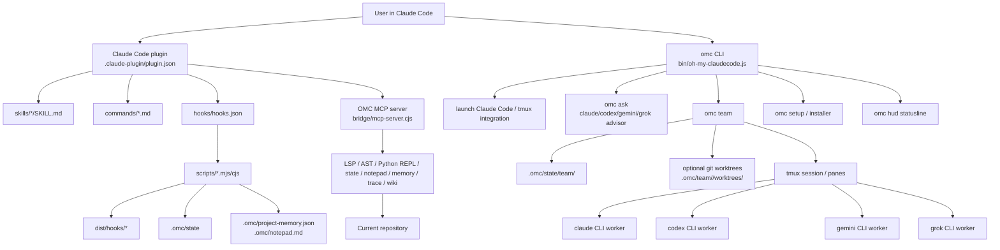
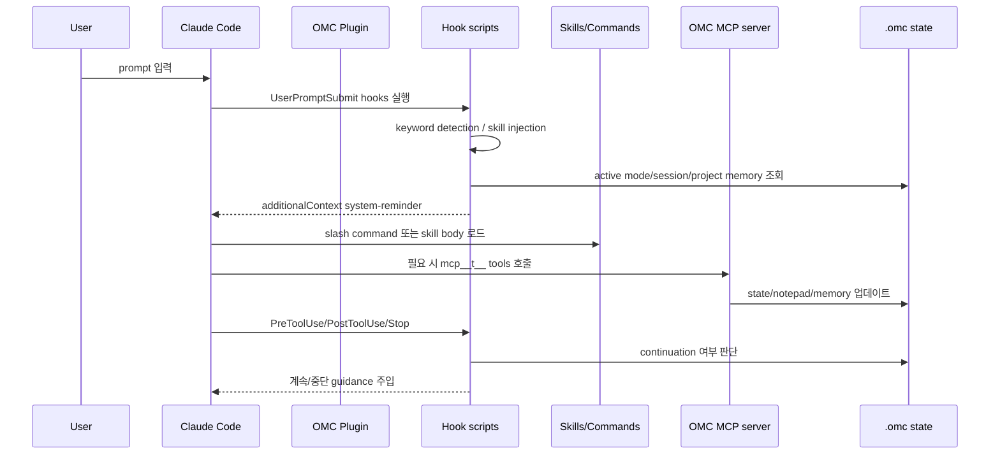
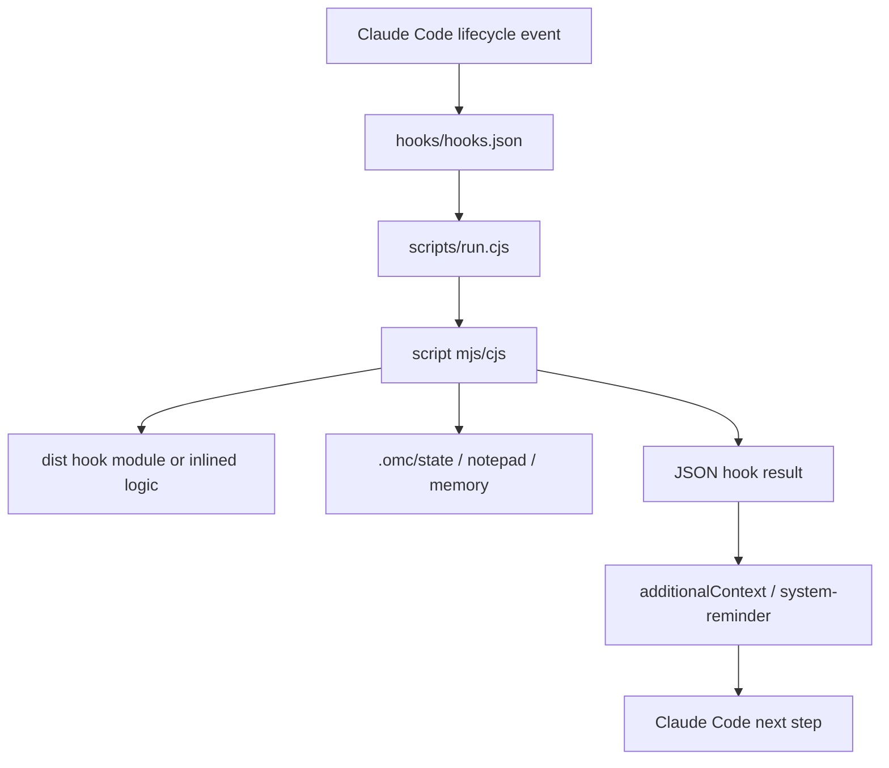
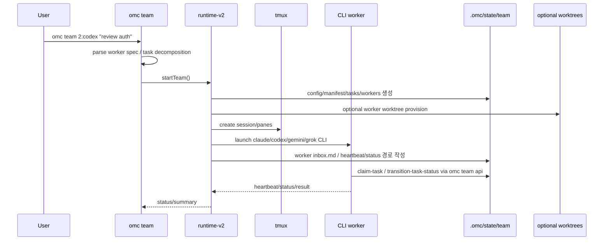

# Yeachan-Heo/oh-my-claudecode 분석 보고서

## 1. 요약 평가

oh-my-claudecode, 이하 OMC는 Claude Code 위에 설치되는 multi-agent orchestration layer다. 자체 LLM runtime을 구현하는 프로젝트가 아니라 Claude Code plugin, slash command, hook, skill, MCP tools server, npm CLI, tmux worker runtime을 묶어 Claude Code의 행동을 확장한다.

가장 중요한 차이는 “agent 본체”와 “orchestration layer”의 구분이다. Codex, Gemini CLI, OpenHands, Aider처럼 모델 호출과 tool execution loop를 직접 소유하는 프로젝트가 아니다. OMC는 Claude Code가 이미 제공하는 Task/Agent/tool/hook/plugin surface를 활용해서 다음을 추가한다.

- 19개 전문 agent prompt
- 40개 skill
- 28개 slash command template
- 24개 Claude Code lifecycle hook command
- OMC MCP tools server
- `.omc/` state, notepad, project memory, team state
- `omc` CLI
- `omc team` tmux worker orchestration
- Codex/Gemini/Grok/Claude CLI worker bridge
- HUD statusline
- persistent mode stop hook
- project memory와 compaction-resistant note

설계 철학은 “Claude Code를 배워서 잘 쓰는 대신, 자연어와 keyword로 자동 routing되게 만든다”에 가깝다. README의 표현도 “Zero learning curve”, “Team-first orchestration”, “Natural language interface”, “Persistent execution”을 강조한다.

강점은 Claude Code plugin 생태계를 실용적으로 잘 이용한다는 점이다. Hook 기반 lifecycle interception, skill-based behavior injection, role-specific agent prompts, MCP tools, tmux worker, file-based team state를 결합해서 Claude Code의 기본 흐름을 강하게 확장한다. 특히 `omc team`은 단순 prompt가 아니라 tmux pane, worker inbox, task lifecycle API, heartbeat, worktree mode, optional auto-merge까지 갖춘 별도 runtime이다.

반대로 위험도도 크다. OMC는 Claude Code hook으로 사용자 prompt, tool 사용 전후, permission request, session start/end, stop event에 개입한다. 또한 Team CLI worker는 Codex/Gemini/Grok/Claude CLI를 auto-approve 계열 flag로 실행할 수 있다. 보안 문서가 이를 인식하고 `OMC_SECURITY=strict`를 제공하지만, 기본 사용자가 “plugin/skill 모음” 정도로 생각하면 실제 권한을 과소평가할 수 있다.

## 2. 기본 정보

- 저장소: `Yeachan-Heo/oh-my-claudecode`
- 분석 커밋: `deee3a4`
- 기본 브랜치: `main`
- 생성일: 2026-01-09
- 분석 기준일: 2026-06-10
- 최신 릴리스 관측값: `v4.14.6` / 2026-06-09
- package name: `oh-my-claude-sisyphus`
- project/plugin brand: `oh-my-claudecode`
- package version: `4.14.6`
- 언어: TypeScript
- Node 요구사항: `>=20.0.0`
- 라이선스: MIT
- GitHub metadata 관측값:
  - stars: 36,121
  - forks: 3,290
  - watchers: 127
- homepage: `https://oh-my-claudecode.dev`
- topics:
  - `agentic-coding`
  - `ai-agents`
  - `claude`
  - `claude-code`
  - `oh-my-opencode`
  - `opencode`
  - `vibe-coding`
  - `automation`
  - `multi-agent-systems`
  - `parallel-execution`

중요한 naming mismatch가 있다.

- GitHub repo와 plugin은 `oh-my-claudecode`다.
- npm package는 `oh-my-claude-sisyphus`다.
- npm bin은 `oh-my-claudecode`, `omc`, `omc-cli`를 노출한다.

README도 이 차이를 명시한다. 설치/업데이트 자동화나 supply-chain 검증에서 package name과 repo name을 혼동하지 않아야 한다.

## 3. 레포지토리 구조

주요 루트는 다음과 같다.

- `.claude-plugin/plugin.json`: Claude Code plugin manifest
- `.claude-plugin/marketplace.json`: marketplace entry
- `.mcp.json`: plugin-local MCP server config
- `agents/*.md`: Claude Code subagent prompt 19개
- `skills/*/SKILL.md`: plugin skill 40개
- `commands/*.md`: slash command template 28개
- `hooks/hooks.json`: Claude Code lifecycle hook config
- `scripts/*.mjs`, `scripts/*.cjs`: hook runtime wrapper와 script
- `src/`: TypeScript source
- `dist/`: built JS declarations and runtime output
- `bridge/*.cjs`, `bridge/*.js`, `bridge/*.py`: packaged runtime bridges
- `docs/`: architecture, reference, hooks, tools, security, team worktree mode 문서
- `benchmark/`, `benchmarks/`: OMC vs vanilla / prompt benchmark
- `.clawhip/`: release/session 관련 hidden state
- `.codex`: 빈 파일

소스의 중심 영역은 다음이다.

- `src/index.ts`: SDK-style OMC session 생성, agent/tools/system prompt 조립
- `src/cli/index.ts`: `omc` CLI command tree
- `src/cli/commands/team.ts`: user-facing `omc team` parser/runtime bridge
- `src/cli/team.ts`: legacy/runtime CLI job manager
- `src/team/`: tmux team runtime, task state, mailbox, runtime-v2, worktree, merge orchestration
- `src/mcp/omc-tools-server.ts`: OMC MCP server
- `src/tools/`: LSP/AST/Python REPL/state/notepad/memory/trace/wiki/shared-memory tools
- `src/hooks/`: hook implementations
- `src/installer/`: Claude Code config/plugin setup logic
- `src/features/`: magic keywords, background tasks, continuation, model routing, state manager, verification
- `src/hud/`: statusline HUD renderer와 transcript parser

## 4. 발전 과정과 설계 철학

OMC는 `oh-my-opencode`에서 영감을 받은 Claude Code용 orchestration layer로 설명된다. 초기 방향은 “Claude Code에 좋은 agent prompt와 command를 넣는 것”에 가까웠겠지만, 현재 커밋 기준으로는 훨씬 큰 runtime이 되었다.

README와 docs에서 보이는 철학은 다음이다.

1. Team-first orchestration
   - v4.1.7 이후 Team이 canonical orchestration surface다.
   - 기존 `swarm` 계열은 제거 또는 legacy compatibility로 남고, `/team`과 `omc team`이 중심이 된다.

2. Skill-based behavior injection
   - agent를 바꿔치기하기보다 skill을 통해 행동을 주입한다.
   - skill은 execution layer, enhancement layer, guarantee layer로 조합된다.
   - 예: `default + ultrawork + git-master + ralph`

3. Lifecycle hooks as control plane
   - Claude Code의 `UserPromptSubmit`, `PreToolUse`, `PostToolUse`, `Stop`, `SessionStart`, `SessionEnd` 등에 hook을 단다.
   - keyword detection, state restore, project memory, permission enforcement, persistent mode continuation이 hook으로 구현된다.

4. Persistent execution
   - `/ralph`, `/autopilot`, `/ultrawork`, `/team`, `/ultragoal` 같은 mode가 `.omc/state`에 상태를 남긴다.
   - Stop hook이 active mode를 보고 아직 완료되지 않았으면 계속하라는 reminder를 inject한다.

5. External CLI workers
   - Team CLI는 Claude뿐 아니라 Codex/Gemini/Grok CLI worker를 tmux pane으로 띄운다.
   - `/ccg`는 Codex/Gemini advisor 결과를 Claude가 합성하는 tri-model flow다.

6. Evidence and verification
   - verifier, code-reviewer, security-reviewer, critic 같은 reviewer role을 강하게 둔다.
   - worker output contract와 verdict file을 통해 외부 CLI reviewer 결과도 구조화하려 한다.

7. State locality
   - 기본은 repo-local `.omc/`.
   - `OMC_STATE_DIR`로 중앙화 가능하다.
   - `.omc-workspace` marker로 multi-repo workspace 상태를 하나로 묶을 수 있다.

## 5. 전체 아키텍처



OMC는 네 계층으로 보면 이해하기 쉽다.

- Claude Code plugin 계층:
  - skills, agents, commands, hooks, MCP server를 Claude Code에 등록한다.

- Hook/control 계층:
  - 사용자 prompt와 tool lifecycle에 반응하여 context, skill, state, reminder를 주입한다.

- CLI/runtime 계층:
  - `omc launch`, `omc setup`, `omc team`, `omc ask`, `omc hud`, `omc ultragoal` 같은 shell command를 제공한다.

- State/tools 계층:
  - `.omc/` 아래 state, team, notepad, project memory, handoff, logs, worktree metadata를 저장한다.
  - MCP server가 LSP/AST/Python REPL/state/memory/trace tools를 제공한다.

## 6. Claude Code Plugin 실행 플로우

Plugin 설치 기준 플로우는 다음이다.



핵심은 Claude Code가 이미 실행 주체라는 점이다. OMC는 hook과 prompt를 통해 Claude Code의 판단에 영향을 준다. 따라서 OMC가 제공하는 permission/role/agent boundary 중 일부는 실제 OS-level enforcement가 아니라 prompt/hook-level policy다.

## 7. `createOmcSession()` SDK 흐름

핵심 위치:

- `src/index.ts:265`: `createOmcSession()`
- `src/index.ts:283`: OMC system prompt 조립
- `src/index.ts:311`: allowed tools 구성
- `src/index.ts:338`: OMC MCP tool names 추가
- `src/index.ts:354`: SDK query options 생성
- `src/index.ts:363`: `permissionMode: 'acceptEdits'`

`createOmcSession()`은 Claude Agent SDK와 함께 쓸 수 있는 session object를 만든다.

주요 단계는 다음이다.

1. config를 로드한다.
2. context files를 찾고 system prompt에 붙인다.
3. `omcSystemPrompt`에 continuation guidance, custom system prompt, project context를 추가한다.
4. agent definitions를 생성한다.
5. default MCP server와 OMC MCP tools server를 구성한다.
6. allowed tools 목록을 만든다.
7. magic keyword processor를 생성한다.
8. background task manager를 생성한다.
9. Claude Agent SDK `queryOptions`를 반환한다.

중요한 점은 `permissionMode`가 `acceptEdits`로 설정된다는 것이다. 이는 OMC가 “코드 편집은 자연스럽게 수행하되 Bash 등 위험한 작업은 hook/Claude Code 권한 정책으로 다룬다”는 방향임을 보여준다.

## 8. Agent Prompt Registry

핵심 위치:

- `agents/*.md`: 실제 plugin agent prompt
- `src/agents/definitions.ts:56`: `debuggerAgent`
- `src/agents/definitions.ts:67`: `verifierAgent`
- `src/agents/definitions.ts:102`: `securityReviewerAgent`
- `src/agents/definitions.ts:113`: `codeReviewerAgent`
- `src/agents/definitions.ts:175`: `getConfiguredAgentModel()`
- `src/agents/definitions.ts:202`: `getAgentDefinitions()`
- `src/agents/definitions.ts:262`: config 기반 model override
- `src/agents/definitions.ts:263`: `disallowedTools` parsing

분석 시점 agent prompt는 19개다.

- `explore`
- `analyst`
- `planner`
- `architect`
- `debugger`
- `executor`
- `verifier`
- `tracer`
- `security-reviewer`
- `code-reviewer`
- `test-engineer`
- `designer`
- `writer`
- `qa-tester`
- `scientist`
- `document-specialist`
- `git-master`
- `code-simplifier`
- `critic`

역할 구분은 꽤 엄격하다.

- `analyst`: 요구사항 gap 분석, read-only
- `planner`: 계획 작성
- `critic`: 계획 검토
- `architect`: 코드 분석/디버깅/검증, read-only
- `executor`: 구현
- `verifier`: 완료 증거 검증
- `code-reviewer`, `security-reviewer`: review lane
- `designer`, `writer`, `scientist`: domain lane

Agent markdown frontmatter의 `model`과 `disallowedTools`를 읽어 Claude Code agent definition으로 변환한다. read-only 역할은 `Write`, `Edit`를 차단하도록 선언되어 있다. 다만 이 차단은 Claude Code/OMC hook이 해석하는 정책이며, OS-level sandbox가 아니다.

## 9. Skill System

분석 시점 skill은 40개다.

- `ai-slop-cleaner`
- `ask`
- `autopilot`
- `autoresearch`
- `cancel`
- `ccg`
- `configure-notifications`
- `debug`
- `deep-dive`
- `deep-interview`
- `deepinit`
- `external-context`
- `hud`
- `learner`
- `local-build-reminder`
- `mcp-setup`
- `omc-doctor`
- `omc-reference`
- `omc-setup`
- `omc-teams`
- `plan`
- `project-session-manager`
- `ralph`
- `ralplan`
- `release`
- `remember`
- `sciomc`
- `self-improve`
- `setup`
- `skill`
- `skillify`
- `team`
- `trace`
- `ultragoal`
- `ultraqa`
- `ultrawork`
- `verify`
- `visual-verdict`
- `wiki`
- `writer-memory`

Skill은 단순 alias가 아니라 workflow instruction이다. 예를 들어:

- `autopilot`: 아이디어를 요구사항, 설계, 병렬 구현, QA, validation까지 진행
- `ralph`: verified done까지 멈추지 않는 persistence loop
- `ultrawork`: parallel agent orchestration
- `team`: staged team pipeline
- `ccg`: Codex/Gemini advisor를 `omc ask`로 호출하고 Claude가 합성
- `cancel`: active mode state 정리
- `deep-interview`: Socratic requirement gathering
- `visual-verdict`: screenshot/reference 기반 visual QA
- `ai-slop-cleaner`: deletion-first cleanup workflow

Skill architecture의 특징은 “workflow를 prompt로 만들고 hook/state로 지속성을 보강한다”는 것이다. 따라서 skill은 그 자체로 실행 프로그램이라기보다 Claude Code가 따를 상세 protocol이다.

## 10. Hook System

핵심 위치:

- `hooks/hooks.json`: 24개 hook command
- `docs/HOOKS.md`: lifecycle 설명
- `scripts/keyword-detector.mjs`: UserPromptSubmit keyword detection
- `scripts/pre-tool-enforcer.mjs`: PreToolUse enforcement
- `scripts/permission-handler.mjs`: PermissionRequest handling
- `scripts/persistent-mode.mjs`: Stop continuation enforcement

Claude Code lifecycle event별 OMC hook은 다음이다.

- `UserPromptSubmit`
  - `keyword-detector.mjs`
  - `skill-injector.mjs`

- `SessionStart`
  - `session-start.mjs`
  - `project-memory-session.mjs`
  - `wiki-session-start.mjs`
  - init/maintenance matcher용 setup hooks

- `PreToolUse`
  - `pre-tool-enforcer.mjs`

- `PermissionRequest`
  - `permission-handler.mjs`

- `PostToolUse`
  - `post-tool-verifier.mjs`
  - `project-memory-posttool.mjs`
  - `post-tool-rules-injector.mjs`

- `PostToolUseFailure`
  - `post-tool-use-failure.mjs`

- `SubagentStart`
  - `subagent-tracker.mjs start`

- `SubagentStop`
  - `subagent-tracker.mjs stop`
  - `verify-deliverables.mjs`

- `PreCompact`
  - `pre-compact.mjs`
  - `project-memory-precompact.mjs`
  - `wiki-pre-compact.mjs`

- `Stop`
  - `context-guard-stop.mjs`
  - `persistent-mode.mjs`
  - `code-simplifier.mjs`

- `SessionEnd`
  - `session-end.mjs`
  - `wiki-session-end.mjs`

흐름은 다음이다.



위험 포인트는 hook command가 shell command라는 점이다. 보안 문서도 “hook.command는 shell true로 실행되므로 피하거나 최소화하라”고 권고한다. OMC hook은 plugin root 경로를 사용하지만, hook이 실행되는 구조 자체는 강력한 local code execution surface다.

## 11. Magic Keyword와 Persistent Mode

핵심 위치:

- `src/hooks/keyword-detector/index.ts:45`: keyword regex
- `src/hooks/keyword-detector/index.ts:49`: Team keyword auto-detection disabled
- `src/hooks/keyword-detector/index.ts:365`: prompt sanitization
- `src/hooks/keyword-detector/index.ts:769`: conflict resolution
- `src/hooks/keyword-detector/index.ts:963`: ralplan-first gate
- `scripts/persistent-mode.cjs:270`: stale threshold 2시간
- `scripts/persistent-mode.cjs:551`: cancel signal check
- `scripts/persistent-mode.cjs:708`: authoritative mode active check
- `scripts/persistent-mode.cjs:1014`: Stop hook main state dir
- `scripts/persistent-mode.cjs:1053`: active mode state load
- `scripts/persistent-mode.cjs:1082`: ralph continuation
- `scripts/persistent-mode.cjs:1129`: autopilot continuation
- `scripts/persistent-mode.cjs:1159`: team continuation
- `scripts/persistent-mode.cjs:1220`: ralplan continuation

Keyword detector는 prompt 안의 단어를 보고 skill/mode를 활성화한다. 예시는 다음이다.

- `cancelomc`, `stopomc`
- `ralph`
- `autopilot`, `auto-pilot`, `full auto`
- `ultrawork`, `ulw`
- explicit `/team`

중요한 변화는 `team` 일반 단어 auto-detection이 꺼져 있다는 점이다. 코드 주석은 무한 spawning을 막기 위해 team mode를 explicit-only로 만들었다고 설명한다.

Keyword detector는 오탐을 줄이기 위해 꽤 많은 sanitization을 한다.

- code block 제거
- URL/file path 제거
- HTML/markdown comment 제거
- 질문/정보성 문맥 구분
- CJK alias 처리
- 기존 OMC reminder echo가 다시 keyword를 trigger하지 않도록 방어

Persistent mode는 Stop hook에서 `.omc/state`를 읽고 active mode가 있으면 계속하라는 system reminder를 주입한다. 취지는 “작업이 끝났다고 잘못 판단하고 멈추지 않기”다. stale state는 2시간 이후 inactive로 취급한다.

이 설계는 powerful하지만 조심해야 한다. 잘못된 state가 남으면 모델이 계속 작업하려 할 수 있고, cancel이 실패하면 state를 직접 정리해야 할 수 있다.

## 12. OMC MCP Tools Server

핵심 위치:

- `.mcp.json`: `t` server가 `node ${CLAUDE_PLUGIN_ROOT}/bridge/mcp-server.cjs` 실행
- `bridge/mcp-server.cjs`: packaged stdio MCP server
- `src/mcp/omc-tools-server.ts:38`: `OMC_DISABLE_TOOLS` group map
- `src/mcp/omc-tools-server.ts:76`: disable group parsing
- `src/mcp/omc-tools-server.ts:96`: all tools aggregation
- `src/mcp/omc-tools-server.ts:111`: startup filter
- `src/mcp/omc-tools-server.ts:134`: `createSdkMcpServer`
- `src/mcp/omc-tools-server.ts:217`: `getOmcToolNames()`

OMC MCP server는 Claude Code subagents가 쓸 custom tool을 제공한다. 문서상 tool category는 다음이다.

- State
- Notepad
- Project Memory
- LSP
- AST Grep
- Python REPL
- Session Search
- Trace
- Shared Memory
- Skills
- Deepinit Manifest
- Wiki
- Interop

`OMC_DISABLE_TOOLS` env var로 category 단위 비활성화가 가능하다.

```text
OMC_DISABLE_TOOLS=lsp,python-repl,project-memory
```

MCP server 실행 확인:

- `node bridge/mcp-server.cjs --help`
  - stdio MCP server로 시작됨
  - stdin 종료를 받고 disconnect 로그 출력

다만 `dist/index.js`나 `dist/mcp/omc-tools-server.js`를 직접 ESM import하면 현재 checkout에는 `node_modules`가 없어 실패했다.

- 실패 원인: `Cannot find package '@anthropic-ai/claude-agent-sdk'`

즉 packaged `bridge/*.cjs`는 일부 dependency가 bundled되어 바로 실행되지만, `dist/` ESM module은 dependency install이 필요하다.

## 13. `omc` CLI

핵심 위치:

- `bin/oh-my-claudecode.js`: `bridge/cli.cjs` import
- `bridge/cli.cjs`: packaged CLI bundle
- `src/cli/index.ts`: source CLI command tree

실행 확인:

- `node bin/oh-my-claudecode.js --version`
  - 성공: `4.14.6`
- `node bin/oh-my-claudecode.js --help`
  - 성공

관측된 CLI command는 다음이다.

- `launch`
- `interop`
- `ask`
- `config`
- `config-stop-callback`
- `config-notify-profile`
- `info`
- `test-prompt`
- `update`
- `update-reconcile`
- `version`
- `install`
- `wait`
- `teleport`
- `session`
- `doctor`
- `setup`
- `hud`
- `mission-board`
- `team`
- `autoresearch`
- `ralphthon`
- `ultragoal`

`omc info`는 19개 agent, enabled features, MCP servers, magic keywords, version을 출력했다. 현재 분석 환경에서는 `exa`, `context7`, `t`가 MCP servers로 표시되었다. 이는 local/user config 영향이 섞일 수 있으므로 repo 자체 default와 운영 환경을 구분해야 한다.

테스트 실행 확인:

- `npm test -- --run ...`
  - 실패
  - 원인: `vitest: command not found`
  - 현재 checkout에 `node_modules`가 없음

## 14. Team CLI와 tmux Worker Runtime

핵심 위치:

- `src/cli/commands/team.ts`: user-facing parser와 command
- `src/cli/team.ts`: runtime CLI job manager
- `src/team/runtime-v2.ts`: default runtime-v2
- `src/team/worker-bootstrap.ts`: worker inbox/overlay 생성
- `src/team/model-contract.ts`: Claude/Codex/Gemini/Grok worker launch contract
- `src/team/cli-worker-contract.ts`: reviewer role verdict file contract
- `src/team/permissions.ts`: advisory permission scoping
- `src/team/git-worktree.ts`: optional worker worktree isolation
- `src/team/merge-orchestrator.ts`: optional auto-merge/rebase orchestrator

`omc team --help` 실행 결과는 다음 형태다.

```text
omc team [N:agent-type[:role]] "<task description>"
omc team status <team-name>
omc team shutdown <team-name> [--force]
omc team api <operation> --input <json> --json
```

지원 worker type:

- `claude`
- `codex`
- `gemini`
- `grok`

Team 실행 흐름은 다음과 같다.



Team worker는 직접 task files를 수정하지 않고 `omc team api`를 사용하도록 강하게 지시받는다.

- `claim-task`
- `transition-task-status`
- `send-message`
- `mailbox-list`
- `mailbox-mark-delivered`
- `read-task`
- `release-task-claim`

Worker bootstrap prompt는 다음을 강제한다.

- ready sentinel 작성
- task claim
- startup ACK
- status/heartbeat 작성
- 완료/실패 transition
- nested subagent 금지
- tmux pane/session 생성 금지
- leader orchestration command 금지
- worker control surface는 `omc team api ... --json`만 허용

이것은 좋은 설계다. 다만 여전히 worker는 실제 CLI process이고, Codex/Gemini/Grok/Claude 자체가 파일/터미널 권한을 가질 수 있다.

## 15. External CLI Worker 권한

핵심 위치:

- `src/team/model-contract.ts:8`: `CliAgentType`
- `src/team/model-contract.ts:34`: resolved binary path
- `src/team/model-contract.ts:43`: untrusted path patterns
- `src/team/model-contract.ts:47`: trusted prefixes
- `src/team/model-contract.ts:105`: binary path resolution
- `src/team/model-contract.ts:152`: Claude contract
- `src/team/model-contract.ts:173`: Codex contract
- `src/team/model-contract.ts:200`: Gemini contract

외부 CLI worker launch flag가 매우 중요하다.

- Claude:
  - `--dangerously-skip-permissions`
  - API key가 있으면 `--bare`
- Codex:
  - `--dangerously-bypass-approvals-and-sandbox`
- Gemini:
  - `--approval-mode yolo`
- Grok:
  - 보안 문서 기준 `--always-approve`

OMC security guide도 이들을 같은 risk class로 본다. 즉 Team worker는 unattended automation을 위해 개별 CLI의 승인 prompt를 우회하는 경향이 있다.

Binary path 검증도 있다.

- binary name은 `A-Za-z0-9._-`만 허용한다.
- `which`/`where`로 resolved path를 찾는다.
- `/tmp`, `/var/tmp`, `/dev/shm`는 hard reject한다.
- trusted prefix 외 경로는 warning을 낸다.
- trusted prefix는 directory-boundary safe하게 검사한다.

하지만 warning은 hard block이 아니다. 엄격한 환경에서는 `OMC_SECURITY=strict` 또는 `security.disableExternalLLM=true`가 필요하다.

## 16. Team Worktree Mode와 Auto-Merge

핵심 위치:

- `docs/TEAM-WORKTREE-MODE.md`
- `src/team/git-worktree.ts`
- `src/team/merge-orchestrator.ts`

Team worktree mode는 opt-in이다. 목표는 worker edit을 분리하면서 team coordination state는 leader-owned root 하나로 유지하는 것이다.

기본 layout:

```text
.omc/team/<team-name>/worktrees/<worker-name>
.omc/state/team/<team-name>
```

중요 safety rule:

- leader workspace가 dirty면 worktree provisioning 거부
- compatible clean worker worktree는 재사용 가능
- dirty worker worktree는 보존하고 warning/event로 노출
- cleanup은 dirty worker edit을 force-remove하지 않음
- branch/path mismatch는 실패
- worker root `AGENTS.md`는 backup/restore safeguard를 사용

Auto-merge는 runtime-v2와 feature branch 조건을 요구한다. `merge-orchestrator.ts`는 worker branch commit을 감시하고 leader branch로 merge, 다른 worker에게 rebase fanout을 수행한다.

중요 guard:

- runtime-v2가 명시적으로 꺼져 있으면 auto-merge 거부
- leader branch가 `main`/`master`면 거부
- merge/rebase conflict는 leader/worker inbox로 보냄
- `.hook-paused` sentinel은 forgeable하다는 한계를 코드 주석에서 명시

이 설계는 실험적이지만 신중하다. 특히 dirty worktree 보존과 main/master 거부는 좋은 방어다.

## 17. State, Notepad, Project Memory

OMC의 durable state는 repo-local 또는 centralized root 아래에 있다.

기본 경로:

```text
.omc/state/
.omc/state/sessions/{sessionId}/
.omc/notepad.md
.omc/project-memory.json
.omc/notepads/
.omc/plans/
.omc/research/
.omc/logs/
.omc/handoffs/
.omc/ultragoal/
.omc/state/team/<team>
```

`src/lib/worktree-paths.ts`가 state root를 결정한다.

우선순위:

1. `OMC_STATE_DIR`
2. `.omc-workspace` marker
3. `git rev-parse --show-toplevel`
4. `process.cwd()`

`.omc-workspace`는 multi-repo parent에 놓아 여러 sub-repo가 같은 `.omc/`를 공유하게 할 수 있다. 이는 대규모 workspace에 유용하지만, 잘못 놓인 marker는 unrelated repo의 state를 합칠 수 있다. 코드가 home directory 이상은 스캔하지 않도록 제한하고, sibling retrofit warning을 제공한다.

Notepad와 project memory는 compaction-resistant memory 역할을 한다.

- Notepad:
  - `.omc/notepad.md`
  - priority/working/manual notes
  - compaction 전후 context 복원

- Project Memory:
  - `.omc/project-memory.json`
  - 프로젝트 구조, 규칙, learned knowledge, directive 저장

장점은 long-running workflow의 continuity다. 단점은 sensitive data가 repo-local directory에 남을 수 있다는 점이다.

## 18. Security Model

`SECURITY.md`는 `OMC_SECURITY=strict`를 제공한다.

Strict mode가 켜는 기능:

- tool path restriction
- Python REPL sandbox
- remote MCP server disable
- external LLM disable
- auto-update disable
- hard max iterations cap

Granular config는 `.claude/omc.jsonc` 또는 `~/.config/claude-omc/config.jsonc`에 들어간다.

```jsonc
{
  "security": {
    "restrictToolPaths": true,
    "pythonSandbox": true,
    "disableRemoteMcp": true,
    "disableExternalLLM": true,
    "disableAutoUpdate": true,
    "hardMaxIterations": 200
  }
}
```

보안 문서가 인정하는 한계:

- OS-level process sandbox가 없다.
- Python blocklist는 defense-in-depth이지 완전한 security boundary가 아니다.
- agent 간 security boundary가 없다.
- agents는 filesystem과 MCP access를 공유한다.
- background agent monitoring gap이 있다.

이 정직한 문서는 좋은 신호다. 다만 사용자가 strict mode를 켜지 않으면 많은 기능이 편의성 우선으로 동작할 수 있다.

## 19. 숨겨진 표면과 이상한 점

1. `.clawhip/state/prompt-submit.json`
   - repo 안에 2026-04-13의 Claude Code `UserPromptSubmit` 이벤트 snapshot이 들어 있다.
   - prompt summary는 release 관련 개인 작업 문장이다.
   - 민감정보는 없어 보이지만, release/session artifact가 public repo에 들어간 흔적이다.

2. `.codex`
   - 빈 파일이다.
   - 기능적으로 의미는 없지만 Codex ecosystem과의 교차 흔적으로 보인다.

3. package name mismatch
   - npm package는 `oh-my-claude-sisyphus`, plugin/repo brand는 `oh-my-claudecode`.
   - 사용자가 npm package provenance를 확인할 때 혼동할 수 있다.

4. Plugin install method vs npm path
   - README quick start는 plugin marketplace를 추천하면서 npm CLI/runtime path도 제시한다.
   - docs/reference는 “Only the Claude Code Plugin method is supported”라고 더 강하게 말한다.
   - 즉 사용자-facing 문서 사이에 약간의 강조 차이가 있다. 결론은 plugin flow가 canonical이고 npm은 CLI surface용이다.

5. `dist/`와 `bridge/` 동시 존재
   - plugin/runtime이 빌드 산출물에 의존한다.
   - source만 수정하면 Claude Code plugin은 `dist/`를 로드하므로 `npm run build`가 필요하다고 CLAUDE/AGENTS 문서가 반복해서 경고한다.

6. User config influence
   - `omc info`에서 표시된 MCP servers/features는 현재 사용자의 config 영향을 받을 수 있다.
   - repo default 분석과 local runtime 상태를 구분해야 한다.

## 20. 위험 요소

### 20.1 Hook command execution

OMC는 Claude Code lifecycle hook을 대량 설치한다. Hook command는 local shell command로 실행된다. Plugin root가 신뢰되지 않거나, plugin cache가 손상되거나, hook config가 공격자에게 바뀌면 prompt 입력만으로도 local code가 실행될 수 있다.

완화:

- plugin marketplace provenance 확인
- pin된 release 사용
- `omc doctor`로 설치 상태 점검
- hook command를 직접 수정하지 않기
- enterprise 환경에서는 manual install + `OMC_SECURITY=strict`

### 20.2 External CLI worker auto-approve

Codex/Gemini/Grok/Claude workers는 unattended 실행을 위해 위험 flag를 사용한다. 이는 실제로 worker가 파일/터미널을 넓게 사용할 수 있음을 의미한다.

완화:

- `OMC_SECURITY=strict`
- `security.disableExternalLLM=true`
- trusted CLI dirs 확인
- worktree mode를 사용해 edit surface 분리
- untrusted repo에서는 `omc team` 외부 provider 금지

### 20.3 Prompt/hook-level permission boundary

`src/team/permissions.ts`는 스스로 “advisory layer only”라고 말한다. MCP workers는 full-auto mode에서 기계적으로 제한할 수 없고, permission은 prompt instruction으로 주입된다.

즉 `allowedPaths`, `deniedPaths`, `allowedCommands`는 유용한 지침이지만 완전한 sandbox가 아니다.

### 20.4 Python REPL

Python REPL은 persistent execution environment다. strict mode에서는 dangerous modules/builtins blocklist가 적용되지만, 보안 문서가 말하듯 Python-level blocklist는 보안 경계가 아니다.

### 20.5 Auto-update와 supply chain

OMC는 auto-update 기능을 가진다. strict mode에서는 disable 가능하다. 자동 npm/plugin update는 편리하지만, enterprise나 sensitive repo에서는 검증된 버전에 pinning해야 한다.

### 20.6 Persistent state leakage

`.omc/` 아래에는 notepad, memory, team state, session summaries, logs, handoffs, ask artifacts가 남는다. 여기에 prompt, task, file path, reviewer findings, 외부 advisor 결과가 저장될 수 있다.

### 20.7 `.mcp.json` auto-load

`.mcp.json`은 plugin-local `t` MCP server를 실행한다. Claude Code는 repo/project `.mcp.json`도 읽을 수 있으므로 untrusted repo에서는 MCP auto-load 정책을 별도 확인해야 한다.

### 20.8 Worktree cleanup

Worktree mode는 보수적으로 dirty worktree를 보존한다. 좋지만, 사용자는 cleanup 후에도 `.omc/team/.../worktrees`에 작업물이 남아 있을 수 있다는 것을 알아야 한다. `orphan-cleanup`은 destructive escape hatch이며, 문서가 수동 보존/폐기를 요구한다.

## 21. 차별점

OMC의 차별점은 다음이다.

1. Claude Code plugin-native
   - 별도 agent loop보다 Claude Code의 plugin/hook/skill/Task surface를 적극 활용한다.

2. Team runtime
   - 단순 multi-agent prompt가 아니라 tmux workers, task files, mailbox, heartbeat, status, shutdown, worktree, auto-merge까지 갖춘 runtime이다.

3. Cross-provider CLI workers
   - Claude Code 안에서 Codex/Gemini/Grok CLI를 worker로 불러 팀에 섞는다.

4. Hook-based persistence
   - Stop hook이 state를 읽고 계속 진행을 유도한다.
   - context compaction 전후 memory/notepad를 보존한다.

5. Prompt and skill catalog 규모
   - 19 agents, 40 skills, 28 commands가 bundled되어 있다.

6. Security strict mode
   - 자체 한계를 인정하고 strict mode를 제공한다.

7. Worktree/merge orchestration
   - worker 별 git worktree와 auto-merge/rebase fanout은 Claude Code plugin 중 상당히 공격적인 기능이다.

## 22. 실행 검증 결과

성공:

- `node bin/oh-my-claudecode.js --version`
  - `4.14.6`
- `node bin/oh-my-claudecode.js --help`
  - CLI command tree 정상 출력
- `node bin/oh-my-claudecode.js team --help`
  - Team usage 정상 출력
- `node bin/oh-my-claudecode.js info`
  - agent list/features/MCP servers/version 출력
- `node bridge/mcp-server.cjs --help`
  - stdio MCP server 시작 후 stdin 종료 처리

실패 또는 제한:

- `npm test -- --run ...`
  - 실패: `vitest: command not found`
  - 원인: checkout에 `node_modules` 없음

- `node --input-type=module -e "import('./dist/index.js')..."`
  - 실패: `Cannot find package '@anthropic-ai/claude-agent-sdk'`
  - 원인: `dist/` ESM import에는 dependency install 필요

해석:

- packaged `bridge/cli.cjs`는 바로 실행 가능하다.
- 개발/테스트/ESM source import는 `npm install` 또는 CI 환경이 필요하다.
- 실제 plugin install flow에서는 Claude Code plugin cache와 bundled bridge path가 더 중요하다.

## 23. 레포지토리 평가

### 강점

- Claude Code plugin surface를 깊게 이해하고 활용한다.
- Team mode가 단순 prompt orchestration보다 훨씬 실체 있는 runtime이다.
- role별 prompt와 skill이 풍부하다.
- persistent mode, notepad, project memory, session state가 long-running workflow에 유리하다.
- worktree mode와 auto-merge가 실험적이지만 좋은 방향으로 격리와 통합을 시도한다.
- 보안 문서가 위험 flag와 구조적 한계를 솔직하게 다룬다.
- 테스트 파일이 매우 많고, regression issue를 테스트명으로 남긴 흔적이 많다.

### 약점

- hook/script/dist/bridge/source가 얽혀 있어 실행 경로가 복잡하다.
- prompt-level policy와 실제 enforcement가 섞여 있어 사용자가 boundary를 오해할 수 있다.
- 외부 CLI worker auto-approve flag는 강력한 위험 표면이다.
- state가 repo-local `.omc/`에 많이 남아 민감 데이터 관리가 필요하다.
- package name mismatch가 supply-chain 확인을 어렵게 한다.
- source checkout만으로는 테스트/ESM import가 바로 되지 않는다.
- `.clawhip` release/session artifact가 public tree에 남아 있어 관리 discipline 관점에서 주의가 필요하다.

### 적합한 사용 사례

- Claude Code를 주력으로 쓰고, agent prompt/skill/team workflow를 강하게 확장하고 싶은 경우
- 여러 reviewer/worker 역할로 복잡한 작업을 분해하고 싶은 경우
- Codex/Gemini/Grok/Claude CLI를 tmux pane으로 동시에 활용하고 싶은 경우
- long-running Claude Code session에서 상태, notepad, project memory가 필요한 경우
- plugin/hook 기반 자동화에 익숙하고 보안 설정을 관리할 수 있는 개인/팀

### 부적합하거나 주의할 사용 사례

- hook execution을 허용할 수 없는 locked-down 환경
- untrusted repo에서 auto-approve worker를 실행해야 하는 환경
- 엄격한 data minimization이 필요한 업무
- Claude Code plugin/hook 설치 구조를 관리할 수 없는 사용자
- 단순한 single-agent coding assistant만 필요한 경우

## 24. 결론

OMC는 Claude Code의 “workflow operating layer”다. 자체 agent loop 구현보다 Claude Code의 plugin, hook, skill, MCP, Task model을 최대한 활용한다. 이 접근은 매우 실용적이다. Claude Code를 이미 쓰는 사용자는 별도 앱을 배우지 않고, keyword와 slash command로 multi-agent workflow를 켤 수 있다.

하지만 OMC는 단순 prompt pack이 아니다. Hook command가 lifecycle마다 실행되고, MCP tools server가 state/code-intel/Python REPL을 제공하며, `omc team`은 tmux에서 auto-approve CLI worker를 띄운다. 따라서 설치하는 순간 Claude Code의 권한 모델을 크게 확장한다.

가장 안전한 이해 방식은 다음이다. OMC는 “Claude Code를 편하게 쓰는 스킨”이 아니라 “Claude Code 위에 올라간 자동화 runtime”이다. 개인 또는 신뢰된 팀 환경에서는 생산성을 크게 높일 수 있지만, untrusted repo나 enterprise 환경에서는 `OMC_SECURITY=strict`, external LLM disable, remote MCP disable, auto-update disable, worktree isolation, state hygiene를 기본 전제로 둬야 한다.
