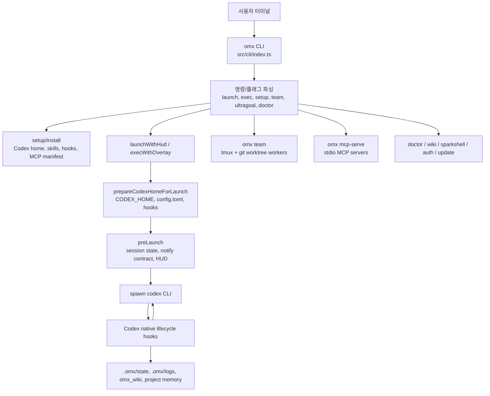
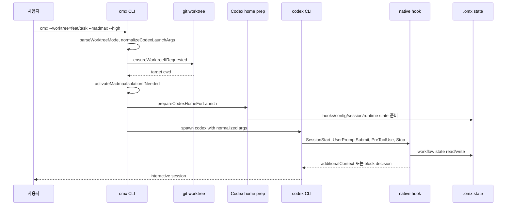
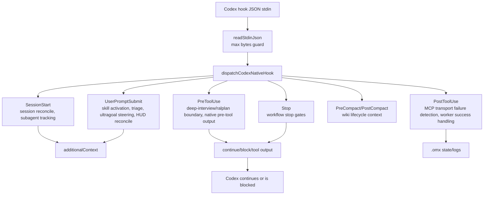
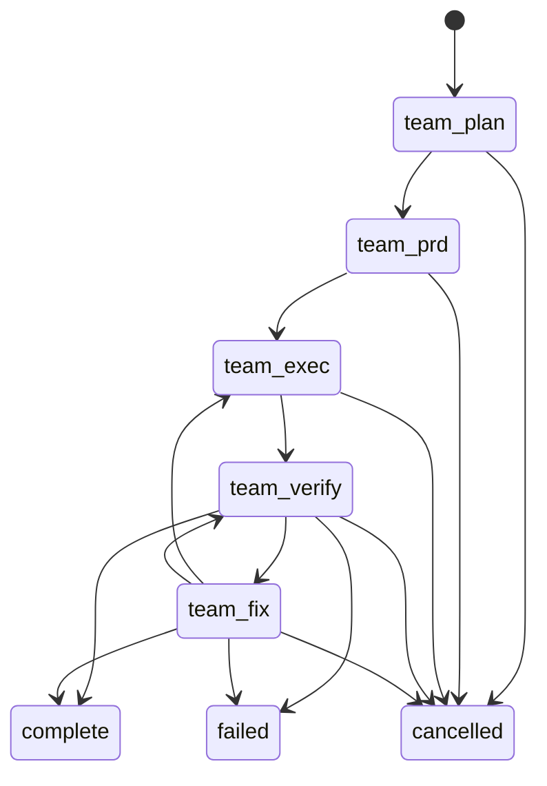
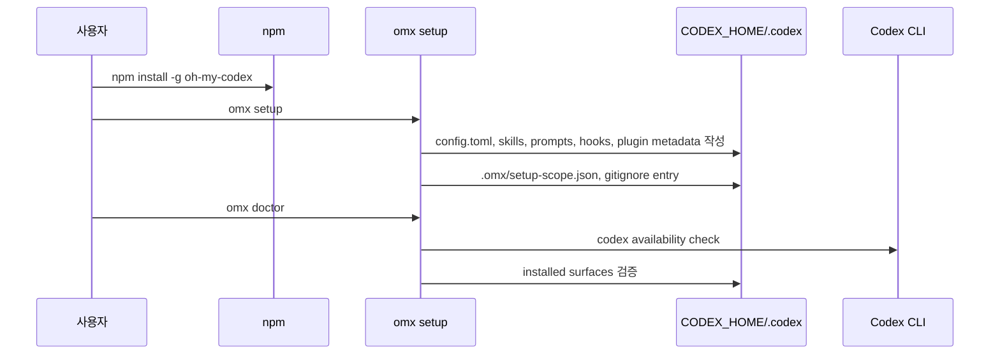
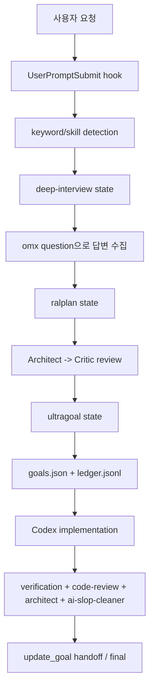
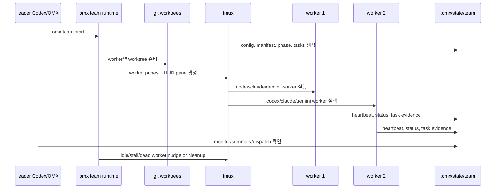

# Yeachan-Heo/oh-my-codex 심층 분석

## 1. 분석 기준과 결론 요약

- 대상 저장소: `Yeachan-Heo/oh-my-codex`
- 로컬 소스: `sources/Yeachan-Heo__oh-my-codex`
- 분석 커밋: `0332e47`
- 최신 확인 릴리스: `v0.18.11`, 2026-06-09
- 주 언어: TypeScript, Rust 보조 바이너리
- 패키지명: `oh-my-codex`
- 실행 명령: `omx`
- 라이선스 표기: `package.json` 및 플러그인 manifest는 MIT, GitHub metadata의 `licenseInfo`는 `null`
- 성격: OpenAI Codex CLI를 대체하는 독립 에이전트가 아니라, Codex CLI 위에 세션, 훅, 스킬, 워크플로, tmux/team, MCP, HUD, worktree 안전 장치를 얹는 운영 레이어

핵심 결론은 명확하다. `oh-my-codex`는 자체 모델 추론기나 자체 파일 편집 엔진을 만들지 않는다. Codex CLI가 실제 대화와 도구 실행의 엔진이고, OMX는 그 주변에서 “어떤 워크플로를 시작할지”, “언제 중단을 막을지”, “어떤 스킬과 지시문을 주입할지”, “여러 worker를 어떻게 tmux와 git worktree로 띄울지”를 관리한다.

따라서 이 저장소의 가치는 모델 품질보다 운영 규율에 있다. `$deep-interview -> $ralplan -> $ultragoal`, `$ralph`, `$team`, `$wiki`, `$sparkshell` 같은 표준 흐름을 Codex 세션에 강제로 붙여 긴 작업의 상태 유실, 조기 종료, 무계획 실행을 줄이려는 철학이 강하다. 반대로 위험도 그 지점에서 생긴다. 네이티브 훅이 `PreToolUse`, `UserPromptSubmit`, `Stop`을 가로채고, `--madmax`는 Codex의 승인과 샌드박스를 의도적으로 우회하며, 팀 런타임은 `codex`, `claude`, `gemini` worker를 자동 승인 모드로 띄울 수 있다.

## 2. 프로젝트가 풀려는 문제

Codex CLI는 기본적으로 단일 세션 안에서 모델이 사용자의 요청을 해석하고 도구를 호출하는 구조다. 긴 작업에서는 다음 문제가 발생한다.

- 요구사항 수집 없이 바로 구현에 들어갈 수 있다.
- 계획과 실행, 리뷰와 검증이 섞여 조기 완료 선언이 나올 수 있다.
- 여러 하위 작업을 병렬화할 때 세션, 파일, 브랜치, 상태 관리가 느슨해진다.
- Codex가 중간에 멈추거나 context compact가 일어나면 현재 워크플로 상태를 잃기 쉽다.
- 훅, 스킬, MCP, 프롬프트, AGENTS.md, config.toml의 설치 위치가 바뀌면 설정 불일치가 생긴다.

OMX는 이 문제를 “Codex 실행 엔진은 그대로 두고, 그 주변에 절차적 레일을 설치한다”는 방식으로 푼다. README의 표현도 일관적이다. Codex를 대체하는 것이 아니라 `Your codex is not alone`인 workflow layer로 설명한다.

## 3. 발전 과정과 철학

### 3.1 Codex를 감싸되 숨기지 않는 철학

`src/cli/index.ts`의 `launchWithHud`, `execWithOverlay`, `runCodexBlocking` 흐름을 보면 OMX는 마지막에 항상 `codex` 바이너리를 실행한다. 사용자 입력을 자체 LLM 루프로 넘기는 것이 아니라 Codex CLI에 넘긴다.

이 구조의 의미는 다음과 같다.

- 장점: Codex의 인증, 모델 설정, 도구 생태계, 샌드박스 정책을 재사용한다.
- 장점: 사용자 입장에서는 기존 Codex CLI 사용법을 크게 버리지 않아도 된다.
- 단점: Codex CLI의 내부 hook contract, config schema, plugin cache layout 변화에 민감하다.
- 단점: 오류가 생기면 원인이 Codex, OMX, plugin cache, hooks.json, MCP, tmux 중 어디인지 분리하기 어렵다.

### 3.2 워크플로 중심 철학

OMX의 기본 흐름은 단순 실행보다 “상태 있는 절차”에 가깝다.

- `$deep-interview`: 요구사항을 질문으로 끌어내고 답변 의무를 상태로 남긴다.
- `$ralplan`: 구현 전 계획과 리뷰를 강제한다.
- `$ultragoal`: 목표를 durable goal ledger로 쪼개고 품질 게이트를 둔다.
- `$ralph`: 단일 작업자의 완료 루프와 감사 증거를 강제한다.
- `$team`: 여러 worker를 tmux/worktree로 띄워 역할별 작업을 나눈다.
- `$code-review`, `$ultraqa`, `ai-slop-cleaner`: 완료 선언 전에 리뷰와 검증을 강제한다.

`src/ultragoal/artifacts.ts`의 상태 모델은 특히 이 철학을 잘 보여준다. 목표는 `pending`, `in_progress`, `complete`, `failed`, `review_blocked`, `needs_user_decision` 같은 상태를 갖고, 품질 게이트는 검증, 코드 리뷰, architect clear, ai-slop-cleaner evidence를 요구한다.

### 3.3 “강제 중단 방지” 철학

`src/scripts/codex-native-hook.ts`의 `Stop` 처리는 매우 크다. Stop hook이 활성 워크플로 상태를 읽고, 아직 종료 조건이 맞지 않으면 Codex에 `decision: "block"`과 system message를 돌려준다.

이것은 일반적인 알림 hook이 아니라 실행 제어 hook이다. 모델이 “끝났다”고 말하려 해도, OMX 상태가 아직 진행 중이면 종료를 막는다. 의도는 명확하다. 장기 작업에서 허술한 완료를 줄이기 위한 장치다.

### 3.4 “위험한 속도”를 명시적으로 드러내는 철학

README와 CLI help는 `--madmax`를 숨기지 않는다. `--madmax`는 Codex의 `--dangerously-bypass-approvals-and-sandbox` 별칭이다. 이 옵션은 작업 속도와 자율성을 높이는 대신 승인과 샌드박스 경계를 제거한다.

저장소는 이를 안전하다고 주장하지 않는다. 신뢰된 repo/env에서만 쓰고, git repo에서는 별도 worktree를 권장한다. 다만 실제 팀/worker 구조에서는 자동 trust, 자동 bypass prompt 처리, `gemini --approval-mode yolo`, `claude --dangerously-skip-permissions` 변환 경로가 존재하므로, 운영자는 “속도 모드가 어디에서 켜지는지”를 정확히 알아야 한다.

## 4. 저장소 규모와 구성

로컬 체크 기준:

- 전체 파일 수: 약 1,408개
- `src`, `plugins`, `crates` 내 파일 수: 약 795개
- 주요 분석 대상 라인 수: 약 305,883라인
- TypeScript 파일: 699개
- Rust 파일: 37개
- Markdown skill 문서: 30개 이상
- 플러그인 skill: `plugins/oh-my-codex/skills/*`
- Rust workspace crate: `omx-api`, `omx-explore-harness`, `omx-mux`, `omx-runtime-core`, `omx-runtime`, `omx-sparkshell`

주요 디렉터리:

```text
oh-my-codex/
  src/
    cli/                  # omx 명령 디스패처와 setup/doctor/team/ultragoal/sparkshell/update
    scripts/              # Codex native hook 구현
    team/                 # tmux, worker, worktree, phase, orchestration, mailbox
    mcp/                  # state, memory, code-intel, trace, wiki, hermes MCP server
    config/               # Codex config, hook, MCP registry, model routing
    ultragoal/            # durable goal 상태와 quality gate
    ralph/                # single-owner completion loop
    wiki/                 # project wiki storage/query/ingest
    notifications/        # Discord/Telegram/Slack/OpenClaw 알림
    auth/                 # auth rotation/hotswap/quota detection
    openclaw/             # OpenClaw adapter/dispatcher
  plugins/oh-my-codex/
    .codex-plugin/plugin.json
    .mcp.json
    .app.json
    hooks/hooks.json
    hooks/codex-native-hook.mjs
    skills/*/SKILL.md
  crates/
    omx-api/
    omx-explore/
    omx-mux/
    omx-runtime-core/
    omx-runtime/
    omx-sparkshell/
```

## 5. 최상위 실행 아키텍처



실행의 주체는 `omx`다. 그러나 실제 코딩 에이전트 루프는 `codex` CLI가 담당한다. OMX는 `codex`를 호출하기 전과 후, 그리고 Codex hook event 때 개입한다.

## 6. CLI 디스패처 상세

### 6.1 진입점

`package.json`은 `omx` bin을 `dist/cli/omx.js`로 지정한다. 소스 기준 `src/cli/omx.ts`는 빌드된 `dist/cli/index.js`를 찾고, 빌드되지 않았으면 `npm run build` 안내를 출력한다.

핵심 진입은 `src/cli/index.ts`의 `main(args)`다.

지원 명령은 매우 넓다.

- `setup`
- `update`
- `launch`, 기본 launch
- `exec`
- `doctor`
- `team`
- `ralph`
- `ultragoal`
- `performance-goal`
- `question`
- `ask`
- `auth`
- `imagegen`
- `sparkshell`
- `state`
- `wiki`
- `mcp-serve`
- `hooks`
- `tmux-hook`
- `codex-native-hook`
- `hud`
- `api`
- `sidecar`
- `cleanup`

알 수 없는 첫 인자가 `-`로 시작하면 Codex launch argument로 간주해 Codex 실행으로 넘긴다. 즉 `omx --worktree=feat --madmax --high` 같은 호출은 별도 서브커맨드 없이 launch 흐름으로 간다.

### 6.2 launch 흐름



`normalizeCodexLaunchArgs`는 다음 변환을 수행한다.

- `--madmax` 또는 `--madmax-spark`를 Codex의 `--dangerously-bypass-approvals-and-sandbox`로 변환한다.
- `--high`, `--xhigh`를 `-c model_reasoning_effort="high|xhigh"` 형태로 주입한다.
- spark model은 worker model routing에만 제한적으로 쓰인다.

### 6.3 exec 흐름

`execWithOverlay`는 `codex exec`를 감싼다. 일반 launch와 유사하지만 목적은 비대화형 실행이다.

- `CODEX_HOME`
- `CODEX_SQLITE_HOME`
- `OMX_ROOT`
- notify temp contract
- model instruction override

등을 세팅한 뒤 `codex exec`를 blocking spawn으로 실행한다.

### 6.4 `--madmax` 격리

`activateMadmaxIsolationIfNeeded`는 `--madmax` 또는 `--madmax-spark`가 감지되면 격리 state root를 만들고 stderr에 `[omx] madmax isolated state: ...`를 출력한다. 같은 디렉터리에서 여러 detached madmax 세션이 충돌하지 않도록 lock도 둔다.

이 설계는 “위험 모드를 쓰더라도 상태와 worktree를 분리하자”는 방향이다. 그러나 위험 모드 자체는 여전히 Codex 승인/샌드박스 우회다.

## 7. setup과 설치 표면

`src/cli/setup.ts`는 단순 파일 복사기가 아니다. Codex 설치 표면을 여러 계층으로 만진다.

설치 대상:

- Codex config: `config.toml`
- Codex prompts
- Codex skills
- native agents
- `AGENTS.md`
- `.codex/hooks.json`
- plugin marketplace/cache metadata
- first-party MCP registry entries
- project `.gitignore` 예외와 `.omx/` ignore

setup은 legacy mode와 plugin mode를 모두 다룬다. README는 plugin install이 공식 Codex plugin layout 아래 `plugins/oh-my-codex`를 사용하며, setup은 runtime wiring이라고 설명한다.

중요한 점:

- plugin mode는 plugin-scoped hooks/MCP/apps metadata를 포함한다.
- MCP/apps는 plugin manifest에서 기본 비활성화 상태다.
- legacy native agents/prompts가 plugin mode를 shadow하지 않도록 archive/remove 경로가 있다.
- `doctor`는 설치 위치와 hook coverage, Codex CLI, Node 버전, model context recommendation을 점검한다.

## 8. Codex 네이티브 훅 구조

### 8.1 plugin hook manifest

`plugins/oh-my-codex/hooks/hooks.json`은 다음 event를 모두 같은 hook script로 보낸다.

- `SessionStart`
- `PreToolUse`
- `PostToolUse`
- `UserPromptSubmit`
- `PreCompact`
- `PostCompact`
- `Stop`

명령은 다음 형태다.

```text
node "${PLUGIN_ROOT}/hooks/codex-native-hook.mjs"
```

`Stop`에는 timeout 30초가 지정되어 있다.

### 8.2 managed hook generator

`src/config/codex-hooks.ts`는 managed hook config를 생성한다. Windows는 PowerShell shim을 생성해 Node hook script를 실행하고, Unix 계열은 `process.execPath dist/scripts/codex-native-hook.js` 형태를 만든다.

관리 이벤트 목록은 코드 상수 `MANAGED_HOOK_EVENTS`에 고정되어 있다.

### 8.3 hook dispatch

`src/scripts/codex-native-hook.ts`의 `dispatchCodexNativeHook`이 핵심이다.



### 8.4 UserPromptSubmit 처리

`UserPromptSubmit`에서 수행하는 일:

- prompt text 추출
- active Codex goal과 OMX goal workflow reconciliation warning 생성
- Ultragoal steering directive 적용
- keyword 기반 skill activation 기록
- subagent hook 여부 판정
- triage classifier 실행
- HUD reconcile
- hook extensibility runtime dispatch
- 추가 컨텍스트를 Codex에 반환

특히 triage classifier는 keyword 없는 요청도 `HEAVY`, `LIGHT`, `PASS`로 분류한다. `HEAVY`는 autopilot-style workflow를 권장하고, `LIGHT`는 explore/executor/designer/researcher surface를 권장한다. 코드 주석상 advisory-only로 되어 있지만, Codex가 받는 추가 컨텍스트에 영향을 준다.

### 8.5 PreToolUse 처리

`PreToolUse`에서는 다음 순서로 출력이 결정된다.

1. deep-interview boundary output
2. ralplan boundary output
3. native pre-tool output

즉 질문/계획 단계에서 파일 쓰기나 bash write가 특정 조건 없이 실행되면 block될 수 있다.

### 8.6 Stop 처리

Stop은 가장 중요한 제어 지점이다.

Stop hook은 다음 상태를 확인한다.

- active skill state
- team worker task state
- Ralph completion audit state
- Ultragoal state
- performance goal state
- autoresearch goal state
- run continuation state
- stall/no-progress pattern
- oversized or malformed hook stdin
- final recommendation stability

조건이 맞지 않으면 다음과 같은 JSON을 Codex에 반환한다.

```json
{
  "decision": "block",
  "reason": "...",
  "stopReason": "...",
  "systemMessage": "..."
}
```

이 설계는 모델의 조기 종료를 막는다. 하지만 잘못된 상태 파일, stale session, hook parse error가 있으면 사용자는 “Codex가 멈추지 않는다”는 형태로 체감할 수 있다.

## 9. 상태 저장 모델

OMX는 `.omx/`를 프로젝트 단위 상태 루트로 사용한다.

주요 상태:

- `.omx/state`
- `.omx/state/sessions/<session-id>`
- `.omx/state/team/<team-name>`
- `.omx/logs/native-hook-YYYY-MM-DD.jsonl`
- `.omx/ultragoal/brief.md`
- `.omx/ultragoal/goals.json`
- `.omx/ultragoal/ledger.jsonl`
- `.omx/project-memory.json`
- `.omx/notepad.md`
- `omx_wiki/`

`src/mcp/state-paths.ts`는 state root source를 다음처럼 구분한다.

- `team-env`
- `omx-root-env`
- `omx-state-root-env`
- `cwd-default`

이 설계는 worktree/team/boxed root가 섞인 경우에도 같은 runtime state를 읽도록 하려는 것이다.

## 10. MCP 서버 구조

### 10.1 first-party MCP targets

`plugins/oh-my-codex/.mcp.json`은 다음 서버를 정의하지만 모두 `enabled: false`다.

- `omx_state`
- `omx_memory`
- `omx_code_intel`
- `omx_trace`
- `omx_wiki`
- `omx_hermes`

실행 명령은 모두 `omx mcp-serve <target>` 형태다.

`src/config/omx-first-party-mcp.ts`는 각 target을 실제 entrypoint에 매핑한다.

| MCP name | target | entrypoint | 기능 |
|---|---:|---:|---|
| `omx_state` | `state` | `state-server.js` | workflow state read/write/clear/list |
| `omx_memory` | `memory` | `memory-server.js` | project memory, notepad |
| `omx_code_intel` | `code-intel` | `code-intel-server.js` | LSP diagnostics, AST/code search |
| `omx_trace` | `trace` | `trace-server.js` | agent flow timeline, summary |
| `omx_wiki` | `wiki` | `wiki-server.js` | persistent project wiki |
| `omx_hermes` | `hermes` | `hermes-server.js` | session/status/question/artifact coordination |

### 10.2 mcp-serve dispatcher

`src/cli/mcp-serve.ts`는 target alias를 정규화하고 해당 server module을 dynamic import한다. 각 MCP server module은 top-level side effect로 stdio transport를 시작한다. 이후 CLI는 무한 promise로 process가 끝나지 않게 유지한다.

### 10.3 state server

`src/mcp/state-server.ts`의 도구:

- `state_read`
- `state_write`
- `state_clear`
- `state_list_active`
- `state_get_status`

지원 mode:

- `autopilot`
- `autoresearch`
- `team`
- `ralph`
- `ultrawork`
- `ultraqa`
- `ralplan`
- `deep-interview`
- `skill-active`

legacy team MCP 도구는 hard-deprecated되어 CLI interop 안내를 반환한다. 이는 team mutation을 MCP에서 직접 하지 않고 CLI 쪽으로 제한하려는 설계다.

### 10.4 memory/wiki/trace/hermes

MCP 서버들은 대부분 로컬 파일 상태를 다룬다.

- memory: `.omx/project-memory.json`, `.omx/notepad.md`
- wiki: `omx_wiki/`, legacy `.omx/wiki` fallback
- trace: mode state와 session state를 읽어 timeline/summary 반환
- hermes: 세션 목록, status, question answer, prompt dispatch, artifact/tail/status report

위험 관점에서는 MCP가 활성화되면 모델이 로컬 상태 파일을 읽고 쓰는 권한을 갖는다. 기본 비활성화는 좋은 선택이지만, 사용자가 켜면 workflow state mutation surface가 열린다.

## 11. 팀 런타임과 worktree

### 11.1 팀 상태 머신

`src/team/orchestrator.ts`는 팀 phase를 다음처럼 정의한다.

- `team-plan`
- `team-prd`
- `team-exec`
- `team-verify`
- `team-fix`
- terminal: `complete`, `failed`, `cancelled`

전이는 다음과 같다.



phase별 기본 agent pool:

- plan: analyst, planner
- prd: product-manager, analyst
- exec: executor, designer, test-engineer
- verify: verifier, code-reviewer, quality-reviewer
- fix: executor, debugger, test-engineer

### 11.2 worktree 정책

`src/team/worktree.ts`는 다음 모드를 다룬다.

- disabled
- detached
- named

launch worktree:

- detached: `../<repo>.omx-worktrees/launch-detached`
- named: `../<repo>.omx-worktrees/launch-<name>`

team worker worktree:

- `.omx/team/<team>/worktrees/<worker>`

worker worktree 생성 전 leader workspace dirty 상태를 검사하는 경로가 있다. launch에서는 `allowDirtyReuse: true`로 dirty worktree reuse 경고를 주는 흐름도 있다.

### 11.3 tmux runtime

`src/team/tmux-session.ts`는 worker pane을 만들고, HUD pane을 붙이고, tmux hook으로 layout을 조정한다. worker launch spec은 다음 CLI를 지원한다.

- `codex`
- `claude`
- `gemini`

CLI 선택은 다음 환경 변수와 인자를 통해 결정된다.

- `OMX_TEAM_WORKER_CLI`
- `OMX_TEAM_WORKER_CLI_MAP`
- launch arg의 model name

### 11.4 cross-provider worker 변환

worker CLI별 인자 변환:

- Codex worker: launch args를 그대로 사용한다.
- Gemini worker: execution role이면 `--approval-mode yolo`를 붙이고, 초기 prompt는 `-i`로 전달한다.
- Claude worker: 실행 role이면 `--dangerously-skip-permissions`만 남기고 Codex-only flag는 버린다.

이 설계는 모델/CLI 혼합 팀을 만들 수 있는 강력한 차별점이다. 동시에 가장 위험한 부분 중 하나다. Codex의 승인 우회, Gemini의 yolo, Claude의 skip permissions가 role 기반으로 자동 주입될 수 있다.

### 11.5 auto trust와 bypass prompt 처리

테스트와 코드에서 다음 환경 변수가 보인다.

- `OMX_TEAM_AUTO_TRUST`
- `OMX_TEAM_AUTO_ACCEPT_BYPASS`

기본적으로 opt-out 방식이다. `OMX_TEAM_AUTO_TRUST=0`, `OMX_TEAM_AUTO_ACCEPT_BYPASS=0`로 끌 수 있다. 운영 관점에서는 기본값을 명시적으로 검토해야 한다.

## 12. Ultragoal 아키텍처

`src/ultragoal/artifacts.ts`는 OMX에서 가장 체계적인 상태 파일 설계를 보여준다.

상태 파일:

- `.omx/ultragoal/brief.md`
- `.omx/ultragoal/goals.json`
- `.omx/ultragoal/ledger.jsonl`
- `.omx/ultragoal/.mutation.lock`

goal status:

- `pending`
- `in_progress`
- `complete`
- `failed`
- `review_blocked`
- `needs_user_decision`

Codex goal mode:

- `aggregate`
- `per_story`

steering mutation:

- `add_subgoal`
- `split_subgoal`
- `reorder_pending`
- `revise_pending_wording`
- `annotate_ledger`
- `mark_blocked_superseded`

품질 게이트:

- ai-slop-cleaner passed
- verification passed
- code-review `APPROVE`
- architect `CLEAR`
- independent evidence

`src/cli/ultragoal.ts`에는 중요한 설계 선택이 있다. interactive `/goal`을 직접 호출하지 않는다. 대신 durable state를 쓰고, active Codex agent가 `get_goal`, `create_goal`, `update_goal`을 언제 호출해야 하는지 model-facing handoff를 출력한다. 숨겨진 Codex goal state를 무리하게 직접 mutate하지 않으려는 구조다.

## 13. Sparkshell과 Rust 보조 런타임

### 13.1 역할

`omx sparkshell`은 빠른 shell-native inspection과 bounded verification을 위한 도구다. README는 deprecated `omx explore` 대신 `omx sparkshell`을 권장한다.

`src/cli/sparkshell.ts`는 native binary path를 다음 순서로 찾는다.

1. `OMX_SPARKSHELL_BIN`
2. package bundled native path
3. cached release asset
4. repo local `target/release/omx-sparkshell`
5. nested native path
6. release asset hydration

shell metacharacter 해석은 `--shell`을 명시해야 한다. 일반 command mode는 direct argv 실행이다.

### 13.2 Rust crates

Rust workspace:

- `omx-api`: API schema와 작은 CLI
- `omx-explore-harness`: explore harness
- `omx-mux`: mux 공용 라이브러리
- `omx-runtime-core`: runtime locking/execution core
- `omx-runtime`: runtime binary
- `omx-sparkshell`: sparkshell binary

검증 결과 `cargo metadata --no-deps`는 정상이고, `cargo check -q -p omx-runtime-core`, `cargo check -q -p omx-sparkshell`도 성공했다.

## 14. notifications와 OpenClaw adapter

`src/notifications/config.ts`는 다음 플랫폼을 지원한다.

- Discord webhook
- Discord bot
- Telegram
- Slack
- custom webhook command
- custom CLI command
- OpenClaw-backed dispatch

환경 변수:

- `OMX_DISCORD_WEBHOOK_URL`
- `OMX_DISCORD_NOTIFIER_BOT_TOKEN`
- `OMX_DISCORD_NOTIFIER_CHANNEL`
- `OMX_TELEGRAM_BOT_TOKEN`
- `OMX_TELEGRAM_CHAT_ID`
- `OMX_SLACK_WEBHOOK_URL`
- `OMX_OPENCLAW`
- `OMX_OPENCLAW_COMMAND`

알림은 편의 기능이지만, webhook URL과 bot token이 `.omx-config.json` 또는 env에 존재할 수 있다. hook error logging은 auth secret redaction 경로를 갖고 있지만, 프롬프트/상태/알림 payload가 어디까지 외부로 나가는지는 사용자가 설정을 직접 검토해야 한다.

## 15. update 경로

`src/cli/update.ts`는 launch-time update check와 explicit `omx update`를 담당한다.

기본 정책:

- 12시간 throttle
- npm registry `https://registry.npmjs.org/oh-my-codex/latest` 확인
- `OMX_AUTO_UPDATE=0`: disabled
- `OMX_AUTO_UPDATE=defer`: prompt 없이 deferred update
- default: prompt

stable update source:

- `oh-my-codex@latest`

dev update source:

- `github:Yeachan-Heo/oh-my-codex#dev`
- dev update는 임시 디렉터리에 git clone 후 npm install 흐름을 탄다.

공급망 관점에서 stable과 dev 채널은 위험도가 다르다. dev 채널은 branch head를 따라가므로 재현성이 낮고, 설치 스크립트와 빌드 산출물 검증 체계가 운영자 책임으로 넘어간다.

## 16. 실행 케이스별 사용자 플로우

### 16.1 첫 설치



### 16.2 일반 Codex 실행

```text
omx
omx --high
omx --worktree=feat/task --high
```

흐름:

1. `main(args)`가 launch로 분기한다.
2. worktree flag가 있으면 target worktree를 준비한다.
3. update check와 star prompt는 nonfatal로 실행된다.
4. Codex config/hook 상태를 보정한다.
5. `preLaunch`가 session/HUD/notify 상태를 준비한다.
6. `codex` CLI를 spawn한다.
7. Codex lifecycle hook이 `codex-native-hook`으로 들어온다.

### 16.3 위험 실행

```text
omx --worktree=feat/task --madmax --high
```

흐름:

1. `--madmax`가 Codex bypass flag로 변환된다.
2. madmax isolated state root가 준비된다.
3. 가능하면 별도 worktree에서 Codex가 실행된다.
4. 승인/샌드박스 guardrail은 Codex 수준에서 우회된다.

권장 운영:

- 신뢰된 repository에서만 사용
- 반드시 named worktree 사용
- secrets가 들어 있는 repo에서는 금지 또는 매우 제한
- 동시에 여러 madmax 세션을 같은 checkout에서 돌리지 않기

### 16.4 deep-interview -> ralplan -> ultragoal



### 16.5 team 실행



### 16.6 MCP 서버 사용

```text
omx mcp-serve state
omx mcp-serve memory
omx mcp-serve wiki
```

plugin `.mcp.json`에서는 disabled 상태다. 사용자가 활성화하면 Codex/MCP client가 stdio로 `omx mcp-serve <target>`을 실행한다.

### 16.7 sparkshell

```text
omx sparkshell --json --budget 2000 rg TODO src
omx sparkshell --shell 'npm test 2>&1 | tail -n 80'
omx sparkshell --tmux-pane %41 --tail-lines 400
```

직접 argv 실행, 명시적 shell 실행, tmux pane tail 요약을 분리해 둔 점이 특징이다.

## 17. 차별점

### 17.1 Codex-native lifecycle hook 전면 활용

대부분의 wrapper는 CLI 시작 전후에만 개입한다. OMX는 Codex native hook event 전체를 받아 세션 중간 제어를 한다. 특히 `Stop` block과 `PreToolUse` boundary는 단순 알림이 아니라 실행 제어다.

### 17.2 공식 Codex plugin layout 대응

`plugins/oh-my-codex/.codex-plugin/plugin.json`, plugin-scoped hooks, `.mcp.json`, `.app.json`을 갖고 있다. legacy setup과 plugin setup을 동시에 다루며, shadowing 문제까지 고려한다.

### 17.3 tmux + worktree 기반 팀 런타임

단순 subagent prompt가 아니라 실제 별도 CLI process, tmux pane, git worktree, heartbeat/status/task files를 둔다. worker가 죽었는지, idle인지, task evidence가 있는지 읽는 기능이 많다.

### 17.4 cross-CLI worker

Codex뿐 아니라 Claude, Gemini worker를 role/model routing으로 띄울 수 있다. 다른 분석 대상 중에도 multi-provider는 많지만, terminal CLI를 tmux worker로 직접 조합하는 형태는 독특하다.

### 17.5 durable workflow state

`.omx` 상태를 강하게 사용한다. context compact, session resume, leader/worker 분리 상황에서도 workflow state를 복구하려는 코드가 많다.

### 17.6 quality gate 문화

Ultragoal, Ralph, Ralplan, ai-slop-cleaner, code-review, ultraqa가 모두 완료 전 gate로 등장한다. 저장소의 철학은 “모델이 끝났다고 말하는 것”과 “검증된 완료”를 분리하는 데 있다.

## 18. 숨겨져 있거나 사용자가 놓치기 쉬운 표면

### 18.1 plugin MCP는 기본 비활성화지만 존재한다

`.mcp.json`에서 enabled false라 초기에는 보이지 않을 수 있다. 하지만 켜면 state/memory/wiki/hermes 도구가 활성화된다.

### 18.2 Stop hook은 조용히 종료를 막을 수 있다

사용자는 그냥 Codex가 응답을 계속한다고 느낄 수 있지만, 실제로는 `codex-native-hook`이 `decision: block`을 반환했을 수 있다. `.omx/logs/native-hook-*.jsonl`과 `.omx/state`를 확인해야 한다.

### 18.3 Codex goal state는 직접 호출하지 않고 handoff한다

`omx ultragoal complete-goals`는 `/goal`을 직접 revive하거나 hidden Codex goal state를 mutate하지 않는다. 모델에게 `get_goal/create_goal/update_goal` 호출 시점을 알려주는 handoff를 출력한다.

### 18.4 auto-update가 launch path에 있다

`omx` 실행 시 update check가 throttled cadence로 돌 수 있다. 기본 prompt 모드이고 `OMX_AUTO_UPDATE=0`으로 꺼야 한다.

### 18.5 `.omx-config.json` env override

`src/config/models.ts`는 `.omx-config.json`의 `env`, `models`, `agentReasoning`을 읽는다. 이 파일은 model lane, provider env, notification secret, spark model 등을 바꿀 수 있다.

### 18.6 native binary hydration

Sparkshell은 packaged binary가 없으면 cached release asset 또는 hydration 경로를 탄다. 네트워크가 가능한 환경에서는 release asset fetch가 일어날 수 있다.

### 18.7 auth/hotswap/quota 모듈

`src/auth/*`에는 rotation, hotswap, quota detector가 있다. 사용자가 일반 launch만 보면 안 보이지만, 장시간 자동화에서 provider/auth 상태를 바꾸는 보조 표면이다.

### 18.8 OpenClaw notification/command gateway

OpenClaw-backed dispatch는 `OMX_OPENCLAW=1`, command gateway는 `OMX_OPENCLAW_COMMAND=1`이 필요하다. 켜면 알림이 단순 메시지가 아니라 command gateway가 될 수 있다.

## 19. 위험요소와 이상한 점

### 19.1 `--madmax`는 의도된 위험 모드

`--madmax`는 Codex의 `--dangerously-bypass-approvals-and-sandbox`다. 저장소가 경고를 잘 적고 worktree를 권장하지만, 운영상 가장 큰 위험이다.

위험:

- shell/file/network tool이 승인 없이 실행될 수 있다.
- workspace 바깥 파일 접근이 열릴 수 있다.
- 같은 checkout에서 여러 session이 동시에 파일을 수정할 수 있다.
- hook이 stop을 막아 긴 실행이 계속될 수 있다.

### 19.2 팀 worker의 자동 권한 우회

`translateWorkerLaunchArgsForCli`는 execution role에서:

- Gemini: `--approval-mode yolo`
- Claude: `--dangerously-skip-permissions`
- Codex: bypass flag 유지 또는 추가

를 사용할 수 있다. multi-agent 편의성은 높지만, worker가 어떤 CLI로 떠 있는지 모르면 위험 평가가 틀어진다.

### 19.3 auto trust 기본값

`OMX_TEAM_AUTO_TRUST=0`으로 끌 수 있는 구조는 기본적으로 auto trust가 켜질 수 있음을 의미한다. 팀 worker가 repository trust prompt를 자동 처리하는 것은 개발 속도에는 좋지만, 새 checkout이나 third-party repo에서는 조심해야 한다.

### 19.4 hook이 broad control plane이다

하나의 `codex-native-hook`이 거의 모든 event를 처리한다. 장점은 일관성이고 단점은 blast radius다. hook bug가 생기면 SessionStart, PromptSubmit, PreToolUse, Stop이 모두 영향을 받는다.

### 19.5 state file corruption과 stale session risk

`.omx/state`에 많은 판단이 의존한다. JSON 파손, stale session, worktree 이동, session id mismatch가 있으면 실제 작업 상태와 hook 판단이 어긋날 수 있다.

### 19.6 MCP state_write가 강력하다

MCP가 켜지면 모델이 `state_write`, `state_clear`를 사용할 수 있다. 입력 schema는 제한되어 있지만, workflow state mutation 자체가 실행 제어에 영향을 준다.

### 19.7 update/dev channel 공급망 위험

dev channel은 GitHub branch를 clone한다. 안정적인 릴리스 artifact 검증이 아니라 branch head를 따르는 방식이다. 자동 update나 dev install은 재현성/감사 측면에서 약하다.

### 19.8 notification secret leakage 가능성

Discord/Telegram/Slack/OpenClaw config는 env 또는 `.omx-config.json`에서 읽힌다. hook log는 일부 redaction을 하지만, 외부 webhook으로 보내는 메시지와 state에 task 내용이 들어갈 수 있다.

### 19.9 model alias가 미래형이다

기본 모델 상수는 `gpt-5.5`, `gpt-5.4-mini`, `gpt-5.3-codex-spark`다. 분석일 기준 일반 공개 모델명과 다를 수 있으므로, 이 저장소가 특정 사설/미래/내부 alias 환경을 가정했거나 빠르게 바뀌는 Codex config 생태계에 맞춰 작성된 것으로 봐야 한다.

### 19.10 GitHub metadata와 라이선스 표기 불일치

GitHub metadata에서 `licenseInfo`가 `null`로 나온 반면 `package.json`과 plugin manifest는 MIT를 표기한다. 릴리스/배포에는 MIT로 보이지만, GitHub license detection이 안 되는 상태는 compliance 관점에서 확인 필요하다.

### 19.11 star/fork 수와 생성일의 비정상성

metadata상 생성일은 2026-02-02인데 star 30,707, fork 2,420으로 매우 크다. 실제 인기일 수도 있지만, 저장소 이전, fork 네트워크, 마케팅, metadata anomaly 가능성을 배제할 수 없다. 보고서 소비자는 수치만으로 성숙도를 판단하면 안 된다.

## 20. 실제 검증 결과

로컬 환경:

- Node: `v23.4.0`
- npm: `10.9.2`
- `node_modules`: 없음

실행한 검증:

```text
cargo metadata --no-deps --format-version 1
```

결과: 성공. Rust workspace 6개 package 인식.

```text
cargo check -q -p omx-runtime-core
cargo check -q -p omx-sparkshell
```

결과: 둘 다 성공.

```text
npm run build
```

결과: 실패.

실패 원인:

```text
sh: tsc: command not found
```

현재 clone에는 `node_modules`가 없고 TypeScript compiler가 설치되어 있지 않다. 이는 소스 자체의 컴파일 오류라기보다 의존성 미설치 상태로 보는 것이 맞다. `npm install` 또는 `npm ci` 후 재검증이 필요하다.

```text
git submodule status --recursive
```

결과: 출력 없음. 분석 대상 커밋 기준 git submodule은 보이지 않는다.

## 21. 평가

### 21.1 강점

- Codex CLI의 실제 execution engine을 그대로 쓰므로 wrapper가 핵심 모델/툴 구현을 재작성하지 않는다.
- native hook coverage가 매우 넓어 장기 작업의 상태와 종료 조건을 적극적으로 제어한다.
- `.omx` durable state로 context loss와 session resume 문제를 줄이려 한다.
- team runtime이 tmux, worktree, heartbeat, task evidence까지 갖춘 실제 운영 구조다.
- plugin layout, legacy setup, MCP, skill, prompt, AGENTS.md 사이의 migration 문제를 많이 고려했다.
- Rust 보조 바이너리로 sparkshell/runtime 일부를 빠르고 독립적으로 제공하려 한다.
- quality gate와 review gate가 철학적으로 강하다.

### 21.2 약점

- control plane이 매우 넓고 복잡하다. hook, MCP, tmux, worktree, config, plugin cache, Codex CLI 버전 중 하나만 어긋나도 디버깅이 어렵다.
- `--madmax`, auto trust, worker permission bypass가 강력하다. 편의 기능이 잘못된 repo에서 재앙이 될 수 있다.
- future-looking model alias와 Codex plugin/hook contract에 강하게 의존한다.
- TypeScript 의존성 미설치 상태에서는 빌드 검증이 바로 되지 않는다.
- GitHub license detection 불일치가 있다.
- star/fork/생성일 수치가 성숙도 판단을 어렵게 만든다.

### 21.3 적합한 사용자

적합:

- Codex CLI를 이미 쓰고 있고 긴 작업의 계획/리뷰/검증 규율을 강제하고 싶은 사용자
- tmux와 git worktree에 익숙한 사용자
- 멀티 worker orchestration을 로컬에서 직접 통제하고 싶은 사용자
- 위험 모드와 상태 파일을 이해하고 운영할 수 있는 고급 사용자

부적합:

- 승인/샌드박스 경계를 강하게 보장해야 하는 조직
- terminal/tmux/worktree 운영이 익숙하지 않은 사용자
- Codex hook/plugin schema 변화에 대응할 시간이 없는 사용자
- 자동 update와 자동 trust를 엄격하게 금지해야 하는 환경

## 22. 최종 판단

`oh-my-codex`는 AI 코딩 에이전트 그 자체라기보다 “Codex를 장기 작업용 운영 시스템으로 만드는 workflow/control plane”이다. 저장소의 핵심은 모델 호출이 아니라 세션 상태, 훅 기반 제어, skill activation, team worker orchestration, durable quality gate다.

가장 큰 차별점은 Codex native lifecycle hook을 전면 활용해 Codex의 행동을 세션 중간에서 제어한다는 점이다. 가장 큰 위험도 바로 거기서 나온다. 사용자가 원하면 속도와 자율성은 매우 높아지지만, `--madmax`, worker permission bypass, auto trust, MCP state mutation을 이해하지 못한 채 쓰면 로컬 개발 환경 전체를 모델에게 맡기는 셈이 된다.

운영 권고는 다음과 같다.

- 기본 실행은 `omx --worktree=<name> --high` 정도로 시작한다.
- `--madmax`는 disposable worktree와 신뢰된 repo에서만 쓴다.
- 팀 모드에서는 `OMX_TEAM_AUTO_TRUST=0`, `OMX_TEAM_AUTO_ACCEPT_BYPASS=0`의 필요성을 먼저 판단한다.
- MCP servers는 필요한 것만 켠다.
- `.omx/`, `.codex/`, plugin cache, `.omx-config.json`을 정기적으로 감사한다.
- update는 stable channel 위주로 쓰고 dev channel은 실험 환경에서만 쓴다.
