# aaif-goose/goose 분석 보고서

## 1. 요약 평가

goose는 Rust 기반의 로컬 AI 에이전트 플랫폼이다. 단순한 코딩 보조 CLI라기보다, CLI, Electron Desktop, HTTP API 서버, ACP 서버, MCP 확장 런타임, 스케줄러, 게이트웨이, 레시피, 플러그인, 스킬, 로컬 추론까지 포함하는 “사용자 머신 위의 범용 agent operating layer”에 가깝다.

README가 강조하는 핵심 문장은 “general-purpose AI agent that runs on your machine”이다. 코드도 이 방향과 일치한다. 기본 `developer` extension이 파일 쓰기, 편집, shell 실행을 제공하고, provider layer는 OpenAI/Anthropic/Google/Ollama 같은 API provider뿐 아니라 Claude Code, Codex, Gemini CLI, ChatGPT Codex, Cursor Agent, Copilot ACP 같은 외부 에이전트/구독 기반 provider까지 감싼다. extension layer는 MCP를 중심에 두고 stdio, streamable HTTP, Unix domain socket, builtin, platform, frontend, inline Python을 모두 수용한다.

평가상 가장 큰 강점은 “개방형 확장성”이다. provider와 tool, prompt, recipe, ACP, MCP가 모두 분리되어 있어 사용자는 기존 모델 API, 로컬 모델, 기존 CLI agent, 외부 MCP 서버, Desktop UI를 조합할 수 있다. 반대로 가장 큰 위험도 같은 지점에서 나온다. goose는 로컬 파일/프로세스/네트워크/세션/스케줄러/터널/게이트웨이를 다루는 agent이므로, prompt injection, 악성 MCP extension, 부주의한 recipe, 노출된 local server, telemetry/공유 기능, provider credential 관리가 핵심 위험면이다.

코드는 위험을 인지하고 여러 방어 장치를 둔다. `PermissionManager`, `PermissionInspector`, security/egress/adversary/repetition inspector, extension env denylist, stdio extension malware check, action-required approval, tool annotation 기반 SmartApprove, stop/pre/post hook, recipe Unicode tag warning, server secret middleware 등이 있다. 그러나 방어는 “사용자 승인과 설정” 중심이며, Auto mode, runtime extension enable, recipe extension injection, hidden orchestrator, tunnel/gateway 같은 표면은 운영자가 구조를 이해하지 못하면 충분히 위험해질 수 있다.

## 2. 기본 정보

- 저장소: `aaif-goose/goose`
- 분석 커밋: `d2ab786`
- 기본 브랜치: `main`
- 생성일: 2024-08-23
- 최근 push: 2026-06-10
- 최신 릴리스 관측값: `v1.37.0` / 2026-06-03
- workspace version: `1.37.0`
- 언어: Rust 중심, Desktop/Text UI는 TypeScript
- 라이선스: Apache-2.0
- 규모: 약 2,325개 파일
- 주요 루트:
  - `crates/goose`: core agent, providers, session, extension, permission, recipe, ACP
  - `crates/goose-cli`: `goose` CLI
  - `crates/goose-server`: `goosed` HTTP/ACP/API server
  - `crates/goose-mcp`: bundled MCP servers
  - `crates/goose-providers`: provider 공통 타입과 canonical metadata
  - `crates/goose-sdk`, `crates/goose-sdk-types`: SDK/API 타입
  - `ui/desktop`: Electron desktop app
  - `ui/text`: terminal UI package
  - `oidc-proxy`, `recipe-scanner`, `workflow_recipes`, `services`: 덜 눈에 띄는 보조 표면

README는 프로젝트가 `block/goose`에서 Linux Foundation 산하 Agentic AI Foundation(AAIF)로 이동했다고 명시한다. root의 `crates/goose-mcp/src/lib.rs`에는 `APP_STRATEGY`의 `top_level_domain`과 `author`가 여전히 `"Block"`으로 남아 있는데, 주석상 기존 사용자 config/data directory 호환성을 위한 의도적 유지다. 즉 이름과 조직은 이동했지만 로컬 config path 호환성은 깨지 않으려는 선택이다.

## 3. 발전 과정과 설계 철학

goose의 철학은 다음 네 축으로 읽힌다.

1. 로컬 우선 agent
   - agent는 사용자의 로컬 머신에서 실행된다.
   - 기본 developer extension은 shell/file edit/tree/image read를 제공한다.
   - Desktop 실행 시 제한된 PATH 문제를 해결하려고 login shell PATH를 별도 resolve한다.
   - Flatpak 환경이면 `flatpak-spawn --host`를 사용해 host 실행까지 고려한다.

2. provider 독립성
   - `crates/goose/src/providers/init.rs`는 Anthropic/OpenAI/Google/Ollama/OpenRouter/Azure/Bedrock/Databricks/HuggingFace/XAI 등 API provider와, Claude Code/Codex/Gemini CLI/Cursor Agent/ChatGPT Codex/Copilot ACP 같은 외부 agent provider를 registry에 등록한다.
   - model alias와 canonical model metadata를 분리하고, provider별 context limit과 reasoning capability를 계산한다.
   - Goose 자체가 특정 모델의 얇은 wrapper가 아니라 provider router다.

3. MCP/ACP 표준 채택
   - tool extension은 MCP를 기본 단위로 삼는다.
   - `goose serve`와 `goosed agent`는 ACP endpoint를 제공한다.
   - goose는 MCP client/host 역할뿐 아니라 ACP agent/server 역할도 갖는다.
   - 기존 Claude/ChatGPT/Gemini 구독 기반 provider를 ACP로 연결한다는 README 방향이 코드상 provider module로 반영되어 있다.

4. hackable agent
   - `GOVERNANCE.md`는 “open”과 “hackable”을 강조한다.
   - recipe, extension, prompt, plugin, skill, source root, `.goose/agents`, `.claude/agents`, `.agents/agents` 같은 로컬 파일 기반 확장이 핵심 사용자 경험이다.
   - `summon`은 recipe/agent 파일을 찾아 subagent delegation을 만들고, `review`는 `.agents/checks/*.md` reviewer를 발견해 병렬 review를 수행한다.

이 철학은 제품적으로 강력하지만, 보안 모델도 “닫힌 제품”이 아니라 “사용자가 자기 머신의 agent runtime을 이해하고 구성한다”에 가깝다. 따라서 goose를 제대로 쓰려면 provider, extension, permission, recipe, server secret, tunnel/gateway를 모두 별도 trust boundary로 봐야 한다.

## 4. 전체 아키텍처

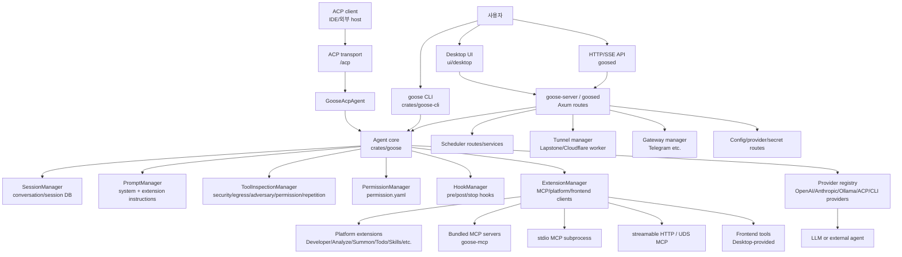

핵심 실행 축은 `Agent.reply()`다. CLI와 server, ACP agent가 결국 core `Agent`를 만들고, 이 agent가 provider completion, tool request 분류, inspection, approval, MCP/platform dispatch, session persistence를 담당한다.

## 5. Crate와 모듈 지도

```text
crates/goose/
  src/agents/agent.rs
    Agent 본체. reply loop, provider streaming, tool approval, hook, compaction, metrics.
  src/agents/extension_manager.rs
    MCP/platform/frontend extension lifecycle, tool prefixing, dispatch, resource/prompt access.
  src/agents/extension.rs
    ExtensionConfig 모델. stdio/http/builtin/platform/frontend/inline_python.
  src/agents/platform_extensions/
    in-process tools. developer, analyze, summon, orchestrator, skills, todo, apps, etc.
  src/config/permission.rs
    permission.yaml 기반 AlwaysAllow/AskBefore/NeverAllow 저장.
  src/permission/
    permission inspector/judge/confirmation/store.
  src/providers/
    provider registry and implementations.
  src/recipe/
    recipe yaml/json model, validation, template, subrecipe, security warnings.
  src/acp/
    ACP provider/server/transport/routes.
  src/session/
    session DB, import/export, schedule metadata, nostr share.
  src/security/
    security/egress/adversary inspectors.

crates/goose-cli/
  src/main.rs
    Tokio runtime bootstrap, logging, CLI dispatch.
  src/cli.rs
    clap command tree. session/run/acp/serve/mcp/schedule/gateway/review/etc.
  src/session/builder.rs
    provider/model/session/extension resolution and CliSession construction.
  src/session/*
    terminal interactive loop, output formats, resume/fork/no-session.

crates/goose-server/
  src/commands/agent.rs
    goosed agent server bootstrap. REST router + ACP router + CORS + token middleware.
  src/routes/
    reply/session/agent/config/recipe/schedule/tunnel/gateway/setup/telemetry/etc.
  src/state.rs
    AppState, AgentManager, TunnelManager, GatewayManager, extension loading tasks.
  src/auth.rs
    X-Secret-Key/token middleware.

crates/goose-mcp/
  src/lib.rs
    builtin MCP registry. autovisualiser/computercontroller/memory/tutorial.
  src/computercontroller/
    desktop/document/file interaction tools.
  src/subprocess.rs
    login shell PATH resolution for MCP subprocesses.

ui/
  desktop
    Electron app.
  text
    `goose tui` npm package.
  goose-binary
    platform-specific binary npm packages.
```

## 6. CLI 실행 흐름

`goose` binary의 entrypoint는 `crates/goose-cli/src/main.rs`다. Windows ANSI 처리를 켠 뒤, 별도 thread에 8MB stack으로 Tokio multi-thread runtime을 만들고 `goose_cli::cli::cli()`를 실행한다. 별도 thread/stack 선택은 큰 clap tree, async runtime, provider/extension 초기화에서 stack 여유를 확보하려는 설계로 보인다.

대표 명령군은 다음과 같다.

- `goose configure`: provider/config 설정
- `goose info`, `goose doctor`: 상태 확인
- `goose session`: interactive session, resume/fork/history/session list/export/import/diagnostics
- `goose run`: instruction file/stdin/text/recipe 기반 비대화형 실행
- `goose acp`: stdio ACP agent server
- `goose serve`: HTTP/WebSocket ACP server
- `goose mcp`: bundled MCP server 실행
- `goose schedule`: recurring scheduled job
- `goose gateway`: Telegram 등 외부 platform gateway
- `goose plugin`, `goose skills`: plugin/skill 관리
- `goose term`: shell hook 기반 terminal-integrated session
- `goose tui`: npm 기반 terminal UI
- `goose review`: 로컬 diff review와 `.agents/checks/*.md` subagent reviewer
- `goose local-models`: local inference feature 사용 시 모델 검색/다운로드/삭제

### 6.1 SessionBuilder 흐름

`crates/goose-cli/src/session/builder.rs`의 `build_session()`이 CLI session의 중심이다.

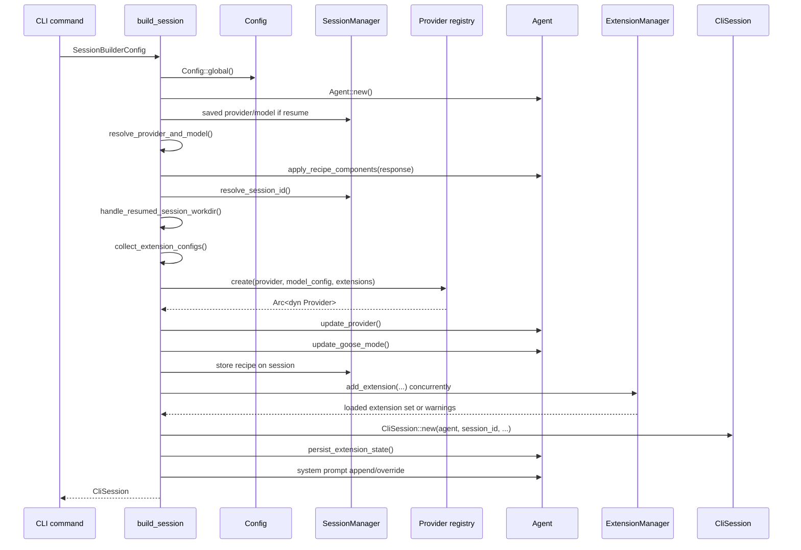

provider와 model 우선순위는 보수적으로 정해져 있다.

1. CLI `--provider`, `--model`
2. resume session에 저장된 provider/model
3. recipe `settings.goose_provider`, `settings.goose_model`
4. global config `GOOSE_PROVIDER`, `GOOSE_MODEL`
5. 없으면 `goose configure`를 요구하고 종료

session id는 다음처럼 갈린다.

- `--no-session`: hidden session을 만들지만 저장 목적이 아니라 임시 실행으로 사용
- `--resume --session-id`: 해당 session 존재 여부 확인
- `--resume`만 사용: 가장 최근 session 선택
- 새 session: `SessionManager.create_session(current_dir, "CLI Session", SessionType::User, goose_mode)`

중요한 특징은 extension loading이다. `load_extensions()`는 `JoinSet`으로 여러 extension을 병렬 시작한다. 실패한 extension은 yellow warning과 “시작 후 goose에게 해당 extension debugging을 요청하라”는 hint를 출력하고, session은 계속 시작한다. 사용자 경험상 좋지만, 보안/정확성 면에서는 “필수라고 생각한 extension이 빠진 채 계속 실행”될 수 있다.

### 6.2 Run mode와 interactive mode

`goose session`은 `build_session()` 후 `session.interactive(None)`로 들어간다.

`goose run`은 input source를 먼저 결정한다.

- `--instructions FILE` 또는 `-` stdin
- `--text TEXT`
- `--recipe RECIPE`
- `--params KEY=VALUE`
- `--system TEXT`
- `--interactive`이면 initial input 처리 후 interactive mode 유지
- `--output-format text|json|stream-json`
- `--quiet`이면 session metadata 출력 최소화

즉 interactive와 run은 거의 같은 core session builder를 공유하고, 차이는 user input 공급 방식과 output renderer다.

## 7. Agent 핵심 루프

`crates/goose/src/agents/agent.rs`의 `Agent`는 provider, session manager, permission manager, extension manager, prompt manager, tool confirmation router, tool inspection manager, hook manager를 소유한다.

### 7.1 Agent 구성

`Agent::new()`은 global config에서 goose mode를 읽고 다음을 만든다.

- `SessionManager::instance()`
- `PermissionManager::instance()`
- `ExtensionManager::new(...)`
- `PromptManager::new()`
- `ToolConfirmationRouter::new()`
- `ToolInspectionManager`
  - `SecurityInspector`
  - `EgressInspector`
  - `AdversaryInspector`
  - `PermissionInspector`
  - `RepetitionInspector`
- `HookManager::load(current_dir)`

Desktop platform이면 MCP UI capability와 login shell PATH 사용이 기본으로 켜진다. CLI platform에서는 MCP UI capability가 기본 false다.

### 7.2 Reply loop

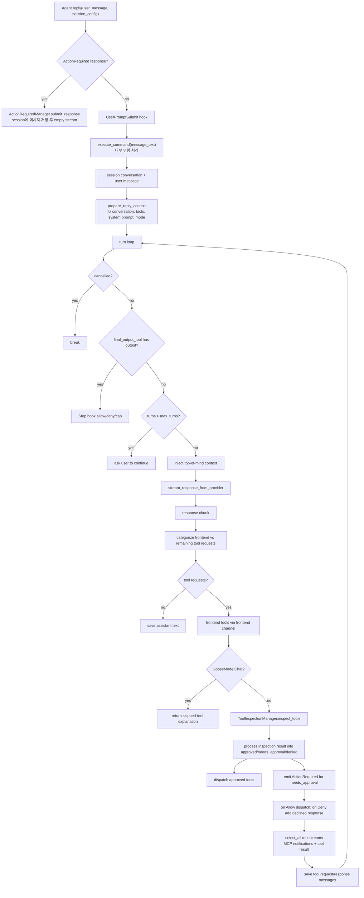

핵심 포인트는 provider가 tool call을 생성하더라도 곧장 실행하지 않는다는 점이다. tool request는 먼저 frontend tool과 extension tool로 나뉘고, extension tool은 inspector pipeline과 permission pipeline을 지난다.

### 7.3 Provider streaming

`Agent::stream_response_from_provider()`는 provider를 호출해 streaming response를 얻는다. provider는 `crates/goose/src/providers/base.rs`의 `Provider` trait 구현체이며, `complete()`/streaming 계열 API와 model config, permission routing을 가진다.

provider registry는 `crates/goose/src/providers/init.rs`에서 초기화된다. registry는 다음 계열을 모두 포함한다.

- API provider: Anthropic, OpenAI, Google, Azure, OpenRouter, Ollama, Databricks, HuggingFace, XAI, NanoGPT, LiteLLM 등
- Cloud/AWS feature provider: Bedrock, SageMaker TGI
- local inference feature provider
- 외부 agent/ACP provider: Claude Code, Claude ACP, Codex, Codex ACP, ChatGPT Codex, Gemini CLI, Gemini OAuth, Cursor Agent, Copilot ACP, Amp ACP, Pi ACP, Kimi Code 등
- declarative custom providers

이 registry 구조 덕분에 goose의 agent loop는 provider별 API 차이를 거의 모르고, provider는 goose message/tool schema를 각 backend protocol로 변환한다.

## 8. Tool dispatch와 권한 모델

### 8.1 GooseMode

`PermissionInspector.inspect()` 기준으로 mode별 동작은 다음과 같다.

- `Chat`: tool request를 실행하지 않는다. “goose chat mode에서 tool call이 skip됐다”는 계획 설명을 tool response로 넣는다.
- `Auto`: 모든 tool을 승인한다.
- `Approve`: user permission과 tool annotation을 보고, 모르는 tool은 승인 요청한다.
- `SmartApprove`: read-only annotation 또는 LLM read-only detection/cache를 활용해 일부 tool을 자동 승인하고, 나머지는 승인 요청한다.

`Auto`는 강력하지만 위험하다. 로컬 shell/file/network extension이 연결된 상태에서 prompt injection을 만나면 승인 없이 실행될 수 있다.

### 8.2 PermissionManager

권한은 config directory의 `permission.yaml`에 저장된다.

```yaml
user:
  always_allow: [...]
  ask_before: [...]
  never_allow: [...]
smart_approve:
  always_allow: [...]
  ask_before: [...]
  never_allow: [...]
```

`PermissionLevel`은 세 가지다.

- `AlwaysAllow`
- `AskBefore`
- `NeverAllow`

user permission이 smart approve보다 우선한다. write/destructive annotation이 있는 tool은 `PermissionManager.apply_tool_annotations()`가 smart approve ask-before로 기록한다.

### 8.3 SmartApprove read-only judge

`permission_judge.rs`는 provider에게 별도 tool `platform__tool_by_tool_permission`을 제시해 현재 tool request 중 read-only operation을 판단하게 한다. 판단 기준은 SELECT/query/list/read와 insert/update/delete/write/POST/PUT/DELETE 구분이다.

이 방식은 사용성을 높이지만 완벽한 정적 보안이 아니다. tool name과 arguments를 LLM이 판단하므로, tool description이 애매하거나 side effect가 숨겨진 API는 read-only로 오판될 수 있다. goose는 결과를 smart approve permission에 cache하기 때문에 최초 판단 품질이 중요하다.

### 8.4 ActionRequired approval

승인 필요 tool은 `ToolConfirmationRouter`를 통해 oneshot channel에 등록된다.

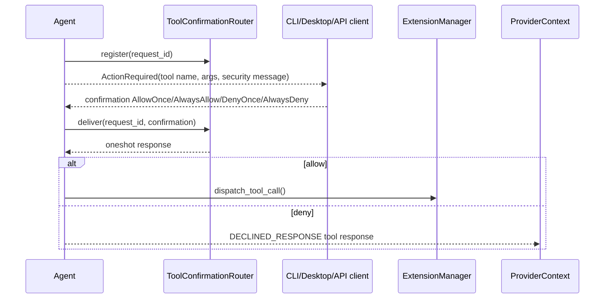

provider가 `PermissionRouting::ActionRequired`를 지원하면 confirmation을 provider 쪽으로 먼저 전달한다. 아니면 local router로 전달한다.

### 8.5 Inspector pipeline

Agent는 ToolInspectionManager를 만들 때 다음 inspector를 등록한다.

1. `SecurityInspector`
2. `EgressInspector`
3. `AdversaryInspector`
4. `PermissionInspector`
5. `RepetitionInspector`

권한 결과는 permission inspector 결과를 baseline으로 삼고, security/egress/adversary/repetition 결과가 override한다. 반복 도구 호출 방지는 `--max-tool-repetitions`와 `RepetitionInspector` 축으로 이어진다.

## 9. Extension/MCP 아키텍처

goose의 extension model은 `ExtensionConfig` 하나로 수렴한다.

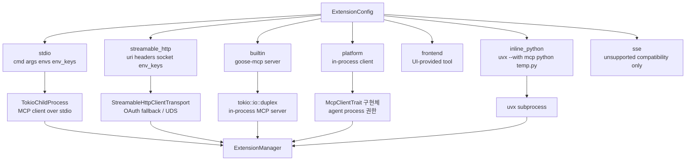

### 9.1 Extension startup

`ExtensionManager.add_extension()`은 다음을 수행한다.

1. extension name을 key로 normalize한다.
2. unresolved config와 secret substituted resolved config를 비교해 변경이 없으면 restart하지 않는다.
3. working directory를 explicit 값, `GOOSE_WORKING_DIR`, current dir 순서로 결정한다.
4. type별 client를 만든다.
5. MCP initialize 후 `server_info`를 저장한다.
6. tools cache를 invalidate한다.

stdio extension은 `envs`와 `env_keys`를 merge한다. `env_keys`는 goose config/secret store에서 읽어 직접 env map에 넣는다. 환경변수 denylist가 있어 `PATH`, `LD_PRELOAD`, `DYLD_INSERT_LIBRARIES`, `NODE_OPTIONS`, `PYTHONPATH`, `CLASSPATH`, Windows profile/temp 관련 key 등 process hijacking 위험이 큰 key는 거부한다.

stdio command 실행 전 `extension_malware_check::deny_if_malicious_cmd_args(cmd, args)`를 호출한다. 이 방어가 있다는 것은 외부 MCP package 실행을 명시적 위험으로 보고 있다는 뜻이다.

### 9.2 Tool prefixing

MCP server가 `read_file` tool을 제공하더라도 goose에 노출될 때는 기본적으로 `extension__read_file` 형태가 된다.

예외는 platform extension의 `unprefixed_tools`다. `developer`, `analyze`, `summon`, `skills`, `code_execution` 등 일부 first-class extension은 tool을 prefix 없이 노출한다. 사용성은 좋지만, 같은 이름 충돌 위험이 생기므로 `ExtensionManager.fetch_all_tools()`는 duplicate tool name을 발견하면 warning 후 skip한다.

tool meta에는 `goose_extension` owner가 삽입된다. dispatch 시 이 owner를 보고 실제 extension client와 actual tool name을 찾는다.

### 9.3 Tool dispatch

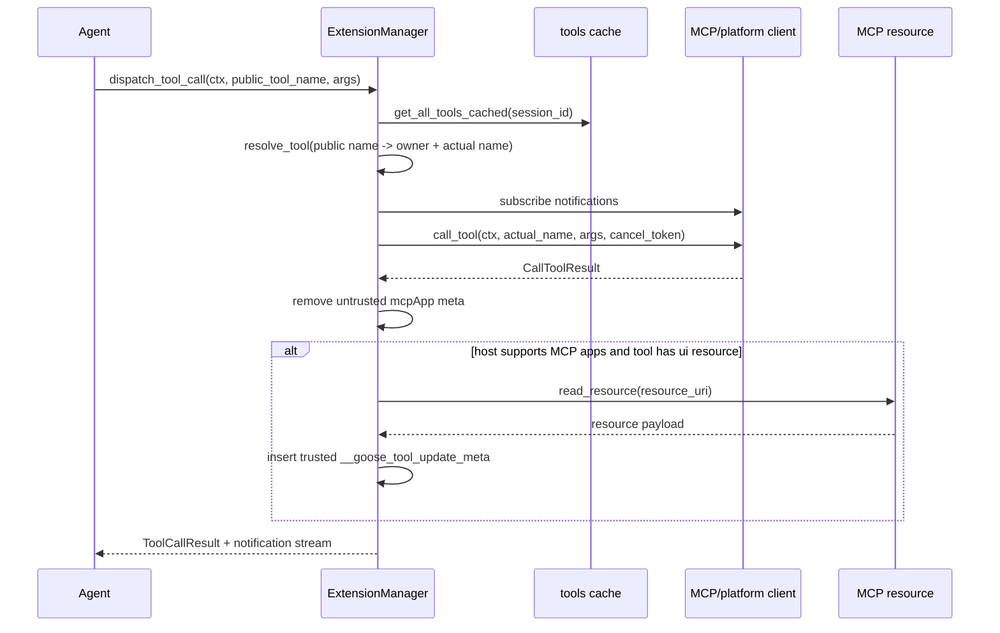

MCP result가 임의로 `goose.mcpApp` 또는 `__goose_tool_update_meta`를 넣을 수 없도록 `remove_untrusted_mcp_app_meta()`가 먼저 제거한다. 이후 host가 MCP app을 지원하고 해당 tool에 `ui.resourceUri`가 있으면 goose가 직접 resource를 읽어 trusted meta로 다시 삽입한다. MCP app/UI 연결에서 중요한 방어 코드다.

## 10. Platform extensions

`crates/goose/src/agents/platform_extensions/mod.rs`는 in-process extension registry다.

기본/중요 extension:

- `developer`
  - display name: Developer
  - default enabled: true
  - unprefixed tools: true
  - 기능: `write`, `edit`, `shell`, `tree`, `read_image`
- `analyze`
  - default enabled: true
  - unprefixed tools: true
  - tree-sitter 기반 code structure, symbol/call graph 분석
- `todo`
  - default enabled: true
  - prefixed
  - agent todo list
- `apps`
  - default enabled: true
  - HTML/CSS/JS custom Goose app 생성/관리
- `extensionmanager`
  - default enabled: true
  - extension 검색/활성/비활성/resource read
- `summon`
  - default enabled: true
  - unprefixed
  - subagent delegation, recipe/agent source discovery
- `skills`
  - default enabled: true
  - unprefixed
  - filesystem/builtin skill instructions discovery
- `tom`
  - default enabled: true
  - Top Of Mind. `GOOSE_MOIM_MESSAGE_TEXT`, `GOOSE_MOIM_MESSAGE_FILE`를 매 turn context에 주입
- `chatrecall`
  - default false
  - past conversation search/session summary
- `summarize`
  - default false
  - file/directory summary
- `code_execution`
  - feature `code-mode`
  - tool call을 code execution 경유로 바꿔 token 절약
- `orchestrator`
  - default false
  - hidden true
  - session list/view/start/send/interrupt 같은 multi-agent session management

`orchestrator`가 hidden인 점은 중요하다. 일반 extension 검색에는 보이지 않지만, 존재하면 세션을 시작하고 메시지를 보내고 interrupt할 수 있는 관리 기능을 가진다. enterprise/advanced workflow에는 강력하지만, 무심코 활성화하면 agent가 다른 agent session을 조작하는 표면이 열린다.

### 10.1 Developer extension

`DeveloperClient`는 MCP client trait을 직접 구현한다. tool schema는 다음이다.

- `write`: 파일 생성/overwrite, parent directory 생성
- `edit`: exact unique find/replace
- `shell`: 현재 directory에서 shell command 실행
- `tree`: `.gitignore`를 존중하는 directory tree + line counts
- `read_image`: local path 또는 http(s) image read

tool annotation:

- `tree`, `read_image`: read-only true
- `write`, `edit`, `shell`: read-only false, destructive true

`shell`은 OS별로 shell을 고른다.

- Unix: `GOOSE_SHELL`이 있으면 사용, 없으면 `bash`, 없으면 `sh`
- Windows: `GOOSE_SHELL`이 있으면 사용, 없으면 `cmd`
- Flatpak: `flatpak-spawn --host --watch-bus` 사용
- Desktop PATH 문제: login shell을 background로 실행해 PATH를 resolve하고 첫 shell call에서 기다린다.

출력은 stdout/stderr를 분리한 structured content로 반환한다. 2,000 lines, 50,000 bytes 제한이 있고, 긴 출력은 temp file에 저장한 뒤 truncation notice를 별도 content block으로 넣는다. 이 구조는 모델 context 폭주를 줄이지만, temp output path가 세션 내에서 노출될 수 있다.

### 10.2 Extension Manager extension

`extensionmanager`는 다음 tool을 제공한다.

- `search_available_extensions`
- `manage_extensions`
- `list_resources`
- `read_resource`

`MANAGE_EXTENSIONS_TOOL_NAME_COMPLETE`는 `extensionmanager__manage_extensions`다. PermissionInspector는 이 tool에 대해 “Extension management requires approval for security” 메시지를 붙여 approval을 요구한다. 즉 agent가 임의로 extension을 켜서 capability를 확장하려는 행위를 별도 위험으로 분리한다.

단, approval이 떨어지면 `manage_extensions_impl()`은 global config에서 extension을 찾아 `ExtensionManager.add_extension(config, None, None, None)`을 호출한다. 이때 새 extension은 현재 session의 working dir/context에서 시작된다.

### 10.3 Summon과 subagent

`summon`은 filesystem source discovery를 한다.

검색 위치:

- local recipes: current working dir, `.goose/recipes`, `.agents/recipes`
- global recipes: `GOOSE_RECIPE_PATH`, `~/.goose/recipes`, config `recipes`, `~/.agents/recipes`
- local agents: `.goose/agents`, `.claude/agents`, `.agents/agents`
- global agents: `~/.goose/agents`, `~/.agents/agents`, config `agents`, `~/.claude/agents`

agent file은 Markdown frontmatter에서 `name`, `description`, `model` 등을 읽고 body를 agent content로 사용한다. 즉 goose는 Claude-style `.claude/agents`도 source로 받아들이는 cross-agent ecosystem 전략을 취한다.

## 11. Builtin MCP servers

`crates/goose-mcp/src/lib.rs`는 builtin MCP servers를 등록한다.

- `autovisualiser`
- `computercontroller`
- `memory`
- `tutorial`
- macOS feature: `peekaboo`

`goose mcp <server>` 또는 `goosed mcp <server>`로 별도 server처럼 실행할 수 있고, core에서 builtin extension으로 켜면 tokio duplex stream으로 in-process MCP server를 띄운다. Docker container option이 있으면 builtin extension도 container 내부의 `goose mcp <name>`을 `docker exec -i`로 실행한다.

`computercontroller`는 docx/pdf/xlsx tooling까지 포함한다. 이름처럼 화면/문서/컴퓨터 조작 surface를 넓히므로, 기본 developer extension보다 더 넓은 local interaction 위험을 갖는다.

## 12. Recipe와 workflow

Recipe 모델은 `crates/goose/src/recipe/mod.rs`에 있다.

주요 field:

- `version`
- `title`
- `description`
- `instructions`
- `prompt`
- `extensions`
- `settings`
  - `goose_provider`
  - `goose_model`
  - `temperature`
  - `max_turns`
- `activities`
- `author`
- `parameters`
- `response`
  - JSON schema
- `sub_recipes`
- `retry`

`Recipe::from_content()`는 JSON/YAML을 모두 받아들이고, YAML에 `recipe:` nested key가 있어도 파싱한다. 파싱 후 자동 보정이 있다.

- recipe가 old builtin `developer`를 포함하고 `analyze`가 없으면 `analyze` platform extension을 자동 추가한다.
- `sub_recipes`가 있으면 `summon` platform extension을 자동 추가한다.

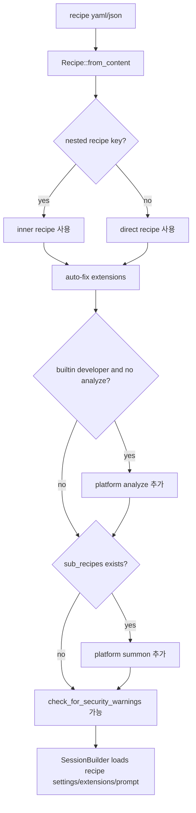

`check_for_security_warnings()`는 `instructions`, `prompt`, `activities`에 Unicode tag/private-use성 숨김 문자가 있는지 검사한다. 테스트에는 `\u{E0041}`, `\u{E0042}` 같은 숨김 문자를 악성 activity/prompt 예로 둔다. 다만 이 함수는 warning check이고, 모든 실행 경로에서 hard block이 되는지는 별도 UI/CLI 호출부에 달려 있다.

Recipe는 편의 기능인 동시에 supply-chain surface다. recipe는 provider/model/temperature/max_turns, extension set, prompt, subrecipe delegation을 바꿀 수 있다. 외부 recipe를 열 때는 code와 같은 수준으로 검토해야 한다.

## 13. Server, Desktop, ACP

### 13.1 goosed server

`goosed agent`는 `crates/goose-server/src/commands/agent.rs`에서 시작한다.

흐름:

1. rustls crypto provider 설정
2. logging setup
3. `Settings::new()`
4. `GOOSE_SERVER__SECRET_KEY` env가 있으면 사용, 없으면 random 32-byte hex 생성
5. `AppState::new(settings.tls)`
6. tunnel manager에 같은 server secret 전달
7. REST router 구성 후 `check_token` middleware 적용
8. ACP router 구성 후 `check_acp_token` middleware 적용
9. CORS Any
10. tunnel/gateway auto-start check task spawn
11. TLS면 rustls/openssl server, 아니면 TCP listener

기본 설정:

- host: `127.0.0.1`
- port: `3000`
- tls: `true`

REST routes는 다음을 merge한다.

- `/status`, `/features`
- `/reply`
- `/action_required`
- `/agent`
- `/config/*`
- `/prompts`
- `/recipes`
- `/sessions`
- `/schedule`
- `/setup`
- `/telemetry`
- `/tunnel`
- `/gateway`
- `/mcp-ui-proxy`, `/mcp-app-proxy`
- `/session_events`
- `/sampling`
- `/dictation`
- local inference routes if feature enabled

### 13.2 `/reply` SSE flow

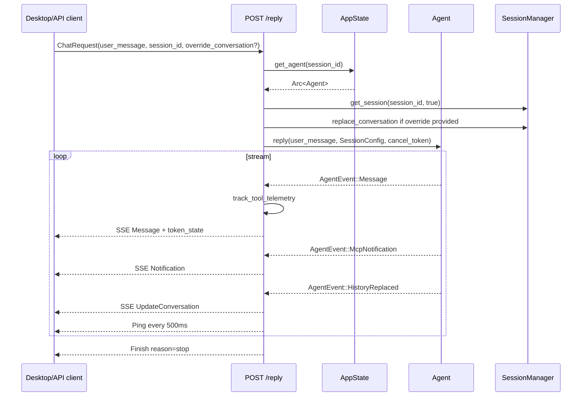

`ChatRequest.override_conversation`은 “normal operations에서는 server가 source of truth”라고 주석이 붙어 있지만, admin/absolute control을 위해 존재한다. 이 endpoint를 외부에 노출하면 conversation state를 임의로 바꿀 수 있으므로 secret과 bind address가 중요하다.

### 13.3 Auth와 CORS

`crates/goose-server/src/auth.rs`의 `check_token`은 `X-Secret-Key` header를 constant-time compare한다. `/status`, `/features`, `/mcp-ui-proxy`, `/mcp-app-proxy`, `/mcp-app-guest`는 middleware에서 제외된다. proxy route들은 query/body secret을 별도로 확인한다.

ACP는 header `X-Secret-Key` 또는 query `token`을 허용한다. query token은 WebSocket/SSE 호환성 측면에서 편하지만, proxy/server log에 남을 수 있어 운영상 header보다 민감하다.

CORS는 REST와 ACP 모두 넓게 열린다. 기본 host가 loopback이므로 로컬 앱 UX를 우선한 선택이다. 그러나 host를 `0.0.0.0`으로 열거나 tunnel/gateway를 켜면 secret 관리가 방어선이 된다.

### 13.4 ACP transport

ACP HTTP transport는 `/acp`에서 GET/POST/DELETE와 WebSocket upgrade를 처리한다.

- initialize request는 connection을 만들고 `Acp-Connection-Id` header로 반환한다.
- 이후 request는 `Acp-Connection-Id` header가 필수다.
- session-scoped method는 `Acp-Session-Id` header가 필요하다.
- GET은 `Accept: text/event-stream`이어야 한다.
- batch JSON-RPC는 not implemented다.

`goose serve`는 CLI에서 별도 ACP server를 띄운다. 기본 host는 `127.0.0.1`, port는 `3284`, builtin은 기본 `developer`다. secret은 `GOOSE_SERVER__SECRET_KEY` 또는 `goose-acp-<random>` 형태로 생성한다.

## 14. Tunnel, gateway, scheduler

### 14.1 Tunnel

`TunnelManager`는 local `goosed`를 외부 Cloudflare worker proxy로 연결하는 기능을 가진다. 기본 worker URL은 코드상 `https://cloudflare-tunnel-proxy.michael-neale.workers.dev`이며, `GOOSE_TUNNEL_WORKER_URL`로 override할 수 있다.

구조:

- `tunnel_auto_start`, `tunnel_secret`, `tunnel_agent_id`를 config/secret store에 저장
- `tunnel.lock`으로 한 인스턴스만 tunnel 실행
- 외부 worker와 websocket 연결
- 외부 요청의 `x-secret-key`는 tunnel secret과 비교
- local goosed로 전달할 때 `X-Secret-Key`를 server secret으로 교체

위험:

- tunnel은 로컬 server를 외부에서 접근 가능하게 만든다.
- tunnel secret과 server secret이 분리되어 있지만 둘 중 하나의 저장/전송/logging 문제가 있으면 endpoint 노출로 이어질 수 있다.
- `secure_compare`는 hash 비교 방식이다. 일반적인 constant-time byte compare보다 엄밀성이 낮다. server auth 쪽은 `subtle::ConstantTimeEq`를 쓰므로 일관성도 다르다.

### 14.2 Gateway

CLI와 server route에는 `gateway`가 있다. CLI 예시는 Telegram bot token을 받는다. Gateway는 외부 chat platform을 agent session과 연결할 수 있으므로, bot token, pairing code, 외부 사용자 인증/권한 경계가 중요하다.

### 14.3 Scheduler

`goose schedule`과 server `/schedule` routes는 recipe source와 params, cron expression으로 recurring job을 만든다. scheduled session은 `SessionType::Scheduled`와 `scheduled_job_id`를 가진다.

스케줄러는 편리하지만 “나중에 자동 실행되는 agent”다. recipe와 extension, provider credential, working directory가 결합되므로 운영자는 schedule 등록 시점의 trust만이 아니라 이후 파일/환경 변화도 고려해야 한다.

## 15. 숨은 표면과 덜 보이는 기능

분석 중 눈에 띈 덜 보이는 표면은 다음과 같다.

- `.goosehints`, `.claude/`, `.codex/`, `.cursor/`
  - 다른 agent ecosystem과 공존/호환하려는 흔적이다.
- `orchestrator` platform extension
  - hidden true. 세션 관리/하위 agent 조작 기능.
- `tom` Top Of Mind
  - `GOOSE_MOIM_MESSAGE_TEXT`, `GOOSE_MOIM_MESSAGE_FILE`이 매 turn에 context injection될 수 있다.
- `inline_python` extension
  - recipe/config에서 inline Python code를 temp file로 쓰고 `uvx --with mcp python <file>`로 실행한다.
- `oidc-proxy`
  - enterprise/OIDC integration surface로 보인다.
- `tunnel`
  - 외부 worker 기반 local server 노출.
- `gateway`
  - Telegram 등 외부 platform integration.
- `Nostr`
  - session export/import/share route와 CLI 옵션이 feature-gated로 존재한다.
- `recipe-scanner`
  - recipe 보안 scanning script. shell script가 URL download path도 갖는다.
- `workflow_recipes`
  - release risk check 같은 internal workflow recipe.
- `vendor/v8`
  - workspace patch로 `v8` crate를 vendor override한다.
- `sigstore-verify`
  - update feature에서 사용된다. update path는 supply-chain 검증의 핵심이다.
- `local-inference`
  - llama.cpp/candle/cudaforge/HuggingFace model download 등 별도 dependency와 model supply chain 표면.
- `mcp_app_proxy`, `mcp_ui_proxy`
  - MCP app UI resource를 browser-visible HTML로 proxy한다. secret과 CSP 처리 중요.

## 16. 위험요소와 이상한 점

### 16.1 로컬 머신 권한이 본질적으로 강하다

goose는 developer agent다. `SECURITY.md`도 developer agent가 로컬 머신에서 code 실행과 action 수행 권한을 가지므로 chat-only LLM보다 위험하다고 경고한다. 기본 developer extension만으로도 shell, write, edit가 가능하다.

실무 권장:

- 기본은 `Approve` 또는 `SmartApprove`로 두고, `Auto`는 신뢰된 작업/격리된 directory에서만 사용한다.
- working directory를 좁히고, 민감 파일이 있는 home/root에서 실행하지 않는다.
- shell command와 file write는 AlwaysAllow로 넓게 열지 않는다.

### 16.2 MCP extension은 코드 실행/네트워크 실행 경계다

stdio MCP는 local subprocess다. streamable HTTP MCP는 remote server다. inline Python은 temp file + `uvx` 실행이다. extension env denylist와 malware check가 있지만, extension 자체의 logic은 goose 밖이다.

위험:

- 악성 npm/pip MCP package
- remote MCP endpoint의 tool schema/description prompt injection
- HTTP headers/env_keys secret leakage
- UDS socket으로 local service 접근
- extension 시작 실패가 warning 후 continue라서 기대 capability와 실제 capability가 다를 수 있음

### 16.3 Runtime extension management

`extensionmanager__manage_extensions`는 approval을 요구하지만, 승인 후에는 agent가 extension을 enable/disable한다. 이건 agent capability set을 런타임에 바꾸는 기능이다.

위험:

- “이 작업에 필요하다”는 모델 설명을 믿고 강력한 extension을 활성화할 수 있음
- extension description 자체가 prompt로 들어오므로 외부 extension은 prompt injection source가 될 수 있음

### 16.4 Recipe supply chain

recipe는 provider/model/temperature/max_turns, prompt, extensions, subrecipes, response schema를 포함한다. `sub_recipes`는 `summon`을 자동 활성화한다. Unicode tag warning은 있지만 모든 경로에서 hard block이라고 보기 어렵다.

위험:

- 숨김 Unicode tag로 instruction/prompt/activity에 보이지 않는 지시 삽입
- recipe가 extension을 추가해 권한 표면 확대
- `parameters` file input은 민감 파일 import를 막으려 default 제한을 두지만, prompt/extension으로 우회 가능
- external recipe URL/manifest workflow는 supply chain 관리 필요

### 16.5 Server 노출과 CORS

goosed는 기본 loopback이지만 CORS Any다. secret middleware가 핵심 방어선이다.

위험:

- host를 `0.0.0.0`으로 바꾸고 secret이 유출되면 `/reply`, `/config`, `/sessions`, `/agent`, `/schedule`, `/tunnel` 모두 접근 가능
- ACP query token은 log에 남을 수 있음
- `/status`, `/features`는 unauthenticated
- proxy routes는 middleware 제외 후 자체 secret을 검사하므로 route별 검증 누락이 있으면 영향이 큼

### 16.6 Tunnel/gateway는 외부 inbound path다

tunnel은 local server를 외부 worker를 통해 노출한다. gateway는 Telegram 같은 external platform을 agent와 연결한다. 이 둘은 “로컬 tool 권한을 가진 agent”에 외부 입력을 넣는 경로다.

위험:

- 외부 사용자의 prompt injection
- bot token/pairing secret 관리
- tunnel worker trust
- tunnel secret/server secret 혼동

### 16.7 Hidden orchestrator

`orchestrator`는 hidden extension이고 default disabled지만, 활성화되면 agent가 session list/view/start/send/interrupt를 수행한다. multi-agent 작업에는 중요하지만, 일반 사용자가 extension search에서 보지 못하는 관리 기능이라는 점에서 감사/문서화가 필요하다.

### 16.8 Telemetry와 session 공유

CLI default features에는 `telemetry`, `otel`이 포함된다. config/consent dialog가 있지만 custom distro 문서도 telemetry(PostHog)를 언급한다. Nostr share/import, diagnostics export, session import/export도 존재한다.

위험:

- prompt/tool/session metadata가 trace/log/share artifact에 남을 수 있음
- custom distro가 telemetry 설정을 다르게 둘 수 있음
- diagnostics zip/export에 민감 conversation이 포함될 수 있음

### 16.9 업데이트/배포 supply chain

`download_cli.sh`, `download_cli.ps1`, npm binary packages, update feature, sigstore verify가 존재한다. sigstore 검증을 포함하는 점은 긍정적이지만, install/update path는 항상 supply-chain surface다.

위험:

- script pipe install 관행
- platform-specific npm binary package 신뢰
- feature `disable-update` 여부에 따른 배포 차이

### 16.10 Toolchain 이상점

root `Cargo.toml`은 `rust-version = "1.91.1"`이고 `rust-toolchain.toml` 때문에 로컬 실행 시 rustup이 더 최신 `1.92` channel을 동기화하려고 했다. 이 환경에서는 `cargo metadata`와 `cargo check`가 rustup component download 오류로 실패했다. repository 자체 문제라기보다는 분석 환경의 rustup 상태 문제로 보인다.

## 17. 실행 검증 결과

시도한 검증:

- `rustc --version`
  - `rustc 1.92.0 (ded5c06cf 2025-12-08)` 확인
- `cargo --version`
  - `cargo 1.92.0 (344c4567c 2025-10-21)` 확인
- `node --version`
  - `v23.4.0` 확인
- `pnpm --version`
  - `/opt/homebrew/bin/pnpm --version`에서 장시간 멈춰 수동 종료
- `cargo metadata --no-deps --format-version 1`
  - rustup이 `1.92-aarch64-apple-darwin` channel component를 받으려다 `clippy-aarch64-apple-darwin` 다운로드 파일 rename 오류로 실패
- `cargo check -p goose-cli --no-default-features`
  - 동일 rustup component download 오류로 실패

검증 결론:

- Rust/Node 자체는 존재한다.
- 이 환경에서는 rustup component download 상태 때문에 cargo 기반 compile/metadata 검증을 완료하지 못했다.
- 보고서의 architecture/flow 분석은 실제 source read 기준이며, full build/runtime behavior 검증은 별도 clean rustup/toolchain 환경에서 재시도해야 한다.

## 18. 핵심 차별점

goose의 차별점은 다음이다.

1. Rust core와 product surface의 결합
   - agent loop, extension manager, permission manager, server, CLI가 Rust workspace로 통합되어 있다.

2. MCP 중심의 extension runtime
   - 외부 tool 생태계를 MCP로 연결하고, builtin/platform/frontend/stdio/http/inline Python을 같은 추상화로 다룬다.

3. ACP provider/server 양방향성
   - goose 자신이 ACP agent/server가 될 수 있고, 동시에 ACP 기반 외부 provider/agent를 호출할 수 있다.

4. provider 다양성
   - API provider뿐 아니라 기존 agent CLI와 subscription 기반 tool을 provider로 감싼다.

5. 권한/검사 pipeline
   - mode, user permission, smart approve, LLM read-only judge, security/egress/adversary/repetition inspector, action-required UX가 결합되어 있다.

6. 로컬 workflow 플랫폼화
   - recipe, schedule, gateway, tunnel, terminal session, review, skill/plugin, local inference가 한 제품 안에 들어 있다.

7. 코드 분석 first-class extension
   - `analyze`가 default enabled이고 unprefixed라서 tree-sitter 기반 code graph/symbol 기능을 core workflow에 넣는다.

## 19. 사용자 관점 실행 플로우

### 19.1 처음 설치 후 interactive chat

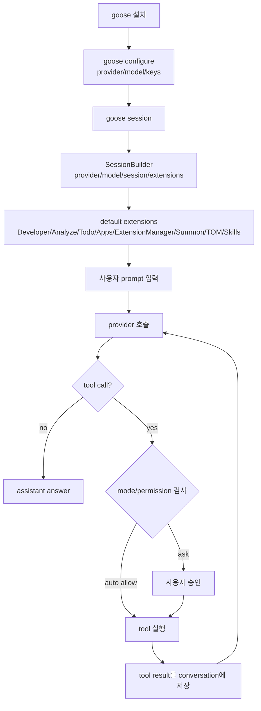

### 19.2 비대화형 작업

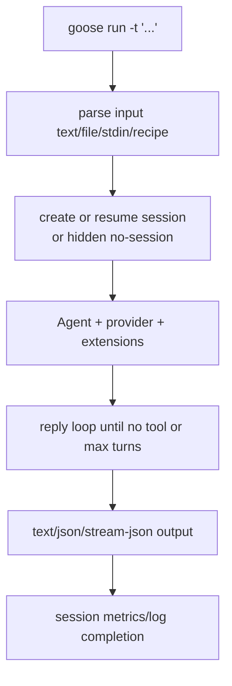

### 19.3 Desktop/API 작업

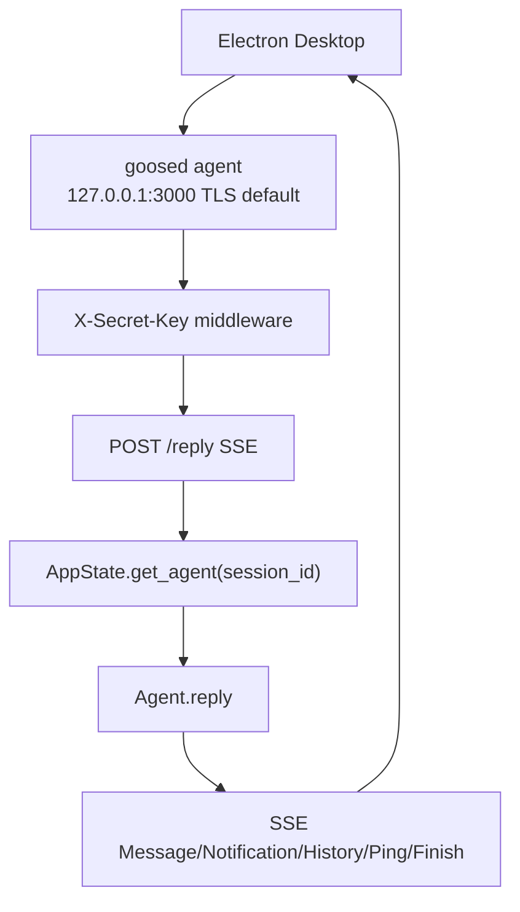

### 19.4 Extension 추가

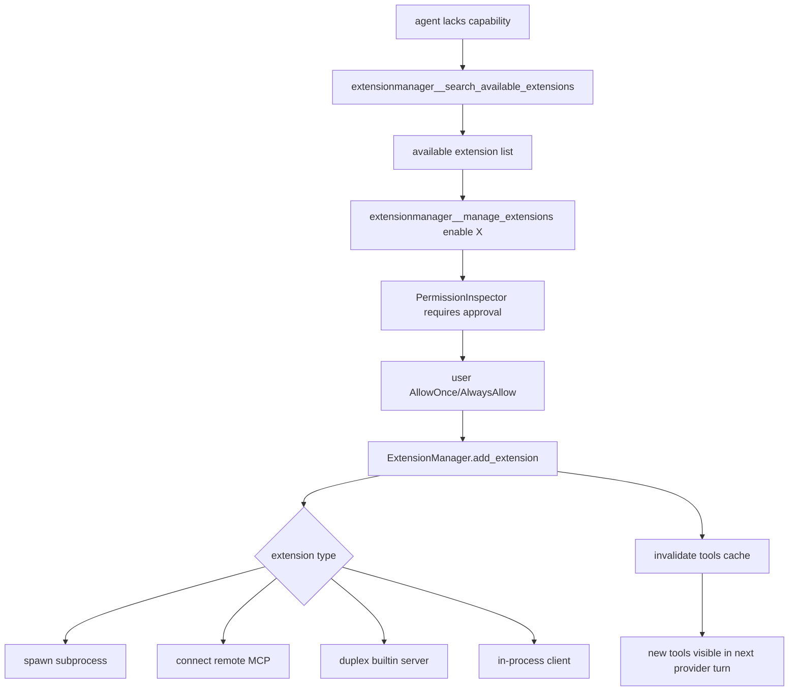

## 20. 분석 결론

goose는 “AI coding agent” 범주에 속하지만 실제 범위는 더 넓다. Codex/Gemini CLI류가 주로 터미널 agent라면, goose는 터미널 agent, desktop agent, MCP host, ACP server, local workflow runner, extension marketplace runtime, scheduled automation runner를 한 workspace에 묶는다.

설계 철학은 매우 개방적이고 실용적이다. provider와 extension을 교체 가능하게 만들고, 로컬 파일과 shell에 강하게 접근하며, recipe/skill/plugin으로 사용자 지식을 끌어온다. 동시에 이 철학은 “로컬 머신의 강한 권한을 agent에게 준다”는 뜻이다. goose를 제대로 이해하려면 단순한 prompt loop가 아니라 다음 호출 체인을 기억해야 한다.

```text
사용자 입력
  -> CLI/Desktop/API/ACP
  -> SessionBuilder/AppState/AcpServer
  -> Agent.reply
  -> Provider.complete/stream
  -> ToolRequest
  -> ToolInspectionManager
  -> PermissionManager/ActionRequired
  -> ExtensionManager.dispatch_tool_call
  -> Platform tool 또는 MCP subprocess/HTTP/builtin/frontend
  -> ToolResponse
  -> Provider 다음 turn
```

이 호출 체인을 기준으로 provider, extension, recipe, permission, server exposure, tunnel/gateway, telemetry/share/export를 각각 별도 신뢰 경계로 나누면 goose의 설계와 위험을 가장 정확히 이해할 수 있다.
