# agno-agi/agno 분석 보고서

## 1. 요약 평가

Agno는 Python 기반의 에이전트 플랫폼 SDK다. Claude Code, Codex, Gemini CLI류처럼 터미널에서 개발자의 로컬 파일을 직접 수정하는 “코딩 전용 에이전트”라기보다, 에이전트·팀·워크플로우·지식·메모리·승인·스케줄·API 서버를 하나의 제품 플랫폼으로 묶는 프레임워크다. README가 스스로를 “SDK for building agent platforms”라고 설명하는 것처럼, 핵심 질문은 “한 번의 coding task를 어떻게 해결할 것인가”가 아니라 “에이전트를 실제 운영 서비스로 어떻게 배포하고 관리할 것인가”이다.

이 프로젝트의 강점은 레이어가 매우 분명하다는 점이다. `Agent`는 모델 호출과 도구 실행의 기본 단위이고, `Team`은 여러 Agent/Team을 조율하는 협업 단위이며, `Workflow`는 결정적 pipeline과 HITL(human-in-the-loop)을 표현한다. 그 위에 `AgentOS`가 FastAPI 애플리케이션, WebSocket/SSE, MCP server, DB, approval router, schedule router, trace/metrics router, JWT/RBAC, Slack/Telegram/WhatsApp/A2A 인터페이스를 붙인다. 즉 “프레임워크 객체”와 “운영 API 서버”가 한 저장소 안에서 연결된다.

가장 큰 차별점은 생산 운영면이다. Agno는 단순히 `agent.run()`이 되는 것을 넘어 세션, 사용자 메모리, 지식 베이스, 실행 trace, 평가, 스케줄, 승인 요청, 컴포넌트 registry, remote agent/team/workflow gateway를 제공한다. 다른 프레임워크가 예제 중심의 multi-agent orchestration에 머무르는 경우가 많은 반면, Agno는 “내 DB에 상태를 저장하고, 내 API로 실행하고, 내 권한 체계로 노출한다”는 방향이 강하다.

반대로 위험도 그 넓은 표면에서 나온다. `AgentOS`는 인증을 명시적으로 구성하지 않으면 보안 dependency가 통과된다. `OS_SECURITY_KEY`나 JWT 설정 없이 외부에 띄우면 agent/team/workflow run, session, trace, memory, knowledge, schedule endpoint가 노출될 수 있다. `PythonTools`, `ShellTools`, skills, MCP stdio command, HTTP MCP header provider, ContextProvider, remote runner는 모델이 로컬 코드 실행·네트워크·외부 SaaS·비밀 값 전달 경계에 접근할 수 있게 만든다. 플랫폼 SDK로는 강력하지만, “기본 샘플을 운영에 그대로 배포”하면 위험하다.

전체적으로 Agno는 CrewAI보다 운영 API와 저장 계층이 두껍고, LangGraph보다 agent/product platform 추상화가 높은 편이며, Aider/Goose/Codex 같은 개발자 로컬 코딩 도구와는 목적 자체가 다르다. 코딩 에이전트 생태계 관점에서는 “개발자를 대신해 로컬 repo를 수정하는 도구”보다 “에이전트 기반 제품을 만들 때 필요한 서버 런타임”에 가깝다.

## 2. 기본 정보

- 저장소: `agno-agi/agno`
- 분석 커밋: `3adb736`
- 기본 브랜치: `main`
- 생성일: 2022-05-04
- 최근 push: 2026-06-10
- 최신 릴리스 관측값: `v2.6.12` / 2026-06-05
- 언어: Python
- 라이선스: Apache-2.0
- 규모: 약 4,746개 파일
- 패키지명: `agno`
- 현재 패키지 버전: `2.6.12`
- Python 요구사항: `>=3.7,<4`
- README 설명: `Build, run, and manage agent platforms`
- 주요 루트:
  - `libs/agno/agno/agent/`: 단일 Agent 런타임
  - `libs/agno/agno/team/`: multi-agent/team orchestration
  - `libs/agno/agno/workflow/`: pipeline workflow, step, loop, parallel, condition, router
  - `libs/agno/agno/os/`: AgentOS FastAPI 서버, auth, routers, scheduler, MCP server
  - `libs/agno/agno/models/`: provider-neutral model abstraction
  - `libs/agno/agno/tools/`: 150개 이상의 built-in tool/toolkit
  - `libs/agno/agno/tools/mcp/`: MCP client toolkit
  - `libs/agno/agno/context/`: ContextProvider 계층
  - `libs/agno/agno/knowledge/`: vector/search 기반 knowledge layer
  - `libs/agno/agno/memory/`: user memory extraction/search/optimization
  - `libs/agno/agno/db/`: SQLite/Postgres/MySQL/Mongo/Dynamo/Redis 등 DB adapter
  - `libs/agno/agno/tracing/`: OpenTelemetry trace setup/export/schema
  - `libs/agno/agno/remote/`, `libs/agno/agno/client/`: remote AgentOS client/gateway

GitHub 관측 지표는 star 40,620, fork 5,500이다. topics는 `developer-tools`, `python`, `agents`, `ai`, `ai-agents`로, “agent framework”보다 “agent platform SDK” 정체성을 더 강하게 보여준다.

## 3. 발전 과정과 설계 철학

Agno의 README와 패키지 구조를 보면 v2 계열은 단순 agent runner에서 운영 platform 쪽으로 크게 확장되어 있다. README의 주요 기능은 다음과 같이 정리된다.

- 50개 이상의 production API endpoint
- SSE/WebSocket streaming
- 세션, 메모리, 지식, trace를 사용자의 DB에 저장
- 100개 이상의 model/tool/integration
- Slack, Google Drive, Wiki, MCP, custom context provider
- Human approval
- OpenTelemetry, run history, audit
- JWT, RBAC, multi-user, multi-tenant 보안 모델
- Slack/Telegram/WhatsApp/Discord/AG-UI/A2A 인터페이스
- cron/background scheduling
- “deploy anywhere” 방향

철학은 여섯 가지로 읽힌다.

1. Agent는 제품 구성요소다
   - Agno의 `Agent`는 REPL 보조자가 아니라 API로 실행되는 배포 대상이다.
   - `id`, `name`, `description`, `user_id`, `session_id`, `db`, `memory_manager`, `knowledge`, `tools`, `hooks`, `telemetry`가 모두 dataclass 필드로 들어간다.
   - 프롬프트와 모델뿐 아니라 세션, 저장, 승인, trace, user context까지 객체의 일부다.

2. Agent와 Workflow를 분리한다
   - `Agent`는 LLM이 판단하고 tool call을 반복하는 비결정적 실행 단위다.
   - `Workflow`는 `Step`, `Loop`, `Parallel`, `Condition`, `Router`로 구성된 pipeline이다.
   - 제품 로직이 반드시 LLM reasoning에만 의존하지 않도록 deterministic control flow를 별도 계층으로 둔다.

3. Team은 orchestration policy다
   - `TeamMode.coordinate`: supervisor가 적절한 member를 호출하고 종합한다.
   - `TeamMode.route`: 정확히 한 member를 선택해 응답한다.
   - `TeamMode.broadcast`: 모든 member에게 병렬로 작업을 뿌리고 종합한다.
   - `TeamMode.tasks`: task list를 만들고 execute/parallel/note/complete tool로 반복 실행한다.

4. 상태는 일급 시민이다
   - session, run, memory, knowledge, metrics, traces, eval, approvals, schedules가 DB adapter 추상화 아래 놓인다.
   - AgentOS router는 DB가 없으면 approvals/components/schedules를 503 stub으로 막는다.
   - 상태 저장은 선택이지만, 운영 기능 대부분은 DB가 있어야 완전해진다.

5. HITL은 모델 tool call의 일부다
   - `@tool`은 `requires_confirmation`, `requires_user_input`, `external_execution`을 선언할 수 있다.
   - 모델이 해당 tool을 호출하면 함수가 실행되지 않고 `ToolExecution`이 paused 상태로 반환된다.
   - AgentOS approvals router나 클라이언트 continuation flow가 승인·입력·외부 실행 결과를 넣어 이어간다.

6. 운영 경계를 SDK 안으로 끌어온다
   - FastAPI app 생성, CORS, JWT middleware, MCP server, WebSocket, scheduler, trace router가 `AgentOS` 안에서 구성된다.
   - 로컬 Python 객체와 서버 endpoint의 거리가 매우 짧다.
   - 그만큼 샘플 코드와 운영 코드 사이의 보안 경계도 사용자가 명확히 세워야 한다.

## 4. 전체 아키텍처

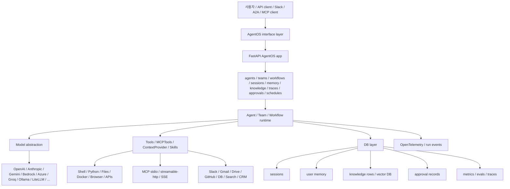

핵심 호출 방향은 다음과 같다.

1. 사용자가 Python SDK의 `Agent.run()`을 직접 호출하거나 AgentOS의 `/agents/{agent_id}/runs` 계열 endpoint를 호출한다.
2. `Agent.run()`은 `_run.run_dispatch()`로 위임한다.
3. run dispatcher가 session/db/input schema/media/hooks/guardrails를 준비한다.
4. `run_agent()`가 메시지 구성, tool 결정, memory/learning/culture background 작업, model call, tool call 처리, structured output, post-hook, storage, telemetry를 수행한다.
5. 모델이 tool call을 반환하면 `Model.run_function_calls()`가 `FunctionCall`을 실행하거나 HITL pause를 만든다.
6. 실행 결과는 `RunOutput`과 event stream으로 저장·반환된다.
7. AgentOS 경유 시 router가 user/session ownership, JWT/RBAC scope, continuation/resume, SSE/WebSocket streaming, cancellation, DB persistence를 덧붙인다.

## 5. 모듈 지도

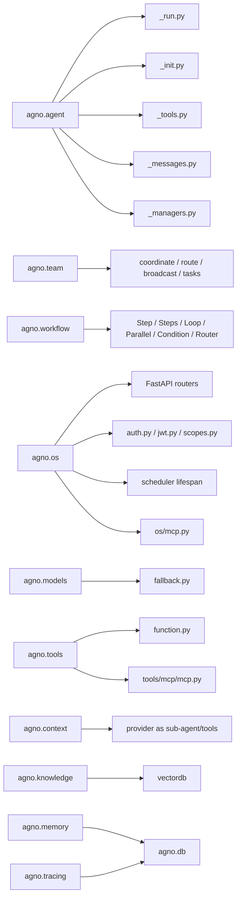

실제 코드의 의존 방향은 비교적 자연스럽다.

- `agent/agent.py`는 public dataclass이고, 구현은 `_init`, `_run`, `_messages`, `_tools`, `_storage`, `_session`, `_response`, `_telemetry` 등으로 분리한다.
- `models/base.py`는 provider-neutral model contract를 정의하고 provider별 구현은 `models/openai`, `models/anthropic`, `models/google`, `models/aws`, `models/litellm` 등에 놓인다.
- `tools/function.py`가 일반 Python callable을 모델 tool schema와 실행 단위로 변환한다.
- `team/team.py`는 Agent와 비슷한 run lifecycle을 가지지만 member delegation과 team mode instruction을 추가한다.
- `workflow/workflow.py`는 Agent와 달리 pipeline step graph를 실행하고, 필요하면 `WorkflowAgent`가 “워크플로우를 실행할지 말지”를 판단한다.
- `os/app.py`가 전체 운영 서버를 조립한다.

## 6. Agent 객체 구조

`libs/agno/agno/agent/agent.py`의 `Agent`는 dataclass다. 주요 필드는 다음 범주로 묶인다.

- identity: `id`, `name`, `description`, `user_id`, `session_id`
- model: `model`, `fallbacks`, `parser_model`, `output_model`
- state: `session_state`, `agentic_state`, `metadata`, `dependencies`
- persistence: `db`, `enable_user_memories`, `enable_agentic_memory`, `session_summary_manager`, `store_events`
- memory/learning/culture: `memory_manager`, `enable_agentic_memory`, `enable_user_memories`, `enable_session_summaries`, `learn`, `culture`
- knowledge/context: `knowledge`, `knowledge_filters`, `references_format`, `context`, `add_context`, `resolve_context`
- tools: `tools`, `tool_call_limit`, `tool_choice`, `pre_hooks`, `post_hooks`, `tool_hooks`
- system prompt: `description`, `instructions`, `expected_output`, `additional_context`, `markdown`, `add_datetime_to_context`, `add_location_to_context`
- output: `response_model`, `parser_model`, `structured_outputs`, `parse_response`, `output_schema`
- runtime flags: `stream`, `stream_intermediate_steps`, `events_to_skip`, `debug_mode`, `monitoring`, `telemetry`
- media: `input_schema`, images/videos/audio/files, generated media storage

`initialize_agent()`는 실행 직전 다음을 수행한다.

- telemetry 설정을 적용한다.
- 모델이 없으면 기본 모델을 설정한다.
- memory, culture, session summary, compression manager를 초기화한다.
- Agent id와 debug 상태를 정리한다.
- dependency가 필요한 toolkit/context/provider를 준비한다.

중요한 세부 사항은 기본 모델이다. 코드상 `set_default_model()`은 모델이 없으면 `OpenAIResponses(id="gpt-5.4")`를 사용한다. 이 동작은 편리하지만 `openai` 패키지와 API key가 없으면 import/runtime 실패로 이어질 수 있고, 사용자가 모델을 명시하지 않았는데 OpenAI provider로 간다는 점도 운영 정책상 명확히 알아야 한다.

## 7. Agent 실행 흐름

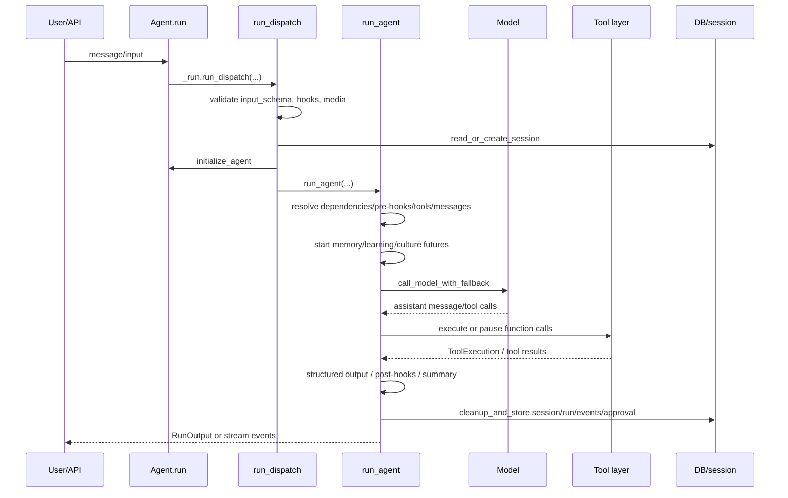

`Agent.run()`은 여러 overload를 가지지만 실제 핵심은 `_run.run_dispatch()`이다. 이 함수는 다음 순서로 작동한다.

1. sync run에서 async DB가 들어오면 실패시킨다.
2. `run_id`를 만들고 cancellation registry에 등록한다.
3. history 관련 옵션이 있지만 DB가 없으면 warning을 낸다.
4. `input_schema`가 있으면 입력을 검증한다.
5. hooks와 guardrails를 정규화한다.
6. session과 agent를 초기화한다.
7. media object id를 검증한다.
8. `RunInput`을 만든다.
9. 기존 session을 읽거나 새 session을 만든다.
10. metadata/session_state를 갱신한다.
11. stream 여부에 따라 `run_agent()` 또는 `_run_stream()`을 호출한다.

`run_agent()` 내부 문서와 코드 흐름은 상당히 명시적이다.

1. session을 읽거나 생성한다.
2. metadata와 session state를 업데이트한다.
3. dependency를 resolve한다.
4. pre-hook을 실행한다.
5. 사용할 tools를 결정한다.
6. system/user/history/context/knowledge/tool 메시지를 준비한다.
7. memory, learning, culture background future를 시작한다.
8. reasoning 설정이 있으면 reasoning model 흐름을 추가한다.
9. model response와 function call을 처리한다.
10. `RunOutput`을 갱신한다.
11. 생성 media를 저장한다.
12. structured output 변환을 수행한다.
13. post-hook을 실행한다.
14. background future를 기다린다.
15. session summary를 갱신한다.
16. session/run/events를 저장하고 telemetry를 보낸다.
17. finally에서 background future를 cancel하고 connectable tool을 disconnect한다.

Streaming run은 같은 논리를 event generator로 바꾼다. `_run_stream()`은 run started, pre-hook, reasoning, model response, tool call, post-hook, completed/paused/error event를 순차적으로 yield한다.

## 8. Model과 Tool Call 흐름

`models/base.py`는 Agno model contract의 중심이다. 주요 메서드는 다음과 같다.

- `invoke`, `ainvoke`: provider 원시 호출
- `invoke_stream`, `ainvoke_stream`: provider streaming 호출
- `response`, `aresponse`: non-streaming model run
- `response_stream`, `aresponse_stream`: streaming model run
- `run_function_calls`: 모델 tool call을 Agno `FunctionCall`로 실행
- retry/backoff 설정: `max_retries`, `request_timeout`, `exponential_backoff`, `retry_with_guidance`
- structured output capability: `supports_structured_outputs`

모델 fallback은 `models/fallback.py`에 있다. `call_model_with_fallback()`은 primary model을 먼저 호출하고, 오류를 분류한 뒤 설정에 따라 fallback model을 시도한다. rate limit, context overflow, 특정 error type에 대한 fallback 정책을 둘 수 있지만, 일반적인 client 4xx는 무조건 감추는 구조가 아니다.

Tool call 흐름은 다음과 같다.

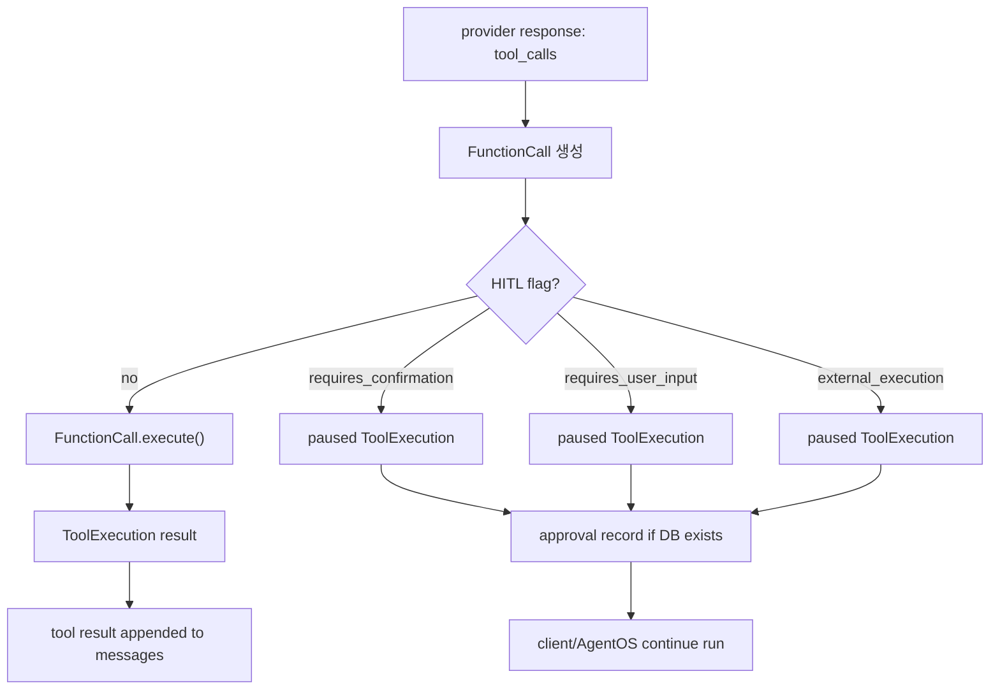

`tools/function.py`의 `Function`과 decorator가 중요한 이유는 callable metadata가 여기서 결정되기 때문이다.

- `@tool`은 name, description, strict, instructions, show_result, stop_after_tool_call, cache를 설정할 수 있다.
- `requires_confirmation`, `requires_user_input`, `external_execution`은 동시에 하나만 true일 수 있다.
- `user_input_fields`를 선언하면 어떤 입력을 사람에게 받아야 하는지 schema화할 수 있다.
- `pre_hook`, `post_hook`, `tool_hooks`를 붙일 수 있다.
- `@approval(required=True)`는 별도 HITL 플래그가 없으면 confirmation을 요구하도록 만든다.
- `@approval(audit=True)`는 이미 HITL 플래그가 있는 tool에 audit 의미를 덧붙인다.

`Model.run_function_calls()`는 이 metadata를 보고, 확인·사용자 입력·외부 실행이 필요한 tool이면 실제 함수를 호출하지 않고 paused response를 만든다. 이 구조는 위험한 tool을 사람 승인 뒤 실행하게 만드는 Agno의 핵심 안전장치다.

## 9. Team 아키텍처

`libs/agno/agno/team/team.py`의 `Team`도 dataclass다. member는 `Agent`, `Team`, callable 등이 될 수 있고, team 내부에서 다시 member run을 추적한다.

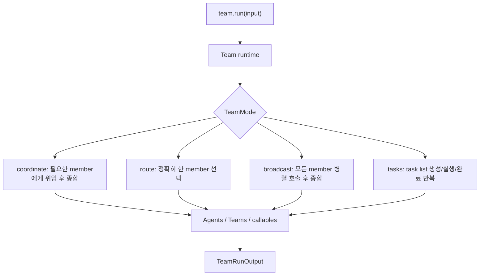

Team mode별 철학은 다음과 같다.

- `coordinate`: 일반적인 supervisor pattern이다. 모델이 어떤 member를 호출할지 정하고 결과를 합성한다.
- `route`: router pattern이다. 사용자 입력에 가장 맞는 member 하나를 선택하고 그 응답을 돌려준다.
- `broadcast`: panel pattern이다. 모든 member가 같은 문제를 보고, supervisor가 종합한다.
- `tasks`: 계획 실행 pattern이다. task list를 만들고, `execute_task`, `execute_tasks_parallel`, `list_tasks`, `add_task_note`, `mark_all_complete` 같은 도구로 반복한다.

Team의 장점은 AgentOS와 같은 runtime contract를 공유한다는 점이다. Agent처럼 session, DB, stream, cancellation, telemetry, member run tracking을 가진다. 대신 member가 다시 Agent/Team일 수 있으므로 cancellation 전파와 session attribution이 더 복잡해진다. 실제 router 코드에는 team/workflow session이 nested run을 가질 수 있어 session ownership 검증을 세심하게 처리하는 부분이 보인다.

## 10. Workflow 아키텍처

Workflow는 Agno의 결정적 orchestration 계층이다. `libs/agno/agno/workflow/workflow.py`의 `Workflow`는 다음 step type을 가진다.

- `Step`: 단일 callable/agent/team/workflow 실행
- `Steps`: 순차 step 묶음
- `Loop`: 조건이 만족될 때까지 반복
- `Parallel`: 여러 step 병렬 실행
- `Condition`: 조건에 따른 실행
- `Router`: 입력과 상태에 따라 다음 step 선택
- nested `Workflow`: 워크플로우 안의 워크플로우

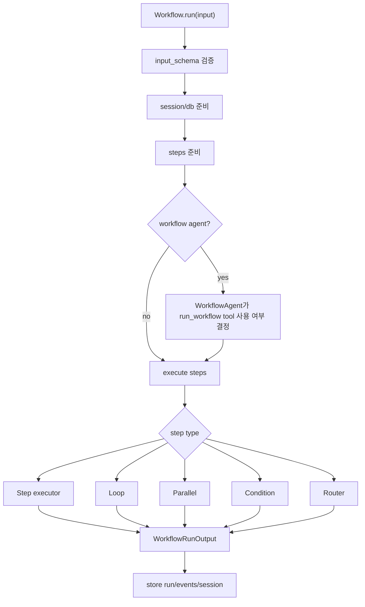

`Workflow.run()`은 다음 순서로 작동한다.

1. sync run에서 async DB가 들어오면 실패시킨다.
2. `input_schema`를 검증한다.
3. sync background execution은 지원하지 않는다.
4. workflow/session을 초기화한다.
5. session을 읽거나 생성한다.
6. metadata와 session state를 업데이트한다.
7. step을 prepare한다.
8. agent/team member에 workflow session 정보를 주입한다.
9. `RunContext`를 만든다.
10. `WorkflowAgent`가 있으면 workflow 실행 여부를 agent가 판단한다.
11. 없으면 `_execute()` 또는 `_execute_stream()`으로 step graph를 실행한다.
12. run output, event, metrics, trace, session을 저장한다.

`workflow/types.py`의 `HumanReview`는 Workflow HITL의 중심이다.

- `requires_confirmation`
- `requires_user_input`
- `requires_output_review`
- `requires_iteration_review`
- `on_reject`: skip/cancel/retry 등
- `on_timeout`: cancel/skip/approve 등
- `on_error`: fail/skip/pause 등

Parallel step은 HITL 조합이 제한된다. 코드가 명시적으로 unsupported combination을 검사한다. 이는 병렬 실행 중 사람이 어느 step을 승인해야 하는지 모호해지는 문제를 줄이려는 설계로 보인다.

## 11. AgentOS 서버 런타임

`libs/agno/agno/os/app.py`의 `AgentOS`는 Agno를 서버로 배포하는 조립자다. 생성자 인자는 매우 넓다.

- components: `agents`, `teams`, `workflows`, `knowledge`, `interfaces`, `a2a_interface`
- storage: `db`, `auto_provision_dbs`
- security: `authorization`, `authorization_config`, `internal_service_token`
- server: `cors_allowed_origins`, `config`, `settings`, `base_app`
- observability: `tracing`, `telemetry`
- extension: `registry`, `enable_mcp_server`, scheduler 설정
- execution behavior: `run_hooks_in_background`

`AgentOS.get_app()`은 FastAPI app을 만들거나 기존 `base_app`에 router를 붙인다. 주요 구성은 다음과 같다.

- home/health/info/config/models router
- agents router
- teams router
- workflows router
- websocket router
- interfaces/A2A router
- session router
- memory router
- eval router
- metrics router
- knowledge router
- traces router
- database router
- approvals router: DB가 있을 때만 활성화
- schedules router: DB가 있을 때만 활성화
- components router: DB가 있을 때만 활성화
- registry router: registry가 있을 때만 활성화
- optional MCP server mount
- CORS middleware
- JWT middleware 또는 security-key dependency
- trailing slash middleware
- lifespan: user app lifespan, MCP tools, MCP server, DB, scheduler, httpx client cleanup

AgentOS는 객체 초기화 때 agent/team/workflow를 registry에 올리고, DB를 주입하고, MCP tools를 수집하고, `store_events=True`를 강제하는 부분이 있다. 즉 AgentOS 아래에서 실행되는 component는 단순 SDK 실행보다 더 많은 이벤트와 상태가 저장된다.

## 12. 인증과 권한 모델

보안 구조는 크게 두 가지다.

1. Legacy security key
   - `OS_SECURITY_KEY`에 해당하는 bearer token을 검사한다.
   - `settings.os_security_key`가 없으면 authentication dependency가 true를 반환한다.

2. JWT/RBAC
   - `authorization=True`, JWT 환경변수, JWT middleware를 사용한다.
   - scope 기반으로 agents/teams/workflows/schedules 등에 대한 read/run/write/delete를 검사한다.
   - audience, issuer, JWKS, public key, validation 옵션을 구성할 수 있다.

`os/auth.py`에서 중요한 조건은 다음이다.

- `authorization_enabled`가 true면 security-key 검증 dependency는 통과하고 JWT middleware 쪽에 위임한다.
- request state가 이미 authenticated면 통과한다.
- JWT 환경변수가 있으면 security-key dependency는 통과한다.
- settings나 `os_security_key`가 없으면 인증을 건너뛴다.
- scheduler internal token은 agents/team/workflows run, schedules read/write/delete scope를 갖는다.

이 설계는 유연하지만, 운영 위험도 분명하다. 로컬 예제에서는 편하지만, 외부 네트워크에 열리는 AgentOS에서 `OS_SECURITY_KEY`나 JWT가 설정되지 않으면 endpoint가 사실상 공개될 수 있다. 또한 JWT `validate=False` 같은 옵션을 프록시 뒤에서만 써야 하는데, 잘못 쓰면 signature 검증 없이 claim을 신뢰하는 형태가 된다.

## 13. Context Provider와 Knowledge

ContextProvider는 파일, 웹, DB, Slack, Google Drive, Gmail, Wiki, MCP 같은 정보원을 agent에게 노출하는 계층이다.

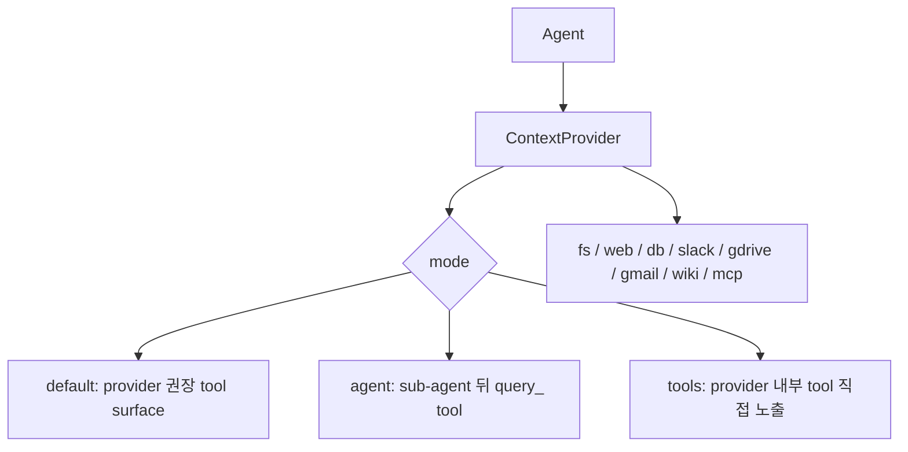

`ContextProvider`의 중요한 속성은 `read`, `write`, `query_tool_name`, `update_tool_name`, `stream_sub_agent_events`다. mode가 `agent`이면 provider는 내부 sub-agent로 감싸지고, 호출 agent는 단일 query/update tool만 본다. 이때 `RunContext`의 `user_id`, `session_id`, `metadata`, `dependencies`가 하위 provider/sub-agent로 전달된다. 사용자별 인증이나 Slack action token 같은 context가 유지되는 장점이 있지만, trust boundary를 넘어 민감 값이 전달될 수 있다는 점도 관리해야 한다.

Knowledge 계층은 `knowledge/knowledge.py`에 집중되어 있다.

- vector DB 기반 search/async search
- optional filter validation
- `isolate_vector_search`가 켜지고 name이 있으면 `linked_to` 필터를 주입
- `search_knowledge_base` tool 생성
- filter-aware search tool 생성
- content 추가, reader, chunking, embedder, vector insert
- filesystem knowledge처럼 grep/list/read 도구를 직접 노출하는 구현도 존재

Knowledge search tool은 모델에게 “모호한 질문이면 먼저 검색하라”는 강한 지시를 줄 수 있다. 이는 RAG 품질을 높이지만, prompt injection이 들어간 문서나 웹 reader가 가져온 콘텐츠가 agent reasoning에 영향을 줄 수 있다는 전형적 RAG 위험도 동반한다.

## 14. Memory, Learn, Session

Memory는 `memory/manager.py`가 중심이다. User memory를 DB에 저장하고, 검색 방법을 선택한다.

- DB 기반 memory CRUD
- user_id/session_id 기준 검색
- content substring search
- agentic memory search
- memory extraction/update/delete tool 생성
- memory optimization strategy
- background future로 run 메시지에서 memory를 추출

agentic memory search는 LLM에게 “query와 관련된 memory id를 고르라”고 시킨 뒤 해당 memory를 반환한다. 이는 단순 문자열 검색보다 유연하지만, LLM 판단이 들어가므로 정확성·비용·프라이버시 측면을 고려해야 한다.

Session 객체는 agent/team/workflow마다 별도 schema를 가진다.

- `session/agent.py`: agent run history, summary, session_data, metadata
- `session/workflow.py`: workflow run history, workflow history context, message extraction
- team session은 nested member run 때문에 attribution 처리와 filtering이 더 중요해진다.

run history를 메시지에 다시 넣는 흐름은 편리하지만, 오래된 도구 결과와 민감 데이터가 prompt에 재등장할 수 있다. Agno는 `skip_history_messages`, role filtering, last_n_runs, limit 등을 제공하지만, 운영자는 어떤 데이터를 기억하고 재사용할지 정책을 정해야 한다.

## 15. Tracing, Metrics, Telemetry

Agno는 관찰 가능성을 세 가지 층으로 제공한다.

1. Run/event storage
   - Agent/Team/Workflow run output과 event가 DB session에 저장된다.
   - AgentOS는 store_events를 켜서 streaming resume과 UI 표시를 가능하게 한다.

2. OpenTelemetry tracing
   - `tracing/setup.py`가 tracer provider, span processor, Agno instrumentation을 구성한다.
   - trace/span schema는 input/output/error, run_id, session_id, user_id, agent/team/workflow id, duration, status를 가진다.
   - traces router는 run 단위 또는 session grouping으로 조회할 수 있다.

3. Agno telemetry
   - `Agent`/`Team`/`AgentOS` 실행 telemetry가 Agno API로 전송될 수 있다.
   - README는 어떤 model provider가 사용되는지 등을 기록한다고 설명하며, `AGNO_TELEMETRY=false`로 끌 수 있다고 한다.
   - 코드상 agent telemetry는 agent_id, db type, model provider/name/id, parser/output model, tools/memory/learnings/culture/reasoning/knowledge/schema/team 여부 등을 포함한다.

Telemetry endpoint base URL은 `agno.api.settings`에서 기본적으로 `https://os-api.agno.com` 계열을 사용한다. 운영 환경에서 외부로 나가는 metadata를 제한하려면 `AGNO_TELEMETRY=false`를 명시하는 것이 안전하다.

## 16. MCP 통합

Agno의 MCP client는 `tools/mcp/mcp.py`에 있다. 지원 방식은 다음과 같다.

- 이미 초기화된 `ClientSession`
- stdio server command
- SSE
- Streamable HTTP
- `include_tools`, `exclude_tools`
- tool name prefix
- confirmation/external execution/stop/show result tool list
- dynamic HTTP `header_provider`
- `refresh_connection`

stdio command는 `prepare_command()`로 분해되어 `StdioServerParameters`에 들어간다. env는 MCP client의 default environment에 사용자가 제공한 env를 merge한다. HTTP transport에서는 `header_provider`가 실행 시점에 동적 header를 만들어 줄 수 있다.

이 구조는 MCP 생태계와 잘 맞지만, 위험도 크다.

- stdio MCP server command는 사실상 로컬 프로세스 실행이다.
- env merge는 API key 같은 비밀을 MCP server에 넘길 수 있다.
- HTTP MCP header provider는 bearer token이나 per-user credential을 외부 MCP endpoint로 전달한다.
- `refresh_connection=True`는 매 run마다 연결을 새로 만들 수 있어 side effect와 비용이 늘어난다.
- MCP tool schema와 설명은 외부 서버가 제공하므로 prompt/tool injection 경계가 넓어진다.

## 17. Built-in Tools와 코드 실행 표면

`libs/agno/agno/tools/`에는 150개 이상의 Python 파일이 있다. 범주는 다음과 같다.

- 로컬 실행: `shell.py`, `python.py`, `file.py`, `local_file_system.py`, `docker.py`
- 개발 도구: `github.py`, `gitlab.py`, `bitbucket.py`, `jira.py`, `linear.py`
- 검색/RAG: `duckduckgo.py`, `bravesearch.py`, `serpapi.py`, `tavily.py`, `exa.py`, `firecrawl.py`, `crawl4ai.py`, `newspaper.py`
- 데이터: `postgres.py`, `sql.py`, `duckdb.py`, `redshift.py`, `pandas.py`, `csv_toolkit.py`
- Google/Slack/Gmail/Drive/Sheets/Calendar/Slides 등 SaaS
- 미디어 생성/처리: `dalle.py`, `replicate.py`, `fal.py`, `lumalab.py`, `moviepy_video.py`, `opencv.py`
- messaging: `telegram.py`, `whatsapp.py`, `discord.py`, `twilio.py`
- memory/knowledge/scheduler/workflow helper

중요한 실행 도구는 다음과 같다.

- `ShellTools.run_shell_command(args: List[str])`
  - `subprocess.run(args, capture_output=True, text=True, cwd=base_dir)`를 호출한다.
  - `shell=True`는 아니지만 임의 명령 실행 도구다.
  - LLM이 인자를 선택할 수 있다면 사실상 로컬 명령 실행 권한이다.

- `PythonTools`
  - 자체 warning이 “PythonTools can run arbitrary code”라고 말한다.
  - `run_python_code()`는 `exec(code, safe_globals, safe_locals)`를 호출한다.
  - `save_to_file_and_run()`은 파일을 쓰고 `runpy.run_path()`로 실행한다.
  - `pip_install_package`, `uv_pip_install_package`도 포함된다.

- `FileTools`
  - base_dir containment와 `.git`, `.venv`, `node_modules` 같은 기본 exclude가 있다.
  - delete는 기본 disabled다.
  - 비교적 안전장치가 있다.

- `LocalFileSystemTools`
  - `target_directory`가 있지만 `write_file()` 인자로 별도 `directory`를 받을 수 있다.
  - 이 `directory`는 target_directory containment 검사를 거치지 않고 `Path(directory)`로 생성된다.
  - `FileTools`보다 안전 경계가 약하므로 untrusted model tool로 열면 path escape 위험이 있다.

Skills 계층도 주의해야 한다. skill script 실행은 안전한 path join을 쓰는 부분이 있지만, 결국 script 파일을 실행한다. 신뢰할 수 없는 skill pack을 등록하면 코드 실행 공급망 위험이 생긴다.

## 18. 사용자 플로우

### 18.1 Python SDK로 단일 Agent 실행

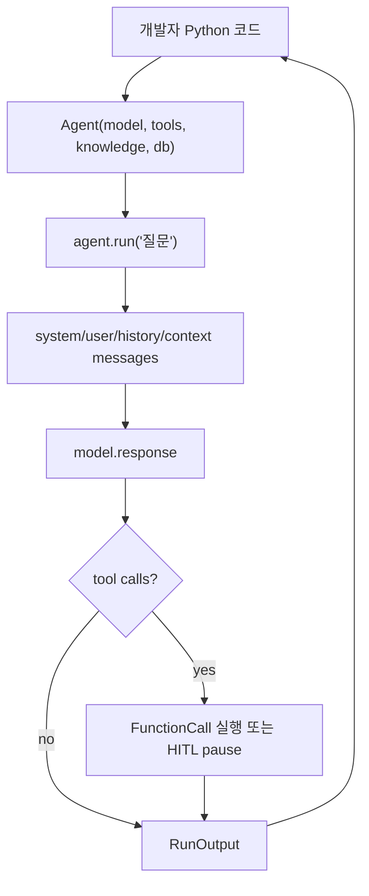

사용자는 Python 코드에서 Agent를 만들고 `run()`을 호출한다. DB를 넣지 않으면 세션 저장과 승인 기록 같은 기능은 제한된다. 도구를 넣으면 모델은 tool schema를 보고 호출할 수 있다. streaming을 켜면 event generator를 순회한다.

### 18.2 Human approval tool 실행

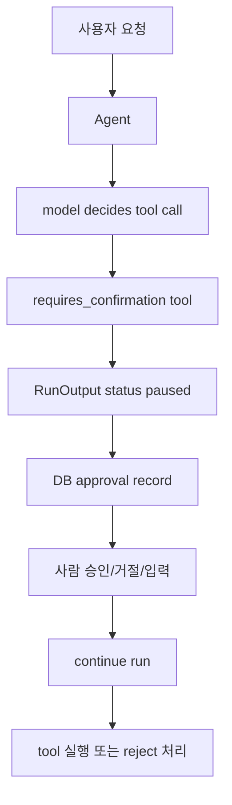

HITL tool은 모델이 호출했다는 이유만으로 실행되지 않는다. paused output이 반환되고, approval record가 만들어질 수 있다. AgentOS를 쓰면 approvals router와 continue endpoint가 이 과정을 API화한다.

### 18.3 Team 실행

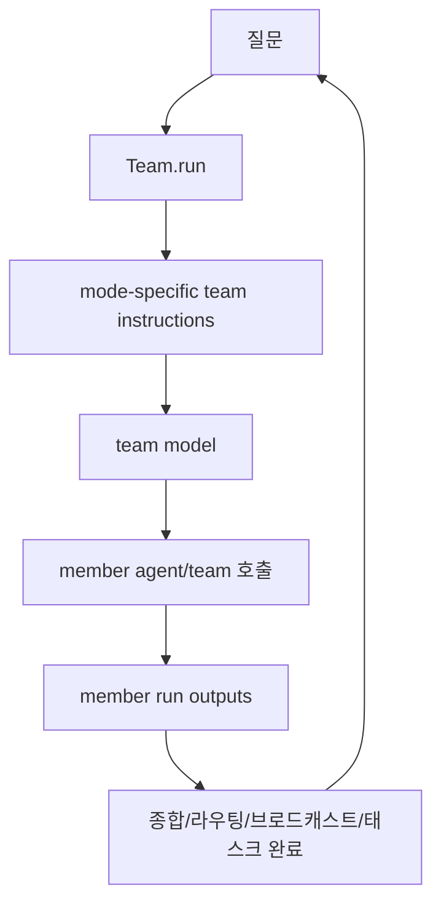

Team은 실제로는 supervisor agent에 가깝다. mode instruction과 member tools가 prompt에 들어가고, supervisor가 member를 호출한다. `tasks` mode는 더 자율적이지만 loop와 completion 조건을 더 엄격히 봐야 한다.

### 18.4 Workflow 실행

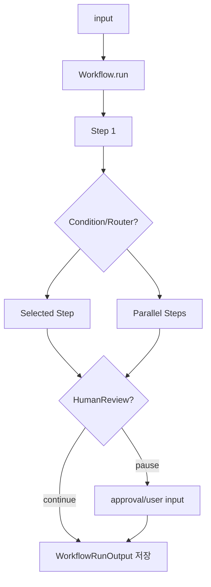

Workflow는 “코딩 agent가 알아서 하게 둔다”보다 “업무 파이프라인을 정의하고 필요한 곳에 agent/team을 끼운다”에 가깝다. 반복/분기/병렬/HITL이 모두 step 계층에서 처리된다.

### 18.5 AgentOS로 배포

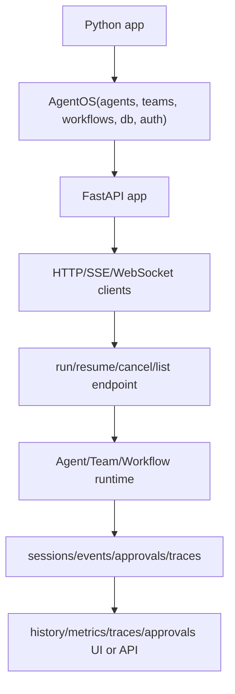

AgentOS는 Agno의 가장 제품 지향적인 부분이다. 사용자는 Python 객체를 넘기면 app/router/lifespan이 구성된다. 하지만 운영 배포에서는 반드시 인증, CORS, DB migration/provisioning, secret handling, trace/telemetry 정책을 함께 잡아야 한다.

## 19. 실행 검증

분석 환경에서 다음 정적/부분 실행 검증을 수행했다.

- `PYTHONPATH=libs/agno python3 -m py_compile ...`로 핵심 파일 컴파일 검증
  - `libs/agno/agno/agent/agent.py`
  - `libs/agno/agno/agent/_run.py`
  - `libs/agno/agno/team/team.py`
  - `libs/agno/agno/workflow/workflow.py`
  - `libs/agno/agno/os/app.py`
  - `libs/agno/agno/models/base.py`
  - `libs/agno/agno/tools/function.py`
- 결과: 컴파일 성공

간단 import/runtime 검증은 다음 상태였다.

- `PYTHONPATH=libs/agno python3 - <<... import agno ...` 실행 시 `agno.__version__`은 `0.0.0`으로 출력되었다.
- 이어서 `from agno.agent import Agent`를 시도하면 `ModuleNotFoundError: No module named 'pydantic'`로 실패했다.
- 이는 저장소 의존성을 설치하지 않은 상태에서 소스만 읽은 결과다.

따라서 현재 검증은 “핵심 Python 파일의 syntax/import-free compile은 통과, 실제 package import와 Agent 생성은 의존성 미설치로 실패”로 보는 것이 정확하다.

## 20. 숨겨진 표면과 이상한 점

1. 인증 미구성 시 통과
   - `get_authentication_dependency()`는 security key가 없고 JWT도 없으면 true를 반환한다.
   - 로컬 개발 편의성으로는 이해되지만, 외부 노출 서버에서는 가장 큰 위험이다.

2. security key와 JWT의 상호작용
   - JWT authorization이 켜져 있거나 JWT env가 있으면 legacy security-key dependency는 통과한다.
   - JWT middleware 설정이 잘못되면 “security key도 안 보고 JWT도 제대로 안 보는” 배치가 생길 수 있다.

3. scheduler internal token 권한
   - internal service token은 agents/teams/workflows run과 schedules write/delete scope를 가진다.
   - 이 값이 로그나 client에 노출되면 스케줄 실행과 삭제 권한이 크다.

4. docs/CORS 기본값
   - 설정 파일은 docs를 기본 활성화하고, CORS 기본 목록에 localhost와 Agno domain을 포함한다.
   - production에서는 명시적으로 좁히는 것이 맞다.

5. telemetry default
   - README와 코드 모두 telemetry가 기본 켜질 수 있음을 보여준다.
   - 모델 provider/name/id, DB type, capability metadata가 외부 Agno API로 갈 수 있다.

6. 기본 모델 surprise
   - 모델을 지정하지 않으면 OpenAI Responses 계열 기본 모델을 쓰는 구조다.
   - dependency와 API key가 없으면 실패하고, 조직 정책상 특정 provider 사용을 금지한 경우도 문제가 된다.

7. 코드 실행 도구
   - `PythonTools`, `ShellTools`, skill script, Docker, MCP stdio는 모두 로컬 실행면이다.
   - HITL과 tool scoping 없이 model에게 열면 매우 위험하다.

8. `LocalFileSystemTools` path containment
   - `target_directory`가 있지만 method 인자의 `directory`를 그대로 사용한다.
   - `FileTools`의 `check_escape`/safe path 계층과 다르게 보인다.

9. Workflow Parallel session_state
   - Parallel 실행부에는 session_state copy 관련 주석과 실제 공유 reference가 섞여 있다.
   - 병렬 step이 같은 dict를 mutate하면 race나 순서 의존성이 생길 수 있다.

10. Workflow metadata update 중복
   - `Workflow.run()` 주변에서 metadata update 호출이 중복되어 보이는 지점이 있다.
   - 치명적 문제로 단정할 수는 없지만, 유지보수상 의도를 확인할 만하다.

11. HITL과 DB 결합
   - paused run 자체는 DB 없이도 반환될 수 있지만, approval API와 audit trail은 DB가 있어야 완성된다.
   - AgentOS에서 DB가 없으면 approval router는 503 stub이 된다.

12. remote bearer forwarding
   - remote agent/team/workflow는 incoming bearer token을 원격 AgentOS로 전달할 수 있다.
   - gateway 구조에서는 편하지만 원격 endpoint 신뢰와 token audience 정책이 중요하다.

13. ContextProvider metadata propagation
   - provider sub-agent로 user_id/session_id/metadata/dependencies가 전달된다.
   - 외부 SaaS token이나 action token이 provider boundary를 넘어갈 수 있다.

14. RAG prompt injection
   - web/file/wiki/slack/gdrive context가 모델 prompt/tool result로 들어간다.
   - 문서에 들어 있는 지시문을 어떻게 취급할지 guardrail을 별도로 구성해야 한다.

15. 의존성 표면
   - optional dependency가 매우 많고 provider/tool별 패키지가 광범위하다.
   - production image를 만들 때 최소 의존성 프로필과 lock 정책이 필요하다.

## 21. 다른 프로젝트와의 비교

### Agno vs CrewAI

CrewAI도 Agent/Task/Crew/Flow를 제공하지만, Agno는 AgentOS, API router, DB, approval, schedule, trace, auth까지 한 단계 더 운영 플랫폼 쪽에 가깝다. CrewAI가 “crew를 정의하고 kickoff한다”라면 Agno는 “agent platform을 띄우고 운영 endpoint로 관리한다”에 가깝다.

### Agno vs LangGraph

LangGraph는 graph state machine과 durable execution에 강하다. Agno는 LangGraph만큼 graph primitive 중심은 아니고, Agent/Team/Workflow/AgentOS라는 제품 지향 추상화를 앞세운다. 낮은 수준의 graph 제어가 필요하면 LangGraph가 유리하고, agent API 서버와 운영 기능을 빠르게 붙이려면 Agno가 더 직접적이다.

### Agno vs OpenHands/Goose/Codex/Aider

OpenHands, Goose, Codex, Aider는 개발자 로컬 환경에서 파일을 수정하고 명령을 실행하는 코딩 워크플로우에 가깝다. Agno는 그런 도구를 만들 수 있는 기반일 수는 있지만, 기본 목적은 “코드를 수정하는 CLI”가 아니다. Agno에서 코딩 agent를 만들려면 `ShellTools`, `FileTools`, `PythonTools`, GitHub/GitLab tools, Workflow를 조합해야 한다.

### Agno vs MCP servers

MCP servers는 tool/resource protocol을 제공한다. Agno는 MCP client로 외부 tool을 가져오고, AgentOS MCP server로 Agno runtime을 외부 MCP client에게 노출할 수 있다. 즉 Agno는 MCP 생태계의 client이자 server 역할을 모두 할 수 있다.

## 22. 실제 설계 이해 포인트

Agno를 제대로 이해하려면 다음 순서로 보면 된다.

1. `Agent`는 모델 호출과 tool execution loop다.
2. `Function`은 Python callable을 LLM tool schema와 HITL metadata로 바꾼다.
3. `Model`은 provider 차이를 감추고, tool calls를 Agno function call로 되돌린다.
4. `Team`은 여러 Agent/Team을 supervisor policy로 묶는다.
5. `Workflow`는 Agent/Team을 step으로 넣을 수 있는 deterministic pipeline이다.
6. `DB`는 session/run/memory/knowledge/trace/approval/schedule을 지속화한다.
7. `AgentOS`는 이 객체들을 FastAPI endpoint와 WebSocket/SSE/MCP/인터페이스로 노출한다.
8. 인증·권한·CORS·telemetry·tool scope가 운영 안전성을 결정한다.

## 23. 결론

Agno는 “agent framework”와 “agent product backend” 사이에서 후자에 가까운 저장소다. 단일 Agent 실행만 보면 복잡해 보일 수 있지만, 전체 구조는 에이전트를 실제 사용자와 조직에 제공하는 데 필요한 것들을 한곳에 모은다. Agent, Team, Workflow, AgentOS의 계층은 자연스럽고, HITL과 DB 기반 상태 저장은 운영 제품에 필요한 요구를 잘 반영한다.

다만 사용자는 이 저장소를 “편리한 샘플 SDK”로만 보면 안 된다. 인증이 없으면 API는 통과되고, 도구를 열면 shell/python/MCP/SaaS가 실행되며, memory/trace/telemetry는 민감 데이터를 저장하거나 외부로 보낼 수 있다. Agno를 안전하게 쓰는 핵심은 기능을 켜는 것보다 기능 경계를 좁히는 것이다. 모델, tool, DB, auth, context provider, telemetry, schedule token, remote token forwarding을 명시적으로 설계할 때 Agno의 장점이 가장 크게 살아난다.
