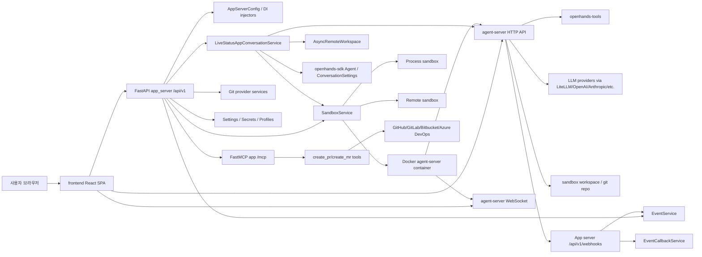
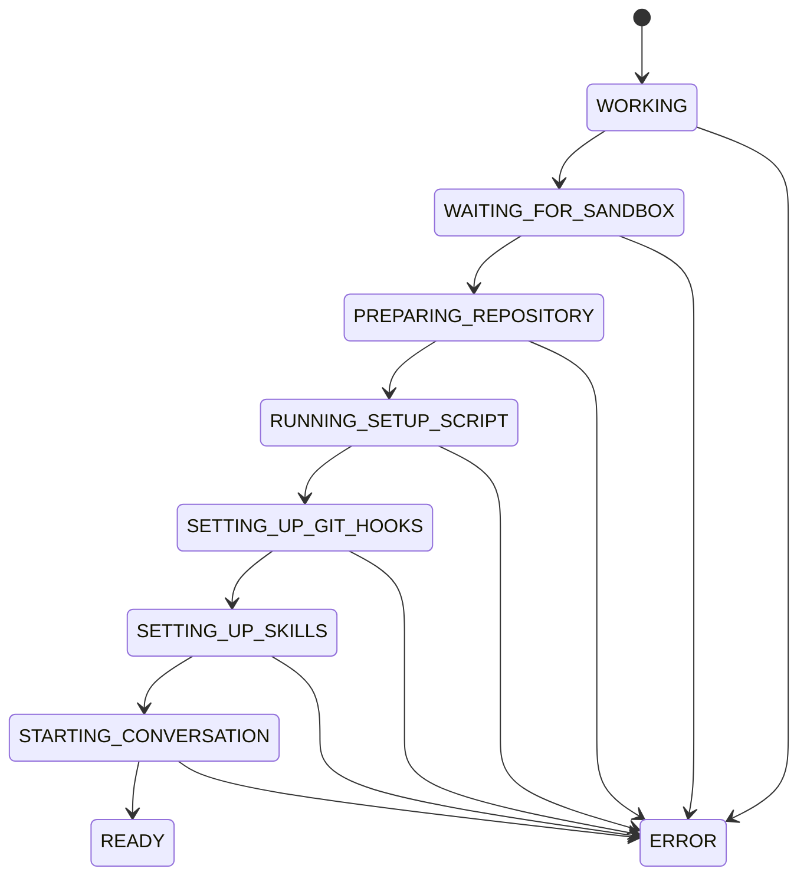
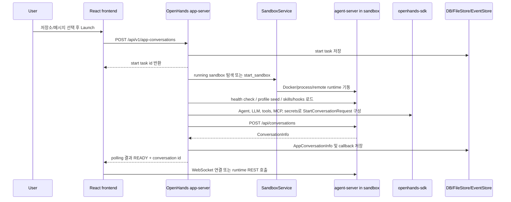

# All-Hands-AI/OpenHands 심층 분석

분석 기준일: 2026-06-10  
분석 대상: `All-Hands-AI/OpenHands`  
로컬 소스: `sources/All-Hands-AI__OpenHands`  
분석 커밋: `2a3f06a`  
기본 브랜치: `main`  
주 언어: Python, TypeScript/React  
라이선스: 루트 MIT, `enterprise/`는 PolyForm Free Trial License 1.0.0  
최신 릴리스 메타데이터: `1.7.0 - 2026-05-01`  
GitHub 메타데이터: 2026-06-10 수집 시점 기준 star 약 76,382, fork 약 9,711

## 1. 한 줄 평가

OpenHands는 “터미널에서 바로 쓰는 단일 코딩 CLI”라기보다, 에이전트 SDK와 agent-server를 중심에 두고 그 위에 Local GUI, REST API, 샌드박스 오케스트레이션, git provider 통합, MCP 기반 PR 생성 도구, Cloud/Enterprise 기능을 얹은 제품형 AI 개발 에이전트 플랫폼이다. 현재 이 레포의 핵심 가치는 에이전트 추론 루프 자체보다도 “샌드박스 안의 agent-server를 안전하게 띄우고, 사용자의 저장소/비밀/설정/이벤트/프런트엔드 경험을 연결하는 관제 계층”에 있다.

## 2. 분석 범위와 중요한 경계

이 레포는 과거 OpenDevin 계열의 중심 레포였지만, 현재 README는 구조를 네 갈래로 설명한다.

- OpenHands Software Agent SDK: 실제 에이전트 기술의 엔진. 별도 레포 `OpenHands/software-agent-sdk`에 소스가 있다.
- OpenHands CLI: Claude Code/Codex류 CLI 경험. 별도 레포 `OpenHands/OpenHands-CLI`에 소스가 있다.
- OpenHands Local GUI: 이 레포 안의 FastAPI 앱 서버와 React SPA.
- OpenHands Cloud/Enterprise: hosted GUI 및 source-available 기능. Enterprise는 이 레포의 `enterprise/` 아래에 있으나 별도 라이선스다.

따라서 이 보고서의 “보이는 소스”는 Local GUI와 앱 서버, 샌드박스/이벤트/설정/통합 레이어다. 실제 LLM 루프, agent-server의 conversation 실행 API, tool execution의 세부 구현은 이 레포의 직접 소스가 아니라 `openhands-sdk==1.27.0`, `openhands-agent-server==1.27.0`, `openhands-tools==1.27.0` 의존성에서 온다. 이 점은 중요한 숨은 경계다.

## 3. 레포 규모와 구성

수집된 인벤토리 기준:

- 파일 수: 2,385
- 주요 확장자: `.py` 818개, `.tsx` 715개, `.ts` 498개, `.svg` 121개, `.md` 77개
- 주요 매니페스트:
  - `pyproject.toml`, `poetry.lock`, `uv.lock`
  - `frontend/package.json`
  - `openhands-ui/package.json`
  - `docker-compose.yml`
  - `containers/app/Dockerfile`, `containers/dev/Dockerfile`
  - `enterprise/pyproject.toml`, `enterprise/Dockerfile`

### 3.1 최상위 역할 분리

```text
OpenHands/
  openhands/app_server/       FastAPI 앱 서버, v1 API, sandbox/event/git/settings 통합
  openhands/server/           과거 호환용 re-export 계층
  frontend/src/               React Router 기반 Local GUI
  openhands-ui/               UI 컴포넌트 패키지
  skills/                     에이전트에게 주입되는 작업별 skill 문서
  containers/                 앱/개발 컨테이너 정의
  enterprise/                 source-available Enterprise 기능
  tests/                      앱 서버/프런트/유틸 테스트
```

### 3.2 외부 패키지 의존성

`pyproject.toml`에서 특히 중요한 런타임 의존성:

- `openhands-sdk==1.27.0`
- `openhands-agent-server==1.27.0`
- `openhands-tools==1.27.0`
- `fastapi`, `python-socketio`, `sse-starlette`
- `docker`, `kubernetes`
- `litellm==1.84.1`, `openai==2.33.0`, `anthropic[vertex]`, `google-genai`
- `mcp>=1.25`, `fastmcp>=3.2,<4`
- `gitpython`, `pygithub`
- `sqlalchemy[asyncio]`, `asyncpg`, `pg8000`, `redis`

이 구조는 “이 레포가 앱 서버이고, agent runtime은 패키지로 끌어온다”는 점을 명확히 보여준다.

## 4. 설계 철학과 발전 방향

### 4.1 과거: OpenDevin류 자율 개발 에이전트

이 프로젝트는 원래 “브라우저, 터미널, 파일 편집, git 작업을 할 수 있는 개발자 에이전트” 계열에서 출발했다. 현재 README의 표현은 단순 오픈소스 데모보다 제품화된 “AI-Driven Development” 커뮤니티/플랫폼 쪽에 가깝다.

### 4.2 현재: SDK 중심, 표면 분리

README는 SDK, CLI, Local GUI, Cloud, Enterprise를 명확히 나눈다. 이는 핵심 에이전트 루프를 SDK로 분리하고, CLI와 GUI는 같은 엔진 위의 서로 다른 사용자 인터페이스로 두겠다는 철학이다.

실제 코드도 이 방향과 맞는다.

- `openhands.app_server`는 FastAPI, 설정, 사용자, 샌드박스, 이벤트, git provider, secrets를 다룬다.
- `openhands.sdk`에서 `Agent`, `AgentContext`, `LLM`, `LocalWorkspace`, `ACPAgentSettings`, tool preset을 가져온다.
- 샌드박스 안에 뜨는 `agent-server`와 HTTP/WebSocket으로 대화한다.

### 4.3 Local GUI는 제품 흐름 중심

Local GUI는 사용자가 저장소를 선택하고, 브라우저 UI에서 대화하고, 샌드박스의 VSCode/터미널/파일 변경/git diff를 확인하는 흐름을 제품처럼 제공한다. 이는 Codex/Gemini CLI처럼 “현재 터미널에서 바로 명령 수행”하는 구조와 다르다. OpenHands는 샌드박스와 웹 UI를 통해 작업 상태, 이벤트 이력, PR 생성, 멀티 대화, plan agent를 관리한다.

### 4.4 Cloud/Enterprise는 통합과 거버넌스

README와 `AGENTS.md`에 따르면 Cloud/Enterprise 방향은 Slack/Jira/Linear, RBAC, 멀티유저, collaboration, billing, analytics, Keycloak, PostHog 쪽이다. 즉 오픈소스 Local GUI는 코어 경험이고, Enterprise는 조직 운영/권한/통합을 확장한다.

## 5. 전체 아키텍처



핵심은 앱 서버가 agent-server의 직접 실행 루프를 대체하지 않는다는 것이다. 앱 서버는 agent-server 컨테이너를 만들고, agent-server에 conversation start request를 보내고, 이후 이벤트/상태/설정/비밀/프런트엔드 연결을 조율한다.

## 6. 앱 서버 구조

### 6.1 FastAPI 엔트리포인트

주요 파일:

- `openhands/app_server/app.py`
- `openhands/app_server/v1_router.py`
- `openhands/server/app.py`
- `openhands/server/listen.py`

`openhands/server/app.py`와 `openhands/server/listen.py`는 deprecated 호환용 wrapper다. 실제 앱은 `openhands.app_server.app`이다.

`app.py`의 동작:

1. `init_tavily_proxy()`로 Tavily MCP proxy를 초기화한다.
2. `mcp_server.http_app(path='/mcp', stateless_http=True)`를 `/mcp`에 mount한다.
3. `get_app_lifespan_service()`로 lifespan을 결합한다.
4. `/api/v1` 라우터와 health router를 include한다.
5. `SERVE_FRONTEND=true`이고 `./frontend/build`가 있으면 SPA static files를 mount한다.
6. CORS, cache-control, in-memory rate limit middleware를 붙인다.

### 6.2 API 라우터 묶음

`openhands/app_server/v1_router.py`가 다음 라우터를 `/api/v1` 아래로 묶는다.

- events: `/conversation/{conversation_id}/events`
- app conversations: `/app-conversations`
- pending messages
- sandbox, sandbox spec
- settings, secrets
- user, skills
- webhooks
- web client
- git
- config

이 레포의 API surface는 상당히 넓다. 단순 채팅 API가 아니라 conversation lifecycle, sandbox lifecycle, git provider 검색, secrets, MCP, webhooks까지 포함한다.

## 7. 설정과 의존성 주입

주요 파일:

- `openhands/app_server/config.py`
- `openhands/app_server/services/injector.py`
- `openhands/app_server/services/db_session.py`

`AppServerConfig`는 `OpenHandsModel` 기반 설정 객체이며, `from_env(AppServerConfig, 'OH')`로 환경변수에서 읽는다.

기본값의 중요한 선택:

- persistence dir: `OH_PERSISTENCE_DIR`, legacy `FILE_STORE_PATH`, 없으면 `~/.openhands`
- event service:
  - AWS/GCP storage provider면 S3/GCS 계열
  - 기본은 `FilesystemEventService`
- sandbox service:
  - `RUNTIME=remote`: `RemoteSandboxService`
  - `RUNTIME=local` 또는 `process`: `ProcessSandboxService`
  - 기본: `DockerSandboxService`
- sandbox spec:
  - remote/process/docker에 맞춰 spec service 선택
- conversation service:
  - 기본: `LiveStatusAppConversationService`
- user context:
  - 기본: `AuthUserContextInjector`
- JWT:
  - `JwtServiceInjector`

이 주입 구조 덕분에 같은 앱 서버 API가 로컬 Docker, process, remote runtime, SaaS/Enterprise 환경을 바꿔 끼울 수 있다.

## 8. 샌드박스 아키텍처

주요 파일:

- `openhands/app_server/sandbox/sandbox_router.py`
- `openhands/app_server/sandbox/docker_sandbox_service.py`
- `openhands/app_server/sandbox/process_sandbox_service.py`
- `openhands/app_server/sandbox/remote_sandbox_service.py`
- `openhands/app_server/sandbox/session_auth.py`
- `openhands/app_server/sandbox/sandbox_models.py`

### 8.1 Docker sandbox 기본 흐름

`DockerSandboxService.start_sandbox()`의 핵심 단계:

1. 오래된 샌드박스를 pause해서 최대 샌드박스 수를 맞춘다.
2. sandbox spec을 가져온다.
3. sandbox id와 `session_api_key`를 생성한다.
4. 컨테이너 환경변수에 다음을 넣는다.
   - `SESSION_API_KEY_VARIABLE`
   - `WEBHOOK_CALLBACK_VARIABLE=http://host.docker.internal:{host_port}/api/v1/webhooks`
   - 필요 시 `OH_ALLOW_CORS_ORIGINS_*`
   - exposed port name별 포트
5. agent-server, VSCode, worker port들을 host random port에 매핑하거나 host network를 사용한다.
6. volume mount, extra host, `/dev/kvm` passthrough 옵션을 적용한다.
7. Docker 컨테이너를 `detach=True`, `init=True`로 실행한다.

기본 exposed ports:

- `AGENT_SERVER`: container port 8000
- `VSCODE`: container port 8001
- `WORKER_1`: container port 8011
- `WORKER_2`: container port 8012

### 8.2 세션 키 인증

`session_auth.py`의 `validate_session_key()`는 `X-Session-API-Key`로 sandbox를 찾고, sandbox 상태가 `RUNNING`인지 확인한다. 주석상 이 제약은 pause/stop/delete 이후 유출된 session key로 secrets에 접근하지 못하게 하기 위한 보안 장치다.

샌드박스 scoped secret API:

- `GET /api/v1/sandboxes/{sandbox_id}/settings/secrets`
- `GET /api/v1/sandboxes/{sandbox_id}/settings/secrets/{secret_name}`

이 API는 유효한 session key가 있으면 custom secret 및 provider token 값을 평문으로 반환할 수 있다. 설계상 agent-server 내부에서 `LookupSecret`이 호출하는 통로다. 즉 session key는 사실상 샌드박스 내 secrets 접근권이다.

## 9. Conversation 시작 흐름

주요 파일:

- `openhands/app_server/app_conversation/app_conversation_router.py`
- `openhands/app_server/app_conversation/live_status_app_conversation_service.py`
- `openhands/app_server/app_conversation/app_conversation_service_base.py`
- `frontend/src/hooks/mutation/use-create-conversation.ts`
- `frontend/src/api/conversation-service/v1-conversation-service.api.ts`

### 9.1 사용자가 새 대화를 만들 때

프런트엔드 `useCreateConversation()`은 `V1ConversationService.createConversation()`을 호출한다.

요청 경로:

```text
React UI
  -> POST /api/v1/app-conversations
  -> app_conversation_router.start_app_conversation()
  -> LiveStatusAppConversationService.start_app_conversation()
  -> _start_app_conversation()
```

라우터는 start task의 첫 상태를 즉시 반환하고, 나머지 async iterator는 background task로 계속 소비한다. 프런트엔드는 실제 conversation id가 아직 없을 수 있으므로 `task-{uuid}` 형식의 임시 id로 conversation 화면에 진입하고, start task를 polling한다.

### 9.2 Start task 상태 전이

`AppConversationService.start_app_conversation()` 주석과 실제 흐름상 상태 전이는 다음과 같다.



### 9.3 `_start_app_conversation()` 상세

주요 단계:

1. 사용자 id와 email을 읽는다.
2. parent conversation이 있으면 sandbox id, git 설정, LLM model을 상속한다.
3. suggested task가 있으면 initial message와 trigger를 채운다.
4. `AppConversationStartTask`를 생성하고 저장한다.
5. `_wait_for_sandbox_start()`로 기존 running sandbox를 재사용하거나 새 sandbox를 만든다.
6. sandbox가 running 상태가 될 때까지 polling한다.
7. agent-server URL을 찾는다.
8. 사용자의 LLM profile을 sandbox profile store로 seed한다.
9. sandbox spec의 working dir을 잡고, grouping 전략에 따라 conversation별 하위 directory를 만들 수 있다.
10. `AsyncRemoteWorkspace`를 만든다.
11. `run_setup_scripts()`를 실행한다.
12. `_build_start_conversation_request_for_user()`로 SDK `StartConversationRequest`를 만든다.
13. `POST {agent_server_url}/api/conversations`로 agent-server에 conversation 생성을 요청한다.
14. 응답의 `ConversationInfo`를 앱 서버 DB/스토리지에 `AppConversationInfo`로 저장한다.
15. `SetTitleCallbackProcessor` 등 이벤트 콜백을 등록한다.
16. task를 `READY`로 바꾸고 실제 conversation id를 기록한다.
17. 대기 중 쌓인 pending message가 있으면 agent-server events endpoint로 보낸다.

### 9.4 시퀀스 다이어그램



## 10. Agent 구성 방식

주요 파일:

- `live_status_app_conversation_service.py`
- `app_conversation_service_base.py`
- `pyproject.toml`

### 10.1 기본 OpenHands agent

`_build_start_conversation_request_for_user()`는 사용자의 `agent_settings`가 `ACPAgentSettings`가 아니면 일반 OpenHands agent 경로를 탄다.

핵심 구성 요소:

- LLM: `_configure_llm()`에서 사용자 설정과 선택 model을 병합한다.
- MCP: `_configure_llm_and_mcp()`에서 기본 OpenHands MCP와 custom MCP config를 합친다.
- workspace: `LocalWorkspace(working_dir=project_dir)`
- secrets: git provider token, DB secrets, API-provided secrets를 합친다.
- tools:
  - plan agent면 `get_planning_tools(plan_path=...)`
  - default agent면 `register_builtins_agents(enable_browser=True)` 후 `get_default_tools(enable_browser=True, enable_sub_agents=...)`
- system prompt:
  - plan agent는 `system_prompt_planning.j2`와 planning instruction
  - default agent는 `cli_mode=False`
- condenser:
  - `LLMSummarizingCondenser`
- hooks:
  - `.openhands/hooks.json`을 agent-server `/api/hooks`를 통해 로드
- skills:
  - public/user/org/project/sandbox skills를 agent-server `/api/skills`로 로드

### 10.2 ACP agent 경로

사용자 설정이 `ACPAgentSettings`면 `_build_acp_start_conversation_request()`를 탄다. 이 경로는 Claude Code/Codex류 외부 ACP agent server와 연결되는 구조로 보인다.

특징:

- provider credentials와 user secrets를 `AgentContext.secrets`에 실어 보낸다.
- `acp_isolate_data_dir=True`를 설정해 CLI data dir을 `/workspace` 아래 durable 위치에 격리한다.
- 일반 경로처럼 `ConversationSettings.create_request()`를 통해 `max_iterations`, `confirmation_mode`, `security_analyzer`가 흘러가도록 한다.
- active ACP provider는 conversation tags의 `acp_server`로 저장되어 UI label을 계산할 수 있다.

이 부분은 OpenHands가 자체 agent뿐 아니라 Codex/Claude Code류 agent provider를 제품 UI에 붙이려는 방향을 보여준다.

### 10.3 확인 정책과 보안 분석기

`app_conversation_service_base.py`에는 다음 정책 선택이 있다.

- `confirmation_mode`가 false면 `NeverConfirm`
- `security_analyzer == "llm"`이면 `ConfirmRisky`
- 그 외 확인 mode는 `AlwaysConfirm`

즉 위험 명령을 모두 사용자에게 묻는 모드, LLM이 위험하다고 본 것만 묻는 모드, 아무것도 묻지 않는 모드가 공존한다. 실제 tool execution 세부는 SDK/agent-server 쪽에 있지만, 앱 서버는 이 정책 객체를 conversation request에 반영한다.

## 11. 저장소 준비와 프로젝트별 설정 실행

주요 파일:

- `openhands/app_server/app_conversation/app_conversation_service_base.py`

`run_setup_scripts()`는 다음 순서로 동작한다.

1. `clone_or_init_git_repo()`
2. `maybe_run_setup_script()`
3. `maybe_setup_git_hooks()`
4. `load_and_merge_all_skills()`

### 11.1 git clone/init

선택 저장소가 없으면 `init_git_in_empty_workspace` 설정에 따라 새 git repo를 init한다. 선택 저장소가 있으면 `user_context.get_authenticated_git_url()`에서 인증된 remote URL을 받고, `git clone`을 실행한다. Azure DevOps bearer token 경로는 별도 `http.extraheader`와 credential helper를 구성한다.

branch가 명시되면 checkout하고, 아니면 `openhands-workspace-{random}` 브랜치를 새로 만든다.

### 11.2 `.openhands/setup.sh`

`maybe_run_setup_script()`는 project root의 `.openhands/setup.sh`를 `chmod +x` 후 `source`한다. 실패를 상위에서 명시적으로 abort하지 않는 구조이지만, selected repository의 setup script를 샌드박스 안에서 실행한다는 사실이 중요하다.

이 기능은 편리하지만 공급망 위험이 있다. 사용자가 신뢰하지 않는 저장소를 선택하면 그 저장소의 `.openhands/setup.sh`가 샌드박스 안에서 실행된다. Docker 격리가 전제지만 mount, host network, provider token, webhook secret 경로와 결합하면 운영 환경에서 주의가 필요하다.

### 11.3 git hook 설치

`.openhands/pre-commit.sh`가 있으면 `.git/hooks/pre-commit`에 OpenHands hook을 설치한다. 기존 hook이 있으면 `.git/hooks/pre-commit.local`로 보존하려고 한다.

### 11.4 skill 로딩

`load_and_merge_all_skills()`는 agent-server의 `/api/skills`를 통해 다음 source를 합친다.

- public skills
- user skills
- organization skills
- project/repo skills
- sandbox skills

현재 레포의 `skills/`에는 GitHub/GitLab/Bitbucket/Azure DevOps, code review, security, docker, npm, kubernetes, test 수정, PR comment 대응 등 작업별 문서가 들어 있다.

## 12. 이벤트와 상태 저장

주요 파일:

- `openhands/app_server/event/event_router.py`
- `openhands/app_server/event/event_service.py`
- `openhands/app_server/event/event_service_base.py`
- `openhands/app_server/event/filesystem_event_service.py`
- `openhands/app_server/event/aws_event_service.py`
- `openhands/app_server/event/google_cloud_event_service.py`
- `openhands/app_server/event_callback/webhook_router.py`
- `openhands/app_server/event_callback/sql_event_callback_service.py`

### 12.1 이벤트 조회

앱 서버 API:

- `GET /api/v1/conversation/{conversation_id}/events/search`
- `GET /api/v1/conversation/{conversation_id}/events/count`
- `GET /api/v1/conversation/{conversation_id}/events?id=...`

기본 filesystem event service는 `{persistence_dir}/{user_id}/v1_conversations` 아래 JSON 파일로 이벤트를 저장한다. AWS/GCP provider를 쓰면 cloud object storage 쪽으로 바뀐다.

### 12.2 agent-server -> app-server webhook

agent-server container에는 `OH_WEBHOOKS_0_BASE_URL`이 `http://host.docker.internal:{host_port}/api/v1/webhooks`로 주입된다. agent-server는 conversation 상태와 이벤트를 앱 서버 webhook으로 되돌려 보낸다.

Webhook 경로:

- `POST /api/v1/webhooks/conversations`
- `POST /api/v1/webhooks/events/{conversation_id}`
- `GET /api/v1/webhooks/secrets`

`/events/{conversation_id}`는 이벤트를 저장하고, stats event를 conversation metrics로 반영하고, `SwitchLLMObservation`이 있으면 conversation의 active model을 갱신한다. terminal state가 감지되면 analytics event도 발생시킨다.

### 12.3 callback processor

`SQLEventCallbackService`는 conversation id와 event kind별 callback을 저장하고 실행한다. 기본 등록되는 주요 processor는 `SetTitleCallbackProcessor`다. 이벤트 후처리를 DB-backed plugin처럼 확장하는 구조다.

## 13. 프런트엔드 사용자 흐름

주요 파일:

- `frontend/src/hooks/mutation/use-create-conversation.ts`
- `frontend/src/api/conversation-service/v1-conversation-service.api.ts`
- `frontend/src/context/conversation-subscriptions-provider.tsx`
- `frontend/src/contexts/conversation-websocket-context.tsx`
- `frontend/src/services/chat-service.ts`
- `frontend/src/services/terminal-service.ts`
- `frontend/src/services/actions.ts`
- `frontend/src/services/observations.ts`

### 13.1 새 conversation 생성

```text
Launch/Home UI
  -> useCreateConversation()
  -> V1ConversationService.createConversation()
  -> POST /api/v1/app-conversations
  -> task id 반환
  -> /conversations/task-{uuid}로 이동
  -> start task polling
  -> READY가 되면 실제 conversation id와 runtime URL 사용
```

### 13.2 runtime과 직접 연결

앱 서버가 반환하는 `AppConversation`에는 다음이 들어간다.

- `conversation_url`: sandbox의 agent-server URL + `/api/conversations/{id}`
- `session_api_key`: sandbox session key
- `sandbox_status`
- `execution_status`

프런트엔드는 이후 일부 호출을 앱 서버가 아니라 runtime URL로 직접 보낸다. 예:

- VSCode URL 조회
- pause/resume
- ask_agent
- WebSocket 연결
- 일부 git diff/file read/runtime endpoint

### 13.3 WebSocket 이벤트

`conversation-websocket-context.tsx`는 main conversation과 planning agent conversation을 별도로 WebSocket 연결한다. query param에는 `resend_all=true`와 `session_api_key`가 들어간다. 연결 직후 expected event count를 가져와 history loading 상태를 판단한다.

또 다른 `conversation-subscriptions-provider.tsx`는 socket.io로 `oh_event`를 받아 toast, 상태 변경, finished 이벤트 unsubscribe를 처리한다.

즉 UI 관점에서 이벤트 경로는 두 개다.

- 앱 서버에 저장된 이벤트 조회
- agent-server WebSocket에서 실시간 이벤트 수신

## 14. MCP와 git provider 통합

주요 파일:

- `openhands/app_server/mcp/mcp_router.py`
- `openhands/app_server/git/git_router.py`
- `openhands/app_server/integrations/github/github_service.py`
- `openhands/app_server/integrations/gitlab/gitlab_service.py`
- `openhands/app_server/integrations/bitbucket/bitbucket_service.py`
- `openhands/app_server/integrations/azure_devops/azure_devops_service.py`

### 14.1 기본 OpenHands MCP server

앱 서버는 `FastMCP('mcp', mask_error_details=True)`를 만들고 `/mcp`에 mount한다. 사용자의 conversation request를 만들 때 `web_url`이 있으면 기본 MCP server를 `mcp_servers['default']`에 추가한다.

이때 header에 다음이 들어갈 수 있다.

- `X-OpenHands-ServerConversation-ID`
- `X-Session-API-Key`

### 14.2 Tavily proxy

`TAVILY_API_KEY` 또는 legacy `SEARCH_API_KEY`가 있으면 `https://mcp.tavily.com/mcp/?tavilyApiKey=...`에 대한 proxy를 `tavily_*` namespace로 mount한다. 의도는 Tavily API key를 sandbox에 직접 노출하지 않는 것이다.

주의할 점은 API key가 remote MCP URL query string에 들어간다는 점이다. 로그/프록시/트레이스에서 URL이 기록되면 키가 노출될 수 있으므로 운영 로그 관리가 중요하다.

### 14.3 PR/MR 생성 도구

MCP tools:

- `create_pr`
- `create_mr`
- `create_bitbucket_pr`
- `create_bitbucket_data_center_pr`
- `create_azure_devops_pr`

각 tool은 request header에서 conversation id, provider token, access token, user id를 읽고 provider service를 만든 뒤 PR/MR을 생성한다. SaaS mode에서는 PR body에 OpenHands conversation 링크를 덧붙인다. PR URL에서 PR number를 추출해 `AppConversationInfo.pr_number`에 저장하는 로직도 있다.

## 15. Settings, LLM profile, Secrets

주요 파일:

- `openhands/app_server/settings/settings_router.py`
- `openhands/app_server/settings/settings_models.py`
- `openhands/app_server/settings/llm_profiles.py`
- `openhands/app_server/secrets/secrets_router.py`
- `openhands/app_server/constants.py`

### 15.1 settings API

`GET /api/v1/settings`는 사용자 설정을 반환하되, LLM API key, search API key, sandbox API key는 응답에서 제거한다. provider token은 값 자체가 아니라 어떤 provider가 설정됐는지와 host 정보 중심으로 내려준다.

`POST /api/v1/settings`는 legacy nested keys인 `agent_settings`, `conversation_settings`를 거부하고, diff payload를 deep-merge하는 정책을 사용한다. 설정 페이지별 저장이 다른 설정을 덮어쓰지 않도록 설계한 것이다.

### 15.2 LLM profile sync

`_seed_sandbox_profiles()`는 app-server의 saved LLM profiles를 sandbox agent-server의 `/api/profiles/{name}`로 upsert한다. SaaS/managed 환경에서는 app-server에 저장된 profile을 sandbox filesystem profile store로 반영해야 agent의 `switch_llm` tool이 사용할 수 있기 때문이다.

profile name은 `PROFILE_NAME_REGEX`에 맞지 않으면 skip한다. 주석상 path injection을 막기 위한 방어다.

### 15.3 API-provided secrets 검증

`constants.py`는 API로 전달되는 secret에 다음 제한을 건다.

- 개수 제한: 기본 50개
- 이름 길이: 기본 256자
- 값 길이: 기본 64KB
- `OPENVSCODE_SERVER_ROOT`, `OH_WEBHOOKS_0_BASE_URL`, `WORKER_1` 등 내부 env name 차단
- `LLM_` prefix 차단

반면 git provider token, AWS credential류는 명시적으로 override 가능하게 둔다.

## 16. Enterprise 영역

주요 경로:

- `enterprise/`
- `enterprise/LICENSE`
- `AGENTS.md`의 Enterprise 섹션

Enterprise는 루트 MIT와 다르게 PolyForm Free Trial License 1.0.0이다. 핵심 조건은 1년에 30일을 초과해 쓰려면 commercial license가 필요하고, 배포/서브라이선스 권리가 제한된다는 점이다.

`AGENTS.md`가 설명하는 Enterprise 기능:

- Keycloak 기반 인증/사용자 관리
- Alembic DB migration
- GitHub/GitLab/Jira/Linear/Slack integrations
- Stripe billing/subscription
- PostHog 및 custom telemetry
- 별도 `enterprise/Makefile`, `enterprise/pyproject.toml`

따라서 이 레포는 “오픈소스 core + source-available enterprise” 혼합 저장소다. 개인 연구/분석에는 문제가 없지만, 운영 사용이나 재배포 설계에는 license boundary를 반드시 반영해야 한다.

## 17. 실행 확인 결과

로컬 환경에서 제한적으로 확인했다.

```text
Python 3.13.1
python3 -c "import openhands" -> 성공
from openhands.app_server.app import app -> 실패: No module named 'fastapi'
from openhands.app_server.config import config_from_env -> 실패: No module named 'httpx'
poetry --version -> command not found
uv --version -> command not found
frontend/node_modules -> 없음
```

즉 현재 clone만 된 상태에서 루트 package import는 되지만, 서버 기동/테스트/프런트 빌드는 의존성 미설치로 수행하지 않았다. 보고서의 흐름 분석은 소스 정적 분석과 import smoke check 기준이다.

## 18. 주요 차별점

### 18.1 GUI-first autonomous development

OpenHands Local GUI는 CLI보다 제품형 워크스페이스에 가깝다. 대화, 샌드박스, VSCode, 파일/터미널 이벤트, git diff, PR 생성, status toast를 한 UI에서 묶는다.

### 18.2 agent-server 샌드박스 분리

앱 서버와 agent-server를 분리하고, agent-server를 Docker/process/remote sandbox로 띄운다. 이 구조는 위험한 명령/브라우징/파일 변경을 별도 runtime으로 격리할 수 있게 한다.

### 18.3 SDK 중심 조립

`Agent`, `ConversationSettings`, `AgentContext`, `LLM`, `Skill`, `HookConfig`를 SDK 모델로 구성해 agent-server에 넘긴다. 앱 서버는 특정 LLM provider나 tool loop에 직접 묶이지 않고 SDK 모델을 조립하는 역할이다.

### 18.4 Skill/Hook/Plugin/MCP 확장면

project `.openhands/`, org/user/public skills, hooks, plugin parameters, custom MCP config가 모두 conversation request에 반영된다. 확장성은 강하지만 보안 면에서는 입력 surface가 넓다.

### 18.5 ACP agent 통합

`ACPAgentSettings` 경로는 OpenHands 자체 agent뿐 아니라 Claude Code/Codex류 외부 agent provider를 UI/샌드박스 lifecycle 안에 수용하려는 설계다.

## 19. 위험요소와 이상한 점

### 19.1 핵심 실행 루프가 이 레포 밖에 있음

가장 큰 숨은 부분은 실제 agent loop, tool execution, agent-server WebSocket/REST 세부가 `openhands-sdk`, `openhands-agent-server`, `openhands-tools` 패키지에 있다는 점이다. 이 레포만 보면 제품 오케스트레이션은 보이지만 “모델 응답을 어떻게 tool call로 변환하고, tool 결과를 어떻게 다음 turn으로 넣는지”의 최종 구현은 직접 보이지 않는다.

### 19.2 Enterprise 라이선스 경계

루트 README는 MIT를 강조하지만 `enterprise/`는 PolyForm Free Trial License다. 단순 fork/배포/상용 운영 관점에서 오해하기 쉬운 구조다.

### 19.3 CORS 기본 동작

`LocalhostCORSMiddleware`는 explicit CORS origin이 없으면 localhost뿐 아니라 다른 origin도 허용하고 warning을 남긴다. 개발 편의 목적이지만 production에서 `OH_PERMITTED_CORS_ORIGINS`가 빠지면 CORS 보호가 사실상 꺼진다.

### 19.4 세션 키의 권한이 큼

`X-Session-API-Key`는 sandbox secret 조회, agent-server 호출, webhook 인증에 쓰인다. running sandbox에 한정하는 방어는 있지만, 키가 유출되면 sandbox가 running인 동안 provider token/custom secret 접근과 conversation 조작의 통로가 된다.

### 19.5 저장소 setup script 실행

선택 저장소의 `.openhands/setup.sh`를 샌드박스에서 실행한다. 샌드박스 격리가 전제지만, volume mount, host network, provider tokens, custom MCP와 결합할 때 신뢰 경계가 넓어진다.

### 19.6 custom MCP config

사용자 설정의 `mcp_config`가 conversation request로 병합된다. MCP server는 모델이 도구로 호출하는 외부 실행면이므로, 사용자/조직 정책 없이 무제한 허용하면 network egress, credential exfiltration, prompt injection과 결합될 수 있다.

### 19.7 Docker host network와 KVM

`AGENT_SERVER_USE_HOST_NETWORK`와 `SANDBOX_KVM_ENABLED`가 있다. host network는 port collision warning이 있지만 격리 수준을 낮추고, KVM passthrough는 host device 접근을 넓힌다.

### 19.8 `SANDBOX_VOLUMES` mount

legacy/CLI용 `SANDBOX_VOLUMES`가 host path를 container에 mount할 수 있다. 이 설정은 편하지만 host filesystem 노출 범위를 크게 바꾼다.

### 19.9 Webhook secret endpoint

`GET /api/v1/webhooks/secrets`는 JWT access token으로 provider token을 평문 반환한다. 토큰에는 timeout을 둘 수 있지만, app server web URL이 설정된 환경에서는 agent가 provider token을 runtime에 fetch할 수 있다. 의도된 설계이나 로깅/프록시/TTL 관리가 중요하다.

### 19.10 analytics와 trace user id

conversation 생성 시 사용자 email을 Laminar trace user id로 선호한다는 주석이 있다. SaaS/Enterprise 운영에서는 관측성에 유리하지만 개인정보/로그 보존 정책과 맞춰야 한다.

### 19.11 `sandbox_router.py` delete endpoint path parameter mismatch

`sandbox_router.py`에 다음 형태가 있다.

```python
@router.delete('/{id}', responses={404: {'description': 'Item not found'}})
async def delete_sandbox(
    sandbox_id: str,
    sandbox_service: SandboxService = sandbox_service_dependency,
) -> Success:
```

path template은 `{id}`인데 함수 인자는 `sandbox_id`다. FastAPI에서는 보통 path parameter 이름과 함수 인자 이름이 일치해야 하므로, 이 endpoint는 의도한 `/sandboxes/{sandbox_id}` 삭제 호출에서 동작하지 않고 `sandbox_id` query parameter를 요구할 가능성이 높다. 실제 테스트는 의존성 미설치로 못 했지만, 소스상 명확한 이상 징후다.

### 19.12 event persistence의 민감정보 가능성

이벤트는 JSON으로 저장된다. 일부 error detail은 `redact_text_secrets`, `redact_api_key_literals`를 거치지만 모든 event payload가 완전하게 scrub된다는 보장은 이 레포만으로 확인되지 않는다. tool output, terminal output, file content, prompt가 event에 들어갈 수 있으므로 persistence dir/S3/GCS 권한 관리가 중요하다.

## 20. 호출 흐름 요약

### 20.1 대화 생성

```text
frontend useCreateConversation
  -> V1ConversationService.createConversation
  -> POST /api/v1/app-conversations
  -> app_conversation_router.start_app_conversation
  -> LiveStatusAppConversationService.start_app_conversation
  -> _wait_for_sandbox_start
  -> SandboxService.start_sandbox / wait_for_sandbox_running
  -> run_setup_scripts
  -> _build_start_conversation_request_for_user
  -> POST agent-server /api/conversations
  -> save AppConversationInfo + callbacks
```

### 20.2 후속 메시지 전송

```text
frontend/chat input
  -> runtime endpoint 또는 app-server convenience endpoint
  -> POST /api/v1/app-conversations/{id}/send-message
  -> sandbox 상태 확인
  -> agent_server_url 탐색
  -> POST {agent_server_url}/api/conversations/{id}/events
```

`send-message` endpoint는 주석상 thin proxy이며, custom logic은 webhook callback으로 구현하라는 설계다.

### 20.3 이벤트 저장

```text
agent-server event 발생
  -> POST app-server /api/v1/webhooks/events/{conversation_id}
  -> EventService.save_event
  -> stats / SwitchLLMObservation / terminal analytics 처리
  -> EventCallbackService.execute_callbacks
  -> frontend는 WebSocket 및 event search로 반영
```

### 20.4 PR 생성

```text
agent tool call
  -> OpenHands MCP default server
  -> create_pr/create_mr tool
  -> provider token/access token 조회
  -> GitHub/GitLab/Bitbucket/Azure service
  -> PR/MR 생성
  -> PR number를 conversation metadata에 저장
```

### 20.5 LLM profile switch

```text
frontend switch profile
  -> POST /api/v1/app-conversations/{id}/switch_profile
  -> app-server user settings에서 profile resolve
  -> usage_id fingerprint 생성
  -> POST agent-server /api/conversations/{id}/switch_llm
  -> AppConversationInfo.llm_model 갱신
```

## 21. 설계 이해를 위한 핵심 모델

### 21.1 AppConversation

앱 서버가 저장하고 UI가 보는 conversation metadata다. sandbox id, selected repository, branch, provider, trigger, parent conversation, PR numbers, llm model, agent kind, metrics, tags가 들어간다.

### 21.2 SandboxInfo

샌드박스 id, 상태, sandbox spec id, exposed URLs, session API key를 담는다. 이 객체가 있어야 UI가 runtime URL과 session key로 agent-server에 연결한다.

### 21.3 StartConversationRequest

SDK/agent-server에 넘기는 실제 시작 요청이다. 앱 서버가 LLM, tools, workspace, skills, hooks, plugins, secrets, initial message를 모두 조립해 만든다.

### 21.4 Event

agent action, observation, state update 등이 저장/전송되는 단위다. app-server는 이벤트를 저장하고 callback/analytics/UI 동기화에 사용한다.

## 22. 다른 AI 코딩 에이전트 대비 포지션

- Codex CLI류: 로컬 터미널 중심, 현재 작업 디렉터리와 승인/샌드박스 정책 중심.
- Gemini CLI류: CLI UX와 tool registry, Google 생태계 통합 중심.
- Cline/Roo/Kilo류: VS Code extension 중심.
- OpenHands: 웹 UI + sandbox runtime + agent-server + SDK + Cloud/Enterprise 통합 중심.

OpenHands의 차별점은 “에이전트가 코드를 고치는 기능” 하나가 아니라, 그 기능을 다중 사용자/저장소/웹 UI/PR/샌드박스/설정/이벤트 저장 체계로 운영하려는 폭이다.

## 23. 소스 기준 결론

OpenHands는 매우 큰 제품형 에이전트 플랫폼이며, 이 레포는 현재 “agent runtime 자체”보다 “agent runtime을 배치하고 사용자 경험으로 연결하는 orchestration layer”의 성격이 강하다. 구조적으로는 FastAPI 앱 서버가 sandbox agent-server를 만들고, SDK request를 조립하고, React UI가 앱 서버와 runtime에 동시에 연결된다.

장점은 확장성과 제품 완성도다. Docker/process/remote sandbox, MCP, skills, hooks, git provider, event callback, LLM profile, Enterprise 통합까지 고려되어 있다. 단점은 신뢰 경계가 넓고 복잡하다는 점이다. session key, setup script, custom MCP, provider token, Docker mount/host network, event persistence, Enterprise license boundary를 이해하지 않고 운영하면 위험면이 크다.

이 레포를 이해하는 가장 좋은 관점은 “OpenHands = 웹 기반 agent control plane + sandboxed agent-server runtime + SDK 조립기”다. 실제 agent brain은 별도 SDK/agent-server 패키지에 있고, 이 레포는 그 brain을 제품/운영 환경에 올리는 큰 골격이다.
