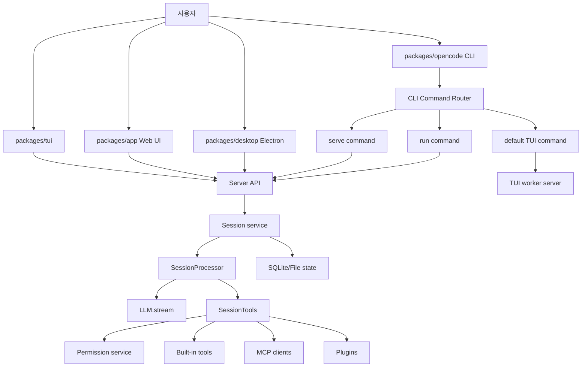
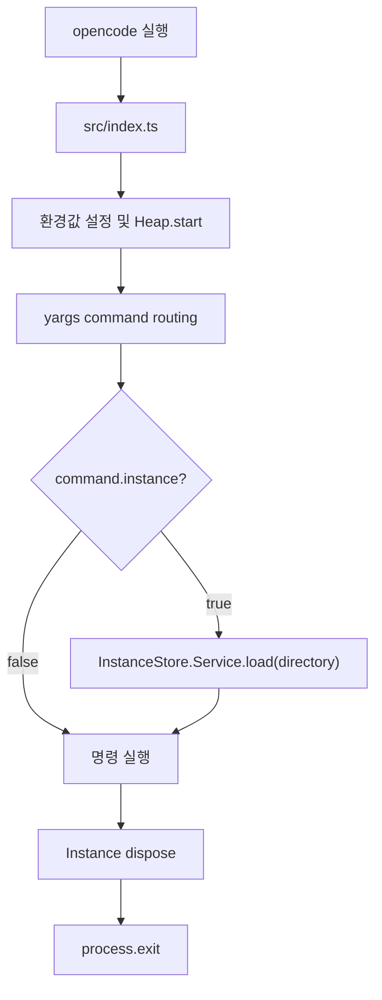
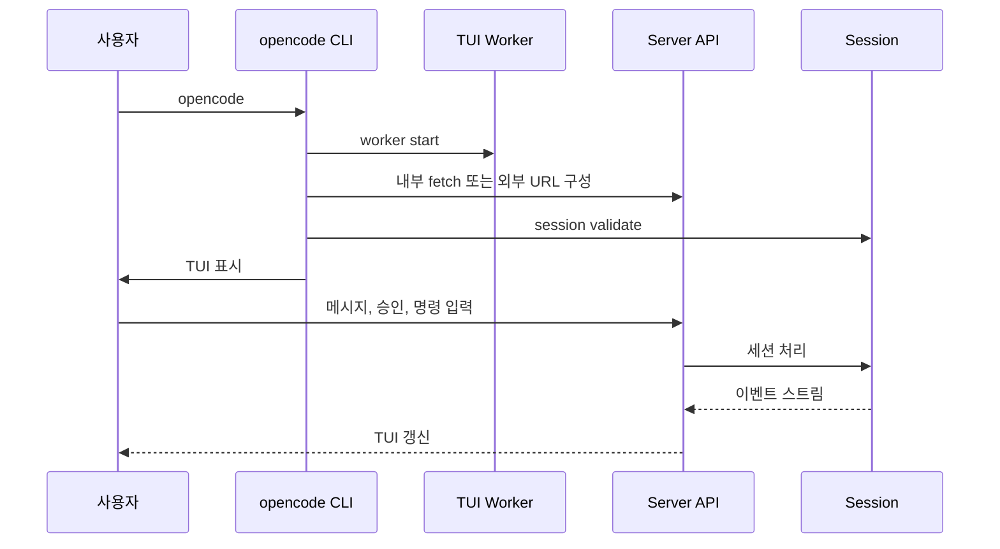
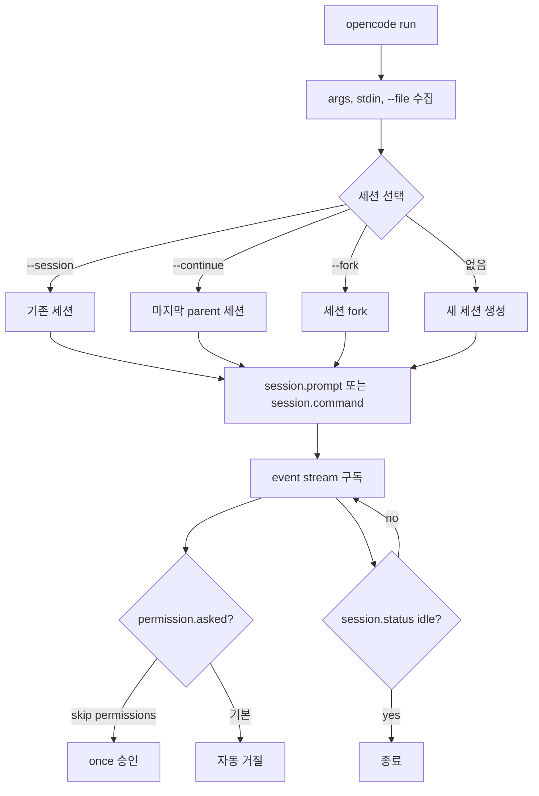
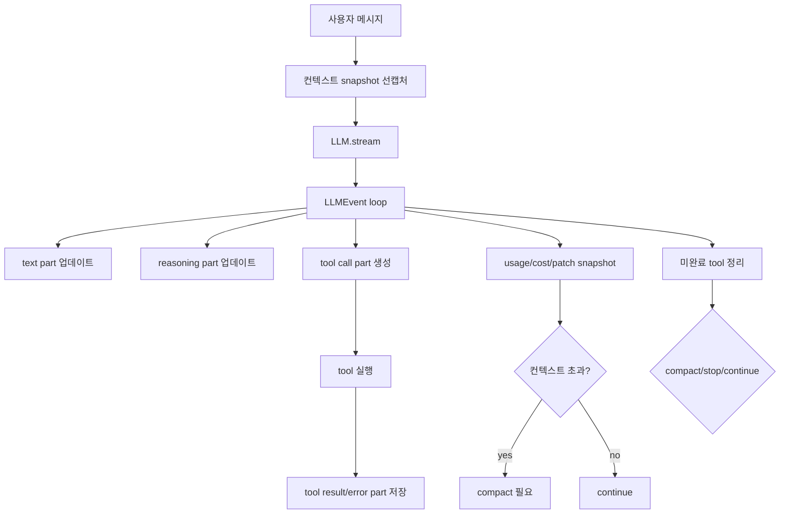
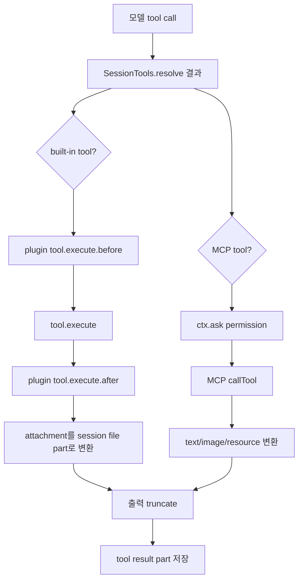
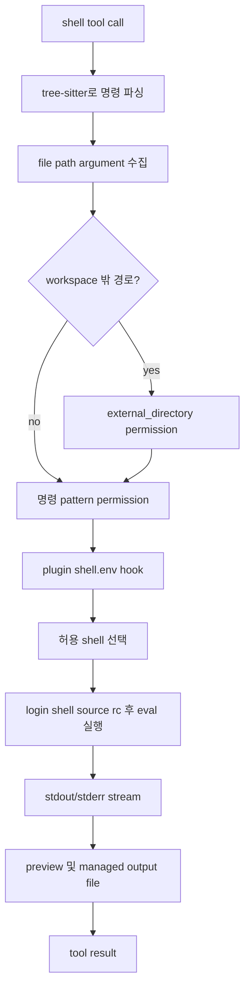

# anomalyco/opencode 심층 분석

분석 기준일: 2026-06-10  
분석 대상: `anomalyco/opencode`  
로컬 경로: `sources/anomalyco__opencode`  
분석 커밋: `4c9abff`  
기본 브랜치: `dev`  
라이선스: MIT  
주요 언어: TypeScript  
최신 릴리스: `v1.17.1`

## 1. 총평

opencode는 단순한 터미널 래퍼형 코딩 에이전트가 아니라, CLI, TUI, 웹 앱, 데스크톱 앱, HTTP 서버, SDK, 플러그인, MCP, 세션 저장소를 하나의 제품 구조로 묶은 로컬 중심 AI 코딩 플랫폼에 가깝다. README의 자기 정의는 "The open source AI coding agent"지만, 소스 구조상 핵심은 "한 번의 프롬프트를 실행하는 도구"보다 "지속 가능한 세션, 권한 정책, 에이전트 프로필, 툴 실행, UI 표면을 모두 관리하는 런타임"이다.

가장 중요한 특징은 세션 모델이다. `CONTEXT.md`와 `packages/opencode/src/session/processor.ts`를 보면 opencode는 대화 기록, 시스템 컨텍스트, 툴 결과, 압축(compaction), 모델 변경, 권한 승인 상태를 임의로 뒤섞지 않으려 한다. 특히 `Context Epoch`, `Baseline System Context`, `Safe Provider-Turn Boundary` 같은 개념을 명시해 두었다. 이는 "컨텍스트를 필요할 때마다 문자열로 붙이는" 설계가 아니라, 모델에게 전달되는 입력의 안정성과 재현성을 별도의 설계 대상으로 본다는 뜻이다.

제품 철학은 다음 세 가지로 요약된다.

1. 로컬 개발자의 작업공간을 중심에 둔다.
2. 툴 실행은 강력하게 열어 두되, 에이전트별 권한 정책과 승인 요청으로 제어한다.
3. CLI 하나가 아니라 TUI, 서버, 웹, 데스크톱, 플러그인을 연결하는 확장 가능한 에이전트 운영체제를 지향한다.

## 2. 레포지토리 구성

루트는 Bun workspace 기반이다. 루트 `package.json`의 `test` 스크립트는 의도적으로 실패하도록 되어 있어, 루트에서 일괄 테스트를 돌리는 구조가 아니다. 실제 개발과 실행은 개별 패키지 단위로 이루어진다.

주요 패키지는 다음과 같다.

| 경로 | 역할 |
| --- | --- |
| `packages/opencode` | 메인 CLI, 서버, 세션, 에이전트, 툴, 권한, MCP 런타임 |
| `packages/app` | Solid/Vite 기반 웹 UI |
| `packages/desktop` | Electron 기반 데스크톱 앱 |
| `packages/server` | HTTP API 핸들러 패키지 |
| `packages/tui` | OpenTUI 기반 터미널 UI |
| `packages/llm` | LLM 프로토콜 및 네이티브 런타임 연동 |
| `packages/plugin` | 플러그인 SDK |
| `packages/core` | 저장소, 데이터베이스, 세션 코어 계층 |

전체 구조는 다음처럼 볼 수 있다.

## 3. CLI 진입점과 명령 라우팅

메인 진입점은 `packages/opencode/src/index.ts`다. yargs 기반 CLI이며 전역 옵션으로 `--print-logs`, `--log-level`, `--pure`를 받는다. 미들웨어는 `OPENCODE_PRINT_LOGS`, `OPENCODE_LOG_LEVEL`, `OPENCODE_PURE`, `AGENT`, `OPENCODE`, `OPENCODE_PID` 같은 환경값을 설정하고 heap 추적을 시작한다.

등록되는 명령은 매우 많다. 주요 명령만 보면 다음과 같다.

| 명령 | 역할 |
| --- | --- |
| 기본 `$0 [project]` | TUI 실행 |
| `run` | 비대화형 또는 대화형 프롬프트 실행 |
| `serve` | headless HTTP 서버 실행 |
| `attach` | 실행 중인 서버나 세션에 붙기 |
| `mcp` | MCP 관련 기능 |
| `agent` | 에이전트 관리 |
| `plugin` | 플러그인 관리 |
| `session` | 세션 관리 |
| `models`, `providers` | 모델 및 공급자 확인 |
| `export`, `import` | 데이터 이동 |

`index.ts`의 마지막에는 `finally { process.exit() }`가 있다. 주석상 docker-container MCP 서버 같은 하위 프로세스가 남아 프로세스가 종료되지 않는 상황을 피하려는 목적이다. 이 선택은 실용적이지만, 라이브러리처럼 임베드하는 사용자는 강제 종료 지점을 의식해야 한다.

명령 구현은 `packages/opencode/src/cli/effect-cmd.ts`의 `cmd()` 래퍼를 거친다. 기본값으로 `instance: true`가 설정되어 프로젝트 인스턴스 컨텍스트를 로드하고, 명령 실행 후 `store.dispose(ctx)`로 정리한다. `serve`, `models`, `account`, `db`, `upgrade`처럼 프로젝트 인스턴스가 필요하지 않은 명령은 `instance: false`를 사용한다.

## 4. 사용자 실행 플로우

### 4.1 기본 TUI 플로우

사용자가 `opencode`만 실행하면 기본 TUI 명령이 실행된다. 구현은 `packages/opencode/src/cli/cmd/tui.ts`다.

흐름은 다음과 같다.

1. 프로젝트 디렉터리를 해석한다.
2. TUI worker를 생성한다.
3. 외부 포트, hostname, mDNS 설정이 있으면 실제 서버 URL을 만든다.
4. 그렇지 않으면 `http://opencode.internal`이라는 내부 URL과 custom fetch를 사용한다.
5. 세션을 검증하고 업그레이드 여부를 확인한다.
6. TUI 레이어를 실행한다.
7. 종료 시 worker를 중지한다.

이 구조의 장점은 TUI가 서버 API를 직접 호출하는 클라이언트처럼 동작한다는 점이다. 로컬 in-process 실행과 외부 서버 연결을 같은 API 형태로 다룰 수 있다.

### 4.2 `opencode run` 비대화형 플로우

`packages/opencode/src/cli/cmd/run.ts`는 자동화와 스크립팅에 중요한 명령이다. 기본 모드는 비대화형이다.

지원하는 주요 옵션은 다음과 같다.

| 옵션 | 의미 |
| --- | --- |
| `--file` | 파일을 프롬프트 part로 첨부 |
| `--session` | 기존 세션 지정 |
| `--continue` | 마지막 parent 세션 계속 사용 |
| `--fork` | 기존 세션에서 fork |
| `--command` | 텍스트 프롬프트 대신 명령 실행 |
| `--format json` | JSON 이벤트 출력 |
| `--interactive` | 대화형 모드 |
| `--attach` | 외부 서버에 연결 |
| `--dangerously-skip-permissions` | 권한 요청을 자동 승인 |

비대화형 모드에서 중요한 부분은 권한 처리다. `permission.asked` 이벤트가 발생하면 기본적으로 요청을 출력하고 자동 거절한다. 사용자가 `--dangerously-skip-permissions`를 준 경우에만 `once`로 승인한다. 즉, opencode는 자동화 모드에서 무작정 파일 편집이나 명령 실행을 승인하지 않는다.

### 4.3 서버 모드

`opencode serve`는 `packages/opencode/src/cli/cmd/serve.ts`에 있다. 이 명령은 `instance: false`로 동작하며, `Server.listen()`으로 HTTP 서버를 띄운다.

보안 관점에서 주목해야 할 부분은 비밀번호다. `SECURITY.md`와 `serve.ts` 모두 `OPENCODE_SERVER_PASSWORD`를 권장한다. 비밀번호가 없으면 경고는 출력하지만 서버는 실행될 수 있다. 따라서 `--hostname 0.0.0.0`처럼 외부 바인딩을 사용하는 경우에는 반드시 인증 설정이 필요하다.

서버 구현은 `packages/opencode/src/server/server.ts`에 있다. Effect HTTP API 앱을 만들고, 기본 in-process fetch인 `Server.Default().app.fetch`도 제공한다. 포트가 0이면 4096을 먼저 시도한 뒤 임의의 free port로 fallback한다. loopback이 아닌 주소에서는 mDNS publish도 지원한다.

## 5. 세션 처리 아키텍처

opencode의 중심은 `SessionProcessor`다. 단순히 모델 stream을 받아 stdout에 찍는 구조가 아니라, 모든 모델 이벤트를 세션 part로 변환하고 저장하며, 툴 호출, 권한, 비용, 압축, 상태 전환을 같이 관리한다.

핵심 파일은 다음과 같다.

| 파일 | 역할 |
| --- | --- |
| `packages/opencode/src/session/processor.ts` | 모델 stream 이벤트를 세션 상태와 part로 반영 |
| `packages/opencode/src/session/llm.ts` | provider, model, tool, message를 준비해 LLM stream 생성 |
| `packages/opencode/src/session/tools.ts` | built-in tool과 MCP tool을 AI SDK tool로 래핑 |
| `packages/opencode/src/session/system.ts` | 시스템 프롬프트와 환경 컨텍스트 구성 |
| `packages/opencode/src/session/instruction.ts` | `AGENTS.md`, `CLAUDE.md`, config instruction 로딩 |
| `CONTEXT.md` | 세션 컨텍스트 모델의 설계 문서 |

`SessionProcessor.Service.create`는 LLM stream이 시작되기 전에 snapshot을 미리 캡처한다. 주석에 따르면 AI SDK가 start-step 이벤트를 내기 전에 내부적으로 tool을 실행할 수 있기 때문이다. 이 선택은 도구 실행 시점과 세션 기록 시점 사이의 어긋남을 줄이기 위한 방어적 설계다.

처리하는 주요 이벤트는 다음과 같다.

| 이벤트 | 처리 |
| --- | --- |
| `text-start`, `text-delta`, `text-end` | assistant text part 생성 및 갱신 |
| `reasoning-start`, `reasoning-delta`, `reasoning-end` | reasoning part 기록 |
| `tool-input-start`, `tool-input-delta`, `tool-input-end` | tool input streaming 상태 기록 |
| `tool-call` | pending/running tool part 생성 |
| `tool-result` | completed tool part 저장 |
| `tool-error` | error tool part 저장 |
| `provider-error` | provider 오류 반영 |
| `step-start`, `step-finish` | step 단위 사용량, 비용, patch snapshot, 압축 필요 여부 계산 |
| `finish` | assistant message 종료 |

`CONTEXT.md`에 나타난 설계 철학은 특히 중요하다.

| 개념 | 의미 |
| --- | --- |
| System Context | 모델 요청마다 포함되는 시스템 지시, 환경 정보, provider metadata |
| Session History | durable conversation history |
| Context Epoch | 특정 baseline system context 아래에서 이어지는 provider turn 구간 |
| Baseline System Context | epoch 시작 시 고정되는 시스템 컨텍스트 |
| Safe Provider-Turn Boundary | context 변경을 모델 호출 사이에만 반영하는 경계 |
| Managed Tool Output File | 큰 tool output을 별도 파일에 보관하고 모델에는 bounded preview 제공 |

이 설계는 장기 세션에서 시스템 프롬프트, 파일 컨텍스트, 도구 결과, 압축 결과가 뒤섞여 모델 입력을 오염시키는 문제를 줄이려는 접근이다.

## 6. LLM 호출 계층

`packages/opencode/src/session/llm.ts`의 `LLM.stream`은 provider, model, tool, permission, plugin, message 준비를 한 곳에 모은다.

흐름은 다음과 같다.

1. provider와 model 정보를 해석한다.
2. 인증 및 provider 설정을 로드한다.
3. `LLMRequestPrep.prepare`로 messages, tools, params를 준비한다.
4. GitLab Workflow 모델이면 별도 workflow path를 사용한다.
5. `experimentalNativeLlm` flag가 있으면 `@opencode-ai/llm` 네이티브 런타임을 시도한다.
6. 기본 경로에서는 AI SDK `streamText`를 사용한다.
7. AI SDK stream을 내부 `LLMEvent`로 변환한다.

AI SDK 경로는 `activeTools`, `toolChoice`, `maxOutputTokens`, provider option transform, OpenTelemetry span, tool call repair를 포함한다. tool call repair는 소문자 도구명 보정 또는 `invalid` tool로 라우팅하는 방식이다. 이는 모델이 tool schema를 어길 때 세션을 바로 깨뜨리지 않기 위한 완충 장치다.

## 7. 툴 시스템

opencode의 툴 시스템은 강력하고 복잡하다. `packages/opencode/src/tool/registry.ts`가 built-in tool과 custom tool을 모으고, `packages/opencode/src/session/tools.ts`가 이를 모델이 호출할 수 있는 AI SDK tool로 변환한다.

### 7.1 Built-in tool

기본 registry에는 다음 계열의 도구가 있다.

| 도구 | 역할 |
| --- | --- |
| `read` | 파일 읽기 |
| `grep`, `glob` | 검색 |
| `edit`, `write` | 파일 수정 |
| `apply_patch` | patch 기반 수정 |
| `shell` | shell 명령 실행 |
| `task` | subagent 실행 |
| `fetch`, `search` | 웹 또는 검색 |
| `todo` | 작업 목록 |
| `skill` | skill 활성화 |
| `plan` | 계획 모드 보조 |
| `lsp` | LSP 기반 진단 |
| `invalid` | 잘못된 tool call 흡수 |

모델에 따라 툴 구성이 달라진다. GPT 계열 모델 일부에서는 `edit`/`write` 대신 `apply_patch`를 사용하도록 분기한다. 이는 GPT 계열이 patch 형식 편집에 더 적합하다는 제품 판단으로 보인다.

### 7.2 ToolRegistry 확장

`ToolRegistry`는 세 가지 소스에서 도구를 모은다.

1. built-in tool
2. config 디렉터리의 `{tool,tools}/*.{js,ts}` 파일
3. plugin에서 제공하는 tool

custom tool은 `file://` dynamic import로 로드된다. 확장성은 크지만, 보안상으로는 "프로젝트 또는 사용자 config 디렉터리의 코드가 런타임에 실행된다"는 뜻이다. 신뢰하지 않는 프로젝트에서 opencode를 실행할 때는 custom tool과 plugin 경로를 확인해야 한다.

### 7.3 SessionTools 실행 흐름

`SessionTools.resolve`는 built-in tool과 MCP tool을 AI SDK tool 형태로 감싼다.

이 구조에서 permission은 tool 내부 또는 MCP wrapper에서 실행된다. built-in tool은 각 tool 구현이 필요한 permission을 직접 요청한다. MCP tool은 wrapper 수준에서 `ctx.ask({ permission: key, patterns: ["*"], always: ["*"] })`를 호출한다.

## 8. 권한 정책과 에이전트

권한 구현은 `packages/opencode/src/permission/index.ts`에 있다. 규칙의 기본 동작은 `ask`다. 마지막으로 매칭되는 wildcard rule을 사용하며, 결과는 `allow`, `ask`, `deny` 중 하나다.

`ask`가 필요한 경우에는 `PermissionV1.Request`가 생성되고 `permission.asked` 이벤트가 publish된다. 사용자가 `reject`하면 같은 세션의 pending 요청도 함께 실패한다. `once`는 해당 요청만 승인한다. `always`는 승인 rule을 세션에 추가하고, 그 rule로 허용되는 pending 요청들을 자동 해결한다.

에이전트 정의는 `packages/opencode/src/agent/agent.ts`에 있다. 기본 에이전트는 다음과 같다.

| 에이전트 | 모드 | 특징 |
| --- | --- | --- |
| `build` | primary | 기본 에이전트, 질문 및 plan_enter 허용 |
| `plan` | primary | 파일 편집 대부분 deny, plan 문서 경로만 허용 |
| `general` | subagent | 복잡한 검색과 분석용, todo deny |
| `explore` | subagent | 읽기와 검색 중심, 대부분 deny |
| `compaction` | hidden | 대화 압축용 |
| `title` | hidden | 제목 생성용 |
| `summary` | hidden | 요약용 |

기본 권한에는 중요한 보호 규칙이 있다.

| 권한 | 기본 성격 |
| --- | --- |
| `*` | 기본 allow 성향이지만 특수 규칙이 우선 |
| `doom_loop` | ask |
| `external_directory` | ask, 일부 내부 디렉터리 허용 |
| `question` | deny, build/plan에서는 allow |
| `plan_enter`, `plan_exit` | 기본 deny, 특정 에이전트에서 allow |
| `.env`, `.env.*` 읽기 | ask, `.env.example`은 예외 |

이 방식은 "동일한 툴셋을 에이전트 프로필별로 다르게 묶는" 구조다. plan 에이전트는 실제 편집을 막고 계획 문서 중심으로 제한되며, build 에이전트는 구현을 수행할 수 있다.

## 9. Shell 실행 흐름

`shell` tool은 `packages/opencode/src/tool/shell.ts`와 `packages/opencode/src/shell/shell.ts`가 담당한다.

특징은 다음과 같다.

1. bash와 PowerShell 명령을 tree-sitter WASM으로 파싱한다.
2. `rm`, `cp`, `mv`, `mkdir`, `touch` 같은 파일 조작 명령의 path argument를 식별한다.
3. workspace 밖 경로는 `external_directory` permission을 요청한다.
4. 명령 패턴에 대해 shell permission을 요청한다.
5. shell rc 파일을 source한 뒤 `eval` 방식으로 실행한다.
6. output은 tail/preview로 관리하고, 큰 출력은 managed output file로 넘긴다.
7. timeout 또는 abort 시 process tree를 종료한다.

이 설계는 사용성을 중시한다. 사용자의 실제 shell 환경을 source하기 때문에 개발 도구와 alias, PATH가 잘 맞을 가능성이 크다. 반면 보안상으로는 rc 파일과 `eval`의 영향을 받는다. opencode는 OS sandbox가 아니라 permission rule과 command scan에 의존하므로, 신뢰하지 않는 작업공간에서는 `--dangerously-skip-permissions`를 쓰지 않는 것이 중요하다.

## 10. 파일 편집 도구

### 10.1 `edit`

`packages/opencode/src/tool/edit.ts`의 edit tool은 단순 문자열 치환보다 훨씬 복잡하다. 소스 주석은 Cline과 Gemini edit-corrector에서 영향을 받았음을 밝힌다.

주요 동작은 다음과 같다.

1. `filePath`, `oldString`, `newString`, `replaceAll`을 받는다.
2. 파일 단위 semaphore로 동시 편집 충돌을 줄인다.
3. `oldString`이 비어 있고 파일이 없으면 새 파일 생성으로 처리한다.
4. 기존 파일에 빈 `oldString`을 주면 write tool을 쓰라고 오류를 낸다.
5. BOM과 line ending을 보존한다.
6. exact match, line-trimmed match, block anchor fallback, Levenshtein 기반 fuzzy match를 시도한다.
7. diff를 만들어 `edit` permission을 요청한다.
8. 파일을 쓰고 formatter를 실행한다.
9. FileSystem, Watcher, LSP 진단 이벤트를 갱신한다.

### 10.2 `write`

`write`는 전체 파일 쓰기 도구다. 기존 파일이 있으면 diff를 계산해 permission을 요청하고, BOM, format, watcher event, LSP diagnostics를 처리한다. 관련 파일 최대 5개의 diagnostics까지 포함하는 점이 실용적이다.

### 10.3 `apply_patch`

`apply_patch`는 custom patch text를 파싱해 add, update, delete, move를 검증하고 적용한다. 변경 파일 수와 diff를 계산해 `edit` permission을 요청한다. GPT 계열 모델 일부에서는 registry가 `edit`/`write` 대신 `apply_patch`를 제공한다.

## 11. MCP 구조

MCP 구현은 `packages/opencode/src/mcp/index.ts`에 있다.

지원하는 MCP 유형은 두 가지다.

| 유형 | 구현 |
| --- | --- |
| remote | Streamable HTTP를 먼저 시도하고, 필요 시 SSE로 fallback |
| local | stdio transport, command/env/cwd 기반 실행 |

remote MCP는 OAuth도 처리한다. client registration, needs auth, browser open, CSRF state 확인, pending OAuth transport 저장이 포함된다. local MCP는 `StdioClientTransport`를 사용하며 command를 인스턴스 디렉터리 기준으로 실행한다. command가 opencode인 경우 `BUN_BE_BUN=1`도 설정한다.

툴 목록은 pagination으로 최대 1000 page까지 처리한다. schema validation에서 reference 관련 문제가 있으면 `outputSchema`를 생략하는 tolerant path가 있다. MCP tool 이름은 `<client>_<tool>` 형태로 sanitize된다.

MCP finalizer는 client를 닫고, stdio transport에서는 `pgrep -P`로 descendant pid를 찾아 종료하려고 시도한다. 외부 프로세스 수명을 꽤 진지하게 다루는 구조다.

## 12. 설정과 instruction 로딩

설정 로딩은 `packages/opencode/src/config/config.ts`와 `packages/opencode/src/config/parse.ts`가 담당한다.

지원하는 설정 소스는 다음과 같다.

| 설정 소스 | 설명 |
| --- | --- |
| global config directory | `config.json`, `opencode.json`, `opencode.jsonc`, legacy TOML |
| `OPENCODE_CONFIG` | 특정 config 파일 지정 |
| `OPENCODE_CONFIG_DIR` | config 디렉터리 지정 |
| `OPENCODE_CONFIG_CONTENT` | 환경변수로 config 직접 주입 |
| remote config values | headers 등 일부 값 외부화 |

`parse.ts`는 top-level extra key를 거부한다. 이는 설정 오타가 조용히 무시되는 문제를 줄인다.

instruction 로딩은 `packages/opencode/src/session/instruction.ts`가 담당한다. 기본적으로 global `AGENTS.md`, 프로젝트 `AGENTS.md`를 읽고, 선택적으로 `~/.claude/CLAUDE.md`, 프로젝트 `CLAUDE.md`도 사용한다. `CONTEXT.md`는 deprecated로 취급된다. `OPENCODE_DISABLE_PROJECT_CONFIG`로 프로젝트 설정 로딩을 끌 수 있다.

config의 `instructions`에는 local glob과 URL도 들어갈 수 있다. URL instruction은 timeout 5000ms로 fetch된다. 강력한 기능이지만, 원격 instruction은 모델 컨텍스트에 직접 들어가는 공급망 입력이므로 신뢰 경계를 분명히 해야 한다.

## 13. 차별점

opencode의 차별점은 다음이다.

| 차별점 | 설명 |
| --- | --- |
| 세션 중심 설계 | durable history, context epoch, snapshot, compaction을 명시적으로 다룸 |
| 여러 UI 표면 | CLI, TUI, Web, Desktop, HTTP server가 같은 core를 공유 |
| 에이전트별 권한 프로필 | build, plan, general, explore가 다른 권한과 용도를 가짐 |
| Effect 기반 서비스 구조 | 서비스와 레이어로 런타임 의존성을 조립 |
| 강한 툴 확장성 | built-in, custom file tool, plugin tool, MCP tool을 모두 통합 |
| 상세한 shell permission scan | tree-sitter로 경로와 패턴을 분석하고 외부 디렉터리를 별도 승인 |
| managed tool output | 큰 툴 출력을 모델 컨텍스트에 그대로 밀어 넣지 않고 별도 파일로 관리 |
| MCP remote OAuth | 단순 stdio MCP를 넘어 remote MCP 인증 플로우까지 구현 |
| provider path 다중화 | AI SDK, experimental native LLM, GitLab workflow 특수 경로 지원 |

opencode는 "모델이 도구를 호출한다"는 공통 패턴을 넘어, 그 호출 결과를 장기 세션과 UI 이벤트, 권한 요청, 파일 상태, 진단 정보에 어떻게 반영할지를 깊게 설계한 쪽에 가깝다.

## 14. 위험 요소와 이상한 점

### 14.1 `--dangerously-skip-permissions`

`run` 명령의 `--dangerously-skip-permissions`는 permission 요청을 자동 `once` 승인한다. 자동화에서는 편리하지만, shell, edit, MCP tool이 모두 연결될 수 있으므로 신뢰하지 않는 프롬프트나 프로젝트에서는 위험하다.

### 14.2 인증 없는 서버 모드

`opencode serve`는 `OPENCODE_SERVER_PASSWORD`가 없으면 경고하지만 서버 실행을 막지는 않는다. loopback이 아닌 주소에 바인딩하면 외부에서 세션, 파일, 툴 API에 접근할 수 있는 위험이 생긴다.

### 14.3 custom tool과 plugin 코드 실행

config 디렉터리의 `{tool,tools}/*.{js,ts}` 파일은 dynamic import된다. plugin도 런타임에 로드된다. opencode가 실행되는 프로젝트와 사용자 config를 신뢰할 수 있어야 한다.

### 14.4 shell 실행 모델

shell tool은 사용자의 shell rc 파일을 source하고 `eval`로 명령을 실행한다. 실제 개발 환경과 잘 맞는 대신, shell startup script와 alias, function, env가 실행 결과와 보안에 영향을 준다.

### 14.5 command scan의 한계

tree-sitter 기반 path scan은 정적인 경로 인식에는 강하지만, 동적 expansion, 복잡한 shell construct, runtime-generated path는 완벽히 알 수 없다. 소스에서도 dynamic path는 skip되는 흐름이 있다. 따라서 permission scan은 보조 장치이지 OS sandbox가 아니다.

### 14.6 remote instruction

config instruction URL은 모델 시스템 컨텍스트에 들어갈 수 있다. 원격 URL이 바뀌면 같은 프로젝트라도 모델 지시가 달라질 수 있다.

### 14.7 source checkout 직접 실행 특이점

로컬 환경에는 Bun과 `node_modules`가 없었다. 또한 source checkout에서 `node packages/opencode/bin/opencode --help`를 직접 실행하면 패키지의 `type: module`과 CJS 스타일 wrapper의 `require`가 충돌해 실패했다. 공식 설치는 platform binary와 package manager 배포 흐름을 사용하므로 이 현상을 제품 런타임 버그로 단정하기는 어렵다. 다만 레포를 직접 clone한 뒤 Node로 bin wrapper를 실행하는 경로는 매끄럽지 않았다.

### 14.8 루트 테스트 스크립트

루트 `test` 스크립트는 `echo 'do not run tests from root' && exit 1` 형태다. 테스트는 패키지별로 접근해야 하며, 처음 보는 기여자가 루트에서 테스트를 실행하면 실패한다.

### 14.9 V1/V2 이벤트와 experimental path

세션 처리 코드에는 V1/V2 이벤트, experimental native LLM, GitLab Workflow 모델 경로가 함께 존재한다. 기능 폭이 넓다는 장점이 있지만, 장애 분석 시 어떤 path가 실제 사용되었는지 확인해야 한다.

## 15. 케이스별 실제 동작 정리

| 케이스 | 동작 흐름 | 주의점 |
| --- | --- | --- |
| `opencode` | TUI worker 시작, 내부 fetch 또는 외부 서버 URL로 API 사용 | TUI도 서버 API 클라이언트처럼 동작 |
| `opencode run "..."` | 세션 생성 또는 선택, prompt 전송, event stream 대기 | permission 요청은 기본 자동 거절 |
| `opencode run --interactive` | local in-process server fetch로 대화형 실행 | API 경로는 attach 모드와 유사 |
| `opencode run --attach URL` | 외부 서버의 SDK client로 연결 | 서버 인증과 네트워크 노출 확인 필요 |
| `opencode serve` | headless HTTP 서버 시작 | password 없으면 경고만 하고 실행 가능 |
| 모델이 파일 읽기 | read tool 실행, `.env` 등은 ask 규칙 적용 | 프로젝트 instruction과 권한 rule 영향 |
| 모델이 파일 수정 | edit/write/apply_patch가 diff 생성 후 edit permission 요청 | agent가 plan이면 대부분 deny |
| 모델이 shell 실행 | command parse, external path scan, shell permission 요청, 실행 | OS sandbox가 아니라 permission 기반 |
| 모델이 MCP tool 호출 | MCP tool wrapper가 permission 요청 후 callTool | local MCP command와 remote OAuth 신뢰 필요 |
| 컨텍스트 초과 | step-finish에서 overflow 감지, compact 필요 반환 | compaction agent와 epoch 개념이 중요 |

## 16. 로컬 검증 결과

이번 분석에서는 전체 테스트를 실행하지 않았다. 이유는 다음과 같다.

1. 로컬 환경에 Bun이 설치되어 있지 않았다.
2. `node_modules`가 없었다.
3. 루트 테스트 스크립트는 의도적으로 실패하도록 되어 있다.
4. 실제 제품 실행은 platform binary 빌드 또는 package manager 설치 흐름을 전제로 한다.

수행한 검증은 소스 구조, CLI 진입점, 명령 구현, 세션 처리, LLM 호출, 툴, 권한, MCP, config, security 문서의 정적 분석과 일부 직접 실행 확인이다.

## 17. 이해를 위한 읽기 순서

opencode를 설계 관점에서 이해하려면 다음 순서가 좋다.

1. `README.md`로 제품 표면과 설치 방식을 파악한다.
2. `CONTEXT.md`로 세션 철학을 먼저 이해한다.
3. `packages/opencode/src/index.ts`와 `cli/effect-cmd.ts`로 명령 라우팅을 본다.
4. `cli/cmd/tui.ts`, `cli/cmd/run.ts`, `cli/cmd/serve.ts`로 사용자 플로우를 나눠 본다.
5. `session/processor.ts`와 `session/llm.ts`로 모델 호출과 이벤트 처리를 본다.
6. `tool/registry.ts`, `session/tools.ts`, `permission/index.ts`로 tool과 permission의 결합을 본다.
7. `tool/shell.ts`, `tool/edit.ts`, `tool/write.ts`, `tool/apply_patch.ts`로 실제 코드 변경이 어떻게 일어나는지 확인한다.
8. `mcp/index.ts`로 외부 tool 생태계와 연결되는 방식을 본다.

## 18. 결론

opencode는 현재 분석 대상 중에서도 "에이전트 제품 런타임" 성격이 강한 레포다. 세션, 권한, 툴, 서버, UI가 잘게 분리되어 있고, 각 계층이 이벤트와 서비스로 연결된다. 특히 `CONTEXT.md`에 드러난 장기 세션 철학은 이 레포의 핵심이다.

반대로 위험 요소도 그 강력함에서 나온다. shell, plugin, MCP, remote instruction, server mode는 모두 개발자 생산성을 높이지만 신뢰 경계를 넓힌다. opencode를 이해할 때는 "어떤 모델을 쓰는가"보다 "어떤 권한 규칙과 어떤 런타임 표면에서 실행되는가"를 먼저 봐야 한다.
