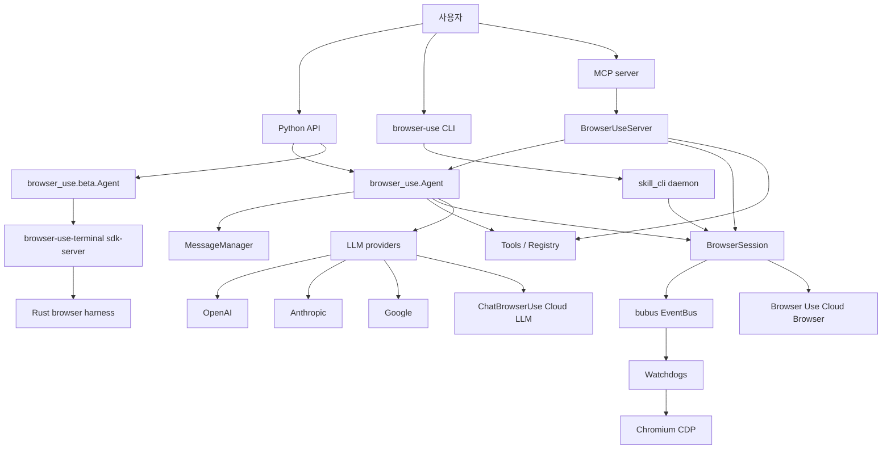
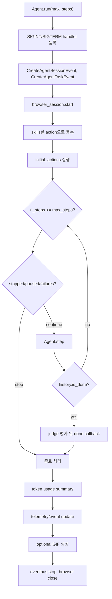
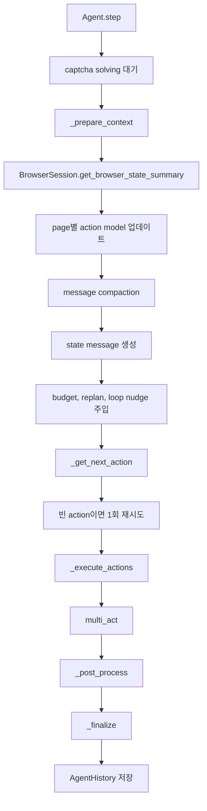
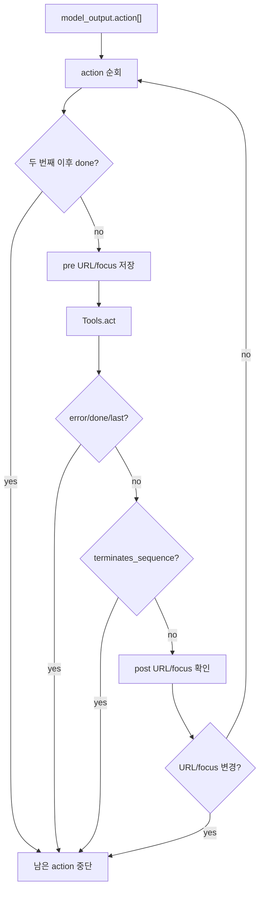
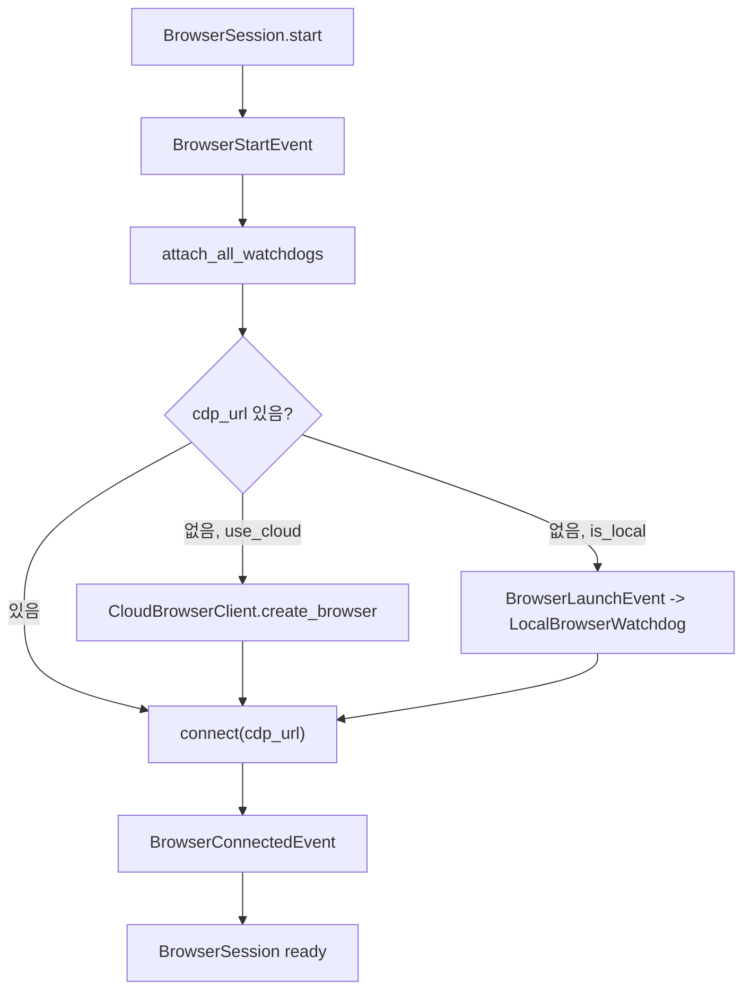
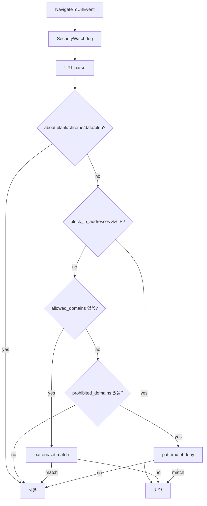
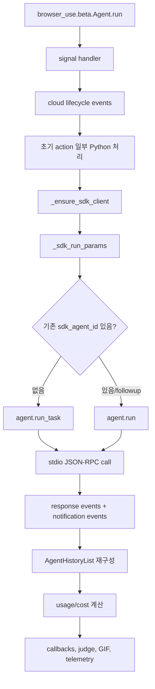
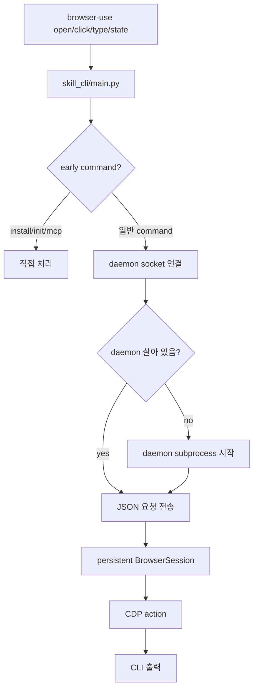
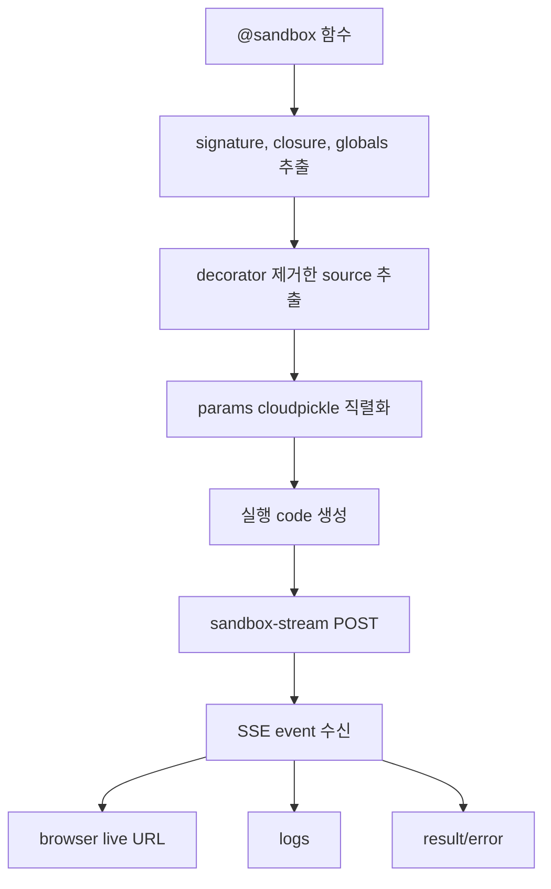

# browser-use/browser-use 심층 분석

분석 기준일: 2026-06-10  
분석 대상: `browser-use/browser-use`  
로컬 경로: `sources/browser-use__browser-use`  
분석 커밋: `476ef1b`  
기본 브랜치: `main`  
라이선스: MIT  
주요 언어: Python  
최신 릴리스: `0.13.1`

## 1. 총평

browser-use는 "웹사이트를 AI 에이전트가 사용할 수 있게 만드는" 브라우저 자동화 에이전트 프레임워크다. 코딩 에이전트 계열과 비교하면 파일 편집이나 shell 실행보다 브라우저 상태 관찰, DOM 직렬화, 클릭 가능한 요소 인덱싱, CDP 기반 조작, 시각 정보, 다운로드, 쿠키와 프로필, CAPTCHA와 cloud browser 연동에 초점이 있다.

2026-06-10 기준 GitHub 메타데이터상 생성일은 2024-10-31, 최신 릴리스는 2026-06-10의 `0.13.1`, 별 수는 약 98,088개, fork는 약 10,944개다. 성장 속도가 매우 빠르고, README는 open-source agent와 Browser Use Cloud를 명확히 비교한다. 즉 이 레포는 순수 OSS 라이브러리이면서 동시에 상용 cloud 브라우저, Browser Use 전용 LLM, hosted agent, sandbox 실행과 강하게 연결되어 있다.

가장 중요한 구조 변화는 0.13 계열의 beta agent다. README는 새 beta agent를 다음 흐름으로 설명한다.

```text
Python API -> Rust core -> Browser harness -> Web task done
```

소스에서도 `browser_use.Agent`와 `browser_use.beta.Agent`가 공존한다. 기존 Python agent는 Python 코드에서 직접 브라우저 상태를 읽고 LLM에 action schema를 주고, 반환된 action을 실행하는 루프다. beta agent는 Python API 호환성을 유지하면서 `browser-use-terminal sdk-server`라는 Rust core를 stdio JSON-RPC로 호출한다. 따라서 browser-use를 이해할 때는 "기존 Python agent"와 "beta Rust core wrapper"를 분리해 봐야 한다.

## 2. 제품 철학

browser-use의 철학은 다음 네 가지로 정리된다.

1. 브라우저를 LLM에게 직접 노출하지 않고, LLM이 이해할 수 있는 상태와 action schema로 바꾼다.
2. 실제 브라우저 제어는 CDP 이벤트와 watchdog으로 관리해, 페이지 변경, 다운로드, 보안 정책, DOM 재구성, screenshot을 분리한다.
3. 모델 출력은 Pydantic schema로 강하게 검증한다.
4. OSS 로컬 실행과 Browser Use Cloud 실행을 같은 API 경험으로 이어 붙인다.

`AGENTS.md`에는 개발 규칙도 분명하다. uv 사용, Pydantic v2 기반 type-safe action schema, `ChatBrowserUse` 기본 추천, cloud browser를 성능 개선 옵션으로 안내하는 규칙이 들어 있다. 이 문서 자체도 레포의 방향을 보여준다. browser-use는 "어떤 모델이든 브라우저를 조작할 수 있게 하는 라이브러리"이면서, 동시에 "브라우저 자동화에 특화된 자체 모델과 cloud 브라우저를 쓰는 경험"으로 사용자를 유도한다.

## 3. 레포지토리 구성

루트 manifest는 `pyproject.toml`이다. Python 3.11 이상 4.0 미만을 요구한다. 패키지 버전은 `0.13.1`이다.

주요 의존성은 다음 성격으로 나뉜다.

| 계열 | 대표 의존성 | 역할 |
| --- | --- | --- |
| 브라우저/CDP | `cdp-use` | Chromium CDP 연결과 제어 |
| 이벤트 | `bubus` | 브라우저 세션과 watchdog event bus |
| LLM | `openai`, `anthropic`, `google-genai`, `groq`, `ollama` | 여러 모델 provider |
| cloud | `browser-use-sdk`, `httpx` | Browser Use Cloud, sandbox, SDK |
| 데이터 | `pydantic`, `python-docx`, `pypdf`, `reportlab` | action schema와 문서 처리 |
| CLI | `click`, `rich`, `InquirerPy`, optional `textual` | CLI, setup, legacy TUI |
| telemetry | `posthog` | anonymized telemetry |

주요 디렉터리는 다음과 같다.

| 경로 | 역할 |
| --- | --- |
| `browser_use/agent` | 기존 Python agent 루프 |
| `browser_use/beta` | Rust core 기반 beta agent wrapper |
| `browser_use/browser` | BrowserSession, BrowserProfile, CDP, watchdog |
| `browser_use/browser/watchdogs` | DOM, screenshot, security, downloads, local browser 등 이벤트 처리기 |
| `browser_use/tools` | action registry와 기본 브라우저 action |
| `browser_use/llm` | provider별 chat model wrapper |
| `browser_use/mcp` | MCP server/client/controller |
| `browser_use/skill_cli` | 빠른 CLI와 daemon 기반 지속 브라우저 제어 |
| `browser_use/sandbox` | cloud sandbox decorator |
| `browser_use/filesystem` | agent가 쓸 수 있는 제한적 파일 시스템 |
| `browser_use/sync`, `telemetry` | cloud sync, telemetry |
| `skills` | Claude Code 등에서 사용하는 skill 문서 |
| `examples`, `tests` | 사용 예제와 CI 테스트 |

## 4. 전체 아키텍처

browser-use 전체를 한 장으로 보면 다음과 같다.



이 구조에서 `BrowserSession`은 가장 재사용성이 큰 축이다. 기존 Python agent, MCP server, CLI daemon이 모두 BrowserSession을 통해 브라우저를 조작한다. beta agent는 Rust core가 브라우저 harness를 소유하지만, Python wrapper는 기존 Browser Use history, callback, telemetry, cost 계산과 호환되도록 결과를 재구성한다.

## 5. 기존 Python Agent

기존 에이전트는 `browser_use/agent/service.py`의 `Agent` 클래스다.

### 5.1 초기화

`Agent.__init__`은 매우 많은 설정을 받는다. 대표적인 것만 보면 다음과 같다.

| 파라미터 | 의미 |
| --- | --- |
| `task` | 사용자가 요청한 브라우저 작업 |
| `llm` | 사용할 LLM wrapper |
| `browser_profile`, `browser_session`, `browser` | 브라우저 실행 또는 연결 설정 |
| `tools`, `controller` | action registry |
| `skill_ids`, `skills` | skill 기반 action 등록 |
| `sensitive_data` | `<secret>...</secret>` 치환용 민감 정보 |
| `initial_actions` | 시작 전에 실행할 action |
| `use_vision` | screenshot을 LLM 컨텍스트에 포함할지 |
| `fallback_llm` | provider 오류나 rate limit 시 대체 모델 |
| `use_judge` | 최종 trace 평가 LLM 사용 여부 |
| `enable_planning` | plan field를 모델 출력에 포함할지 |
| `loop_detection_enabled` | 반복 행동 감지 |
| `message_compaction` | 메시지 압축 |
| `max_clickable_elements_length` | DOM 상태 문자열 길이 제한 |

LLM을 명시하지 않으면 `CONFIG.DEFAULT_LLM`을 먼저 보고, 없으면 `ChatBrowserUse()`를 사용한다. `ChatBrowserUse`는 Browser Use Cloud LLM API를 호출하며 `BROWSER_USE_API_KEY`가 필요하다. 완전 로컬 또는 다른 provider를 원하면 `ChatOpenAI`, `ChatAnthropic`, `ChatGoogle`, `ChatOllama` 등을 명시해야 한다.

`ChatBrowserUse` provider를 쓰면 `flash_mode=True`가 되고 planning은 구조적으로 꺼진다. Claude Sonnet 계열은 screenshot 크기를 자동으로 `1400x850`으로 맞춘다. 특정 모델명에 따라 coordinate clicking을 활성화하는 분기도 있다.

### 5.2 run 루프

`Agent.run()`은 브라우저 세션을 시작하고, 초기 action을 실행한 뒤 step loop를 돈다.



실행 중 consecutive failure가 `max_failures`를 넘으면 중단된다. `final_response_after_failure=True`이면 실패 후 마지막으로 done 응답을 강제하려는 흐름이 있다.

### 5.3 step 내부 흐름

`Agent.step()`은 한 step을 세 단계로 나눈다.

1. context 준비
2. LLM 출력 생성 및 action 실행
3. post-process와 history 저장



`_prepare_context`는 항상 screenshot을 요청한다. 코드 주석은 `use_vision=False`여도 cloud sync에 유용하므로 빠르게 캡처한다고 설명한다. 이후 DOM 상태, 클릭 가능한 요소, page-specific action, 민감 정보 안내, available file path, plan description을 메시지에 넣는다.

`_get_model_output_with_retry`는 모델이 action을 비워서 보내면 clarification message를 붙여 한 번 더 요청한다. 그래도 비어 있으면 안전한 noop 성격의 `done(success=False)`를 삽입한다.

### 5.4 multi_act와 page-change guard

모델은 한 step에서 여러 action을 반환할 수 있다. `multi_act()`는 이를 순서대로 실행하되 두 종류의 guard로 stale DOM 문제를 줄인다.

| guard | 방식 |
| --- | --- |
| static guard | action metadata의 `terminates_sequence=True`이면 뒤 action 중단 |
| runtime guard | action 전후 URL 또는 focus target이 바뀌면 뒤 action 중단 |

또한 `done` action은 단일 action으로만 허용한다. 클릭이나 navigate 뒤에 DOM이 바뀌었는데 기존 index를 계속 사용하는 문제를 줄이기 위한 실용적 방어다.



## 6. MessageManager와 출력 schema

LLM 입력은 `MessageManager`와 `SystemPrompt`가 만든다. Agent는 browser state summary, 이전 action 결과, task, available files, 민감 정보, screenshot, clickable element representation을 모아 LLM에게 보낸다.

출력은 `AgentOutput` Pydantic 모델이다. `Tools.registry.create_action_model()`은 현재 페이지에서 가능한 action을 기반으로 action union model을 생성한다. 모델은 자유 텍스트 명령이 아니라 구조화된 action 리스트를 반환해야 한다.

이 설계의 장점은 다음이다.

1. provider가 structured output을 지원하면 action validation이 강하다.
2. action별 parameter schema가 자동으로 prompt와 validation에 반영된다.
3. 페이지 URL별 action filtering이 가능하다.
4. tool call이 아닌 provider에서도 JSON/Pydantic 출력 방식으로 통일할 수 있다.

위험은 schema가 커질 수 있다는 점이다. 클릭 가능한 요소와 action description이 많아지면 prompt가 커지고, 모델이 잘못된 index나 stale element를 선택할 가능성도 남는다. 이를 줄이기 위해 URL shortening, max clickable length, page-change guard, loop nudge가 들어가 있다.

## 7. Tools와 Action Registry

툴 시스템은 `browser_use/tools/service.py`와 `browser_use/tools/registry/service.py`가 핵심이다.

### 7.1 Action 등록 방식

`Registry.action()` decorator는 action 함수를 등록한다. 함수 시그니처를 검사해 일반 action parameter와 special parameter를 나눈다.

런타임이 주입하는 special parameter는 대표적으로 다음이다.

| special parameter | 의미 |
| --- | --- |
| `browser_session` | 현재 BrowserSession |
| `page_url` | 현재 페이지 URL |
| `cdp_client` | CDP client |
| `page_extraction_llm` | 페이지 추출용 LLM |
| `available_file_paths` | 업로드 가능 파일 |
| `has_sensitive_data` | input action에서 민감 정보 사용 여부 |
| `file_system` | agent-managed 파일 시스템 |
| `extraction_schema` | structured extraction schema |

함수에 `**kwargs`를 허용하지 않는 것도 눈에 띈다. action signature를 명확히 하려는 선택이다.

### 7.2 기본 action 목록

기본 `Tools`는 여러 action을 등록한다.

| action | 기능 |
| --- | --- |
| `done` | 최종 결과 반환 |
| `search` | DuckDuckGo, Google, Bing 검색 URL로 이동 |
| `navigate` | URL 이동 |
| `go_back` | 뒤로 가기 |
| `wait` | 대기 |
| `click` | index 또는 coordinate 클릭 |
| `input` | element index에 텍스트 입력 |
| `upload_file` | 파일 업로드 |
| `switch`, `close` | 탭 전환과 닫기 |
| `extract` | 페이지 markdown을 LLM으로 추출 |
| `search_page` | 페이지 텍스트 grep형 검색 |
| `find_elements` | CSS selector 기반 요소 찾기 |
| `scroll`, `scroll_to_text` | 스크롤 |
| `send_keys` | 키 입력 |
| `save_as_pdf` | PDF 저장 |
| `screenshot` | screenshot |
| 파일 action | agent file system 읽기, 쓰기 등 |

`extract` action은 특히 중요하다. 페이지를 clean markdown으로 변환하고 구조 기반 chunking을 수행한 뒤, `page_extraction_llm`에 별도 추출 요청을 보낸다. output schema가 있으면 JSON schema를 Pydantic 모델로 변환해 structured extraction을 시도한다. 큰 결과는 file system에 저장하고 memory에는 파일명을 남긴다.

### 7.3 민감 정보 처리

`sensitive_data`는 `<secret>name</secret>` 형태 또는 literal placeholder를 action parameter에서 실제 값으로 치환한다. 새 형식은 domain pattern별 secret dictionary를 지원한다.

이 방식의 장점은 모델에게 실제 값을 직접 노출하지 않고 placeholder로 작업시킬 수 있다는 점이다. 단, legacy 형식 `{key: value}`는 모든 domain에 노출될 수 있어 위험하다. domain-scoped 형식을 쓰는 편이 안전하다.

## 8. BrowserSession과 Watchdog 구조

`BrowserSession`은 `browser_use/browser/session.py`에 있다. pydantic model이며 브라우저 설정은 `BrowserProfile`에 저장된다. 실행 모드는 크게 세 가지다.

| 모드 | 설명 |
| --- | --- |
| local browser | 로컬 Chromium을 launch |
| existing CDP | 기존 browser CDP URL에 attach |
| cloud browser | Browser Use Cloud에서 CDP URL을 받아 연결 |

`start()`는 `BrowserStartEvent`를 event bus에 dispatch하고, 실제 처리는 `on_BrowserStartEvent()`가 수행한다. 이 handler는 가장 먼저 모든 watchdog을 attach한다. 이후 CDP URL이 없으면 cloud browser 생성 또는 local browser launch를 하고, CDP에 연결한다.



### 8.1 Watchdog 목록

`attach_all_watchdogs()`가 붙이는 주요 watchdog은 다음이다.

| Watchdog | 역할 |
| --- | --- |
| `DownloadsWatchdog` | 다운로드 감지와 파일 추적 |
| `StorageStateWatchdog` | cookies/storage state 저장과 복원 |
| `LocalBrowserWatchdog` | 로컬 브라우저 프로세스 launch/stop |
| `SecurityWatchdog` | allowed/prohibited domains 정책 강제 |
| `AboutBlankWatchdog` | about:blank 탭 처리 |
| `PopupsWatchdog` | alert, confirm 등 dialog 처리 |
| `PermissionsWatchdog` | clipboard, microphone, camera 등 권한 처리 |
| `DefaultActionWatchdog` | click, type, scroll, upload 등 기본 action 실제 CDP 처리 |
| `ScreenshotWatchdog` | screenshot 요청 처리 |
| `DOMWatchdog` | DOM tree와 selector map 생성 |
| `RecordingWatchdog` | 녹화 |
| `HarRecordingWatchdog` | HAR 기록 |
| `CaptchaWatchdog` | cloud browser CAPTCHA event 대기 |

이 구조는 browser automation에서 흔한 "한 함수 안에서 모든 CDP 호출을 처리"하는 방식과 다르다. action은 event를 dispatch하고, watchdog이 해당 event를 처리한다. 덕분에 다운로드, security, DOM rebuild, screenshot 같은 관심사를 분리할 수 있다.

### 8.2 DOMWatchdog

`DOMWatchdog`은 `BrowserStateRequestEvent`를 받아 DOM tree를 만들고 `selector_map`을 유지한다. agent는 이 selector_map의 index를 LLM에게 보여주고, 모델은 `click(index=...)` 같은 action을 반환한다.

DOMWatchdog은 pending network request도 확인한다. performance API와 document.readyState를 보면서 광고, tracking, 이미지, 오래 걸리는 요청을 필터링한다. 이는 페이지 로딩 완료 판단이 단순하지 않기 때문이다.

### 8.3 SecurityWatchdog

`SecurityWatchdog`은 `NavigateToUrlEvent`, `NavigationCompleteEvent`, `TabCreatedEvent`를 감시한다.

| 이벤트 | 처리 |
| --- | --- |
| `NavigateToUrlEvent` | 이동 전에 URL 허용 여부 확인, 불허 시 예외 |
| `NavigationCompleteEvent` | redirect 후 최종 URL 확인, 불허 시 about:blank로 이동 |
| `TabCreatedEvent` | 새 탭 URL이 불허이면 탭 닫기 시도 |

`allowed_domains`가 없고 `prohibited_domains`도 없으면 모든 URL을 허용한다. IP 차단 옵션이 켜져 있으면 일반 IPv4/IPv6뿐 아니라 decimal, hex, octal, short-form 같은 비표준 IPv4 표현도 `socket.inet_aton`까지 사용해 잡으려 한다.



## 9. beta Rust Core Agent

beta agent는 `browser_use/beta/service.py`에 있다. `browser_use.beta.Agent`는 기존 Agent와 거의 같은 생성자 surface를 제공하지만, 실행은 Rust terminal core에 위임한다.

### 9.1 binary discovery

`find_browser_use_terminal_binary()`는 다음 순서로 Rust terminal binary를 찾는다.

1. `BROWSER_USE_TERMINAL_BINARY`
2. `browser_use_core.binary_path('browser-use-terminal')`
3. `~/.browser-use-terminal/packages/standalone/current/bin/browser-use-terminal`
4. `~/.local/bin/browser-use-terminal`
5. PATH의 `browser-use-terminal`

binary가 `sdk-server` subcommand를 지원하는지도 `--help` 출력으로 확인한다. 찾지 못하면 `browser-use-core` extra를 설치하거나 `BROWSER_USE_TERMINAL_BINARY`를 지정하라고 오류를 낸다.

### 9.2 RustSdkClient

`RustSdkClient`는 stdio JSON-RPC client다. `browser-use-terminal sdk-server --transport stdio` 식의 서버 프로세스를 띄우고, newline-delimited JSON-RPC를 직접 읽는다. 큰 response line을 처리하기 위해 stream limit, chunk size, max line bytes 환경값이 있다.

| 환경변수 | 기본 |
| --- | --- |
| `BROWSER_USE_SDK_STREAM_LIMIT_BYTES` | 64 MB |
| `BROWSER_USE_SDK_READ_CHUNK_BYTES` | 1 MB |
| `BROWSER_USE_SDK_MAX_LINE_BYTES` | 512 MB |

`BETA_AGENT_INTEGRATION_FEATURES.md`는 이 경로의 proof ledger다. 여기에는 SDK server 실행, follow-up session reuse, event reconstruction, large JSON-RPC line 처리, progress notification, LLM timeout, browser_script lifecycle, usage reconstruction, notification fallback, subagent event 분리 등이 길게 기록되어 있다. 즉 beta agent는 아직 단순 wrapper가 아니라, Rust core와 Python 호환 layer 사이에서 많은 edge case를 계속 보정하는 중이다.

### 9.3 beta run 흐름



beta agent의 핵심은 Rust가 수행한 terminal event history를 Python의 `AgentHistoryList`로 재구성한다는 점이다. final SDK response가 없거나 transport가 실패해도 notification stream에 `session.done` 같은 최종 이벤트가 있으면 그것을 사용한다. 이는 장기 실행 브라우저 태스크에서 transport 오류로 결과를 잃지 않기 위한 방어다.

## 10. Skill CLI

`pyproject.toml`의 console scripts는 다음과 같다.

| command | entry point |
| --- | --- |
| `browser-use` | `browser_use.skill_cli.main:main` |
| `browseruse` | `browser_use.skill_cli.main:main` |
| `bu` | `browser_use.skill_cli.main:main` |
| `browser` | `browser_use.skill_cli.main:main` |
| `browser-use-tui` | `browser_use.cli:main` |

현재 기본 CLI는 legacy TUI가 아니라 fast skill CLI다. `browser_use/skill_cli/main.py`는 "STDLIB ONLY - must start in <50ms"라는 주석을 갖고 있다. 무거운 import를 피하고, 지속 실행 daemon에 명령을 위임하는 구조다.

CLI가 early intercept하는 명령도 있다.

| 명령 | 처리 |
| --- | --- |
| `--mcp` | logging을 끄고 MCP server 실행 |
| `install` | `uvx playwright install chromium` 실행 |
| `init` | 템플릿 파일 생성 |
| `cloud --help` | cloud command help 직접 출력 |

CLI의 실사용 흐름은 다음이다.



CLI는 브라우저를 명령 사이에 계속 살려 빠른 반복 조작을 가능하게 한다. 상태 파일은 기본적으로 `~/.browser-use/` 아래에 있다. Windows는 UNIX socket 대신 session name 기반 TCP port를 사용한다.

## 11. MCP Server

MCP server는 `browser_use/mcp/server.py`다. `uvx browser-use --mcp` 또는 MCP client 설정으로 실행한다.

초기 부분에서 `BROWSER_USE_LOGGING_LEVEL=critical`, `BROWSER_USE_SETUP_LOGGING=false`를 설정하고 logging을 stderr로 강제한다. MCP JSON-RPC stdout을 로그가 오염시키지 않기 위한 조치다.

노출하는 tool은 다음 성격이다.

| tool 계열 | 예 |
| --- | --- |
| browser control | `browser_navigate`, `browser_click`, `browser_type`, `browser_get_state` |
| tabs/inspection | screenshot, tab, state 계열 |
| agent task | autonomous task 실행 |
| file/system | 일부 파일 시스템 연동 |

MCP server 내부는 `BrowserUseServer` 클래스로 구성된다. 이 클래스는 `Agent`, `BrowserSession`, `Tools`, `FileSystem`, LLM을 보유하고 tool call에 따라 직접 브라우저를 조작하거나 agent를 실행한다.

## 12. LLM Provider 계층

`browser_use/llm` 아래에는 여러 provider wrapper가 있다. 중요한 것은 `ChatBrowserUse`다.

`browser_use/llm/browser_use/chat.py`의 `ChatBrowserUse`는 Browser Use Cloud LLM API client다. 기본 모델은 코드상 `bu-2-0`이고, README 예시는 `bu-3-max`를 사용한다. 요청은 기본적으로 `https://llm.api.browser-use.com/v1/chat/completions`로 전송된다. `session_id`를 붙이면 sticky routing을 지원한다.

재시도 정책도 있다.

| 재시도 HTTP status | 의미 |
| --- | --- |
| 429 | rate limit |
| 500, 502, 503, 504 | 서버 또는 gateway 오류 |

`ANONYMIZED_TELEMETRY` 설정값도 payload에 들어간다. output format이 있으면 Pydantic JSON schema를 같이 보내고, 서버가 돌려준 dict를 다시 Pydantic model로 검증한다.

다른 provider를 쓰는 경우에는 OpenAI, Anthropic, Google, Groq, Ollama, Azure, OpenRouter, Vercel, OCI 등이 있다. Agent는 provider error나 rate limit 시 `fallback_llm`으로 전환할 수 있다.

## 13. Cloud, Sandbox, Telemetry

### 13.1 Cloud browser

`BrowserSession(use_cloud=True)` 또는 관련 cloud profile 설정을 쓰면 Browser Use Cloud browser를 만든다. 이때 `BROWSER_USE_API_KEY`가 필요하다. README와 AGENTS.md는 CAPTCHA, bot detection, proxy, stealth, scaling이 필요하면 cloud browser를 쓰라고 추천한다.

### 13.2 Sandbox decorator

`browser_use/sandbox/sandbox.py`의 `@sandbox()` decorator는 로컬 async function을 cloud sandbox에서 실행한다. 함수에는 `browser` parameter가 있어야 하며, 나머지 인자와 closure/global 값을 추출해 `cloudpickle`로 직렬화한다. 이후 함수 source에서 decorator를 제거하고, 필요한 import와 변수 injection 코드를 만들어 base64로 서버에 보낸다.



이 기능은 강력하지만 신뢰 경계가 크다. closure와 globals까지 직렬화해 외부 sandbox로 보내기 때문에 민감한 객체가 실수로 포함되지 않도록 조심해야 한다.

### 13.3 Telemetry

`ProductTelemetry`는 기본적으로 `ANONYMIZED_TELEMETRY=True`일 때 PostHog로 이벤트를 보낸다. host는 `https://eu.i.posthog.com`이고, 사용자 device id는 config dir의 `device_id` 파일에 저장된다. `BROWSER_USE_CLOUD_SYNC`의 기본값도 `ANONYMIZED_TELEMETRY`를 따른다.

이는 투명하게 문서화되어 있고 env로 끌 수 있다. 하지만 로컬 OSS 사용자가 완전 offline/privacy-preserving 실행을 원한다면 다음 값을 명시하는 것이 좋다.

```bash
ANONYMIZED_TELEMETRY=false
BROWSER_USE_CLOUD_SYNC=false
```

## 14. 사용자 플로우별 동작

### 14.1 Python API로 기존 Agent 실행

```python
from browser_use import Agent, ChatOpenAI

agent = Agent(task="Find a product price", llm=ChatOpenAI(model="..."))
history = await agent.run()
```

동작 흐름은 다음이다.

1. Agent가 BrowserSession, Tools, MessageManager, LLM을 구성한다.
2. BrowserSession이 local/cloud/CDP 모드로 시작한다.
3. Watchdog이 event bus에 attach된다.
4. 매 step마다 DOM, screenshot, tabs, recent events를 가져온다.
5. MessageManager가 LLM 입력을 만든다.
6. LLM이 structured `AgentOutput`을 반환한다.
7. `multi_act()`가 action을 실행한다.
8. 결과를 history에 저장하고 done 여부를 확인한다.

### 14.2 beta Agent 실행

```python
from browser_use.beta import Agent, BrowserProfile, ChatBrowserUse

agent = Agent(
    task="Find the number of stars of the browser-use repo",
    llm=ChatBrowserUse(model="bu-3-max"),
    browser_profile=BrowserProfile(allowed_domains=["*.github.com"]),
)
history = await agent.run()
```

동작 흐름은 다음이다.

1. Python wrapper가 기존 Agent와 비슷한 설정을 수집한다.
2. Rust terminal binary를 찾는다.
3. stdio JSON-RPC SDK server를 시작한다.
4. `agent.run_task` 또는 `agent.run`을 호출한다.
5. Rust core가 브라우저 작업을 수행한다.
6. Python wrapper가 response events와 notification events로 `AgentHistoryList`를 복원한다.
7. 기존 Browser Use callback, telemetry, usage, judge와 연결한다.

### 14.3 CLI로 수동 브라우저 제어

```bash
browser-use open https://example.com
browser-use state
browser-use click 5
browser-use type "Hello"
browser-use screenshot page.png
browser-use close
```

이 흐름은 Agent LLM loop가 아니다. daemon이 지속 BrowserSession을 들고 있고, CLI 명령이 socket으로 요청을 보내는 구조다. Claude Code skill과 함께 쓰면 AI 코딩 에이전트가 이 CLI를 호출해 브라우저를 조작할 수 있다.

### 14.4 MCP로 브라우저 제어

MCP client는 `browser_navigate`, `browser_click`, `browser_get_state` 같은 tool을 호출한다. server는 BrowserSession을 유지하며 tool 결과를 MCP content로 반환한다. 이 방식은 Claude Desktop, Cursor, Codex류 외부 agent가 browser-use를 browser tool provider로 쓰기에 적합하다.

### 14.5 Cloud browser 사용

```python
browser = BrowserSession(use_cloud=True)
agent = Agent(task="...", browser=browser, llm=...)
```

또는 CLI에서 cloud connect를 쓸 수 있다. 이 경우 cloud browser 생성, CDP URL 수신, 원격 브라우저 연결, 필요 시 profile sync와 proxy 설정이 들어간다.

## 15. 차별점

browser-use의 차별점은 다음이다.

| 차별점 | 설명 |
| --- | --- |
| 브라우저 상태의 LLM 친화적 표현 | DOM을 selector map과 llm representation으로 바꿔 index 기반 action을 가능하게 함 |
| EventBus와 Watchdog | 브라우저 생명주기, DOM, screenshot, security, downloads를 event로 분리 |
| Pydantic action schema | action parameter를 강하게 검증하고 structured output으로 연결 |
| multi-action guard | navigation이나 URL/focus 변화 뒤 stale action 실행을 중단 |
| 추출 전용 action | markdown extraction, chunking, structured schema extraction |
| beta Rust core | Python API를 유지하면서 native runtime과 browser harness를 도입 |
| skill CLI daemon | LLM agent 없이도 지속 브라우저를 빠르게 수동 조작 가능 |
| MCP server | 외부 agent에게 browser-use를 tool server로 제공 |
| cloud/browser/product 연동 | cloud browser, cloud LLM, sandbox, telemetry, sync까지 한 제품 경험으로 연결 |
| judge trace | agent 결과를 별도 LLM으로 평가하는 eval 친화 구조 |

코딩 에이전트와 비교하면 browser-use는 "코드 수정"보다 "웹 작업 실행"에 특화되어 있다. DOM과 screenshot을 매 step에서 수집하고, 브라우저 action을 안정화하기 위한 edge case가 매우 많다.

## 16. 위험 요소와 이상한 점

### 16.1 cloud 의존 기본값

LLM을 지정하지 않으면 `ChatBrowserUse()`가 기본 fallback이다. 이는 Browser Use Cloud API key가 필요하다. README도 `ChatBrowserUse`를 강하게 추천한다. OSS 사용자가 local-only를 기대했다면 `llm`을 반드시 명시해야 한다.

### 16.2 telemetry와 cloud sync

`ANONYMIZED_TELEMETRY` 기본값은 true다. `BROWSER_USE_CLOUD_SYNC`도 기본적으로 telemetry 설정을 따른다. 개인정보나 사내 환경에서는 명시적으로 끄는 편이 낫다.

### 16.3 sandbox의 cloudpickle 직렬화

`@sandbox()`는 함수 인자뿐 아니라 closure와 globals도 추출해 cloudpickle로 직렬화하고 외부 sandbox API로 보낸다. 편리하지만 민감한 객체가 같이 직렬화될 수 있다.

### 16.4 민감 정보의 legacy 형식

`sensitive_data`의 domain-scoped 형식은 안전한 편이지만, legacy `{key: value}` 형식은 모든 domain에 적용될 수 있다. 자동 로그인 작업에서는 allowed_domains와 domain-scoped secrets를 함께 써야 한다.

### 16.5 URL 허용 정책 기본값

allowed/prohibited domains를 설정하지 않으면 모든 URL이 허용된다. 웹 자동화 agent는 링크 클릭과 redirect를 수행하므로, 민감 작업에서는 `allowed_domains`를 반드시 설정해야 한다.

### 16.6 glob allowed_domains 경고

`*.example.com` 패턴은 main domain도 match한다는 warning이 있다. 사용자가 wildcard 의미를 엄격히 해석하면 예상과 다를 수 있다.

### 16.7 CDP와 페이지 상태의 불확실성

DOMWatchdog은 네트워크 request, document.readyState, screenshot, DOM representation을 조합하지만, SPA, anti-bot, CAPTCHA, 느린 iframe, cross-origin iframe에서는 상태가 부정확할 수 있다. 코드에는 empty DOM retry, CAPTCHA wait, reconnection, page-change guard 같은 보정이 많다. 이는 브라우저 자동화 자체가 불안정한 영역이라는 신호다.

### 16.8 beta Rust core의 복잡한 호환 layer

`BETA_AGENT_INTEGRATION_FEATURES.md`에는 JSON-RPC response line 크기, notification fallback, usage reconstruction, duplicated events, browser_script observe wait 등 많은 edge case가 적혀 있다. beta 경로는 강력하지만 아직 빠르게 진화하는 계층이다.

### 16.9 source checkout 실행 장벽

로컬 검증에서 현재 머신에는 `uv`가 없고, Python은 3.13.1이었다. `python3 -c "import browser_use"`는 `python-dotenv`가 없어 실패했다. `pyproject.toml`은 Python `>=3.11,<4.0`이므로 Python 버전 자체는 허용 범위지만, 의존성 설치가 필요하다.

### 16.10 CLI 설치 명령

`browser-use install`은 내부적으로 `uvx playwright install chromium`을 실행한다. 사용 환경에 uv가 없으면 실패한다. README와 AGENTS.md는 uv를 전제로 한다.

## 17. 로컬 검증 결과

수행한 확인은 다음이다.

| 항목 | 결과 |
| --- | --- |
| `python3 --version` | `Python 3.13.1` |
| `uv --version` | `command not found` |
| source checkout import | `ModuleNotFoundError: No module named 'dotenv'` |
| CLI help 직접 실행 | import 단계에서 동일하게 `dotenv` 누락 |
| 전체 browser task 실행 | 미수행 |

전체 브라우저 task를 실행하지 않은 이유는 의존성, Chromium 설치, API key, cloud/native core 여부가 필요하기 때문이다. 이 보고서는 소스 정적 분석과 제한적 진입점 검증을 기반으로 한다.

## 18. 이해를 위한 읽기 순서

browser-use를 설계 관점에서 이해하려면 다음 순서가 좋다.

1. `README.md`에서 open source vs cloud, legacy agent vs beta agent 구분을 본다.
2. `pyproject.toml`에서 console scripts와 optional dependency `core`, `cli`를 확인한다.
3. `browser_use/agent/service.py`의 `Agent.__init__`, `run`, `step`, `multi_act`를 읽는다.
4. `browser_use/tools/service.py`와 `tools/registry/service.py`에서 action schema와 실행 방식을 본다.
5. `browser_use/browser/session.py`에서 start, connect, get_browser_state_summary, attach_all_watchdogs를 본다.
6. `browser_use/browser/watchdogs/security_watchdog.py`, `dom_watchdog.py`, `default_action_watchdog.py`를 본다.
7. `browser_use/beta/service.py`와 `BETA_AGENT_INTEGRATION_FEATURES.md`에서 Rust core wrapper를 본다.
8. `browser_use/skill_cli/main.py`와 `skill_cli/README.md`에서 daemon CLI 흐름을 본다.
9. `browser_use/mcp/server.py`에서 외부 agent tool server 구조를 본다.
10. `browser_use/config.py`, `telemetry/service.py`, `sandbox/sandbox.py`에서 cloud, telemetry, sandbox 경계를 확인한다.

## 19. 결론

browser-use는 브라우저 자동화 에이전트 영역에서 가장 제품화가 강한 OSS 중 하나다. 단순한 CDP wrapper가 아니라, DOM을 LLM action space로 바꾸고, 브라우저 조작을 event/watchdog으로 안정화하며, CLI, MCP, cloud browser, cloud LLM, sandbox까지 이어 붙인다.

이 레포를 이해하는 핵심은 "브라우저는 불안정하고 복잡하므로, LLM에게 직접 맡기지 않고 상태 표현과 action schema, guard, watchdog으로 감싼다"는 점이다. 반대로 위험도 그 지점에서 생긴다. cloud 기본 추천, telemetry 기본값, sandbox 직렬화, domain policy 기본 허용, beta Rust wrapper의 빠른 변화는 운영 환경에서 반드시 확인해야 한다.
