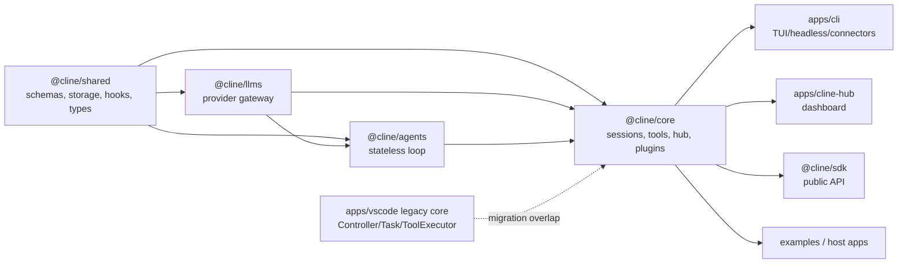
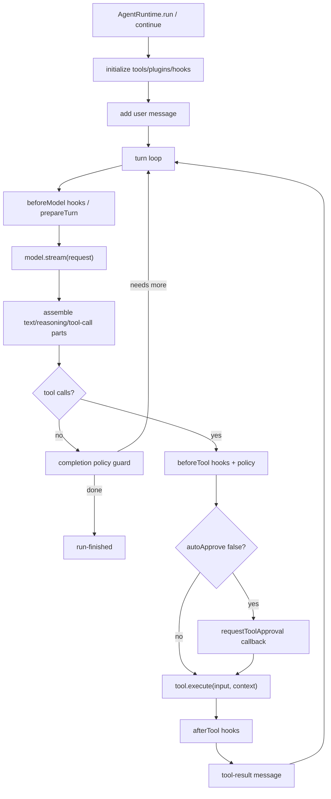
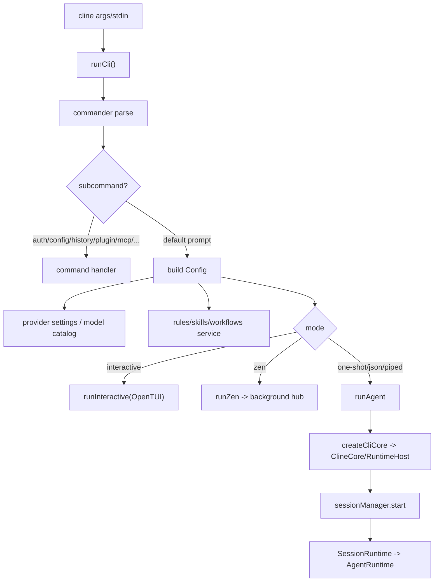
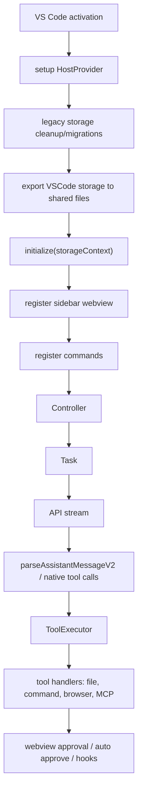

# cline/cline 심층 분석

분석 기준일: 2026-06-10  
분석 대상: `cline/cline`  
로컬 소스: `sources/cline__cline`  
분석 커밋: `7d11935`  
기본 브랜치: `main`  
주 언어: TypeScript  
라이선스: Apache-2.0  
최신 릴리스 메타데이터: `CLI v3.0.23` (`cli-v3.0.23`, 2026-06-10)  
GitHub 메타데이터: 2026-06-10 수집 시점 기준 star 약 63,010, fork 약 6,649

## 1. 한 줄 평가

Cline은 더 이상 단순한 VS Code 확장 레포가 아니다. 2026-06-10 기준 이 레포는 SDK, CLI, local hub, VS Code extension, browser dashboard, examples, docs를 함께 담은 TypeScript monorepo다. 핵심 방향은 “IDE 확장 하나”에서 “여러 호스트가 공유하는 agent runtime stack”으로 이동했다.

다만 완전히 새 구조로만 정리된 것은 아니다. `sdk/` 아래에는 새 SDK-first 계층이 있고, `apps/vscode/src/core` 아래에는 기존 VS Code extension의 `Task`, XML-style tool parser, webview approval, browser action, diff view, checkpoint 코드가 상당히 남아 있다. 따라서 Cline을 정확히 이해하려면 두 층을 분리해야 한다.

- 최신 SDK/CLI 계층: `@cline/shared -> @cline/llms -> @cline/agents -> @cline/core -> apps`
- VS Code legacy 계층: `Controller -> Task -> StreamResponseHandler -> ToolExecutor -> tool handlers`

## 2. 제품 철학

Cline의 공개 문구는 “IDE와 터미널 안의 오픈소스 코딩 에이전트”다. README와 docs가 반복해서 강조하는 철학은 다음이다.

1. 사용자가 목표를 주면 에이전트가 계획하고, 파일을 읽고, 수정하고, 명령을 실행한다.
2. 모델 provider에 종속되지 않는다. Anthropic, OpenAI, Gemini, OpenRouter, Bedrock, Vertex, Groq, Ollama, LM Studio, OpenAI-compatible endpoint를 모두 지원한다.
3. 행동은 tool call로 모델에게 제공되고, 각 tool call은 host가 실행한다.
4. 사람의 승인과 checkpoint를 통해 위험한 작업을 통제한다.
5. 같은 agent core를 VS Code, JetBrains, CLI, Kanban, SDK, connector, schedule에서 재사용한다.

이 중 4번은 표면별로 다르게 구현된다. VS Code 문서와 docs는 “모든 action은 승인 기반”을 강하게 말하지만, CLI source의 one-shot 기본값은 `defaultToolAutoApprove = true`다. 즉 Cline은 “human-in-the-loop” 철학을 갖고 있지만, CLI automation 쪽은 frictionless 실행을 위해 기본값이 더 공격적이다. 이 차이는 중요한 설계/운영 포인트다.

## 3. 레포지토리 규모와 구성

수집된 인벤토리 기준:

- 파일 수: 3,383
- 주요 확장자: `.ts` 1,967개, `.tsx` 574개, `.json` 163개, `.md` 160개, `.mdx` 109개
- 주요 manifest: root `package.json`, `bun.lock`, `apps/cli/package.json`, `apps/vscode/package.json`, `apps/cline-hub/package.json`, `sdk/packages/*/package.json`
- 실행 런타임: root `package.json` 기준 `bun@1.3.13`, Node `>=22`

주요 패키지:

| 패키지 | 버전 | 역할 |
| --- | --- | --- |
| `@cline/shared` | `0.0.46` | 공통 type/schema/storage/hook/tool contract |
| `@cline/llms` | `0.0.46` | provider config, model catalog, AI SDK 기반 provider gateway |
| `@cline/agents` | `0.0.46` | stateless agent loop, model streaming, tool orchestration |
| `@cline/core` | `0.0.46` | session lifecycle, runtime host, storage, default tools, MCP, plugins, hub, telemetry |
| `@cline/sdk` | `0.0.46` | SDK 공개 entrypoint |
| `@cline/cli` | `3.0.23` | terminal one-shot/TUI/headless/ACP/connectors/schedules |
| `@cline/cline-hub` | `0.0.0` private | local hub dashboard example |
| `claude-dev` VS Code extension | `3.89.0` | Marketplace extension, legacy task loop 포함 |

최상위 구조:

```text
cline/
  sdk/packages/shared      공통 contract와 storage
  sdk/packages/llms        provider/model 계층
  sdk/packages/agents      stateless loop
  sdk/packages/core        stateful orchestration, tools, hub, plugin, telemetry
  apps/cli                 npm package `cline`
  apps/vscode              VS Code Marketplace extension
  apps/cline-hub           local hub browser dashboard
  apps/examples            SDK/CLI/desktop/menubar/vscode 예제
  docs                     사용자/enterprise/API 문서
  evals                    benchmark/smoke/e2e 자료
```

## 4. 전체 아키텍처

SDK 문서의 계층 모델은 실제 소스와 일치한다.



### 4.1 `@cline/shared`

낮은 수준의 공통 계약을 소유한다.

- `AgentMessage`, `AgentTool`, `ToolPolicy`, `ToolApprovalRequest`
- storage path helpers: 기본 `~/.cline`, `Documents/Cline/...`
- plugin manifest/schema
- hook payload schema
- hub protocol type
- AI SDK format 변환 보조

중요한 정책 기본값은 `ToolPolicy`에 있다.

```text
enabled: default true
autoApprove: default true
```

즉 tool이 policy에 명시되지 않으면 runtime level에서는 실행 가능하고 auto-approved로 해석된다. 승인 기반 UX는 host가 policy를 어떻게 넣느냐에 달려 있다.

### 4.2 `@cline/llms`

LLM provider 계층이다. package dependency를 보면 AI SDK provider를 광범위하게 사용한다.

- `@ai-sdk/anthropic`
- `@ai-sdk/openai`
- `@ai-sdk/google`
- `@ai-sdk/google-vertex`
- `@ai-sdk/amazon-bedrock`
- `@ai-sdk/openai-compatible`
- `ai-sdk-provider-claude-code`
- `ai-sdk-provider-codex-cli`
- `ai-sdk-provider-opencode-sdk`
- `dify-ai-provider`

이 계층의 목표는 app/core가 provider별 API 차이를 직접 들고 있지 않게 하는 것이다.

### 4.3 `@cline/agents`

`sdk/packages/agents/src/agent-runtime.ts`의 `AgentRuntime`이 새 구조의 핵심 loop다. 이 클래스는 storage나 session 파일을 모른다. model, tools, hooks, plugin을 받아서 한 run을 수행한다.

흐름:

1. `AgentRuntime.run(input)` 또는 `continue(input)` 호출
2. input message를 conversation state에 추가
3. `maxIterations`까지 loop
4. `generateAssistantMessage()`에서 `model.stream(request)` 호출
5. streaming event를 text/reasoning/tool-call part로 조립
6. assistant message에 tool call이 없으면 run 종료
7. tool call이 있으면 `executeToolCalls()`
8. 각 tool에 대해 hook, policy, approval을 적용
9. tool result message를 conversation에 추가
10. 다음 iteration으로 돌아감



### 4.4 `@cline/core`

`@cline/core`는 stateful orchestration 계층이다. 주요 책임:

- `ClineCore.create()`로 local/hub/remote runtime host 생성
- session manifest와 messages 저장
- provider settings와 OAuth token 관리
- tool executor 조립
- MCP settings에서 MCP tool 로드
- plugin sandbox와 hooks 연결
- context compaction
- team/subagent runtime
- hub daemon/client/server
- telemetry
- schedules/cron

가장 중요한 클래스는 `LocalRuntimeHost`와 `SessionRuntime`이다.

`LocalRuntimeHost.startSession()`은 다음을 수행한다.

1. session id, manifest path, messages path 생성
2. provider/bootstrap config 준비
3. `DefaultRuntimeBuilder.build()`로 tools/extensions/team/MCP/plugin runtime 구성
4. `SessionRuntime` 생성
5. prompt가 있으면 `executeTurn()`
6. messages와 usage를 저장

`SessionRuntime`은 session 단위 state를 들고 있다. 매 turn마다 `createAgentRuntime(createAgentRuntimeConfig(...))`로 fresh `AgentRuntime`을 만들고, conversation store, mistake tracker, loop detection, message builder, event adapter는 session 수준에서 유지한다.

## 5. 기본 tool 체계

새 SDK/core 계층의 builtin tool은 다음이다.

| Tool | 역할 |
| --- | --- |
| `read_files` | 절대/상대 path의 텍스트/이미지 파일 읽기 |
| `search_codebase` | `rg --json` 우선 검색, fallback regex/file index |
| `run_commands` | shell command 실행 |
| `editor` | create/replace/insert 기반 파일 편집 |
| `apply_patch` | canonical patch grammar 기반 편집 |
| `fetch_web_content` | HTTP/HTTPS fetch 후 text/json/html 추출 |
| `skills` | configured skill 실행 |
| `ask_question` | 사용자에게 2-5 option 질문 |
| `submit_and_exit` | yolo/one-shot completion tool |
| `spawn_agent` | subagent 생성 |
| `team_*` | teammate/task/mailbox/outcome 등 team orchestration |
| MCP tools | `cline_mcp_settings.json`에 등록된 MCP server tool |

Tool preset:

| 모드 | 기본 tool 특징 |
| --- | --- |
| `act` | read/search/bash/web/editor/skills/ask/spawn/team 활성 |
| `plan` | editor는 꺼지지만 bash/web/read/search는 켜짐 |
| `search` | read/search 중심 |
| `minimal` | bash만 켜짐 |
| `yolo` | read/bash/editor/submit 중심, spawn/team 꺼짐 |

주의할 점은 plan preset도 `enableBash: true`라는 점이다. 문구상 plan mode는 read-only에 가깝게 소개되지만, preset 자체는 shell tool을 포함한다. 프롬프트에서는 비파괴 명령으로 제한하도록 지시하지만, 강제 정책은 host/tool policy에 달려 있다.

## 6. Tool executor 세부 분석

### 6.1 `read_files`

`createFileReadExecutor()`는 path가 절대경로면 normalize하고, 상대경로면 `process.cwd()` 기준으로 resolve한다. 최대 크기는 기본 10MB다. 이미지 확장자 `.gif`, `.png`, `.jpg`, `.jpeg`, `.webp`는 모델이 image input을 지원할 때 base64 image part로 반환한다.

특징:

- 기본적으로 line number를 붙인다.
- `start_line`/`end_line`으로 부분 읽기 가능.
- binary/image 구분은 확장자 기반이다.

### 6.2 `search_codebase`

`createSearchExecutor()`는 `rg --json --context=<n> --max-count=1 -i <query>`를 먼저 사용한다. `rg`가 없거나 실패하면 file index/regex fallback으로 보인다. 검색 대상 확장자와 exclude dir가 정의되어 있다.

강점:

- codebase 탐색에 적합하다.
- `node_modules`, `.git`, `dist`, `build`, `.next`, `coverage`, `target` 등을 기본 제외한다.

### 6.3 `run_commands`

`createBashExecutor()`는 Node `spawn`으로 shell을 실행한다.

동작:

- Unix에서는 기본 shell이 `getDefaultShell(process.platform)`로 결정된다.
- string command는 shell args로 감싼다.
- Windows에서는 structured `{ command, args }` 입력을 선호하는 별도 tool schema가 있다.
- timeout 기본 30초.
- output limit 기본 1MB.
- non-Windows에서는 detached process group을 만들고 timeout/abort 시 process tree kill을 시도한다.

중요한 점:

- 명령 자체에 대한 정적 allowlist/denylist는 executor에 없다.
- 위험도 판단은 모델이 만든 input, prompt의 `requires_approval` 문구, host policy, auto-approve 설정에 맡겨진다.

### 6.4 `editor`

`createEditorExecutor()`는 controlled edit tool이다.

지원:

- 파일이 없으면 create.
- 기존 파일은 `old_text` 1회 매칭 replace.
- `insert_line`으로 특정 line boundary 삽입.
- 여러 occurrence가 있으면 replace를 거부한다.

중요한 path 정책:

- 상대경로는 기본 `cwd` 내부로 제한된다.
- 절대경로는 그대로 허용된다.

즉 “workspace 내부만 편집”을 기대한다면 host policy가 별도로 absolute path를 제한해야 한다.

### 6.5 `apply_patch`

`createApplyPatchExecutor()`는 Cline 자체 patch parser를 사용한다. `*** Begin Patch` sentinel이 있으면 그대로 파싱하고, 없으면 legacy shell wrapper를 잘라내고 sentinel을 감싼다.

지원:

- Add File
- Update File
- Delete File
- Move to

path 정책은 `editor`와 동일하다. 상대 path는 `cwd` 안으로 제한하지만 절대 path는 허용한다.

### 6.6 `fetch_web_content`

native `fetch` 기반이다.

- HTTP/HTTPS만 허용.
- HTML은 script/style/comment를 제거하고 tag를 벗겨 text로 반환.
- JSON은 pretty print.
- 기본 5MB response limit.
- redirect는 기본 follow.

SSRF/IP allowlist 같은 고급 network restriction은 이 executor 자체에는 보이지 않는다.

## 7. CLI 실행 흐름

CLI entrypoint는 `apps/cli/src/index.ts -> main.ts -> runCli()`다.



CLI root options:

- `--plan`
- `--json`
- `--auto-approve <boolean>`
- `--cwd`
- `--thinking`
- `--compaction`
- `--tui`
- `--id`
- `--provider`
- `--key`
- `--model`
- `--system`
- `--zen`
- `--retries`
- `--timeout`
- `--acp`
- `--config`
- `--data-dir`
- `--hooks-dir`
- `--worktree`
- `--update`
- `--kanban`

숨은/legacy 옵션:

- `--act`
- `--yolo`
- `--team-name`

### 7.1 CLI one-shot

`cline "prompt"`는 `runAgent()`로 간다.

`runAgent()`는:

1. file index prewarm 시작
2. yolo 여부 확인
3. `createCliCore()`로 session manager 생성
4. hook runtime 생성
5. signal handler 등록
6. user input message 구성
7. `sessionManager.start(...)`
8. agent event를 terminal/JSON으로 출력
9. 완료 후 usage/cost 출력

코드상 CLI 기본값:

```text
const defaultToolAutoApprove = true
toolPolicies["*"].autoApprove = args.autoApproveOverride ?? true
```

따라서 one-shot에서 `--auto-approve false`를 명시하지 않으면 모든 tool이 auto-approved로 실행될 수 있다. README의 usage 예시도 “Require approval before each tool call: `cline --auto-approve false ...`”라고 적는다.

### 7.2 Interactive TUI

`cline` 또는 `cline -i`는 `runInteractive()`로 간다. interactive approval controller는 global auto-approve를 끄면 안전 도구 일부만 자동 승인한다.

safe auto-approve 목록:

- `ask_followup_question`
- `ask_question`
- `fetch_web_content`
- `read_files`
- `search_codebase`
- `skills`
- `submit_and_exit`

그 외 tool은 TUI approver가 있으면 사용자에게 묻고, 없으면 거절한다.

### 7.3 YOLO

`--yolo`는 help에서 숨겨져 있지만 계속 동작한다. `commanderToParsedArgs()`는 yolo를 mode로 설정하고, autoApproveOverride를 true로 둔다. core preset에서도 yolo policy는 `"*"`와 모든 default tool에 `enabled: true, autoApprove: true`를 넣는다.

CLI yolo는 spawn/team을 끈다.

```text
enableSpawnAgent: !isYoloMode
enableAgentTeams: !isYoloMode
```

### 7.4 Zen

`--zen`은 background hub에 task를 보내고 CLI는 종료한다. `runZen()` 주석이 명확하다. CLI가 종료된 뒤에는 사람이 승인할 수 없으므로 yolo-style tool behavior를 강제한다.

Zen start request:

- `mode: "yolo"`
- `enableTools: true`
- `enableSpawn: false`
- `enableTeams: false`
- `autoApproveTools: true`
- `toolExecutors: ["submit"]`

즉 Zen은 편리한 fire-and-forget automation이지만 승인 없는 background execution이다.

### 7.5 `--worktree`

`--worktree`는 현재 git repo에서 detached worktree를 `~/.cline/worktrees/<taskId>/<workspaceLabel>` 아래 생성한다.

```text
git -C <repoRoot> worktree add --detach <worktreePath> HEAD
```

작업을 격리한다는 장점이 있지만, 같은 repo의 별도 worktree일 뿐 OS/file/network sandbox가 아니다.

### 7.6 `--data-dir` sandbox

CLI의 `--data-dir` 설명은 “isolated local state”이고, 코드도 이를 따른다. `configureSandboxEnvironment()`는 다음 환경변수를 바꾼다.

- `CLINE_SANDBOX=1`
- `CLINE_SANDBOX_DATA_DIR`
- `CLINE_DATA_DIR`
- `CLINE_DB_DATA_DIR`
- `CLINE_SESSION_DATA_DIR`
- `CLINE_TEAM_DATA_DIR`
- `CLINE_PROVIDER_SETTINGS_PATH`
- `CLINE_HOOKS_LOG_PATH`

즉 여기서 sandbox는 Cline 상태/DB/session/provider settings 격리다. shell/file tool을 OS-level sandbox에 가두는 기능은 아니다.

## 8. SDK 사용 흐름

SDK README는 다음 형태를 기본으로 보여준다.

```typescript
import { Agent } from "@cline/sdk"

const agent = new Agent({
  providerId: "cline",
  modelId: "openai/gpt-5.5",
  systemPrompt: "You are a helpful coding assistant.",
  tools: [],
})

const result = await agent.run("Create a REST API with Express and TypeScript")
```

SDK surface는 크게 두 층이다.

- `@cline/sdk`: app developer-friendly entrypoint
- `@cline/core`: session, hub, automation, settings 등 production host용

SDK의 강점은 같은 agent loop를 Slack bot, scheduled automation, code review bot, desktop app, VS Code app 등으로 재사용할 수 있다는 점이다.

## 9. VS Code extension 흐름

VS Code extension package는 여전히 `claude-dev`이고 version은 `3.89.0`이다. activation event는 다음을 포함한다.

- `onLanguage`
- `onUri`
- `onStartupFinished`
- `workspaceContains:evals.env`

activation 흐름:



`Controller`는 다음을 소유한다.

- `Task`
- `McpHub`
- account/auth service
- StateManager
- workspace manager
- remote config timer
- background command status

`Task`는 기존 Cline의 중심 객체다.

- API handler
- terminal manager
- browser session
- context manager
- diff view provider
- checkpoint manager
- ignore controller
- command permission controller
- tool executor
- file/model/environment context tracker

streaming loop는 `presentAssistantMessage()`와 `ToolExecutor.executeTool()`가 조합한다. XML-style tool parser가 `execute_command`, `replace_in_file`, `write_to_file`, `browser_action`, `use_mcp_tool`, `attempt_completion` 등을 파싱한다. 일부 model/provider는 native tool call 변환도 사용한다.

## 10. Plan/Act와 tool prompt

VS Code legacy prompt에는 Plan/Act 개념이 강하게 들어 있다.

- Plan mode: 탐색, 질문, 계획 수립.
- Act mode: tool을 써서 실제 작업 수행.
- `attempt_completion`: 완료 선언 tool.

하지만 SDK/core preset의 plan mode에는 `run_commands`가 포함되어 있다. VS Code prompt는 Plan mode command 사용을 비파괴적 작업으로 제한하도록 지시한다. 이 제한이 완전한 policy enforcement라기보다 prompt/tool approval 조합이라는 점을 이해해야 한다.

## 11. Hub와 dashboard

`@cline/core`에는 detached hub daemon과 WebSocket clients가 있고, `apps/cline-hub`은 browser dashboard 예제다.

Hub dashboard 기능:

- connected hub clients 목록
- active sessions 목록
- selected session message stream
- session에 메시지 보내기
- provider/model 선택
- hub restart

보안 관련 문구도 README에 직접 있다. 이 dashboard는 production admin tool이 아니며, LAN/tunnel로 노출하면 invite secret을 가진 사람이 session list를 보고, session을 drive하고, hub를 restart할 수 있다.

server source:

- 기본 host: `127.0.0.1`
- `HOST=0.0.0.0` 등 non-local bind는 `ROOM_SECRET` 필요
- `ROOM_SECRET`이 없으면 local-only browser connection은 token 없이 허용
- websocket frame으로 `send`, `abort`, `reset`, `deleteSession`, `approval_response`, `restart_hub`, `saveProviderSettings`, OAuth login 등을 수행한다.

## 12. MCP 구조

core runtime builder는 MCP settings file이 있으면 자동으로 tool을 로드한다.

흐름:

1. `resolveDefaultMcpSettingsPath()`
2. `hasMcpSettingsFile()`
3. `registerMcpServersFromSettingsFile()`
4. enabled server만 선택
5. 각 server에서 `createMcpTools({ serverName, provider })`
6. builtin tools와 합쳐 agent tool list에 추가

VS Code legacy 쪽에도 `McpHub`가 존재하며, MCP tool별 autoApprove list를 settings에 저장한다. docs의 MCP prompt는 새 MCP server 생성 시 기본 `disabled=false`, `autoApprove=[]`로 두라고 지시한다.

MCP는 Cline의 확장성 핵심이지만, 신뢰 경계도 크다. MCP server는 외부 process/remote API일 수 있고, tool schema가 모델에게 노출되며, autoApprove 설정과 결합하면 사용자의 별도 확인 없이 외부 시스템에 action을 보낼 수 있다.

## 13. Plugin과 Hook

### 13.1 Plugin

Cline plugin은 SDK/core extension 구조다. plugin은 다음을 등록할 수 있다.

- tools
- commands
- rules
- message builders
- providers
- automation event types
- shortcuts/flags
- runtime hooks

`loadAgentPluginFromPath()`는 plugin module을 import하고 manifest를 검증한다. sandboxed plugin loader도 있다. 하지만 여기서 sandbox는 Node child process 격리다. plugin code는 별도 process에서 실행되지만 OS capability 자체가 제한되는 것은 아니다.

`SubprocessSandbox`는 `node` 또는 `bun`을 실행하고 IPC로 `executeTool`, `executeCommand`, `resolveRuleContent`, `buildMessages` 같은 호출을 주고받는다. timeout이 있으면 sandbox process를 shutdown한다.

위험 지점:

- CLI `plugin install`은 official keyword, npm, git, URL, local path를 받을 수 있다.
- plugin code는 arbitrary JS/TS다.
- host-provided SDK dependency resolution과 plugin dependency preflight가 복잡하다.
- child process 격리는 crash/timeout 격리에 가깝지, filesystem/network 권한 격리는 아니다.

### 13.2 Hooks

Hook은 `.cline`, `~/Documents/Cline/Hooks`, `.clinerules/hooks` 등 file-based config를 통해 lifecycle event에 subprocess를 실행하는 구조다.

지원되는 hook 계열:

- TaskStart
- TaskResume
- PromptSubmit
- PreToolUse
- PostToolUse
- PreCompact
- SessionShutdown 등

Hook output은 JSON control을 반환할 수 있다.

- context/contextModification 추가
- cancel
- review
- overrideInput
- errorMessage

PreToolUse hook은 tool 실행 전에 cancel할 수 있고, PostToolUse hook은 관찰/로그 역할이 크다. Hook은 매우 강력한 policy/audit 확장점이지만, 결국 사용자가 구성한 arbitrary subprocess 실행이므로 plugin과 마찬가지로 신뢰 경계가 넓다.

## 14. Subagent와 team

core에는 `spawn_agent`와 `team_*` tool들이 있다. `DefaultRuntimeBuilder`는 `enableSpawnAgent`, `enableAgentTeams`에 따라 configured agent와 team runtime을 구성한다.

기능:

- configured agent config 로드
- delegated agent config provider
- teammate spawn/shutdown
- team tasks
- mailbox/message
- outcome fragment review/finalize
- mission log interval
- team state persistence

완료 정책도 team-aware다. team task나 active run이 남아 있으면 completion guard가 system reminder를 넣고 agent가 멈추지 않게 한다.

## 15. 상태 저장과 checkpoints

SDK/core 계층은 session manifest와 messages 파일을 저장한다.

`LocalRuntimeHost.startSession()`는:

- sessions dir 확보
- `<sessionId>.json` manifest
- `<sessionId>.messages.json`
- status: running/idle/completed/failed/cancelled
- provider/model/cwd/workspace root/team info
- usage/aggregate usage

VS Code legacy 계층은 task history, checkpoints, conversation history, diff view 등을 갖고 있다. docs의 Prompt Storage 문서는 local conversation이 `~/.cline/data/tasks/<taskId>/api_conversation_history.json`에 저장된다고 설명한다.

중요: prompt storage를 enterprise remote config로 켜면 conversation history가 S3/R2로 업로드될 수 있다. 문서가 직접 경고하듯 tool input/output이 모두 포함되므로, `read_file`로 읽은 파일 내용, `write_to_file` code, command output이 업로드 대상이 될 수 있다.

## 16. 보이는 것과 숨은 것

숨은/주의 표면:

- CLI `--yolo`, `--team-name`, `--act`는 help에서 숨겨졌지만 동작한다.
- root README는 JetBrains plugin을 언급하지만 “currently not open-sourcing JetBrains plugins”라고 한다. JetBrains 실제 구현은 이 레포에 없다.
- Kanban은 별도 `cline/kanban` 레포다. README에서 기능을 홍보하지만 이 레포에 핵심 소스는 없다.
- VS Code extension source는 여전히 legacy core가 크고, SDK migration이 완전히 끝난 상태가 아니다.
- `apps/cline-hub`은 example dashboard이며 production admin tool로 보기 어렵다.
- `--data-dir` sandbox는 runtime state 격리이지 command/file sandbox가 아니다.
- CLI one-shot 기본 auto-approve가 true다.
- Zen은 background hub에서 yolo mode로 실행된다.

## 17. 실행 검증 결과

로컬에서 확인한 환경:

```text
node: v23.4.0
npm: 10.9.2
bun: not found
root node_modules: 없음
apps/cli/node_modules: 없음
```

실행 시도:

| 명령 | 결과 |
| --- | --- |
| `bun --conditions=development apps/cli/src/index.ts --version` | 실패: `bun: command not found` |
| `bun --conditions=development apps/cli/src/index.ts --help` | 실패: `bun: command not found` |

이 레포는 root `package.json`에서 `bun@1.3.13`을 요구하고 node_modules가 없는 상태였다. 따라서 CLI/TUI/server를 실제로 실행하지 못했고, 분석은 소스 정적 분석과 문서/manifest 기반으로 진행했다.

## 18. 위험요소와 이상한 점

### 18.1 CLI 기본 auto-approve

문서와 README는 human-in-the-loop approval을 강조하지만, CLI one-shot config는 기본 `toolPolicies["*"].autoApprove = true`다. `--auto-approve false`를 명시해야 approval prompt로 간다. 이는 자동화 UX에는 맞지만 “기본 안전” 관점에서는 강한 선택이다.

### 18.2 YOLO와 Zen

YOLO는 모든 tool을 auto-approve한다. Zen은 CLI가 바로 종료되어 승인할 주체가 없으므로 yolo-style behavior를 강제한다. background hub가 사용자의 workspace에서 명령/편집을 수행할 수 있다는 점이 중요하다.

### 18.3 Shell command executor의 정책 부재

`run_commands` executor 자체는 shell command 문자열을 실행할 뿐이다. 명령 위험도 판단은 prompt와 approval policy에 있다. auto-approve가 켜지면 destructive command도 실행될 수 있다.

### 18.4 Absolute path 편집 허용

`editor`와 `apply_patch`는 상대경로만 `cwd` 내부로 제한한다. 절대경로는 허용된다. “workspace 밖 편집 금지”를 보장하려면 host-level policy가 별도로 필요하다.

### 18.5 `--data-dir` sandbox 용어 혼동

`--data-dir`는 Cline 상태/DB/session/provider settings를 격리한다. shell/file system action을 OS sandbox로 제한하지 않는다. 사용자가 “sandbox”라는 단어를 격리 실행 환경으로 오해할 수 있다.

### 18.6 Plugin은 arbitrary code

Plugin은 tools/hooks/providers/message builders를 등록하고 subprocess에서 실행된다. Subprocess는 crash/timeout 격리에는 좋지만, Node process가 가진 filesystem/network 권한은 그대로다. npm/git/URL/local path install source를 신뢰해야 한다.

### 18.7 Hooks는 arbitrary subprocess

Hooks는 lifecycle마다 명령을 실행한다. PreToolUse는 tool을 cancel하거나 context/overrideInput을 제공할 수 있다. policy/audit에는 좋지만, hook script가 악성이라면 tool input/output, workspace metadata, 사용자 정보가 노출될 수 있다.

### 18.8 Hub dashboard exposure

`apps/cline-hub`은 local-only이면 room secret 없이 browser connection을 허용한다. non-local bind에는 secret이 필요하지만, secret을 가진 사용자는 session을 drive하고 hub를 restart할 수 있다. README도 production admin tool이 아니라고 경고한다.

### 18.9 MCP trust boundary

MCP settings가 있으면 enabled server tool이 runtime에 들어온다. MCP tool autoApprove와 결합하면 외부 시스템 mutation이 승인 없이 실행될 수 있다. MCP server 자체의 supply-chain과 credential scope도 별도 검토해야 한다.

### 18.10 Prompt storage

Enterprise Prompt Storage는 conversation history를 S3/R2로 업로드한다. 문서가 직접 경고하듯 tool input/output이 포함된다. 즉 source file 내용, generated code, terminal output, error log가 cloud bucket에 남을 수 있다.

### 18.11 Telemetry claims와 실제 운영 책임

일반 telemetry 문서는 code/file content/path/command arguments를 수집하지 않는다고 설명한다. 반면 Prompt Storage나 OpenTelemetry logs는 별도 설정이며, 운영자가 endpoint/bucket 보안을 책임져야 한다. 조직 환경에서는 telemetry와 prompt storage를 같은 것으로 보면 안 된다.

### 18.12 VS Code와 SDK의 이중 구조

VS Code extension은 `Task`/`ToolExecutor` 기반 legacy flow가 크고, SDK/CLI는 `AgentRuntime`/`SessionRuntime` 기반이다. 같은 제품명 아래 두 runtime path가 공존하므로, 버그/정책/approval semantics가 표면별로 달라질 수 있다.

## 19. 호출 관계 요약

CLI one-shot:

```text
apps/cli/src/index.ts
  -> runCli()
    -> commanderToParsedArgs()
    -> build Config
    -> runAgent(prompt, config)
      -> createCliCore()
      -> sessionManager.start()
        -> ClineCore.start()
          -> RuntimeHost.startSession()
            -> LocalRuntimeHost.startSession()
              -> prepareLocalRuntimeBootstrap()
              -> DefaultRuntimeBuilder.build()
              -> new SessionRuntime(agentConfig)
              -> executeTurn()
                -> SessionRuntime.run/continue()
                  -> createAgentRuntime()
                    -> AgentRuntime.run()
                      -> model.stream()
                      -> executeToolCalls()
```

Tool execution:

```text
AgentRuntime.executeToolCalls()
  -> prepareToolExecution()
    -> beforeTool hooks
    -> ToolPolicy enabled/autoApprove
    -> requestToolApproval if needed
  -> executePreparedTool()
    -> tool.execute(input, context)
    -> afterTool hooks
    -> tool-result message
```

VS Code legacy:

```text
extension.activate()
  -> initialize()
  -> WebviewProvider / Controller
    -> Controller.initTask()
      -> new Task()
        -> API stream
        -> parseAssistantMessageV2 / native tool calls
        -> presentAssistantMessage()
          -> ToolExecutor.executeTool()
            -> tool handler
            -> autoApprove / webview approval / PreToolUse hook
            -> actual file/terminal/browser/MCP action
            -> PostToolUse hook
```

Hub/Zen:

```text
cline --zen "prompt"
  -> runZen()
    -> ensureCliHubServer()
    -> HubSessionClient.connect()
    -> startRuntimeSession(mode=yolo, autoApproveTools=true)
    -> sendRuntimeSession()
    -> CLI exits
    -> hub continues agent loop
```

## 20. 평가

장점:

- SDK layering이 명확하다.
- provider abstraction이 넓다.
- CLI, IDE, hub, automation, connectors가 같은 core를 지향한다.
- tool/policy/hook/plugin 확장점이 많다.
- session persistence, usage aggregation, team runtime, completion guard 등 제품형 기능이 풍부하다.
- VS Code extension에는 diff view, checkpoint, browser action, webview approval 등 mature한 UX가 있다.

약점:

- CLI 기본 auto-approve와 docs의 approval-first 메시지가 충돌한다.
- SDK/core와 VS Code legacy runtime이 공존해 동작 차이가 생길 수 있다.
- plugin/hook/MCP/hub/connector/schedule까지 확장 표면이 많아 신뢰 경계가 복잡하다.
- absolute path 편집 허용과 shell executor 정책 부재는 host 정책 없이는 위험하다.
- `sandbox`라는 용어가 실제 OS sandbox가 아닌 상태 격리에 쓰인다.
- Bun/node_modules가 없는 clone만으로는 바로 실행 검증이 어렵다.

## 21. 결론

Cline은 Claude Code류 IDE agent의 대표 주자에서, 2026년 현재 “agent runtime platform”에 가까운 형태로 확장 중이다. 다른 레포와 비교하면 다음 포지션이다.

- Codex: terminal-first, Rust CLI, sandbox/approval 중심.
- Gemini CLI: Google model/tool stack 중심 terminal agent.
- Open Interpreter: local code execution REPL.
- OpenHands: sandboxed platform orchestration.
- browser-use: browser automation framework.
- Cline: SDK-first multi-surface coding agent platform.

Cline을 설계 관점에서 배울 때 가장 중요한 개념은 `AgentRuntime`과 `SessionRuntime`의 분리다. stateless loop는 `@cline/agents`에, session/storage/provider/tool assembly/hub는 `@cline/core`에 둔다. 이 분리는 좋다. 다만 실제 운영에서는 auto-approve, yolo/zen, plugin/hook/MCP, hub exposure, prompt storage를 각각 별도 신뢰 경계로 관리해야 한다.
