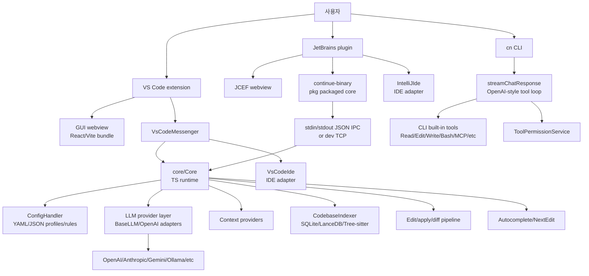
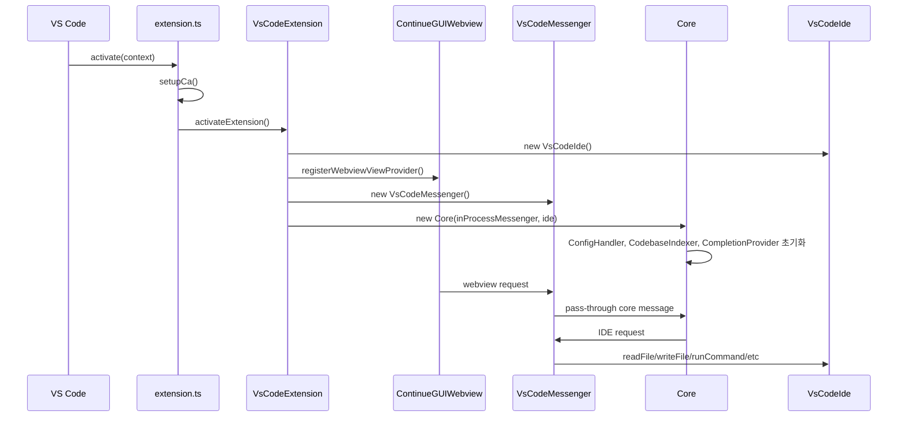
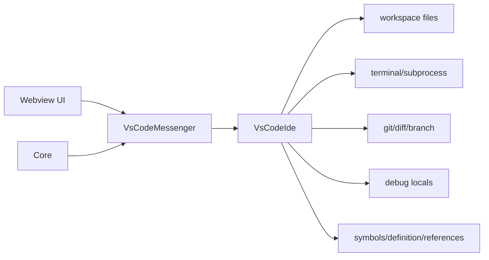
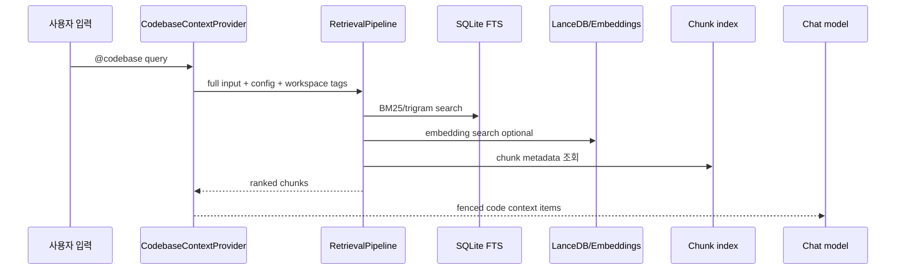
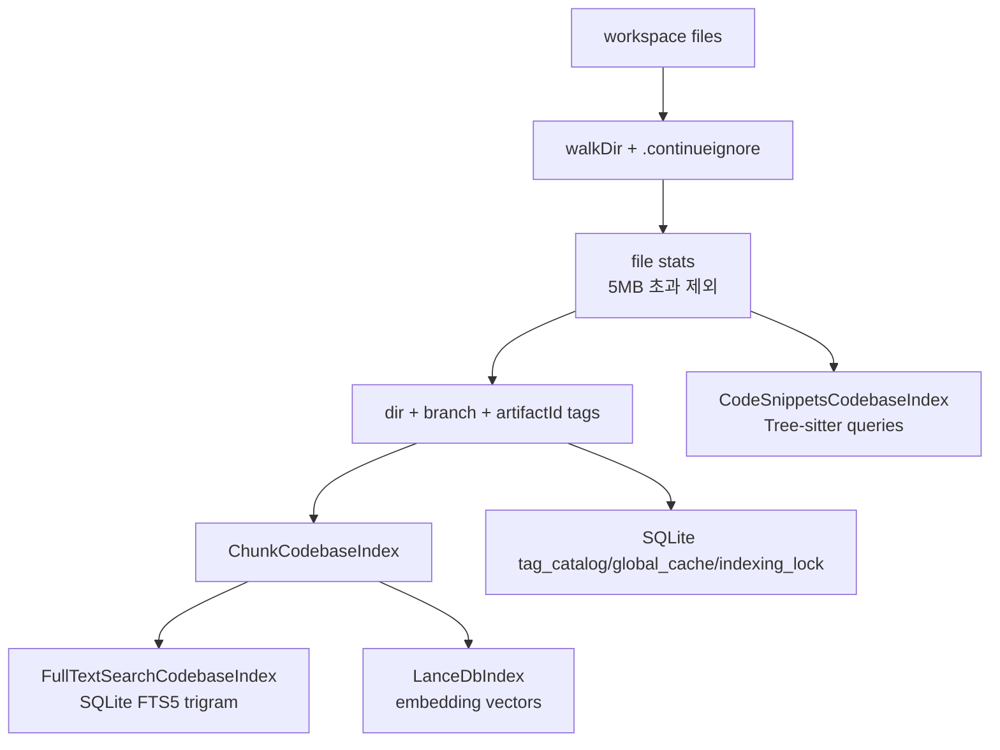
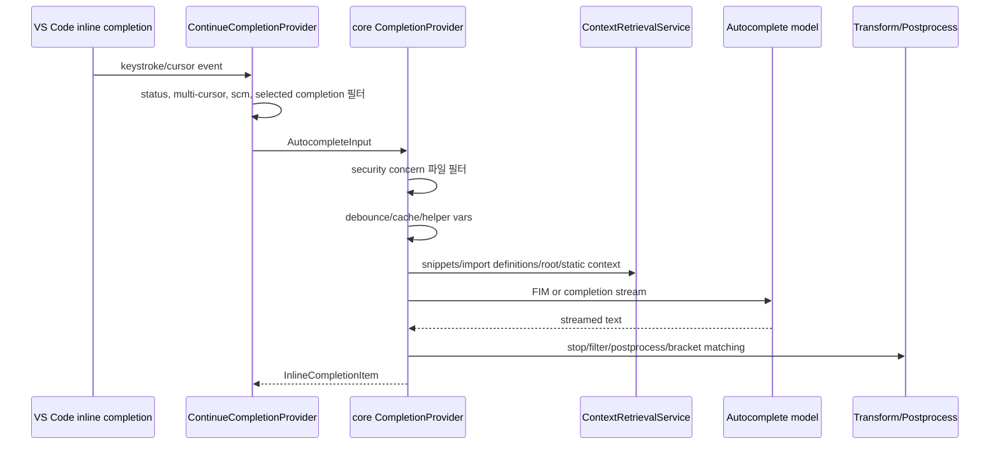
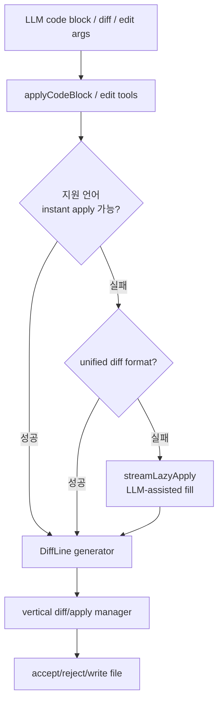
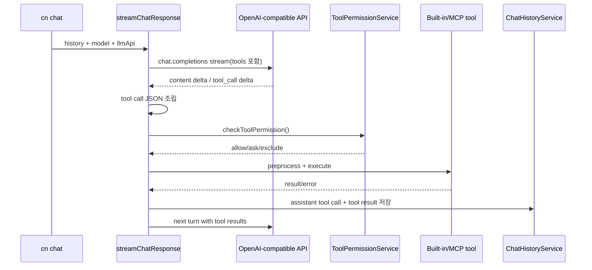
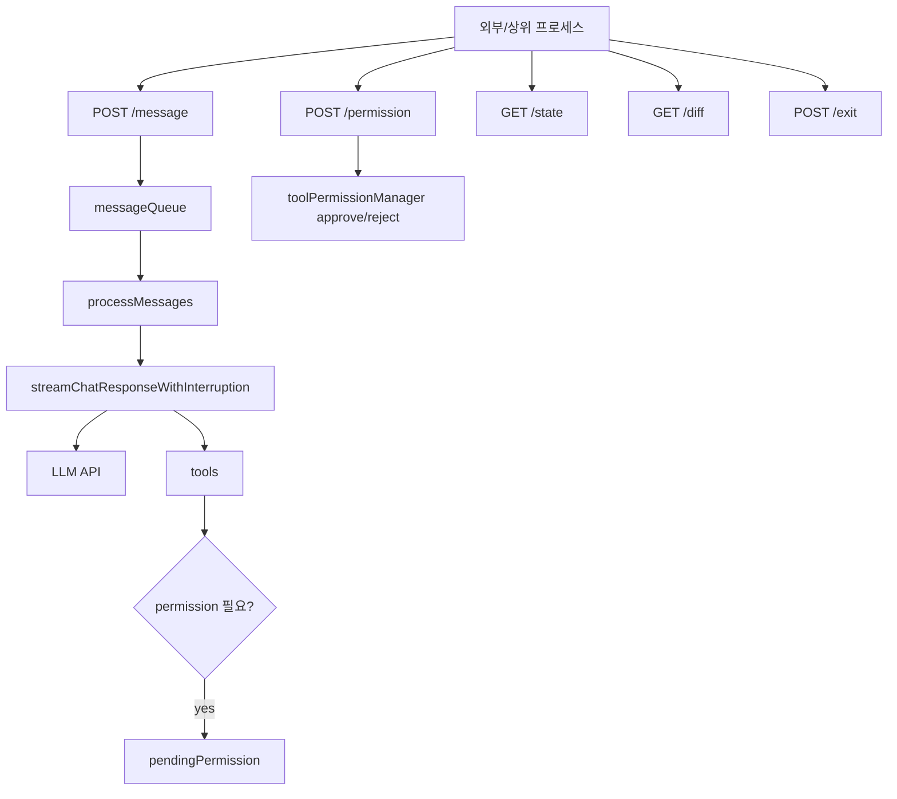

# continuedev/continue 분석 보고서

## 1. 요약 평가

Continue는 IDE extension, CLI, core engine, indexing, model provider layer를 함께 가진 오픈소스 코딩 에이전트 코드베이스다. Codex/Gemini CLI처럼 터미널에서만 동작하는 도구가 아니라, VS Code/JetBrains 안에서 chat, edit, autocomplete, next edit, codebase retrieval을 제공하고, 별도 `cn` CLI로 TUI/headless/serve/review/checks 흐름도 제공한다.

중요한 현재 상태가 있다. README는 `continuedev/continue` 저장소가 더 이상 적극 유지보수되지 않고 read-only라고 명시한다. 또한 최종 2.0.0 릴리스에서 anonymous telemetry 제거, authentication 제거, bug squash 등을 했다고 설명한다. 따라서 이 레포는 “현재 빠르게 진화하는 제품 본체”라기보다, Continue 2.0 계열의 공개 최종 코드와 그 설계 유산으로 보는 것이 정확하다.

가장 큰 특징은 공통 TypeScript core를 여러 surface에서 재사용한다는 점이다. VS Code extension은 webview와 core를 in-process messenger로 연결한다. JetBrains plugin은 core를 `binary`로 패키징해 subprocess 또는 개발용 TCP로 연결한다. CLI는 별도 `extensions/cli` 구현을 갖지만, config-yaml, OpenAI adapter, terminal-security, core type과 일부 util을 공유한다.

철학은 “모델 중립 IDE-native coding agent”에 가깝다. 사용자는 IDE에서 선택 코드, 현재 파일, 터미널, diff, problems, open files, codebase index, docs, MCP resource, GitHub/GitLab issue 같은 context를 모아 LLM에 전달한다. 반대로 LLM의 출력은 diff/apply/edit/autocomplete/next edit/tool call로 다시 IDE와 working tree에 반영된다. 즉 Continue의 핵심은 모델 자체가 아니라 IDE adapter와 context pipeline이다.

차별점은 코드베이스 retrieval과 autocomplete/next-edit 품질을 위해 많은 계층이 누적되어 있다는 것이다. SQLite FTS, Tree-sitter code snippets, chunk index, LanceDB embeddings, import definitions, root path context, static contextualization, LSP definitions, completion cache, generator reuse, streaming transform pipeline이 들어간다. 단순히 “현재 줄 앞뒤를 모델에 보낸다”보다 훨씬 IDE assistant다운 설계다.

위험은 표면이 넓다는 데서 나온다. Webview/Core/IDE messenger는 `writeFile`, `runCommand`, `subprocess`, `readFile`, `getTerminalContents`, `getDebugLocals` 같은 권한성 메시지를 처리한다. CLI는 TUI 기본에서는 쓰기/Bash를 `ask`로 두지만 headless에서는 기본 정책이 Bash와 wildcard를 `allow`로 바꾼다. MCP stdio transport는 기본 process environment를 MCP 서버에 전달한다. `cn serve`는 인증 없는 localhost Express API를 연다. Context providers는 터미널/debug/database/web/MCP 등 민감 context를 프롬프트로 가져올 수 있다.

평가하면 Continue는 “IDE 안의 AI pair programmer/agent” 설계 자료로 매우 가치가 높다. 그러나 현재 레포 상태는 read-only/final release 성격이고, 여러 인증/Hub 기능이 stub로 남아 있으며, VS Code extension의 package version과 README의 final 2.0.0 설명, GitHub latest release 관측값이 서로 긴장된다. 새 제품으로 채택하기보다는 아키텍처, indexing, IDE protocol, apply/autocomplete, permission 설계를 학습하는 레퍼런스로 보는 편이 안전하다.

## 2. 기본 정보

- 저장소: `continuedev/continue`
- 분석 커밋: `eaa23c5`
- 기본 브랜치: `main`
- 생성일: 2023-05-24
- 최근 push 관측값: 2026-06-10
- GitHub 설명: `Source-controlled AI checks, enforceable in CI. Powered by the open-source Continue CLI`
- README 설명: `Pioneering open-source coding agent`
- README 상태 문구: 저장소가 더 이상 적극 유지보수되지 않고 read-only
- 최신 릴리스 관측값: `v1.2.22-vscode` / 2026-03-27
- README 릴리스 설명: final `2.0.0` release
- 라이선스: Apache-2.0
- 주요 언어: TypeScript
- 규모:
  - 분석 대상 주요 source file 약 1,670개
  - checkout 크기 약 458MB
- GitHub 지표 관측값:
  - star 33,640
  - fork 4,634
  - watcher 158
- 주요 topics:
  - `open-source`, `developer-tools`, `ai`, `llm`, `agent`, `cli`, `jetbrains-plugin`, `vs-code-extenstion`
- 주요 product surface:
  - VS Code extension
  - JetBrains plugin
  - `cn` CLI
  - hidden `cn serve` HTTP mode
  - `cn review`, `cn checks`
  - core binary for non-VS Code IDEs

## 3. 저장소 구조

```text
continue/
  core/                         # 공통 TypeScript core: config, LLM, context, indexing, edit, autocomplete
  extensions/
    vscode/                     # VS Code extension, webview, IDE adapter, command registration
    intellij/                   # JetBrains plugin, Kotlin, JCEF, core binary subprocess
    cli/                        # Continue CLI: cn TUI/headless/serve/review/checks
  gui/                          # webview UI
  binary/                       # core를 pkg binary로 패키징하기 위한 entry/messenger
  packages/
    config-yaml/                # assistant/config schema
    config-types/               # shared config types
    continue-sdk/               # SDK/openapi
    fetch/                      # fetch wrapper
    llm-info/                   # model metadata
    openai-adapters/            # OpenAI-compatible API adapter
    terminal-security/          # Bash command policy evaluator
  sync/                         # Rust sync component
  docs/, docs-site/
  .continue/                    # repo-local agents/checks/prompts/rules
  .claude/skills/               # Claude skill dogfooding asset
```

주요 파일은 다음과 같다.

- `README.md`
  - 현재 유지보수 상태와 final release 안내
- `extensions/vscode/src/extension.ts`
  - VS Code extension entrypoint
- `extensions/vscode/src/extension/VsCodeExtension.ts`
  - VS Code runtime bootstrap, core/webview/messenger/autocomplete/diff manager 연결
- `extensions/vscode/src/extension/VsCodeMessenger.ts`
  - Webview/Core/IDE message routing
- `core/core.ts`
  - core message handler registry, config, codebase indexer, completion provider, next edit provider, tools
- `core/protocol/`
  - ToCore/FromCore/ToIde/FromIde/ToWebview/FromWebview protocol type
- `core/indexing/CodebaseIndexer.ts`
  - codebase index orchestrator
- `core/indexing/refreshIndex.ts`
  - SQLite metadata/tag/lock tables
- `core/indexing/CodeSnippetsIndex.ts`
  - Tree-sitter snippet extraction
- `core/indexing/FullTextSearchCodebaseIndex.ts`
  - SQLite FTS5 trigram search
- `core/llm/index.ts`
  - `BaseLLM`, provider abstraction, OpenAI-compatible adapter path
- `core/llm/llms/`
  - Anthropic, OpenAI, Gemini, Bedrock, Ollama, LM Studio, Mistral, Groq 등 provider classes
- `core/edit/`
  - lazy apply, unified diff apply, search/replace, stream diff
- `core/autocomplete/`
  - inline completion pipeline
- `extensions/cli/src/index.ts`
  - `cn` entrypoint
- `extensions/cli/src/stream/streamChatResponse.ts`
  - streaming response/tool-call loop
- `extensions/cli/src/stream/handleToolCalls.ts`
  - OpenAI-style tool calls preprocessing/execution/history reflection
- `extensions/cli/src/permissions/`
  - tool permission policy system
- `packages/terminal-security/src/evaluateTerminalCommandSecurity.ts`
  - terminal command policy evaluator
- `binary/src/index.ts`
  - core binary entrypoint
- `binary/src/IpcMessenger.ts`
  - line-delimited JSON IPC messenger
- `extensions/intellij/src/main/kotlin/...`
  - JetBrains plugin, core process manager, JCEF tool window, IDE protocol client

## 4. 발전 과정과 설계 철학

Continue의 진화는 세 단계로 읽힌다.

1. IDE-native AI assistant
   - VS Code extension과 JetBrains plugin이 중심이다.
   - chat, selected code context, apply code from chat, vertical diff, tab autocomplete, next edit를 제공한다.
   - IDE adapter가 terminal, problems, git, file, symbols, open files를 읽는다.

2. Shared core and provider neutrality
   - IDE별 UI/adapter는 달라도 `core`가 config, LLM provider, context, indexing, edit/apply, autocomplete를 담당한다.
   - OpenAI, Anthropic, Gemini, Bedrock, Ollama, LM Studio, Mistral, Groq 등 많은 provider class가 있다.
   - 모델 역할이 chat/edit/apply/autocomplete/embed/rerank로 나뉜다.

3. CLI/checks/agent workflow
   - `cn` CLI가 TUI/headless/serve/review/checks를 제공한다.
   - `.continue/agents`, `.continue/checks`, `.continue/rules`는 source-controlled AI checks 철학을 보여준다.
   - README의 GitHub 설명도 최근에는 “source-controlled AI checks, enforceable in CI”에 초점이 옮겨져 있다.

설계 철학은 다음과 같다.

1. IDE is the operating environment
   - 파일 읽기/쓰기, 터미널 실행, symbols, problems, diff, selection, open files가 모두 IDE adapter를 통해 들어온다.
   - 사용자는 코드 편집 중인 맥락에서 바로 AI를 호출한다.

2. Context is a product surface
   - `@codebase`, `@terminal`, `@currentFile`, `@open`, `@diff`, `@problems`, `@mcp` 같은 context provider가 핵심이다.
   - codebase retrieval은 embedding, FTS, chunk, snippet을 조합한다.

3. Model neutrality
   - 특정 모델 하나에 묶이지 않고 provider abstraction을 둔다.
   - local model/Ollama/LM Studio와 cloud provider를 함께 지원한다.
   - role별 모델 선택으로 autocomplete와 chat의 요구를 분리한다.

4. Apply is a first-class workflow
   - LLM이 낸 코드 블록을 바로 파일에 덮어쓰지 않는다.
   - deterministic apply, unified diff apply, lazy apply, search/replace, vertical diff UI를 둔다.

5. Source-controlled agents/checks
   - `.continue` 폴더에 agents/checks/rules/prompts를 두고 repository와 함께 versioning한다.
   - CLI `review`는 여러 review agent를 worktree/worker로 돌릴 수 있다.

6. Final open artifact
   - README의 read-only/final release 문구는 이 코드베이스가 향후 기능 추가의 중심이 아니라, 공개 자산/레퍼런스 성격으로 전환되었음을 시사한다.

## 5. 전체 아키텍처



Continue는 단일 프로세스 agent가 아니다. surface별 실행 방식이 다르다.

- VS Code
  - extension host 안에서 core를 직접 생성한다.
  - webview와 core는 in-process messenger로 연결된다.
- JetBrains
  - Kotlin plugin이 core binary subprocess를 실행한다.
  - line-delimited JSON IPC로 core와 통신한다.
  - 개발 모드에서는 TCP messenger를 쓸 수 있다.
- CLI
  - `extensions/cli`가 별도 agent runtime을 제공한다.
  - OpenAI adapter 기반 streaming/tool-call loop를 직접 가진다.

## 6. VS Code 실행 흐름

VS Code entrypoint는 `extensions/vscode/src/extension.ts`다.



핵심 bootstrap은 `VsCodeExtension` constructor에 있다.

1. `VsCodeIde`를 만든다.
2. `ContinueGUIWebviewViewProvider`를 만든다.
3. `continue.continueGUIView` webview provider를 등록한다.
4. `InProcessMessenger<ToCoreProtocol, FromCoreProtocol>`를 만든다.
5. `VsCodeMessenger`를 만들어 webview/core/IDE를 연결한다.
6. `Core`를 만든다.
7. `ConfigHandler`를 가져오고 config를 load한다.
8. `VerticalDiffManager`, autocomplete provider, next edit, code lens provider를 연결한다.

## 7. Webview/Core/IDE protocol

`core/protocol/index.ts`는 protocol을 다음처럼 나눈다.

- `ToIdeProtocol`
- `FromIdeProtocol`
- `ToWebviewProtocol`
- `FromWebviewProtocol`
- `ToCoreProtocol`
- `FromCoreProtocol`

VS Code의 `VsCodeMessenger`는 세 경로를 연결한다.

- Webview -> Core pass-through
- Core -> Webview pass-through
- Webview/Core -> IDE adapter

권한성 IDE message는 다음이 대표적이다.

- `writeFile`
- `readFile`
- `saveFile`
- `openFile`
- `runCommand`
- `subprocess`
- `getTerminalContents`
- `getDebugLocals`
- `getProblems`
- `getDiff`
- `getWorkspaceDirs`
- `getOpenFiles`
- `getCurrentFile`
- `getTags`
- `openUrl`



이 protocol 경계가 Continue의 실질적인 permission boundary다. Core와 webview가 어떤 메시지를 보낼 수 있는지, IDE adapter가 어떤 메시지를 어떻게 구현하는지가 보안에 직접 영향을 준다.

## 8. Core runtime

`core/core.ts`는 거대한 message handler registry다. constructor는 다음을 초기화한다.

- `.continue` 관련 migration
- IDE info/settings promise
- `ConfigHandler`
- `DocsService`
- `MCPManagerSingleton`
- `CodebaseIndexer`
- config update listener
- `DataLogger`
- 초기 codebase indexing
- `CompletionProvider`
- `CodebaseRulesCache`
- `NextEditProvider`
- message handlers

주요 message handler 범주는 다음과 같다.

- history
  - list/load/save/share/clear
- config
  - add/delete model, new prompt file, new assistant file, workspace block/rule, profile, selected model
- MCP
  - reload server, set enabled, get prompt, start/remove auth
- context
  - docs add/remove/index, submenu load, context item retrieval, symbols
- LLM
  - stream chat, complete, list models, compile chat
- conversation
  - compact
- autocomplete
  - complete, accept, cancel
- next edit
  - predict, accept, reject, chain, queue
- edit/apply
  - stream diff lines, get diff lines, cancel apply
- indexing
  - force re-index, set paused, file change/create/delete/open/close events
- tools
  - call, evaluate policy, preprocess args
- process
  - mark as backgrounded, kill terminal process
- models
  - fetch provider models

Core는 UI가 아니다. UI에서 올라온 의도를 LLM/context/index/edit/indexer/tool execution으로 라우팅하는 application runtime이다.

## 9. LLM provider layer

`core/llm/index.ts`의 `BaseLLM`이 공통 provider abstraction이다.

주요 기능:

- providerName/underlyingProviderName
- model title/uniqueId/contextLength/completionOptions
- template detection
- `streamChat()`
- `complete()`
- `streamFim()`
- embedding/reranking hooks
- OpenAI-compatible adapter path
- request logging
- prompt template rendering
- abort/backoff/error handling

Provider class는 매우 많다.

- OpenAI / Azure
- Anthropic
- Gemini / VertexAI
- Bedrock
- Ollama
- LM Studio
- Llama.cpp / llamafile / vLLM
- Mistral
- Groq
- Cohere
- OpenRouter
- DeepSeek
- Together
- Fireworks
- Hugging Face
- Cloudflare
- Voyage
- WatsonX
- 기타 OpenAI-compatible providers

Continue의 중요한 설계는 role별 model 선택이다.

- chat
- edit
- apply
- autocomplete
- embed
- rerank

이 구조는 제품적으로 합리적이다. autocomplete는 낮은 latency와 FIM 지원이 중요하고, chat은 큰 context와 tool calling이 중요하며, embed/rerank는 retrieval 품질이 중요하다.

## 10. Context provider와 retrieval

Context provider는 Continue의 핵심 차별점이다.

대표 provider:

- `CodebaseContextProvider`
- `CurrentFileContextProvider`
- `OpenFilesContextProvider`
- `TerminalContextProvider`
- `ProblemsContextProvider`
- `DiffContextProvider`
- `RepoMapContextProvider`
- `FileContextProvider`
- `FolderContextProvider`
- `SearchContextProvider`
- `GitCommitContextProvider`
- `GitHubIssuesContextProvider`
- `GitLabMergeRequestContextProvider`
- `DatabaseContextProvider`
- `PostgresContextProvider`
- `URLContextProvider`
- `WebContextProvider`
- `GoogleContextProvider`
- `MCPContextProvider`
- `DebugLocalsProvider`
- `ClipboardContextProvider`

`CodebaseContextProvider`는 `dependsOnIndexing`으로 다음을 요구한다.

- `embeddings`
- `fullTextSearch`
- `chunk`

Retrieval 흐름은 다음과 같다.



`TerminalContextProvider`는 terminal contents를 그대로 context item으로 만든다. `MCPContextProvider`는 MCP resource를 읽어 text resource를 context로 변환한다. 이런 provider들은 생산성을 높이지만 민감 정보 유출 표면이기도 하다.

## 11. Codebase indexing

`CodebaseIndexer`는 여러 index를 orchestrate한다.



중요한 구현 사항:

- SQLite DB는 WAL mode와 busy timeout을 사용한다.
- metadata table:
  - `tag_catalog`
  - `global_cache`
  - `indexing_lock`
- 파일 크기 제한:
  - 5MB 초과 파일은 indexing 대상에서 제외된다.
- Code snippets:
  - Tree-sitter parser와 language별 query를 사용한다.
  - title, signature, content, start/end line을 저장한다.
- Full text search:
  - SQLite FTS5 `tokenize = 'trigram'`
  - chunk table과 metadata를 join해 retrieval한다.
- Embedding:
  - selected embed model이 있을 때만 포함된다.
  - LanceDB path를 사용한다.

위험:

- index DB와 vector DB에는 code snippet과 chunk가 로컬에 저장된다.
- remote config server/index cache를 쓰면 repo name, cache keys, artifact ID가 외부 서버와 교환된다.
- `.continueignore` 설정이 부실하면 secrets/test data/generated data가 indexing될 수 있다.

## 12. Autocomplete와 Next Edit

VS Code autocomplete entry는 `ContinueCompletionProvider.provideInlineCompletionItems()`다.

흐름은 다음과 같다.



`CompletionProvider`의 특징:

- API key가 빈 Mistral onboarding model은 skip한다.
- autocomplete temperature 기본값을 낮게 잡는다.
- OpenAI provider는 legacy completions endpoint path를 쓰기도 한다.
- `isSecurityConcern(filepath)`이면 autocomplete를 하지 않는다.
- `AutocompleteDebouncer`로 요청을 줄인다.
- `AutocompleteLruCache`를 쓴다.
- import definitions, root path context, static context snippets를 붙인다.
- FIM 지원 모델은 `streamFim(prefix, suffix)`를 사용한다.
- 아니면 prompt 기반 `streamComplete()`를 사용한다.
- generator reuse로 사용자가 계속 입력할 때 pending generation을 재활용한다.

Next Edit는 autocomplete보다 더 높은 단계다. 최근 방문/편집 range, diff, full-file diff capability, prefetch queue, chain state를 관리한다. VS Code extension은 selection change manager와 JumpManager까지 연결해 “다음에 바꿀 위치”를 예측하려 한다.

## 13. Edit/apply pipeline

Continue는 LLM이 낸 수정 결과를 여러 방식으로 적용한다.

1. deterministic apply
   - 지원 언어에서 Tree-sitter 기반 deterministic matching을 시도한다.
2. unified diff apply
   - hunk header와 content line을 검사한다.
   - source에서 before block을 찾아 적용한다.
3. lazy apply
   - 모델이 전체 파일을 쓰지 않고 `UNCHANGED CODE` marker를 포함한 lazy edit를 내면, 필요한 구간을 다시 LLM으로 채운다.
4. search/replace
   - `old_string`과 `new_string` 기반으로 교체한다.
   - multiple occurrence면 에러를 내고 더 구체적 old string을 요구한다.
   - fuzzy match 시 indentation을 조정한다.
5. vertical diff UI
   - 사용자가 diff block을 accept/reject할 수 있게 한다.



이 설계는 Aider류의 edit format pluralism과 비슷하다. LLM 출력을 바로 신뢰하지 않고 가능한 한 deterministic/structured path를 먼저 탄다.

## 14. CLI 구조

`extensions/cli`는 `cn` binary를 제공한다.

주요 mode:

- `cn`
  - interactive TUI chat
- `cn -p "prompt"`
  - headless print mode
- `cn -p --format json`
  - scripting/CI용 JSON output
- `cn --resume`, `cn ls`
  - session resume/list
- `cn serve`
  - hidden HTTP server mode
- `cn checks`
  - PR CI check status
- `cn review`
  - AI review workflow

CLI root flow:

1. `index.ts`가 console/stdout/stderr interception을 먼저 import한다.
2. Commander로 options를 파싱한다.
3. stdin을 읽어 prompt와 합친다.
4. headless 여부에 따라 console/logging을 설정한다.
5. flag validation을 수행한다.
6. headless에서 prompt가 없으면 에러를 낸다.
7. `chat(prompt, options)`를 호출한다.

`chat()`은 다음을 한다.

- services 초기화
- session/history load/resume/fork
- model/config/permission state 확보
- system message 생성
- auto/manual compaction
- `streamChatResponse()` 호출
- headless output format 처리
- session title/history 저장

## 15. CLI tool-call loop

CLI는 OpenAI-style streaming response를 직접 처리한다.



`getRequestTools()`는 permission state를 보고 request에 넣을 tool을 제한한다. `handleToolCalls()`는 tool call이 있으면 assistant message/tool call state를 history에 추가하고, preprocessing error와 execution result를 tool state에 반영한다.

Built-in tool에는 다음이 있다.

- Read
- List
- Search
- Fetch
- Edit
- MultiEdit
- Write
- Bash
- Diff
- Status
- Checklist
- AskQuestion
- CheckBackgroundJob
- Skills
- ReportFailure
- UploadArtifact
- Subagent beta tool

## 16. Permission model

CLI permission model은 mode와 실행 환경에 따라 크게 달라진다.

기본 정책:

- TUI normal mode
  - `Edit`, `MultiEdit`, `Write`: ask
  - `Bash`: ask
  - read/search/diff/status/checklist 등: allow
  - wildcard `*`: ask
- Headless mode
  - `Bash`: allow
  - wildcard `*`: allow
- Plan mode
  - write tools exclude
  - Bash allow
  - wildcard allow
- Auto mode
  - wildcard allow
- Agent file active
  - agent file의 `tools` 선언이 built-in/MCP tool allow/exclude를 강하게 바꿀 수 있음

`packages/terminal-security`는 Bash command를 별도로 평가한다.

- `shell-quote`로 command tokenization
- parse 실패 시 permission 요구
- variable expansion은 최소 permission 요구
- high-risk category:
  - package manager install
  - network tool
  - script interpreter
  - direct script execution
  - environment modifier
  - process kill
  - system service
  - file operation
  - `rm`
  - archive extraction
  - container command
  - cloud CLI
  - user command
  - scheduled task
  - Windows registry/management
  - security tool
  - source/history/DNS/macOS risky command
- safe category:
  - `ls`, `pwd`, `whoami`, `date`, `df`, `cat`, `head`, `tail` 등 read/info command

중요한 한계가 있다. Dynamic terminal security evaluator가 `allowedWithPermission`을 반환해도, CLI의 `checkToolPermission()`은 dynamic evaluation이 `disabled`일 때만 절대 우선시키고, 그 외에는 user/static base permission을 반환한다. 즉 headless mode에서 base가 `allow`면 high-risk command가 permission 요구로 내려가지 않을 수 있다. 이 코드는 “user preference wins”라는 주석을 달고 있다. headless 자동화에서 특히 주의해야 한다.

## 17. `cn serve` HTTP mode

`cn serve`는 hidden command이며 Express 서버를 연다.

Endpoints:

- `GET /state`
- `POST /message`
- `POST /permission`
- `POST /pause`
- `GET /diff`
- `POST /exit`

흐름:



이 mode는 VS Code/IntelliJ extension integration, remote/background agent, automation에 유용하다. 그러나 인증이 없다. 기본은 localhost이지만 포트가 외부로 노출되거나 container/proxy 환경에서 접근 가능해지면 prompt injection보다 직접적인 remote control API가 된다.

## 18. CLI review/checks

`cn review`는 source-controlled AI checks 흐름을 보여준다.

구조:

- git diff context 계산
- review agent별 worker process fork
- worktree 생성
- worker가 agent를 실행
- patch/result 수집
- optional `--fix`에서 patch를 `git apply --check` 후 실제 적용
- 5분 worker timeout

이 구조는 CI에서 여러 review agent를 병렬로 돌리기 좋다. 하지만 worker process, temporary worktree, patch application, model output patch trust가 모두 위험 지점이다. `--fix`는 특히 real working tree에 patch를 적용한다.

## 19. JetBrains plugin과 core binary

JetBrains plugin은 Kotlin 기반이다.

중요 요소:

- `ContinuePluginStartupActivity`
  - startup listener, file events, core messenger manager 초기화
- `ContinuePluginToolWindowFactory`
  - Continue tool window 생성
- JCEF webview
  - GUI 렌더링
- `ContinueBinaryProcess`
  - packaged core binary 실행
- `CoreMessengerManager`
  - unexpected exit 시 exponential backoff restart
- `IntelliJIde`
  - IDE adapter 구현
- `IdeProtocolClient`
  - protocol message 처리
- `ContinueCompletionService`, `ContinueInlineCompletionProvider`
  - autocomplete/next edit bridge

`binary/src/index.ts`는 `process.env.IS_BINARY = "true"`를 설정하고 `Core`를 만든다. production에서는 `IpcMessenger`를 써서 stdin/stdout line-delimited JSON으로 통신하고, `CONTINUE_DEVELOPMENT=true`면 `TcpMessenger`를 쓴다.

JetBrains binary 위험:

- macOS에서 `xattr -dr com.apple.quarantine`를 runtime에 수행한다.
- Linux에서 owner read/write/execute permission을 설정한다.
- core process가 죽으면 backoff restart한다.
- IPC protocol은 JSON line parsing이며 메시지 type/id validation만 한다.

## 20. MCP 통합

Continue는 core와 CLI 모두 MCP 통합을 갖는다. CLI의 `MCPService`는 다음 transport를 지원한다.

- stdio
- SSE
- Streamable HTTP

중요한 구현:

- stdio MCP server는 `command`, `args`, `env`, `cwd`로 실행된다.
- `constructStdioTransport()`는 serverConfig.env에 없는 process.env 값을 전부 MCP server env에 복사한다.
- SSE/HTTP는 `apiKey`가 있으면 Bearer Authorization을 붙인다.
- requestOptions `verifySsl === false`이면 `HttpsAgent({ rejectUnauthorized: false })`를 사용한다.
- HTTP 연결 실패 시 SSE fallback을 시도한다.
- auth error이고 headless가 아니면 `npx -y mcp-remote <url>` fallback을 쓸 수 있다.
- Supabase MCP URL이면 OAuth scope metadata를 추가한다.

위험:

- stdio MCP는 local command execution과 동일하다.
- process.env 전체 전달은 secrets leak 가능성이 높다.
- verifySsl false는 MITM 위험이다.
- `npx -y mcp-remote` fallback은 package execution/supply-chain surface다.
- headless에서는 MCP server connection failure를 에러로 강하게 처리하지만, 연결된 MCP tool은 agent permission 체계와 결합되어 실행된다.

## 21. 데이터/로깅/telemetry

README는 final release에서 anonymous telemetry를 제거했다고 설명한다. 실제 CLI telemetry는 OTEL 환경변수가 있을 때만 enabled가 된다.

CLI telemetry:

- `CONTINUE_METRICS_ENABLED=0/1`
- `CONTINUE_CLI_ENABLE_TELEMETRY`
- `OTEL_EXPORTER_OTLP_ENDPOINT`
- `OTEL_EXPORTER_OTLP_METRICS_ENDPOINT`
- `OTEL_METRICS_EXPORTER`
- metrics:
  - sessions
  - lines of code
  - pull request/commit
  - cost/token
  - slash command
  - response time
  - active time

VS Code/core data logging:

- `DataLogger`는 local dev data log를 항상 파일에 append할 수 있다.
- config의 `data` destinations가 있으면 HTTP/file destination으로 event를 보낼 수 있다.
- event schema level은 `all` 또는 `noCode` 계열을 사용한다.
- `userId` field가 있으면 IDE settings의 `userToken`을 넣는다.

Remote config:

- VS Code settings에 `remoteConfigServerUrl`, `userToken`, `remoteConfigSyncPeriod`가 있다.
- `ContinueServerClient`는 `/sync`, `/indexing/cache`, `/feedback` 등에 Bearer token으로 요청한다.

Auth 제거:

- CLI `auth/workos.ts`는 no-op stub다.
- `AuthConfig`는 항상 null이다.
- `login()`은 “Hub authentication has been removed” 에러를 던진다.
- artifact upload도 auth 제거 때문에 사용할 수 없다고 에러를 낸다.

## 22. 숨겨진/보이지 않는 영역

다음 영역은 분석 시 주의해야 한다.

- 저장소 read-only/final 상태
  - README는 final release를 설명하지만 package/release metadata는 완전히 단일한 story가 아니다.
- Hub/WorkOS auth
  - 코드에 stub가 남아 있으나 실제 기능은 제거되어 있다.
  - 테스트와 service dependency에는 auth terminology가 남아 있다.
- Continue Server / remote config server
  - client stub과 settings는 있지만 서버 구현 전체는 별도다.
- Continue-managed storage / artifact upload
  - CLI serve storage sync와 upload artifact tool 흔적이 있으나 auth 제거로 제한된다.
- MCP server behavior
  - Continue는 MCP client일 뿐, 연결되는 MCP server의 tool semantics는 외부다.
- `.continue/agents`, `.continue/checks`, `.continue/rules`
  - 이 레포 자체의 AI check/rule dogfooding 자산이다.
  - repo 운영 철학을 보여주지만, 일반 사용자 환경에서는 별도 trust decision이 필요하다.
- JetBrains packaged binary
  - `binary` 폴더는 build recipe와 entry를 제공하지만 실제 배포 artifact는 release asset/bundle에 의존한다.

## 23. 위험 요소와 이상한 점

### 23.1 저장소 상태와 version drift

README는 read-only/final 2.0.0 release를 말한다. GitHub latest release 관측값은 `v1.2.22-vscode`다. VS Code package version은 `1.3.39`다. CLI package는 `0.0.0-dev`다. 즉 package별 version story가 단순하지 않다. 신규 도입 시 “어떤 artifact가 최신이고 지원 대상인가”를 소스만으로 판단하기 어렵다.

### 23.2 Headless permission 기본값

TUI normal mode는 쓰기/Bash를 ask로 둔다. 그러나 headless default policies는 Bash와 wildcard를 allow로 둔다. CI/CD나 automation에서 `cn -p`를 쓰면 사용자가 생각하는 것보다 도구 실행 권한이 넓을 수 있다.

특히 terminal-security evaluator가 high-risk command를 `allowedWithPermission`으로 낮춰도, CLI permission checker는 `disabled`가 아닌 동적 결과에서는 static/user base permission을 유지한다. headless base가 allow라면 high-risk command가 자동 실행될 가능성이 있다.

### 23.3 `cn serve` 인증 없음

`cn serve`는 Express 서버를 열고 `/message`, `/permission`, `/pause`, `/diff`, `/exit`를 제공한다. 기본 localhost라 해도 container, SSH tunnel, IDE integration, dev proxy에서 외부 노출되면 agent를 원격 제어할 수 있다.

### 23.4 IDE message 권한 표면

VS Code messenger는 webview/core 요청을 통해 `writeFile`, `runCommand`, `subprocess`, `readFile`, `openUrl` 등을 수행한다. Webview compromise, malicious extension interaction, protocol confusion이 있으면 IDE 권한으로 이어진다.

### 23.5 MCP stdio env forwarding

CLI MCP stdio transport는 serverConfig.env에 없는 모든 process.env 값을 MCP server에 넘긴다. API key, cloud credential, GitHub token, npm token, database URL이 환경에 있으면 MCP server process가 볼 수 있다.

### 23.6 SSL verification disable

MCP SSE/HTTP requestOptions에서 `verifySsl === false`이면 TLS verification을 끈다. 테스트/사내 proxy에서는 필요할 수 있지만 MCP tool result와 auth header가 MITM에 노출될 수 있다.

### 23.7 `npx -y mcp-remote` fallback

비-headless auth error path에서 `npx -y mcp-remote`를 실행할 수 있다. 사용자는 MCP URL만 설정했다고 생각할 수 있지만 실제로는 package manager를 통한 command execution이 추가된다.

### 23.8 Context leakage

Context provider가 terminal, debug locals, database, Postgres, GitHub/GitLab, web, MCP resources를 가져온다. 모델 provider가 외부 API이면 이 내용이 외부로 전송된다. 특히 terminal/debug locals는 secrets를 포함할 가능성이 높다.

### 23.9 Index persistence

SQLite FTS, code snippets, chunks, LanceDB embeddings가 로컬에 저장된다. `.continueignore`가 충분하지 않으면 secret/test fixture/customer data가 index DB에 남을 수 있다.

### 23.10 Runtime permission changes

TUI permission selector는 “Continue + don't ask again” 같은 선택으로 permissions.yaml에 정책을 쓸 수 있다. 편하지만 나중에 위험 도구가 자동 승인될 수 있다.

### 23.11 JetBrains binary permission elevation

JetBrains plugin은 runtime에 macOS quarantine attribute를 제거하고 Linux executable permission을 설정한다. 배포상 필요한 작업일 수 있지만, plugin이 packaged binary를 실행 가능한 로컬 agent process로 만드는 boundary임을 명확히 이해해야 한다.

### 23.12 Dogfooding assets as prompt supply chain

`.continue/agents`, `.continue/rules`, `.claude/skills`는 생산성을 높이는 자산이지만, repository content가 agent behavior를 바꾼다. 외부 repo에서 이런 파일을 신뢰 없이 로드하면 prompt supply-chain 문제가 된다.

## 24. 실행 검증

분석 환경에서 확인한 내용:

- Node.js: `v23.4.0`
- npm: `10.9.2`
- root `node_modules`: 없음
- `extensions/cli/node_modules`: 없음
- `npm run typecheck --prefix extensions/cli`
  - 실패
  - 원인: `tsc: command not found`
  - 해석: dependencies를 설치하지 않은 source checkout 상태라 타입체크/실행은 바로 불가
- 주요 파일 line count:
  - `core/core.ts`: 1,460 lines
  - `core/indexing/CodebaseIndexer.ts`: 872 lines
  - `extensions/cli/src/commands/chat.ts`: 641 lines
  - `extensions/cli/src/stream/streamChatResponse.ts`: 591 lines
  - `extensions/vscode/src/extension/VsCodeExtension.ts`: 649 lines
  - `extensions/vscode/src/extension/VsCodeMessenger.ts`: 426 lines
  - `core/autocomplete/CompletionProvider.ts`: 316 lines

`.continue/environment.json`은 install command로 `npm i`를 지정한다. 다만 전체 monorepo install은 크고 시간이 길 수 있어, 이번 분석에서는 의존성 설치 없이 소스 구조와 lockfile/package metadata 기준으로 조사했다.

## 25. 평가

Continue는 IDE agent의 설계를 이해하기에 매우 좋은 코드베이스다. 특히 다음 부분이 강하다.

- IDE adapter와 webview/core protocol 분리
- model provider neutrality
- role별 model selection
- rich context provider ecosystem
- codebase indexing/retrieval
- autocomplete/next edit pipeline
- edit/apply/diff workflow
- source-controlled agents/checks/rules
- CLI TUI/headless/serve/review/checks surface

단점과 주의점도 분명하다.

- 저장소가 read-only/final release 성격이다.
- Hub/auth 관련 코드가 stub로 남아 있어 구조 이해 시 혼동이 생긴다.
- version metadata가 surface별로 일관되지 않다.
- headless permission 기본값은 강하다.
- MCP/stdout/subprocess/IDE protocol 표면이 넓다.
- server/remote config/storage 일부는 외부 컴포넌트에 의존한다.

핵심 결론은 이렇다. Continue는 “코딩 에이전트를 IDE 안으로 깊게 넣으면 어떤 구성 요소가 필요한가”에 대한 풍부한 답을 담고 있다. 새로 복제한다면 core engine, protocol boundary, indexing, apply/autocomplete 설계는 배울 가치가 크다. 그러나 운영 도구로 그대로 채택하려면 read-only 상태, permission defaults, MCP env forwarding, serve auth, index data retention을 먼저 재설계해야 한다.
