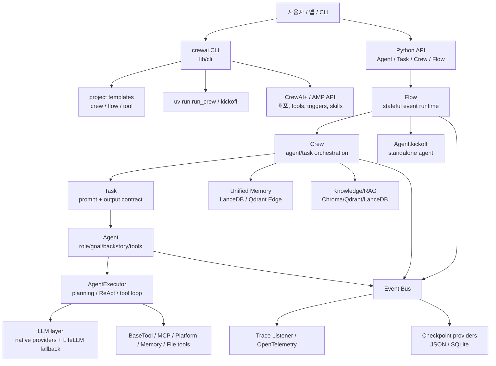
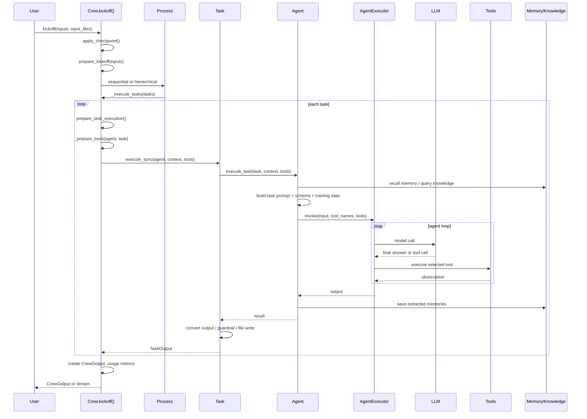
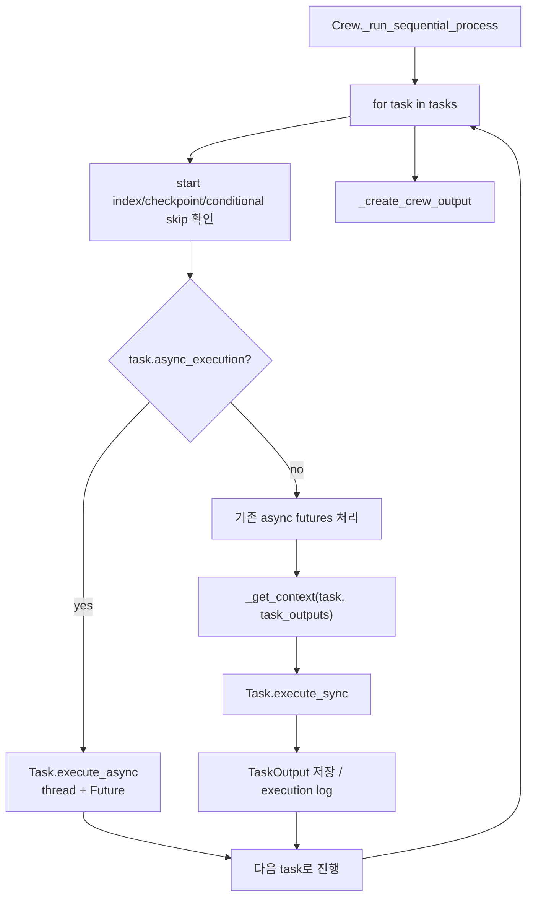
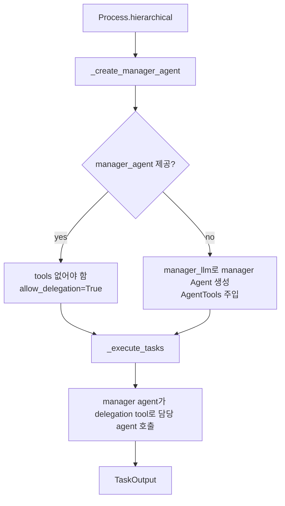
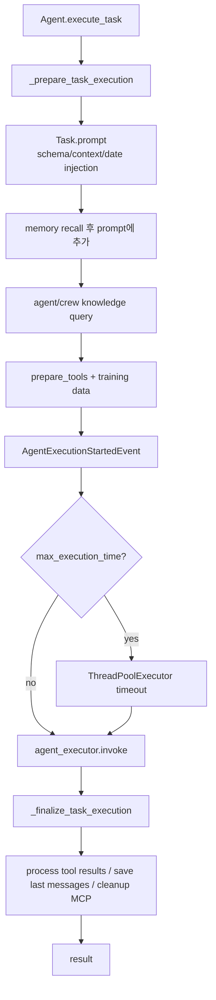
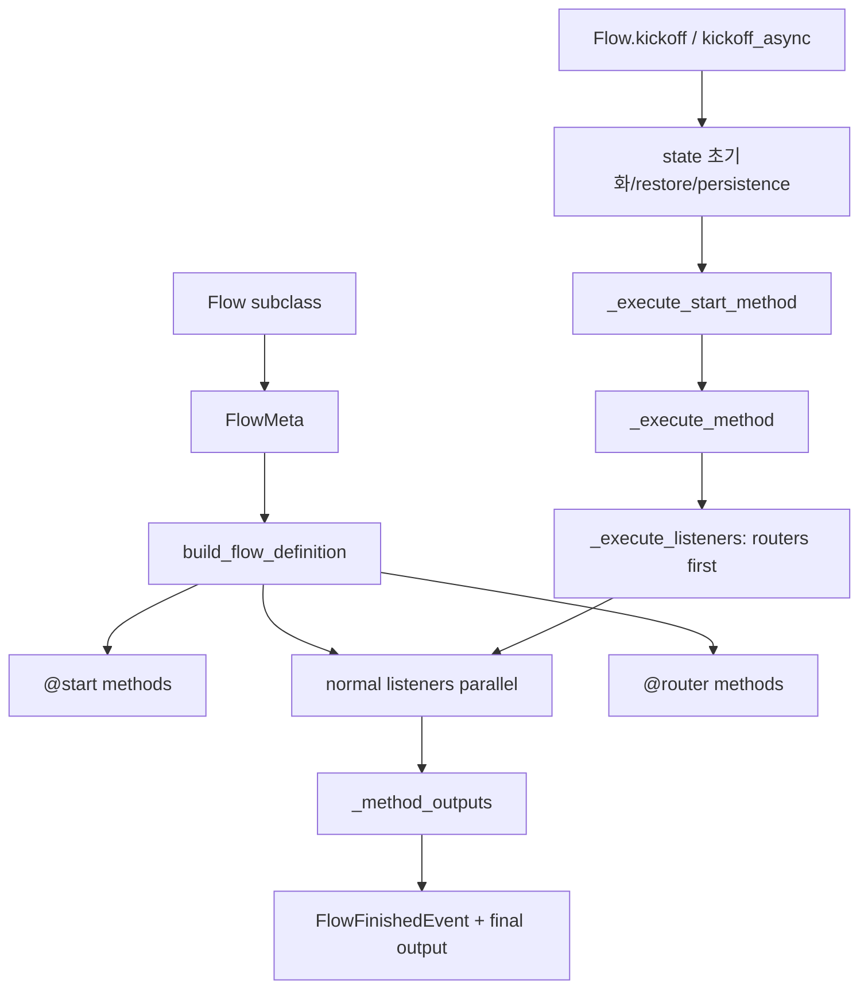
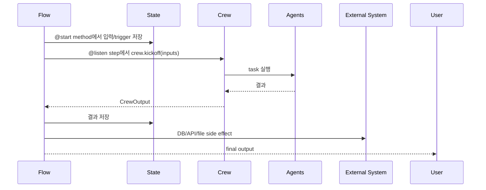
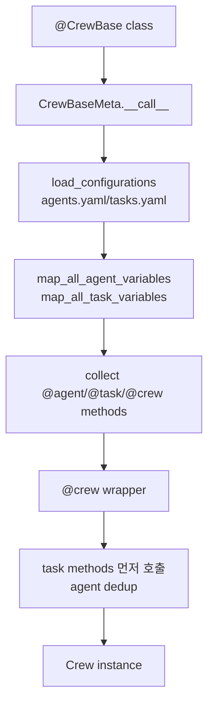
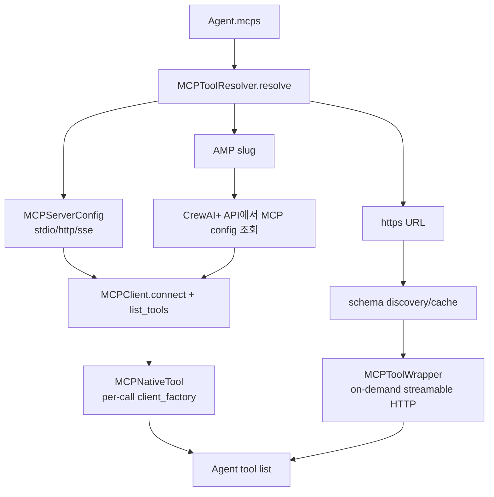
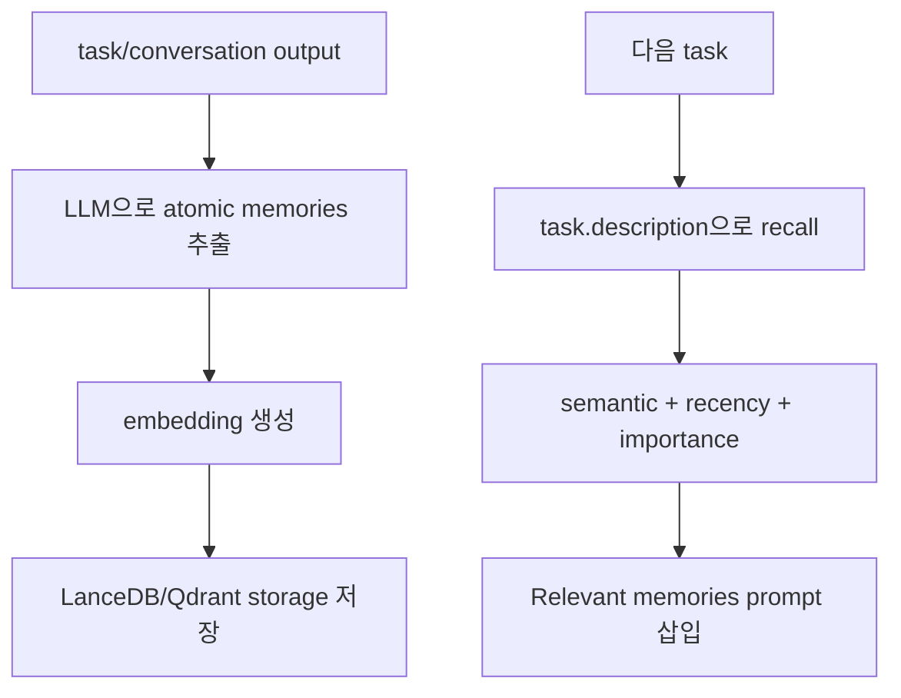

# crewAIInc/crewAI 분석 보고서

## 1. 요약 평가

CrewAI는 Python 기반 multi-agent automation framework다. 이 프로젝트의 핵심은 “자율 agent 팀”인 Crews와 “생산 환경용 event/state workflow”인 Flows를 분리해서 제공하는 것이다. Crew는 역할, 목표, backstory, tools를 가진 agent들이 task를 수행하게 만들고, Flow는 그 agent 팀을 실제 업무 시스템 안에서 언제, 어떤 상태로, 어떤 분기와 재시작 규칙으로 실행할지 제어한다.

프로젝트가 내세우는 철학은 명확하다.

- LangChain 같은 기존 agent framework에 의존하지 않고 처음부터 구현한 독립 framework다.
- agent의 자율성을 살리되, production workflow에서는 Flow로 상태와 분기, checkpoint, human feedback을 통제한다.
- 단순한 “agent loop”보다 프로젝트 scaffold, CLI, memory, knowledge, MCP, A2A, tracing, enterprise control plane까지 포함한 제품형 생태계를 지향한다.

평가상 CrewAI의 강점은 사용자가 agent/task/crew/flow를 선언적으로 조립하기 쉽고, event bus와 checkpoint, memory, telemetry가 프레임워크 안에 통합되어 있다는 점이다. 반대로 위험은 확장 표면이 넓다는 데서 온다. custom tools, MCP servers, CrewAI AMP platform tools, registry skills, memory LLM analysis, pickle 기반 training data, tracing/telemetry가 모두 외부 신뢰 경계를 만든다.

## 2. 기본 정보

- 저장소: `crewAIInc/crewAI`
- 분석 커밋: `da8fe8c`
- 기본 브랜치: `main`
- 생성일: 2023-10-27
- 최근 push: 2026-06-10
- 최신 릴리스 관측값: `1.14.6` / 2026-05-28
- 현재 main의 패키지 핀: `crewai==1.14.7a4`, `crewai-core==1.14.7a4`, `crewai-cli==1.14.7a4`
- 언어: Python
- 라이선스: MIT
- 규모: 약 3,287개 파일
- 주요 패키지:
  - `lib/crewai`: 핵심 framework
  - `lib/cli`: `crewai` CLI
  - `lib/crewai-core`: 공통 설정, telemetry, token, plus API
  - `lib/crewai-tools`: optional tools
  - `lib/crewai-files`: file input 처리
  - `lib/devtools`: 개발 도구

main 브랜치가 공개 릴리스보다 앞선 alpha 버전 의존성을 갖고 있으므로, 분석 결과는 해당 커밋의 소스 기준이다. 사용자는 PyPI stable과 main branch 동작이 다를 수 있음을 전제로 해야 한다.

## 3. 발전 과정과 설계 철학

CrewAI는 초기에 “역할 기반 agent들이 함께 일하는 Crew”가 중심인 framework로 알려졌고, 현재는 문서상 “production-ready application은 Flow에서 시작하라”는 방향으로 진화했다. 즉, 초기의 자율 agent 협업 모델을 유지하되, 실제 기업/운영 환경에서는 자율성만으로는 부족하다는 판단이 반영되어 있다.

현재 철학은 다음처럼 요약된다.

- Crew는 intelligence layer다. 역할·목표·도구를 가진 agent 팀이 복잡한 작업을 수행한다.
- Flow는 control layer다. event, state, branch, persistence, checkpoint, human feedback, external trigger를 다룬다.
- Agent 단독 실행도 가능하지만, 장기적으로는 Flow 안에서 Crew나 Agent를 호출하는 구성이 더 production-oriented다.
- Memory와 Knowledge는 prompt context를 보강하고, MCP/A2A/Platform Apps는 외부 capability를 agent tool로 연결한다.
- CLI는 scaffold, run, train, replay, test, deploy, memory reset, skills, tools, org, enterprise 연동까지 담당한다.

README는 “independent of LangChain”을 중요한 차별점으로 강조한다. 코드에서도 LangGraph adapter 같은 호환 계층은 보이지만 core loop는 자체 `Agent`, `Task`, `Crew`, `Flow`, `AgentExecutor` 구조로 움직인다.

## 4. 전체 아키텍처



이 구조의 중요한 특징은 object construction과 execution이 모두 부작용을 가진다는 점이다. `Crew`를 생성하면 validator가 cache, RPM controller, event listener, trace listener, memory, knowledge를 준비한다. `Agent`를 생성하면 LLM과 executor, skills가 준비된다. 즉 CrewAI 객체는 단순 데이터 선언이 아니라 런타임 구성 요소다.

## 5. 핵심 모듈 지도

```text
lib/crewai/src/crewai/
  crew.py                         Crew orchestration, sequential/hierarchical process
  agent/core.py                   Agent model, task execution, standalone kickoff
  task.py                         Task prompt/output/guardrail/file output
  process.py                      Process enum: sequential, hierarchical
  experimental/agent_executor.py  현재 기본 AgentExecutor, planning/replanning/tool loop
  agents/crew_agent_executor.py   deprecated executor, legacy ReAct loop
  agents/step_executor.py         planning todo 단위 실행기
  flow/runtime.py                 Flow execution engine, state, listeners, persistence
  flow/dsl/                       @start, @listen, @router, and_, or_
  project/                        @CrewBase, @agent, @task, @crew decorators
  memory/                         unified Memory, LanceDB/Qdrant storage
  knowledge/                      document/source ingestion and query
  mcp/                            stdio/http/sse MCP client and resolver
  tools/                          BaseTool, MCP wrappers, memory/file/delegation tools
  events/                         event bus and event types
  state/                          checkpoint runtime and JSON/SQLite providers
  telemetry/                      OpenTelemetry exporter and tracing integration
lib/cli/src/crewai_cli/
  cli.py                          top-level click CLI
  create_crew.py                  scaffold crew project
  create_flow.py                  scaffold flow project
  run_crew.py                     uv run wrapper
  deploy/                         CrewAI+ deployment
  experimental/skills/            skills create/install/publish/list
lib/crewai-core/src/crewai_core/
  telemetry.py                    base anonymous telemetry
  plus_api.py                     CrewAI+ API client
  token_manager.py                auth token handling
  user_data.py                    tracing consent file
```

## 6. Crew 실행 흐름

Crew의 public entrypoint는 `Crew.kickoff()`다.



### 6.1 `Crew.kickoff`

`Crew.kickoff()`는 다음을 수행한다.

1. `from_checkpoint`가 있으면 checkpoint restore를 먼저 적용한다.
2. `stream=True`면 내부적으로 non-stream kickoff를 background로 돌리고 chunk generator를 반환한다.
3. OpenTelemetry baggage에 crew context를 넣는다.
4. `prepare_kickoff()`로 inputs interpolation, input file store, before callbacks 등을 준비한다.
5. `Process.sequential`이면 `_run_sequential_process()`.
6. `Process.hierarchical`이면 manager agent를 만들고 `_run_hierarchical_process()`.
7. after kickoff callbacks를 실행한다.
8. token usage를 계산하고 memory pending write를 drain한다.
9. input files를 clear한다.

`kickoff_async()`는 sync kickoff를 thread로 감싸는 방식이고, `akickoff()`는 native async task execution을 사용한다. 이름이 비슷하지만 내부 동작이 다르므로 async 앱에서는 주의가 필요하다.

### 6.2 Sequential process

Sequential은 task list 순서대로 실행한다. 앞선 task output은 뒤 task의 context로 들어갈 수 있다.



비동기 task는 Future로 쌓아두다가 다음 동기 task 앞에서 drain한다. 마지막에 남은 Future도 처리한다. ConditionalTask는 선행 output을 보고 skip 여부를 판단하며, 첫 task가 conditional이거나 conditional async task인 경우 validator에서 막는다.

### 6.3 Hierarchical process

Hierarchical은 manager agent가 task를 배분하는 구조다.

- `manager_llm` 또는 `manager_agent`가 필수다.
- custom `manager_agent`가 tools를 갖고 있으면 warning 후 예외를 낸다.
- manager가 없으면 `AgentTools(agents=self.agents).tools()`를 가진 manager agent를 자동 생성한다.
- 일반 task 실행 시 `_get_agent_to_use()`가 task agent가 아니라 manager agent를 반환한다.



이 방식은 agent 간 협업을 자연스럽게 만들지만, tool 호출 경로가 “manager -> delegation tool -> worker agent”로 한 단계 더 길어진다. 문제 발생 시 실제 어떤 agent가 어느 tool을 호출했는지 event/log 추적이 중요하다.

## 7. Agent와 Executor

`Agent`는 role, goal, backstory, llm, tools, memory, knowledge, guardrail, MCP, A2A, skills를 가진다. 현재 소스에서는 `executor_class` 기본값이 `AgentExecutor`이며, 기존 `CrewAgentExecutor`는 deprecated 경고를 낸다.

### 7.1 Agent 생성 시 동작

`Agent.post_init_setup()`은 다음을 수행한다.

- `create_llm(self.llm)`로 LLM 객체 생성
- function calling LLM이 있으면 별도 생성
- agent executor setup
- `allow_code_execution` 사용 시 deprecation warning
- skills resolution/activation
- `reasoning`을 `planning_config`로 migration
- `planning=True`인 경우 낮은 effort, 1회 attempt의 planning config 생성

즉 Agent도 단순 config container가 아니라 생성 시점에 LLM, executor, skills가 준비된다.

### 7.2 Task 실행 시 Agent 흐름

`Agent.execute_task()` 흐름은 다음과 같다.



핵심 부가 기능:

- memory가 있으면 task description으로 recall하고 prompt에 주입한다.
- knowledge source가 있으면 agent/crew knowledge query를 수행한다.
- tool 목록은 task tools, agent tools, delegation tools, MCP tools, platform apps, memory tools, file tools로 확장된다.
- litellm 계열 exception은 retry하지 않고 바로 raise한다.
- 기타 exception은 `max_retry_limit`까지 재귀적으로 retry한다.

### 7.3 Standalone `Agent.kickoff`

Crew 없이 agent 단독으로도 실행할 수 있다.

- string 또는 message list를 받는다.
- event loop 안에서 호출되면 자동으로 `kickoff_async()` coroutine을 반환한다.
- response_format, input_files, checkpoint, guardrail, memory save를 지원한다.
- 반환값은 `LiteAgentOutput`이며 raw, pydantic, usage_metrics, messages, plan/todos/replan 정보를 포함할 수 있다.

이 기능은 작은 agent app에는 편리하지만, production workflow에서는 Flow와 Crew 안에서 호출하는 것이 상태 추적과 checkpoint 측면에서 더 낫다.

## 8. Task 모델

`Task`는 description, expected_output, agent, tools, context, async_execution, output_json/output_pydantic, output_file, human_input, guardrail을 가진다.

실행 흐름:

1. input files를 task-local store에 넣는다.
2. agent가 없으면 예외를 낸다.
3. `TaskStartedEvent`를 emit한다.
4. `agent.execute_task()`를 호출한다.
5. output type에 따라 raw/json/pydantic으로 변환한다.
6. guardrail 또는 guardrails를 실행한다.
7. callback과 crew task callback을 실행한다.
8. output_file이 있으면 저장한다.
9. `TaskCompletedEvent`를 emit한다.
10. 실패 시 `TaskFailedEvent`를 emit한다.

### 8.1 output_file 보안 처리

`output_file` validator는 다음을 막는다.

- `..` path traversal
- `~`, `$` shell expansion
- `|`, `>`, `<`, `&`, `;` shell 특수문자
- 잘못된 template variable

일반 absolute path는 leading slash를 제거해 상대 경로처럼 만든다. template variable이 있으면 leading slash를 보존한다. 전반적으로 방어적이지만, 사용자 입장에서는 `/tmp/report.md`가 현재 작업 디렉토리 하위 `tmp/report.md`로 바뀔 수 있다는 동작 차이를 알아야 한다.

## 9. Flow 아키텍처

Flow는 `@start`, `@listen`, `@router`, `and_`, `or_` DSL로 선언한 Python class를 runtime graph로 바꾼다.



### 9.1 Flow runtime 특징

- sync `kickoff()`는 내부적으로 `kickoff_async()`를 실행한다.
- 이미 event loop가 있으면 별도 thread에서 `asyncio.run()`을 수행한다.
- sync method는 `asyncio.to_thread()`로 실행해 Flow runtime을 blocking하지 않는다.
- sync method가 coroutine을 반환하면 auto-await한다.
- router는 순차 실행되고, 일반 listener는 병렬 실행된다.
- `max_method_calls` 기본값은 100으로 cyclic flow 폭주를 제한한다.
- persistence와 checkpoint가 별도 개념으로 존재하며, 둘을 동시에 restore parameter로 쓰는 것은 금지한다.
- human feedback pending은 failure가 아니라 paused event로 처리된다.

### 9.2 Flow와 Crew 결합

권장 production flow는 다음 구조다.



이 구조에서는 Crew가 복잡한 reasoning과 협업을 담당하고, Flow가 상태와 외부 side effect를 통제한다.

## 10. Project decorator와 YAML 기반 구성

CrewAI의 추천 방식은 `@CrewBase`, `@agent`, `@task`, `@crew` decorator와 YAML config를 함께 쓰는 것이다.



`@crew` wrapper는 task method들을 먼저 실행하고, task에 연결된 agent를 수집한 뒤, 나머지 agent method를 실행해 dedup한다. before/after kickoff hook도 Crew instance에 바인딩된다. MCP server adapter 종료 hook도 after kickoff callbacks에 자동 추가된다.

이 방식의 장점은 큰 프로젝트에서 YAML과 Python class를 분리해 관리할 수 있다는 점이다. 단점은 decorator/metaclass가 많은 일을 대신하므로, 디버깅 시 “언제 agent/task가 실제 생성됐는가”를 추적해야 한다.

## 11. LLM 계층

CrewAI의 LLM layer는 두 경로를 가진다.

- native provider classes: OpenAI, Anthropic, Gemini, Bedrock, Azure, OpenAI-compatible 등
- LiteLLM fallback: optional extra로 설치하는 범용 adapter

`crewai.llm.LLM`은 model prefix와 provider를 보고 native provider를 선택하려고 하고, 지원되지 않거나 `is_litellm=True`면 LiteLLM 경로를 사용한다. LLM call은 event bus에 LLM start/completed/failed/stream chunk 이벤트를 emit한다.

주요 기능:

- response format / Pydantic structured output
- native function calling 지원 여부 판별
- stream chunk와 tool call 처리
- context window 크기 추정과 초과 처리
- provider별 API key/base URL 설정

위험은 명확하다. Agent memory, knowledge, task prompt, tool output이 모두 LLM provider로 갈 수 있다. CrewAI는 framework라서 provider 선택은 사용자 책임이며, enterprise/민감 업무에서는 provider와 prompt logging 정책을 별도로 검토해야 한다.

## 12. Tools, MCP, Platform Apps

### 12.1 BaseTool

`BaseTool`은 name, description, args_schema, env_vars, cache_function, result_as_answer, max_usage_count를 가진다. args_schema가 없으면 `_run` 또는 `_arun` signature에서 Pydantic schema를 생성한다.

Tool은 agent가 실제 외부 행동을 하는 지점이다. custom tool이 파일, 네트워크, DB, cloud API를 만질 수 있으므로, CrewAI app의 권한 모델은 결국 tool 목록과 tool credential 관리에 좌우된다.

### 12.2 MCP 통합

CrewAI는 MCP server를 세 방식으로 받는다.

- `MCPServerStdio`: command/args/env
- `MCPServerHTTP`: url/headers/streamable
- `MCPServerSSE`: url/headers
- 문자열 URL: `https://...` 형태
- AMP reference: `notion`, `notion#search`, `crewai-amp:notion`

MCP tool resolution 흐름:



중요한 구현 세부:

- native MCP tool은 discovery 후 tool마다 `client_factory`를 가진다. 병렬 실행 시 같은 client를 공유하지 않게 하려는 설계다.
- URL 기반 `MCPToolWrapper`는 실행할 때마다 streamable HTTP client를 열고 tool을 호출한다.
- timeout/retry가 있고, auth/network/json error를 문자열 result로 반환하는 경로가 있다.
- tool_filter로 MCP tool 노출을 제한할 수 있다.
- AMP slug는 CrewAI+ API와 platform integration token에 의존한다.

MCP는 강력하지만 위험하다. stdio MCP는 로컬 프로세스를 실행하고, HTTP/SSE MCP는 원격 서버로 task data를 보낼 수 있다. tool_filter와 credential boundary를 명확히 해야 한다.

### 12.3 Platform Apps

Agent의 `apps`와 MCP AMP reference는 CrewAI AMP control plane과 연결된다. 공개 framework의 범위를 넘어 SaaS에서 tool credential과 integration config를 가져오는 구조다. 이 부분은 공개 소스만으로 전체 권한 처리와 secret isolation을 검증할 수 없다.

## 13. Memory와 Knowledge

### 13.1 Unified Memory

CrewAI의 최신 memory는 단일 `Memory` class다. 기존 short-term, long-term, entity memory 개념을 하나로 합치고, scope tree와 adaptive recall을 제공한다.

기본값:

- memory LLM: `gpt-4o-mini`
- storage: `lancedb`
- 기본 embedder: OpenAI embedding provider
- storage path: `CREWAI_STORAGE_DIR/memory` 또는 platform data dir 하위
- save는 background single-thread pool을 사용하고 kickoff 종료 시 drain한다.

Memory 흐름:



프라이버시 관점에서 중요한 점은 memory가 “저장만” 하는 것이 아니라 LLM으로 content를 분석한다는 것이다. 사용자가 memory=True를 켜면 task result나 대화 내용이 memory extraction LLM과 embedding provider로 전송될 수 있다. 민감 정보가 있는 환경에서는 memory LLM/embedder를 내부 provider로 지정하거나 memory를 비활성화해야 한다.

### 13.2 Knowledge

Knowledge는 string, docling, CSV, Excel, JSON, PDF, text file source를 지원한다. source를 storage에 add하고, query 시 vector search로 관련 context를 가져온다.

Knowledge는 상대적으로 정적인 자료 기반 RAG이고, Memory는 실행 중 생기는 결과와 경험을 저장하는 쪽에 가깝다.

## 14. Checkpoint, Replay, Training

### 14.1 Checkpoint

`CheckpointConfig`는 Crew/Flow/Agent에 붙을 수 있고, event bus의 특정 event가 발생할 때 JSON 또는 SQLite provider로 상태를 저장한다.

- 기본 location: `./.checkpoints`
- 기본 event: `task_completed`
- `["*"]`로 모든 event 저장 가능
- Crew와 Flow는 `from_checkpoint`로 restore/fork 가능

Checkpoint는 긴 실행과 human feedback이 있는 workflow에서 중요하다. 다만 checkpoint에는 inputs, state, task output, tool event 등 민감한 runtime 정보가 들어갈 수 있다. 저장 위치와 retention을 관리해야 한다.

### 14.2 Replay

Crew는 task output storage를 SQLite에 저장하고, 특정 task id부터 replay할 수 있다. CLI `crewai replay`도 같은 흐름을 사용한다. 이 역시 실행 output과 inputs가 로컬에 남는다는 의미다.

### 14.3 Training

`crewai train` 또는 `Crew.train()`은 여러 iteration을 돌리고 human feedback을 모아 trained agent suggestion을 저장한다.

중요한 구현:

- `CrewTrainingHandler`는 `PickleHandler`를 상속한다.
- `training_data.pkl`, `trained_agents_data.pkl` 같은 `.pkl` 파일을 사용한다.
- `Crew(trained_agents_file=...)`, `CREWAI_TRAINED_AGENTS_FILE`, CLI `-f`로 custom pickle을 불러올 수 있다.

pickle은 Python에서 신뢰할 수 없는 파일을 load하면 원격 코드 실행 위험이 있는 포맷이다. CrewAI의 training 파일은 사용자가 만든 로컬 파일을 전제로 하지만, 외부에서 받은 `.pkl`을 `trained_agents_file`로 지정하는 것은 위험하다.

## 15. CLI 흐름

CLI top-level command는 `lib/cli/src/crewai_cli/cli.py`다.

주요 명령:

- `crewai create crew|flow <name>`: template scaffold
- `crewai install`: uv sync 계열 설치
- `crewai run`: pyproject를 보고 crew 또는 flow 실행
- `crewai train`: training iteration 실행
- `crewai replay`: 특정 task부터 replay
- `crewai test`: evaluation
- `crewai plot`: flow plot
- `crewai reset-memories`: memory/knowledge/kickoff output 삭제
- `crewai memory`: memory TUI
- `crewai deploy`, `crewai triggers`, `crewai tools`, `crewai org`, `crewai enterprise`: CrewAI+ control plane 연동
- `crewai skill`: experimental skills create/install/publish/list

`crewai run`은 `uv run run_crew` 또는 `uv run kickoff`를 subprocess로 실행한다. `crewai uv`는 `uv` command wrapper이며 tool credentials를 env에 주입한다. 즉 CLI는 단순 wrapper가 아니라 credential 환경을 구성해 subprocess를 실행한다.

## 16. Skills 시스템

CrewAI는 Agent Skills standard를 지원한다.

- 로컬 `skills/<name>/SKILL.md`
- global cache `~/.crewai/skills/<org>/<name>`
- registry reference `@org/name`

registry skill resolution은 local-first, cache, interactive download 순서다. non-interactive 환경에서는 cache가 없으면 실패한다. CLI의 skill install/publish는 CrewAI+ API에서 archive를 받거나 업로드한다.

리스크:

- skill은 agent에게 추가 instruction과 scripts/references/assets를 제공한다.
- registry에서 받은 archive를 project 또는 global cache에 unpack한다.
- skill instruction은 agent 행동을 바꿀 수 있으므로, 신뢰하지 않는 skill을 설치하면 prompt supply-chain 문제가 된다.
- publish는 tarball을 만들어 CrewAI+ API로 업로드한다. 민감 파일이 skill directory에 들어가지 않게 관리해야 한다.

## 17. Telemetry와 Observability

CrewAI에는 두 층의 telemetry가 있다.

1. `crewai-core` base telemetry: CLI와 runtime 공통의 anonymous telemetry
2. `crewai.telemetry.telemetry`: crew/agent/task/tool/flow event와 trace listener 연동

OTLP endpoint:

- `https://telemetry.crewai.com:4319/v1/traces`

비활성화 환경 변수:

- `OTEL_SDK_DISABLED=true`
- `CREWAI_DISABLE_TELEMETRY=true`
- `CREWAI_DISABLE_TRACKING=true`

문서/주석상 base telemetry는 prompt, task description, backstory, responses, sensitive data를 수집하지 않는다고 설명한다. 다만 코드에는 agent 수, tools 수, `allow_code_execution`, `human_input`, memory 여부 같은 metadata를 span attribute로 넣는 경로가 있다. tracing은 user data의 `trace_consent`, `CREWAI_TRACING_ENABLED` 등과 맞물린다.

운영 관점에서는 다음을 구분해야 한다.

- framework anonymous telemetry: 비활성화하지 않으면 초기화될 수 있다.
- tracing/observability: Langfuse, Datadog, Braintrust, Phoenix 등으로 보낼 수 있는 OpenTelemetry 기반 trace.
- CrewAI AMP telemetry/control plane: enterprise UI, deployment monitoring과 연결된다.

## 18. A2A와 Enterprise 표면

소스에는 `crewai/a2a`가 존재하고, A2A auth, agent card, delegation, streaming, updates, task helper가 구현되어 있다. 이는 remote agent와 통신하거나 agent-to-agent delegation을 표준화하려는 방향이다.

Enterprise 문서는 다음 표면을 포함한다.

- Crew Control Plane
- tracing/observability
- RBAC
- secrets manager
- triggers/webhooks
- training UI
- agent control plane
- PII masking
- integrations

이 중 많은 부분은 공개 framework와 CrewAI AMP SaaS/Enterprise API의 경계에 있다. 공개 소스만으로 enterprise backend의 RBAC, secret handling, deployment isolation을 완전히 검증할 수는 없다.

## 19. 런타임 검증

로컬 clone 직후 환경:

- Python: `3.12.4`
- `crewai`: 미설치
- `crewai_core`: 미설치
- `crewai_cli`: 미설치
- `openai`: 미설치
- `chromadb`: 미설치
- `lancedb`: 미설치
- `mcp`: 미설치
- `litellm`: 미설치

따라서 실제 crew execution은 수행하지 않았다. 대신 주요 파일의 syntax check는 통과했다.

```text
python3 -m py_compile \
  lib/crewai/src/crewai/crew.py \
  lib/crewai/src/crewai/task.py \
  lib/crewai/src/crewai/agent/core.py
```

의존성 설치를 하지 않은 이유는 이 레포가 `uv.lock`과 많은 optional dependency, provider SDK, vector DB, tool extras를 포함하는 큰 workspace이기 때문이다. 이번 보고서는 소스 기준 call graph와 실행 경로를 중심으로 작성했다.

## 20. 차별점

CrewAI의 차별점은 다음과 같다.

- Crew와 Flow를 명확히 분리한다. 자율 agent 협업과 production control을 같은 추상화에 억지로 넣지 않는다.
- YAML + decorator 기반 project scaffold가 성숙하다.
- Agent, Task, Crew, Flow가 모두 Pydantic model이라 validation과 serialization/checkpoint가 framework 전반에 걸쳐 일관된다.
- Event bus 중심이라 telemetry, checkpoint, tracing, logging, memory event가 하나의 관측 구조로 모인다.
- Memory가 단순 vector store가 아니라 LLM 기반 extraction, scope inference, recency/importance scoring을 가진다.
- MCP, A2A, skills, platform apps를 모두 tool/capability 확장으로 흡수한다.
- CLI가 create/run/train/replay/deploy까지 제공해 library보다 product framework에 가깝다.

## 21. 주요 위험과 이상한 점

### 21.1 확장 표면이 매우 넓다

Custom tools, MCP, platform apps, A2A, skills, file inputs, memory, knowledge, Flow side effects가 모두 agent 실행 경로에 들어간다. CrewAI 자체가 악성이라는 뜻은 아니지만, 사용자가 부여한 tool 권한이 곧 agent의 행동 권한이 된다.

### 21.2 Memory가 외부 LLM/embedder를 사용할 수 있다

`memory=True`의 기본 `Memory()`는 `gpt-4o-mini`와 OpenAI embedding 기본값을 사용한다. task output이나 대화에서 추출된 사실이 외부 provider로 갈 수 있다. 민감한 업무에서는 memory provider를 명시하거나 끄는 것이 필요하다.

### 21.3 Training file은 pickle이다

`trained_agents_data.pkl` 같은 파일은 pickle로 load된다. untrusted pickle을 불러오면 Python code execution 위험이 있다. CLI가 `-f`와 env var로 custom file을 받을 수 있으므로, 외부에서 받은 training artifact를 그대로 쓰면 안 된다.

### 21.4 Registry skills는 prompt supply chain이다

`@org/name` skill은 agent instruction을 바꾼다. archive download와 unpack까지 포함하므로, 공식/신뢰 조직이 아닌 skill은 코드 의존성처럼 검토해야 한다.

### 21.5 MCP는 외부 실행/네트워크 경계다

stdio MCP는 로컬 command를 실행한다. HTTP/SSE MCP는 remote server와 통신한다. MCP tool 결과는 agent loop에 들어가고, tool arguments에는 task context가 포함될 수 있다. tool_filter와 credentials를 제한해야 한다.

### 21.6 Telemetry와 tracing을 명확히 구분해야 한다

CrewAI는 anonymous telemetry와 OpenTelemetry tracing을 모두 제공한다. 민감 환경에서는 `CREWAI_DISABLE_TELEMETRY`, `CREWAI_DISABLE_TRACKING`, `OTEL_SDK_DISABLED`, `CREWAI_TRACING_ENABLED`의 관계를 명확히 설정해야 한다.

### 21.7 `share_crew` 의미가 강하다

문서상 `share_crew`는 crew information and execution을 CrewAI team과 공유해 library 개선과 model training에 쓰는 의미로 설명된다. 기본값은 false지만, 이 옵션을 켤 때는 어떤 데이터가 공유되는지 별도 확인이 필요하다.

### 21.8 Alpha 버전 드리프트

분석 커밋의 workspace는 `1.14.7a4` 계열 alpha 패키지를 참조하지만 최신 공개 release metadata는 `1.14.6`이다. main branch 기능과 stable PyPI 설치 결과가 다를 수 있다.

### 21.9 Deprecated 기능이 아직 표면에 남아 있다

`allow_code_execution`, `code_execution_mode`, `multimodal`, `reasoning`, `function_calling_llm`, `CrewAgentExecutor` 등 deprecation 경고가 많다. 사용자는 최신 문서 기준으로 migration해야 한다.

### 21.10 Async API가 여러 층이다

`kickoff_async()`는 sync kickoff를 thread로 감싸고, `akickoff()`는 native async execution을 쓴다. `Agent.kickoff()`는 event loop 내부에서 coroutine을 반환한다. async app에서 잘못 섞으면 예상치 못한 thread/event loop behavior가 생길 수 있다.

### 21.11 Local persistence가 민감 데이터를 남긴다

Memory LanceDB, task output SQLite, checkpoint JSON/SQLite, `.crewai_user.json`, training `.pkl`이 로컬에 남는다. 저장 위치는 `CREWAI_STORAGE_DIR`, working directory, platform data dir에 따라 달라진다.

## 22. 사용자가 실제로 이해해야 할 실행 모델

CrewAI를 제대로 이해하려면 다음 계층을 순서대로 보면 된다.

1. `Task`: 무엇을 해야 하고 어떤 output을 기대하는가.
2. `Agent`: 그 task를 어떤 역할/도구/LLM/메모리로 수행하는가.
3. `Crew`: 여러 task와 agent를 어떤 process로 연결하는가.
4. `Flow`: crew 실행을 실제 application state, branch, trigger, persistence에 어떻게 연결하는가.
5. `Event Bus`: 모든 실행 사건을 telemetry, checkpoint, tracing, logging으로 어떻게 흘리는가.
6. `External Capability`: MCP, tools, skills, apps, A2A가 어디서 권한과 데이터를 가져가는가.

## 23. 종합 결론

CrewAI는 단순 agent loop library가 아니라 production automation framework를 지향한다. Crews는 agent autonomy를 담당하고, Flows는 operational control을 담당한다. 이 분리는 설계상 설득력이 있고, 실제 업무 자동화에서 “자율성은 필요한 곳에만, 나머지는 deterministic workflow로”라는 균형을 잡을 수 있게 한다.

다만 기능이 많은 만큼 보안·운영 검토가 필요하다. memory와 training, MCP, skills, platform integrations, tracing은 모두 별도의 데이터 이동 경로다. 개인 프로젝트에서는 빠르게 scaffold하고 실험하기 좋지만, 회사나 민감한 코드베이스에서는 provider, tool permission, local persistence, telemetry, skill source, MCP server trust를 명시적으로 통제해야 한다.

추천 사용 방식은 다음과 같다.

- 작은 실험: `Agent.kickoff()` 또는 간단한 Crew로 시작한다.
- 실제 앱: Flow를 top-level orchestration으로 두고, 필요한 단계에서 Crew를 호출한다.
- 민감 데이터: memory/tracing/telemetry를 끄거나 내부 provider로 고정한다.
- 외부 도구: MCP/tool/skill을 allowlist로 제한하고 credential scope를 최소화한다.
- 장기 실행: checkpoint와 replay를 쓰되 저장소와 retention을 관리한다.
