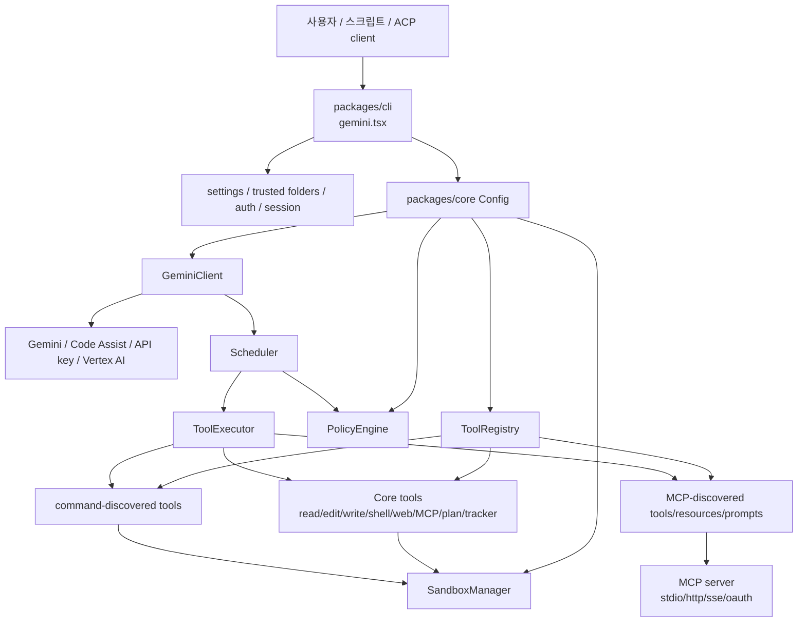
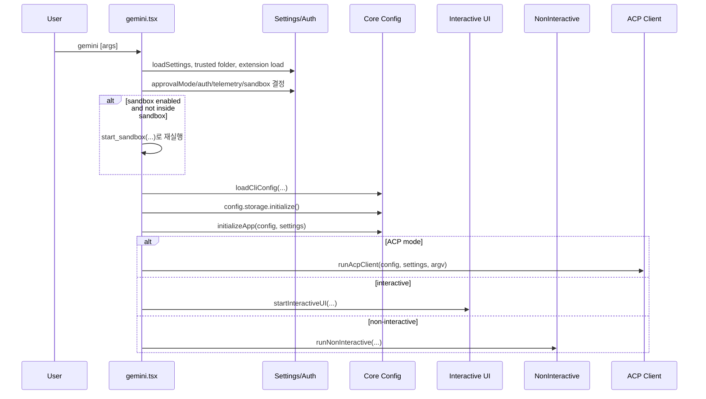
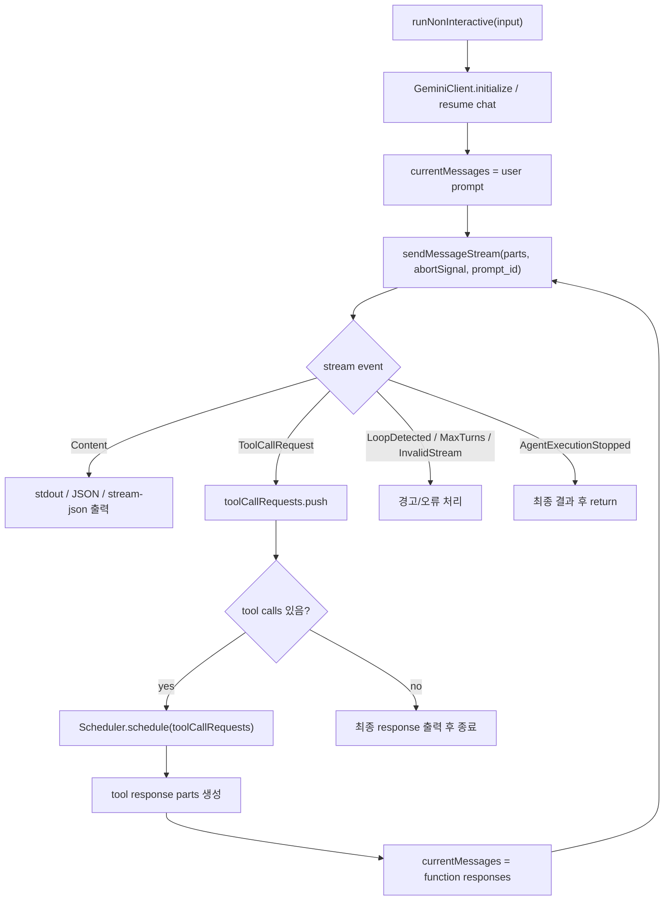
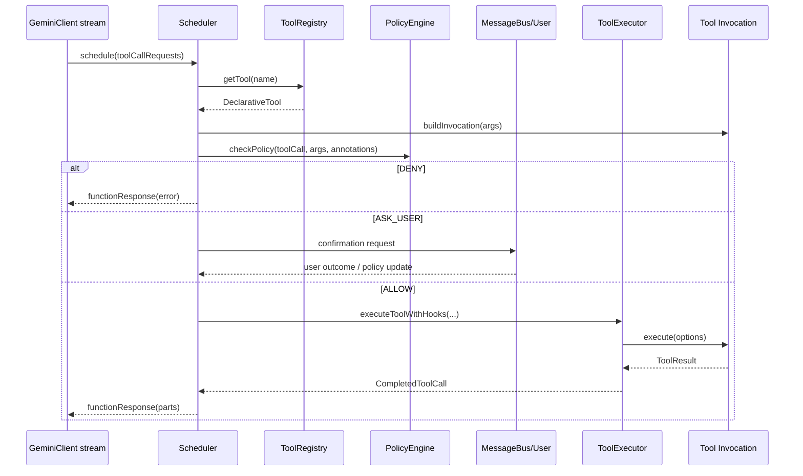
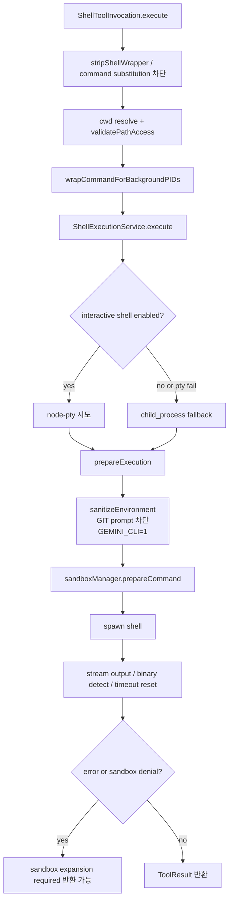
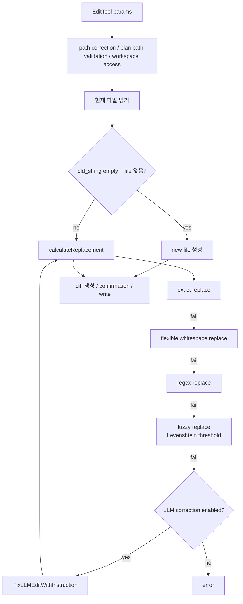
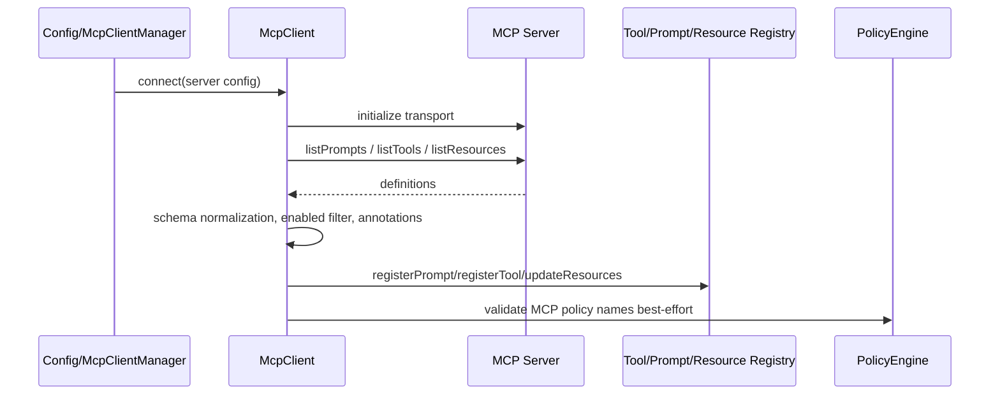

# google-gemini/gemini-cli 심층 분석 보고서

- 분석 기준일: 2026-06-10
- 로컬 소스: `sources/google-gemini__gemini-cli`
- 분석 commit: `1d2adf7`
- GitHub: <https://github.com/google-gemini/gemini-cli>
- 주 언어: TypeScript
- 라이선스: Apache-2.0
- GitHub 메타데이터: 105,128 stars, 14,026 forks, latest release `v0.46.0`, latest pushed `2026-06-10T04:57:01Z`
- 로컬 패키지 버전: `0.48.0-nightly.20260609.g3a13b8eeb`

## 1. 한줄 평가

Gemini CLI는 "공식 Google Gemini 터미널 에이전트"라는 위치를 코드 구조 전체에 강하게 반영한다. 단순한 LLM wrapper가 아니라 인증, 세션, 정책, sandbox, MCP, 확장, 텔레메트리, IDE companion, A2A 서버, 비대화형 자동화까지 포함한 제품형 CLI 에이전트다. 핵심 장점은 Google 계정/Code Assist/Gemini API/Vertex AI 인증 경로와 Gemini 모델 기능을 직접 붙인 점, 긴 컨텍스트와 검색 grounding을 전면에 놓은 점, 그리고 도구 실행을 정책 엔진과 sandbox manager로 통제하려는 구조다. 반대로 구조가 커서 사용자가 "무엇이 자동 실행되는지"를 이해하기 어렵고, discovery command, MCP, sandbox expansion, background shell, telemetry, extension 로딩처럼 신뢰 경계가 여러 겹으로 늘어나는 위험도 같이 있다.

## 2. 프로젝트 성격과 발전 방향

README는 Gemini CLI를 "Gemini를 터미널로 가져오는 open-source AI agent"로 정의한다. 설치 경로는 `npx @google/gemini-cli`, npm global, Homebrew, MacPorts, Anaconda를 지원하고, 릴리스 채널은 preview/stable/nightly로 분리되어 있다. 이 레포의 현재 로컬 루트 `package.json`은 nightly version `0.48.0-nightly.20260609.g3a13b8eeb`를 가리키며, GitHub latest release는 `v0.46.0`이므로, main branch는 공식 stable release보다 앞선 개발 상태다.

철학은 세 가지로 읽힌다.

1. **Terminal-first, Google-auth-first**: CLI가 기본 표면이고, Google OAuth/Code Assist/API key/Vertex AI 인증을 모두 수용한다. 무료 tier와 Google 계정 기반 사용성을 강조한다.
2. **Tool use를 제품 기능으로 다룬다**: 파일 읽기/쓰기/편집, grep/glob/ls, shell, web fetch/search, MCP resource, todo, plan mode, tracker, agent tool까지 core tool registry에 등록한다. 도구 실행은 모델 응답의 부속품이 아니라 별도 scheduler/policy/sandbox 계층으로 처리된다.
3. **자동화와 통합을 CLI 바깥으로 확장한다**: non-interactive mode, stream-json, ACP, A2A server, VS Code IDE companion, GitHub Action 통합을 지원한다. "개발자가 쓰는 터미널 도구"에서 "자동화 파이프라인의 에이전트 런타임"으로 커지는 방향이다.

## 3. 저장소 구조

주요 루트 구성은 다음과 같다.

- `packages/cli`: 실제 `gemini` CLI 진입점, Ink 기반 인터랙티브 UI, 비대화형 실행, ACP transport, 설정 로딩.
- `packages/core`: 모델 client, tool registry, scheduler, policy engine, sandbox manager, shell/file/MCP 도구, telemetry, memory, routing, agents.
- `packages/sdk`: 외부에서 core를 라이브러리처럼 쓰기 위한 SDK.
- `packages/a2a-server`: A2A 형태의 HTTP 서버 패키지.
- `packages/vscode-ide-companion`: IDE diff/companion 통합용 VS Code 확장.
- `docs`, `evals`, `integration-tests`, `memory-tests`, `perf-tests`: 문서, 평가, 통합/메모리/성능 테스트.
- `third_party/get-ripgrep`: ripgrep 확보용 third-party 구성.

패키지는 npm workspace 구조다. root `package.json`은 `gemini` bin을 `bundle/gemini.js`로 배포하고, `packages/cli/package.json`은 `dist/index.js`를 bin으로 둔다. core package는 bin이 없는 라이브러리이며, CLI와 A2A/SDK가 core를 호출한다.

## 4. 핵심 아키텍처

큰 구조는 CLI shell, core runtime, model, tool execution, policy/sandbox, extension/MCP 계층으로 나뉜다.

### 4.1 CLI 진입 흐름

`packages/cli/src/gemini.tsx`가 가장 중요한 startup orchestrator다. 이 파일은 인자 파싱, 설정 로딩, trusted folder, extension manager, 인증, sandbox relaunch, session list/delete, terminal setup, app initialize, ACP/non-interactive/interactive 분기를 모두 담당한다.

실제 분기는 다음과 같다.

특이점은 sandbox가 "도구 실행 시점"뿐 아니라 CLI 프로세스 자체를 재실행하는 경로도 있다는 점이다. `gemini.tsx`는 `process.env['SANDBOX']`가 없고 sandbox config가 있으면 `start_sandbox(...)`로 자식 프로세스를 시작한다. 따라서 사용자가 보는 하나의 `gemini` 명령이 실제로는 sandbox 밖 bootstrapper와 sandbox 안 CLI로 나뉠 수 있다.

### 4.2 Config와 도구 등록

`packages/core/src/config/config.ts`의 `Config`는 core runtime의 중심 객체다. 생성자에서 target dir, folder trust, sandbox config, workspace context, policy engine, sandbox manager, file system service, auth/model/telemetry/settings를 묶는다. sandbox가 활성화되면 `SandboxedFileSystemService`를 사용하고, 아니면 `StandardFileSystemService`를 쓴다.

도구 등록은 `Config` 내부에서 `ToolRegistry`를 만들고 다음 계열을 등록하는 방식이다.

- `UpdateTopicTool`
- `LSTool`, `ReadFileTool`
- `RipGrepTool` 또는 fallback `GrepTool`
- `GlobTool`
- `ActivateSkillTool`
- `EditTool`, `WriteFileTool`
- `WebFetchTool`, `WebSearchTool`
- `ReadMcpResourceTool`, `ListMcpResourcesTool`
- `ShellTool`
- `ListBackgroundProcessesTool`, `ReadBackgroundOutputTool`
- `AskUserTool`
- optional `WriteTodosTool`
- plan enabled 시 `ExitPlanModeTool`, `EnterPlanModeTool`
- tracker enabled 시 tracker tools
- `AgentTool`

그 뒤 `registry.discoverAllTools()`가 실행되어 설정된 discovery command 기반 도구를 추가한다. MCP 도구는 별도 MCP manager 경로에서 연결/발견 후 registry에 들어온다.

## 5. 비대화형 실행 루프

비대화형 모드는 `gemini -p "..."`, stdin pipe, JSON/stream-json output에서 중요하다. `packages/cli/src/nonInteractiveCli.ts`는 `GeminiClient.sendMessageStream(...)`를 호출하고, 스트림 이벤트 중 tool request를 모아 `Scheduler.schedule(...)`에 넘긴다.

중요한 점은 모델이 tool call을 여러 개 내면 바로 실행하지 않고 scheduler가 검증, 정책 확인, 사용자 승인, 병렬 실행 가능성 판단, hook, sandbox expansion 재시도까지 처리한다는 점이다.

## 6. Scheduler, Policy, ToolExecutor 흐름

`packages/core/src/scheduler/scheduler.ts`의 `Scheduler`는 tool call batch를 받아 상태를 만들고, 도구별 invocation을 만들며, policy와 confirmation을 통과한 뒤 `ToolExecutor`에 넘긴다.

정책 엔진은 `packages/core/src/policy/policy-engine.ts`에 있으며, rule priority, checker priority, hook checkers, MCP server identity, wildcard matching, argsPattern, interactive/non-interactive 조건, tool annotations를 함께 본다. MCP 도구는 `mcpName`과 formatted tool name을 둘 다 고려한다. shell 계열은 별도 heuristic이 붙어 redirection, shell wrapper, subcommand, dangerous command, known-safe command, 추가 sandbox permission을 평가한다.

기본 정책 성격은 모드에 따라 달라진다.

- `default`: 위험하거나 쓰기/실행 성격의 도구는 confirmation 중심.
- `auto_edit`: 편집 계열 자동 승인 범위가 넓어질 수 있음.
- `plan`: 계획 중심 제한 모드.
- `yolo`: 자동 승인 범위가 넓고, README/코드 모두 위험성을 경고한다.
- non-interactive: `ASK_USER`를 처리할 수 없으므로 기본적으로 deny 성격이 강하다.

## 7. Shell 실행 구조

셸 도구는 가장 위험하면서도 가장 강력한 기능이다. 구현은 `packages/core/src/tools/shell.ts`와 `packages/core/src/services/shellExecutionService.ts`로 나뉜다.

ShellTool 주요 흐름:

1. command가 비어 있는지 검증한다.
2. `dir_path`가 있으면 target dir 기준으로 resolve하고 workspace 접근 가능성을 검증한다.
3. command substitution `$()`, backtick, `<()`, `>()`, PowerShell subexpression을 감지해 차단한다.
4. POSIX 환경에서는 background PID 수집용 wrapper를 붙인다.
5. `ShellExecutionService.execute(...)`로 넘긴다.
6. live output을 1초 단위로 flush하며, binary stream은 감지 후 raw streaming을 중단한다.
7. background mode면 초반 delay 후 PID와 initial output만 돌려준다.
8. 실패 시 sandbox denial을 heuristic으로 파싱해 추가 permission 요청을 만들 수 있다.

`ShellExecutionService.prepareExecution(...)`는 중요한 방어 지점이다.

- shell 설정을 가져와 executable과 argsPrefix를 결정한다.
- bash에서는 `promptvars` 등 shell option을 꺼서 prompt expansion 문제를 줄인다.
- Windows PTY에서는 `chcp 65001`을 주입해 UTF-8 출력 문제를 줄인다.
- 비대화형 실행에서는 Git credential prompt와 GUI prompt를 막는다.
- 환경변수를 `sanitizeEnvironment(...)`로 필터링하고 `GEMINI_CLI=1`, `TERM`, `PAGER=cat`, `GIT_PAGER=cat`을 설정한다.
- 마지막으로 `sandboxManager.prepareCommand(...)`를 통해 docker/podman/sandbox-exec/windows-native 등의 sandbox command로 바꿀 수 있다.

운영상 중요한 점은 background process history와 background log 파일이 global temp 아래 유지된다는 점이다. 장기 실행 command를 모델이 background로 보내면, 세션 관리/cleanup이 실패할 경우 사용자가 의도하지 않은 프로세스가 남을 가능성이 있다.

## 8. 파일 편집 도구 구조

`packages/core/src/tools/edit.ts`는 이 레포의 품질을 잘 보여주는 파일이다. 단순 문자열 replace가 아니라 다음 단계로 복구한다.

차별점:

- `allow_multiple`가 false면 정확히 1회 매칭을 요구한다.
- 새 파일 생성은 `old_string === ''`이고 파일이 없을 때만 허용한다.
- omission placeholder를 감지해 `... rest of methods ...` 같은 생략형 patch를 거부한다.
- CRLF/LF line ending을 보존한다.
- IDE mode에서는 `IdeClient.openDiff(...)`로 사용자가 diff를 수정/승인할 수 있다.
- 적용 후 LLM에게 diff context snippet을 돌려주어 재확인 read를 줄인다.

위험도는 fuzzy/LLM correction이 편의성을 높이는 대신 "모델이 의도와 다른 유사 위치를 고르는" 가능성을 만든다는 점이다. 코드에는 fuzzy 복잡도 제한과 threshold가 있으나, 보안상 중요한 파일에서는 confirmation UX와 diff 검토가 핵심 방어선이다.

## 9. MCP와 외부 도구 확장

Gemini CLI는 두 가지 외부 도구 확장면을 가진다.

1. **Command-discovered tools**: 사용자가 설정한 `toolDiscoveryCommand`를 실행해 JSON tool declaration을 받아 `DiscoveredTool`로 등록한다. 이 실행도 sandbox manager를 통과할 수 있고 stdout/stderr 10MB 제한이 있다. 하지만 본질적으로 "로컬 command가 도구 catalog를 만든다"는 구조라서, 해당 command 자체가 신뢰 경계다.
2. **MCP tools/resources/prompts**: `McpClientManager`와 `McpClient`가 MCP server에 연결하고 prompts, tools, resources를 발견해 registry에 등록한다. stdio/http/sse 및 OAuth/Google credentials/service account 계열 인증 경로가 존재한다.

MCP discovery 흐름은 다음과 같다.

MCP tool schema는 일부 서버가 `$defs`/`$ref`로 복잡한 schema를 반환할 때 validation 실패가 날 수 있어 lenient validator fallback이 있다. 이는 호환성은 높이지만 output validation을 건너뛰는 경우가 생긴다.

## 10. 모델 client와 conversation 흐름

`GeminiClient`는 core의 모델 호출 facade다. `sendMessageStream(...)`은 history, compression/context management, loop detection, tool output masking, model routing/fallback, before/after agent hook, invalid stream handling을 묶는다. `geminiChat.ts`에는 `@google/genai` chat 구현을 일부 복사/수정한 코드가 있으며, function response validity 문제를 우회하기 위한 설명이 붙어 있다. 즉 upstream SDK만 그대로 쓰는 것이 아니라 CLI tool loop에 맞게 chat layer를 커스터마이즈했다.

사용자 관점의 흐름은 다음과 같다.

- 인터랙티브: `gemini` 실행 -> 인증/설정 확인 -> Ink UI -> 사용자가 prompt 입력 -> 모델 스트림 출력 -> 도구 승인 UI -> 결과 출력/세션 저장.
- 비대화형 text: `gemini -p "..."` -> stdin 병합 가능 -> prompt 전송 -> tool call 자동 처리 가능 범위 내 실행 -> stdout에 최종 답.
- 비대화형 JSON: `--output-format json` -> 최종 response와 stats를 JSON으로 출력.
- stream-json: message/tool_use/tool_result/error/result event를 줄 단위로 출력해 CI/automation이 소비할 수 있다.
- ACP: `config.getAcpMode()`가 true면 CLI UI 대신 ACP stdio client로 동작한다.
- sandbox: 설정에 따라 CLI 자체가 sandbox로 재실행되거나, 개별 command/file operation이 sandbox manager를 통해 실행된다.

## 11. 차별점

- **공식 Gemini 통합**: Google 계정 로그인, Gemini API key, Vertex AI, Code Assist tier, admin controls와 직접 연결된다.
- **긴 컨텍스트와 검색 grounding을 제품 메시지로 전면화**: README는 Gemini 3, 1M token context, Google Search grounding을 강조한다.
- **정교한 도구 실행 pipeline**: model stream -> scheduler -> policy -> confirmation -> executor -> tool result 경로가 명확히 분리되어 있다.
- **sandbox expansion UX**: command가 sandbox 제한에 막혔을 때 denial을 파싱하고 필요한 file/network permission을 제안하는 구조가 있다.
- **파일 편집 신뢰성**: exact/flexible/regex/fuzzy/LLM correction, diff confirmation, IDE diff 연동, line ending 보존이 있다.
- **MCP와 command discovery 동시 지원**: 표준 MCP뿐 아니라 로컬 command 기반 tool catalog도 지원한다.
- **여러 실행 표면**: interactive TUI, non-interactive, JSON streaming, ACP, A2A server, VS Code companion이 공존한다.
- **관측성**: OpenTelemetry/Cloud Logging 계열 dependency와 telemetry events가 core에 깊이 들어가 있다.

## 12. 숨겨진 또는 잘 보이지 않는 동작

- **sandbox 재실행**: 사용자는 `gemini` 한 번을 실행했다고 느끼지만, 설정에 따라 `gemini.tsx`가 sandbox 내부 프로세스로 다시 실행한다.
- **extension 로딩**: trusted folder 여부와 extension registry 설정에 따라 extension manager가 MCP server, plan directory, theme, prompt 등을 로딩할 수 있다.
- **비대화형 stdin 병합**: pipe 입력이 있으면 prompt 앞에 stdin이 붙는다. 자동화에서 예상보다 큰 입력이 모델 prompt에 들어갈 수 있다.
- **raw output 위험 옵션**: non-interactive content 출력 시 기본은 ANSI strip이지만 raw output 또는 accepted raw risk 설정이면 escape sequence가 그대로 나갈 수 있다.
- **tool discovery command**: 설정된 discovery command가 있으면 CLI 초기화 중 subprocess가 실행되어 도구 정의를 만든다.
- **background shell**: 모델이 `is_background`를 쓰면 프로세스가 세션 뒤에서 계속 돌고, 로그는 global temp에 남는다.
- **MCP diagnostic quiet mode**: 사용자가 `/mcp`와 상호작용하기 전에는 MCP 오류가 조용히 처리되고 한 번만 hint가 나올 수 있다.
- **LLM edit self-correction**: edit 실패 시 별도 LLM 호출로 search/replace를 보정할 수 있다. 편의 기능이지만, 코드 변경 provenance를 추적할 때는 "최초 모델 응답"과 "보정 모델 응답"이 다를 수 있다.

## 13. 위험 요소와 이상한 점

### 13.1 권한/보안 위험

- `YOLO` approval mode는 모든 tool call 자동 승인에 가까워진다. 설정에는 secure mode/disable yolo guard가 있으나, trusted folder에서 사용자가 켜면 위험하다.
- command-discovered tool은 discovery command 자체가 로컬 실행이다. 악성 workspace 설정 또는 extension이 discovery command를 유도하면 초기화 단계에서 코드 실행 표면이 생긴다.
- MCP server는 tool schema, annotations, prompt/resource를 외부에서 공급한다. policy가 server identity와 annotation을 보지만, lenient schema fallback이나 잘못된 trust 설정은 위험하다.
- sandbox expansion heuristic은 편리하지만, 모델/사용자가 반복적으로 permission을 넓히면 sandbox의 의미가 약해진다.
- raw output 허용 시 terminal escape injection 또는 CI log 오염 가능성이 있다.
- background process는 cleanup 실패나 사용자 인지 부족 시 남아 있을 수 있다.

### 13.2 운영 복잡도

- core가 auth, telemetry, policy, sandbox, memory, routing, agents, MCP를 모두 포함해 학습 비용이 높다.
- release channel이 stable/preview/nightly로 나뉘고 main은 nightly에 가까우므로, 소스 분석과 실제 사용 버전 차이를 항상 확인해야 한다.
- sandbox 구현은 OS별로 다르다. macOS `sandbox-exec`, Docker/Podman, Windows native, LXC/LXD 계열 차이로 재현성이 달라질 수 있다.
- telemetry와 admin controls, Code Assist 실험 flag가 product behavior에 영향을 줄 수 있다.

### 13.3 코드상 주의 지점

- `geminiChat.ts`의 custom chat layer는 SDK behavior 변화에 민감하다.
- edit fuzzy/LLM correction은 UX상 훌륭하지만, 엄격한 patch 적용이 필요한 보안/인프라 파일에서는 오작동을 경계해야 한다.
- MCP output schema fallback은 호환성 때문에 validation을 포기할 수 있다.
- non-interactive에서는 `ASK_USER`를 처리할 수 없으므로 interactive와 자동화 모드의 동작 차이가 크다.

## 14. 사용 케이스별 실제 흐름

### 14.1 코드베이스 질문

1. 사용자가 `gemini` 또는 `gemini -p "Explain this repo"` 실행.
2. CLI가 target dir과 memory/GEMINI.md/context를 구성.
3. 모델이 read/search 도구를 요청.
4. Scheduler가 read-only 계열을 policy로 확인.
5. `ReadFileTool`, `GrepTool/RipGrepTool`, `GlobTool` 등이 실행.
6. function response가 모델로 돌아가고, 모델이 설명을 출력.

### 14.2 파일 수정

1. 모델이 `replace` 또는 `write_file` tool call 생성.
2. Scheduler가 policy를 확인하고 필요하면 사용자에게 diff confirmation 요청.
3. `EditTool`이 현재 파일을 읽고 replacement를 계산.
4. UI/IDE에서 diff를 보여준다.
5. 승인되면 file system service가 write.
6. 도구 결과에 diff snippet이 포함되어 모델이 후속 응답을 생성.

### 14.3 셸 명령 실행

1. 모델이 `run_shell_command` tool call 생성.
2. PolicyEngine이 command root, redirection, dangerous command, sandbox mode를 평가.
3. 필요하면 사용자 confirmation 또는 sandbox expansion request.
4. `ShellExecutionService`가 env sanitization과 sandbox wrapping 후 spawn.
5. stdout/stderr streaming, binary detection, inactivity timeout, background PID 수집.
6. exit code/output/signal/PID가 ToolResult로 돌아간다.

### 14.4 CI/자동화

1. `gemini -p ... --output-format stream-json` 실행.
2. stdout은 JSON event stream으로 소비 가능.
3. 사용자 승인이 필요한 tool call은 non-interactive 정책상 막힐 수 있다.
4. 자동화를 안정화하려면 허용 policy, sandbox, auth, output format을 명시해야 한다.

### 14.5 MCP 확장

1. 설정에서 MCP server를 정의하거나 command로 지정.
2. McpClientManager가 서버 연결.
3. prompts/tools/resources를 list.
4. ToolRegistry에 `DiscoveredMCPTool` 등록.
5. 모델이 MCP tool call을 생성하면 policy가 `mcpName`, tool annotation, trust를 보고 실행을 제어.

## 15. 테스트와 품질 신호

테스트 표면은 상당히 넓다.

- root scripts: `test`, `test:ci`, `test:integration:*`, `test:memory`, `test:perf`, `preflight`
- core unit tests: scheduler, policy, sandbox manager, shell execution, file system, MCP client, model routing 등
- integration tests: sandbox none/docker/podman
- memory/perf/evals 전용 디렉터리
- VS Code companion, A2A server, SDK 별도 package tests

이는 제품형 레포로서 좋은 신호다. 다만 분석 환경에서는 전체 test suite를 실행하지 않았다. 이유는 레포 규모가 크고 인증/네트워크/sandbox/Docker/Podman 의존성이 있으며, 이 보고서 단계에서는 소스 구조 분석이 우선이기 때문이다. 개별 보고서 검증 단계에서 필요한 경우 target package별 `npm test --workspace ...` 방식으로 좁혀 실행하는 편이 현실적이다.

## 16. 결론

Gemini CLI는 "터미널용 Gemini client"가 아니라 "Google Gemini 생태계의 로컬 에이전트 런타임"에 가깝다. 가장 중요한 설계 축은 `gemini.tsx` startup orchestration, `Config` 중심의 runtime wiring, `GeminiClient` streaming loop, `Scheduler` 기반 도구 실행, `PolicyEngine`과 `SandboxManager`의 권한 통제, `ToolRegistry`/MCP/extension의 확장성이다.

학습 관점에서 이 레포를 볼 때는 다음 순서가 가장 좋다.

1. `packages/cli/src/gemini.tsx`로 프로세스 생명주기와 모드 분기를 이해한다.
2. `packages/core/src/config/config.ts`로 어떤 도구와 서비스가 runtime에 붙는지 본다.
3. `packages/cli/src/nonInteractiveCli.ts`와 `packages/core/src/core/client.ts`로 model stream loop를 본다.
4. `packages/core/src/scheduler/scheduler.ts`, `policy/policy-engine.ts`, `scheduler/tool-executor.ts`로 tool call governance를 본다.
5. `tools/shell.ts`, `services/shellExecutionService.ts`, `tools/edit.ts`로 실제 위험도가 큰 도구의 방어 장치를 본다.
6. `tools/mcp-client.ts`, `tools/mcp-client-manager.ts`, `tools/tool-registry.ts`로 외부 도구 확장 경계를 본다.

이 레포의 강점은 공식 모델 통합과 제품 수준의 실행 제어다. 가장 큰 리스크는 그 실행 제어가 여러 설정과 모드, extension, MCP, sandbox runtime에 분산되어 있어, 사용자가 실제 권한 경계를 오해할 수 있다는 점이다.
