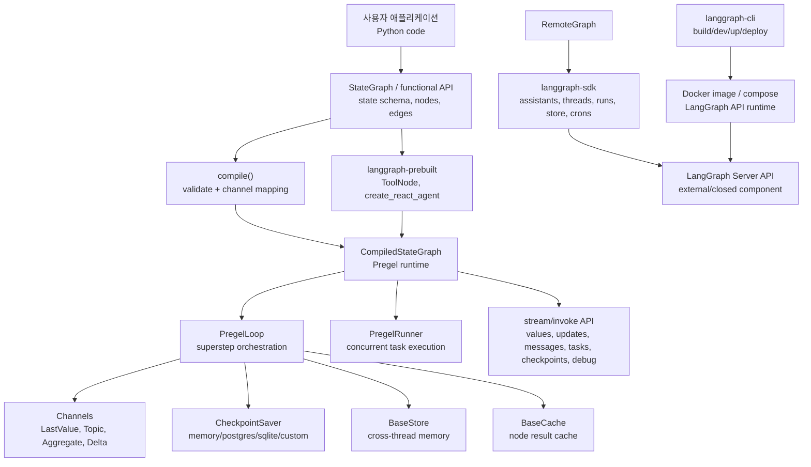
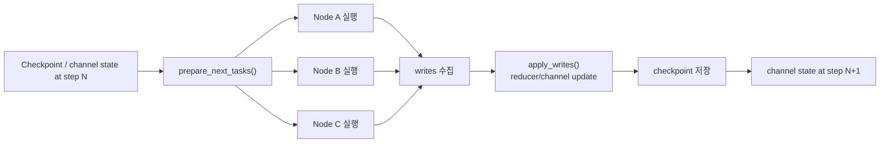
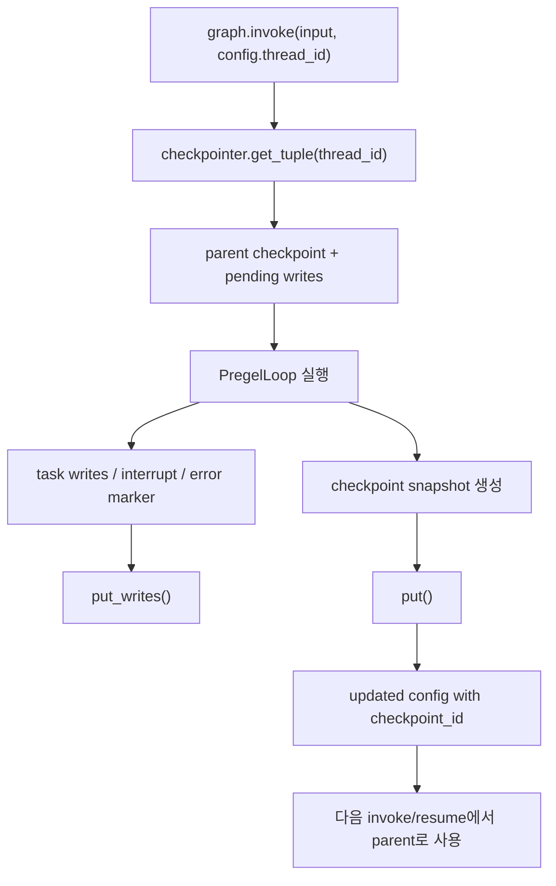
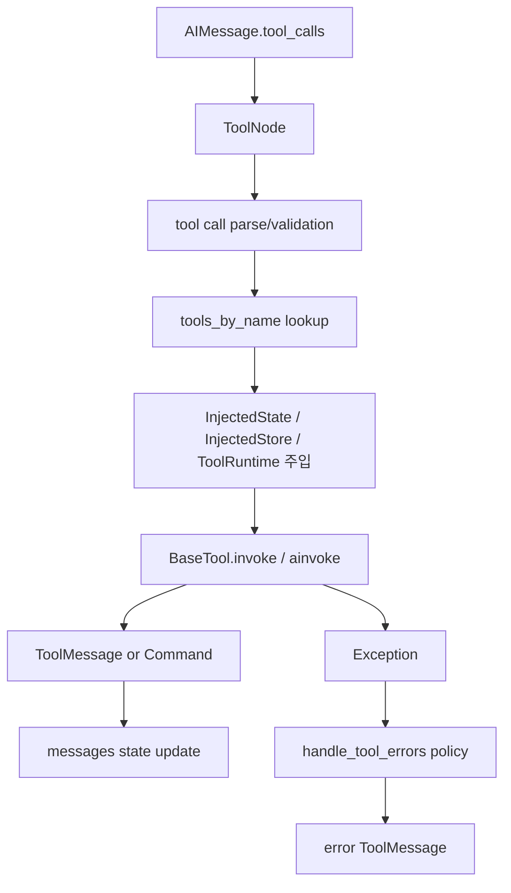
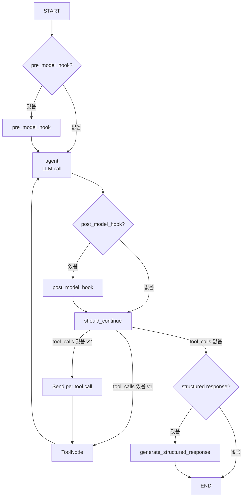
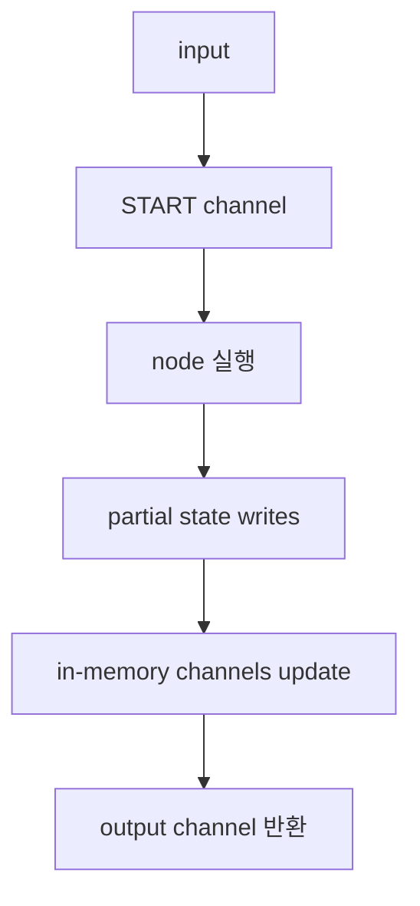
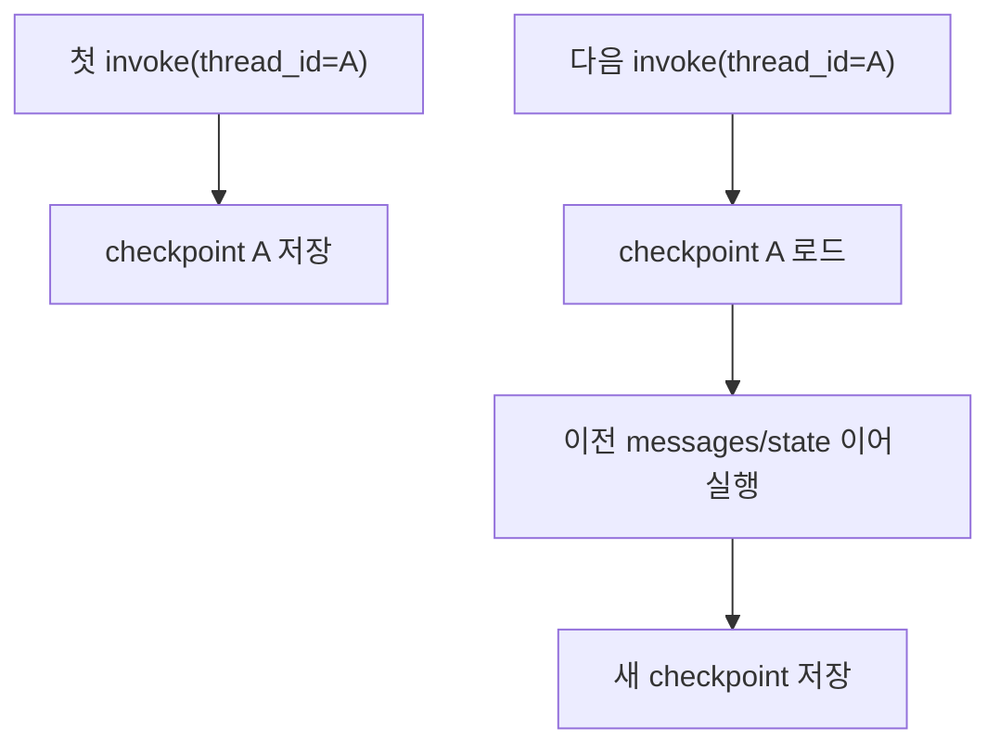
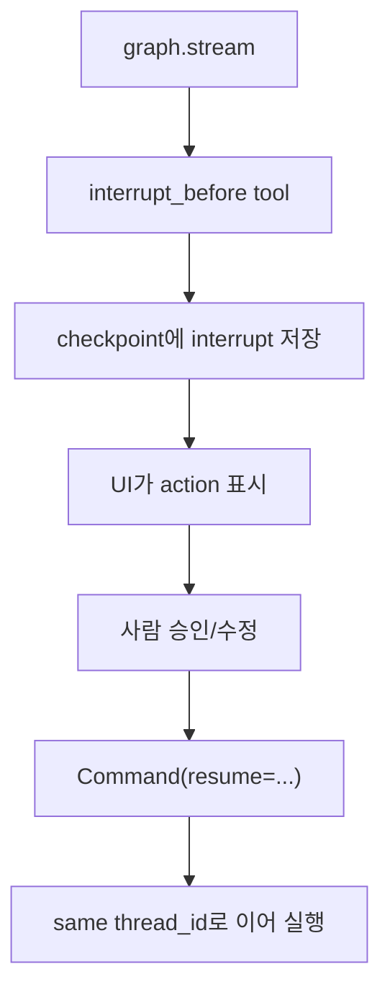
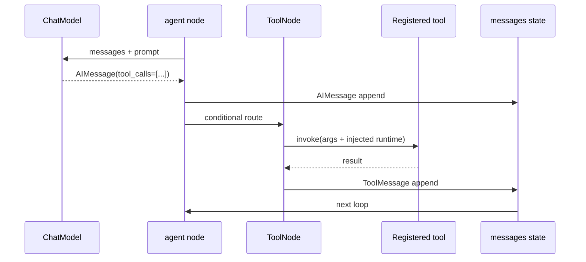
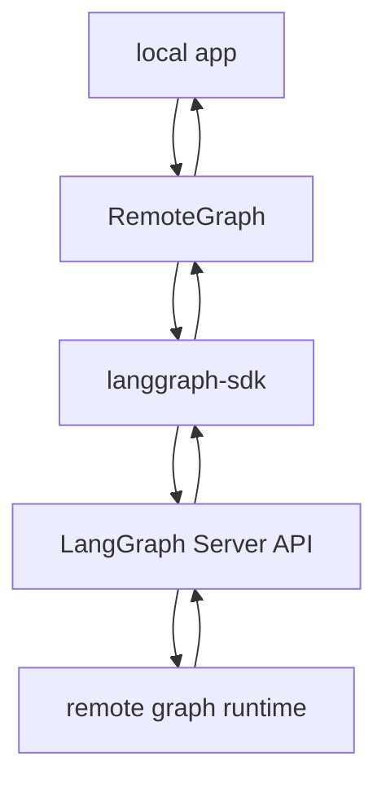

# langchain-ai/langgraph 분석 보고서

## 1. 요약 평가

LangGraph는 Claude Code, Codex, Gemini CLI처럼 완성된 코딩 에이전트 앱이 아니라, 그런 종류의 에이전트를 더 안정적으로 만들기 위한 저수준 orchestration framework다. 핵심 질문은 “LLM에게 어떤 명령을 줄 것인가”가 아니라 “LLM, tool, human approval, memory, retry, streaming, checkpoint, resume을 어떤 실행 모델 위에 올릴 것인가”이다.

이 저장소의 중심은 `StateGraph`와 Pregel 실행 엔진이다. 사용자는 상태 schema를 정의하고 node, edge, conditional edge를 추가한 뒤 `compile()`을 호출한다. 컴파일 결과는 `CompiledStateGraph`이며, 이 객체가 `invoke()`, `stream()`, `ainvoke()`, `astream()`, `get_state()`, `update_state()` 같은 실행 API를 제공한다. 내부 실행은 bulk synchronous parallel 모델이다. step N에서 node들이 읽는 channel 값은 step 시작 시점에 고정되고, node들이 만든 write는 step N+1로 넘어갈 때 적용된다.

가장 큰 강점은 durable execution이다. Checkpointer를 붙이면 그래프 상태, pending write, task result, interrupt, error marker가 `thread_id` 기준으로 저장된다. 이것 때문에 대화형 에이전트를 중간에서 멈추고, human-in-the-loop로 승인받고, 이후 같은 thread에서 이어 실행하거나 과거 state를 조회하는 패턴이 가능해진다.

두 번째 강점은 “에이전트 프레임워크를 그래프 런타임 위에 쌓는다”는 점이다. `libs/prebuilt`는 `ToolNode`, `create_react_agent`, `InjectedState`, `InjectedStore`, `ToolRuntime`, `ValidationNode`를 제공하지만, core는 특정 모델이나 provider에 종속되지 않는다. ReAct loop도 결국 StateGraph로 조립된다. 즉 prebuilt agent는 런타임의 한 사용 사례이지, LangGraph의 본질은 상태 그래프 실행 모델이다.

가장 중요한 차별점은 graph/pregel/checkpoint/store/sdk/cli가 분리되어 있다는 것이다. `libs/langgraph`는 실행 엔진, `libs/checkpoint`는 checkpoint와 store interface, `libs/checkpoint-postgres`와 `libs/checkpoint-sqlite`는 persistence backend, `libs/prebuilt`는 agent/tool 편의 계층, `libs/sdk-py`는 LangGraph Server API client, `libs/cli`는 Docker 기반 로컬/배포 툴을 담당한다. 이 구조 덕분에 로컬 Python workflow, LangGraph Server, LangSmith Deployment 같은 실행 형태가 같은 개념 모델을 공유한다.

위험도 이 설계에서 그대로 나온다. LangGraph는 sandbox가 아니다. user node와 tool은 일반 Python 코드로 실행된다. checkpoint DB가 오염되면 deserialization 위험이 생긴다. 기본 serializer는 `LANGGRAPH_STRICT_MSGPACK=true`를 켜지 않으면 더 permissive하게 동작하며, 소스 주석은 checkpoint DB에 공격자가 쓸 수 있으면 deserialization 시 code execution이 가능할 수 있다고 직접 경고한다. 또한 체크포인트와 store에는 agent conversation, tool result, state, metadata가 평문으로 저장될 수 있다. 운영자가 checkpointer, encryption, DB 권한, tool 권한, idempotency를 설계하지 않으면 durable execution은 안전장치가 아니라 장기 보존되는 공격 표면이 된다.

평가하면 LangGraph는 “AI 코딩 에이전트”라기보다 “AI 에이전트 OS의 실행 커널”에 가깝다. 완제품 사용성은 Codex/Gemini CLI/OpenHands 같은 도구에 비해 낮지만, 재시작 가능한 agent, 승인 지점, 장기 memory, multi-agent graph, remote deployment를 직접 설계하려는 개발자에게는 훨씬 강력한 하부 구조를 제공한다.

## 2. 기본 정보

- 저장소: `langchain-ai/langgraph`
- 분석 커밋: `d57a74f`
- 기본 브랜치: `main`
- 생성일: 2023-08-09
- 최근 push 관측값: 2026-06-09
- 최신 릴리스 관측값: `langgraph==1.2.4` / 2026-06-02
- 라이선스: MIT
- 주요 언어: Python
- GitHub 설명: `Build resilient agents.`
- GitHub 지표 관측값: star 34,351 / fork 5,771 / watcher 159
- 주요 topics: `agents`, `ai-agents`, `langchain`, `langgraph`, `llm`, `multiagent`, `openai`, `gemini`, `rag`, `pydantic`
- 핵심 패키지:
  - `langgraph`
  - `langgraph-checkpoint`
  - `langgraph-checkpoint-postgres`
  - `langgraph-checkpoint-sqlite`
  - `langgraph-prebuilt`
  - `langgraph-cli`
  - `langgraph-sdk`
- README 핵심 문장:
  - `Low-level orchestration framework for building stateful agents.`
  - durable execution
  - human-in-the-loop
  - comprehensive memory
  - debugging with LangSmith
  - production deployment via LangSmith / LangGraph Deployment
- 영감:
  - Pregel
  - Apache Beam
  - NetworkX 스타일 public interface

## 3. 저장소 구조

```text
langgraph/
  libs/
    langgraph/                 # core graph builder + Pregel runtime
    checkpoint/                # checkpoint/store/cache interfaces + memory impl + serde
    checkpoint-postgres/       # Postgres checkpointer/store/vector search
    checkpoint-sqlite/         # SQLite checkpointer/store/vector search/cache
    checkpoint-conformance/    # backend conformance tests
    prebuilt/                  # ToolNode, create_react_agent, injected args
    cli/                       # langgraph CLI, Docker build/dev/up/deploy support
    sdk-py/                    # Python SDK for LangGraph Server API
    sdk-js/                    # JS/TS SDK related source, threat model says JS source moved external
  examples/                    # multi-agent, plan-and-execute, reflection, RAG, web nav 등
  docs/
  .github/THREAT_MODEL.md
```

주요 파일은 다음과 같다.

- `libs/langgraph/langgraph/graph/state.py`
  - `StateGraph`
  - `CompiledStateGraph`
  - node/edge/conditional edge compile logic
- `libs/langgraph/langgraph/pregel/main.py`
  - `Pregel`
  - `invoke()`, `stream()`, `get_state()`, `update_state()`
- `libs/langgraph/langgraph/pregel/_loop.py`
  - `PregelLoop`
  - superstep 준비, checkpoint, interrupt, pending write 처리
- `libs/langgraph/langgraph/pregel/_runner.py`
  - `PregelRunner`
  - concurrent task 실행, commit, error handler routing
- `libs/langgraph/langgraph/channels/`
  - `LastValue`, `Topic`, `BinaryOperatorAggregate`, `EphemeralValue`, `Delta`, `NamedBarrierValue`
- `libs/checkpoint/langgraph/checkpoint/base/__init__.py`
  - `BaseCheckpointSaver`
- `libs/checkpoint/langgraph/checkpoint/serde/jsonplus.py`
  - `JsonPlusSerializer`
- `libs/checkpoint/langgraph/checkpoint/serde/encrypted.py`
  - `EncryptedSerializer`
- `libs/prebuilt/langgraph/prebuilt/tool_node.py`
  - `ToolNode`, `InjectedState`, `InjectedStore`, `ToolRuntime`
- `libs/prebuilt/langgraph/prebuilt/chat_agent_executor.py`
  - `create_react_agent`
- `libs/langgraph/langgraph/pregel/remote.py`
  - `RemoteGraph`
- `libs/sdk-py/langgraph_sdk/`
  - API client for assistants, threads, runs, crons, store
- `libs/cli/langgraph_cli/`
  - Docker/compose/build/dev/deploy tooling

## 4. 발전 과정과 설계 철학

LangGraph의 철학은 “agent를 chain으로만 표현하면 오래 실행되는 상태ful workflow를 다루기 어렵다”는 문제의식에서 출발한다. LangChain이 prompt/model/tool 호출을 쉽게 묶는 라이브러리라면, LangGraph는 그 호출들을 상태 그래프와 durable runtime으로 실행하는 계층이다.

설계 철학은 여섯 가지로 읽힌다.

1. Stateful agent first
   - 모든 node는 shared state를 읽고 partial update를 쓴다.
   - state key에는 reducer를 붙여 parallel branch의 write를 합칠 수 있다.
   - 대화 history, plan, tool result, intermediate decision을 state로 모델링한다.

2. Compile before execute
   - `StateGraph`는 builder다.
   - 직접 실행하지 못하고 반드시 `compile()`로 `CompiledStateGraph`를 만든다.
   - compile 시 schema, channels, nodes, edges, branches, interrupt point, checkpointer, store, cache가 Pregel runtime 형태로 변환된다.

3. Pregel-style deterministic steps
   - step N의 channel update는 step N+1에서 보인다.
   - 한 step 안에서 channel 값은 immutable하게 취급된다.
   - 이 모델은 병렬 node, retry, replay, checkpoint를 다루기 쉽게 만든다.

4. Durability is a runtime concern
   - durable execution은 각 user node가 알아서 파일을 저장하는 방식이 아니다.
   - Pregel loop가 checkpoint saver에 state와 pending writes를 저장한다.
   - `thread_id`가 logical run/conversation identity가 된다.

5. Human-in-the-loop is not an afterthought
   - `interrupt_before`, `interrupt_after`, `interrupt()` API, `Command(resume=...)`, `update_state()`가 core 개념이다.
   - 사람이 중간 state를 보고 수정하거나 승인한 뒤 이어 실행하는 흐름을 런타임에 포함한다.

6. Prebuilt agents are convenience, not the kernel
   - `create_react_agent()`는 LangGraph 위에 구현된 고수준 조립품이다.
   - `ToolNode`도 graph node일 뿐이다.
   - 사용자는 직접 StateGraph를 만들 수도 있고, prebuilt ReAct agent를 쓸 수도 있다.

## 5. 전체 아키텍처



이 구조에서 핵심 오픈소스 경계는 `CompiledStateGraph`까지다. LangGraph Server API와 LangSmith Deployment는 SDK/CLI가 연결하는 대상이지만, 서버 구현 전체는 이 레포에서 완전히 볼 수 없다. threat model도 `langgraph-api`, LangGraph Server, LangSmith, LangChain Core, user application code, LLM provider behavior를 out-of-scope로 둔다.

## 6. 사용자 플로우: 로컬 StateGraph

기본적인 사용자는 다음 흐름을 따른다.

```mermaid
sequenceDiagram
  participant U as 사용자 코드
  participant G as StateGraph
  participant C as CompiledStateGraph
  participant L as SyncPregelLoop
  participant R as PregelRunner
  participant N as Node 함수
  participant CP as Checkpointer

  U->>G: State schema 정의
  U->>G: add_node()
  U->>G: add_edge() / add_conditional_edges()
  U->>G: compile(checkpointer, store, interrupts)
  G->>C: Pregel nodes/channels/branches 생성
  U->>C: invoke(input, config, context)
  C->>L: loop 생성
  L->>CP: parent checkpoint 조회
  loop step마다 L->>R: 실행할 task 목록 전달
  R->>N: node.invoke(state, runtime)
  N-->>R: partial state update
  R->>L: writes commit
  L->>L: channel writes 적용
  L->>CP: checkpoint 저장
  L-->>C: stream chunk / final output
  C-->>U: result
```

소스 기준 상세 흐름은 다음과 같다.

1. 사용자가 `StateGraph(state_schema=...)`를 만든다.
2. `add_node()`가 node 이름, callable/runnable, input schema, retry/cache/timeout/error handler metadata를 등록한다.
3. `add_edge()`와 `add_conditional_edges()`가 graph topology를 만든다.
4. `compile()`이 실행된다.
5. `compile()`은 `ensure_valid_checkpointer()`를 거치고, strict msgpack 모드가 켜져 있으면 schema와 channel 기반 serde allowlist를 구성한다.
6. `validate()`가 graph 구조와 interrupt target을 검증한다.
7. output channel과 stream channel을 계산한다.
8. default retry/cache/timeout/error handler를 node spec에 적용한다.
9. `CompiledStateGraph`를 생성한다.
10. `attach_node(START, None)`와 각 user node `attach_node()`가 Pregel node로 변환된다.
11. edge, waiting edge, branch가 compiled graph에 attach된다.
12. 사용자가 `invoke()`나 `stream()`을 호출한다.
13. `invoke()`는 내부적으로 `stream()`을 소비해서 마지막 값을 반환한다.
14. `stream()`은 config/context/store/cache/checkpointer/durability/interrupt 옵션을 정리한다.
15. `SyncPregelLoop`가 생성되고, `PregelRunner`가 task를 실행한다.
16. loop가 끝나면 output channel 값이 최종 결과가 된다.

## 7. StateGraph builder의 내부 모델

`StateGraph` docstring은 이 클래스의 본질을 정확히 설명한다. node signature는 `State -> Partial<State>`다. 각 state key는 reducer를 가질 수 있고, reducer signature는 `(Value, Value) -> Value`다.

중요한 점은 `StateGraph`가 실행 객체가 아니라 builder라는 것이다. docstring도 `StateGraph is a builder class and cannot be used directly for execution`이라고 명시한다. 이것은 위험과 안정성 양쪽에서 중요하다.

- 실행 전 검증이 가능하다.
- schema 기반 channel 계산이 가능하다.
- compiled graph와 builder graph를 분리할 수 있다.
- 실행 중 graph topology가 임의로 변하지 않는다.

`compile()`이 만드는 `CompiledStateGraph`는 `Pregel`을 상속한다. 따라서 LangGraph에서 “graph 실행”은 사실상 Pregel runtime 실행이다.

## 8. Pregel 실행 모델

LangGraph의 가장 중요한 실행 주석은 `pregel/main.py`의 `stream()` 내부에 있다.

```text
Computation proceeds in steps.
Channel updates from step N are only visible in step N+1.
Channels are guaranteed to be immutable for the duration of the step.
```

이를 실제 흐름으로 풀면 다음과 같다.



`PregelLoop.tick()`은 다음을 수행한다.

- recursion limit 확인
- `prepare_next_tasks()`로 다음 step task 계산
- checkpoint/debug event 출력
- task가 없으면 `done`
- drain 요청이 있으면 `draining`
- 이전 pending writes 재적용
- error handler resume 처리
- `interrupt_before` 조건 확인
- task debug event 출력
- cached writes 출력

`PregelRunner.tick()`은 다음을 담당한다.

- task를 concurrent future로 실행
- 단일 task fast path 처리
- retry policy 적용
- `_call`을 통해 node 내부에서 동적 task scheduling 가능
- output을 caller에게 yield할 수 있도록 control 반환
- task failure 시 다른 task 취소 여부 판단
- graph-level error handler가 있으면 handler task로 route

`PregelRunner.commit()`은 다음을 저장한다.

- 정상 완료: task writes 또는 `NO_WRITES`
- `GraphInterrupt`: interrupt write와 resume write
- 일반 exception: `ERROR`
- error handler 대상 exception: `ERROR_SOURCE_NODE`
- cancelled task: `ERROR`

이 구조 때문에 LangGraph는 단순 “함수들을 순서대로 호출”하는 라이브러리가 아니다. execution loop, channel, checkpoint, pending writes, interrupt, retry, error routing을 가진 작은 workflow runtime이다.

## 9. Channel과 state merge

StateGraph는 shared state처럼 보이지만 내부적으로는 channel 집합이다.

주요 channel 개념은 다음과 같다.

- `LastValue`
  - 일반적인 state key처럼 마지막 write가 값이 된다.
- `BinaryOperatorAggregate`
  - reducer가 붙은 state key에 사용된다.
  - parallel branch의 여러 update를 지정된 binary operator로 합친다.
- `Topic`
  - 여러 값을 topic처럼 축적하거나 publish/subscribe 형태로 다룰 수 있다.
- `EphemeralValue`
  - START input처럼 step 경계에서만 의미 있는 값을 표현한다.
- `Delta`
  - delta write를 snapshot과 분리해 다루기 위한 channel 계층이다.
- `NamedBarrierValue`
  - 특정 set of names가 모두 도착해야 다음 흐름을 열 수 있는 barrier 성격을 가진다.
- `UntrackedValue`
  - tracking/checkpoint 관점에서 일반 state와 다르게 취급되는 값이다.

State schema의 reducer annotation은 이 channel 선택에 직접 영향을 준다. 예를 들어 message history를 list append reducer로 만들면 parallel tool result를 누적할 수 있지만, reducer를 잘못 설계하면 순서, 중복, 재시도 시 의미가 꼬인다. LangGraph는 reducer 실행 모델을 제공하지만, reducer의 business semantics는 사용자 책임이다.

## 10. Checkpoint와 durable execution

`BaseCheckpointSaver`는 다음 API를 강제한다.

- `get_tuple(config)`
- `list(config, filter, before, limit)`
- `put(config, checkpoint, metadata, new_versions)`
- `put_writes(config, writes, task_id, task_path)`
- `delete_thread(thread_id)`
- async variant들

docstring은 checkpointer를 쓰는 경우 `thread_id`를 config에 전달해야 한다고 명시한다.

```python
config = {"configurable": {"thread_id": "my-thread"}}
graph.invoke(inputs, config)
```

`thread_id`는 독립 실행, conversation memory, interrupt resume, time-travel debugging의 기준 키다.



Durability mode는 `stream()`의 `durability` 인자로 조정된다.

- `sync`
  - 다음 step으로 넘어가기 전에 checkpoint 저장 완료를 기다린다.
- `async`
  - 다음 step 실행과 checkpoint 저장을 겹친다.
- `exit`
  - 실행 종료 시점에 저장한다.

성능과 안정성의 tradeoff가 분명하다. `sync`는 느리지만 crash window가 작다. `async`는 빠르지만 아주 짧은 window에서 durable write가 늦을 수 있다. `exit`은 workflow 중간 crash에 가장 취약하다.

## 11. Serializer와 암호화

기본 checkpoint serializer는 `JsonPlusSerializer`다. 이 serializer는 `ormsgpack`을 주로 쓰고, 옵션에 따라 JSON/pickle fallback도 다룬다.

가장 중요한 소스 주석은 `checkpoint/serde/jsonplus.py`와 `_msgpack.py`에 있다.

- `JsonPlusSerializer`는 checkpoint saver 내부에서 사용할 것을 전제로 한다.
- untrusted Python object에 쓰면 안 된다고 경고한다.
- 공격자가 checkpoint DB에 직접 쓸 수 있다면 deserialization 시 code execution이 가능할 수 있다고 경고한다.
- `LANGGRAPH_STRICT_MSGPACK=true`를 켜면 allowlist 기반 deserialization으로 제한한다.
- strict가 꺼져 있으면 기본은 더 permissive하다.
- `_msgpack.py`도 strict를 끄면 checkpoint data에 저장된 Python callable이 load 때 import/execute될 수 있다고 설명한다.

암호화 계층은 `EncryptedSerializer`가 담당한다.

- `dumps_typed()`에서 inner serializer로 serialize한 뒤 cipher로 encrypt한다.
- type string은 `typ+ciphername` 형태가 된다.
- `loads_typed()`는 `+`가 없으면 unencrypted data로 보고 inner serializer에 위임한다.
- `from_pycryptodome_aes()`는 `LANGGRAPH_AES_KEY` 또는 직접 key를 사용한다.
- AES default mode는 EAX다.

여기서 중요한 operational point는 암호화가 기본이 아니라는 것이다. Checkpoint DB를 운영 환경에 붙이면 대화, tool output, intermediate reasoning에 해당할 수 있는 state가 평문으로 저장될 수 있다. 또한 `EncryptedSerializer`는 기존 unencrypted payload도 읽을 수 있어 migration에는 편하지만, “모든 저장 데이터가 반드시 encrypted”라는 enforcement layer로 오해하면 안 된다.

## 12. Store와 memory

LangGraph는 checkpoint와 별도로 `BaseStore`를 제공한다.

- checkpoint
  - 특정 thread/run의 execution snapshot
  - resume/replay/debug를 위한 short-term durable state
- store
  - thread를 넘어 공유할 수 있는 key-value memory
  - semantic search/vector search backend와 결합 가능

Postgres와 SQLite 패키지는 checkpoint뿐 아니라 store 구현도 포함한다.

- `libs/checkpoint-postgres/langgraph/checkpoint/postgres/`
- `libs/checkpoint-postgres/langgraph/store/postgres/`
- `libs/checkpoint-sqlite/langgraph/checkpoint/sqlite/`
- `libs/checkpoint-sqlite/langgraph/store/sqlite/`
- `libs/checkpoint-sqlite/langgraph/cache/sqlite/`

이 분리는 agent memory 설계에서 중요하다. conversation resume에 필요한 state와 장기 사용자 memory를 같은 테이블/같은 retention policy로 다루면 보안과 개인정보 관리가 어려워진다.

## 13. Human-in-the-loop

LangGraph의 human-in-the-loop는 외부 UI 기능이 아니라 runtime primitive다.

주요 API와 개념은 다음과 같다.

- `interrupt_before`
  - 특정 node 실행 직전에 멈춘다.
- `interrupt_after`
  - 특정 node 실행 직후 멈춘다.
- `interrupt(value)`
  - node 내부에서 동적으로 interrupt를 발생시킨다.
- `Command`
  - resume, update, goto 같은 control을 표현한다.
- `get_state()`
  - 현재 thread/checkpoint state 조회
- `update_state()`
  - 사람이 state를 수정한 뒤 이어 실행하는 흐름

흐름은 다음과 같다.

```mermaid
sequenceDiagram
  participant App as 사용자 앱/UI
  participant Graph as CompiledStateGraph
  participant Loop as PregelLoop
  participant CP as Checkpointer
  participant Human as 사람

  App->>Graph: stream(input, interrupt_before=["tool"])
  Graph->>Loop: step 실행
  Loop->>CP: interrupt state 저장
  Loop-->>App: interrupt event
  App->>Human: 현재 state와 pending action 표시
  Human-->>App: 승인/수정/거절
  App->>Graph: update_state() 또는 Command(resume=...)
  Graph->>CP: 수정 state 저장
  App->>Graph: invoke(None, same thread_id)
  Graph->>Loop: checkpoint에서 이어 실행
```

이 기능은 강력하지만 위험한 면도 있다. `update_state()`는 실행 경로 자체를 바꿀 수 있다. 운영 시스템에서는 누가 언제 어떤 state를 수정했는지 audit log가 필요하다. 특히 tool approval, payment action, file write, infrastructure operation 같은 high-impact node 앞뒤에 interrupt를 둘 때는 state 수정 권한을 모델 호출 권한과 분리해야 한다.

## 14. Prebuilt: ToolNode

`ToolNode`는 LangChain tool call을 LangGraph node로 실행하는 편의 계층이다.

중요한 구성 요소는 다음과 같다.

- `_tools_by_name`
  - tool name에서 `BaseTool`로 가는 registry
- `_func()` / `_afunc()`
  - sync/async tool call 실행
- `handle_tool_errors`
  - tool exception을 ToolMessage로 변환할지, exception으로 올릴지 결정
- `InjectedState`
  - tool schema에는 숨기고 graph state 일부를 tool 인자로 주입
- `InjectedStore`
  - persistent store를 tool에 주입
- `ToolRuntime`
  - state, context, store, stream writer, config, tool_call_id, available tools를 묶은 runtime object

ToolNode 흐름은 다음과 같다.



중요한 보안 설계는 injected argument가 tool schema에서 빠진다는 점이다. LLM은 `InjectedState`나 `InjectedStore` 인자를 직접 채우지 못하고, ToolNode가 runtime에서 주입한다. threat model도 LLM 값보다 injected merge order가 우선해 hidden injected param을 덮어쓴다고 설명한다.

하지만 이것이 tool 자체를 안전하게 만들지는 않는다. ToolNode는 tool 실행기를 제공할 뿐 sandbox가 아니다. 등록된 tool이 파일 시스템, 네트워크, shell, DB, secret store에 접근한다면 그 권한은 그대로 실행된다.

## 15. Prebuilt: create_react_agent

`create_react_agent()`는 LangGraph 위에 ReAct style agent graph를 조립한다.

핵심 흐름은 README 수준의 “agent가 tool을 호출한다”보다 더 구조적이다.

1. model 인자를 해석한다.
   - string이면 `langchain.chat_models.init_chat_model()`로 초기화한다.
   - callable이면 runtime state/context에 따라 dynamic model을 선택할 수 있다.
   - RunnableBinding이면 bound tools를 검사한다.
2. tools 인자를 ToolNode로 변환한다.
3. state schema를 검사한다.
   - 기본 `AgentState`는 `messages`를 포함한다.
   - structured response를 쓰면 `structured_response` key가 필요하다.
4. `call_model` node를 만든다.
5. `pre_model_hook`이 있으면 agent 앞에 붙인다.
6. `post_model_hook`이 있으면 agent 뒤에 붙인다.
7. `should_continue` conditional edge가 AIMessage의 `tool_calls` 존재 여부를 보고 다음 node를 결정한다.
8. tool call이 있으면 `tools` node로 간다.
9. tool result가 message state에 들어가면 다시 `agent` node로 간다.
10. tool call이 없으면 `END` 또는 structured response node로 간다.



`version="v1"`과 `version="v2"` 차이는 tool call routing 방식에 영향을 준다. v2는 `Send`를 활용해 tool call을 더 병렬적인 방식으로 분배할 수 있다. 이 또한 Pregel 모델 위에서 자연스럽게 동작한다.

## 16. RemoteGraph, SDK, Server 경계

`RemoteGraph`는 LangGraph Server API를 local graph처럼 호출하기 위한 client wrapper다.

주요 특징은 다음과 같다.

- `assistant_id`가 remote graph identifier다.
- `url`, `api_key`, `headers`로 sync/async SDK client를 만든다.
- `invoke()`, `stream()`, `get_state()`, `update_state()`, `get_state_history()` 같은 local graph 유사 API를 제공한다.
- 다른 LangGraph node 안에 RemoteGraph를 subgraph처럼 넣을 수 있다.
- config sanitization은 primitive/dict/list 중심으로 제한한다.
- distributed tracing을 켤 수 있다.

Python SDK는 다음 API domain을 가진다.

- assistants
- threads
- runs
- crons
- store

SDK client는 API key를 다음 우선순위로 가져온다.

1. 명시적 `api_key`
2. `LANGGRAPH_API_KEY`
3. `LANGSMITH_API_KEY`
4. `LANGCHAIN_API_KEY`

`x-api-key`는 reserved header로 취급되어 custom header에서 직접 지정할 수 없다. SDK는 reconnect/streaming에 SSE를 사용하며, 최신 코드에는 reconnect `Location` header에 대해 same-origin 검증이 있다. `_validate_reconnect_location()`은 scheme, host, port가 base URL과 다르면 `ValueError`를 던진다. 이 완화는 중요하다. API key를 가진 client가 서버가 준 임의 외부 Location으로 reconnect하면 credential leak이 될 수 있기 때문이다.

다만 LangGraph Server 자체는 이 저장소에서 완전히 볼 수 없다. CLI의 optional dependency에도 `langgraph-api`가 등장하지만, 서버 구현은 별도/외부 컴포넌트다. 따라서 SDK/RemoteGraph 분석은 client-side boundary까지가 확실한 범위다.

## 17. CLI와 배포 흐름

`langgraph-cli`는 `langgraph.json`을 읽어 Docker image, docker-compose, dev server, deployment package를 만든다.

주요 명령 계열은 다음과 같다.

- `langgraph up`
  - Docker Compose 기반 로컬 실행
- `langgraph build`
  - Docker image build
- `langgraph dockerfile`
  - Dockerfile과 optional compose/env/dockerignore 생성
- `langgraph dev`
  - local dev runtime 실행
- deploy 관련 command
  - LangSmith/LangGraph deployment와 연결

CLI config에는 다음과 같은 권한성 필드가 있다.

- `graphs`
  - graph import path
- `dependencies`
  - PyPI/local/git dependency
- `dockerfile_lines`
  - base Dockerfile 뒤에 붙일 임의 Docker instruction
- `pip_config_file`
  - private index/credential이 들어갈 수 있음
- `env`
  - environment file 또는 env mapping
- `webhooks`
  - URL policy와 header template
- `node_version`, `python_version`, `image_distro`, `base_image`

Webhook config에는 SSRF와 secret leak을 줄이기 위한 정책 필드가 있다.

- `require_https`
- `allowed_domains`
- `allowed_ports`
- `max_url_length`
- `disable_loopback`
- `env_prefix`

CLI는 Docker subprocess를 list argument로 호출한다. 예를 들어 build는 stdin Dockerfile을 `docker build -f - -t tag context` 형태로 전달한다. shell string interpolation보다 낫지만, Docker daemon 자체는 높은 권한의 boundary다. `dockerfile_lines`, dependency install, local build context, `.dockerignore`가 잘못 구성되면 secret이나 대용량 data가 image/build context에 들어갈 수 있다.

## 18. 실제 실행 케이스별 동작 정리

### 케이스 A: checkpointer 없는 단발 실행



- 가장 단순한 로컬 실행이다.
- `thread_id`가 없어도 된다.
- interrupt/resume/time-travel은 제한적이다.
- crash가 나면 중간 state는 복구되지 않는다.

### 케이스 B: checkpointer 있는 conversation



- 같은 `thread_id`를 재사용하면 state가 누적된다.
- conversation memory는 state schema와 reducer 설계에 따라 달라진다.
- DB retention/encryption을 고려해야 한다.

### 케이스 C: interrupt 후 승인



- tool execution 전 승인에 적합하다.
- 승인 UI는 오픈소스 core 밖의 애플리케이션 책임이다.
- 승인자가 state를 바꿀 수 있다면 audit가 필요하다.

### 케이스 D: ToolNode 기반 ReAct agent



- LLM이 tool call JSON을 만든다.
- ToolNode가 tool name registry에서 tool을 찾는다.
- injected state/store/runtime은 ToolNode가 넣는다.
- tool result는 message state에 들어간다.
- 모델이 더 이상 tool call을 내지 않으면 종료한다.

### 케이스 E: RemoteGraph 호출



- local graph와 비슷한 API로 remote graph를 호출한다.
- network, auth, tracing, server-side state가 추가된다.
- LangGraph Server 구현은 이 레포의 분석 범위 밖이다.

## 19. 차별점

LangGraph의 차별점은 다음이다.

1. Pregel 기반 superstep model
   - parallel node와 state merge를 runtime model로 다룬다.
   - graph execution이 단순 callback chain보다 예측 가능하다.

2. Checkpoint-first runtime
   - interrupt, resume, replay, time-travel debugging이 core API와 연결된다.
   - long-running agent에 필요한 durable semantics를 직접 제공한다.

3. Human-in-the-loop primitive
   - 승인과 state 수정이 외부 hack이 아니라 runtime concept다.

4. Tool execution을 graph node로 통합
   - ReAct loop가 graph topology로 표현된다.
   - tool call parallelization과 injected state/store가 runtime과 연결된다.

5. Local/remote abstraction
   - local `CompiledStateGraph`와 remote `RemoteGraph`가 유사 API를 제공한다.
   - 배포/SDK/CLI가 같은 thread/run/store 개념을 공유한다.

6. Storage backend 분리
   - memory, Postgres, SQLite, custom saver를 interface 뒤에 둔다.
   - production persistence를 애플리케이션 요구에 맞게 선택할 수 있다.

## 20. 숨겨져 있거나 보이지 않는 영역

소스에서 확인되는 “보이는 경계”와 “보이지 않는 경계”는 다음과 같다.

- LangGraph Server / `langgraph-api`
  - CLI와 SDK가 호출하지만 서버 구현 전체는 이 레포에서 볼 수 없다.
  - auth, multi-tenancy, deployment isolation, server-side scheduler는 외부 분석이 필요하다.
- LangSmith / LangSmith Deployment
  - README와 RemoteGraph가 연결점을 제공하지만, 이 저장소의 core는 LangSmith service 구현을 포함하지 않는다.
- LangChain Core
  - `Runnable`, `BaseChatModel`, messages, tools, callbacks는 `langchain-core` dependency다.
  - LangGraph가 많이 의존하지만 해당 구현은 별도 패키지다.
- LLM provider behavior
  - OpenAI/Gemini/Anthropic 등 모델의 tool call 품질, streaming event shape, prompt injection 방어는 LangGraph core가 책임지지 않는다.
- User tool/user node code
  - 실제 파일 삭제, shell 실행, DB 쓰기 같은 위험 동작은 사용자 tool code에 있다.
- JS/TS implementation
  - README는 JS/TS equivalent를 별도 repo로 안내한다.
  - threat model도 sdk-js source가 외부로 이동했다고 표시한다.

## 21. 위험 요소와 이상한 점

### 21.1 Sandbox가 아니다

LangGraph node와 tool은 일반 Python code다. 이 프레임워크는 tool 실행 순서, state merge, checkpoint, interrupt를 제공하지만 OS sandbox를 제공하지 않는다. Shell/tool 권한 제한, network egress 제한, file path allowlist, secret masking은 애플리케이션이 별도로 설계해야 한다.

### 21.2 Checkpoint deserialization 위험

가장 중요한 보안 이슈다. `JsonPlusSerializer`와 `_msgpack.py` 주석은 untrusted checkpoint data를 deserialize하면 code execution 위험이 있다고 경고한다. 특히 checkpoint DB에 공격자가 쓰기 권한을 얻으면 graph resume 시점이 실행 트리거가 될 수 있다.

완화책:

- checkpoint DB write 권한을 최소화한다.
- `LANGGRAPH_STRICT_MSGPACK=true`를 운영 기본값으로 검토한다.
- 필요 type만 allowlist한다.
- DB를 multi-tenant로 쓸 때 tenant isolation을 강하게 둔다.
- serializer migration 때 pickle fallback을 쉽게 켜지 않는다.

### 21.3 Checkpoint와 store의 개인정보/기밀 장기 보존

Agent state에는 사용자의 입력, 대화 history, tool output, API response, internal plan, file content, retrieval result가 들어갈 수 있다. 기본 저장은 암호화가 아니다. `EncryptedSerializer`가 있지만 명시적으로 붙여야 한다.

위험은 다음과 같다.

- DB backup에 민감 정보가 남음
- `thread_id` 재사용으로 예상보다 긴 memory 보존
- vector store/search index에 개인정보 embedding 저장
- debug/checkpoint stream에서 state가 외부 observability로 나감

### 21.4 Durable execution이 exactly-once를 보장하지 않는다

LangGraph는 task writes와 checkpoint를 추적하지만, user node 안에서 이미 실행된 외부 side effect까지 자동 rollback하지 않는다. 예를 들어 node가 결제 API를 호출하고 실패한 뒤 retry/resume되면 중복 side effect가 날 수 있다.

운영 패턴:

- 외부 side effect 전후로 idempotency key를 사용한다.
- 결제/메일/삭제/배포 같은 node 앞에 interrupt를 둔다.
- side effect 결과를 checkpoint에 쓰는 순서를 설계한다.
- retry policy는 idempotent node에만 쉽게 적용한다.

### 21.5 ToolNode는 LLM-generated action을 실행한다

ToolNode는 tool call schema와 injected args를 잘 다루지만, tool call의 의도는 LLM output이다. Prompt injection으로 tool call이 왜곡될 수 있다. ToolNode의 error handling이 exception을 ToolMessage로 바꾸면 모델이 실패 원인을 보고 다음 tool call을 시도할 수 있는데, 이것이 유용하면서도 공격 surface가 된다.

### 21.6 Human state update 권한

`update_state()`와 resume은 강력하다. 승인 UI에서 사람이 state를 바꾸는 것은 workflow를 바꾸는 것이다. 내부 운영자나 compromised UI가 state를 조작하면 모델이 하지 않은 결정을 graph가 한 것처럼 진행할 수 있다.

필요한 통제:

- state update audit log
- 승인자 identity
- field-level permission
- high-impact node 전후 immutable decision record

### 21.7 RemoteGraph/SDK credential boundary

SDK는 API key를 환경변수에서 자동으로 찾는다. 편하지만, local dev와 production 환경에서 원치 않는 key가 선택될 수 있다. 최신 reconnect 구현에는 same-origin 검증이 있어 Location 기반 credential leak을 줄였지만, remote endpoint를 신뢰해야 한다는 사실은 그대로다.

### 21.8 CLI Docker boundary

`langgraph-cli`는 Docker build/dev/deploy를 실행한다. Docker daemon 접근은 강한 권한이다. `dockerfile_lines`, custom install/build command, dependency, build context, `.dockerignore` 설정이 security posture에 직접 영향을 준다.

주의할 점:

- `.env`, private key, model weight, data dump가 build context에 들어가지 않게 한다.
- `dockerfile_lines`를 사용자 입력으로 받지 않는다.
- private package index credential이 image layer에 남지 않게 한다.
- webhook env template의 `env_prefix`를 좁게 둔다.

### 21.9 Closed/external component 의존성

LangGraph의 deployment story는 오픈소스 core만으로 끝나지 않는다. LangGraph Server, LangSmith, `langgraph-api`는 외부/별도 컴포넌트다. 오픈소스만 분석하면 server-side auth, tenant isolation, scheduler, background run semantics 전체를 확정할 수 없다.

### 21.10 복잡한 version surface

Monorepo에 core, checkpoint, prebuilt, cli, sdk-py, sdk-js 관련 코드가 함께 있고, 각 패키지 version이 따로 간다. 예를 들어 core `langgraph`는 1.2.4, checkpoint는 4.1.1, postgres/sqlite checkpointer는 3.1.0, prebuilt는 1.1.0 계열이다. 배포 시 dependency resolver가 섞이면 subtle mismatch가 생길 수 있다.

## 22. 코드 실행 검증

분석 환경에서 다음을 확인했다.

- `git log --oneline -5`
  - `d57a74f fix: updateState bug for deltaChannel on empty thread (#8011)`
- 주요 파일 문법 검증:
  - `python3 -m py_compile` 성공
  - 검증 대상:
    - `libs/langgraph/langgraph/graph/state.py`
    - `libs/langgraph/langgraph/pregel/main.py`
    - `libs/langgraph/langgraph/pregel/_loop.py`
    - `libs/langgraph/langgraph/pregel/_runner.py`
    - `libs/prebuilt/langgraph/prebuilt/tool_node.py`
    - `libs/prebuilt/langgraph/prebuilt/chat_agent_executor.py`
    - `libs/checkpoint/langgraph/checkpoint/base/__init__.py`
    - `libs/checkpoint/langgraph/checkpoint/serde/jsonplus.py`
    - `libs/sdk-py/langgraph_sdk/client.py`
    - `libs/cli/langgraph_cli/cli.py`
- 간단한 `StateGraph` invoke 실행 시도:
  - 실패
  - 원인: 현재 시스템 Python에 `typing_extensions`, `langchain_core`, `pydantic`, `ormsgpack` 등 runtime dependency가 설치되어 있지 않음
  - 소스 checkout 자체 문제라기보다 의존성 미설치 문제로 판단

파일 규모 관측:

- `state.py`: 1,964 lines
- `pregel/main.py`: 4,379 lines
- `tool_node.py`: 2,030 lines
- `chat_agent_executor.py`: 1,015 lines
- `jsonplus.py`: 883 lines
- `.github/THREAT_MODEL.md`: 479 lines

## 23. 평가

LangGraph는 “에이전트를 어떻게 더 오래, 더 안전하게, 더 관찰 가능하게 실행할 것인가”에 대한 매우 실용적인 답을 제공한다. LLM tool calling만으로는 부족한 checkpoint, interrupt, replay, streaming, state update, parallel branch merge, remote run 개념을 하나의 runtime으로 묶는다.

특히 다음 상황에 강하다.

- 긴 대화/긴 workflow를 중간에 멈추고 이어야 할 때
- tool approval과 human correction이 필요한 agent
- multi-agent 또는 branch/merge 구조가 필요한 agent
- production에서 실행 history와 state inspection이 필요한 agent
- local prototype을 remote server/deployment로 옮기려는 경우

반대로 다음 기대에는 맞지 않는다.

- 바로 쓸 수 있는 터미널 코딩 에이전트
- OS sandbox 포함 agent runtime
- provider-agnostic prompt injection 방어 완성품
- server-side multi-tenant security까지 포함한 완전한 플랫폼
- no-code agent builder

핵심 결론은 이렇다. LangGraph를 쓰면 agent의 제어 흐름과 상태를 명시적으로 설계할 수 있다. 하지만 그만큼 사용자 node/tool의 권한, checkpoint DB 신뢰성, encryption, side effect idempotency, approval audit를 직접 책임져야 한다. 제대로 설계하면 매우 강력한 agent runtime이 되고, 대충 붙이면 “LLM이 만든 위험한 tool call을 오래 저장하고 재시도하는 시스템”이 될 수 있다.
