# microsoft/autogen 심층 분석 보고서

분석 기준일: 2026-06-10  
분석 대상 커밋: `027ecf0`  
로컬 소스: `sources/microsoft__autogen`  
공식 저장소: https://github.com/microsoft/autogen

## 1. 요약 판단

`microsoft/autogen`은 AI 코딩 에이전트라기보다, 여러 에이전트를 이벤트/메시지 기반으로 조립하고 도구, 모델, 코드 실행기, 웹/파일 브라우징 에이전트, Studio UI까지 얹을 수 있는 대형 멀티 에이전트 프레임워크다. 2023년 Microsoft Research발 실험적 프레임워크로 급성장했고, 2026년 6월 현재 README는 명확하게 **maintenance mode**를 선언한다. 신규 프로젝트는 `Microsoft Agent Framework`로 시작하라고 안내하며, AutoGen은 기존 사용자와 생태계 호환을 위한 유지보수 레포 성격이 강하다.

핵심 철학은 다음 네 가지다.

- **계층화**: 저수준 메시지 런타임인 `autogen-core`, 사용자가 빨리 쓸 수 있는 `autogen-agentchat`, 모델/도구/실행기/브라우저 확장인 `autogen-ext`, GUI인 `autogen-studio`, 벤치마크인 `agbench`가 분리되어 있다.
- **상태 있는 에이전트**: `AssistantAgent`와 Team은 내부 컨텍스트를 유지한다. 호출자는 매번 전체 대화가 아니라 새 메시지만 전달해야 한다.
- **도구 실행을 모델 루프의 기본 시민으로 취급**: 모델이 tool call을 만들면 `Tool` 또는 `Workbench`가 즉시 실행되고, 필요하면 다시 모델 호출을 수행한다.
- **프레임워크 우선, 제품은 예제/도구**: Studio는 README에서도 production-ready가 아니라고 못박고, Magentic-One은 위험 경고와 격리 실행 권고를 코드 문서에 포함한다.

총평: 아키텍처 학습 자료로는 매우 가치가 높다. 특히 메시지 런타임, Topic, AgentRuntime, Team/Manager/Container 매핑, MCP Workbench, Docker/Local code executor는 현재 에이전트 프레임워크들이 공유하는 핵심 패턴을 잘 보여준다. 다만 신규 채택 대상으로는 maintenance mode, Studio와 핵심 패키지 버전 축 차이, `FunctionTool` config 로딩의 `exec`, 로컬 코드 실행기, MCP stdio 실행, Studio 인증/운영 경계 때문에 보수적으로 접근해야 한다.

## 2. 저장소 상태와 표면

GitHub 메타데이터:

| 항목 | 값 |
|---|---|
| 생성 | 2023-08-18 |
| 기본 브랜치 | `main` |
| 최신 릴리스 | `python-v0.7.5`, 2025-09-30 |
| Stars / Forks | 약 58,839 / 8,877 |
| 주 언어 | Python |
| GitHub license 표시 | CC-BY-4.0 |
| 코드 라이선스 | `LICENSE-CODE`에 MIT |
| 로컬 파일 수 | 1,837 |

주요 파일 분포:

| 확장자 | 수량 | 의미 |
|---|---:|---|
| `.py` | 546 | Python 프레임워크, Studio, Bench, CLI |
| `.cs` | 497 | .NET AutoGen 및 Microsoft.AutoGen 런타임 |
| `.md` | 162 | 문서와 설계 노트 |
| `.tsx` | 96 | AutoGen Studio Gatsby 프론트엔드 |
| `.csproj` | 64 | .NET 패키지와 샘플 |
| `.ipynb` | 49 | 튜토리얼/문서 예제 |

중요 루트:

- `python/packages/autogen-core`: 메시지, 런타임, AgentRuntime, RoutedAgent, Tool/Workbench, Component 로딩.
- `python/packages/autogen-agentchat`: `AssistantAgent`, `UserProxyAgent`, `CodeExecutorAgent`, `RoundRobinGroupChat`, `SelectorGroupChat`, `MagenticOneGroupChat`.
- `python/packages/autogen-ext`: 모델 클라이언트, MCP, HTTP tool, Docker/Local/Jupyter/Azure code executor, WebSurfer/FileSurfer, memory, cache.
- `python/packages/autogen-studio`: FastAPI API, Gatsby UI, DB, auth, WebSocket, team manager.
- `python/packages/magentic-one-cli`: `m1` 명령형 Magentic-One 실행기.
- `python/packages/agbench`: 에이전트 벤치마크 러너.
- `dotnet/src`: 구형 `AutoGen.*`와 신형 `Microsoft.AutoGen.*` .NET 런타임.
- `docs/design`: Agent Worker Protocol, Topic, Programming Model 설계 노트.

라이선스 해석 주의:

- GitHub API는 루트 `LICENSE` 때문에 CC-BY-4.0으로 표시한다.
- 코드 패키지들은 `LICENSE-CODE`를 포함하고 있고 내용은 MIT다.
- 문서/이미지/코드 혼합 재사용 시에는 루트 라이선스와 코드 라이선스를 분리해서 봐야 한다.

## 3. 발전 과정과 현재 철학

AutoGen은 `v0.2` 계열의 ConversableAgent 중심 API에서 출발해, 현재 레포에서는 `autogen-core`와 `autogen-agentchat` 기반의 이벤트 지향 구조로 재정리되어 있다. README의 quickstart도 `AssistantAgent`, `OpenAIChatCompletionClient`, MCP `McpWorkbench`, `AgentTool` 조합을 보여준다. 즉 “두 에이전트가 주고받는 대화”에서 “상태 있는 에이전트를 런타임에 등록하고 메시지/토픽으로 오케스트레이션하는 프레임워크”로 이동한 셈이다.

그러나 현재 README 20-25행은 AutoGen이 유지보수 모드이며 신규 사용자는 Microsoft Agent Framework로 가라고 명시한다. 이것은 단순 안내가 아니라 제품 전략의 큰 전환이다. AutoGen은 연구/실험/커뮤니티 생태계를 보존하고, 기업용 안정 API와 장기 지원은 후속 프레임워크로 넘긴 상태다.

철학적 특징:

- 에이전트는 **함수 호출 wrapper**가 아니라 메시지 핸들러와 상태를 가진 객체다.
- 오케스트레이션은 중앙 Loop만이 아니라 **Topic 구독과 AgentRuntime**으로 표현한다.
- 사용성은 `AgentChat`이 담당하지만, 실제 확장성은 `Core`에 둔다.
- 모델/도구/provider lock-in을 줄이기 위해 모든 것이 `Component` config로 직렬화될 수 있게 설계되어 있다.
- 동시에 이 직렬화 철학 때문에 config 기반 임의 코드 로딩 위험이 생긴다.

## 4. 전체 아키텍처

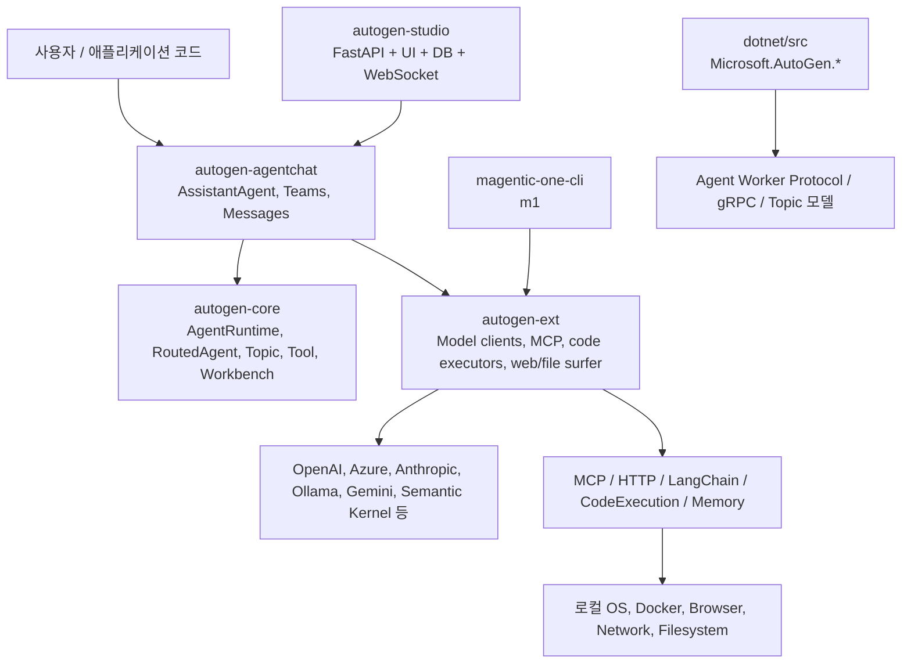

계층별 역할:

| 계층 | 핵심 책임 | 대표 코드 |
|---|---|---|
| Core | 메시지 큐, AgentRuntime, Topic, 구독, Tool schema, Component 로딩 | `autogen_core/_single_threaded_agent_runtime.py`, `_routed_agent.py`, `tools/_base.py` |
| AgentChat | 사용자 친화 Agent/Team API, GroupChat, termination, handoff | `agents/_assistant_agent.py`, `teams/_group_chat/*` |
| Extensions | 모델 공급자, MCP, 코드 실행기, 웹/파일 에이전트, memory/cache | `autogen_ext/models/*`, `tools/mcp/*`, `code_executors/*` |
| Studio | 팀 config 작성/검증/실행, 웹 UI, API, auth, WebSocket | `autogenstudio/web/app.py`, `teammanager/teammanager.py` |
| Magentic-One | Orchestrator 기반 일반 작업 에이전트 팀 | `autogen_ext/teams/magentic_one.py`, `_magentic_one_orchestrator.py` |
| .NET | C# 런타임/에이전트/그룹챗/AgentHost | `dotnet/src/Microsoft.AutoGen/*` |

## 5. Core API: 메시지 런타임

`SingleThreadedAgentRuntime`은 이 레포의 핵심 추상화다. 문서 주석 자체가 “단일 asyncio 큐로 메시지를 처리하고, 메시지마다 별도 task로 처리한다”고 설명한다. 동시에 개발/standalone에는 적합하지만 고처리량/고동시성에는 적합하지 않다고 한다.

핵심 흐름:

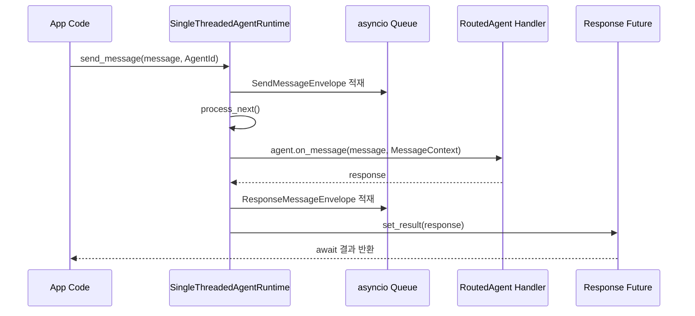

`publish_message`는 direct RPC와 다르게 Future를 기다리지 않고 Topic 구독자를 찾아 각 agent handler를 호출한다.

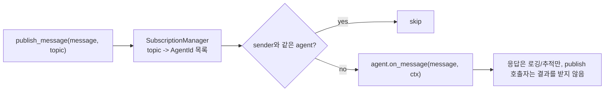

Core의 중요한 설계 포인트:

- `AgentRuntime` Protocol은 `send_message`, `publish_message`, `register_factory`, `add_subscription`, `save_state`, `load_state`를 정의한다.
- `RoutedAgent`는 decorated handler들을 발견하고 메시지 타입별 첫 matching handler로 라우팅한다.
- `InterventionHandler`가 `on_send`, `on_publish`에서 메시지를 수정하거나 `DropMessage`로 차단할 수 있다.
- 직렬화/telemetry/tracing이 메시지 envelope 레벨에 붙는다.
- `save_state`는 instantiated agents만 저장하며, 주석에 subscription state는 아직 저장하지 않는다고 되어 있다.

차별점:

- 단순 “agent.run(prompt)” 라이브러리가 아니라, publish/subscribe와 direct RPC를 모두 지원하는 경량 actor runtime에 가깝다.
- GroupChat도 내부적으로 이 runtime 위에 participant topic과 manager topic을 생성해 동작한다.
- .NET 쪽도 Topic/AgentId/Runtime 개념으로 같은 사고방식을 따른다.

주의점:

- `SingleThreadedAgentRuntime`은 이름과 달리 메시지 처리 task를 동시에 생성한다. 상태 있는 agent가 thread-safe/coroutine-safe하지 않다는 AgentChat 경고와 결합하면, 사용자가 같은 agent를 여러 흐름에서 공유할 때 경합이 생길 수 있다.
- 기본 `ignore_unhandled_exceptions=True`는 background handler 예외가 즉시 표면화되지 않을 수 있다. GroupChat은 이를 피하려고 embedded runtime 생성 시 `ignore_unhandled_exceptions=False`를 사용한다.

## 6. AgentChat: AssistantAgent 실행 흐름

`AssistantAgent`는 모델 호출, memory update, tool/workbench 실행, handoff, structured output을 묶는 핵심 고수준 agent다. 코드 문서에서 중요한 경고를 두 개 제공한다.

- 호출자는 새 메시지만 넘겨야 한다. agent가 내부 state를 유지한다.
- `AssistantAgent`는 thread-safe/coroutine-safe하지 않다.

실제 `on_messages_stream` 흐름:

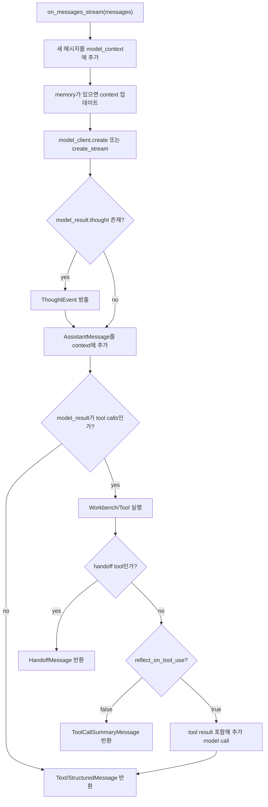

핵심 기능:

- Function calling 지원 모델이면 일반 Python callable을 `FunctionTool`로 wrapping 가능.
- `workbench`를 사용하면 여러 tool이 state/lifecycle을 공유할 수 있다.
- `max_tool_iterations`로 모델-tool 반복 횟수를 제한한다.
- 여러 tool call이 나오면 기본적으로 병렬 실행될 수 있다. OpenAI/Azure client에서 `parallel_tool_calls=False`로 비활성화하라고 문서화되어 있다.
- `output_content_type`을 설정하면 Pydantic structured response로 마지막 메시지를 구성한다.
- model result의 hidden `thought`가 있으면 `ThoughtEvent`로 방출한다. UI/로그에서 노출 경계를 따로 설계해야 한다.

차별점:

- 대부분의 단순 에이전트 프레임워크는 LLM call과 tool execution을 한 함수 안에 숨긴다. AutoGen은 이를 메시지, event, inner message, final response로 분해해 관찰성과 serialization을 강화한다.
- `ToolCallSummaryMessage`, `HandoffMessage`, `StructuredMessage`처럼 결과 형태를 명확히 나눈다.

주의점:

- `tool_call_summary_formatter`는 직렬화되지 않고 YAML/JSON config에서 무시된다.
- tool 결과가 기본 응답이 될 수 있으므로, downstream agent가 기대하는 스키마와 tool 반환 문자열이 맞지 않으면 오류가 연쇄된다.
- parallel tool calls는 side effect가 있는 도구에서 순서/경합 문제가 생길 수 있다.

## 7. Team과 GroupChat 구조

`BaseGroupChat`은 AgentChat API와 Core Runtime을 연결하는 핵심 bridge다. 각 participant를 직접 호출하지 않고, participant별 topic과 manager topic을 만들어 runtime에 등록한다.

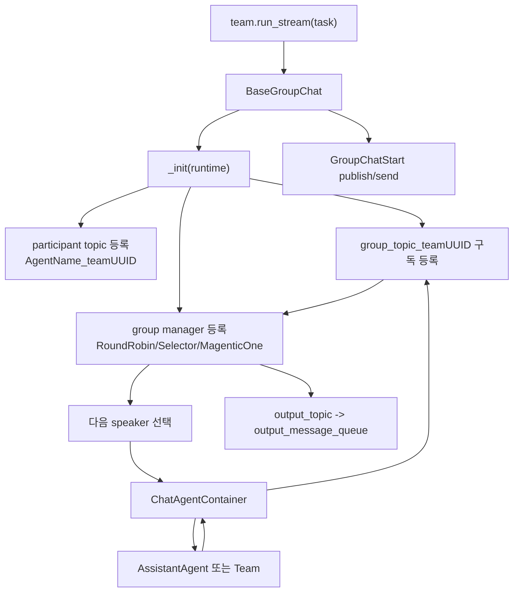

중요 구현:

- `BaseGroupChat`은 participant 이름 중복을 거부한다.
- Team instance마다 UUID 기반 topic type을 만든다.
- runtime을 외부에서 주입하지 않으면 embedded `SingleThreadedAgentRuntime(ignore_unhandled_exceptions=False)`를 만든다.
- `RoundRobinGroupChat`은 순차 turn-taking이다.
- `SelectorGroupChat`은 model client를 이용해 다음 speaker 이름을 고른다.
- `MagenticOneGroupChat`은 task ledger/progress ledger 방식의 orchestrator가 speaker와 planning을 통제한다.

SelectorGroupChat의 선택 메커니즘:

- `selector_func`가 있으면 모델 선택을 건너뛸 수 있다.
- `candidate_func`가 있으면 후보 agent를 필터링한다.
- 모델 응답에서 agent 이름 mention을 regex로 찾는다.
- 실패하면 피드백 메시지를 추가하고 최대 시도 횟수까지 재시도한다.
- 끝까지 실패하면 이전 speaker 또는 첫 participant로 fallback한다.

설계상 장점:

- 두 명 채팅, 라운드로빈, 모델 기반 speaker selection, orchestrator 기반 planning을 같은 Team 인터페이스로 제공한다.
- nested team도 일부 지원한다. 단, MagenticOneGroupChat은 participant가 `ChatAgent`여야 하며 Team participant는 지원하지 않는다.

위험/이상한 점:

- selector 모델이 agent 이름을 잘못 언급하면 fallback 로직이 발동한다. 잘못된 speaker가 반복될 수 있다.
- Team ID가 객체 instance에 묶여 있어 재생성 시 topic namespace가 달라진다. state load/save 흐름에서 외부 runtime과 결합할 때 주의가 필요하다.
- termination condition 없이 team을 만들면 무한 실행 가능성이 있다.

## 8. Tool, Workbench, Component 로딩

Tool 계층은 `Tool` Protocol과 `BaseTool`로 구성된다. Pydantic args schema를 JSON schema로 변환하고, LLM tool schema로 전달한다. `run_json`은 args를 Pydantic 모델로 검증한 뒤 실제 `run`을 호출한다.

`FunctionTool`은 Python 함수를 tool로 변환한다.

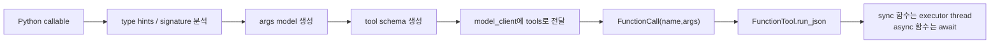

가장 중요한 보안 표면:

- `FunctionTool._to_config`는 함수 source code와 imports를 config에 저장한다.
- `FunctionTool._from_config`는 config의 import와 function source를 `exec`로 실행한다.
- 코드 자체에 “trusted sources only” 경고가 있다.
- Studio validation service는 이 위험을 인지하고 `/api/validate` 경로에서 `FunctionTool` instantiation을 건너뛰는 방어 코드를 넣었다.

이것은 매우 중요한 설계 tradeoff다. 재현 가능한 agent config를 만들려면 함수 코드 직렬화가 편하지만, 외부 config를 로딩하는 순간 임의 코드 실행 경계가 열린다.

Workbench:

- Workbench는 여러 도구가 같은 lifecycle/state/resource를 공유하는 추상화다.
- `list_tools`, `call_tool`, `start`, `stop`, `reset`, `save_state`, `load_state`를 제공한다.
- MCP Workbench가 대표 사용처다.

## 9. Extensions: 모델, MCP, 코드 실행

### 9.1 모델 클라이언트

`autogen-ext`는 OpenAI, Azure, Anthropic, Ollama, Gemini, Semantic Kernel, llama.cpp, replay/cache 등 다양한 model client를 제공한다. Core의 `ChatCompletionClient` interface에 맞추면 AgentChat은 provider를 크게 의식하지 않는다.

패키지 optional extra가 세분화되어 있다.

- `autogen-ext[openai]`
- `autogen-ext[anthropic]`
- `autogen-ext[gemini]`
- `autogen-ext[mcp]`
- `autogen-ext[docker]`
- `autogen-ext[magentic-one]`
- `autogen-ext[web-surfer]`
- `autogen-ext[http-tool]`

장점은 설치 표면을 줄이는 것이고, 단점은 로컬 소스 실행 시 의존성 부족으로 import가 쉽게 실패한다는 점이다.

### 9.2 MCP Workbench

`McpWorkbench`는 MCP 서버를 Workbench로 감싼다. 지원 capability는 tools, resources, resource templates, prompts, sampling, roots, elicitation이다. README 예제는 Playwright MCP 서버를 `npx @playwright/mcp@latest --headless`로 실행해 web browsing assistant에 연결한다.

```mermaid
sequenceDiagram
  participant Agent as AssistantAgent
  participant Workbench as McpWorkbench
  participant Actor as McpSessionActor
  participant Server as MCP Server

  Agent->>Workbench: list_tools()
  Workbench->>Actor: call("list_tools")
  Actor->>Server: MCP list_tools
  Server-->>Actor: tool schemas
  Actor-->>Workbench: ListToolsResult
  Workbench-->>Agent: ToolSchema[]
  Agent->>Workbench: call_tool(name,args)
  Workbench->>Server: MCP call_tool
  Server-->>Workbench: ToolResult
  Workbench-->>Agent: Text/Image result
```

위험 표면:

- `StdioServerParams`는 로컬 command를 실행한다. 코드와 README 모두 trusted MCP server만 연결하라고 경고한다.
- MCP server가 tools뿐 아니라 resources/prompts/sampling/root/elicitation까지 다룰 수 있어, 단순 도구 실행보다 권한 표면이 넓다.
- tool override가 이름/설명을 바꿔 agent에게 보여줄 수 있다. 운영 환경에서는 실제 tool과 표시 이름 매핑을 감사해야 한다.

### 9.3 코드 실행기

AutoGen은 code execution을 extension으로 둔다.

| 실행기 | 위치 | 특징 |
|---|---|---|
| LocalCommandLineCodeExecutor | `autogen_ext/code_executors/local` | 로컬에서 Python/shell/pwsh 실행. 명시적 danger 경고. |
| DockerCommandLineCodeExecutor | `autogen_ext/code_executors/docker` | Docker 컨테이너에서 실행. 기본 이미지 `python:3-slim`. |
| Jupyter executor | `autogen_ext/code_executors/jupyter` | Jupyter kernel 기반 실행. |
| Docker Jupyter executor | `autogen_ext/code_executors/docker_jupyter` | Docker + Jupyter 서버. |
| Azure Container executor | `autogen_ext/code_executors/azure` | Azure 동적 세션/컨테이너 실행. |

Local executor 흐름:

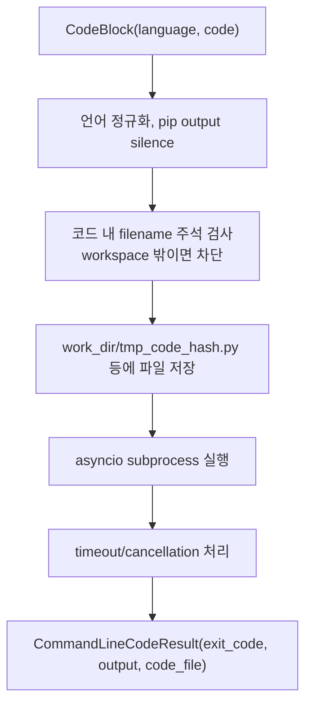

Docker executor 흐름:

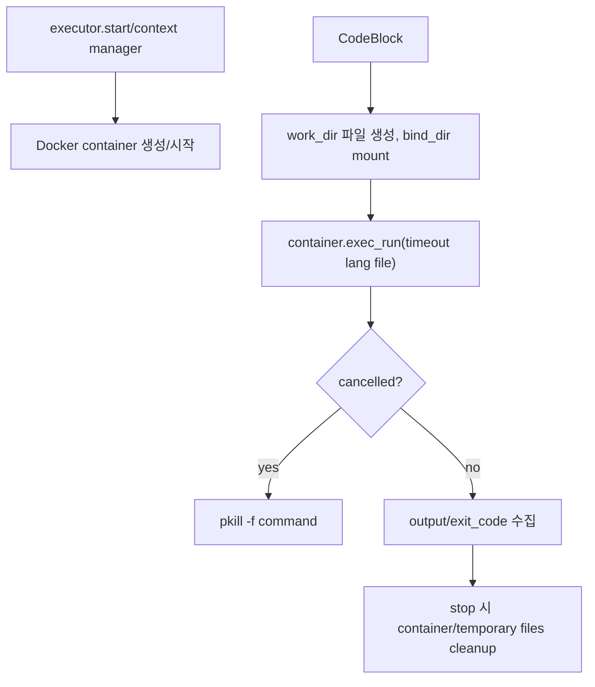

중요한 판단:

- Docker executor가 권장되지만 Docker mount, extra_volumes, extra_hosts, device_requests, init_command를 열 수 있다. 안전장치라기보다 격리 도구이며 설정에 따라 강한 권한을 가질 수 있다.
- Local executor는 regex 기반 self-destructive command 차단을 언급하지만, 이것을 보안 sandbox로 간주하면 안 된다.
- `PythonCodeExecutionTool`은 `CodeExecutor`를 Tool로 감싸 LLM이 Python 코드를 실행하게 한다.

## 10. Magentic-One

Magentic-One은 AutoGen 내부에서 가장 “AI 코딩/작업 에이전트”에 가까운 표면이다. `MagenticOne` 클래스는 다음 agent들을 조립한다.

- `MagenticOneOrchestrator`: 계획, ledger, 진행 평가, speaker 배정.
- `WebSurfer`: Chromium 기반 브라우저 조작.
- `FileSurfer`: 로컬 파일/디렉터리 markdown 탐색.
- `MagenticOneCoderAgent`: 코드 작성/분석 담당.
- `CodeExecutorAgent` / `ComputerTerminal`: Coder가 만든 코드를 실행.
- 선택적으로 `UserProxyAgent`: human-in-the-loop.

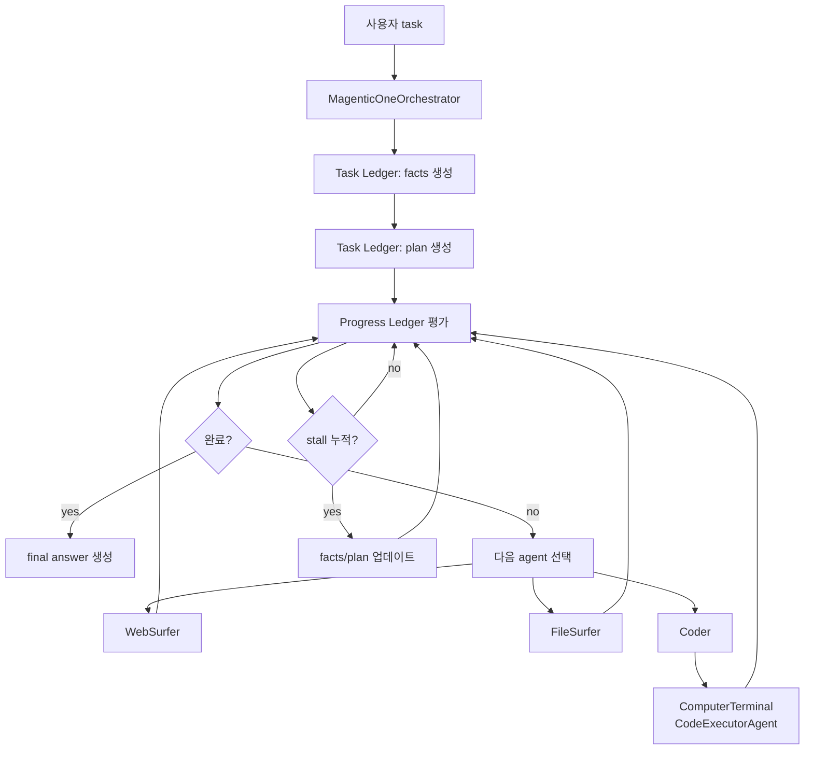

`m1` CLI 실행 흐름:

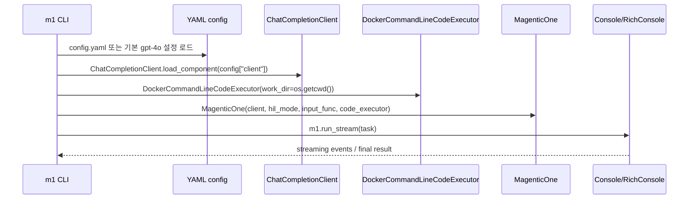

Magentic-One의 가장 큰 차별점은 ledger 기반 orchestrator다. 단순 round-robin이나 selector가 아니라, task facts, plan, progress ledger를 유지하고 stall이 누적되면 plan을 갱신한다. 그러나 코드 문서도 위험을 매우 직접적으로 인정한다.

- Docker container 사용 권장.
- virtualenv 사용 권장.
- 로그 감시 권장.
- human oversight 권장.
- 인터넷/리소스 접근 제한 권장.
- 웹 prompt injection 취약 가능성 경고.
- cookie agreement를 임의 수락하거나 사람에게 도움을 요청하는 등 위험한 행동을 할 수 있다고 경고.

`m1` CLI의 특이점:

- 기본 config는 OpenAI `gpt-4o`다.
- `--no-hil`을 주면 human-in-the-loop를 끈다.
- 코드 실행은 `DockerCommandLineCodeExecutor(work_dir=os.getcwd())`로 현재 디렉터리를 bind 대상으로 삼는다.
- CLI 코드에서는 별도 approval_func를 넣지 않는다. 따라서 `m1` 기본 CLI 흐름은 Docker 격리에는 의존하지만 코드 실행 승인 단계는 없다.

## 11. AutoGen Studio

Studio는 no-code/low-code GUI다. README는 production-ready app이 아니며 개발자가 인증/보안 등 production 요구사항을 직접 구현해야 한다고 경고한다.

구조:

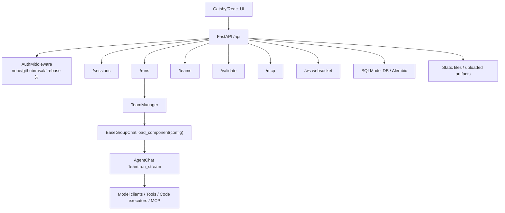

CLI:

- `autogenstudio ui`: 환경 변수 파일을 `~/.autogenstudio/temp_env_vars.env`에 만들고 uvicorn을 실행한다.
- `autogenstudio serve`: team JSON 파일을 API endpoint로 서빙한다.
- `autogenstudio lite`: in-memory SQLite로 가벼운 Studio를 띄운다.

FastAPI app:

- `debug=True`로 생성된다.
- CORS allow origins는 localhost 계열 몇 개로 제한하지만, allow methods/headers는 `*`다.
- `/api` 아래 sessions/runs/teams/ws/validate/settings/gallery/auth/mcp router를 등록한다.
- static UI와 files를 mount한다.

안전장치:

- validation service는 `FunctionTool` config 로딩의 RCE 위험을 알고, validation endpoint에서는 instantiation을 건너뛴다.

운영 리스크:

- production-ready가 아니라고 명시되어 있다.
- auth type이 `none`이면 WebSocket도 인증 없이 통과하는 구조다.
- Team config는 `BaseGroupChat.load_component`로 component를 실제 로딩한다. 신뢰하지 않는 team config를 실행하면 모델/tool/code executor/MCP 표면이 열린다.
- Studio의 pyproject는 `autogen-core>=0.4.9.2,<0.7`, `autogen-agentchat>=0.4.9.2,<0.7`, `autogen-ext>=0.4.2,<0.7`를 요구한다. 반면 메인 패키지들은 0.7.5다. 같은 monorepo 안에서 Studio dependency range가 현재 core package version과 어긋난다. 유지보수 모드의 흔적이자 실행 검증 시 주의점이다.

## 12. .NET 계층

`dotnet/README.md`는 두 계열을 구분한다.

- `AutoGen.*`: AutoGen 0.2에서 유래한 오래된 패키지, 점진적 deprecation 예정.
- `Microsoft.AutoGen.*`: event-driven model을 사용하는 새 패키지, 아직 API 안정성이 완전하지 않다고 설명.

.NET 쪽 주요 개념:

- `AgentId`, `TopicId`, `IAgentRuntime`, `IHandle<T>` 기반 이벤트 처리.
- gRPC Agent Worker sample이 있고 `AgentHost` Dockerfile도 존재한다.
- `GroupChatBase`, `ChatAgentRouter`, `GroupChatManagerBase`, `OutputCollectorAgent` 같은 AgentChat 구조가 C#에도 있다.
- 구형 `ConversableAgent`, `UserProxyAgent`, Semantic Kernel integration도 남아 있다.

의미:

- AutoGen은 Python만의 라이브러리가 아니라 cross-runtime agent protocol을 실험해온 레포다.
- 다만 README가 말하듯 .NET은 구형과 신형이 공존하며, 신형 Microsoft.AutoGen API도 안정성에 주의가 필요하다.

## 13. 사용자 플로우별 실제 동작

### 13.1 단일 AssistantAgent

1. 사용자가 `OpenAIChatCompletionClient` 같은 model client를 만든다.
2. `AssistantAgent(name, model_client, tools/workbench optional)`를 생성한다.
3. `agent.run(task="...")` 또는 `agent.run_stream(task="...")`를 호출한다.
4. `BaseChatAgent.run_stream`이 task 문자열을 `TextMessage(source="user")`로 만든다.
5. `AssistantAgent.on_messages_stream`이 새 메시지를 model context에 추가한다.
6. memory가 있으면 context를 보강한다.
7. model client에 system messages, context, tools/workbench schema를 넘긴다.
8. 모델이 텍스트만 반환하면 즉시 최종 메시지다.
9. 모델이 tool call을 반환하면 tool/workbench를 실행한다.
10. `reflect_on_tool_use=False`면 tool summary가 최종 메시지다.
11. `reflect_on_tool_use=True`면 tool result를 포함해 다시 모델을 호출하고 최종 답변을 만든다.

### 13.2 MCP 웹 브라우징 Assistant

1. 사용자가 `StdioServerParams(command="npx", args=["@playwright/mcp@latest", "--headless"])`를 만든다.
2. `async with McpWorkbench(server_params)`로 MCP actor/session을 시작한다.
3. `AssistantAgent(..., workbench=mcp, max_tool_iterations=10)`로 agent를 만든다.
4. agent가 모델 호출 시 MCP tool schema를 전달한다.
5. 모델이 브라우저 tool을 선택한다.
6. `McpWorkbench.call_tool`이 MCP 서버에 call_tool을 보낸다.
7. Playwright MCP가 실제 브라우저를 조작한다.
8. 결과가 ToolResult로 agent에게 돌아오고, agent는 추가 tool iteration 또는 최종 응답을 수행한다.

### 13.3 RoundRobinGroupChat

1. 사용자가 여러 `AssistantAgent`를 만든다.
2. `RoundRobinGroupChat([agent1, agent2], termination_condition=...)`를 만든다.
3. Team은 embedded runtime을 만들고, participant와 manager를 topic 기반 agent로 등록한다.
4. task가 `GroupChatStart`로 manager에게 전달된다.
5. manager가 순서대로 다음 participant topic에 `GroupChatRequestPublish`를 보낸다.
6. participant container가 실제 ChatAgent를 호출한다.
7. 응답은 group topic과 output topic으로 publish된다.
8. termination condition 또는 max turns에 도달하면 `StopMessage`와 `TaskResult`가 반환된다.

### 13.4 SelectorGroupChat

RoundRobin과 유사하지만 다음 speaker 선택을 model client에 맡긴다.

1. manager가 roles, participants, history를 prompt로 구성한다.
2. model이 speaker 이름을 텍스트로 반환한다.
3. regex mention 검사가 정확히 하나의 agent 이름을 찾으면 그 speaker로 진행한다.
4. 실패하면 feedback을 추가하고 재시도한다.
5. 끝까지 실패하면 이전 speaker 또는 첫 participant fallback.

### 13.5 Magentic-One CLI

1. 사용자가 `m1 "task"`를 실행한다.
2. CLI가 `config.yaml`을 찾거나 기본 OpenAI gpt-4o config를 사용한다.
3. `ChatCompletionClient.load_component`가 config로 model client를 로드한다.
4. 현재 작업 디렉터리를 work_dir로 하는 Docker code executor를 연다.
5. `MagenticOne`이 FileSurfer, WebSurfer, Coder, ComputerTerminal, optional UserProxy를 조립한다.
6. Orchestrator가 facts와 plan을 만든다.
7. Progress ledger로 agent에게 subtask를 배정한다.
8. Coder가 코드를 작성하면 ComputerTerminal이 Docker 안에서 실행한다.
9. WebSurfer는 browser를 조작하고 FileSurfer는 파일을 읽는다.
10. 완료 판단 시 final answer를 생성한다.

### 13.6 AutoGen Studio UI

1. 사용자가 `autogenstudio ui --port 8080 --appdir ./my-app`를 실행한다.
2. CLI가 설정을 env file로 기록하고 uvicorn으로 `autogenstudio.web.app:app`를 띄운다.
3. Gatsby UI가 static mount에서 제공된다.
4. UI가 `/api/teams`, `/api/sessions`, `/api/runs`, `/api/ws`를 호출한다.
5. Team config는 DB에 저장되고, 실행 시 `TeamManager`가 `BaseGroupChat.load_component`로 팀을 만든다.
6. 실행 이벤트는 WebSocket/Run API를 통해 UI로 돌아간다.

## 14. 차별점

AutoGen의 차별점은 “agent framework의 역사적 교차점”이라는 데 있다.

1. **메시지 런타임과 사용자 API가 분리됨**  
   사용자에게는 `AssistantAgent.run_stream`을 제공하지만 내부에는 runtime, topic, subscription, agent container가 있다.

2. **에이전트 팀 패턴을 여러 방식으로 공식화**  
   RoundRobin, Selector, Swarm, MagenticOne, nested tools/teams를 한 API 계열로 제공한다.

3. **MCP를 Workbench 추상화로 통합**  
   MCP server를 단순 tool list가 아니라 lifecycle/state를 갖는 workbench로 다룬다.

4. **코드 실행을 독립 컴포넌트로 분리**  
   Local/Docker/Jupyter/Azure executor를 교체할 수 있고, `PythonCodeExecutionTool`로 agent에게 연결한다.

5. **직렬화 가능한 Component 생태계**  
   Team/Agent/Tool/Model config를 YAML/JSON으로 저장하고 Studio에서 조립할 수 있다.

6. **Magentic-One의 ledger orchestration**  
   task facts, plan, progress ledger, stall detection, replanning으로 단순 speaker selection보다 높은 수준의 작업 분해를 시도한다.

7. **Python + .NET cross-runtime 설계 흔적**  
   Agent Worker Protocol, gRPC, Topic model, .NET packages가 함께 존재한다.

## 15. 위험 요소와 이상한 점

### 15.1 Maintenance mode

가장 큰 제품 리스크다. README가 신규 사용자는 Microsoft Agent Framework로 가라고 직접 말한다. AutoGen을 새 프로젝트 핵심 의존성으로 삼으면 장기 기능 발전을 기대하기 어렵다.

### 15.2 Studio와 core 패키지 버전 축 불일치

메인 Python package들은 0.7.5인데, Studio pyproject는 `autogen-core`, `autogen-agentchat`, `autogen-ext`를 `<0.7`로 요구한다. 같은 저장소 안에서 Studio가 최신 core 계열과 직접 맞지 않는다. Studio를 소스에서 실행하려면 dependency resolution을 별도로 확인해야 한다.

### 15.3 FunctionTool config 로딩 RCE

`FunctionTool._from_config`는 import와 source code를 `exec`한다. Studio validation service가 이 문제를 인지하고 validate endpoint에서 instantiation을 피하지만, 다른 code path에서 신뢰하지 않는 component config를 load하면 RCE 위험이 있다.

### 15.4 LocalCommandLineCodeExecutor

로컬 OS에서 LLM 생성 코드를 실행한다. warning이 명확하지만, 사용자가 “regex로 위험 명령을 차단한다”는 문구를 sandbox로 오해하면 안 된다.

### 15.5 Docker executor의 과신

Docker가 더 안전하지만 설정이 중요하다. `work_dir=os.getcwd()` bind, `extra_volumes`, `extra_hosts`, GPU device request, init command 등은 권한 표면을 넓힌다.

### 15.6 MCP stdio server 실행

MCP stdio는 로컬 명령을 실행한다. `npx`, `uvx`, `docker run` 기반 server가 흔하고, server 자체가 파일/브라우저/network 권한을 가질 수 있다.

### 15.7 Hidden thought event

`AssistantAgent`는 `model_result.thought`가 있으면 `ThoughtEvent`로 stream에 내보낸다. reasoning/thought를 사용자가 보게 해도 되는지, 로그에 저장해도 되는지 정책 검토가 필요하다.

### 15.8 Tool parallelism

여러 tool call을 병렬 실행할 수 있다. side effect가 있는 tool, 파일 수정, 외부 API 호출, 결제/배포/삭제 작업에서는 순서와 승인 정책이 필요하다.

### 15.9 Selector fallback

SelectorGroupChat은 모델이 speaker 이름을 선택하지 못하면 feedback 후 fallback한다. 품질이 낮은 모델이나 agent 이름이 일반 단어일 때 오선택 가능성이 있다.

### 15.10 Auth none과 local-only 가정

Studio는 localhost 개발 도구로는 적절하지만, production-ready가 아니라고 명시한다. auth `none`이나 weak deployment는 team 실행 API, WebSocket, MCP, code executor 경로를 그대로 노출할 수 있다.

### 15.11 AutoGen Studio debug

FastAPI app이 `debug=True`로 생성된다. localhost 도구의 개발 편의로 보이나, 배포 환경에서는 부적절하다.

### 15.12 docs typo

README의 maintenance 안내에는 “Microsoft Agent FrameworkAF in now available” 같은 문장 오타가 있다. 기능 문제는 아니지만 maintenance mode 전환 과정에서 문서 정리가 덜 된 흔적으로 보인다.

## 16. 실행 검증 결과

로컬 환경:

- Python: `3.13.1`
- 의존성 설치: 수행하지 않음.
- `uv`, `poetry` 설치 여부는 이 보고서 단계에서 별도 사용하지 않음.

직접 확인:

```text
autogen_core FAIL PackageNotFoundError No package metadata was found for autogen_core
autogen_agentchat FAIL PackageNotFoundError No package metadata was found for autogen_agentchat
autogen_ext FAIL PackageNotFoundError No package metadata was found for autogen_ext
autogenstudio FAIL ModuleNotFoundError No module named 'loguru'
magentic_one_cli OK None

class import FAIL PackageNotFoundError No package metadata was found for autogen_core
local executor import FAIL PackageNotFoundError No package metadata was found for autogen_ext
mcp import FAIL PackageNotFoundError No package metadata was found for autogen_ext
```

해석:

- `autogen_core`, `autogen_agentchat`, `autogen_ext`는 source path를 넣어도 package metadata를 찾으려 하기 때문에 editable install 또는 workspace install이 필요하다.
- Studio는 `loguru`가 없어 import 실패했다.
- 이 결과는 소스 결함이 아니라 monorepo 의존성 설치 없이 바로 실행하기 어려운 패키지 구조라는 의미다.
- API call이나 실제 LLM 실행은 키/의존성/네트워크 비용과 side effect 때문에 수행하지 않았다.

## 17. 핵심 파일 지도

| 목적 | 파일 |
|---|---|
| 저장소 상태/철학 | `README.md` |
| Core runtime | `python/packages/autogen-core/src/autogen_core/_single_threaded_agent_runtime.py` |
| Agent runtime protocol | `python/packages/autogen-core/src/autogen_core/_agent_runtime.py` |
| RoutedAgent | `python/packages/autogen-core/src/autogen_core/_routed_agent.py` |
| Tool base | `python/packages/autogen-core/src/autogen_core/tools/_base.py` |
| FunctionTool | `python/packages/autogen-core/src/autogen_core/tools/_function_tool.py` |
| Workbench | `python/packages/autogen-core/src/autogen_core/tools/_workbench.py` |
| AssistantAgent | `python/packages/autogen-agentchat/src/autogen_agentchat/agents/_assistant_agent.py` |
| BaseChatAgent | `python/packages/autogen-agentchat/src/autogen_agentchat/agents/_base_chat_agent.py` |
| CodeExecutorAgent | `python/packages/autogen-agentchat/src/autogen_agentchat/agents/_code_executor_agent.py` |
| BaseGroupChat | `python/packages/autogen-agentchat/src/autogen_agentchat/teams/_group_chat/_base_group_chat.py` |
| GroupChat manager | `python/packages/autogen-agentchat/src/autogen_agentchat/teams/_group_chat/_base_group_chat_manager.py` |
| SelectorGroupChat | `python/packages/autogen-agentchat/src/autogen_agentchat/teams/_group_chat/_selector_group_chat.py` |
| Magentic-One orchestrator | `python/packages/autogen-agentchat/src/autogen_agentchat/teams/_group_chat/_magentic_one/_magentic_one_orchestrator.py` |
| MCP Workbench | `python/packages/autogen-ext/src/autogen_ext/tools/mcp/_workbench.py` |
| MCP tool factory | `python/packages/autogen-ext/src/autogen_ext/tools/mcp/_factory.py` |
| Local code executor | `python/packages/autogen-ext/src/autogen_ext/code_executors/local/__init__.py` |
| Docker code executor | `python/packages/autogen-ext/src/autogen_ext/code_executors/docker/_docker_code_executor.py` |
| Python code execution tool | `python/packages/autogen-ext/src/autogen_ext/tools/code_execution/_code_execution.py` |
| Magentic-One composition | `python/packages/autogen-ext/src/autogen_ext/teams/magentic_one.py` |
| Magentic-One CLI | `python/packages/magentic-one-cli/src/magentic_one_cli/_m1.py` |
| Studio CLI | `python/packages/autogen-studio/autogenstudio/cli.py` |
| Studio FastAPI app | `python/packages/autogen-studio/autogenstudio/web/app.py` |
| Studio TeamManager | `python/packages/autogen-studio/autogenstudio/teammanager/teammanager.py` |
| Studio validation RCE guard | `python/packages/autogen-studio/autogenstudio/validation/validation_service.py` |
| .NET overview | `dotnet/README.md` |

## 18. 종합 평가

학습 가치:

- 매우 높음. 최신 AI agent framework의 기본 구성 요소인 runtime, tool schema, model abstraction, MCP, code execution, UI config loading, multi-agent orchestration을 거의 모두 포함한다.

실사용 안정성:

- 신규 프로젝트에서는 낮게 평가해야 한다. maintenance mode이고 successor가 명시되어 있다.
- 기존 AutoGen 사용자는 migration guide와 version pinning을 병행해야 한다.

보안 성숙도:

- 위험을 숨기지 않고 문서/코드에 경고한다는 점은 좋다.
- 그러나 tool/code/MCP/config execution 표면이 넓어, production 제품으로 사용하려면 별도 sandbox, approval, config signing/trust boundary, network egress 정책, auth, audit log가 필요하다.

아키텍처적 차별성:

- 단순 coding agent보다 넓은 범위의 agent runtime 레포다.
- Magentic-One이 coding agent와 가장 가깝지만, 레포 전체의 본질은 “AI agent app을 조립하는 다층 프레임워크”다.

추천 사용 방식:

- 설계 학습, 레거시 AutoGen 유지, Agent/Team/Runtime 패턴 참고에는 강력 추천.
- 신규 프로덕션 프레임워크 선택에는 Microsoft Agent Framework, LangGraph, CrewAI, OpenHands 등과 비교 후 신중히 결정.
- 신뢰하지 않는 Studio team config, FunctionTool config, MCP stdio server는 실행하지 않는 것이 원칙이다.
