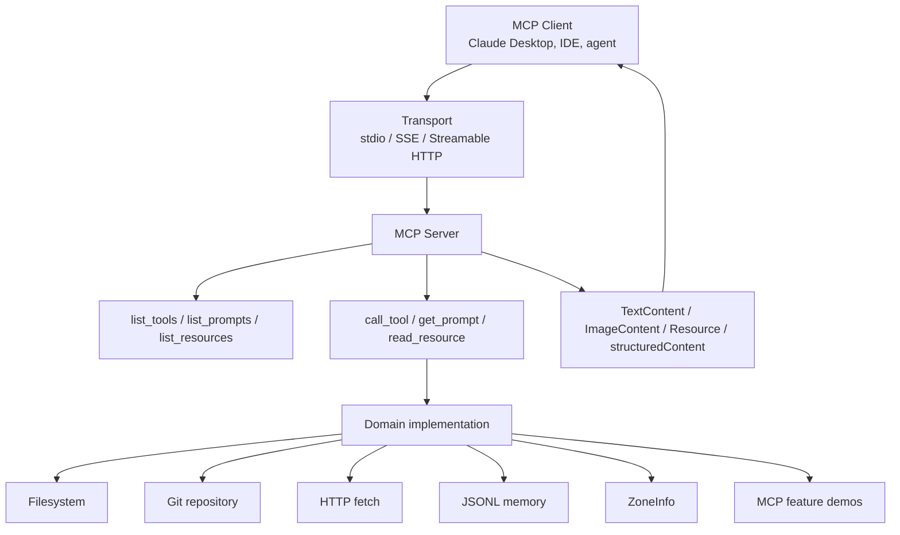
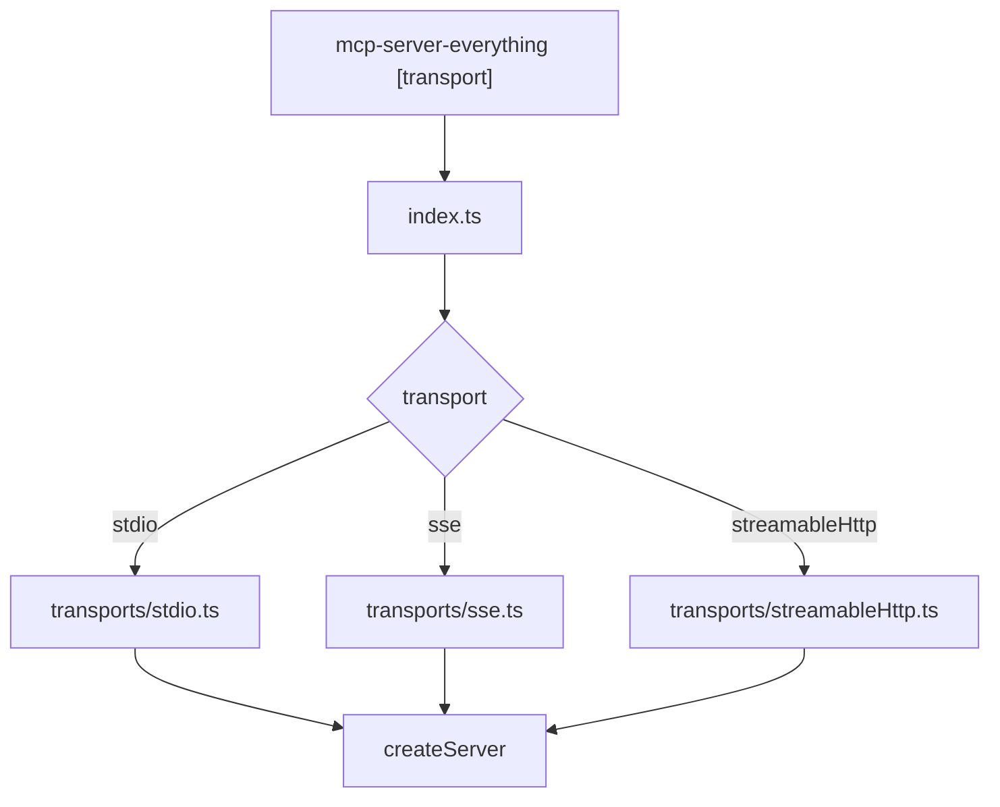
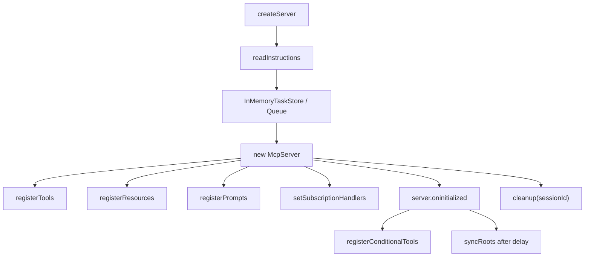
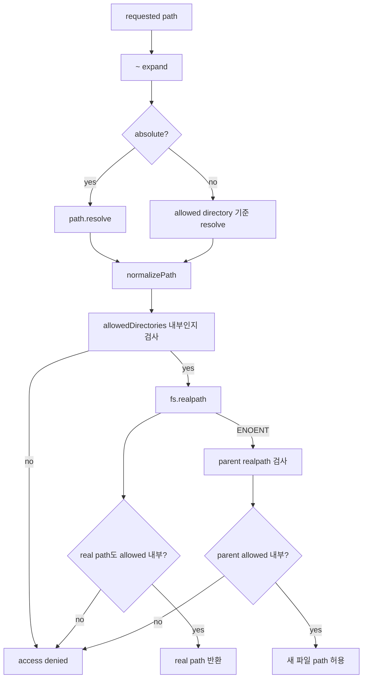
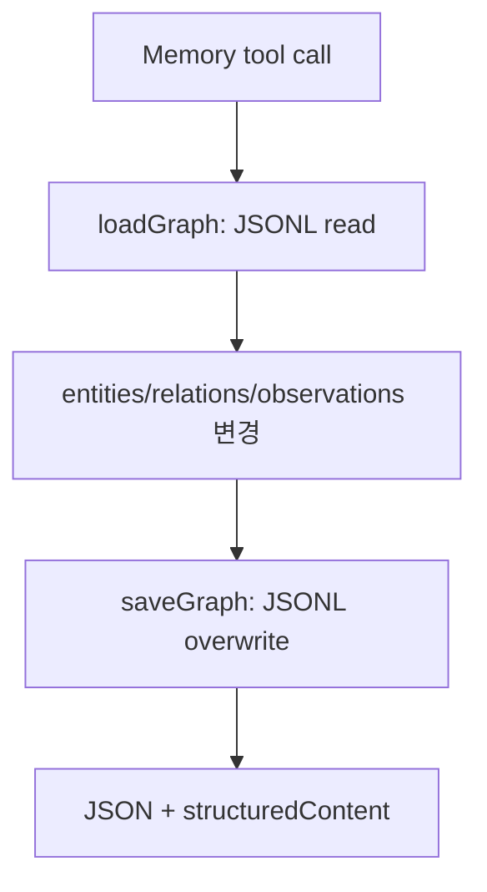
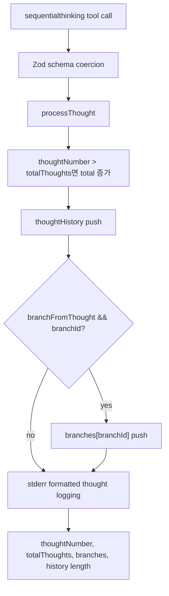
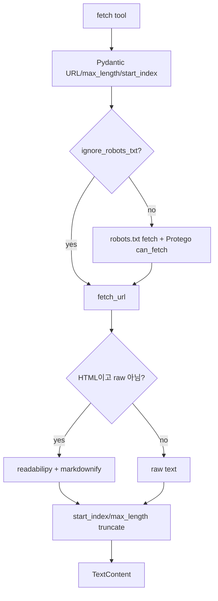
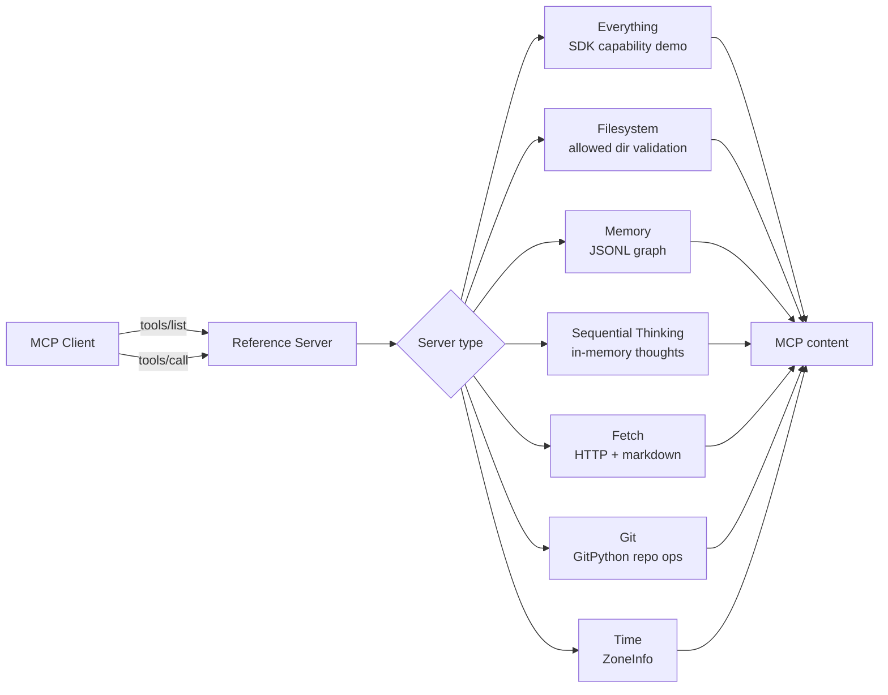

# modelcontextprotocol/servers 심층 분석

분석 기준일: 2026-06-10  
분석 대상: `modelcontextprotocol/servers`  
로컬 경로: `sources/modelcontextprotocol__servers`  
분석 커밋: `275175c`  
기본 브랜치: `main`  
주요 언어: TypeScript, Python  
루트 패키지 버전: `0.6.2`  
라이선스: Apache-2.0 전환 중, 기존 MIT 코드 및 문서 CC-BY-4.0 혼재

## 1. 총평

`modelcontextprotocol/servers`는 하나의 AI 코딩 에이전트가 아니라 MCP 서버 reference implementation 모음이다. README가 직접 밝히듯 이 레포의 목적은 "production-ready 솔루션"이 아니라 MCP 기능과 SDK 사용법을 보여주는 교육용 구현이다. 따라서 평가 기준도 일반 애플리케이션처럼 안정성, 운영 기능, 완성도만 볼 것이 아니라, "MCP 서버를 어떻게 설계하고 client에게 tool, prompt, resource, task, logging, roots를 노출하는지 보여주는가"로 봐야 한다.

2026-06-10 기준 GitHub 메타데이터상 생성일은 2024-11-19, 최신 release는 `2026.1.26`, 별 수는 약 87,007개, fork는 약 10,969개다. MCP 생태계가 현대 AI agent 도구 호출의 공통 기반으로 빠르게 자리 잡으면서, 이 레포는 직접 제품이라기보다 infrastructure reference 역할을 한다.

현재 README에 남아 있는 reference server는 다음 7개다.

| 서버 | 구현 언어 | 역할 |
| --- | --- | --- |
| Everything | TypeScript | MCP 기능 종합 시연 서버 |
| Filesystem | TypeScript | 허용 디렉터리 기반 파일 읽기/쓰기 |
| Memory | TypeScript | JSONL 기반 지식 그래프 memory |
| Sequential Thinking | TypeScript | 단계적 사고 상태 기록 도구 |
| Fetch | Python | URL fetch와 markdown 변환 |
| Git | Python | Git repository 읽기/조작 |
| Time | Python | 현재 시간과 timezone 변환 |

GitHub, GitLab, Slack, SQLite, Puppeteer, Postgres 등 많은 서버는 이미 `servers-archived`로 이동했다. README는 MCP server 목록을 찾는 사용자는 MCP Registry를 보라고 안내한다. 즉 이 레포는 "모든 MCP 서버 카탈로그"에서 "소수 reference server 유지 공간"으로 역할이 바뀌었다.

## 2. 철학과 발전 방향

이 레포의 철학은 세 가지로 보인다.

1. MCP server 구현의 최소 표준 예제를 제공한다.
2. 각 server는 특정 capability를 작게 보여준다.
3. 운영 환경에 그대로 넣기보다, 개발자가 자신의 threat model에 맞게 수정해야 한다.

README와 `SECURITY.md`가 모두 이 점을 강조한다. 특히 `SECURITY.md`는 이 레포가 reference implementation이라 security vulnerability reporting 대상이 아니며, SDK 취약점은 각 SDK repository에 보고하라고 한다. 이 문구는 "여기 있는 서버를 production security baseline으로 착각하지 말라"는 신호다.

## 3. 레포지토리 구조

루트는 npm workspace다.

```json
{
  "workspaces": ["src/*"],
  "scripts": {
    "build": "npm run build --workspaces",
    "watch": "npm run watch --workspaces",
    "publish-all": "npm publish --workspaces --access public"
  }
}
```

TypeScript 서버는 `src/*/package.json`을 갖고, Python 서버는 각 디렉터리에 `pyproject.toml`을 갖는다.

| 경로 | manifest | 배포/실행 |
| --- | --- | --- |
| `src/everything` | `package.json` | `mcp-server-everything` |
| `src/filesystem` | `package.json` | `mcp-server-filesystem` |
| `src/memory` | `package.json` | `mcp-server-memory` |
| `src/sequentialthinking` | `package.json` | `mcp-server-sequential-thinking` |
| `src/fetch` | `pyproject.toml` | `mcp-server-fetch` |
| `src/git` | `pyproject.toml` | `mcp-server-git` |
| `src/time` | `pyproject.toml` | `mcp-server-time` |

로컬 inventory 기준 파일 수는 142개이고, 주요 manifest는 루트 `package.json`, 각 TypeScript package, Python `pyproject.toml`, Dockerfile, `uv.lock`이다.

## 4. 전체 아키텍처

MCP server의 공통 형태는 다음과 같다.



TypeScript 서버는 최신 `@modelcontextprotocol/sdk`의 `McpServer`를 쓰고, Python 서버는 Python MCP SDK의 `Server`와 `stdio_server()`를 쓴다.

중요한 구조적 차이는 다음이다.

| 구분 | TypeScript 서버 | Python 서버 |
| --- | --- | --- |
| SDK API | `McpServer`, `registerTool` | `Server`, decorator 기반 handler |
| schema | Zod | Pydantic 또는 dict schema |
| transport | 대부분 stdio, Everything은 stdio/SSE/streamable HTTP | stdio |
| structuredContent | 적극 사용 | 일부는 TextContent 중심 |
| 테스트 | Vitest | pytest |

## 5. Everything Server

Everything server는 `src/everything`에 있다. 이름 그대로 MCP SDK 기능을 종합적으로 보여주는 reference server다.

### 5.1 진입점과 transport

`src/everything/index.ts`는 첫 번째 CLI 인자로 transport를 선택한다.

| 인자 | transport |
| --- | --- |
| 없음 또는 `stdio` | stdio |
| `sse` | SSE |
| `streamableHttp` | Streamable HTTP |

구현은 requested module만 dynamic import한다. 불필요한 module 초기화를 막기 위한 선택이다.



### 5.2 Server factory

핵심은 `src/everything/server/index.ts`의 `createServer()`다. 이 함수는 다음을 수행한다.

1. instruction 문서를 읽는다.
2. experimental task store와 message queue를 만든다.
3. `McpServer`를 생성하고 capabilities를 선언한다.
4. tools, resources, prompts를 등록한다.
5. resource subscription handler를 설정한다.
6. client initialize 이후 conditional tools를 등록하고 roots를 sync한다.
7. cleanup 함수에서 simulated logging, resource update, task timer를 정리한다.

광고하는 capability는 다음이다.

| capability | 내용 |
| --- | --- |
| tools | `listChanged` |
| prompts | `listChanged` |
| resources | `subscribe`, `listChanged` |
| logging | MCP logging |
| tasks | list, cancel, tool call request |



### 5.3 Everything tools

`src/everything/tools/index.ts`가 등록하는 tool은 MCP 기능 데모용이다.

| Tool | 시연하는 기능 |
| --- | --- |
| `echo` | 기본 tool call |
| `get-annotated-message` | annotated content |
| `get-env` | process env 반환 |
| `get-resource-links` | resource_link content |
| `get-resource-reference` | resource content block |
| `get-structured-content` | `structuredContent`와 outputSchema |
| `get-sum` | 단순 Zod validation |
| `get-tiny-image` | image content |
| `gzip-file-as-resource` | 외부 데이터 fetch, gzip, session resource 등록 |
| `toggle-simulated-logging` | MCP logging notification |
| `toggle-subscriber-updates` | resource subscription update |
| `trigger-long-running-operation` | progress notification |
| `trigger-elicitation-request` | client elicitation |
| `trigger-url-elicitation` | URL elicitation |
| `trigger-sampling-request` | sampling request |
| `simulate-research-query` | experimental tasks |
| `trigger-sampling-request-async` | server to client task request |
| `trigger-elicitation-request-async` | async elicitation task |

이 중 `get-env`는 환경변수를 그대로 보여주는 데모 tool이다. production에서 그대로 쓰면 secret 노출 위험이 있다. Everything server 자체가 reference/test server라는 점을 명심해야 한다.

### 5.4 Prompts와 Resources

Everything server는 prompts와 resources도 보여준다.

| 종류 | 예 |
| --- | --- |
| Prompt | `simple-prompt`, `args-prompt`, `completable-prompt`, `resource-prompt` |
| Dynamic text resource | `demo://resource/dynamic/text/{index}` |
| Dynamic blob resource | `demo://resource/dynamic/blob/{index}` |
| Static document | `demo://resource/static/document/<filename>` |
| Session resource | `demo://resource/session/<name>` |

Everything server의 가장 큰 가치는 MCP의 여러 primitive가 하나의 server 안에서 어떻게 같이 등록되고 동작하는지 보여주는 점이다.

## 6. Filesystem Server

Filesystem server는 `src/filesystem`에 있다. package name은 `@modelcontextprotocol/server-filesystem`, version은 `0.6.3`이다.

### 6.1 실행 방식

서버는 command line 인자로 allowed directory를 받는다.

```bash
npx -y @modelcontextprotocol/server-filesystem /path/to/allowed/files
```

README는 MCP roots protocol을 지원하는 client에서는 roots로도 디렉터리를 받을 수 있다고 설명한다. 하지만 적어도 하나의 디렉터리가 command line 또는 roots로 제공되어야 서버가 의미 있게 동작한다.

### 6.2 allowed directory와 path validation

시작 시 인자를 expand, resolve, normalize하고 가능한 경우 `fs.realpath()`로 symlink를 해석한다. macOS `/tmp -> /private/tmp` 같은 케이스 때문에 original path와 resolved path를 모두 저장할 수 있다.

`validatePath()`의 보안 흐름은 다음이다.



`path-validation.ts`는 null byte를 거부하고, normalized absolute path가 allowed directory와 같거나 그 하위인지 검사한다. Windows drive root도 별도 처리한다.

### 6.3 파일 쓰기와 편집

`writeFileContent()`는 새 파일 생성 시 `flag: 'wx'`로 기존 파일이나 symlink가 있으면 실패하게 하고, 기존 파일 overwrite는 temp file을 쓴 뒤 atomic rename을 사용한다.

`applyFileEdits()`도 파일을 읽고 line ending을 normalize한 뒤 exact match 또는 line-trimmed match로 edit를 적용한다. dry run이면 diff만 반환하고, 실제 적용 시 temp file과 rename을 사용한다.

이 구조는 reference server치고는 symlink 공격과 race condition을 의식한 편이다.

### 6.4 등록 tool

Filesystem server의 주요 tool은 다음이다.

| Tool | 기능 |
| --- | --- |
| `read_file` | deprecated text read |
| `read_text_file` | text file read, head/tail 지원 |
| `read_media_file` | image/audio/blob base64 read |
| `read_multiple_files` | 여러 파일 병렬 read |
| `write_file` | 파일 생성/overwrite |
| `edit_file` | line-based edit, diff 반환 |
| `create_directory` | recursive mkdir |
| `list_directory` | 디렉터리 목록 |
| `list_directory_with_sizes` | 크기 포함 목록 |
| `directory_tree` | JSON tree |
| `move_file` | rename/move |
| `search_files` | glob pattern search |
| `get_file_info` | stat 정보 |
| `list_allowed_directories` | 현재 allowed dir 확인 |

쓰기/이동/편집 tool에는 destructive annotation이 붙어 있다. 단, 실제 사용자 승인 여부는 MCP client의 policy에 달려 있다.

## 7. Memory Server

Memory server는 `src/memory`에 있다. package name은 `@modelcontextprotocol/server-memory`, version은 `0.6.3`이다.

### 7.1 저장 모델

저장소는 JSONL 파일이다. 기본 path는 compiled module 근처의 `memory.jsonl`이고, `MEMORY_FILE_PATH` 환경변수로 바꿀 수 있다. 기존 `memory.json`이 있고 `memory.jsonl`이 없으면 rename migration을 수행한다.

데이터 모델은 entity, relation, observation이다.

| 타입 | 필드 |
| --- | --- |
| Entity | `name`, `entityType`, `observations[]` |
| Relation | `from`, `to`, `relationType` |

전체 graph는 매 작업마다 파일에서 읽고, 수정 후 전체를 다시 쓴다. 단순하고 이해하기 쉽지만 동시성이나 큰 그래프에는 취약하다.



### 7.2 등록 tool

| Tool | 기능 |
| --- | --- |
| `create_entities` | entity 생성, 중복 이름 skip |
| `create_relations` | relation 생성, 완전 중복 skip |
| `add_observations` | 기존 entity에 observation 추가 |
| `delete_entities` | entity와 관련 relation 삭제 |
| `delete_observations` | 특정 observation 삭제 |
| `delete_relations` | relation 삭제 |
| `read_graph` | 전체 graph 읽기 |
| `search_nodes` | 이름, type, observation에서 검색 |
| `open_nodes` | 특정 node 열기 |

위험은 memory가 사실상 장기 사용자 프로필 저장소라는 점이다. 개인 정보, 선호, 계정 정보가 observation으로 남을 수 있다. reference server는 암호화, access control, retention policy가 없다.

## 8. Sequential Thinking Server

Sequential Thinking server는 `src/sequentialthinking`에 있다. package name은 `@modelcontextprotocol/server-sequential-thinking`이다.

### 8.1 역할

이 서버는 실제 외부 시스템을 조작하지 않는다. 모델이 복잡한 문제를 단계적으로 나누고, revision, branch, total thoughts를 추적할 수 있게 하는 stateful thinking tool이다.

Tool 이름은 `sequentialthinking` 하나다.

입력 schema는 다음을 포함한다.

| 필드 | 의미 |
| --- | --- |
| `thought` | 현재 사고 단계 |
| `nextThoughtNeeded` | 다음 사고가 필요한지 |
| `thoughtNumber` | 현재 번호 |
| `totalThoughts` | 예상 총 단계 |
| `isRevision` | 이전 thought 수정 여부 |
| `revisesThought` | 수정 대상 thought |
| `branchFromThought` | branch 시작점 |
| `branchId` | branch 식별자 |
| `needsMoreThoughts` | 추가 사고 필요 여부 |

`SequentialThinkingServer`는 `thoughtHistory`와 `branches`를 메모리에 들고 있다. process lifetime 동안만 유지되며, 파일 저장은 없다.



`DISABLE_THOUGHT_LOGGING=true`를 주면 stderr thought logging을 끌 수 있다. 모델의 reasoning-like text가 로그에 남는다는 점은 운영 환경에서 민감할 수 있다.

## 9. Fetch Server

Fetch server는 `src/fetch`에 있다. package name은 `mcp-server-fetch`, version은 `0.6.3`이다.

### 9.1 목적

URL을 가져와 LLM에 넣기 좋은 markdown으로 변환한다. HTML simplification에는 `readabilipy`와 `markdownify`를 사용한다.

주요 옵션은 다음이다.

| CLI 옵션 | 의미 |
| --- | --- |
| `--user-agent` | custom user agent |
| `--ignore-robots-txt` | robots.txt 제한 무시 |
| `--proxy-url` | HTTP proxy |

### 9.2 robots.txt 처리

tool call의 autonomous fetch는 기본적으로 robots.txt를 확인한다. `check_may_autonomously_fetch_url()`은 robots.txt를 가져와 `Protego`로 user agent가 fetch 가능한지 검사한다. robots.txt가 401/403이면 autonomous fetch 불허로 간주한다. 4xx 일부는 robots 없음으로 보고 진행한다.

반면 prompt `fetch`는 manual user-specified user agent를 사용한다. README와 코드 모두 autonomous와 manual fetch user agent를 나눠 둔다.



### 9.3 위험

Fetch는 네트워크 egress를 열어 준다. description도 "이제 인터넷 접근권을 준다"고 명시한다. 내부망, metadata endpoint, localhost 접근을 막는 별도 SSRF protection은 보이지 않는다. 운영 환경에서는 proxy, allowlist, network sandbox를 추가해야 한다.

## 10. Git Server

Git server는 `src/git`에 있다. package name은 `mcp-server-git`, version은 `0.6.2`이다. GitPython을 사용한다.

### 10.1 실행 옵션

`mcp-server-git --repository <path>`로 하나의 허용 repository를 지정할 수 있다. 지정하지 않으면 client roots capability에서 git repository를 찾거나, 요청의 `repo_path`에 의존한다.

`validate_repo_path(repo_path, allowed_repository)`는 `--repository`가 있을 때 requested repo가 그 하위인지 검사한다. 따라서 production에 가까운 사용에서는 반드시 `--repository`로 범위를 제한하는 것이 좋다.

### 10.2 등록 tool

| Tool | 기능 | 위험 |
| --- | --- | --- |
| `git_status` | status | read-only |
| `git_diff_unstaged` | unstaged diff | read-only |
| `git_diff_staged` | staged diff | read-only |
| `git_diff` | target과 diff | target validation |
| `git_commit` | commit 생성 | write |
| `git_add` | staging | write |
| `git_reset` | staged changes reset | destructive |
| `git_log` | log 조회 | read-only |
| `git_create_branch` | branch 생성 | write |
| `git_checkout` | branch checkout | write |
| `git_show` | commit 내용 출력 | read-only |
| `git_branch` | branch 목록 | read-only |

`target`, `branch_name`, `revision`, `contains`, timestamp 등 여러 인자는 `-`로 시작하는 값을 거부해 Git option injection을 방어한다. `git_add`도 파일 인자 앞에 `--`를 넣는다. 이는 좋은 방어다.

### 10.3 위험

Git server는 실제 repository 상태를 변경할 수 있다. 특히 `git_add`, `git_commit`, `git_reset`, `git_checkout`은 사용자의 작업 중인 repository에 직접 영향을 준다. MCP client가 tool approval을 제대로 하지 않거나, LLM이 잘못 판단하면 staged 상태나 branch 상태가 바뀔 수 있다.

## 11. Time Server

Time server는 `src/time`에 있다. package name은 `mcp-server-time`, version은 `0.6.2`이다.

제공 tool은 두 개다.

| Tool | 기능 |
| --- | --- |
| `get_current_time` | IANA timezone의 현재 시각 |
| `convert_time` | `HH:MM` time을 source timezone에서 target timezone으로 변환 |

`--local-timezone`으로 local timezone hint를 override할 수 있다. 내부는 Python `zoneinfo.ZoneInfo`, `tzlocal.get_localzone_name()`을 쓴다. 시간 변환은 날짜를 현재 source timezone의 오늘 날짜로 잡고 수행한다. DST 여부를 `is_dst`로 반환한다.

위험은 낮지만, "오늘 날짜 기준" 변환이라는 점은 명확히 이해해야 한다. 특정 미래/과거 날짜의 DST 변환이 필요하면 이 서버만으로는 부족하다.

## 12. 서버별 호출 흐름 요약



각 서버는 작은 예제로 분리되어 있지만, MCP client 입장에서는 모두 동일하게 tool discovery와 tool call로 보인다. 이 점이 MCP의 핵심 추상화다.

## 13. 차별점

이 레포의 차별점은 "agent runtime"이 아니라 "MCP server design cookbook"이라는 점이다.

| 차별점 | 설명 |
| --- | --- |
| 공식 reference | MCP steering group이 유지하는 소수 reference server |
| 다언어 예시 | TypeScript SDK와 Python SDK 사용법을 함께 보여줌 |
| 다양한 primitive | tools, prompts, resources, logging, tasks, roots, sampling, elicitation |
| 보안 예제 | Filesystem symlink/path validation, Git option injection 방어 |
| protocol-first | 제품 UI보다 MCP protocol capability 시연에 집중 |
| archive 전환 | 광범위한 서버 catalog에서 registry 중심 생태계로 역할 변화 |

코딩 에이전트 관점에서 이 레포는 직접 사용하는 도구 모음일 수도 있지만, 더 중요한 가치는 "내 에이전트에 tool server를 붙일 때 어떤 boundary를 세워야 하는지"를 보여주는 데 있다.

## 14. 위험 요소와 이상한 점

### 14.1 production-ready가 아님

README와 SECURITY 모두 reference implementation이라고 강조한다. 특히 SECURITY는 이 레포가 보안 취약점 reporting 대상이 아니라고 한다. 운영에 쓰려면 자체 threat model, auth, auditing, rate limit, sandboxing이 필요하다.

### 14.2 Filesystem의 쓰기 권한

allowed directory 내부라면 파일 overwrite, edit, move, mkdir이 가능하다. path validation은 잘 되어 있지만, LLM이 잘못된 파일을 수정하는 위험은 MCP client의 승인 정책으로 막아야 한다.

### 14.3 Git server의 repository 변경

Git server는 commit, add, reset, checkout, branch creation을 수행한다. `--repository` 제한 없이 쓰면 요청의 `repo_path`에 의존하게 된다. 실사용에서는 반드시 repository 범위를 제한해야 한다.

### 14.4 Fetch server의 네트워크 egress

Fetch server는 URL fetch 권한을 모델에게 준다. robots.txt는 확인하지만 SSRF, internal IP, localhost, cloud metadata endpoint 차단은 별도로 보이지 않는다. network allowlist나 sandbox가 필요하다.

### 14.5 Memory server의 개인정보 저장

Memory server는 사용자 사실과 관계를 JSONL에 장기 저장한다. 암호화, 사용자별 격리, 삭제 정책, 민감 정보 탐지 없이 reference 형태로 제공된다.

### 14.6 Sequential Thinking 로그

Sequential Thinking은 thought text를 기본적으로 stderr에 예쁘게 출력한다. reasoning 내용이나 민감한 문제 분석이 로그에 남을 수 있다. `DISABLE_THOUGHT_LOGGING=true`를 고려해야 한다.

### 14.7 Everything `get-env`

Everything server의 `get-env` tool은 environment variables를 반환한다. demo로는 유용하지만, 실제 환경에서는 API key와 secret을 노출할 수 있다.

### 14.8 혼합 라이선스

루트 LICENSE는 MIT에서 Apache-2.0로 전환 중이라고 명시한다. 새 code/spec contribution은 Apache-2.0, 일부 기존 코드는 MIT, 문서는 CC-BY-4.0이다. 재배포나 문서 재사용 시 단일 라이선스로 단정하면 안 된다.

### 14.9 Archived server 혼동

README에 archived 목록이 많다. GitHub, Slack, Postgres, SQLite 같은 서버를 찾는 사용자는 이 레포가 아니라 `servers-archived` 또는 MCP Registry를 봐야 한다.

## 15. 실행 검증 결과

이번 환경에서는 전체 build/test를 실행하지 않았다.

확인한 내용은 다음이다.

| 항목 | 결과 |
| --- | --- |
| Node.js | `v23.4.0` |
| npm | `10.9.2` |
| `node_modules` | 없음 |
| Python MCP import | `ModuleNotFoundError: No module named 'mcp'` |
| TypeScript build/test | 의존성 미설치로 미수행 |
| Python server 실행 | 의존성 미설치로 미수행 |

이 레포는 npm workspace와 Python package가 섞여 있으므로 실제 검증은 `npm install && npm test --workspaces`와 각 Python server의 `uv`/`pip` 환경 구성이 필요하다. 현재 보고서는 소스 정적 분석과 manifest 확인을 기반으로 한다.

## 16. 이해를 위한 읽기 순서

설계 이해를 위해서는 다음 순서가 좋다.

1. `README.md`로 reference server의 목적과 archived 전환을 확인한다.
2. 루트 `package.json`으로 workspace 구조를 본다.
3. `src/everything/docs/architecture.md`와 `server/index.ts`로 MCP capability 전체 예제를 본다.
4. `src/filesystem/index.ts`, `lib.ts`, `path-validation.ts`로 파일 접근 보안 경계를 본다.
5. `src/memory/index.ts`로 JSONL graph memory 모델을 본다.
6. `src/sequentialthinking/index.ts`, `lib.ts`로 in-memory stateful tool 구조를 본다.
7. `src/fetch/src/mcp_server_fetch/server.py`로 robots.txt와 fetch flow를 본다.
8. `src/git/src/mcp_server_git/server.py`로 Git 조작 tool과 방어 로직을 본다.
9. `src/time/src/mcp_server_time/server.py`로 작은 Python MCP server의 최소 구조를 본다.
10. `SECURITY.md`와 `LICENSE`로 운영/라이선스 경계를 확인한다.

## 17. 결론

`modelcontextprotocol/servers`는 MCP 생태계에서 중요한 reference repository다. 여기의 핵심 가치는 "어떤 MCP server를 가져다 쓰면 된다"가 아니라, tool, prompt, resource, task, logging, roots, structured content를 서버가 어떻게 노출하는지 실제 코드로 보여주는 점이다.

동시에 이 레포는 운영용 보안 기준이 아니다. Filesystem, Git, Fetch, Memory처럼 강한 권한을 가진 서버는 모두 MCP client approval, OS sandbox, 네트워크 제한, 저장소 격리, secret 관리와 함께 설계해야 한다. 이 레포는 설계 출발점으로는 훌륭하지만, production 도구로 쓰기 전에 반드시 각 서버의 권한 경계를 재정의해야 한다.
