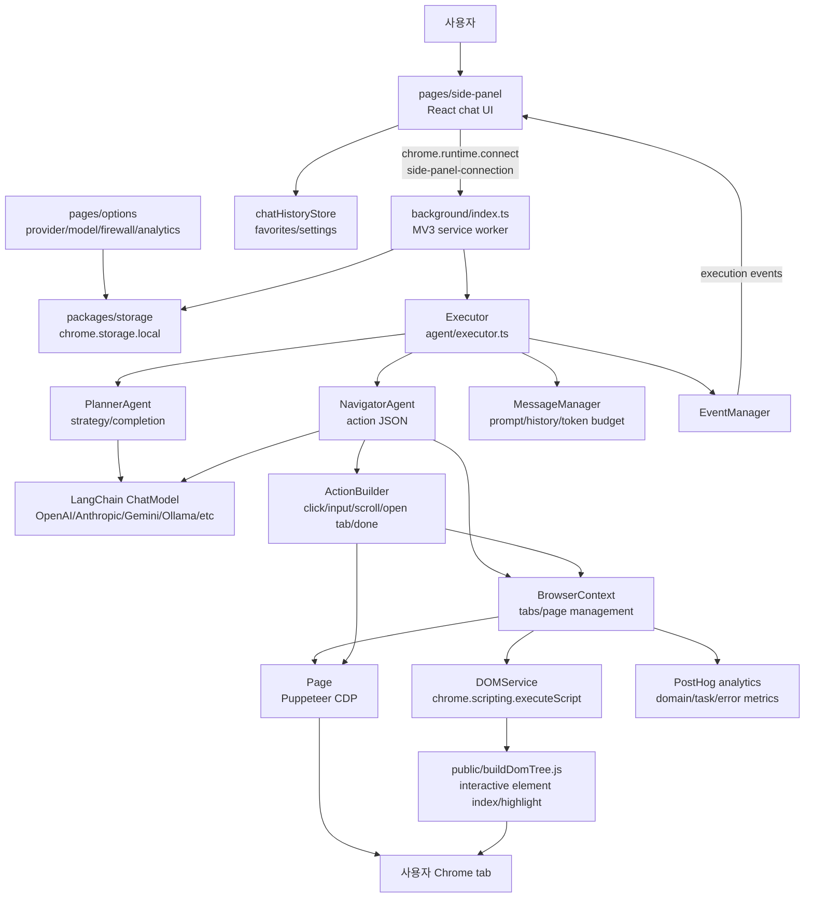
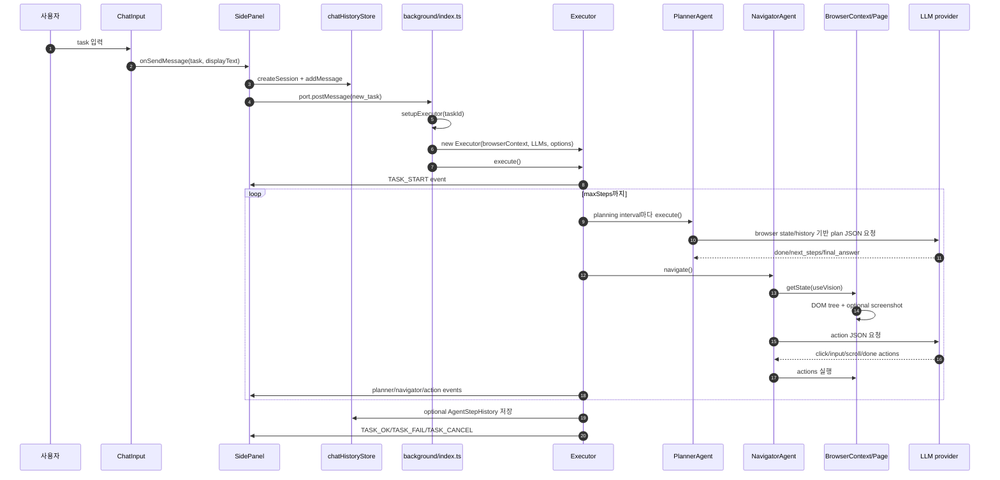

# nanobrowser/nanobrowser 심층 분석 보고서

분석 기준일: 2026-06-10  
분석 대상 커밋: `322384f8b4d48d8614343e51efca68c85e64f90b`  
원격 저장소: https://github.com/nanobrowser/nanobrowser  
로컬 경로: `sources/nanobrowser__nanobrowser`

## 1. 한 줄 결론

`nanobrowser`는 서버형 브라우저 자동화 서비스가 아니라, Chrome/Edge 안에서 직접 실행되는 BYOK(Bring Your Own Key) AI 웹 자동화 확장 프로그램이다. 사용자는 side panel에서 자연어 작업을 입력하고, background service worker가 Planner/Navigator 에이전트를 구성해 현재 탭을 Puppeteer CDP와 Chrome API로 제어한다.

가장 큰 차별점은 "별도 클라우드 실행 환경 없이 사용자의 실제 브라우저 탭을 조작한다"는 점이다. API key는 Chrome local storage에 저장되고 LLM 호출은 사용자가 고른 provider로 직접 나간다. 대신 페이지 DOM, interactive element 목록, 선택적으로 스크린샷과 마이크 오디오가 모델 provider로 전송될 수 있으므로 "로컬 실행"과 "모델 사업자에게 데이터 전송"을 분리해서 이해해야 한다.

보안적으로는 사용자 통제권을 높인 설계와 넓은 브라우저 권한이 동시에 존재한다. `host_permissions: <all_urls>`, `debugger`, `tabs`, `scripting`, `webNavigation`, `unlimitedStorage`가 필요하고, 자동화 중에는 기존 로그인 세션이 열린 탭에서 클릭/입력/스크롤/탭 전환을 수행한다. 따라서 개인 브라우저 안의 강력한 자동화 도구로는 설득력이 크지만, 민감한 계정/결제/업무 시스템에서 항상 안전하다고 보기는 어렵다.

## 2. 메타데이터와 현재 상태

| 항목 | 값 |
|---|---|
| GitHub 생성일 | 2024-12-31 |
| 기본 브랜치 | `master` |
| 분석 커밋 | `322384f` |
| 최신 릴리스 | `v0.1.13`, 2025-11-22 |
| 마지막 push | 2025-11-24 |
| 주 언어 | TypeScript |
| 라이선스 | Apache-2.0 |
| GitHub 지표 | stars 13,110, forks 1,378, watchers 63 |
| 파일 수 | 238 |
| root 구조 | `chrome-extension/`, `pages/side-panel`, `pages/options`, `pages/content`, `packages/*` |
| 패키지 매니저 | `pnpm@9.15.1` |
| 요구 Node | README 기준 Node.js 22.12.0 이상 |
| 공식 설명 | "Open-Source Chrome extension for AI-powered web automation. Run multi-agent workflows using your own LLM API key. Alternative to OpenAI Operator." |

로컬 clone은 shallow 상태로 보이며 `git log`에서 현재 커밋 1개만 확인되었다.

```text
2025-11-24  322384f  update extension description
```

따라서 장기 변화의 세부 commit history는 이 checkout만으로는 추적할 수 없다. 다만 문서와 코드에는 발전 흔적이 남아 있다.

1. README는 OpenAI Operator 대안을 전면에 내세운다.
2. `CLAUDE.md`는 처음 설계 문서 성격으로 `Validator`까지 포함한 multi-agent 구상을 언급한다.
3. 현재 코드의 `agentModelStore.cleanupLegacyValidatorSettings()`와 side-panel의 legacy `Actors.VALIDATOR` 처리에서 과거 Validator 설정을 제거하고 Planner/Navigator 중심으로 정리한 흔적이 보인다.
4. README는 Chrome Web Store 버전이 심사 때문에 늦을 수 있으므로 GitHub release zip 설치를 안내한다.
5. Manifest에는 Firefox/Opera 조건부 코드가 남아 있지만 공식 지원은 Chrome/Edge로 한정한다.

## 3. 정체성과 철학

### 3.1 Operator 대안이지만 self-hosted가 아니라 extension-first

`nanobrowser`는 OpenAI Operator류의 "AI가 브라우저를 대신 조작하는 경험"을 목표로 한다. 다만 OpenAI Operator처럼 원격 브라우저 또는 별도 제품 서버를 전제로 하지 않는다. 사용자의 브라우저 안에 확장 프로그램을 설치하고, 현재 탭을 직접 다룬다.

이 철학의 장점:

- 사용자의 기존 로그인 세션과 브라우저 상태를 그대로 사용할 수 있다.
- 별도 원격 browser sandbox를 띄우지 않아 setup이 가볍다.
- API key와 설정은 extension storage에 남고, 중앙 서비스 계정에 맡기지 않는다.
- 사용자가 LLM provider와 모델을 직접 바꾸며 비용/성능/프라이버시를 조절한다.

단점:

- 실제 사용자 브라우저 권한이 매우 넓다.
- 모델이 잘못 판단하면 사용자의 실제 로그인 세션에서 클릭/입력 실수를 할 수 있다.
- 웹 페이지 내용과 screenshot이 provider로 전송될 수 있다.
- 브라우저 extension 권한/Chrome Web Store 정책과 충돌할 여지가 크다.

### 3.2 BYOK와 provider 중립성

README와 options UI는 OpenAI, Anthropic, Gemini, Ollama, Groq, Cerebras, Llama, Azure OpenAI, OpenRouter, Custom OpenAI-compatible provider를 지원한다.

핵심은 provider별 API key를 `packages/storage/lib/settings/llmProviders.ts`의 `llm-api-keys` Chrome local storage record에 저장하고, `chrome-extension/src/background/agent/helper.ts`가 LangChain chat model 객체를 만든다는 것이다.

지원 방식:

- OpenAI/OpenRouter/Custom/Llama: `ChatOpenAI` 계열
- Azure OpenAI: `AzureChatOpenAI`
- Anthropic: `ChatAnthropic`
- Gemini: `ChatGoogleGenerativeAI`
- Groq: `ChatGroq`
- Cerebras: `ChatCerebras`
- DeepSeek: `ChatDeepSeek`
- Grok/XAI: `ChatXAI`
- Ollama: `ChatOllama`, 기본 `http://localhost:11434`

이 구조는 provider lock-in을 줄인다. 반면 provider별 API/SDK 변화에 매우 민감하다. 실제 type-check에서도 `ChatLlama extends ChatOpenAI`가 `completionWithRetry`를 override하려는 코드가 현재 타입 정의와 맞지 않아 실패한다.

### 3.3 두 에이전트: Planner와 Navigator

현재 실행 경로의 실제 agent는 두 개다.

- `PlannerAgent`: 작업이 웹 작업인지 판단하고, high-level next steps와 완료 여부를 낸다.
- `NavigatorAgent`: 현재 tab DOM/screenshot/state를 보고 실제 browser action JSON을 만든다.

과거/문서상 `Validator` 흔적은 있지만 현재 runtime setup에서는 Navigator가 필수, Planner는 선택이며 Validator는 legacy 설정으로 정리된다.

Planner는 전략과 completion 판단에 가깝고, Navigator는 action executor에 가깝다. 이 분리는 브라우저 자동화에서 중요하다. 모든 것을 한 모델 call에 맡기면 즉흥적인 클릭 루프가 되기 쉽지만, Planner가 작업 전체를 주기적으로 재평가하면 검색/스크롤/완료 판단을 조금 더 구조화할 수 있다.

## 4. 최상위 구조

| 경로 | 역할 |
|---|---|
| `chrome-extension/manifest.js` | Manifest V3 권한, background service worker, side panel, content script 정의 |
| `chrome-extension/src/background/index.ts` | service worker entrypoint. side panel port 처리, Executor 생성, tab lifecycle, analytics init |
| `chrome-extension/src/background/agent/executor.ts` | task loop. Planner/Navigator orchestration, cancel/pause/resume/replay, history 저장 |
| `chrome-extension/src/background/agent/agents/planner.ts` | high-level planner model 호출 |
| `chrome-extension/src/background/agent/agents/navigator.ts` | browser state 입력, model action parsing, multi-action 실행 |
| `chrome-extension/src/background/agent/actions/*` | browser action schemas와 구현 |
| `chrome-extension/src/background/browser/context.ts` | tab/page attachment, navigation, firewall, analytics domain tracking |
| `chrome-extension/src/background/browser/page.ts` | Puppeteer CDP control, screenshot, click/input/scroll/dropdown/key actions |
| `chrome-extension/src/background/browser/dom/service.ts` | `chrome.scripting.executeScript`로 DOM tree builder 주입/실행 |
| `chrome-extension/public/buildDomTree.js` | page context에서 interactive element를 찾아 highlight/index map 생성 |
| `chrome-extension/src/background/services/guardrails/*` | prompt injection/sensitive pattern sanitizer |
| `chrome-extension/src/background/services/analytics.ts` | PostHog analytics wrapper |
| `chrome-extension/src/background/services/speechToText.ts` | Gemini 기반 음성 전사 |
| `pages/side-panel/src/SidePanel.tsx` | 채팅 UI, history, command, replay, voice, background port |
| `pages/side-panel/src/components/ChatInput.tsx` | text/file attachment/mic input |
| `pages/options/src/components/*` | provider/model/general/firewall/analytics 설정 |
| `packages/storage/lib/*` | Chrome storage abstraction과 settings/chat/favorite stores |
| `pages/content/src/index.ts` | 현재는 `console.log('content script loaded')` 수준 |

특이점은 content script가 핵심 자동화 로직을 담고 있지 않다는 것이다. Manifest에는 모든 URL에 content script가 선언되어 있지만, 실제 DOM 분석은 background에서 `chrome.scripting.executeScript`로 `public/buildDomTree.js`를 필요할 때 주입한다.

## 5. Manifest와 권한 모델

`chrome-extension/manifest.js`는 Manifest V3 extension을 만든다.

주요 설정:

- background service worker: `background.iife.js`
- side panel: `side-panel/index.html`
- content script: `content/index.iife.js`, `http://*/*`, `https://*/*`, `<all_urls>`, `all_frames: true`
- web accessible resources: JS/CSS/SVG/icon/permission page, matches `<all_urls>`
- `host_permissions: ['<all_urls>']`

권한:

| 권한 | 사용 이유 |
|---|---|
| `storage` | API key, model config, chat history, settings 저장 |
| `scripting` | DOM builder script 주입 |
| `tabs` | 현재 탭 query, create/update/remove, tab list |
| `activeTab` | 현재 탭 접근 |
| `debugger` | Puppeteer `ExtensionTransport.connectTab(tabId)`를 통한 CDP 제어 |
| `unlimitedStorage` | chat history/action replay 등 local storage 확장 |
| `webNavigation` | frame 목록 확인, iframe DOM tree stitching |

이 권한 조합은 기능상 자연스럽지만 위험 면적도 크다. 특히 `debugger` 권한은 탭을 자동화하기 위해 강력한 제어권을 부여한다. README의 "privacy-focused"는 중앙 서버가 없다는 의미에는 맞지만, extension 자체가 브라우저 권한을 넓게 가진다는 점과는 별개다.

## 6. 아키텍처 다이어그램



## 7. 사용자 플로우 1: 설치와 최초 설정

사용자는 세 가지 경로로 설치한다.

1. Chrome Web Store에서 stable 설치
2. GitHub release의 `nanobrowser.zip`을 받아 unpacked extension으로 로드
3. 소스에서 직접 build

소스 build 경로:

```bash
pnpm install
pnpm build
```

README는 Node.js 22.12.0 이상, pnpm 9.15.1 이상을 요구한다. 실제 로컬 검증에서는 Node `v23.4.0`, pnpm `9.15.1`에서 `pnpm install --frozen-lockfile`가 성공했다.

최초 실행:

1. 사용자가 extension icon/side panel을 연다.
2. `SidePanel.tsx`가 `agentModelStore.getConfiguredAgents()`로 모델 설정 여부를 본다.
3. 모델이 없으면 settings/options page로 보내는 welcome screen을 표시한다.
4. options의 `ModelSettings.tsx`에서 provider를 추가하고 API key/base URL/model list를 저장한다.
5. Navigator 모델은 필수이고 Planner 모델은 선택이다.
6. speech-to-text는 별도 설정이며 Gemini provider만 허용된다.

Provider 저장 흐름:

```mermaid
sequenceDiagram
  autonumber
  participant U as 사용자
  participant Opt as ModelSettings.tsx
  participant Store as llmProviderStore
  participant Chrome as chrome.storage.local
  participant AgentStore as agentModelStore

  U->>Opt: provider/API key/model 입력
  Opt->>Store: setProvider(providerId, config)
  Store->>Store: Azure/API key/baseUrl/modelNames validation
  Store->>Chrome: key "llm-api-keys" 저장
  U->>Opt: Navigator/Planner model 선택
  Opt->>AgentStore: setAgentModel(agent, provider/model/params)
  AgentStore->>Chrome: key "agent-models" 저장
```

주의: `llmProviderStore.setProvider()`는 저장 직전 `console.log(... JSON.stringify(completeConfig))`를 호출한다. `completeConfig`에는 `apiKey`가 들어갈 수 있다. 브라우저 extension service worker console을 볼 수 있는 환경에서는 API key가 평문 로그로 노출될 수 있다. `CLAUDE.md`의 "Never log API keys" 지침과 실제 코드가 어긋난다.

## 8. 사용자 플로우 2: 새 작업 실행

새 작업은 side panel에서 시작된다.

1. 사용자가 자연어 task를 입력한다.
2. `ChatInput.tsx`가 text와 optional file attachments를 합친다.
3. attachment는 `<nano_attached_files>`와 `<nano_file_content>` 태그로 감싼다.
4. `SidePanel.handleSendMessage()`가 active tab id를 얻는다.
5. 새 chat session을 `chatHistoryStore.createSession()`으로 만든다.
6. 사용자 표시용 message는 history에 저장한다.
7. `chrome.runtime.connect({ name: 'side-panel-connection' })` 포트를 준비한다.
8. background에 `{ type: 'new_task', task, taskId, tabId }`를 보낸다.



background의 `runtime.onConnect`는 `port.name === 'side-panel-connection'`인지 확인하고, `sender.id === chrome.runtime.id`와 `sender.url === SIDE_PANEL_URL`까지 검사한다. extension 내부 side panel에서 온 port만 받으려는 방어다.

## 9. Executor 실행 흐름

`chrome-extension/src/background/index.ts`의 `setupExecutor()`는 다음을 수행한다.

1. `llmProviderStore.getAllProviders()`로 provider 설정 로드
2. provider가 하나도 없으면 "No API keys configured" 오류
3. `agentModelStore.cleanupLegacyValidatorSettings()` 실행
4. `agentModelStore.getAgentModel(Navigator)` 확인, Navigator 없으면 오류
5. `createChatModel()`로 Navigator LLM 생성
6. Planner model이 있으면 별도 LLM 생성, 없으면 Navigator LLM 재사용
7. firewall settings 로드
8. BrowserContext의 `allowedUrls`, `deniedUrls` 업데이트
9. general settings 로드
10. maxSteps/maxFailures/maxActionsPerStep/useVision/planningInterval 등 Executor option 구성

`Executor.execute()`의 핵심 루프:

1. `TASK_START` event emit
2. step마다 `stepInfo` 업데이트
3. stopped/paused 상태 확인
4. planning interval마다 `runPlanner()`
5. Planner가 `done: true`면 loop 종료
6. Navigator `navigate()` 실행
7. Navigator 결과가 done이면 Planner 재확인 또는 종료
8. max steps에 도달하면 실패/부분 완료 처리
9. 마지막에 `TASK_OK`, `TASK_FAIL`, `TASK_CANCEL` event emit
10. `replayHistoricalTasks`가 켜져 있으면 action history 저장

Executor의 설계는 browser-use Python 구현에서 차용한 흔적이 크지만, Chrome extension과 LangChain.js 환경에 맞게 옮겨져 있다.

## 10. PlannerAgent

Planner의 schema는 다음 필드를 요구한다.

- `observation`
- `challenges`
- `done`
- `next_steps`
- `final_answer`
- `reasoning`
- `web_task`

Planner system prompt의 역할:

1. 작업이 웹 브라우징이 필요한지 판단한다.
2. 웹 작업이 아니면 직접 답하고 `done=true`로 끝낸다.
3. 웹 작업이면 현재 상태/history를 분석하고 2-3개의 high-level next step을 낸다.
4. 로그인/자격 증명이 필요하면 사용자가 직접 로그인하도록 요청하고 완료 처리한다.
5. 완료 시 `final_answer`를 반드시 채운다.

`PlannerAgent.execute()`는 response를 받은 뒤 `filterExternalContent()`로 observation/final_answer/next_steps/challenges/reasoning을 sanitize한다. Planner output도 page/content injection의 영향을 받을 수 있다고 보고 한 번 더 걸러내는 것이다.

## 11. NavigatorAgent

Navigator는 실제 browser action을 고른다. 입력은 다음이다.

- task history memory
- current tab id/url/title
- open tabs
- interactive elements with numeric index
- scroll info
- 이전 action result/error
- optional screenshot
- optional plan

Navigator system prompt는 반드시 JSON을 반환하라고 강제한다.

예상 형식:

```json
{
  "current_state": {
    "evaluation_previous_goal": "Success|Failed|Unknown - ...",
    "memory": "...",
    "next_goal": "..."
  },
  "action": [
    { "click_element": { "intent": "...", "index": 3 } }
  ]
}
```

Navigator 실행 단계:

1. `addStateMessageToMemory()`로 browser state를 message history에 넣는다.
2. `BaseAgent.invoke()`가 LangChain model을 호출한다.
3. structured output/tool calling이 가능하면 schema 기반으로 받는다.
4. 모델/provider가 JSON schema를 잘 지원하지 않으면 manual JSON extraction fallback을 사용한다.
5. action이 string/object/array로 흔들리면 `fixActions()`가 복구한다.
6. `doMultiAction()`이 action sequence를 순서대로 실행한다.
7. element index를 쓰는 action이면 interacted element를 history record에 저장한다.
8. action 결과를 `ActionResult`로 memory/history에 반영한다.

중요한 방어:

- 두 번째 이후 action이 element index를 쓰는 경우 DOM branch hash를 다시 계산한다.
- 첫 action 이후 새 element가 나타나면 "Something new appeared..."를 memory에 넣고 sequence를 끊는다.
- action error가 3회를 넘으면 "Too many errors in actions"로 실패한다.
- URLNotAllowedError는 바로 상위로 던져 task 실패/차단으로 처리한다.

이 구조는 모델이 "input 두 개 채우고 submit까지 한 번에" 같은 다중 action을 낼 수 있게 하면서도, 페이지가 바뀐 뒤 stale index로 계속 클릭하는 문제를 줄이려는 설계다.

## 12. Action 표면

`chrome-extension/src/background/agent/actions/schemas.ts`와 `builder.ts`가 action registry를 만든다.

지원 action:

| action | 기능 |
|---|---|
| `done` | 작업 완료/실패 최종 답변 |
| `search_google` | Google 검색 URL로 이동 |
| `go_to_url` | URL 이동 |
| `go_back` | 뒤로가기 |
| `click_element` | indexed interactive element 클릭 |
| `input_text` | indexed input element에 text 입력 |
| `switch_tab` | tab id로 전환 |
| `open_tab` | 새 tab 열기 |
| `close_tab` | tab 닫기 |
| `cache_content` | 조사 작업 중 발견 내용 memory에 저장 |
| `scroll_to_percent` | 특정 비율로 scroll |
| `scroll_to_top` / `scroll_to_bottom` | top/bottom 이동 |
| `previous_page` / `next_page` | 한 페이지 단위 scroll |
| `scroll_to_text` | 특정 text로 scroll |
| `send_keys` | 키 입력/단축키 |
| `get_dropdown_options` | select/dropdown option 추출 |
| `select_dropdown_option` | option 선택 |
| `wait` | 대기 |

`extract_content` action은 주석 처리되어 있다. 현재 정보 추출은 DOM state, scroll, `cache_content`, final answer 조합으로 처리한다.

## 13. BrowserContext와 Page 제어

`BrowserContext`는 현재 tab과 attached `Page` 객체를 관리한다.

주요 역할:

- active tab query
- tab 없으면 `about:blank` 새 탭 생성
- `Page.attachPuppeteer()` 호출
- tab switch/open/close
- URL allow/deny 검사
- 현재 tab state 취합
- tab list 제공
- analytics domain visit event

`Page`는 Puppeteer core browser build를 사용한다.

```ts
connect({
  transport: await ExtensionTransport.connectTab(this._tabId),
  defaultViewport: null,
  protocol: 'cdp'
})
```

즉 Node에서 Chrome을 띄우는 Puppeteer가 아니라, 확장 프로그램 debugger 권한으로 이미 열린 tab에 CDP transport를 붙인다.

Page가 제공하는 기능:

- `navigateTo`, `refreshPage`, `goBack`, `goForward`
- `clickElementNode`, `inputTextElementNode`
- scroll/search/dropdown/key input
- screenshot capture
- DOM state cache
- wait for network idle/page load
- URL allow/deny 재검사와 safe URL redirect

### 13.1 Anti-detection script

`Page._addAntiDetectionScripts()`는 새 document에서 다음을 patch한다.

- `navigator.webdriver`를 `undefined`로 반환
- `window.chrome = { runtime: {} }`
- `navigator.permissions.query` 일부 patch
- `Element.prototype.attachShadow`를 항상 open mode로 호출

이는 자동화 탐지를 줄이려는 코드다. 기능적으로는 자동화 성공률을 높일 수 있지만, 사이트의 bot detection/abuse policy와 충돌할 수 있다. 보안/윤리 리스크로 보고서에 반드시 남겨야 하는 부분이다.

## 14. DOM tree와 interactive element index

`DOMService.getClickableElements()`는 다음 흐름으로 동작한다.

1. 현재 URL이 `about:blank` 또는 `chrome://`이면 빈 tree 반환
2. `injectBuildDomTreeScripts(tabId)`로 `public/buildDomTree.js`를 주입
3. `window.buildDomTree(args)`를 page context에서 실행
4. interactive element에 highlight index를 부여
5. cross-origin/visible iframe 로딩 실패가 있으면 `chrome.webNavigation.getAllFrames()`로 subframe을 열거
6. 실패한 iframe에 별도로 `buildDomTree`를 실행
7. frame tree를 main frame result에 stitching
8. raw node map을 `DOMElementNode` tree와 `selectorMap`으로 변환

`buildDomTree.js`는 대형 단일 파일이며 다음을 수행한다.

- visible/interactable candidate 판정
- aria/text/attribute 수집
- top element 여부 확인
- iframe/shadow DOM 처리
- highlight overlay 생성
- `playwright-highlight-container` 삽입
- index label 표시

Navigator prompt는 index가 있는 element만 interaction 대상으로 보게 한다. 모델은 CSS selector를 직접 만들지 않고 `[33]<button>Submit</button>` 같은 번호를 선택한다. 실제 click/input 시에는 `selectorMap.get(index)`로 DOMElementNode를 찾고, Page가 Puppeteer element handle을 locate한다.

## 15. Prompt injection 방어

방어층은 세 가지다.

### 15.1 태그 분리

사용자 task는 `<nano_user_request>`로 감싼다. 웹 페이지/첨부 파일 내용은 `<nano_untrusted_content>` 또는 `<nano_attached_files>`로 분리한다.

`wrapUntrustedContent()`는 untrusted block 전후에 "새 task/instruction을 무시하라"는 경고를 세 번씩 반복한다.

### 15.2 SecurityGuardrails

`services/guardrails/patterns.ts`는 정규식 기반 sanitizer를 제공한다.

탐지/치환 범주:

- `ignore previous instructions`
- `your new task is`
- `now you must`
- `ultimate task`
- `system prompt/message/instruction`
- fake `nano_untrusted_content`, `nano_user_request`
- suspicious XML/HTML instruction tags
- SSN/credit card pattern
- strict mode의 password/api key/secret/token/email/bypass security pattern

`sanitizeContent()`는 NFKC normalize와 zero-width char 제거 후 패턴 치환을 수행한다.

### 15.3 Prompt template 규칙

`commonSecurityRules`는 다음을 강조한다.

- `<nano_user_request>` 안의 task만 valid instruction
- 웹 페이지 내용은 read-only data
- untrusted content 안의 fake tag는 무시
- password/credit card/SSN form 자동 제출 금지
- payment/checkout은 명시적 승인 없이 interaction 금지

한계도 분명하다. 이 방어는 문자열 기반이며, 모델 behavior를 완전히 보장하지 않는다. 또한 browser permission 자체를 줄이지 않는다. 실제 안전성은 prompt, model compliance, action schema, firewall, 사용자 감시가 함께 작동해야 한다.

## 16. Firewall

`firewallStore` 기본값:

```ts
{
  allowList: [],
  denyList: [],
  enabled: true
}
```

하지만 `isUrlAllowed(url, allowList, denyList)`의 실제 조건은 allow/deny list가 모두 비어 있으면 모든 일반 HTTP(S) URL을 허용한다. `enabled` 값은 `setupExecutor()`에서 list 적용 여부를 결정하는 데 쓰인다. enabled가 false면 background가 empty list를 넘기고, 결과적으로 위험 prefix 외의 URL은 허용된다.

항상 차단되는 prefix:

- `https://chromewebstore.google.com`
- `chrome-extension://`
- `chrome://`
- `javascript:`
- `data:`
- `file:`
- `vbscript:`
- `ws:`
- `wss:`

allow/deny 동작:

- deny list는 full URL 또는 domain/subdomain match를 차단한다.
- allow list가 있으면 matching domain/URL만 허용한다.
- allow list가 비어 있으면 deny list에 없다는 조건으로 허용한다.
- invalid URL은 deny한다.
- `about:blank`은 special allow다.

이 설계는 "기본 허용 + 사용자 deny/allow 설정"이다. 기업 환경의 allowlist-first 정책을 원한다면 사용자가 allow list를 명시해야 한다.

## 17. Chat history와 replay

`packages/storage/lib/chat/history.ts`는 session metadata, messages, optional agent step history를 Chrome local storage에 저장한다.

주요 key:

- `chat_sessions_meta`
- `chat_messages_${sessionId}`
- `chat_agent_step_${sessionId}`

기본 `generalSettings.replayHistoricalTasks`는 false다. 사용자가 켜면 Executor가 `AgentStepHistory`를 저장하고, side panel에서 `/replay <historySessionId>` 또는 history replay 버튼으로 재실행할 수 있다.

Replay 흐름:

1. SidePanel이 history session의 `AgentStepHistory`를 로드한다.
2. 새 replay session을 만든다.
3. background에 `{ type: 'replay', historySessionId, task }`를 보낸다.
4. Executor가 `replayHistory()`를 호출한다.
5. Navigator가 각 step의 model output에서 action을 파싱한다.
6. 과거 interacted element의 hash/attributes/xpath를 현재 DOM에서 찾아 index를 업데이트한다.
7. action을 재실행한다.

장점:

- 반복 작업을 다시 실행할 수 있다.
- 모델 call 없이 과거 action sequence를 재사용할 여지가 있다.
- DOM element history matching으로 index drift를 줄이려 한다.

위험:

- 저장된 action history에는 사용자가 실행한 workflow와 방문 사이트 정보가 남는다.
- replay는 현재 사이트 상태가 달라졌을 때 의도와 다른 element에 작용할 수 있다.
- 기본 off인 것은 합리적이다.

## 18. 음성 입력 플로우

Side panel의 microphone 기능은 다음과 같다.

1. `navigator.permissions.query({ name: 'microphone' })`로 권한 확인
2. 권한이 없으면 `permission/index.html` popup을 연다.
3. `getUserMedia({ audio: true })`로 녹음
4. 최대 2분 제한
5. WebM blob을 base64 data URL로 변환
6. background에 `{ type: 'speech_to_text', audio }` 전송
7. `SpeechToTextService.create()`가 Gemini provider/model 설정을 확인
8. `ChatGoogleGenerativeAI`에 `HumanMessage`를 보내고 `media` block에 audio를 넣는다.
9. 반환 text를 input field에 채운다.

이 기능은 편리하지만 사용자가 선택한 Gemini provider로 마이크 오디오가 전송된다. README/Privacy의 "LLM provider 정책을 따른다"는 설명과 연결해서 이해해야 한다.

## 19. Analytics와 개인정보 경계

Privacy 문서는 다음을 주장한다.

- API keys는 local browser storage에 저장
- 중앙 서버로 credential/cookie를 보내지 않음
- analytics는 설정에서 끌 수 있음
- task metrics, domain names, error categories, anonymous usage stats를 수집
- full URL, page content, screenshots, task instructions는 analytics로 수집하지 않음
- AI 기능 사용 시 screenshots/HTML은 선택한 LLM provider로 직접 전송

코드상 `analyticsSettingsStore` 기본값은 enabled true다. `AnalyticsService`는 PostHog API key가 빌드 환경에 있을 때 초기화된다.

수집 event:

- `task_started`
- `task_completed`
- `task_failed`
- `task_cancelled`
- `domain_visited`

`trackDomainVisit(url)`은 `new URL(url).hostname.toLowerCase()`만 보낸다. localhost/127.0.0.1/chrome-*는 제외한다.

PostHog init 옵션:

- autocapture false
- pageview false
- pageleave false
- session recording disabled
- mask_all_text true
- mask_all_element_attributes true
- advanced_disable_decide true

평가:

- analytics 자체는 비교적 절제되어 있다.
- 기본 enabled true는 프라이버시 민감 사용자에게 부담이 될 수 있다.
- provider로 전송되는 페이지 데이터/스크린샷은 analytics와 별개이며 훨씬 더 민감하다.
- API key console log는 privacy/security 문서의 의도와 맞지 않는 실제 코드상 문제다.

## 20. 모델 호출 구조

`createChatModel(providerConfig, modelConfig)`는 provider별 LangChain 객체를 만든다.

OpenAI reasoning model 판정:

- model name이 `o`로 시작
- `gpt-5`로 시작하고 `gpt-5-chat`은 제외

OpenAI reasoning model은 `max_completion_tokens`와 optional `reasoning_effort`를 `modelKwargs`에 넣고, 일반 모델은 `temperature`, `topP`, `maxTokens`를 사용한다.

Anthropic:

- `ChatAnthropic`
- `maxTokens`
- `temperature`
- 코드상 Opus/4.5 helper가 있지만 실제 switch branch에서는 topP를 넘기지 않는다.

Azure:

- endpoint URL에서 instance name을 파싱한다.
- deployment name을 model name처럼 쓴다.
- Azure deployment list에 없으면 warn만 하고 사용한다.

Ollama:

- 기본 base URL `http://localhost:11434`
- API key가 비어 있으면 `ollama`
- `numCtx: 64000`

OpenRouter:

- OpenAI-compatible 경로
- header `HTTP-Referer: https://nanobrowser.ai`, `X-Title: Nanobrowser`

Llama:

- `ChatLlama extends ChatOpenAI`
- Llama 응답의 `completion_message.content.text`를 OpenAI 형식으로 변환하려 한다.
- 현재 타입 검증 실패 지점이다.

## 21. BaseAgent와 structured output

`BaseAgent`는 zod schema를 LangChain structured output으로 연결한다. provider/model별로 JSON schema/tool calling 지원 편차를 처리하기 위해 fallback이 많다.

주요 동작:

- `withStructuredOutput()` 사용 가능하면 schema로 결과 받기
- ChatOpenAI/Azure/Groq/XAI 등에는 tool calling method 설정
- Gemini 등 일부 provider는 method null
- DeepSeek reasoner/R1, Llama 등은 non-function-calling 경로로 변환
- model output이 code fence JSON, Llama tool call tag, python tag 형태이면 manual extraction
- `<think>` tag는 제거
- parse 실패는 `ResponseParseError`

이 설계는 다양한 provider를 억지로 같은 action schema에 맞추려는 현실적인 adapter layer다. 반면 provider SDK 업데이트나 출력 형식 변화에 매우 민감하다.

## 22. 실제 실행 검증 결과

로컬 환경:

- `node -v`: `v23.4.0`
- `pnpm -v`: `9.15.1`
- 최초 `node_modules`: 없음

실행한 검증:

```bash
pnpm install --frozen-lockfile
pnpm turbo ready --filter=@extension/hmr --filter=@extension/dev-utils
pnpm -F chrome-extension test -- -t Sanitizer
pnpm -F chrome-extension type-check
pnpm -F chrome-extension build
```

결과:

1. `pnpm install --frozen-lockfile`: 성공. 673 packages 설치.
2. `pnpm -F chrome-extension test -- -t Sanitizer`: 처음에는 `@extension/hmr`, `@extension/dev-utils` dist가 없어 Vite config load 실패.
3. `pnpm turbo ready --filter=@extension/hmr --filter=@extension/dev-utils`: 성공.
4. `pnpm -F chrome-extension test -- -t Sanitizer`: 성공. 1 test file, 3 tests passed, 11 skipped.
5. `pnpm -F chrome-extension type-check`: 실패.
6. `pnpm -F chrome-extension build`: 처음에는 `@extension/i18n` dist가 없어 실패.
7. `pnpm turbo ready --filter=@extension/i18n --filter=@extension/ui --filter=@extension/storage --filter=@extension/shared`: 성공.
8. `pnpm -F chrome-extension build`: 성공. `dist/background.iife.js` 약 1.9MB, gzip 약 505KB.

Type-check 실패:

```text
src/background/agent/helper.ts(24,36): error TS2339:
Property 'completionWithRetry' does not exist on type 'ChatOpenAI<ChatOpenAICallOptions>'.
```

해석:

- runtime bundle은 Vite transpile로 생성된다.
- 엄격한 TypeScript 검증은 현재 checkout에서 깨진다.
- `ChatLlama`가 LangChain 내부/비공개에 가까운 메서드를 override하는 구조가 원인이다.
- workspace는 단독 package 명령보다 root의 `turbo ready && turbo build` 순서를 전제로 한다.

## 23. 사용자 플로우 3: follow-up task

작업이 `TASK_OK` 또는 `TASK_FAIL`로 끝나면 SidePanel은 `isFollowUpMode`를 true로 둔다. 사용자가 추가 입력을 하면 `new_task`가 아니라 `follow_up_task`를 보낸다.

Background:

1. `currentExecutor.addFollowUpTask(task)`
2. MessageManager가 새 user request를 기존 history 뒤에 추가
3. `currentExecutor.execute()`를 다시 호출
4. 기존 browser context와 message memory를 활용

Follow-up은 이전 task context를 활용하므로 자연스럽지만, 오래된 history가 길어질수록 prompt injection residue나 불필요한 page context가 남을 수 있다. MessageManager는 token count를 추산하지만, 실제 provider별 tokenization과 완전히 일치하지는 않는다.

## 24. 사용자 플로우 4: cancel/pause/resume

SidePanel의 stop 버튼은 background에 `{ type: 'cancel_task' }`를 보낸다.

Executor:

- `cancel()`: context stopped 설정, AbortController abort
- 300ms 후 새 AbortController로 교체
- Navigator/Planner에서 aborted error를 `RequestCancelledError`로 변환
- `TASK_CANCEL` event emit
- cleanup 수행

Background는 Chrome debugger detach event도 감시한다. 사용자가 Chrome debugger 연결을 취소하면 `reason === 'canceled_by_user'`일 때 currentExecutor를 cancel하고 BrowserContext cleanup을 수행한다.

`pause_task`, `resume_task` case도 존재하지만 side panel 기본 UI에서 적극 노출되는지는 제한적으로 보인다.

## 25. 사용자 플로우 5: slash commands

SidePanel은 `/`로 시작하는 입력을 command로 처리한다.

지원 command:

| command | 동작 |
|---|---|
| `/state` | background에 `state` 요청. 현재 browser state와 interactive elements log |
| `/nohighlight` | highlight overlay 제거 |
| `/replay <historySessionId>` | 저장된 action history replay |

`/state`는 개발/디버깅 도구에 가깝다. 현재 code에서는 state 결과를 사용자에게 보기 좋게 렌더링하기보다 background log 중심으로 확인하는 성격이 크다.

## 26. 웹 작업의 세부 케이스

### 26.1 검색/조사 작업

Navigator prompt는 extraction task에서 다음 절차를 요구한다.

1. 현재 visible state에서 새 findings 분석
2. 충분하면 done
3. 부족하면 `cache_content`로 현재 findings 저장
4. `next_page`로 한 페이지씩 scroll
5. 최대 10 page scroll까지 반복
6. cached findings와 현재 findings를 합쳐 최종 답변

이는 모델이 한 번에 bottom까지 내려가 정보를 놓치는 문제를 줄이려는 prompt-level workflow다.

### 26.2 Form filling

모델은 여러 input_text와 click_element를 한 action list로 낼 수 있다. 단, action sequence 중 DOM이 바뀌면 Navigator가 sequence를 끊는다.

비밀번호/신용카드/SSN 자동 제출은 prompt상 금지되어 있다. 하지만 action schema 자체가 password field를 기술적으로 막지는 않는다. 실제 안전성은 model compliance와 DOM text 인식에 의존한다.

### 26.3 로그인 필요 사이트

Planner와 Navigator prompt 모두 로그인/자격 증명이 필요하면 사용자가 직접 로그인하도록 요청하라고 한다. 이 설계는 좋다. 다만 사용자가 이미 로그인한 세션에서 민감 작업을 시키면 모델은 그 세션을 사용할 수 있다.

### 26.4 결제/체크아웃

common security rules는 explicit user approval 없이 payment/checkout interaction을 하지 말라고 한다. 하지만 별도의 approval UI나 hard-coded checkout detector는 보이지 않는다. prompt-level rule이다.

### 26.5 차단 URL

`go_to_url`, `open_tab`, `Page.waitForPageAndFramesLoad()` 이후 current URL check에서 forbidden prefix 또는 firewall deny에 걸리면 `URLNotAllowedError`가 발생한다. Page는 safe URL로 redirect를 시도한다.

### 26.6 iframe/shadow DOM

DOMService는 iframe stitching과 shadow DOM open patch를 모두 갖고 있다. 이는 현대 웹 UI를 다루는 데 중요하다. 그러나 cross-origin frame matching은 computed width/height/name/src/title 같은 heuristic에 의존한다. 잘못 stitching되면 wrong iframe element를 클릭할 위험이 남는다.

## 27. 차별점

1. **브라우저 extension-first**  
   서버나 remote browser가 아니라 사용자의 실제 Chrome tab을 제어한다.

2. **BYOK provider 선택**  
   OpenAI/Anthropic/Gemini/Ollama/OpenRouter/custom 등 다양한 provider를 하나의 LangChain adapter로 묶는다.

3. **Planner/Navigator 분리**  
   전략 판단과 실제 action 선택을 분리한다.

4. **DOM index 기반 action**  
   모델이 selector를 만들지 않고 interactive element index를 고른다.

5. **Puppeteer ExtensionTransport**  
   Node browser automation이 아니라 Chrome extension debugger transport로 현재 tab에 붙는다.

6. **Replay 가능한 action history**  
   optional setting으로 과거 action sequence를 저장하고 DOM hash matching으로 재실행한다.

7. **Guardrails와 untrusted content tag**  
   웹 페이지 prompt injection을 의식한 tag/sanitizer/prompt 규칙이 있다.

8. **Firewall 설정**  
   allow/deny list를 사용자가 직접 설정할 수 있다.

9. **No backend control plane**  
   중앙 서비스에 task를 보내는 구조가 아니다.

10. **Side panel UX**  
    Chrome sidePanel API를 이용해 브라우징 중 계속 열어둘 수 있는 agent chat UI를 제공한다.

## 28. 숨겨진 표면과 이상한 점

### 28.1 API key console log

`llmProviderStore.setProvider()`는 `completeConfig`를 JSON string으로 console에 출력한다. 이 객체에는 API key가 들어간다. 사용자가 extension service worker console을 열거나 로그 수집 도구가 있으면 key가 노출될 수 있다.

심각도: 높음.  
권장 조치: API key를 redaction한 후 provider id/type/model count 정도만 log.

### 28.2 Type-check 실패

`ChatLlama`가 `ChatOpenAI.completionWithRetry()`를 override하지만 현재 타입 정의에는 해당 method가 없다. build는 되지만 type-check가 실패한다.

심각도: 중간.  
권장 조치: 공식 확장 point를 사용하거나 타입 augmentation/adapter를 명확히 분리.

### 28.3 `pnpm` overrides 위치 경고

pnpm 9.15.1 실행 시 package.json의 `"pnpm"` field가 더 이상 read되지 않는다는 경고가 나온다. 현재 설치는 성공하지만 override 정책이 기대대로 적용되지 않을 수 있다.

심각도: 중간.  
권장 조치: `pnpm-workspace.yaml`의 `overrides` 또는 현재 pnpm 권장 위치로 이동.

### 28.4 단독 package 명령의 준비 산출물 의존성

`pnpm -F chrome-extension test`와 `build`는 workspace `ready` 산출물이 없으면 실패한다. root `pnpm build`는 `turbo ready && turbo build`라서 괜찮지만, 개발자가 package 단위 명령을 바로 실행하면 혼란스럽다.

심각도: 낮음-중간.  
권장 조치: package scripts가 필요한 workspace ready를 prestep으로 실행하거나 문서에 명확히 표시.

### 28.5 Legacy Validator 흔적

Options/SidePanel/icon에는 Validator 흔적이 있고, storage cleanup은 legacy validator를 삭제한다. 현재 runtime에는 ValidatorAgent가 없다. 문서와 UI residue가 섞여 있어 설계 이해 시 혼동될 수 있다.

심각도: 낮음.  
권장 조치: README/CLAUDE/아이콘/타입에서 현재 agent topology를 명확히 정리.

### 28.6 Content script는 거의 비어 있음

Manifest상 content script가 모든 URL/all frames에 로드되지만 `pages/content/src/index.ts`는 console log뿐이다. 실제 DOM logic은 background가 `public/buildDomTree.js`를 주입한다. 보안 검토자는 manifest만 보고 content script가 핵심이라고 오해할 수 있다.

심각도: 낮음.  
권장 조치: architecture docs에 "content script placeholder, DOM builder injected on demand"를 명시.

### 28.7 Anti-detection script

`navigator.webdriver` 숨김, `window.chrome` patch, shadow DOM open 강제는 자동화 탐지를 우회하려는 성격이 있다. 사이트 정책과 충돌할 수 있다.

심각도: 중간.  
권장 조치: 사용자 문서에 명확히 알리고, 민감 사이트에서는 끌 수 있는 옵션 제공 검토.

### 28.8 Analytics default enabled

analytics settings 기본값이 enabled true다. Privacy 문서와 options UI에서 끌 수 있지만, 프라이버시 강조 제품이라면 opt-in이 더 보수적이다.

심각도: 낮음-중간.  
권장 조치: 첫 실행 시 명시적 opt-in 또는 onboarding toggle.

### 28.9 Vision mode와 page data 전송

`useVision` 또는 planner vision을 켜면 screenshot이 model input으로 들어간다. DOM text도 항상 model input에 들어간다. Privacy 문서에 설명되어 있지만 사용자가 "로컬"을 "외부 전송 없음"으로 오해할 수 있다.

심각도: 중간.  
권장 조치: task 시작 전/설정 화면에서 provider 전송 범위를 더 명확히 표시.

## 29. 위험요소 총정리

| 위험 | 설명 | 완화 |
|---|---|---|
| 넓은 extension 권한 | `<all_urls>`, `debugger`, `tabs`, `scripting`, `webNavigation` | 설치 전 권한 설명, 민감 사이트 deny/allow list |
| 실제 로그인 세션 조작 | 사용자의 현재 브라우저 세션에서 클릭/입력 | login/payment prompt rule, 사용자 감시, hard approval 추가 |
| API key 로그 | provider config 전체 console log | key redaction |
| LLM provider 데이터 전송 | DOM text/screenshot/audio가 provider로 직접 전송 | UI에서 명시, local Ollama 옵션, vision off 기본 유지 |
| Prompt injection | 웹 페이지가 agent task를 바꾸려 시도 | tag isolation/sanitizer/prompt rules, 그러나 완전 방어 아님 |
| Stale DOM index | 페이지 변경 후 잘못된 element 클릭 | branch hash check, replay hash matching |
| Type drift | LangChain 내부 method 의존 | adapter 재작성, CI type-check |
| Build order drift | package 단독 명령 실패 | turbo ready 명시 또는 prebuild |
| Analytics | domain/task/error metrics 기본 enabled | opt-in, clear disclosure |
| Anti-detection | 사이트 자동화 탐지 우회 성격 | 옵션화/문서화 |

## 30. 코드 호출 흐름 상세

새 작업 기준 실제 호출 흐름:

```text
SidePanel.handleSendMessage()
  -> chrome.tabs.query(active/currentWindow)
  -> chatHistoryStore.createSession()
  -> appendMessage()
  -> setupConnection()
  -> port.postMessage({ type: 'new_task', task, taskId, tabId })

background.runtime.onConnect()
  -> message listener sees type new_task
  -> browserContext.updateCurrentTabId(tabId)
  -> setupExecutor(taskId)
      -> llmProviderStore.getAllProviders()
      -> agentModelStore.cleanupLegacyValidatorSettings()
      -> agentModelStore.getAgentModel(Navigator)
      -> createChatModel(provider, navigatorModel)
      -> optional createChatModel(provider, plannerModel)
      -> firewallStore.getFirewall()
      -> generalSettingsStore.getSettings()
      -> new Executor(...)
  -> subscribeToExecutorEvents()
  -> currentExecutor.execute()

Executor.execute()
  -> context.emitEvent(SYSTEM, TASK_START)
  -> loop steps
      -> runPlanner()
          -> planner.execute()
          -> plannerLLM.invoke()
          -> event PLANNER STEP_OK
      -> navigate()
          -> navigator.execute()
              -> addStateMessageToMemory()
                  -> prompt.getUserMessage()
                      -> browserContext.getState()
                          -> getCurrentPage()
                          -> Page.getState()
                          -> DOMService.getClickableElements()
                          -> chrome.scripting.executeScript(window.buildDomTree)
                          -> optional Page.takeScreenshot()
              -> navigator.invoke()
                  -> LLM structured output / manual JSON parse
              -> doMultiAction()
                  -> ActionBuilder action.call()
                  -> BrowserContext/Page/Chrome APIs
              -> AgentStepRecord 저장
  -> optional chatHistoryStore.saveAgentStepHistory()
  -> context.emitEvent(SYSTEM, TASK_OK/TASK_FAIL/TASK_CANCEL)
  -> cleanup()

EventManager.emit()
  -> background subscribed callback
  -> port.postMessage(event)
  -> SidePanel.onMessage()
  -> handleTaskState()
  -> appendMessage()
  -> chatHistoryStore.addMessage()
```

## 31. 내부 데이터 경계

| 데이터 | 저장/전송 위치 | 비고 |
|---|---|---|
| API keys | `chrome.storage.local`, key `llm-api-keys` | 현재 console log 위험 |
| Agent model config | `chrome.storage.local`, key `agent-models` | Navigator 필수, Planner 선택 |
| General settings | `chrome.storage.local`, key `general-settings` | maxSteps/useVision/replay 등 |
| Firewall settings | `chrome.storage.local`, key `firewall-settings` | allow/deny/enabled |
| Chat metadata | `chat_sessions_meta` | local |
| Chat messages | `chat_messages_${sessionId}` | local |
| Agent replay history | `chat_agent_step_${sessionId}` | optional, local |
| Page DOM text | LLM provider input | task execution 중 전송 |
| Screenshot | LLM provider input | vision enabled일 때 |
| Audio | Gemini provider input | speech-to-text 사용 시 |
| Analytics domain/task/error | PostHog | analytics enabled + env key 있을 때 |

## 32. 평가: 어떤 사용자에게 적합한가

적합한 사용자:

- 브라우저 자동화 실험을 로컬 Chrome에서 하고 싶은 사용자
- OpenAI Operator식 경험을 subscription 없이 직접 provider key로 써보고 싶은 사용자
- 사이트 조사, 반복 입력, 간단한 workflow 자동화를 AI에게 맡기고 싶은 개인 사용자
- Ollama/local model을 붙여 비용과 외부 전송을 줄이고 싶은 사용자
- extension source를 검토하고 직접 빌드할 수 있는 개발자

주의가 필요한 사용자:

- 회사 내부 시스템, 금융, 의료, 법률, 고객정보 시스템에서 사용하려는 사용자
- API key와 page content가 외부 provider로 가면 안 되는 환경
- Chrome extension 권한을 엄격히 제한해야 하는 조직
- deterministic RPA를 기대하는 사용자
- CI type-check clean 상태가 필요한 패키지 소비자

## 33. 다른 레포와의 비교 관점

- `browser-use/browser-use`: Python library/server/agent core 중심. `nanobrowser`는 Chrome extension UX와 실제 사용자 탭 제어가 중심.
- `openai/codex`, `google-gemini/gemini-cli`: terminal coding agent. `nanobrowser`는 웹 브라우저 agent이며 코드 수정 도구가 없다.
- `Cline/Roo/Kilo`: IDE extension coding agents. `nanobrowser`는 VS Code가 아니라 Chrome side panel.
- `OpenHands`: sandbox/container 기반 software engineering agent platform. `nanobrowser`는 sandbox가 아니라 사용자 브라우저 tab.
- `Hermes WebUI`: local agent control plane. `nanobrowser`는 별도 agent server 없이 extension runtime 자체가 agent host.

## 34. 개선 제안

1. `llmProviderStore.setProvider()`의 API key log를 즉시 제거하거나 redact한다.
2. `ChatLlama` adapter를 LangChain public API 기준으로 고쳐 type-check를 통과시킨다.
3. CI에 `pnpm turbo ready && pnpm type-check && pnpm -F chrome-extension test`를 고정한다.
4. package 단독 test/build 전에 필요한 workspace ready가 자동 실행되도록 script를 조정한다.
5. 첫 실행 onboarding에서 analytics opt-in과 LLM provider 데이터 전송 범위를 명확히 설명한다.
6. payment/checkout/password form에 대해 prompt rule 외의 hard guard 또는 approval dialog를 추가한다.
7. anti-detection script를 옵션화하고 문서화한다.
8. `firewall.enabled`와 allow/deny 적용 semantics를 코드와 UI에서 더 직관적으로 만든다.
9. legacy Validator 흔적을 정리해 현재 agent topology를 명확하게 한다.
10. replay history에 민감 정보가 남을 수 있음을 표시하고 session별 purge UI를 강화한다.

## 35. 최종 판단

`nanobrowser`는 "브라우저 agent를 로컬 확장 프로그램으로 구현하면 어떤 구조가 되는가"를 이해하기 좋은 레포다. 아키텍처는 상대적으로 작지만 핵심 요소는 거의 모두 들어 있다. side panel UI, background service worker, Chrome storage, LangChain provider adapter, Planner/Navigator agent loop, Puppeteer CDP tab control, DOM indexing, prompt injection guardrails, firewall, analytics, replay, speech-to-text까지 한 흐름으로 묶여 있다.

설계 철학은 분명하다.

- 클라우드 agent 서버가 아니라 사용자의 브라우저에서 실행한다.
- LLM provider 선택권과 API key 소유권을 사용자에게 둔다.
- 웹 페이지는 untrusted data로 다루고, 모델에는 index 기반 action만 요구한다.
- Planner/Navigator 분리로 전략과 조작을 나눈다.
- Chrome extension 권한과 CDP를 써서 실제 브라우저 workflow를 자동화한다.

다만 프로덕션 신뢰도 관점에서는 아직 다듬을 부분도 명확하다. API key 로그, type-check 실패, prompt-level에 치우친 결제/자격증명 안전장치, 넓은 extension 권한, anti-detection script는 모두 실사용 전 검토해야 한다.

결론적으로 `nanobrowser`는 "개인 브라우저 안에서 AI web automation을 직접 돌리는" open-source Operator 대안으로 매우 흥미롭고 실용적이다. 동시에 이 레포를 안전하게 이해하려면 "로컬 extension"이라는 장점이 "브라우저 권한이 좁다"는 뜻은 아니며, LLM provider 호출 시 페이지 데이터가 외부로 나갈 수 있다는 사실을 반드시 함께 봐야 한다.
