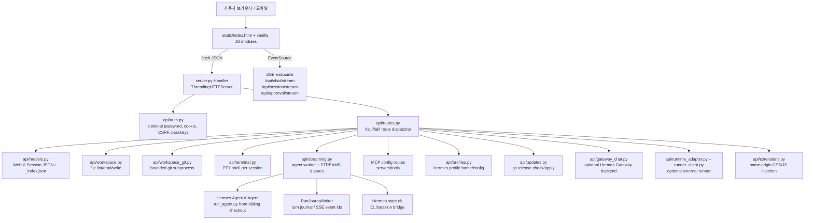
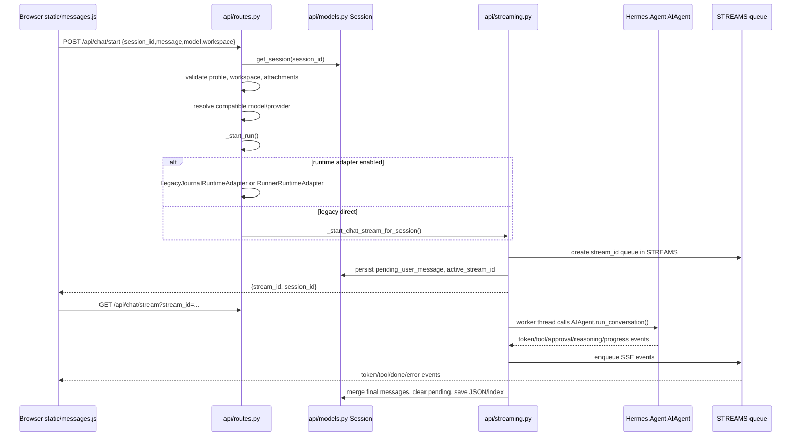
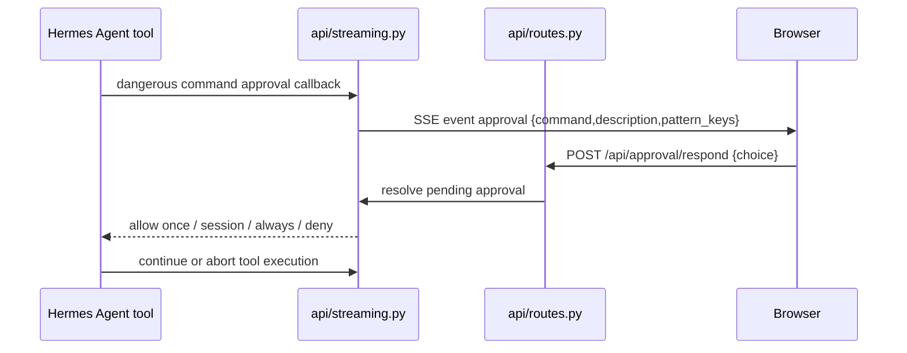
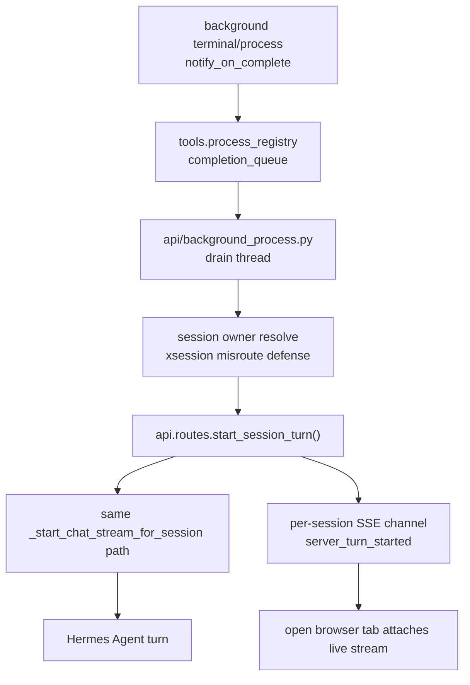
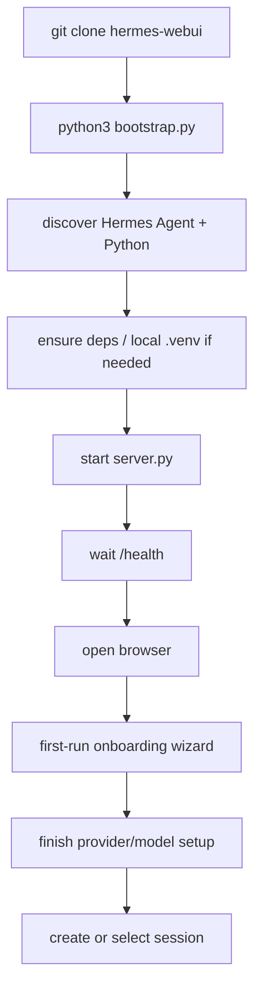

# nesquena/hermes-webui 심층 분석 보고서

분석 기준일: 2026-06-10  
분석 대상 커밋: `85d0e522e008b176767e3cc5fd6fad5b23270dc0`  
원격 저장소: https://github.com/nesquena/hermes-webui  
로컬 경로: `sources/nesquena__hermes-webui`

## 1. 한 줄 결론

`hermes-webui`는 Hermes Agent 자체가 아니라, Hermes Agent를 브라우저와 모바일에서 쓰기 위한 self-hosted 로컬 제어면이다. 가장 중요한 특징은 "no build step, no framework, vanilla JS + Python stdlib HTTP server"라는 극단적으로 낮은 프런트엔드 의존성과, 그 위에 채팅 스트리밍, 세션 복구, 작업공간 파일 브라우저, 터미널, git, MCP, cron, profile, onboarding, passkey, update, extension까지 얹은 넓은 운영 표면이다.

이 레포는 가벼운 UI라는 외형과 달리 실제로는 `server.py` + `api/routes.py` + `api/streaming.py`가 Hermes Agent 런타임, 브라우저 SSE, 세션 sidecar JSON, Hermes `state.db`, MCP 설정, workspace 파일 시스템, embedded terminal, self-update까지 중계한다. 따라서 "개인 로컬 도구"로는 매우 강력하지만, 공유형/멀티테넌트/공개 노출 서비스로 취급하면 위험하다.

## 2. 메타데이터와 현재 상태

| 항목 | 값 |
|---|---|
| GitHub 생성일 | 2026-03-30 |
| 최신 확인 태그 | `v0.51.350` |
| 최신 릴리스 | `v0.51.350`, 2026-06-10 |
| 기본 브랜치 | `master` |
| 라이선스 | MIT |
| 주요 언어 | Python |
| GitHub stars | 14,148 |
| forks | 1,739 |
| watchers | 51 |
| 로컬 파일 수 | `source-inventory` 기준 대형 Python/vanilla JS 앱 |
| 테스트 파일 수 | 852개 |
| 테스트 함수/pytest 참조 대략치 | `rg` 기준 6,483개 |
| 핵심 대형 파일 | `api/routes.py` 16,513 lines, `api/streaming.py` 8,335 lines, `static/i18n.js` 17,780 lines |
| 런타임 의존성 | WebUI 자체는 `pyyaml`, `cryptography`; 무거운 agent 의존성은 Hermes Agent venv 쪽 |
| 빌드 방식 | 패키징/번들링 없음. `package.json`은 ESLint runtime guard 전용 |

주의할 점은 `ARCHITECTURE.md` 상단의 "current shipped build v0.51.192" 스냅샷이 실제 태그 `v0.51.350`보다 오래되었다는 것이다. 문서는 잘 관리되고 있지만 릴리스 속도가 매우 빠르기 때문에 문서 버전과 실제 HEAD 사이에는 항상 약간의 drift가 생긴다.

## 3. 정체성: WebUI이지 agent core가 아니다

이 저장소의 README는 Hermes Agent를 "서버에 살고 기억을 누적하는 autonomous agent"로 설명하고, WebUI는 그 agent를 브라우저에서 쓰는 인터페이스라고 정의한다. 즉, `hermes-webui`의 core 가치는 model reasoning이나 tool execution 알고리즘이 아니라 다음에 있다.

- 기존 Hermes Agent 설치를 자동 탐지하거나 설치 지원한다.
- Hermes Agent가 가진 세션, memory, skills, providers, messaging, cron, profile 상태를 브라우저에서 조작한다.
- 브라우저 사용자가 CLI에 가까운 기능을 쓰도록 SSE streaming, approval card, tool card, workspace panel, terminal, file edit, git panel을 제공한다.
- WebUI 자체 상태는 `~/.hermes/webui` 또는 profile별 `webui_state`에 저장하고, agent의 `state.db`와도 bridge한다.
- 가능한 한 프레임워크와 빌드 도구를 넣지 않아, 로컬 서버에서 즉시 고칠 수 있는 구조를 유지한다.

이 관점이 중요하다. 이 레포를 "Claude Code / Codex 같은 코딩 에이전트"로 보면 핵심을 놓친다. 실제 agent loop는 sibling `NousResearch/hermes-agent`의 `run_agent.py`와 `AIAgent`가 담당하고, WebUI는 그 agent를 브라우저 UX와 로컬 운영 API로 감싸는 sidecar/control plane이다.

## 4. 철학과 설계 방향

### 4.1 No framework, no build step

`README.md`, `ARCHITECTURE.md`, `pyproject.toml`, `package.json` 모두 같은 철학을 반복한다.

- Python stdlib `ThreadingHTTPServer` 사용
- 프런트엔드는 `static/*.js` vanilla JS 모듈
- bundler, React/Vue/Svelte 없음
- `package.json`은 앱 빌드가 아니라 `static/**/*.js` runtime-error lint 전용
- `pyproject.toml`은 패키지 빌드가 아니라 ruff lint 설정 전용

이 선택의 장점은 운영자가 SSH 터미널에서 즉시 파일을 읽고 고치기 쉽다는 점이다. agent가 자기 UI를 고치는 상황에도 유리하다. 반대로, 파일이 커지면서 `api/routes.py`와 `static/ui.js`처럼 거대한 monolith가 생기는 부작용이 있다.

### 4.2 "Calm console" UI 철학

`DESIGN.md`는 WebUI를 데모 페이지나 화려한 카드 UI가 아니라 "calm developer console"로 정의한다. 핵심은 assistant prose를 우선하고, tool call/thinking/context trace는 조용한 metadata로 접는 것이다.

구체적으로:

- conversation content가 1순위
- tool/thinking/context traces는 기본적으로 collapsed
- 색상은 제한적으로 사용
- user message는 compact bubble, assistant는 prose-first
- debug detail은 inspect 가능해야 하지만 transcript 흐름을 방해하면 안 됨
- nested rounded card 남발 금지

이 디자인 철학은 AI agent UI에서 중요하다. 장기 실행 agent는 tool noise가 많기 때문에, 모든 tool call을 1급 메시지 카드로 보여주면 실제 답변 흐름이 깨진다. Hermes WebUI는 이 문제를 UX 차원에서 해결하려고 한다.

### 4.3 CLI parity와 persistent agent access

README는 "CLI experience와 nearly 1:1 parity"를 목표로 한다. CLI에서 가능한 채팅, 세션, memory, skills, cron, provider/model 선택, workspace 작업을 브라우저에서도 가능하게 만드는 것이 제품 목표다.

또한 Hermes Agent 자체의 철학인 persistent memory, self-hosted scheduling, messaging-surface continuity를 WebUI에 그대로 연결한다. WebUI는 독립 채팅앱이 아니라 Hermes identity의 한 surface다.

### 4.4 빠른 반복과 regression pinning

태그가 `v0.51.350`까지 빠르게 진행된 것과 852개 테스트 파일은 이 레포가 짧은 기간에 많은 edge case를 잡아온 프로젝트라는 신호다. `TESTING.md`는 약 7,150개 테스트 수집, Python 3.11-3.13 matrix, ruff, headless browser smoke, Docker smoke를 언급한다.

코멘트에도 이슈 번호가 많다. 예를 들어:

- session data loss recovery
- stale stream state
- source-boundary migration
- background process wakeup misroute
- terminal parent-death-signal bug
- mobile/runtime JS brick-class regression
- profile-scoped session/project filtering

이는 코드가 "깨끗한 초기 설계"라기보다, 실제 운영 중 나온 결함을 매우 촘촘하게 patch하며 성장한 구조에 가깝다는 뜻이다.

## 5. 최상위 구조

루트 주요 파일:

| 경로 | 역할 |
|---|---|
| `server.py` | Python stdlib HTTP server shell. auth middleware, static serving, request delegation, startup/shutdown |
| `bootstrap.py` | one-shot launcher. Hermes Agent 탐지/설치, venv 준비, 서버 시작, health wait, browser open |
| `start.sh` | shell wrapper. `.env` 로드 후 `bootstrap.py --no-browser` 실행 |
| `ctl.sh` | homelab daemon lifecycle wrapper. start/status/logs/restart/stop |
| `mcp_server.py` | WebUI session/project 조작을 MCP tool로 노출하는 stdio server |
| `api/routes.py` | 대부분의 HTTP route dispatch와 business logic. 매우 큰 monolithic router |
| `api/streaming.py` | browser chat SSE, agent thread runner, AIAgent cache, cancellation, run journal |
| `api/models.py` | WebUI sidecar session model, JSON persistence, `_index.json`, CLI/session bridge |
| `api/auth.py` | optional password auth, signed cookies, CSRF token, passkeys |
| `api/workspace.py` | workspace list/path/file helper |
| `api/workspace_git.py` | workspace git panel helper, hardened git subprocess |
| `api/terminal.py` | embedded PTY terminal |
| `api/runtime_adapter.py` | default-off runtime adapter seam, runner-local bridge |
| `api/gateway_chat.py` | default-off Hermes Gateway-backed chat bridge |
| `static/*.js` | vanilla JS frontend modules |
| `docs/rfcs/*` | run-state, session resolution, runtime adapter, turn journal 등 미래 계약 문서 |

프런트엔드 주요 모듈:

| 경로 | 역할 |
|---|---|
| `static/index.html` | app shell |
| `static/boot.js` | event wiring, theme/skin boot, mobile nav, voice input |
| `static/messages.js` | send, SSE handling, approval/clarify, transcript/recovery |
| `static/sessions.js` | session CRUD/list/search/rendering |
| `static/workspace.js` | workspace file panel, file preview/edit, git badge |
| `static/panels.js` | Control Center, cron, skills, memory, profiles, todo, settings |
| `static/commands.js` | slash command registry/autocomplete |
| `static/terminal.js` | embedded terminal client |
| `static/ui.js` | DOM helpers, markdown rendering, tool cards, context indicator |

## 6. 아키텍처 다이어그램



핵심은 server가 단순 reverse proxy가 아니라는 점이다. WebUI가 직접 `AIAgent` 객체를 만들고 캐싱하며, process-global environment를 조작하고, thread와 queue를 소유한다. 동시에 장기적으로는 `RuntimeAdapter`와 `RunnerRuntimeAdapter`로 실행 소유권을 외부 runner/sidecar로 옮기려는 seam도 이미 존재한다.

## 7. 실행 진입점별 동작 흐름

### 7.1 `python3 bootstrap.py`

사용자가 README quick start대로 실행하면 `bootstrap.py`가 먼저 돈다.

1. repo-local `.env`를 읽어 환경변수에 반영한다.
2. Hermes Agent checkout을 탐지한다.
   - `HERMES_WEBUI_AGENT_DIR`
   - `$HERMES_HOME/hermes-agent`
   - sibling `../hermes-agent`
   - `hermes` CLI shebang 역추적
3. Python interpreter를 고른다.
   - agent venv
   - local `.venv`
   - system python
4. WebUI deps와 agent deps가 import 가능한지 본다.
5. 필요하면 local `.venv`를 만들고 `requirements.txt`를 설치한다.
6. server process를 시작한다.
7. `/health`를 poll한다.
8. 브라우저를 연다.

중요한 위험/특징:

- Hermes Agent가 없으면 공식 installer URL `https://raw.githubusercontent.com/NousResearch/hermes-agent/main/scripts/install.sh`를 사용할 수 있다. 편하지만 `curl | bash`류 bootstrap trust model을 갖는다.
- Native Windows는 bootstrap이 실험적이며 WSL2 또는 Linux/macOS가 표준 경로다.
- `bootstrap.py`는 WebUI와 Agent가 같은 interpreter/import path에서 동작할 수 있는지를 중요하게 본다.

### 7.2 `./start.sh`

`start.sh`는 `.env`를 source한 뒤 Python을 찾아 `bootstrap.py --no-browser`를 실행한다. Docker/host 겸용을 위해 `.env`의 `UID`, `GID` 같은 bash readonly 변수는 필터링한다. root로 실행되었고 `hermeswebui` user + passwordless sudo 조건이 맞으면 unprivileged user로 재실행하는 방어도 있다.

### 7.3 `./ctl.sh start`

`ctl.sh`는 homelab/VM에서 daemon처럼 쓰기 위한 wrapper다.

- PID file: `~/.hermes/webui.pid`
- log: `~/.hermes/webui.log`
- `start`, `status`, `logs`, `restart`, `stop`
- `HERMES_WEBUI_HOST`, `HERMES_WEBUI_PORT`, state dir overrides 반영

운영 관점에서는 `start.sh`보다 `ctl.sh`가 장기 실행에 적합하다.

### 7.4 Docker

`Dockerfile`은 `python:3.12-slim` 기반이고, runtime user `hermeswebui`를 만든다. 컨테이너 기본은 `HERMES_WEBUI_HOST=0.0.0.0`, 포트 8787이다. `docker-compose.yml`은 기본적으로 host의 `~/.hermes`와 workspace를 mount한다.

Docker에서 주의할 점:

- 컨테이너 네트워크 때문에 `0.0.0.0` bind가 필요하지만, compose 예시는 host port를 `127.0.0.1:8787:8787`로 제한하는 방식을 권장한다.
- `HERMES_WEBUI_PASSWORD`는 optional이다. 원격 노출 시 반드시 켜야 한다.
- host `~/.hermes`를 mount하므로 secrets, sessions, memory, config, agent source가 컨테이너와 공유된다.
- multi-container compose에서는 WebUI와 Hermes Agent 컨테이너가 named volume을 통해 source/home을 공유한다.

## 8. HTTP 서버와 라우팅 구조

`server.py`는 `ThreadingHTTPServer` 기반이다. 요청마다 worker thread가 생기고, `Handler`가 `do_GET`, `do_POST`, `do_PATCH`, `do_DELETE`, `do_PUT`에서 `api.routes`로 넘긴다.

주요 단계:

1. request path parse
2. auth check
3. CSRF check for unsafe browser request
4. route dispatcher 호출
5. helper `j()` 또는 `t()`로 JSON/HTML response 작성
6. SSE endpoint는 직접 `text/event-stream` 유지

`api/routes.py`는 router framework가 아니라 매우 긴 if/elif chain이다. GET/POST path가 수백 개에 가깝게 들어 있다.

대표 GET endpoint:

- `/health`
- `/api/auth/status`
- `/api/session`
- `/api/sessions`
- `/api/chat/stream`
- `/api/session/stream`
- `/api/approval/stream`
- `/api/clarify/stream`
- `/api/models`, `/api/models/live`
- `/api/workspaces`
- `/api/file`, `/api/file/raw`
- `/api/terminal/output`
- `/api/crons`
- `/api/skills`
- `/api/memory`
- `/api/profiles`
- `/api/gateway/status`
- `/api/mcp/servers`, `/api/mcp/tools`
- `/api/rollback/list`, `/api/rollback/diff`

대표 POST endpoint:

- `/api/session/new`
- `/api/chat/start`
- `/api/chat`
- `/api/chat/steer`
- `/api/session/retry`, `/api/session/undo`, `/api/session/truncate`, `/api/session/branch`
- `/api/terminal/start`, `/api/terminal/input`, `/api/terminal/resize`, `/api/terminal/close`
- `/api/file/save`, `/api/file/create`, `/api/file/delete`, `/api/file/rename`, `/api/file/move`
- `/api/git/stage`, `/api/git/commit`, `/api/git/fetch`, `/api/git/pull`, `/api/git/push`, `/api/git/checkout`
- `/api/approval/respond`, `/api/clarify/respond`
- `/api/crons/create`, `/api/crons/update`, `/api/crons/run`
- `/api/skills/save`, `/api/memory/write`
- `/api/profile/switch`, `/api/profile/create`, `/api/profile/delete`
- `/api/settings`
- `/api/updates/apply`, `/api/updates/force`
- `/api/auth/login`, passkey endpoints, logout

이 구조의 장점:

- path-to-handler 흐름이 한 파일에 있어 추적 가능하다.
- framework magic이 없다.
- agent가 소스 수정하기 쉽다.

단점:

- `routes.py`가 16,000 lines 이상으로 커져 변경 충돌과 cognitive load가 크다.
- route별 정책이 분산되지 않고 거대 함수 안에 섞인다.
- endpoint permission model을 전체적으로 검증하려면 파일 전반을 읽어야 한다.

## 9. 인증, 쿠키, CSRF

인증은 기본 off다. `HERMES_WEBUI_PASSWORD`를 설정하거나 Settings에서 password hash를 저장하거나 passkey를 등록하면 켜진다.

`api/auth.py` 주요 구성:

- password hash: PBKDF2-SHA256, 600k iterations
- `.pbkdf2_key`, `.signing_key`: `STATE_DIR`에 0600으로 저장
- session token: `STATE_DIR/.sessions.json`에 expiry와 함께 저장
- 기본 TTL: 30일, env/settings로 60초-1년 범위 조정 가능
- login rate limiting: IP별 5회/60초, `STATE_DIR/.login_attempts.json`
- HTTP-only cookie: `hermes_session`
- CSRF token: cookie token 기반 `X-Hermes-CSRF-Token`
- passkey/WebAuthn support: feature flag와 optional cryptography 사용

서버 시작 시:

- non-loopback bind인데 auth가 꺼져 있으면 강한 warning을 출력한다.
- loopback bind라도 auth가 꺼져 있으면 "local process가 sessions/memory를 읽을 수 있다"는 tip을 출력한다.

이 설계는 self-hosted single-user 로컬 도구에는 현실적이다. 그러나 기본 off라는 것은 중요한 운영 리스크다. `0.0.0.0`로 bind하고 password를 설정하지 않으면 네트워크 상 누구나 filesystem/agent API를 사용할 수 있다. 코드는 경고하지만 차단하지 않는다.

## 10. 채팅 실행 흐름

가장 중요한 흐름은 브라우저 메시지 전송에서 Hermes Agent 실행까지다.



`_handle_chat_start()`에서 하는 일:

1. `session_id` 필수 검사
2. `get_session()`
3. requested profile이 있으면 profile id 검증
4. 빈 placeholder session이면 현재 profile로 재스탬프 가능
5. message normalize
6. attachment normalize, 최대 20개
7. workspace resolve/recovery
8. requested model/provider + profile default를 함께 resolve
9. `_start_run()` 호출

`_start_run()`은 runtime adapter 선택점이다.

- 기본: `legacy-direct`, 즉 `_start_chat_stream_for_session()` 직접 호출
- `HERMES_WEBUI_RUNTIME_ADAPTER=legacy-journal`: legacy path를 journal adapter로 감싼다.
- `HERMES_WEBUI_RUNTIME_ADAPTER=runner-local`: external runner client를 요구한다.

`api/streaming.py`의 `_run_agent_streaming()`은 실제 agent thread runner다. 이 함수는 다음을 담당한다.

- profile home 결정
- `TERMINAL_CWD`, `HERMES_EXEC_ASK`, `HERMES_SESSION_KEY`, `HERMES_HOME` 등 agent 실행용 env 설정
- `_ENV_LOCK`으로 process-global env mutation 구간 보호
- per-session agent lock으로 같은 session 동시 실행 방지
- `AIAgent` import/retry
- cached `AIAgent` 재사용 또는 재생성
- model/provider/base_url/api_key resolve
- WebUI-only ephemeral system prompt 구성
- prefill context file/script 로딩
- attachments/multimodal inputs 처리
- `agent.run_conversation(...)`
- token/tool/reasoning/approval/clarify/cancel events를 SSE queue와 run journal에 기록
- final messages를 WebUI session JSON과 agent state에 reconcile

`ARCHITECTURE.md`는 과거에 process-global env가 concurrent chat requests에서 clobber될 수 있다고 경고한다. 현재 코드는 `_ENV_LOCK`과 per-session lock, active-run registry 등으로 많이 보강되어 있지만, 근본적으로 in-process multi-thread + process-global env를 사용하는 구조라는 점은 남아 있다.

## 11. SSE와 long-running run state

WebUI는 여러 SSE channel을 쓴다.

| channel | 역할 |
|---|---|
| `/api/chat/stream` | 특정 `stream_id`의 agent turn event |
| `/api/session/stream` | 세션 단위 persistent live-view channel |
| `/api/approval/stream` | dangerous command approval request |
| `/api/clarify/stream` | agent clarify request |
| `/api/kanban/events/stream` | kanban task event stream |
| `/api/sessions/events` | sidebar/session-list update |
| `/api/terminal/output` | PTY terminal output |

`api/background_process.py`에는 `SESSION_CHANNELS`라는 persistent per-session SSE channel이 있다. 주석에 따르면 `STREAMS`는 turn별로 생성/소멸되지만, background process completion이나 server-side wakeup은 turn이 없을 때도 브라우저에 live-view event를 보내야 하므로 session-level channel이 필요하다.

이 설계는 복잡하지만 agent UI에서 실제로 필요한 구조다. 브라우저 tab이 닫혀도 background task가 끝나면 server-side로 agent를 깨우고, 열려 있는 tab에는 `server_turn_started`를 fan-out할 수 있다.

## 12. 세션 모델과 상태 저장

`api/models.py`는 WebUI sidecar session을 관리한다. session은 SQL DB가 아니라 JSON file이다.

기본 저장 구조:

```text
~/.hermes/webui/
  sessions/
    <session_id>.json
    _index.json
  workspaces.json
  last_workspace.txt
  settings.json
  projects.json
  .sessions.json
  .signing_key
  .pbkdf2_key
```

profile별 상태는 `api/workspace.py` 등에서 `{profile_home}/webui_state/`로 분기하기도 한다. default profile은 global `STATE_DIR`를 사용한다.

세션 저장의 특징:

- session id는 path-safe 문자만 허용한다.
- `Session.save()`와 `_write_session_index()`는 temp file + `os.replace()` atomic write 패턴을 쓴다.
- stale tmp file cleanup이 있다.
- `_index.json`은 sidebar 성능을 위한 metadata index다.
- full rebuild와 targeted update fast path가 공존한다.
- CLI session bridge를 통해 Hermes Agent의 SQLite store에서 CLI session도 sidebar에 보이게 할 수 있다.
- session recovery, rollback, compression lineage, fork/branch, import/export가 많다.

이 구조는 SQLite full migration 없이 로컬 파일 inspectability를 유지한다는 장점이 있다. 반면, 동시성/consistency는 매우 까다롭다. 실제 코드와 RFC가 "run-state consistency", "canonical session resolution", "turn journal" 같은 문제를 계속 다루는 이유다.

## 13. 모델/provider/profile 흐름

WebUI는 자체적으로 provider를 갖는 것이 아니라 Hermes Agent config와 OAuth/provider runtime을 읽어 model/provider를 resolve한다.

관련 요소:

- `api/config.py`: config discovery, provider/model helpers
- `api/providers.py`, `api/plugin_providers.py`: provider list/settings
- `api/oauth.py`: OpenAI Codex OAuth 관련 흐름 포함
- `api/profiles.py`: profile별 config/home/env isolation
- `/api/models`, `/api/models/live`: configured/live model list
- custom OpenAI-compatible provider support
- profile provider/model default repair

`streaming.py`에는 model 문자열과 provider context를 보정하는 함수들이 있다. 예를 들어 profile provider가 바뀌었는데 stale model이 남아 있으면 profile default model로 고치는 로직이 있다. custom provider는 `custom:<slug>`에서 concrete `base_url`과 key를 가져오고, keyless local OpenAI-compatible 서버를 위해 dummy key를 넣는 path도 있다.

## 14. Workspace 파일 브라우저와 파일 수정

workspace 기능은 WebUI의 차별점 중 하나다.

지원 기능:

- directory tree
- breadcrumb
- text/code/markdown/image preview
- file edit/save/create/delete/rename/move
- folder create/download
- binary download
- workspace upload
- `workspace://path` link
- git badge/status/diff/stage/commit/fetch/pull/push/checkout

path safety:

- `api.helpers.safe_resolve(root, requested)`로 workspace root 탈출을 막는다.
- workspace helper에는 blocked path, profile directory leak 방지, symlink handling, anchored delete helper가 있다.
- 파일 save/create는 `os.open` + fdopen을 사용해 race를 줄이는 부분이 있다.

하지만 이 기능의 본질은 브라우저에서 로컬 파일을 읽고 쓸 수 있다는 것이다. 인증이 꺼진 상태로 노출되면 심각하다.

## 15. Git 패널

`api/workspace_git.py`는 꽤 방어적인 편이다.

주요 방어:

- `shell=False`
- timeout: 일반 git 5초, remote operation 60초
- workspace pathspec scoping
- repo-local config hardening:
  - `core.fsmonitor=false`
  - `core.sshCommand=ssh`
  - `core.askPass=`
  - `credential.helper=`
  - `protocol.ext.allow=never`
  - `core.gitProxy=`
- git 관련 환경변수 scrub:
  - `GIT_DIR`
  - `GIT_WORK_TREE`
  - `GIT_CONFIG_*`
  - `GIT_ASKPASS`
  - `SSH_ASKPASS`
  - `GIT_SSH`
  - `GIT_SSH_COMMAND`
- mutation lock은 repo root 단위
- destructive operation 일부는 `HERMES_WEBUI_WORKSPACE_GIT_DESTRUCTIVE` env로 gate

평가:

- workspace에 agent가 만든 악성 repo가 있어도 repo-local git config로 command execution을 유발하는 고전적인 경로를 상당 부분 막는다.
- 그래도 git fetch/pull/push/checkout/commit은 실제 workspace mutation이다.
- branch switch/stash checkout 같은 동작은 사용자 작업물을 바꿀 수 있다.

## 16. Embedded terminal

`api/terminal.py`는 WebUI session별 PTY shell을 연다.

동작:

1. `POST /api/terminal/start`
2. session workspace를 resolve
3. remote terminal backend이면 현재 embedded terminal은 거절
4. local shell path 결정: `$SHELL`, `zsh`, `bash`, `sh`
5. `os.openpty()`
6. shell을 `subprocess.Popen`으로 실행
7. reader thread가 PTY output을 queue에 넣음
8. browser가 `/api/terminal/output` EventSource로 읽음
9. input은 `/api/terminal/input`으로 master fd에 write

보안상 긍정적인 부분:

- terminal env는 allowlist 기반이다.
- API keys/secrets가 shell env로 유출되지 않도록 대부분 제거한다.
- shell은 own process group으로 실행되어 `close_terminal()`에서 group signal cleanup 가능하다.
- Windows는 unsupported로 처리한다.

그러나 본질적으로 "브라우저에서 shell을 여는 기능"이다. 인증이 꺼져 있거나 shared server로 노출되면 host command execution surface다.

## 17. Approval, clarify, queued input

Hermes Agent가 위험 명령 실행 전 승인 요청을 만들면 WebUI는 approval card를 보여준다. 관련 흐름은 대략 다음과 같다.



Clarify는 agent가 blocking question을 사용자에게 묻는 surface다. `api/clarify.py`에는 pending queue, timeout metadata, SSE subscriber registry가 있다. 이 역시 agent run과 UI control plane이 얽힌 복잡한 부분이다.

## 18. Background process wakeup과 server-side turn

`api/background_process.py`는 terminal/background process completion을 WebUI session으로 되돌리는 path를 갖는다. 주석에 따르면 Option Z pivot 이후 browser round-trip 없이 server-side에서 `start_session_turn()`을 호출한다.

흐름:



이 부분은 Hermes WebUI가 단순 request/response UI가 아니라, agent server의 장기 실행 상태를 보존하고 재개하는 control plane임을 보여준다.

## 19. Cron, goals, skills, memory

WebUI는 Hermes Agent의 persistent-agent 기능을 노출한다.

- `/api/crons`: cron job list/create/update/delete/run/pause/resume/history/output/status
- `/api/goal`: goal state control, kickoff prompt, active turn integration
- `/api/skills`: skills list/content/save/delete/toggle/usage
- `/api/memory`: memory read/write
- `/api/profiles`: named Hermes profiles
- `/api/commands`: slash command registry/exec

`/goal`의 경우 `api/goals.py`가 profile home에 pinned `SessionDB`를 열어 goal state를 다룬다. active stream이 없으면 kickoff prompt를 만들어 agent turn을 바로 시작할 수 있다. 이것은 Codex thread의 `/goal`과 유사한 "목표 지속 실행" UX를 Hermes WebUI식으로 붙인 것이다.

## 20. MCP와 external integrations

### 20.1 WebUI 안의 MCP server 관리

`/api/mcp/servers`와 `/api/mcp/tools`는 Hermes config의 `mcp_servers`를 읽고, runtime/tool registry에서 이미 알려진 MCP tool inventory를 보여준다. 서버 추가/수정은 `PATCH/PUT /api/mcp/servers/{name}`로 config YAML을 수정한다.

지원 shape:

- HTTP MCP: `url`, `headers`
- stdio MCP: `command`, `args`, `env`
- `enabled` toggle
- timeout

위험:

- stdio MCP는 로컬 command 실행 설정이다.
- env/header에는 token이 들어갈 수 있다. masked placeholder preservation은 있지만, config 파일에는 결국 secret이 저장될 수 있다.
- tool list는 "already known runtime only"라서 실제 runtime과 UI 표시가 어긋날 수 있다.

### 20.2 `mcp_server.py`: WebUI itself as MCP tools

루트의 `mcp_server.py`는 별도 숨은 표면이다. 이 파일은 WebUI의 session/project 조작을 MCP-compatible agent에게 stdio tool로 노출한다.

특징:

- `mcp` Python 패키지 필요
- `HERMES_WEBUI_HOST`, `HERMES_WEBUI_PORT`, `HERMES_WEBUI_PASSWORD`로 WebUI HTTP API에 붙는다.
- password가 있으면 `/api/auth/login`으로 cookie를 얻는다.
- session rename/move 등 mutation은 HTTP API로 수행한다.
- password가 없으면 일부 cache-safe mutation을 거절한다.

이 구조는 다른 agent가 Hermes WebUI를 제어할 수 있게 하므로 편리하지만, `HERMES_WEBUI_PASSWORD` plaintext env와 WebUI cookie를 들고 다니는 trust boundary가 생긴다.

## 21. Gateway-backed chat와 RuntimeAdapter

기본 채팅 backend는 WebUI in-process legacy runtime이다. 하지만 두 가지 migration seam이 있다.

### 21.1 `api/gateway_chat.py`

`HERMES_WEBUI_CHAT_BACKEND=gateway` 또는 config 값으로 Hermes Gateway API server를 통해 browser chat을 보낼 수 있다.

- default base URL: `http://127.0.0.1:8642`
- API key: `HERMES_WEBUI_GATEWAY_API_KEY` 또는 `API_SERVER_KEY`
- Gateway의 OpenAI-compatible streaming chunk를 WebUI SSE event로 translate
- final turn을 WebUI session에 writeback

이 path는 default-off다. 실행 소유권을 gateway로 넘기고 WebUI는 browser contract만 유지하려는 중간 단계로 보인다.

### 21.2 `api/runtime_adapter.py` + `api/runner_client.py`

`HERMES_WEBUI_RUNTIME_ADAPTER` env:

- `legacy-direct`: 기본, adapter 없음
- `legacy-journal`: legacy path를 run journal adapter로 감싼다.
- `runner-local`: external runner backend를 HTTP client로 호출한다.

`HttpRunnerClient`는 base URL을 `http`/`https`로 제한하고 redirect를 따르지 않아 bearer token 유출을 줄인다. 하지만 runner endpoint 자체는 operator-configured high-trust component다.

이 seam은 중요한 아키텍처 방향이다. 현재 WebUI가 직접 agent process/env/thread를 소유하는 구조에서, 미래에는 runner/sidecar가 실행 상태를 소유하고 WebUI는 event/control translator로 줄어드는 방향을 암시한다.

## 22. Extension surface

`api/extensions.py`와 `docs/EXTENSIONS.md`는 opt-in same-origin extension injection을 제공한다.

환경변수:

- `HERMES_WEBUI_EXTENSION_DIR`
- `HERMES_WEBUI_EXTENSION_SCRIPT_URLS`
- `HERMES_WEBUI_EXTENSION_STYLESHEET_URLS`

제한:

- URL은 `/extensions/` 또는 `/static/` same-origin path만 허용
- scheme/host/fragment/quote/angle bracket/backslash/NUL/newline 거절
- static file serving은 traversal, dotfile, symlink escape를 막는다.
- 외부 third-party script loader가 아니다.

그럼에도 extension JS는 같은 origin에서 실행되므로 WebUI session authority를 모두 가진다. 문서도 "extension JS can call any API the logged-in user can call"이라고 명시한다. trusted admin escape hatch로만 봐야 한다.

## 23. Updates/self-update

`api/updates.py`는 WebUI와 Hermes Agent git repo의 release tag 상태를 확인하고 update apply/force/summary endpoint를 제공한다.

긍정적인 부분:

- cache TTL 30분
- active stream/active run이 있으면 restart block
- git diagnostic에서 credential redaction
- git describe fallback
- Docker image에서는 `api/_version.py` fallback

주의할 부분:

- self-update는 결국 git fetch/pull/stash/pop/reexec류 supply-chain surface다.
- user가 로컬 checkout을 수정 중인 경우 update apply가 state를 바꿀 수 있다.
- WebUI API 권한을 가진 사용자는 update endpoint를 호출할 수 있으므로, 원격 노출 시 auth가 중요하다.

## 24. External notes / Joplin drawer

`routes.py`에는 default-off external notes drawer가 있다.

- `HERMES_WEBUI_EXTERNAL_NOTES_SOURCES` 또는 config로 enable
- MCP inventory에서 note/knowledge source를 추론
- Joplin Web Clipper default URL: `http://127.0.0.1:41184`
- `JOPLIN_TOKEN`을 config/env에서 읽음
- `/search`에는 compatibility 때문에 query token도 붙인다.
- note preview는 body를 최대 50,000 chars로 truncate하고 redaction을 적용한다.

이 기능은 개인 지식 베이스와 agent memory를 연결하는 좋은 방향이지만, token과 notes content를 WebUI API로 노출하는 만큼 auth와 local-only bind가 필수다.

## 25. Security headers와 CSP

`api/helpers.py`는 모든 JSON/text response에 security header를 붙인다.

- `X-Content-Type-Options: nosniff`
- `X-Frame-Options: DENY`
- `Referrer-Policy: same-origin`
- `Permissions-Policy`
- CSP:
  - `default-src 'self' https://*.cloudflareaccess.com`
  - `object-src 'none'`
  - `frame-ancestors 'none'`
  - `script-src 'self' 'unsafe-inline' https://cdn.jsdelivr.net https://static.cloudflareinsights.com blob:`
  - `style-src 'self' 'unsafe-inline' https://cdn.jsdelivr.net https://fonts.googleapis.com`
  - `connect-src 'self' localhost/127.0.0.1 ws + cdn.jsdelivr`

평가:

- 기본 보안 헤더는 있다.
- `unsafe-inline`과 CDN allow는 vanilla/static app의 현실적인 타협이다.
- extension support와 CSP extra connect env가 있으므로 운영자가 확장하면 attack surface가 넓어진다.

## 26. 차별점

### 26.1 Hermes Agent를 위한 full control UI

대부분의 CLI agent는 터미널이 주 surface다. `hermes-webui`는 persistent memory/cron/messaging/profile/session을 가진 Hermes Agent를 브라우저에서 계속 다룰 수 있게 한다.

### 26.2 No-build self-hosted UX

요즘 AI coding UI가 React/Vite/Electron/monorepo로 가는 것과 달리, 이 레포는 Python + static JS로 버틴다. 이는 작은 개인 서버/VM/SSH tunnel 환경에 잘 맞는다.

### 26.3 세션 복구와 장기 실행 상태에 대한 집착

run journal, session recovery, pending turn repair, background wakeup, per-session SSE channel, stream ownership guard 등은 실제 long-running agent UX에서 생기는 문제를 강하게 의식한 설계다.

### 26.4 Profile-aware local state

profile switch가 단순 UI dropdown이 아니라 `HERMES_HOME`, config, workspace list, provider/model, sessions/projects scoping에 깊게 연결된다.

### 26.5 넓은 운영 표면

채팅 UI만 있는 것이 아니라 workspace, terminal, git, cron, skills, memory, MCP, Joplin, update, passkey, extension, Docker, ctl daemon까지 있다. 개인 agent OS에 가까운 control panel이다.

## 27. 이상하거나 위험한 점

### 27.1 기본 인증 off

가장 큰 운영 리스크다. 로컬 loopback에서 혼자 쓰는 목적이면 합리적이지만, Docker 기본 bind는 `0.0.0.0`이고 compose는 host port를 loopback으로 제한하는 예시를 제공할 뿐이다. 사용자가 `8787:8787`로 열고 password를 안 걸면 workspace file edit, terminal, git, memory, session data가 노출된다.

### 27.2 `api/routes.py`가 지나치게 크다

16,513 lines 단일 router는 기능 추가 속도에는 유리했겠지만, permission review와 regression isolation에는 불리하다. endpoint별 auth/CSRF/destructive operation policy가 한눈에 들어오지 않는다.

### 27.3 in-process agent execution과 process-global env

`streaming.py`는 `HERMES_HOME`, `TERMINAL_CWD`, `HERMES_EXEC_ASK`, `HERMES_SESSION_KEY` 등을 process env로 설정한다. `_ENV_LOCK`과 session lock이 있지만, agent/tools/imported modules가 언제 env를 읽는지에 따라 cross-session interaction 위험이 완전히 사라졌다고 보기는 어렵다. 문서도 이 문제를 명시한다.

### 27.4 Extension JS는 full authority

extension URL 검증은 좋지만, extension이 로드되면 같은 origin 권한으로 모든 API 호출이 가능하다. `HERMES_WEBUI_EXTENSION_DIR`를 user-writable directory로 지정하면 안 된다.

### 27.5 Embedded terminal은 실제 shell

env allowlist는 잘 되어 있지만, WebUI API 권한을 가진 사용자는 workspace shell을 얻는다. 이것은 feature이자 RCE surface다.

### 27.6 MCP stdio server 설정은 로컬 command surface

`/api/mcp/servers/{name}`에 `command`, `args`, `env`를 저장할 수 있다. enabled server는 Hermes Agent runtime이 stdio process를 띄울 수 있다. MCP config UI는 high-trust admin feature로 봐야 한다.

### 27.7 `mcp_server.py`는 plaintext password env를 쓴다

MCP integration을 위해 `HERMES_WEBUI_PASSWORD`를 env로 전달하는 구조다. 다른 MCP client/agent configuration에 password가 남을 수 있다.

### 27.8 Self-update API

편리하지만 Git checkout mutation과 restart를 WebUI에서 트리거한다. auth가 약하면 공급망/운영 장애로 이어질 수 있다.

### 27.9 CSP에 `unsafe-inline`과 CDN 허용

앱 구조상 현실적인 타협이지만, extension/injection/markdown rendering과 함께 보면 browser-side XSS 방어는 계속 검증해야 한다.

### 27.10 릴리스 속도와 문서 drift

신생 레포가 두 달 반 만에 `v0.51.350`까지 갔다. regression test는 강하지만, 운영자는 "빠르게 안정화되는 제품"으로 봐야 한다. 실제 코드와 문서 스냅샷은 다를 수 있다.

## 28. 실행 검증 결과

로컬 환경에서 다음을 확인했다.

### 28.1 Python 문법 검증

다음 파일에 대해 `python3 -m py_compile`을 실행했고 성공했다.

- `server.py`
- `bootstrap.py`
- `mcp_server.py`
- `api/routes.py`
- `api/streaming.py`
- `api/runtime_adapter.py`
- `api/auth.py`
- `api/models.py`
- `api/terminal.py`
- `api/workspace_git.py`

### 28.2 의존성 존재 확인

현재 분석 환경:

```text
yaml OK
cryptography OK
mcp missing
run_agent missing
```

의미:

- WebUI 자체 최소 deps는 존재한다.
- MCP stdio server 검증은 `mcp` 패키지가 없어 실행하지 못했다.
- Hermes Agent runtime import인 `run_agent`가 전역 Python path에 없어 실제 chat turn은 실행하지 못했다.

### 28.3 서버 health 검증

격리된 상태 디렉터리와 agent 미설치 상태로 직접 서버를 띄웠다.

환경:

```bash
HERMES_HOME=/tmp/hermes-webui-analysis-home
HERMES_WEBUI_STATE_DIR=/tmp/hermes-webui-analysis-state
HERMES_WEBUI_HOST=127.0.0.1
HERMES_WEBUI_PORT=18987
HERMES_WEBUI_AGENT_DIR=/tmp/nonexistent-hermes-agent
python3 sources/nesquena__hermes-webui/server.py
```

`GET /health` 결과:

```json
{
  "status": "ok",
  "sessions": 0,
  "active_streams": 0,
  "active_runs": 0
}
```

startup log에서 확인한 사항:

- agent dir은 `NOT FOUND`
- 서버는 그래도 시작됨
- no password tip 출력
- `bg_task_complete drain unavailable: No module named 'tools'`
- `/health`는 200

따라서 WebUI shell은 agent가 없어도 뜨지만, 실제 agent features는 Hermes Agent checkout과 deps가 필요하다.

## 29. 전체 사용자 플로우 정리

### 29.1 첫 실행



### 29.2 일반 채팅

1. 사용자가 session을 만든다.
2. composer에서 model/profile/workspace를 고른다.
3. 메시지를 보낸다.
4. WebUI가 pending turn을 session JSON에 기록한다.
5. worker thread가 Hermes `AIAgent.run_conversation()`을 실행한다.
6. token/tool/reasoning/approval events가 SSE로 온다.
7. final assistant message와 tool metadata가 session에 merge된다.
8. sidebar index, usage, context indicator가 갱신된다.

### 29.3 위험 명령 승인

1. agent가 shell/tool 실행 전 approval을 요청한다.
2. WebUI가 approval SSE event를 받는다.
3. browser가 approval card를 표시한다.
4. 사용자가 allow once/session/always/deny 중 선택한다.
5. 선택이 agent callback으로 돌아간다.

### 29.4 파일 브라우저

1. workspace panel을 연다.
2. `/api/list` 또는 `/api/file`로 파일/폴더를 읽는다.
3. file save/delete/create/rename/move는 safe path resolve 후 수행한다.
4. git badge/status/diff는 `workspace_git.py`의 bounded subprocess를 통해 갱신된다.

### 29.5 Embedded terminal

1. browser가 `/api/terminal/start`를 호출한다.
2. server가 session workspace에서 PTY shell을 띄운다.
3. output은 EventSource로 stream된다.
4. input은 HTTP POST로 PTY master fd에 write된다.
5. close 시 process group에 signal을 보낸다.

### 29.6 Background process completion

1. terminal/tool이 `notify_on_complete` 형태로 background process를 만든다.
2. completion queue에 event가 들어온다.
3. drain thread가 session owner를 resolve한다.
4. closed tab이어도 server-side `start_session_turn()`을 호출한다.
5. open tab이 있으면 per-session SSE channel로 live-view를 붙인다.

### 29.7 WebUI as MCP tool server

1. MCP client가 `python3 mcp_server.py`를 stdio server로 실행한다.
2. server는 WebUI URL/password/profile을 환경변수/args로 읽는다.
3. 필요 시 `/api/auth/login`으로 cookie를 얻는다.
4. session/project rename/move 등 WebUI API mutation을 MCP tool로 수행한다.

## 30. 평가

### 강점

- self-hosted persistent agent의 web surface로서 기능 폭이 매우 넓다.
- no-build vanilla architecture라 작은 서버에서 운영/수정이 쉽다.
- long-running agent UX의 현실 문제를 많이 다뤘다.
- 테스트와 regression documentation이 매우 풍부하다.
- workspace/git/terminal/memory/skills/cron/profile/MCP를 한 UI에서 다룬다.
- security hardening이 곳곳에 있다: safe path, CSRF, PBKDF2, HMAC cookie, git env scrub, terminal env allowlist, extension URL validation, update diagnostic redaction.

### 약점

- `routes.py`와 `streaming.py`의 규모가 너무 크다.
- 실행 소유권이 아직 WebUI process 안에 강하게 남아 있어 concurrency와 failure boundary가 복잡하다.
- auth default off는 제품 철학상 이해되지만 운영 실수에 취약하다.
- terminal/file/git/update/MCP/extension까지 한 origin에 모여 blast radius가 크다.
- Hermes Agent checkout/deps와 강하게 결합되어 standalone reproducibility가 낮다.
- 빠른 릴리스로 문서/코드 drift를 항상 감안해야 한다.

## 31. 이 레포를 읽을 때의 핵심 파일 순서

처음 이해하려면 다음 순서가 좋다.

1. `README.md`: 제품 정체성, 사용자 기능
2. `ARCHITECTURE.md`: 현재 구조, 상태 디렉터리, 실행 모델
3. `server.py`: HTTP server shell, startup/shutdown, auth delegation
4. `api/routes.py`: endpoint inventory와 request lifecycle
5. `api/streaming.py`: 실제 chat run / SSE / AIAgent integration
6. `api/models.py`: session persistence와 index
7. `api/auth.py`: password/cookie/CSRF/passkey
8. `api/terminal.py`: embedded shell
9. `api/workspace.py`, `api/workspace_git.py`: filesystem/git surface
10. `api/runtime_adapter.py`, `api/gateway_chat.py`: 미래 실행 boundary
11. `static/messages.js`, `static/sessions.js`, `static/workspace.js`, `static/panels.js`: browser behavior
12. `docs/rfcs/*`: 왜 코드가 이렇게 복잡해졌는지에 대한 product/runtime contract

## 32. 최종 판단

`hermes-webui`는 "작고 단순한 웹 UI"라기보다 "Hermes Agent를 위한 로컬 agent operations console"이다. UI는 calm console을 지향하지만, 내부는 세션 복구, background wakeup, profile isolation, agent streaming, terminal, git, MCP, extensions, self-update를 다루는 매우 복잡한 control plane이다.

개인 서버에서 SSH tunnel 또는 loopback + password로 쓰면 강력한 도구다. 반대로 조직용 멀티유저 서비스나 공개 웹앱처럼 다루기에는 설계 전제와 맞지 않는다. 이 레포를 이해할 때 가장 중요한 문장은 다음이다.

> WebUI는 agent core가 아니라 high-trust local surface다.

이 전제를 잡으면 코드의 많은 선택이 이해된다. no-build 구조, 기본 로컬 bind, optional auth, broad filesystem/terminal APIs, profile/home state sharing, in-process AIAgent execution은 모두 "내 서버의 내 agent를 브라우저에서 다룬다"는 사용 모델에 최적화되어 있다.
