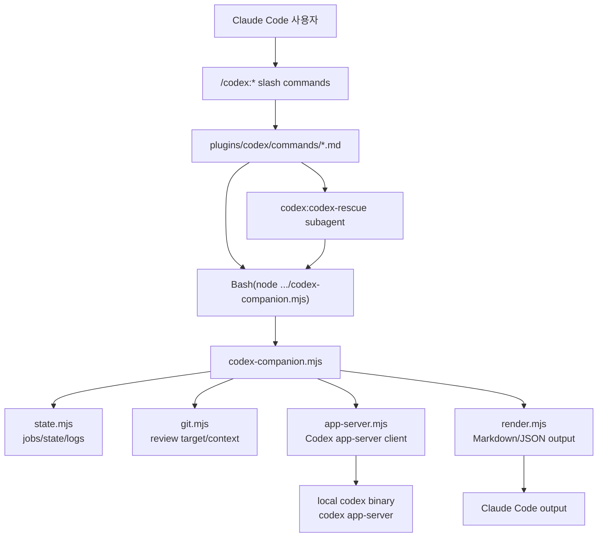
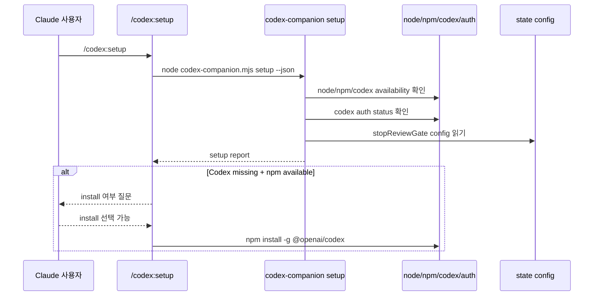
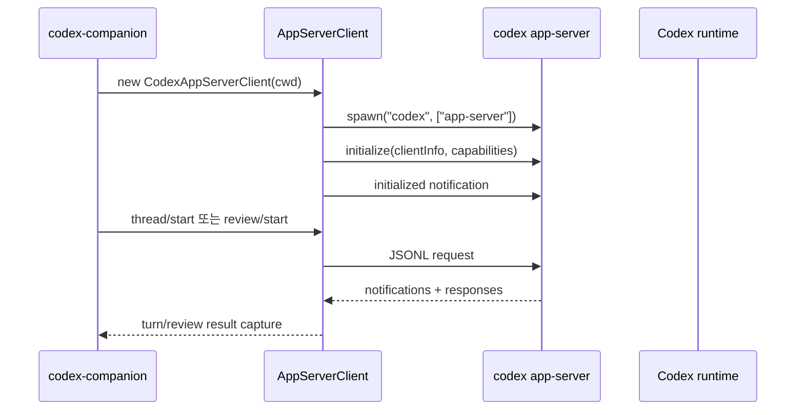
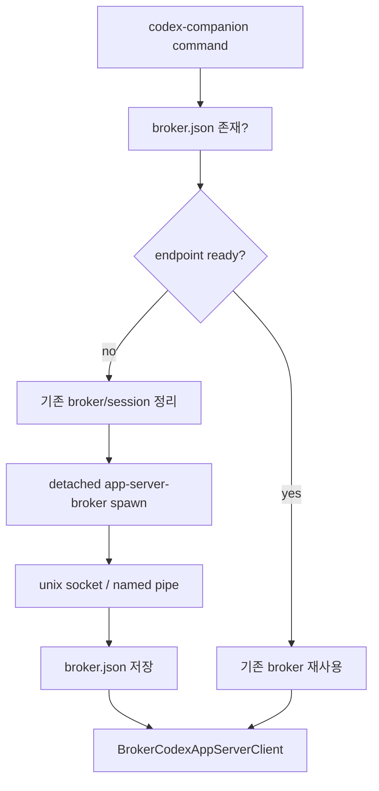
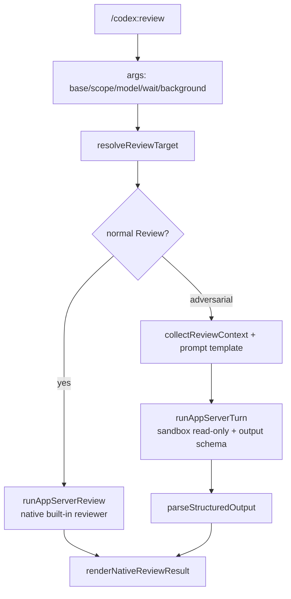
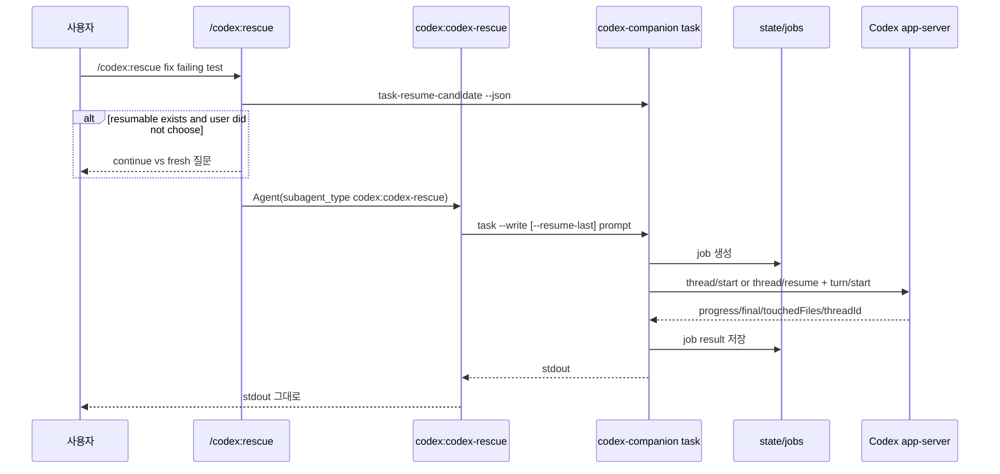
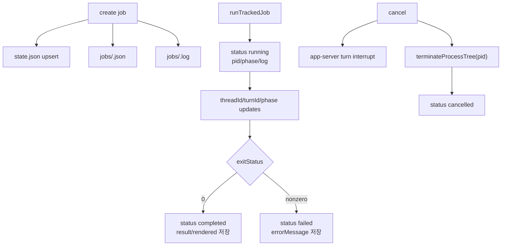
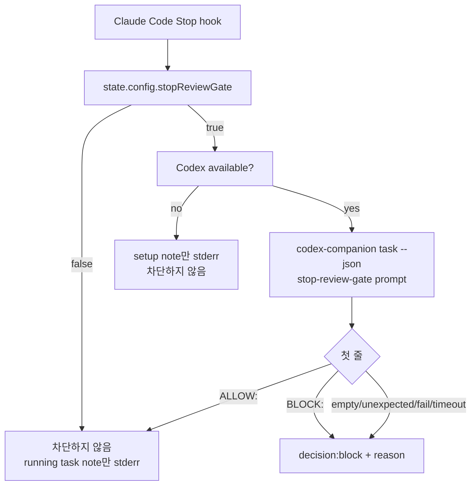

# openai/codex-plugin-cc 상세 분석 보고서

## 1. 기본 평가

- 대상: `https://github.com/openai/codex-plugin-cc`
- 로컬 소스: `sources/openai__codex-plugin-cc`
- 분석 기준 커밋: `807e03ac9d5aa23bc395fdec8c3767500a86b3cf` (`807e03`)
- 기준 브랜치: `main`
- 마지막 커밋 시각: 2026-04-18 13:41:53 -0700
- 최신 릴리스: `v1.0.4`, 2026-04-18
- 생성일: 2026-03-30
- 주 언어: JavaScript
- 라이선스: Apache-2.0
- 규모: 매우 작음. plugin/scripts/tests 중심
- GitHub 지표: stars 20,581, forks 1,245, watchers 61
- 공식 설명: “Use Codex from Claude Code to review code or delegate tasks.”

`openai/codex-plugin-cc`는 독립형 AI 코딩 에이전트가 아니다. Claude Code 안에서 Codex를 호출하기 위한 Claude Code 플러그인이다. 즉 사용자는 Claude Code 세션 안에서 `/codex:review`, `/codex:rescue`, `/codex:status` 같은 명령을 실행하고, 이 플러그인은 로컬 `codex` CLI와 Codex app-server를 통해 실제 Codex 작업을 수행한다.

이 저장소의 설계 핵심은 “Claude Code가 직접 문제를 풀지 않고, Codex에게 안전하게 넘기고 결과를 그대로 돌려받는 얇은 브리지”다. 그래서 코드량은 작지만, slash command 문서, subagent instruction, hook, background job state, broker lifecycle, app-server JSONL protocol wrapper가 매우 의도적으로 구성되어 있다.

## 2. 철학과 포지션

이 레포의 철학은 명확하다.

1. Claude Code 사용자의 기존 워크플로 안에 Codex를 넣는다
   - 별도 UI나 독립 agent runtime을 만들지 않는다.
   - Claude Code plugin marketplace로 설치하고 Claude slash command로 사용한다.

2. “브리지”는 얇게 유지한다
   - `codex:codex-rescue` subagent는 “thin forwarding wrapper”로 명시되어 있다.
   - subagent는 repo를 읽거나 grep하거나 스스로 해결하지 말고, 정확히 한 번 `codex-companion.mjs task ...`를 호출하라고 지시한다.

3. 리뷰와 구현을 강하게 분리한다
   - `/codex:review`, `/codex:adversarial-review`는 review-only다.
   - 결과 처리 skill은 “리뷰 findings를 보고 자동으로 수정하지 말고, 사용자가 어떤 이슈를 고칠지 묻기 전에는 파일을 건드리지 말라”고 명시한다.

4. Codex의 기존 인증/설정을 재사용한다
   - 새 인증 체계를 만들지 않고 로컬 `codex` binary, `codex login`, `~/.codex/config.toml`, 프로젝트 `.codex/config.toml`을 사용한다.

5. 긴 작업은 background job으로 다룬다
   - review/task를 foreground 또는 background로 실행할 수 있다.
   - `/codex:status`, `/codex:result`, `/codex:cancel`로 추적한다.

## 3. 구조

| 경로 | 역할 |
| --- | --- |
| `plugins/codex/.claude-plugin/plugin.json` | Claude Code plugin manifest |
| `plugins/codex/commands/*.md` | `/codex:*` slash command 정의 |
| `plugins/codex/agents/codex-rescue.md` | Codex task forwarder subagent |
| `plugins/codex/hooks/hooks.json` | SessionStart, SessionEnd, Stop hook 등록 |
| `plugins/codex/scripts/codex-companion.mjs` | 모든 command의 실제 entrypoint |
| `plugins/codex/scripts/app-server-broker.mjs` | app-server broker process |
| `plugins/codex/scripts/lib/app-server.mjs` | Codex app-server JSONL client |
| `plugins/codex/scripts/lib/codex.mjs` | app-server turn/review/session capture |
| `plugins/codex/scripts/lib/state.mjs` | per-workspace state/job 저장 |
| `plugins/codex/scripts/lib/tracked-jobs.mjs` | job lifecycle/log/progress |
| `plugins/codex/scripts/lib/job-control.mjs` | status/result/cancel 대상 해석 |
| `plugins/codex/scripts/lib/git.mjs` | review target/diff context 수집 |
| `plugins/codex/skills/*` | 내부 prompt/runtime/result handling contract |
| `tests/*.test.mjs` | command contract, broker, state, runtime 흐름 테스트 |

상위 흐름은 다음과 같다.



## 4. Claude Code plugin 표면

플러그인 manifest는 단순하다.

```json
{
  "name": "codex",
  "version": "1.0.4",
  "description": "Use Codex from Claude Code to review code or delegate tasks.",
  "author": { "name": "OpenAI" }
}
```

사용자에게 노출되는 명령은 다음이다.

| 명령 | 역할 |
| --- | --- |
| `/codex:setup` | Codex 설치/인증/stop review gate 상태 점검, gate enable/disable |
| `/codex:review` | built-in Codex reviewer로 read-only review |
| `/codex:adversarial-review` | 설계/가정/트레이드오프를 공격적으로 검토하는 read-only review |
| `/codex:rescue` | Codex subagent로 문제 해결/수정/진단 task 위임 |
| `/codex:status` | 실행 중/최근 job 조회 |
| `/codex:result` | 완료된 job의 저장 결과 출력 |
| `/codex:cancel` | background job 취소 |

명령 문서는 단순 설명서가 아니라 Claude Code의 실행 정책이다. 예를 들어 `/codex:review`는 `disable-model-invocation: true`, `allowed-tools: Read, Glob, Grep, Bash(node:*), Bash(git:*), AskUserQuestion`를 선언하고, foreground/background 선택 시 `AskUserQuestion`을 정확히 한 번 쓰도록 지시한다.

## 5. 설치/인증 플로우

README 기준 설치는 Claude Code plugin marketplace를 통해 이뤄진다.

```bash
/plugin marketplace add openai/codex-plugin-cc
/plugin install codex@openai-codex
/reload-plugins
/codex:setup
```

`/codex:setup`은 내부적으로 다음을 확인한다.

1. Node 사용 가능 여부
2. npm 사용 가능 여부
3. `codex` binary 설치 여부
4. Codex auth 상태
5. 현재 Claude session runtime 상태
6. stop review gate 설정

Codex가 없고 npm이 있으면 `npm install -g @openai/codex`를 제안한다. Codex가 있지만 로그인되어 있지 않으면 `!codex login`을 안내한다.



## 6. Codex app-server 통합

핵심 통합은 `plugins/codex/scripts/lib/app-server.mjs`와 `lib/codex.mjs`에 있다. 플러그인은 `codex app-server`를 spawn하거나 broker를 통해 재사용한다. 통신은 JSONL 기반 JSON-RPC 스타일이다.

`AppServerClientBase`는 다음을 수행한다.

- request id 증가
- pending request map 관리
- stdout line 단위 JSON parse
- response/error/notification 분기
- server request 중 미지원 request는 `-32601`로 응답
- app-server 종료 시 pending request 전체 reject

직접 실행 모드는 다음처럼 `codex app-server`를 spawn한다.



client info는 “Codex Plugin / Claude Code / plugin version”으로 설정된다. capabilities에는 reasoning delta 같은 notification opt-out 목록이 들어 있다. 즉 플러그인은 모든 raw event를 그대로 표시하기보다 필요한 progress와 final output을 수집하는 구조다.

## 7. Broker 구조

여러 명령이 같은 Claude session 안에서 반복될 때 app-server를 매번 띄우지 않기 위해 broker lifecycle이 있다.

- `createBrokerSessionDir()`: temp 아래 `cxc-*` session dir 생성
- `createBrokerEndpoint()`: Unix socket 또는 Windows named pipe endpoint 생성
- `spawnBrokerProcess()`: `app-server-broker.mjs serve --endpoint ...`를 detached process로 실행
- `saveBrokerSession()`: state dir의 `broker.json`에 endpoint/pid/log/sessionDir 저장
- `ensureBrokerSession()`: 기존 endpoint가 살아 있으면 재사용, 아니면 정리 후 새 broker 생성
- `SessionEnd` hook: broker shutdown과 temp/socket/pid/log cleanup



테스트는 “첫 사용 후 shared app-server를 lazy start하고 재사용한다”, “setup/status가 기존 shared app-server를 재사용한다”는 흐름을 검증한다.

## 8. Review 플로우

`/codex:review`는 read-only review다. target selection은 `git.mjs`가 한다.

1. `--base <ref>`가 있으면 branch diff
2. `--scope working-tree`면 working tree diff
3. `--scope branch`면 default branch 감지 후 branch diff
4. auto에서 dirty면 working tree, clean이면 default branch diff

working tree review에는 staged, unstaged, untracked 파일이 모두 고려된다. untracked 파일은 작은 텍스트 파일만 inline하고, directory/binary/large file/broken symlink는 skip 표시한다. adversarial review는 작은 diff는 inline context를 만들고, 큰 diff는 Codex가 직접 repo를 inspect하도록 lightweight context를 만든다.



일반 `/codex:review`는 focus text를 받지 않는다. focus text가 있으면 `/codex:adversarial-review`를 쓰라고 에러를 낸다. staged-only/unstaged-only scope도 지원하지 않는다.

## 9. Rescue/task 플로우

`/codex:rescue`는 직접 companion을 호출하지 않고 `codex:codex-rescue` subagent로 전달한다. 이 subagent의 job은 단 하나다.

- 정확히 한 번 `node "${CLAUDE_PLUGIN_ROOT}/scripts/codex-companion.mjs" task ...` 호출
- stdout 그대로 반환
- repo inspect 금지
- status/result/cancel/review 호출 금지
- 기본은 write-capable Codex run, 단 사용자 요청이 read-only/review/diagnosis/research이면 read-only 가능
- `spark` alias는 `gpt-5.3-codex-spark`로 매핑
- `--resume`은 `--resume-last`
- `--fresh`는 fresh run

`codex-companion task`는 다음으로 실행된다.



write-capable task는 app-server turn에서 `sandbox: "workspace-write"`를 사용한다. read-only task/review는 `sandbox: "read-only"`다. approvalPolicy는 app-server params에서 `never`로 설정된다. 여기서 “never”는 Codex CLI 쪽 승인 정책을 의미하므로, 실제 쓰기 가능 여부는 sandbox 값과 Codex runtime 권한에 크게 좌우된다.

## 10. Background job과 상태 저장

상태는 workspace별 디렉터리에 저장된다. `CLAUDE_PLUGIN_DATA`가 있으면 그 아래 `state`를 쓰고, 없으면 temp의 `codex-companion` 아래를 쓴다. workspace realpath를 sha256 16자리 hash로 slug에 섞어 경로 충돌을 줄인다.

저장 파일은 다음이다.

- `state.json`: config와 최근 jobs 인덱스
- `jobs/<job-id>.json`: job 상세 payload/result
- `jobs/<job-id>.log`: progress/final output log
- `broker.json`: shared broker endpoint/pid/log/session dir

job은 최대 50개만 유지하고, prune된 job artifact와 log file은 삭제된다.



background task는 detached worker를 spawn한다.

```text
node codex-companion.mjs task-worker --cwd <cwd> --job-id <job-id>
```

`status --wait`은 job id가 필요하고, 기본 timeout은 240초, poll interval은 2초다.

## 11. Stop Review Gate

선택적으로 `/codex:setup --enable-review-gate`를 실행하면 Stop hook이 활성화된다. hook 정의는 다음 이벤트를 포함한다.

- `SessionStart`: session id와 plugin data env를 Claude env file에 export
- `SessionEnd`: running job cleanup, broker shutdown, temp/socket cleanup
- `Stop`: stop-time review gate 실행

Stop gate 흐름은 다음이다.



README도 이 gate가 긴 Claude/Codex loop를 만들고 사용량을 빠르게 소모할 수 있다고 경고한다. hook timeout은 900초이고, 내부 stop review task timeout은 15분이다.

## 12. Runtime 검증

현재 체크아웃에서 수행한 검증은 다음과 같다.

| 검증 | 결과 |
| --- | --- |
| `node --version` | v22.22.3 |
| `npm --version` | 10.9.8 |
| `codex --version` | `codex-cli 0.137.0` |
| `node_modules` | 없음 |
| `npm test` | 통과. 86 tests, 86 pass, duration 약 77.4초 |

이 레포는 런타임 의존성이 적고 Node 내장 test runner를 사용하므로 `node_modules` 없이도 테스트 대부분이 실행됐다. 테스트는 단순 unit test가 아니라 command 문서의 안전 계약, fake Codex app-server, broker 재사용, stop hook, state pruning, cancel/interrupt 같은 실제 플로우를 검증한다.

## 13. 차별점

1. Claude Code와 Codex의 공식적인 접점
   - Codex를 Claude Code 안에서 쓰게 하지만, Codex runtime은 로컬 `codex` CLI/app-server 그대로 사용한다.

2. 문서가 곧 실행 정책
   - `commands/*.md`, `agents/*.md`, `skills/*.md`가 Claude Code의 allowed tools, disable-model-invocation, subagent behavior를 결정한다.

3. review-only 계약이 강함
   - review/adversarial-review는 결과를 그대로 반환하고 수정하지 말라고 반복적으로 못박는다.

4. app-server protocol wrapper
   - 단순 `codex exec` 문자열 호출이 아니라 `codex app-server` JSONL 프로토콜을 감싸고 thread/turn/progress/reasoning/touched files를 수집한다.

5. background job UX
   - 긴 작업을 detach하고, status/result/cancel 명령으로 추적할 수 있다.

6. stop-time review gate
   - Claude가 세션을 끝내기 전 Codex가 마지막 변경을 검토해 block/allow를 판단할 수 있다.

## 14. 위험요소와 이상한 점

### 14.1 로컬 Codex 인증과 권한을 그대로 사용

이 플러그인은 별도 sandbox나 auth를 만들지 않는다. 로컬 `codex` CLI의 인증, config, project trust, sandbox 정책을 그대로 쓴다. 따라서 사용자 머신의 Codex 설정이 곧 플러그인의 권한이다.

### 14.2 Claude Code Bash 권한에 의존

모든 command는 결국 `Bash(node "${CLAUDE_PLUGIN_ROOT}/scripts/codex-companion.mjs" ...)`를 실행한다. Claude Code의 allowed-tools가 잘못 넓어지거나 플러그인 루트가 변조되면 실행 표면이 된다.

### 14.3 Rescue는 기본 write-capable

`codex:codex-rescue`는 기본적으로 `--write`를 붙인다. 명시적 read-only/review/diagnosis/research 요청이 아니면 Codex는 workspace-write sandbox로 실행될 수 있다.

### 14.4 approvalPolicy `never`

app-server thread params는 `approvalPolicy: "never"`를 기본으로 한다. 즉 사용자 상호작용 없이 진행하는 방향이다. read-only review에서는 자연스럽지만, write-capable rescue에서는 Codex 쪽 sandbox와 정책을 정확히 이해해야 한다.

### 14.5 background worker와 process cleanup

background job은 detached process다. SessionEnd hook이 정리하지만, hook 실패, 강제 종료, 터미널/OS 이벤트에 따라 orphan process나 남은 temp state가 생길 수 있다. cancel은 process group kill과 app-server turn interrupt를 시도하지만 best-effort다.

### 14.6 state는 JSON 파일 기반

state/job/log는 JSON/file append 기반이며 별도 locking은 보이지 않는다. 동시에 여러 Claude/Codex 명령이 같은 workspace state를 갱신하면 race 가능성이 있다. 다만 작업 수가 작고 job id가 분리되어 실제 충돌은 제한적일 수 있다.

### 14.7 Stop gate 사용량 루프

README 경고처럼 stop review gate는 긴 Claude/Codex loop와 usage drain을 만들 수 있다. gate가 BLOCK을 반환하면 Claude가 수정하고 다시 Stop 시 Codex review가 반복될 수 있다.

### 14.8 Codex unavailable이면 gate가 차단하지 않음

stop gate가 enable되어 있어도 Codex가 unavailable이면 setup note만 stderr로 쓰고 block하지 않는다. “항상 Codex 리뷰 없이는 종료 불가”라는 강한 정책을 기대하면 이 동작은 fail-open에 가깝다.

### 14.9 app-server broker socket

Unix socket 또는 Windows named pipe를 temp dir에 만들고 broker.json으로 추적한다. endpoint path는 local-only 성격이지만, 같은 사용자 권한의 다른 프로세스가 접근할 수 있는 환경에서는 주의가 필요하다.

### 14.10 git context 수집 한계

review target 수집은 staged/unstaged/untracked, branch diff를 잘 다루지만, 대형 diff는 lightweight context로 전환된다. 이 경우 실제 검토 품질은 Codex가 repo를 추가로 탐색하는지에 의존한다.

### 14.11 플러그인 instruction injection

이 저장소의 `.md` command/agent/skill 파일이 실행 정책이다. 플러그인 설치 후 이 파일들이 변조되면 Claude Code가 허용 도구와 forwarding behavior를 다르게 수행할 수 있다.

## 15. 종합 평가

`openai/codex-plugin-cc`는 작지만 설계 의도가 뚜렷한 브리지다. 독립 agent로서의 복잡한 계획/도구 실행 엔진을 만들지 않고, Claude Code의 command/subagent/hook 시스템과 Codex app-server를 연결한다. 특히 “리뷰 결과를 보고 Claude가 바로 수정하지 않도록 막는 계약”, “rescue subagent가 스스로 일하지 않도록 제한하는 계약”, “background job 상태 저장과 cancel/result/status”가 잘 정리되어 있다.

사용자 입장에서는 Claude Code를 떠나지 않고 Codex의 review와 task 실행을 쓸 수 있다는 장점이 크다. 반대로 보안 모델은 Claude Code Bash 권한, 로컬 Codex 설정, workspace-write sandbox, plugin markdown instruction의 무결성에 의존한다. 따라서 이 레포는 “새 에이전트”가 아니라 “두 에이전트 런타임을 어떻게 책임 있게 연결할 것인가”를 보여주는 참고 사례로 보는 것이 맞다.
