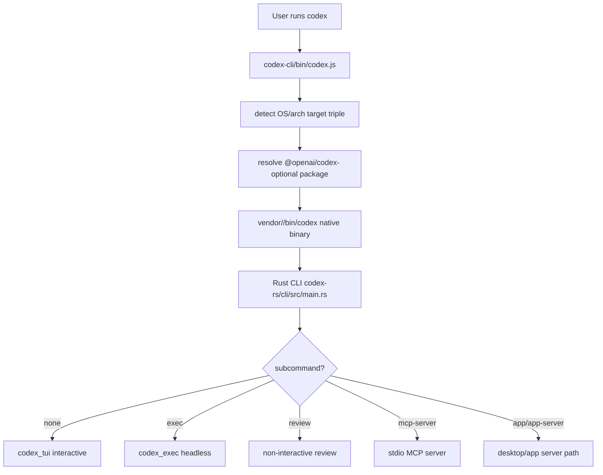
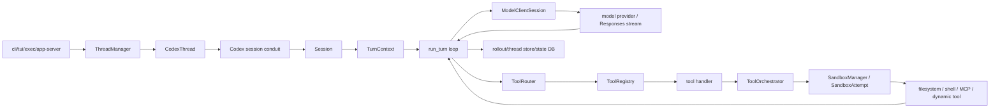
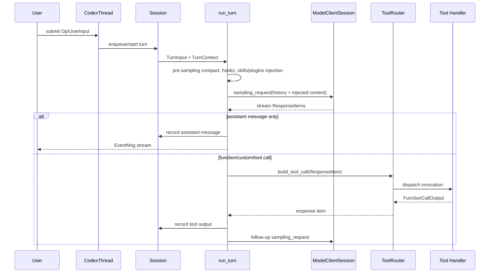
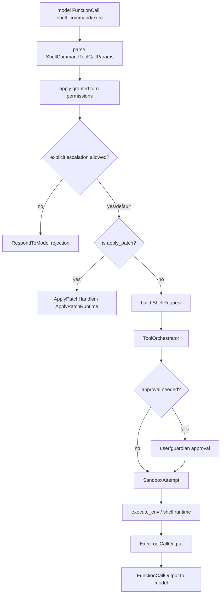

# openai/codex 심층 분석 보고서

검증 기준: 2026-06-10, local clone `sources/openai__codex`, commit `d2f6d23`, GitHub stars `90150`, license `apache-2.0`.

## 1. 평가 요약

`openai/codex`는 "로컬 터미널에서 실행되는 공식 코딩 에이전트"라는 포지션이 명확하다. 겉으로는 `codex`라는 단일 CLI지만, 실제 구조는 npm wrapper, Rust CLI, TUI, headless exec, thread/session runtime, tool registry, sandbox/runtime orchestrator, app server, MCP server, skills/plugins/extensions, rollout/state DB까지 포함하는 대형 로컬 에이전트 런타임이다.

가장 큰 특징은 다음 세 가지다.

1. 단순 CLI가 아니라 thread 기반 장기 세션 런타임이다. 과거 `ConversationManager` 명칭은 `ThreadManager`로 deprecated 되어 있고, `CodexThread`, `Session`, `Turn`으로 나누어 실행 상태를 관리한다.
2. 도구 실행은 모델 함수 호출을 그대로 실행하지 않고 `ToolRouter -> ToolRegistry -> Handler -> ToolOrchestrator -> SandboxRuntime` 계층을 통과한다. 승인, hook, sandbox, network approval, telemetry가 이 계층에서 결합된다.
3. `apply_patch`는 일반 shell command로만 처리하지 않는다. shell handler가 `apply_patch` 명령을 가로채고, 별도 parser/runtime을 통해 patch preview/progress/permission을 처리한다. 이 점은 단순 "모델이 bash를 실행하는 CLI"와 다른 핵심 차별점이다.

## 2. 발전 과정과 철학

README 기준 Codex CLI는 로컬 컴퓨터에서 실행되는 OpenAI 공식 코딩 에이전트이며, IDE 확장, Desktop app, Codex Web과 분리된 로컬 터미널 표면으로 설명된다. 즉 철학은 "하나의 모델 제품"이 아니라 여러 표면을 연결하는 로컬 실행 계층에 가깝다.

소스 구조에서도 이 방향이 드러난다.

- `codex-cli/bin/codex.js`는 사용자 설치 경험을 위해 남아 있는 얇은 Node wrapper다.
- 실제 제품 로직은 `codex-rs/` Rust workspace로 이동했다.
- workspace에는 `cli`, `tui`, `exec`, `core`, `app-server`, `mcp-server`, `skills`, `plugin`, `state`, `thread-store`, `sandboxing`, `execpolicy`, `model-provider` 등이 분리되어 있다.
- `codex-rs/core/src/lib.rs`는 `ConversationManager`, `NewConversation`, `CodexConversation`을 deprecated alias로 남기고 `ThreadManager`, `NewThread`, `CodexThread`를 공개한다. 이 명칭 변화는 "일회성 대화"보다 "작업 단위 thread"를 중심으로 설계를 재정의한 흔적이다.

설계 철학은 보수적이다. 모델의 자유로운 도구 호출을 허용하되, 실행 전후에 정책과 관측 지점을 촘촘하게 끼워 넣는다. 특히 approval policy, permission profile, sandbox policy, network proxy/approval, hooks, telemetry, rollout persistence가 서로 독립 모듈이면서 `SessionConfiguration`과 `TurnContext`에서 합쳐진다.

## 3. 저장소 구조

주요 루트 구조:

- `codex-cli/`: npm 패키지 wrapper. 플랫폼별 native binary optional dependency를 찾아 실행한다.
- `codex-rs/cli/`: 실제 `codex` Rust CLI의 clap subcommand 진입점.
- `codex-rs/tui/`: interactive terminal UI.
- `codex-rs/exec/`: `codex exec` headless 실행 모드.
- `codex-rs/core/`: thread/session/turn/runtime의 중심.
- `codex-rs/tools/`: 공용 tool spec/executor 모델.
- `codex-rs/app-server*`: Desktop/App/remote control 계열 서버.
- `codex-rs/mcp-server`, `codex-rs/codex-mcp`, `codex-rs/rmcp-client`: MCP 노출/연결 계층.
- `codex-rs/sandboxing`, `codex-rs/linux-sandbox`, `codex-rs/execpolicy`: 실행 격리와 실행 정책.
- `codex-rs/state`, `codex-rs/thread-store`, `codex-rs/rollout`: thread persistence와 이벤트 기록.
- `codex-rs/skills`, `codex-rs/core-skills`, `codex-rs/plugin`: skills/plugins 주입 계층.

## 4. 사용자 실행 플로우

### 4.1 설치된 `codex` 실행

`codex-cli/bin/codex.js`는 자체 agent 로직이 없다. OS와 CPU 아키텍처를 보고 target triple을 만든 뒤, 플랫폼별 optional package 안의 native binary를 `spawn()`한다. npm/bun 설치 경로를 감지해 `CODEX_MANAGED_BY_NPM`, `CODEX_MANAGED_BY_BUN`, `CODEX_MANAGED_PACKAGE_ROOT` 같은 환경값을 주입한다.

### 4.2 Rust CLI subcommand 분기

`codex-rs/cli/src/main.rs`의 `Subcommand`는 단일 CLI 안에 여러 제품 표면을 묶는다.

- 기본: interactive TUI
- `exec`: 비대화형 headless 실행
- `review`: 비대화형 코드 리뷰
- `login/logout`: 인증
- `mcp`: 외부 MCP 서버 관리
- `mcp-server`: Codex 자체를 MCP server로 노출
- `app-server`, `remote-control`, `app`: Desktop/App 연동
- `sandbox`, `execpolicy`, `apply`, `resume`, `fork`, `archive`, `cloud`: 로컬 실행과 thread lifecycle 보조 명령

이 구조는 Codex가 "CLI command 하나"라기보다 로컬 에이전트 운영체제에 가까운 command surface를 가진다는 뜻이다.

## 5. 코어 아키텍처

### 5.1 ThreadManager

`ThreadManager`는 in-memory thread map, thread created broadcast channel, auth manager, models manager, environment manager, skills manager, plugin manager, MCP manager, extension registry, thread store, state DB, analytics client를 가진다. 즉 thread 생성은 단순 객체 생성이 아니라 인증/모델/환경/MCP/확장/저장소를 묶는 composition root다.

### 5.2 CodexThread

`CodexThread`는 사용자 또는 app-server가 호출하는 bidirectional conduit다. 핵심 public 메서드는 `submit`, `submit_with_trace`, `submit_user_input_with_client_user_message_id`, `shutdown_and_wait`, `wait_until_terminated`이다. 실제 작업은 내부 `Codex`와 `Session`으로 위임한다.

### 5.3 Session

`Session`은 한 thread의 runtime state다. 주석상 "한 session에는 동시에 최대 1개의 running task가 있고 user input으로 interrupt 가능"하다는 제약이 있다. 주요 필드는 다음과 같다.

- `tx_event`: UI/exec/app-server로 이벤트를 내보내는 channel
- `agent_status`: agent 상태 watch channel
- `state`: history/config/rollout 관련 mutable state
- `conversation`: realtime conversation manager
- `active_turn`: 현재 실행 중인 turn
- `input_queue`: turn 도중 들어온 사용자 입력 queue
- `guardian_review_session`: approval/auto-review 계층
- `services`: model client, extensions, MCP, exec policy 등 runtime services

### 5.4 Turn

`run_turn`은 실제 agent loop다. 모델 호출 결과가 assistant message이면 turn을 끝내고, function call이면 tool을 실행한 뒤 결과를 history에 넣고 다시 sampling한다. pending input, hooks, skills/plugins injection, auto-compaction, stop hook, legacy after-agent hook까지 turn loop 내부에서 처리한다.

## 6. 도구 호출 구조

### 6.1 ToolRouter

`ToolRouter::build_tool_call`은 model response item을 내부 tool call로 변환한다.

- `ResponseItem::FunctionCall` -> namespace/name/arguments/call_id 기반 `ToolPayload::Function`
- client 실행 `ToolSearchCall` -> `tool_search`
- `CustomToolCall` -> freeform/custom tool

그 뒤 `dispatch_tool_call_with_terminal_outcome` 또는 `dispatch_tool_call_with_code_mode_result`가 `ToolInvocation`을 만들고 `ToolRegistry`에 넘긴다.

### 6.2 ToolRegistry

`ToolRegistry`는 실제 handler 실행 전후에 hooks와 telemetry를 결합한다.

- `PreToolUse` hook에서 tool input을 검사/수정/차단할 수 있다.
- handler 실행 결과를 `ToolCallOutcome`으로 정리한다.
- `PostToolUse` hook에서 tool response를 검사/수정/차단할 수 있다.
- tool exposure, hidden tool, parallel support, argument diff consumer를 관리한다.

### 6.3 Shell tool

shell-like command는 `codex-rs/core/src/tools/handlers/shell.rs`의 `run_exec_like`로 들어간다. 여기서 다음 절차가 보인다.

1. turn environment와 filesystem 확보
2. session/turn permission profile에 따라 추가 권한 정규화
3. approval policy가 `OnRequest`가 아닌데 explicit escalation을 요구하면 모델에게 거절 응답
4. `apply_patch` 명령이면 shell 실행 전에 별도 patch handler로 intercept
5. `ExecApprovalRequirement` 생성
6. `ShellRequest` 구성
7. `ToolOrchestrator`가 approval, sandbox, network approval, runtime attempt를 실행
8. stdout/stderr/exit code를 model-facing output으로 포맷

### 6.4 Apply Patch tool

`apply_patch`는 두 경로가 있다.

- freeform `apply_patch` tool: `ApplyPatchHandler`
- shell command에 섞인 `apply_patch`: shell handler의 `intercept_apply_patch`

`ApplyPatchHandler`는 streaming patch parser를 가지고 있고, `Feature::ApplyPatchStreamingEvents`가 켜져 있으면 patch hunks를 `PatchApplyUpdatedEvent`로 변환한다. 파일별 write permission을 계산해 sandbox policy와 additional permission을 병합한다. 이 덕분에 사용자 UI는 patch가 적용되기 전/중/후의 diff를 더 구조적으로 보여줄 수 있다.

## 7. 승인, 샌드박스, 네트워크 정책

`ToolOrchestrator`는 도구 실행의 중앙 통제 지점이다.

1. `ExecApprovalRequirement`를 검사한다.
2. `NeedsApproval`이면 user 또는 guardian review로 라우팅한다.
3. file system sandbox policy와 network sandbox policy로 첫 `SandboxAttempt`를 만든다.
4. network가 필요한 경우 immediate/deferred network approval을 시작한다.
5. tool runtime을 실행한다.
6. sandbox denial 또는 정책 실패 시 escalation/retry 전략을 적용한다.

이 설계의 장점은 shell, patch, networked tool, future runtime이 동일한 approval/sandbox skeleton을 공유할 수 있다는 점이다. 단점은 정책 레이어가 많아져 디버깅 난도가 높다는 점이다. 실제 장애 분석에는 `ToolOrchestrator`, `exec_policy`, `sandboxing`, `network_approval`, `guardian` 로그를 함께 봐야 한다.

## 8. 핵심 차별점

- 공식 OpenAI 로컬 에이전트라는 신뢰/모델 통합 이점.
- Rust 기반 native CLI로 배포하며 npm은 wrapper 역할만 한다.
- `ThreadManager` 중심의 세션 지속성, fork/resume/archive/cloud/app-server 명령.
- interactive TUI와 headless exec를 같은 core runtime 위에 얹는다.
- shell 실행, apply_patch, MCP, dynamic tools, skills/plugins, app connectors가 하나의 turn loop로 통합된다.
- approval/sandbox/network policy가 tool runtime의 바깥 계층에서 일관되게 적용된다.
- patch 적용을 단순 shell stdout이 아니라 구조화된 patch event로 다룬다.
- hooks와 skill/plugin injection이 turn 시작과 tool 전후에 끼어들 수 있다.

## 9. 리스크와 이상한 점

1. 복잡도 리스크: workspace crate 수가 매우 많고 core runtime이 많은 기능을 품고 있다. 기능은 강하지만, 제품 표면별 회귀 테스트가 중요하다.
2. 정책 상호작용 리스크: approval policy, permission profile, sandbox permissions, additional permissions, guardian, network approval이 겹친다. 특정 조합에서 "모델은 가능한 줄 알고 요청했지만 runtime은 거절"하는 케이스가 생길 수 있다.
3. wrapper/binary 배포 리스크: npm package는 optional platform package와 native binary 존재에 의존한다. wrapper는 binary가 없으면 reinstall 안내를 띄운다.
4. telemetry/analytics: `analytics`, `otel`, `state`, `turn_metadata` 모듈이 존재한다. 민감한 코드베이스에서는 어떤 이벤트와 메타데이터가 외부로 나가는지 설정과 문서를 확인해야 한다.
5. hidden/internal surfaces: `app-server`, `remote-control`, `responses-api-proxy`, `exec-server`, `stdio-to-uds`, feature flags, debug commands 등 일반 CLI 사용자에게 덜 보이는 표면이 많다.
6. local execution risk: shell tool은 샌드박스와 승인 계층이 있더라도 결국 로컬 명령 실행이다. `danger-full-access`나 permissive profile에서는 사용자의 파일과 네트워크에 실질 접근한다.

## 10. 케이스별 동작 정리

### interactive coding

사용자가 `codex`를 실행하면 Rust CLI가 TUI를 띄우고, TUI 입력은 `CodexThread.submit`으로 들어간다. `Session`은 turn을 만들고, `run_turn`에서 history와 context injection을 모델에 전송한다. 모델이 파일을 읽거나 명령 실행을 요청하면 `ToolRouter`가 해당 tool handler로 dispatch하고, 결과를 다시 모델에 넣어 다음 sampling을 이어간다.

### headless exec

`codex exec`는 TUI 대신 `codex-rs/exec` 이벤트 processor를 사용한다. 코어 runtime은 동일하지만 출력은 human-readable 또는 JSONL event stream으로 가공된다. CI나 자동화에 적합하지만, approval policy와 sandbox mode를 명시하지 않으면 headless 환경에서 승인이 막힐 수 있다.

### review

`review` 명령과 `tasks/review.rs`는 sub-agent 성격의 review flow를 만든다. 코드 변경을 읽고 review prompt를 구성한 뒤, 별도 thread/source로 결과를 낸다. 보고서 관점에서 Codex의 review는 단순 prompt command가 아니라 thread/session runtime을 재사용하는 특수 task다.

### MCP server

`mcp-server`는 Codex 자체를 외부 MCP client가 호출할 수 있는 서버로 노출한다. `codex-rs/mcp-server/src/message_processor.rs`가 `codex`와 `codex-reply`류 tool call을 처리해 thread를 만들고 후속 입력을 연결한다. 즉 Codex는 MCP client이면서 MCP server가 될 수 있다.

### apply latest diff

`codex apply`는 최근 Codex agent diff를 로컬 working tree에 적용하는 별도 명령이다. turn 중 patch 적용과 별개로, 저장된 rollout/diff 산출물을 사용자의 Git 작업공간에 반영하는 보조 UX다.

## 11. 결론

Codex는 "가볍게 실행되는 터미널 에이전트"라는 README 문구보다 내부 구조가 훨씬 크다. 실제 정체성은 OpenAI 모델과 로컬 개발환경 사이에서 thread, context, tool, permission, sandbox, MCP, app integration을 조정하는 Rust runtime이다. 비교군 중에서는 보안/승인/샌드박스 모델이 가장 정교한 축에 속하고, 공식 제품답게 설치 표면과 로컬/앱/웹 표면을 함께 고려한다. 반대로 복잡도와 hidden surface가 크기 때문에, 기업 도입 시에는 telemetry, app-server/remote-control, sandbox profile, execpolicy, plugin/skill injection을 별도 감사해야 한다.

