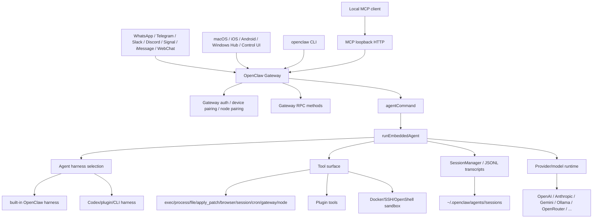
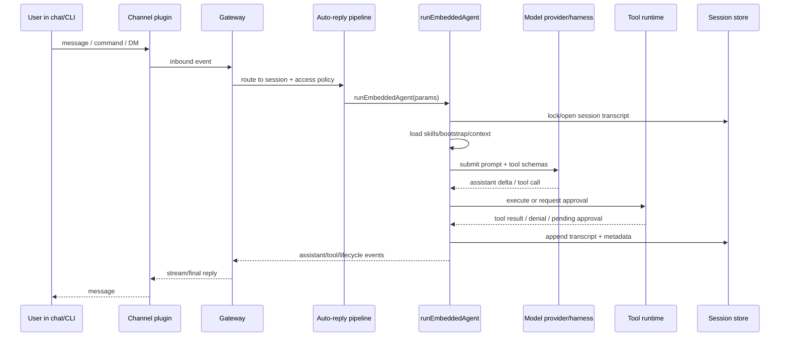
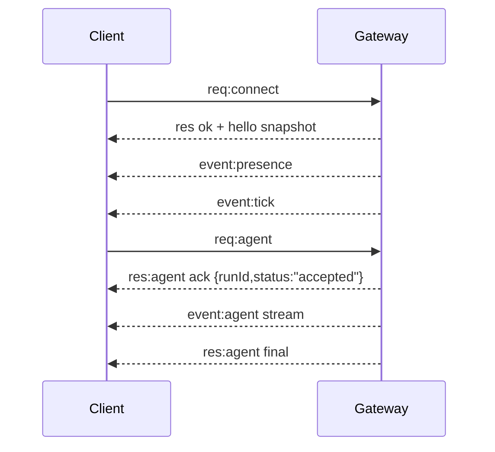
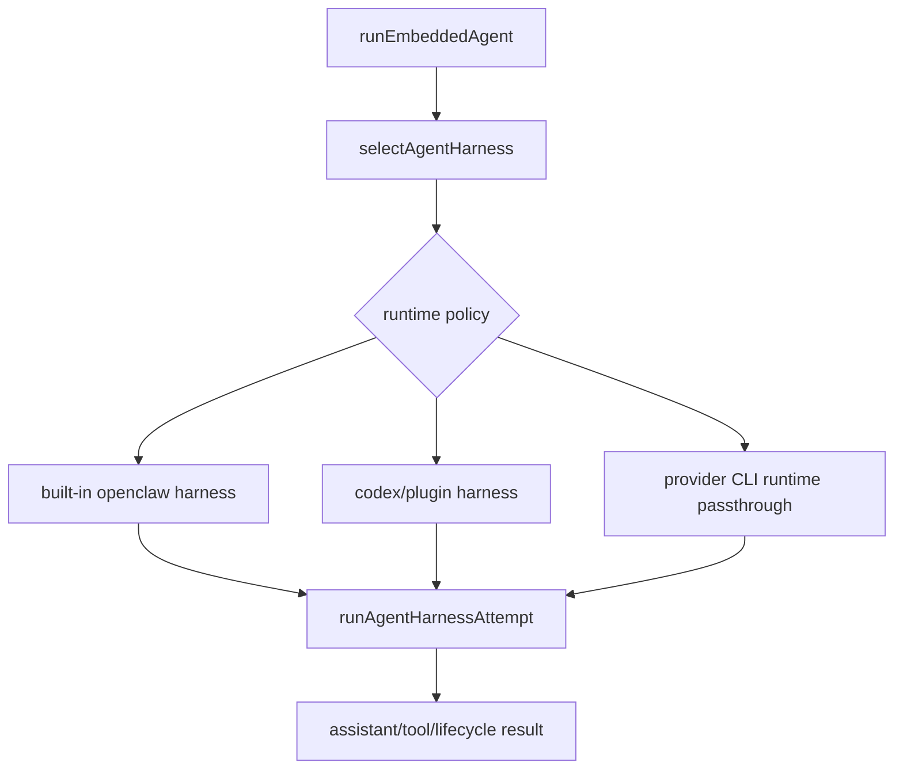
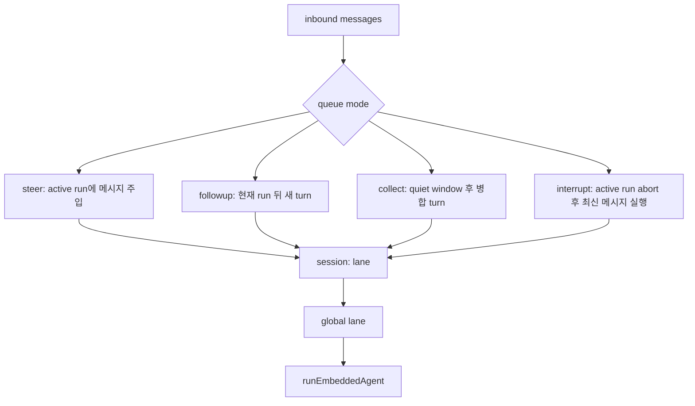
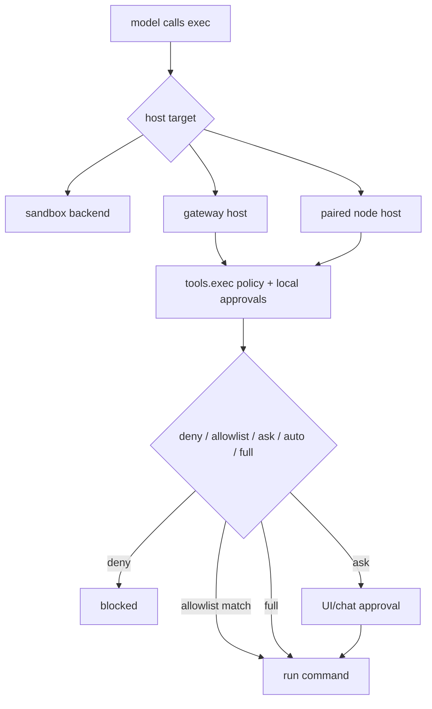
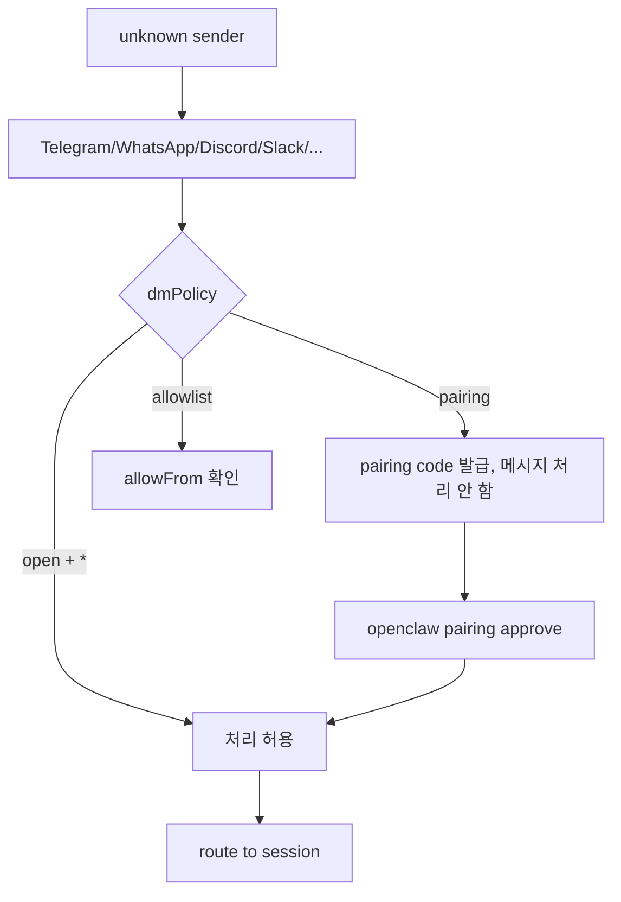
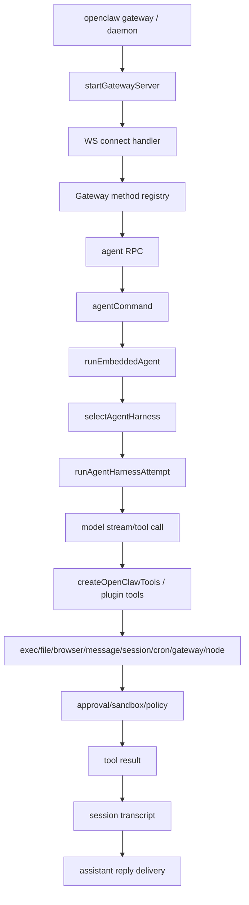
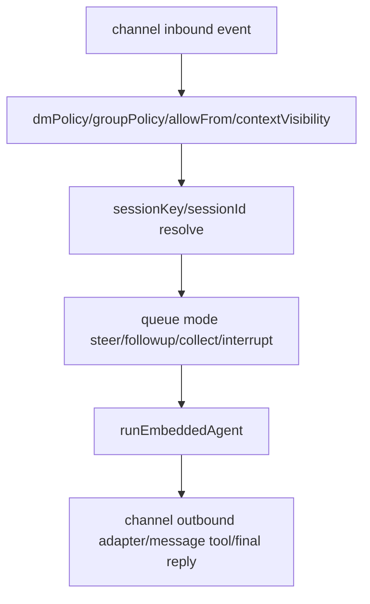
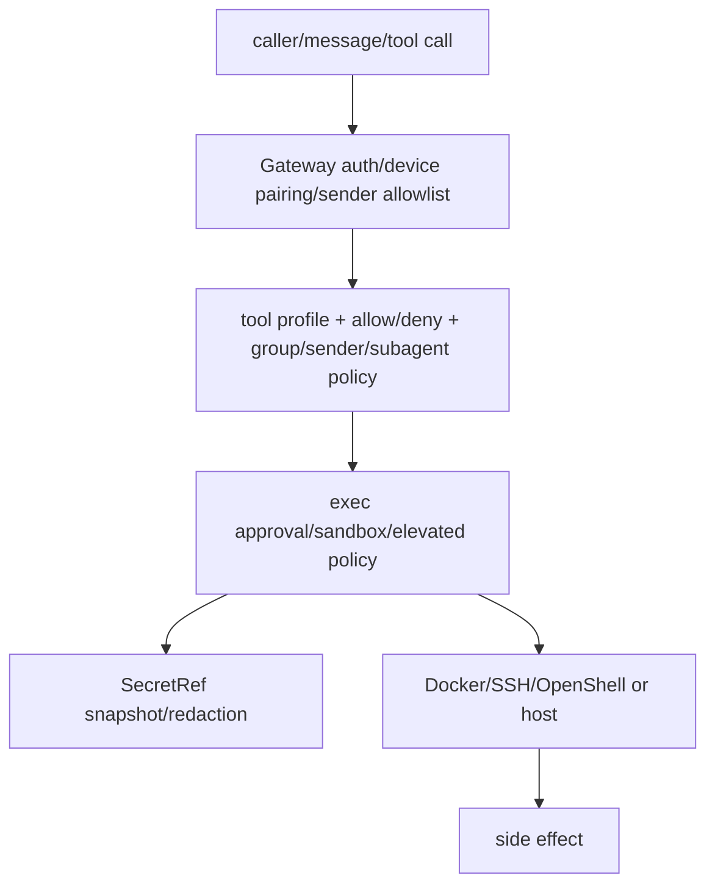

# openclaw/openclaw 분석 보고서

## 1. 요약 평가

OpenClaw는 TypeScript 기반의 개인 AI assistant gateway다. Codex, Gemini CLI, Aider처럼 “터미널에서 현재 repo를 고치는 coding agent”가 아니라, 한 사용자가 자기 기기와 메시징 채널을 묶어 항상 켜두는 개인 assistant를 만드는 제품형 모노레포다. README의 표현대로 Gateway는 control plane이고, 실제 제품은 WhatsApp/Telegram/Slack/Discord/Signal/iMessage/WebChat/모바일 노드/데스크톱 앱을 통해 작동하는 assistant다.

가장 큰 특징은 범위가 매우 넓다는 점이다. 저장소 안에는 Node CLI, WebSocket Gateway, embedded agent runtime, channel plugin, model/provider plugin, MCP loopback, skills, cron, sessions, sandbox, exec approvals, device/node pairing, Control UI, macOS/iOS/Android companion app, 보안 audit, OpenGrep rulepack, QA scenario가 함께 들어 있다. 이 저장소는 단일 CLI 도구라기보다 “개인 assistant 운영체제”에 가깝다.

설계 철학은 local-first personal assistant다. Gateway는 기본적으로 `127.0.0.1:18789`에 뜨고, 사용자는 daemon으로 띄운 뒤 채널이나 companion app이 Gateway와 WebSocket으로 통신한다. Agent runtime은 하나의 workspace를 기준으로 `AGENTS.md`, `SOUL.md`, `TOOLS.md`, `USER.md`, `IDENTITY.md`, `BOOTSTRAP.md` 같은 bootstrap context를 주입한다. 세션은 메시지 출처별로 라우팅되고 JSONL transcript와 session store로 저장된다.

강점은 제품적 완성도와 보안 의식이다. 문서와 코드가 DM pairing, allowlist, session isolation, gateway auth, device signature, exec approvals, sandbox mode, SecretRef, security audit, OpenGrep rulepack을 매우 많이 다룬다. 위험한 도구 목록도 코드상 중앙화되어 있고, HTTP tool invoke에서는 `exec`, `apply_patch`, `sessions_spawn`, `cron`, `gateway`, `nodes` 같은 high-risk tool을 기본 차단한다.

반대로 위험도는 구조의 강력함에서 나온다. OpenClaw는 실제 메시징 surface에 연결되고, agent가 shell/file/browser/node/cron/gateway/session 도구를 사용할 수 있으며, 기본 개인 assistant 신뢰 모델에서는 host exec가 넓게 열릴 수 있다. 문서도 스스로 “hostile multi-tenant security boundary가 아니다”라고 말한다. 여러 사람이 하나의 tool-enabled agent에 메시지를 보낼 수 있다면, 그들은 사실상 그 agent의 delegated tool authority를 공유한다.

또 하나의 관측 포인트는 신뢰/프로비넌스다. GitHub 메타데이터상 저장소 생성일은 2025-11-24인데, 관측 시점 star 377,929, fork 79,036으로 매우 크다. 기능 자체와 별개로 star 성장, sponsor 표시, release/package/source tree의 일관성, 공개 repo와 published package의 차이를 별도 검증해야 한다. 실제 clone된 source checkout은 `node openclaw.mjs --version` fast path만 성공했고, `dist/entry`가 없어 help/실제 명령은 빌드 전 실패했다.

## 2. 기본 정보

- 저장소: `openclaw/openclaw`
- 분석 커밋: `bb6e4772`
- 기본 브랜치: `main`
- 생성일: 2025-11-24
- 최근 push: 2026-06-10
- 최신 릴리스 관측값: `v2026.6.5` / 2026-06-09
- package version: `2026.6.2`
- 언어: TypeScript
- 라이선스 관측값: GitHub metadata `other`, README badge는 MIT, 루트 `LICENSE` 존재
- 규모: 대형 monorepo
- package name: `openclaw`
- bin: `openclaw -> openclaw.mjs`
- Node 요구사항: README 기준 Node 24 권장 또는 Node 22.19+
- 패키지 매니저: pnpm workspace
- 워크스페이스:
  - `.`
  - `ui`
  - `packages/*`
  - `extensions/*`

주요 루트는 다음과 같다.

- `openclaw.mjs`: npm launcher, Node version check, source/package entry selection
- `src/entry.ts`: CLI bootstrap, compile cache, profile/container parsing, root help/version fast path
- `src/cli/`: CLI command registration과 gateway/daemon/node/security/skills/cron/mcp 등 command
- `src/gateway/`: WebSocket/HTTP gateway, MCP loopback, server methods
- `src/agents/`: embedded agent runtime, tools, model selection, sandbox, CLI runner, sessions, harness
- `src/channels/`: inbound/outbound channel runtime와 access/allowlist 처리
- `src/auto-reply/`: inbound message를 agent run으로 연결하는 reply pipeline
- `src/plugins/`, `src/plugin-sdk/`: plugin loader, capability registry, SDK surface
- `extensions/`: provider/channel/tool/plugin 구현 모음
- `src/skills/`, `skills/`: skill discovery/loading/runtime/security와 bundled skills
- `src/security/`, `security/`: security audit와 OpenGrep rulepack
- `apps/macos`, `apps/ios`, `apps/android`: companion apps/nodes
- `ui/`: Control UI
- `docs/`: 제품 문서, 보안/아키텍처/플러그인/reference 문서

## 3. 발전 과정과 설계 철학

OpenClaw는 제품 문서에서 스스로를 “personal AI assistant”로 설명한다. 지원 채널도 일반 coding agent와 다르게 매우 넓다.

- WhatsApp
- Telegram
- Slack
- Discord
- Google Chat
- Signal
- iMessage
- IRC
- Microsoft Teams
- Matrix
- Feishu
- LINE
- Mattermost
- Nextcloud Talk
- Nostr
- Synology Chat
- Tlon
- Twitch
- Zalo
- WeChat
- QQ
- WebChat
- macOS/iOS/Android nodes

설계 철학은 다음으로 요약할 수 있다.

1. Gateway-first
   - OpenClaw의 중심은 CLI one-shot이 아니라 long-lived Gateway daemon이다.
   - Gateway가 메시징 채널, control UI, nodes, WebChat, MCP loopback을 한 포트에서 묶는다.
   - 한 host에 하나의 Gateway가 채널 세션을 소유한다.

2. Personal trust boundary
   - 문서가 명시적으로 “single trusted operator boundary”를 가정한다.
   - 서로 적대적인 다중 사용자/tenant를 한 gateway 안에서 격리하려는 제품이 아니다.
   - 다중 신뢰 경계가 필요하면 별도 gateway, 별도 OS user/host를 권한다.

3. Local-first but multi-surface
   - 기본 bind는 loopback이고, 원격 접근은 SSH tunnel/Tailscale/reverse proxy를 권장한다.
   - 하지만 실제 사용 surface는 여러 메시징 앱과 모바일/데스크톱 노드다.
   - local-first와 always-on messaging을 동시에 추구한다.

4. Workspace-as-memory
   - Agent workspace가 하나의 canonical working directory다.
   - `AGENTS.md`, `SOUL.md`, `TOOLS.md`, `USER.md`, `IDENTITY.md`, `BOOTSTRAP.md`가 assistant identity와 memory seed가 된다.
   - session transcript와 bootstrap context가 모델 prompt의 일부다.

5. Plugins as product boundary
   - provider, channel, tool, web fetch/search, speech, media, gateway discovery가 native plugin capability로 등록된다.
   - extensions가 매우 많고, core는 plugin registry를 통해 surface를 소비한다.
   - channel-specific send/edit/reaction runtime을 core가 직접 소유하기보다 plugin이 소유하게 설계한다.

6. Security by operator guardrail
   - hostile isolation보다 operator에게 현재 위험을 드러내고 좁히는 방식이다.
   - `openclaw security audit`, `doctor`, DM pairing, exec approvals, sandbox, SecretRef, allowlist가 이 방향의 구현이다.

## 4. 전체 아키텍처



이 아키텍처는 크게 다섯 계층이다.

- 입력 surface: 채널, CLI, Control UI, WebChat, nodes, MCP loopback
- Gateway/control plane: WebSocket protocol, HTTP endpoints, auth, pairing, server methods
- Agent runtime: session queue, model/auth resolution, prompt assembly, tools, harness, compaction
- Execution surface: host exec, sandbox exec, node command, browser/canvas, plugin/channel action
- Persistence: config, auth profiles, sessions, transcripts, pairing store, exec approvals, secrets snapshot

## 5. 사용자 실행 흐름

OpenClaw의 일반 사용 흐름은 다음과 같다.



문서상 authoritative loop는 `docs/concepts/agent-loop.md`에 정리되어 있다.

1. Gateway RPC `agent` 또는 CLI `agent` command가 entrypoint다.
2. `agent` RPC는 params를 검증하고 session을 resolve하고 metadata를 저장한 뒤 `{ runId, acceptedAt }`을 즉시 반환한다.
3. `agentCommand`가 model, thinking, verbose, trace default를 resolve하고 skill snapshot을 로드한다.
4. `runEmbeddedAgent()`가 실제 OpenClaw runtime을 실행한다.
5. `subscribeEmbeddedAgentSession`이 runtime event를 Gateway `agent` stream으로 bridge한다.
6. tool events는 `stream: "tool"`로, assistant deltas는 `stream: "assistant"`로, lifecycle events는 `stream: "lifecycle"`로 나간다.
7. `agent.wait`는 run id의 lifecycle end/error를 기다린다.

## 6. CLI와 런처

`openclaw.mjs`는 npm package entrypoint다. 중요한 역할은 다음이다.

- Node version check
- `--version` fast path
- source checkout인지 packaged install인지 판별
- compile cache directory 조정
- packaged dist entry 찾기
- 신호 전달과 respawn 처리
- missing `dist/entry`인 경우 사용자가 build/package install을 해야 한다는 오류 출력

`src/entry.ts`는 실제 TypeScript entrypoint다.

- CLI profile/env 적용
- container target parsing
- root help fast path
- root version fast path
- Windows argv normalize
- compile cache와 respawn
- source checkout에서 packaged entry와 중복 실행 방지
- `runMainOrRootHelp()`로 실제 CLI command tree 실행

실행 검증 결과는 다음과 같다.

- `node openclaw.mjs --version`
  - 성공
  - 출력: `OpenClaw 2026.6.2 (bb6e477)`
- `node openclaw.mjs --help`
  - 실패
  - 이유: `dist/entry.(m)js`가 없는 unbuilt source tree
  - 오류 메시지는 `pnpm install && pnpm build` 또는 built package 설치를 안내한다.

즉 이 clone 상태는 소스 분석에는 충분하지만, 실제 CLI 동작 검증은 빌드 산출물이 필요하다.

## 7. Gateway protocol

Gateway는 WebSocket 중심이다. 문서 기준 기본 bind는 `127.0.0.1:18789`이고, Control UI/CLI/WebChat/companion nodes가 같은 Gateway에 붙는다.



Wire protocol 요점은 다음이다.

- transport: WebSocket text frames with JSON payload
- 첫 frame은 반드시 `connect`
- request: `{ type: "req", id, method, params }`
- response: `{ type: "res", id, ok, payload|error }`
- event: `{ type: "event", event, payload, seq?, stateVersion? }`
- side-effect method에는 idempotency key가 필요하다.
- node client는 `role: "node"`와 capability/command/permission을 선언한다.
- auth는 shared secret, trusted proxy, device token, pairing state를 조합한다.

`src/gateway/server/ws-connection/message-handler.ts`는 이 handshake의 중심이다. 이 파일은 다음을 다룬다.

- connect frame validation
- protocol version
- payload size 제한
- origin check
- gateway auth decision
- device identity와 signature
- device/node pairing
- node role/capability reconciliation
- trusted proxy/local direct request 판단
- operator scope
- plugin node capability token
- request dispatch와 response framing

## 8. Agent runtime

OpenClaw의 agent runtime은 `src/agents/embedded-agent-runner/run.ts`가 중심이다. 이 함수는 매우 큰 orchestration function이며, 다음 책임을 가진다.

- sessionKey backfill
- per-session lane과 global lane queueing
- run timeout과 progress watchdog
- workspace resolution
- auth profile store와 provider auth 선택
- model resolution과 fallback/profile rotation
- skill snapshot loading
- context engine 초기화/maintenance
- bootstrap/system prompt 구성
- session manager open/write lock
- tool surface 생성
- agent harness 선택
- assistant/tool event subscription
- compaction, retry, failover, empty response/reasoning-only retry
- final reply payload shaping
- usage/cost aggregation
- session metadata 업데이트

실제 runtime은 한 번에 모델 provider를 직접 호출하기보다 “harness”를 선택한다.



`src/agents/harness/selection.ts`의 설계가 중요하다.

- built-in OpenClaw harness는 plugin 후보 목록과 분리된다.
- runtime이 `openclaw`이면 강제로 built-in을 쓴다.
- runtime이 plugin id이면 해당 plugin harness가 provider/model을 지원해야 한다.
- runtime이 `auto`이면 plugin harness 중 지원하는 것을 priority 기준으로 고르고, 없으면 OpenClaw로 fallback한다.
- `codex` implicit runtime인데 registered Codex harness가 없으면 OpenClaw가 처리한다.
- Claude/Gemini CLI runtime alias처럼 provider-owned CLI는 plugin harness 없이 OpenClaw passthrough로 갈 수 있다.

이 구조는 OpenClaw가 자체 model loop와 Codex/Claude/Gemini/외부 CLI backend를 하나의 agent runtime으로 흡수하려는 방향을 보여준다.

## 9. Queue와 concurrency

OpenClaw는 session 단위 동시성을 강하게 통제한다.



기본 queue 설정은 다음이다.

- mode: `steer`
- debounce: 500ms
- cap: 20
- drop: `summarize`

`runEmbeddedAgent()`도 내부에서 session lane과 global lane에 enqueue한다. session lane은 한 세션 transcript를 동시에 여러 run이 쓰지 않게 하고, global lane은 전체 agent run parallelism을 제한한다. session transcript write에는 별도 file lock도 있어서 in-process queue를 우회하는 writer까지 어느 정도 막는다.

## 10. Session과 workspace

OpenClaw session은 단순 chat id가 아니라 routing과 storage의 중심이다.

- DM: 기본적으로 shared `main` session
- group chat: group별 isolated session
- room/channel: room별 isolated session
- cron: run마다 fresh session
- webhook: hook별 isolated session

문서가 경고하는 핵심은 DM isolation이다. 기본적으로 모든 DM이 하나의 session을 공유하기 때문에, 여러 사람이 bot에게 DM할 수 있으면 `session.dmScope: "per-channel-peer"` 또는 더 강한 scope가 필요하다. 그렇지 않으면 Alice의 context가 Bob의 prompt에 섞일 수 있다.

상태 저장 경로는 다음이다.

- session store: `~/.openclaw/agents/<agentId>/sessions/sessions.json`
- transcript: `~/.openclaw/agents/<agentId>/sessions/<sessionId>.jsonl`

workspace는 agent의 도구와 context의 기준 cwd다. 기본 bootstrap 파일은 다음이다.

- `AGENTS.md`
- `SOUL.md`
- `TOOLS.md`
- `BOOTSTRAP.md`
- `IDENTITY.md`
- `USER.md`

첫 turn에서 OpenClaw는 이 파일들의 내용을 system prompt의 Project Context로 주입한다. 큰 파일은 잘리고, missing file은 marker로 표시된다.

## 11. Tool surface

`src/agents/agent-tools.ts`는 “효과적인 tool surface”를 구성하는 핵심 파일이다. 주석상 이 함수는 core, shell, channel, OpenClaw, plugin, Tool Search 도구를 조립한 뒤 sandbox/profile/provider/sender/group/sub-agent policy를 적용한다.

주요 도구 범주는 다음과 같다.

- 파일: read/write/edit/apply_patch
- 실행: exec/process
- session: sessions_list/sessions_history/sessions_send/sessions_spawn
- messaging: message tool과 channel-specific action
- gateway: gateway control plane
- cron: scheduled jobs
- nodes: paired device/node command
- browser/canvas/media
- plugin tools
- tool search/describe
- skill workshop/skills-related tools

정책 pipeline은 여러 레이어를 반영한다.

- global tools profile/allow/deny
- provider/model별 policy
- agent별 policy
- group/channel policy
- sender policy
- sandbox tool policy
- subagent inherited allow/deny
- message provider policy
- local model lean policy
- plugin tool metadata
- tool loop detection

`src/security/dangerous-tools.ts`는 Gateway HTTP invoke에서 기본 차단할 위험 도구를 명시한다.

- `exec`
- `spawn`
- `shell`
- `fs_write`
- `fs_delete`
- `fs_move`
- `apply_patch`
- `sessions_spawn`
- `sessions_send`
- `cron`
- `gateway`
- `nodes`

이 목록은 OpenClaw가 어떤 tool을 RCE/control-plane surface로 보는지 잘 보여준다.

## 12. Exec approvals

OpenClaw의 exec approval은 hostile sandbox가 아니라 operator guardrail이다. 문서가 말하는 핵심은 “tool policy + allowlist + optional user approval이 모두 맞아야 host exec를 허용한다”이다.



중요한 특징은 다음이다.

- approvals는 `~/.openclaw/exec-approvals.json`에 저장된다.
- effective policy는 config와 local approvals file 중 더 엄격한 쪽을 반영한다.
- `askFallback`은 approval UI가 없을 때 deny/allowlist/full 중 무엇을 할지 정한다.
- `strictInlineEval`은 `python -c`, `node -e`, `osascript -e` 같은 inline eval을 allowlist만으로 통과시키지 않게 한다.
- shell script나 interpreter file invocation에 대해 변경 drift를 일부 bind하려 한다.
- 문서는 YOLO/no-approval 모드가 기본 host behavior일 수 있다고 설명하며, production/shared 환경에서는 반드시 좁혀야 한다.

`src/agents/bash-tools.exec.ts`는 실행 파이프라인을 구현한다.

- target resolve: gateway/sandbox/node
- exec policy resolve
- approval state/load
- env sanitization
- safe bin runtime policy
- command guard
- script preflight
- process launch
- foreground/background handling
- output rendering
- plugin hook integration

## 13. Sandbox 아키텍처

OpenClaw sandbox는 선택 기능이다. Gateway 프로세스는 host에 남고, tool execution만 sandbox backend로 보낸다.

지원 backend는 다음이다.

- Docker
- SSH
- OpenShell

모드는 다음이다.

- `off`: sandbox 없음
- `non-main`: main이 아닌 session만 sandbox
- `all`: 모든 session sandbox

scope는 다음이다.

- `agent`: agent별 하나의 container
- `session`: session별 container
- `shared`: sandboxed session 전체 공유 container

Docker default는 코드상 꽤 보수적이다.

- image: default sandbox image
- `readOnlyRoot: true`
- `tmpfs`: `/tmp`, `/var/tmp`, `/run`
- `network: "none"`
- `capDrop: ["ALL"]`
- workspace access는 별도 설정

위험 옵션도 명시되어 있다.

- `dangerouslyAllowReservedContainerTargets`
- `dangerouslyAllowExternalBindSources`
- `dangerouslyAllowContainerNamespaceJoin`

주의할 점은 elevated exec다. 문서상 elevated exec는 sandbox를 우회하고 gateway 또는 node host에서 실행된다. 따라서 sandbox를 켰다고 해서 모든 실행이 자동 격리되는 것은 아니다.

## 14. Channel, pairing, node trust

OpenClaw는 messaging channel을 untrusted input으로 취급한다. 기본 DM 정책은 pairing이다.



중요한 경계는 다음이다.

- pairing은 sender가 bot을 trigger할 수 있게 하는 것이지, per-user host authorization이 아니다.
- shared agent에 여러 sender가 붙으면 tool authority를 공유한다.
- group command authorization은 pairing-store state가 아니라 configured allowlist를 사용한다.
- context visibility는 trigger authorization과 별도다.
- quoted/thread history를 allowlist sender만 보이게 하려면 `contextVisibility`를 좁혀야 한다.

Node도 별도 pairing을 가진다. Node는 macOS/iOS/Android/headless 등 remote execution surface다. `role: node`로 connect하고 capability/commands를 선언한다. Node pairing은 device identity와 token을 사용하며, local loopback 같은 일부 경로는 UX를 위해 자동 승인될 수 있지만, tailnet/LAN/public은 explicit approval을 요구하는 모델이다.

## 15. MCP loopback

`src/gateway/mcp-http.ts`는 local MCP client를 위한 loopback HTTP JSON-RPC server다.

특징은 다음이다.

- `127.0.0.1`에 bearer-auth loopback server를 띄운다.
- owner token과 non-owner token을 생성한다.
- Gateway-scoped tools를 MCP tool로 노출한다.
- request body size와 timeout을 적용한다.
- request disconnect 시 tool call을 abort한다.
- sessionKey, messageProvider, channel/thread/message id, senderIsOwner 등을 context로 넣어 scoped tool surface를 만든다.

이 구조는 OpenClaw를 다른 agent가 MCP server처럼 사용할 수 있게 한다. 하지만 loopback bearer token이 노출되면 Gateway tool surface로 이어질 수 있으므로 process/log/url boundary를 주의해야 한다.

## 16. Plugin 시스템

OpenClaw plugin 시스템은 매우 크다. 문서상 public capability model은 다음 capability를 등록할 수 있다.

- text inference
- CLI inference backend
- embeddings
- speech
- realtime transcription
- realtime voice
- media understanding
- transcripts source
- image/music/video generation
- web fetch/search
- channel/messaging
- gateway discovery

Plugin lifecycle은 네 단계다.

1. manifest + discovery
   - configured paths, workspace roots, global plugin roots, bundled plugins에서 후보를 찾는다.
   - `openclaw.plugin.json`과 bundle manifest를 읽는다.

2. enablement + validation
   - enabled/disabled/blocked/exclusive slot을 결정한다.

3. runtime loading
   - native plugin이 in-process로 로드되고 registry에 capability를 등록한다.
   - packaged JS는 native require, local source TS는 emergency Jiti fallback을 쓴다.

4. surface consumption
   - provider, channel, tools, hooks, HTTP routes, CLI commands, services가 registry를 통해 노출된다.

Plugin hooks는 agent loop의 여러 위치에 붙을 수 있다.

- `before_model_resolve`
- `before_prompt_build`
- `before_agent_reply`
- `agent_end`
- `before_compaction` / `after_compaction`
- `before_tool_call` / `after_tool_call`
- `before_install`
- `tool_result_persist`
- `message_received` / `message_sending` / `message_sent`
- `session_start` / `session_end`
- `gateway_start` / `gateway_stop`

이 플러그인 구조는 확장성의 핵심이지만 동시에 공급망 위험이다. Third-party plugin은 in-process로 실행될 수 있고, hooks는 prompt/tool/message boundary에 개입한다.

## 17. Skills

Skills는 `SKILL.md` frontmatter와 markdown body로 구성되는 instruction package다. OpenClaw의 skill loading precedence는 다음이다.

1. workspace skills: `<workspace>/skills`
2. project agent skills: `<workspace>/.agents/skills`
3. personal agent skills: `~/.agents/skills`
4. managed/local skills: `~/.openclaw/skills`
5. bundled skills
6. extra directories와 plugin skills

같은 이름의 skill이 여러 위치에 있으면 높은 precedence가 이긴다. Agent별 allowlist도 있다.

보안상 중요한 점:

- 문서는 third-party skills를 untrusted code로 취급하라고 경고한다.
- ClawHub verification/security scan이 있지만, 최종적으로는 사용자가 읽고 신뢰해야 한다.
- Uploaded archive install은 기본 off이고 `skills.install.allowUploadedArchives: true`가 필요하다.
- workspace/personal skills는 prompt와 tool usage를 바꿀 수 있으므로 agent behavior 공급망이다.

## 18. Secrets와 credential model

OpenClaw는 SecretRef를 지원한다.

```json5
{ source: "env" | "file" | "exec", provider: "default", id: "..." }
```

핵심 모델은 runtime snapshot이다.

- SecretRef는 activation 시 eager resolve된다.
- active SecretRef가 resolve되지 않으면 startup/reload가 fail-fast된다.
- reload는 atomic swap이다.
- hot request path에서 매번 secret provider를 호출하지 않는다.
- inactive surface의 SecretRef는 startup을 막지 않고 diagnostic만 낸다.

중요한 한계도 문서에 명시되어 있다. SecretRef는 config에 plaintext를 저장하지 않게 도와주지만, agent가 읽을 수 있는 파일 안에 plaintext credential이 남아 있으면 file/shell tool로 우회해서 읽을 수 있다. 따라서 SecretRef migration은 OS/container isolation과 함께 봐야 한다.

Exec secret provider는 절대 path command, symlink policy, trusted dirs, timeout, env allowlist, output byte limit, JSON-only mode를 가진다. 이것은 잘 설계되어 있지만, secret provider command 자체가 공급망·권한 경계가 된다.

## 19. HTTP tools invoke API

Gateway는 `/tools/invoke` HTTP endpoint를 제공한다. 이 API는 “agent turn 없이 tool 하나를 직접 호출”하기 위한 surface다.

보안 모델:

- Gateway auth를 사용한다.
- shared-secret bearer auth는 전체 gateway trusted operator access로 취급된다.
- `x-openclaw-scopes`로 좁힌 scope는 token/password mode에서 무시되고 full default operator scope가 복원된다.
- trusted proxy/none private ingress 모드에서는 scope header를 반영할 수 있다.
- 직접 public internet에 노출하면 안 된다.

기본적으로 위험 도구는 deny된다. 이 목록은 `DEFAULT_GATEWAY_HTTP_TOOL_DENY`와 문서가 일치한다. `gateway.tools.allow`로 override할 수 있지만, 이는 exposure override이지 scope upgrade가 아니다. 특히 `exec`가 reachable하면 filesystem write tool을 막아도 shell이 파일을 쓸 수 있다.

## 20. Security audit와 rulepack

OpenClaw는 별도 security audit CLI와 OpenGrep rulepack을 가진다.

`security/README.md` 기준 공개 repo에는 다음이 포함된다.

- `security/opengrep/precise.yml`
- rule metadata check
- rule compiler
- local wrapper `scripts/run-opengrep.sh`
- PR diff/full workflow

문서는 maintainer-only advisory triage와 detector-generation prompt는 public repo 밖에 있다고 설명한다. 즉 공개 저장소에는 regression firewall로 쓰는 durable artifacts가 들어 있고, 보안 연구/triage 일부는 비공개로 운영된다.

`src/security/audit.ts`는 다음 footgun을 검사한다.

- Gateway auth exposure
- browser control exposure
- elevated allowlist wildcard
- filesystem permission
- permissive exec approvals
- open-channel tool exposure
- sandbox 설정이 off인데 sandbox exec로 가는 drift
- write/edit/apply_patch는 막았지만 exec가 남아 있는 read-only 착각
- interpreter safeBins without strict inline eval
- plugin allowlist 없이 load되는 plugin
- logging redaction off
- hook token reuse
- config/secrets path permission

이 저장소는 위험한 surface를 많이 제공하지만, 적어도 그 위험을 문서화하고 자동 검사하려는 흔적이 매우 강하다.

## 21. 숨겨진 표면과 위험 요소

1. Personal assistant trust model
   - 문서가 hostile multi-tenant boundary가 아니라고 명시한다.
   - 여러 사람이 같은 agent를 쓰면 tool authority를 공유한다.
   - enterprise multi-user isolation을 기대하면 안 된다.

2. 기본 host exec posture
   - exec approvals 문서상 trusted personal setup에서 host exec가 넓게 열릴 수 있다.
   - `security="full"`, `ask="off"` 조합은 편하지만 원격/공유 채널과 만나면 위험하다.

3. DM shared session default
   - 기본 DM은 shared session이다.
   - 여러 사람이 DM 가능하면 privacy/context bleed 위험이 있다.
   - `session.dmScope`를 좁혀야 한다.

4. Public/open DM policy
   - `dmPolicy="open"`과 `allowFrom=["*"]`는 public inbound를 허용한다.
   - tool-enabled agent와 결합하면 prompt injection이 곧 action risk가 된다.

5. Gateway HTTP `/tools/invoke`
   - Gateway token/password는 full operator surface로 취급된다.
   - 기본 deny list가 있지만 override가 가능하다.
   - 이 endpoint는 loopback/private ingress에 묶어야 한다.

6. Node command relay
   - paired node는 remote device action surface다.
   - `nodes` tool은 기본 HTTP deny 목록에 포함될 만큼 위험하다.

7. Elevated exec bypass
   - elevated exec는 sandbox를 우회한다.
   - sandbox를 켰다는 이유만으로 host action이 안전해지는 것은 아니다.

8. Docker socket/DooD
   - Gateway를 Docker 안에 넣고 host Docker socket으로 sibling sandbox를 만들면 host path parity와 Docker 권한 문제가 생긴다.
   - sandbox container에 Docker socket을 mount하지 말라고 문서가 경고한다.

9. Plugin in-process loading
   - native plugin은 process 안에서 hooks/tools/providers를 등록한다.
   - third-party plugin은 코드 실행 공급망이다.

10. Skills 공급망
   - workspace/personal/managed/bundled/plugin skills가 prompt와 tool guidance를 바꾼다.
   - ClawHub 검증이 있어도 무조건 안전한 실행 경계는 아니다.

11. SecretRef 한계
   - SecretRef는 config 저장소의 plaintext를 줄이지만 agent-readable file에 남은 credential은 보호하지 않는다.
   - file/shell 도구가 열려 있으면 residue를 읽을 수 있다.

12. MCP loopback token
   - MCP loopback은 bearer token으로 Gateway tool surface를 노출한다.
   - local process/log/token leakage가 중요하다.

13. Sponsorship/프로비넌스 관측
   - README sponsor 표시는 매우 큰 회사 로고를 포함한다.
   - 공개 GitHub metadata상 star/fork 수가 생성일 대비 이례적으로 크다.
   - 기능 평가와 별개로 실제 sponsorship, package provenance, release artifact, npm ownership 검증이 필요하다.

14. Source tree와 published package 차이
   - clone된 source checkout에는 `dist/entry`가 없어 CLI help/명령이 실패한다.
   - npm package는 shrinkwrap과 dist를 포함하는 release artifact일 가능성이 높다.
   - source와 published artifact를 별도 검증해야 한다.

15. 비공개 보안 triage 자산
   - security README는 maintainer-only advisory triage와 detector-generation prompt가 public repo 밖에 있다고 말한다.
   - 공개 repo만으로는 모든 보안 운영 프로세스를 검토할 수 없다.

## 22. 경쟁/인접 프로젝트와 비교

### OpenClaw vs Codex/Gemini CLI/Aider

Codex, Gemini CLI, Aider는 로컬 개발자 터미널에서 repo를 읽고 고치는 coding workflow가 중심이다. OpenClaw도 Codex/Gemini/Claude CLI backend와 coding tools를 품을 수 있지만, 기본 목적은 coding CLI가 아니다. OpenClaw는 메시징 채널과 개인 기기를 통해 항상 접근 가능한 assistant gateway다.

### OpenClaw vs Goose

Goose도 desktop/CLI/API/MCP/extension을 제공하는 local agent platform 성격이 있다. OpenClaw는 여기에 messaging channel, pairing, mobile node, DM policy, session routing, plugin/channel ecosystem이 훨씬 강하게 붙어 있다. Goose가 개발자 로컬 작업/확장 플랫폼에 가깝다면, OpenClaw는 개인 비서와 커뮤니케이션 gateway에 가깝다.

### OpenClaw vs Agno

Agno는 Python SDK/AgentOS로 agent product backend를 만드는 프레임워크다. OpenClaw는 더 end-user product에 가깝다. Agno는 사용자가 agent/team/workflow를 코드로 조립하는 쪽이고, OpenClaw는 Gateway daemon과 채널/앱/스킬/플러그인을 운영하는 쪽이다.

### OpenClaw vs Home assistant류

OpenClaw는 Home Assistant처럼 local-first control plane과 integrations를 지향하지만, 장치 자동화보다 LLM agent와 messaging을 중심에 둔다. cron, node, browser, tools, skills가 assistant action surface를 만든다.

## 23. 실제 이해를 위한 호출 체인

가장 중요한 호출 체인은 다음이다.



채널 입력은 이 체인의 앞단에 붙는다.



보안 판단은 별도 경로에서 반복된다.



## 24. 결론

OpenClaw는 분석 대상 중 가장 “제품형”에 가까운 저장소다. 단일 agent loop만 놓고 보면 과도하게 복잡해 보이지만, 메시징 채널, 개인 기기, 데스크톱/모바일 companion, plugins, skills, sessions, pairing, sandbox, approvals, cron, MCP까지 포함하는 제품 범위를 보면 구조가 이해된다.

기술적으로는 Gateway 중심 WebSocket protocol, session queue, embedded agent runtime, harness selection, plugin capability registry, policy-driven tool surface가 핵심이다. “사용자의 여러 채널에서 들어온 이벤트를 하나의 개인 assistant workspace와 session model로 흡수하고, 모델/tool/plugin/sandbox를 통해 응답한다”가 전체 흐름이다.

운영 관점에서는 기능보다 경계 설정이 더 중요하다. OpenClaw는 개인 assistant trust model에서는 강력하고 편하지만, shared/public/multi-user 환경에서는 DM policy, session isolation, gateway auth, plugin/skill trust, exec approvals, sandbox, SecretRef migration, HTTP tools invoke exposure를 모두 명시적으로 좁혀야 한다. 특히 생성일 대비 비정상적으로 큰 star/fork 지표와 source/published artifact 차이는 코드 품질 평가와 별개로 공급망 검증 항목으로 남겨야 한다.
