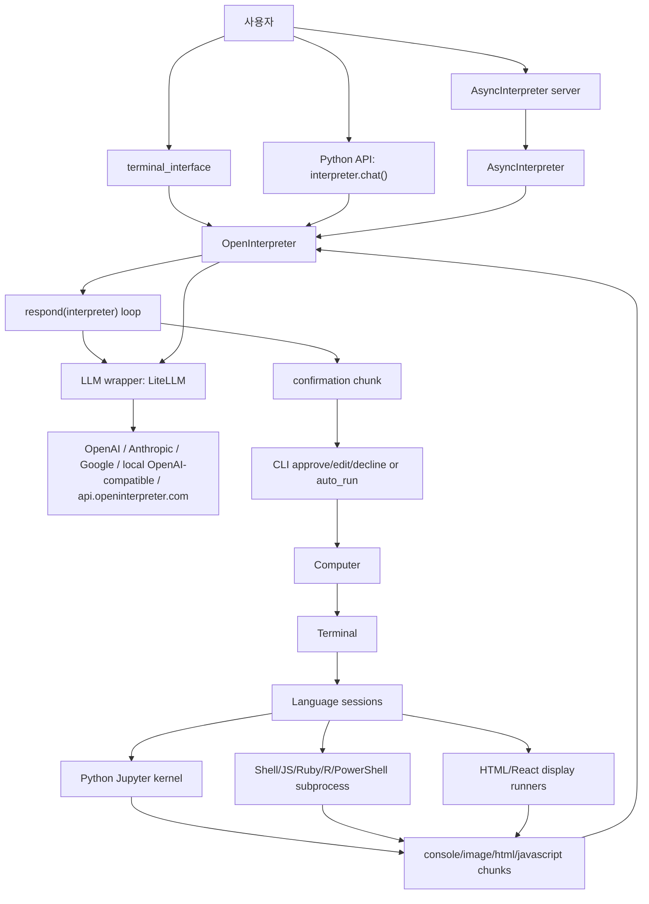
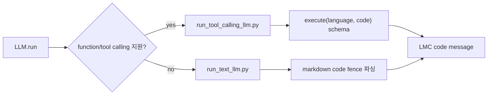
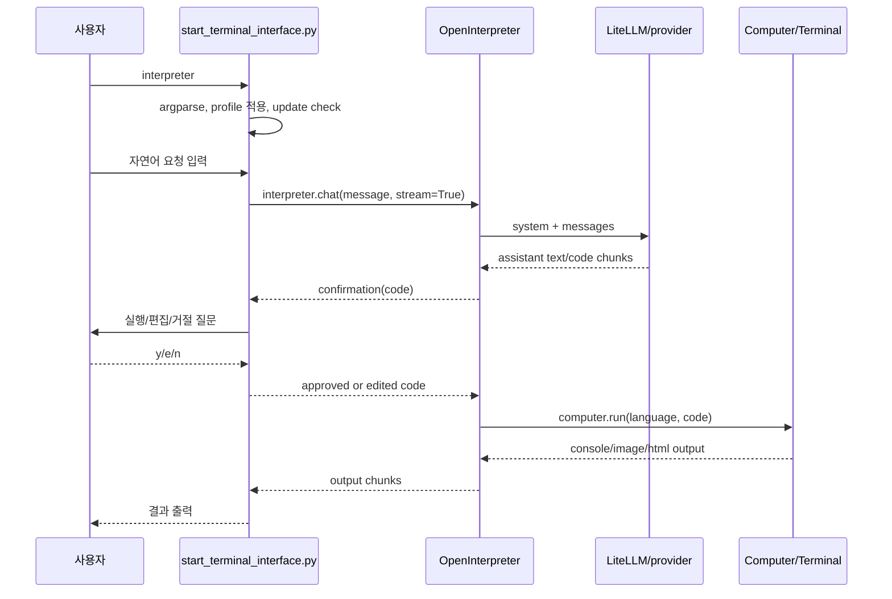
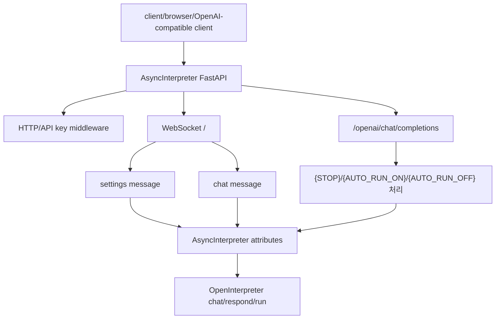
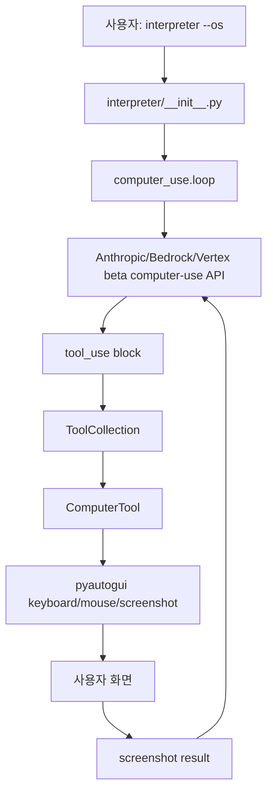

# openinterpreter/open-interpreter 심층 분석

분석 기준일: 2026-06-10  
분석 대상: `openinterpreter/open-interpreter`  
로컬 소스: `sources/openinterpreter__open-interpreter`  
분석 커밋: `e00f08e`  
기본 브랜치: `main`  
주 언어: Python  
라이선스: AGPL-3.0  
최신 릴리스 메타데이터: GitHub API 기준 없음  
GitHub 메타데이터: 2026-06-10 수집 시점 기준 star 약 63,850, fork 약 5,543

## 1. 한 줄 평가

Open Interpreter는 "LLM이 사용자의 로컬 컴퓨터에서 코드를 실행하게 하는" 도구다. Codex, Gemini CLI, opencode 같은 개발 워크스페이스 중심 에이전트와 달리, 이 프로젝트의 핵심은 특정 저장소를 수정하는 개발 에이전트라기보다 자연어로 로컬 OS, 파일, 패키지, shell, Python kernel, 브라우저/GUI API까지 조작하는 범용 컴퓨터 인터페이스에 가깝다.

가장 중요한 특징은 단순하다. 모델이 `python`, `shell`, `javascript`, `applescript` 등으로 코드를 생성하고, Open Interpreter가 이를 사용자의 실제 머신에서 실행한다. 기본값은 실행 전 사용자 승인이다. 그러나 `-y` 또는 `interpreter.auto_run = True`로 승인 절차를 우회할 수 있고, 일부 프로필은 이를 명시적으로 켠다. 그래서 이 레포의 설계 가치는 "모델과 로컬 실행 환경 사이의 얇고 유연한 브리지"이고, 핵심 위험도 바로 그 지점에서 발생한다.

## 2. 레포지토리 성격과 발전 방향

README는 Open Interpreter를 ChatGPT Code Interpreter의 로컬 대안으로 설명한다. ChatGPT Code Interpreter가 hosted sandbox에서 시간, 파일 크기, 인터넷, 패키지 제한을 갖는 것과 달리, Open Interpreter는 사용자의 로컬 머신에서 실행되므로 인터넷 접근, 로컬 파일, 설치된 패키지, 시스템 설정에 접근할 수 있다.

`docs/ROADMAP.md`는 프로젝트의 범위를 꽤 명확히 적는다. `core`의 목표는 "LLM이 안전하게 컴퓨터를 제어하도록 하는 방법"이며, 현재 구현은 "언어 모델이 조작할 수 있는 실시간 코드 실행 환경"이다. `terminal_interface`는 이 core를 텍스트로 지시하고 local/hosted LLM에 연결하는 표면이다. 즉 Open Interpreter는 거대한 IDE를 만들기보다, 모델이 코드를 생성하고 로컬 실행 결과를 다시 모델에 먹이는 loop를 먼저 완성하려는 철학을 갖고 있다.

발전 방향은 세 갈래로 보인다.

1. 기존 Open Interpreter core: terminal, Python API, server, LMC message protocol.
2. 프로필과 local model 지원: Ollama, LM Studio, OpenAI-compatible endpoint, remote profile.
3. `--os` 모드: Anthropic Computer Use 스타일의 GUI 제어 루프.

현재 소스에는 이 세 갈래가 모두 섞여 있다. core는 LiteLLM 기반 code execution loop이고, `interpreter/computer_use`는 Anthropic beta computer-use API를 쓰는 별도 실행 경로다. 따라서 이 레포를 읽을 때는 "Open Interpreter classic"과 "`--os` computer-use 모드"를 분리해야 한다.

## 3. 레포 구성

수집된 인벤토리 기준:

- 파일 수: 276
- 주요 확장자: `.py` 144개, `.mdx` 77개, `.md` 16개, `.ipynb` 9개
- 주요 매니페스트: `pyproject.toml`, `poetry.lock`, `Dockerfile`, `examples/Dockerfile`
- 패키지 버전: `0.4.3`
- Python 요구사항: `>=3.9,<4`

`pyproject.toml`의 CLI entrypoint는 다음과 같다.

| 명령 | 대상 함수 |
| --- | --- |
| `interpreter` | `interpreter.terminal_interface.start_terminal_interface:main` |
| `i` | `interpreter.terminal_interface.start_terminal_interface:main` |
| `interpreter-classic` | `interpreter.terminal_interface.start_terminal_interface:main` |

주요 의존성은 다음 성격으로 나뉜다.

| 계열 | 대표 의존성 | 역할 |
| --- | --- | --- |
| LLM 라우팅 | `litellm`, `openai`, `anthropic`, `google-generativeai` | OpenAI, Anthropic, Google, local OpenAI-compatible endpoint 호출 |
| 코드 실행 | `ipykernel`, `jupyter-client`, subprocess | Python kernel, shell/javascript/ruby 등 지속 session |
| UI | `rich`, `prompt-toolkit` | 터미널 입력, 출력, confirmation |
| OS 제어 | `pyautogui`, `html2image` | screenshot, keyboard/mouse, display/browser 보조 기능 |
| server | `fastapi`, `uvicorn`, `janus` optional | websocket/LMC/OpenAI-compatible server |
| 안전/검사 | `semgrep` optional | safe mode code scan |

주요 디렉터리:

| 경로 | 역할 |
| --- | --- |
| `interpreter/core` | `OpenInterpreter`, LLM wrapper, respond loop, Computer abstraction |
| `interpreter/core/computer` | terminal, display, mouse, keyboard, browser, files 등 local computer API |
| `interpreter/core/computer/terminal/languages` | Python/Jupyter, shell, JS, Ruby, R, PowerShell, Java, HTML, React 실행기 |
| `interpreter/terminal_interface` | CLI 인자, 프로필 적용, Rich 기반 interactive UI |
| `interpreter/terminal_interface/profiles` | 기본 프로필과 remote/local profile loader |
| `interpreter/computer_use` | Anthropic Computer Use 기반 `--os` 모드 |
| `docs` | LMC protocol, safety, profiles, roadmap |
| `tests` | hallucination normalization, server, computer API 관련 테스트 |

## 4. 전체 아키텍처

Open Interpreter classic의 핵심 구조는 다음과 같다.



이 구조의 핵심은 `OpenInterpreter`가 상태와 설정을 보관하고, `respond()`가 실제 loop를 돌며, `Computer`가 실행을 담당한다는 점이다. LLM은 직접 shell을 호출하지 않는다. LLM은 `code` message를 생성하고, Open Interpreter가 confirmation과 terminal execution을 처리한다.

## 5. 핵심 객체별 분석

### 5.1 `OpenInterpreter`

`interpreter/core/core.py`의 `OpenInterpreter`는 프로젝트 주석 그대로 "grand central station" 역할이다.

주요 책임:

- 사용자 message를 conversation history에 추가한다.
- LLM에게 보낼 system message와 message list를 구성한다.
- LLM 응답을 LMC message chunk로 받는다.
- assistant가 code를 내면 confirmation chunk를 발생시킨다.
- 승인되면 `Computer.run(language, code)`를 호출한다.
- computer output을 다시 conversation에 넣고 loop를 계속한다.
- conversation history를 `conversation_history_path` 아래 JSON으로 저장한다.

중요 설정:

| 설정 | 의미 |
| --- | --- |
| `auto_run` | True면 confirmation UI를 거치지 않고 코드 실행 |
| `safe_mode` | `off`, `ask`, `auto` 계열 code scan 옵션 |
| `loop` | assistant가 끝났다고 판단하지 않으면 계속 반복 |
| `system_message` | 기본 agent 지침 |
| `custom_instructions` | 사용자/프로필 추가 지침 |
| `conversation_history` | 대화 저장 여부 |
| `disable_telemetry` | PostHog telemetry 비활성화 |
| `import_computer_api` | Python 코드에서 `computer` API 자동 주입 |

`chat()`는 blocking/nonblocking, streaming/non-streaming을 모두 지원한다. 내부적으로 `_streaming_chat()`가 message를 추가하고 `_respond_and_store()`를 호출한다. `_respond_and_store()`는 generator에서 나오는 chunk를 모아 `self.messages`에 저장한다. `confirmation` chunk는 `auto_run == False`일 때만 UI에 노출된다. `auto_run == True`이면 confirmation을 내부적으로 통과시키고 바로 실행한다.

### 5.2 `respond()`

`interpreter/core/respond.py`가 실제 agent loop다.

흐름:

1. system message를 렌더링한다.
2. terminal language별 system message를 붙인다.
3. `import_computer_api`가 켜져 있으면 `computer.<tool>.<method>` signature를 system message에 추가한다.
4. 마지막 message가 code가 아니면 `interpreter.llm.run(messages_for_llm)`를 호출한다.
5. LLM chunk를 누적하다가 code message가 완성되면 처리 단계로 넘어간다.
6. code language가 비활성/미지원이면 오류 message를 만든다.
7. code 실행 전 `confirmation` chunk를 yield한다.
8. UI 또는 caller가 승인/편집/거절하면 마지막 code message를 다시 읽는다.
9. 승인된 code를 `interpreter.computer.run(language, code, stream=True)`로 실행한다.
10. output chunk를 다시 conversation에 넣는다.
11. loop mode면 종료 문구가 없는 경우 `loop_message`를 user message로 추가한다.

이 코드에는 LLM hallucination을 현실적으로 보정하는 로직이 많다. 예를 들어 `functions.execute({...})`, raw JSON `{ "language": "...", "code": "..." }`, `executeexecute` 같은 잘못된 tool-call 형태를 code message로 정규화한다. 테스트도 이 경로를 직접 검증한다.

### 5.3 LLM wrapper

`interpreter/core/llm/llm.py`는 LiteLLM을 감싼다. 기본 모델은 `gpt-4o`다.

특징:

- OpenAI, Anthropic, Google, local OpenAI-compatible endpoint를 LiteLLM으로 통합한다.
- 모델별 tool/function calling 지원 여부를 감지한다.
- vision 지원이 없으면 local `computer.vision.query` 기반 OCR/vision fallback을 시도한다.
- token 제한 초과 시 `tokentrim`으로 message를 줄인다.
- `LITELLM_LOCAL_MODEL_COST_MAP=True`를 설정한다.
- 코드 주석상 LiteLLM dev mode가 현재 작업 디렉터리와 부모 디렉터리의 `.env`를 로드할 수 있음을 인지하고 있다.

특수 모델 `i`도 있다. 이 모델은 `openai/i`, `https://api.openinterpreter.com/v0`, dummy API key `x`, conversation id를 사용한다. CLI는 `i` 모델 사용 시 해당 conversation이 학습에 사용될 수 있음을 사용자에게 안내한다.

### 5.4 Tool-calling LLM과 text LLM

LLM 응답 처리 경로는 두 가지다.



tool-calling 경로는 `execute` function schema를 모델에 제공한다. `language`는 현재 사용 가능한 terminal language enum이고, `code`는 실행할 코드다. OpenAI `tool_calls`, legacy `function_call`, 일부 review content를 LMC code chunk로 바꾼다.

text LLM 경로는 system prompt에 "코드를 markdown code block으로 작성하라"는 지침을 넣고, streaming text에서 code fence를 파싱한다. tool calling을 지원하지 않는 local model을 위한 현실적인 호환 계층이다.

## 6. Computer와 실행 엔진

### 6.1 `Computer`

`interpreter/core/computer/computer.py`의 `Computer`는 로컬 컴퓨터 기능을 한 객체에 모은다.

포함되는 하위 API:

| 하위 객체 | 역할 |
| --- | --- |
| `terminal` | code execution의 중심 |
| `mouse`, `keyboard`, `display` | GUI 조작과 화면 정보 |
| `clipboard` | 클립보드 읽기/쓰기 |
| `browser` | 브라우저 보조 기능 |
| `os` | OS 관련 helper |
| `vision` | screenshot/이미지 질의 |
| `files` | 파일 검색/편집 보조 |
| `docs`, `skills`, `ai` | 문서 검색, skill, 보조 AI 기능 |
| `mail`, `sms`, `calendar`, `contacts` | 로컬/외부 통합 API 표면 |

`import_computer_api=True`일 때 `Computer`는 공개 method의 signature와 docstring을 모아 system prompt에 넣는다. 그러면 모델은 Python 코드에서 `computer.display.screenshot()`, `computer.clipboard.copy(...)` 같은 호출을 생성할 수 있다.

### 6.2 `Terminal`

`interpreter/core/computer/terminal/terminal.py`가 실제 code execution router다.

기본 language 목록:

- Ruby
- Python
- Shell
- JavaScript
- HTML
- AppleScript
- R
- PowerShell
- React
- Java

`Terminal.run(language, code, stream=False, display=False)`는 language 이름을 클래스에 매핑하고, 필요하면 session을 시작한 뒤 실행한다. Python은 Jupyter kernel, shell/javascript/ruby/r 등은 persistent subprocess 기반이다. HTML/React는 display runner 성격이 강하다.

특이점:

- shell 코드가 `apt install`로 시작하면 `apt install -y`를 시도한다.
- 실패하면 sudo password를 prompt로 받고 `sudo -S apt install -y`를 실행한다.
- Python에서 `computer`를 쓰면 computer API import code를 Jupyter kernel에 주입한다.
- 마지막 output을 Python kernel에 `get_last_output()`으로 주입하는 경로가 있다.

### 6.3 Python/Jupyter 실행

`interpreter/core/computer/terminal/languages/jupyter_language.py`는 Python 실행을 `ipykernel`로 처리한다.

흐름:

1. `KernelManager(kernel_name="python3")`로 kernel을 시작한다.
2. matplotlib inline 설정을 주입한다.
3. Python AST를 변환해 active line marker print를 삽입한다.
4. iopub listener thread가 `stream`, `error`, `display_data`, `execute_result`를 읽는다.
5. text output은 console chunk로, image는 base64 image chunk로, html/javascript는 해당 format chunk로 yield한다.
6. 일정 시간 입력이 없고 프로세스가 stdin을 기다리는 것처럼 보이면 LLM에게 "사용자 입력이 필요한가"를 물어 stdin 또는 Ctrl-C를 결정할 수 있다.

이 설계는 notebook 같은 rich output을 CLI/agent loop에 통합한다는 장점이 있다. 반대로 kernel이 로컬 상태를 계속 유지하므로, 긴 세션에서 side effect와 secret이 남을 수 있다.

### 6.4 Shell/Subprocess 실행

`SubprocessLanguage`는 각 language별 persistent process를 띄우고 stdin/stdout/stderr thread를 관리한다. Shell은 사용자의 `SHELL` 환경변수 또는 `bash`를 사용한다. shell code에는 active line echo와 `##end_of_execution##` marker가 삽입된다.

이 방식의 장점은 REPL처럼 상태를 유지할 수 있다는 점이다. 단점은 실행 환경이 완전한 local shell이므로 command injection, 파일 삭제, network exfiltration, package install 같은 행위가 모두 가능하다는 점이다.

## 7. 사용자 플로우별 동작

### 7.1 터미널 interactive 실행



기본값에서는 code 실행 전에 "Would you like to run this code?"류 confirmation이 나온다. 사용자는 `y`로 실행, `n`으로 거절, `e`로 `$EDITOR` 또는 vim에서 code를 편집할 수 있다.

### 7.2 `-y` 또는 `auto_run=True`

`interpreter -y` 또는 Python API에서 `interpreter.auto_run = True`를 설정하면 confirmation chunk가 사용자에게 노출되지 않는다. `_respond_and_store()`는 confirmation을 내부적으로 처리하고 바로 terminal execution으로 진행한다.

이 모드는 자동화에는 편하지만, Open Interpreter의 안전 모델을 크게 바꾼다. system prompt는 모델에게 로컬 머신에서 필요한 코드를 실행할 수 있다고 알려주기 때문에, `auto_run`은 "모델 출력이 곧 로컬 실행"에 가까운 상태를 만든다.

### 7.3 safe mode

safe mode는 `off`, `ask`, `auto` 계열 옵션으로 제공된다. 문서는 이를 실험적 기능으로 명시하고 보장을 하지 않는다.

동작:

1. `auto_run`이 켜져 있어도 safe mode가 `ask` 또는 `auto`이면 CLI 초기화 시점에 `auto_run=False`로 낮추려 한다.
2. code confirmation 단계에서 `safe_mode=auto`이면 Semgrep scan을 자동 실행한다.
3. `safe_mode=ask`이면 scan 여부를 사용자에게 먼저 묻는다.
4. scan은 temp file을 만들고 `semgrep scan --config auto --quiet --error <file>`을 실행한다.

중요한 한계:

- docs도 safe mode가 실험적이라고 경고한다.
- `scan_code.py`에는 "취약점 결과를 conversation history에 넣기" TODO가 남아 있다.
- scan 결과를 강제 정책으로 구조화해 차단하기보다, scan 후 다시 사용자 확인 흐름에 기대는 구조다.
- Semgrep 미설치/실패 시 예외를 출력하고 계속될 수 있다.

### 7.4 Python API

README 예시처럼 `from interpreter import interpreter` 후 다음 형태로 사용할 수 있다.

```python
interpreter.chat("Plot AAPL and META's normalized stock prices")
```

또는 class를 직접 만들 수 있다.

```python
from interpreter import OpenInterpreter

oi = OpenInterpreter()
oi.llm.model = "gpt-4o"
oi.auto_run = False
for chunk in oi.chat("list files", stream=True):
    print(chunk)
```

Python API는 CLI confirmation UI가 없으면 caller가 streaming chunk를 직접 처리해야 한다. `auto_run`을 켜면 library가 바로 local execution까지 수행한다.

### 7.5 Server/WebSocket/OpenAI-compatible flow

`AsyncInterpreter`는 FastAPI app을 생성한다. 기본 서버는 websocket `/`와 OpenAI-compatible `/openai/chat/completions`류 endpoint를 제공한다.



보안상 중요한 동작:

- HTTP middleware는 `INTERPRETER_API_KEY`가 없으면 인증을 통과시킨다.
- WebSocket 인증은 `INTERPRETER_REQUIRE_AUTH` 문자열 비교가 들어 있어 기본값 해석이 직관적이지 않다. 환경변수가 unset이면 `os.getenv(...) != "False"`가 True가 되어 인증을 요구하는 경로가 된다.
- `INTERPRETER_INSECURE_ROUTES=true`이면 `/run`, `/upload`, `/download/{filename}` 같은 route가 열린다.
- 서버 시작 시 `0.0.0.0` host는 local network 노출 경고를 출력한다.
- `/settings`는 여러 interpreter attribute를 원격에서 변경할 수 있다. 코드상 `auto_run`을 막으려는 의도가 보이지만, top-level `auto_run`은 `hasattr(async_interpreter, key)` branch로 들어가 설정될 수 있다. tests도 settings에 `"auto_run": True`를 보내는 흐름을 포함한다.

### 7.6 프로필 적용

Open Interpreter의 profile은 매우 강력하다.

지원 형태:

- local YAML
- local Python profile
- 기본 profile shortcut
- `i.com/...` 또는 URL 기반 remote profile

`interpreter/terminal_interface/profiles/profiles.py`는 remote URL이면 `requests.get`으로 profile을 가져온다. Python profile은 내용을 읽은 뒤 `exec(profile["start_script"], {"interpreter": interpreter}, scope)`로 실행한다. `RemoveInterpreter`는 profile 안의 `from interpreter import interpreter`나 `interpreter = OpenInterpreter()` 같은 줄을 제거한 뒤 현재 interpreter 객체에 적용하도록 돕는다.

이 설계는 유연하지만, profile은 사실상 arbitrary Python code다. 신뢰하지 않는 profile을 적용하면 원격 코드 실행과 같다.

### 7.7 `i` 빠른 명령 모드

entrypoint가 `i something` 형태로 호출되고 첫 인자가 flag가 아니면, CLI는 user message를 `"I " + message`로 변환하고 "ULTRA FAST, ULTRA CERTAIN mode"라는 custom instruction을 붙인다. 또한 현재 디렉터리 파일 목록을 prompt에 포함한다.

이것은 숨은 UX shortcut이다. 장점은 빠른 명령형 사용성이지만, 사용자는 일반 `interpreter`와 다른 prompt/행동 양식이 적용된다는 점을 모를 수 있다. 이 prompt에는 오탈자와 강한 실행 지향 문구가 섞여 있다.

### 7.8 `--os` computer-use 모드

`interpreter/__init__.py`는 `--os`가 `sys.argv`에 있으면 일반 core import 전에 `interpreter.computer_use.loop.run_async_main()`을 실행하고 process를 종료한다. 이 경로는 classic Open Interpreter가 아니라 Anthropic Computer Use 스타일의 별도 루프다.



현재 `sampling_loop()`의 tool collection에는 `ComputerTool()`만 들어 있고 `BashTool()`과 `EditTool()`은 주석 처리되어 있다. 따라서 `--os` 모드의 기본 핵심은 GUI mouse/keyboard/screenshot 제어다. `BashTool`과 `EditTool` 파일은 존재하며 자체적으로 `input("yes")` confirmation을 요구하지만, 현재 loop에는 연결되어 있지 않다.

CLI는 `--os` 모드 시작 전에 "이 AI는 전체 시스템 접근 권한이 있고 파일 수정, 소프트웨어 설치, 명령 실행이 가능하다"는 경고를 출력한다. 마우스를 화면 모서리로 이동하면 `os._exit(0)`으로 종료하는 emergency stop도 있다.

## 8. 실행 검증 결과

로컬 환경에서 다음 확인을 수행했다.

| 확인 | 결과 |
| --- | --- |
| `python3 -c "import interpreter"` | 실패 |
| `python3 -m interpreter --version` | 실패 |
| `OpenInterpreter()` 생성 | 실패 |
| shell preprocess 직접 import | package `__init__` import 경로 때문에 실패 |

실패 원인은 동일하다.

```text
ModuleNotFoundError: No module named 'shortuuid'
```

이 레포는 clone된 소스만 있고 Python 의존성이 설치되어 있지 않았다. `pyproject.toml`상 `shortuuid`는 필수 의존성이다. 그래서 실제 LLM 호출, Jupyter kernel 실행, server 기동, safe mode scan, `--os` GUI 루프까지는 수행하지 않았다. 분석은 소스 정적 분석과 manifest/문서 기반으로 진행했다.

## 9. 테스트와 품질 신호

`tests/test_interpreter.py`에는 실사용에서 겪는 LLM 출력 흔들림을 잡으려는 테스트가 들어 있다.

대표 테스트:

- `executeexecute` hallucination 정규화
- `functions.execute({...})` 형태 정규화
- raw JSON `{language, code}` 정규화
- WebSocket server auth/ack 흐름
- settings로 `auto_run`을 바꾸는 server 흐름
- computer API, browser/display/keyboard/files, generator, reset 등 통합 테스트

다만 테스트 파일 일부에는 "I know this is bad, just trying to test quickly!" 같은 주석이 있다. 테스트 범위는 넓지만 formal isolation이 강한 편은 아니다. 또한 현재 로컬 clone에서는 의존성 미설치로 테스트를 실행하지 못했다.

## 10. 차별점

### 10.1 로컬 실행 중심

Open Interpreter의 가장 큰 차별점은 모델의 code output이 곧 사용자의 로컬 실행 환경으로 연결된다는 점이다. 이는 cloud sandbox를 중심에 두는 OpenHands, browser task를 중심에 둔 browser-use, repo edit policy를 중심에 둔 Codex류와 다르다.

### 10.2 LMC message protocol

문서에는 LMC message protocol이 정리되어 있다. `assistant`가 `code` message를 만들고, `computer`가 `console`/`image`/`html`/`javascript` output을 만드는 구조다. 이 추상화 덕분에 CLI, Python API, server가 같은 chunk stream을 공유한다.

### 10.3 다중 language session

Python Jupyter kernel과 shell subprocess를 모두 지속 session으로 다룬다. agent가 한 번 만든 변수, 설치한 패키지, shell cwd, process state가 이어질 수 있다. 이는 notebook에 가까운 상호작용을 가능하게 한다.

### 10.4 profile을 통한 행동 커스터마이징

Profile은 단순 설정 파일이 아니라 Python code까지 실행할 수 있는 확장 포인트다. local model, OS 자동화, AWS docs 검색, E2B profile 등 다양한 사용성을 profile로 구현한다. 강력하지만 신뢰 경계가 넓다.

### 10.5 Anthropic Computer Use 모드 병행

`--os`는 기존 code execution loop와 완전히 다른 GUI action loop다. 하나의 패키지에서 "코드 실행형 interpreter"와 "화면 조작형 computer-use"를 모두 제공하려는 흔적이다.

## 11. 위험요소와 이상한 점

### 11.1 로컬 전체 권한 실행

README도 명시하듯 생성된 코드는 사용자의 로컬 환경에서 실행된다. 기본 system prompt 계열은 모델에게 사용자가 필요한 코드를 실행할 권한을 줬다고 말한다. `auto_run`까지 켜면 실질적으로 모델 출력이 로컬 shell/Python 실행으로 이어진다.

영향:

- 파일 삭제/변조
- secret 노출
- network exfiltration
- package install과 supply-chain risk
- shell persistence에 따른 세션 오염

### 11.2 safe mode는 정책 엔진이 아니다

Safe mode는 Semgrep scan을 붙인 확인 흐름이다. code를 구조적으로 sandbox에 넣거나 capability를 제한하는 방식이 아니다. scan 실패나 미설치 상황도 강제 차단으로 보장되지 않는다. docs도 실험적이라고 경고한다.

### 11.3 remote/Python profile은 실행 코드다

URL profile을 가져오고 Python profile을 `exec`로 실행한다. 신뢰하지 않는 profile은 곧 임의 코드 실행이다. 특히 `i.com/...` shorthand는 UX상 편하지만, 사용자가 정확한 source를 검토하지 않고 적용할 가능성이 있다.

### 11.4 server 인증 경계가 복잡하다

HTTP middleware는 `INTERPRETER_API_KEY`가 없으면 통과한다. WebSocket은 `INTERPRETER_REQUIRE_AUTH` 문자열 기본값 때문에 unset일 때 인증 요구로 흐르는 등 설정별 해석이 직관적이지 않다. `0.0.0.0` 노출이나 `INTERPRETER_INSECURE_ROUTES=true`와 결합하면 local execution server가 네트워크에 노출될 수 있다.

### 11.5 `/settings`로 `auto_run` 변경 가능

서버 settings 처리에는 `auto_run`을 막으려는 주석/의도가 보이지만, top-level attribute 설정 branch가 있어 `auto_run`이 설정될 수 있다. 테스트도 이 흐름을 사용한다. 인증이 약하거나 서버가 노출된 환경에서는 원격 caller가 승인 없는 실행 모드로 바꿀 수 있는 위험이 있다.

### 11.6 `apt install` special case

Shell code가 `apt install`로 시작하면 `apt install -y`를 자동 시도하고, 실패하면 sudo password를 요청해 `sudo -S`로 실행한다. 편의 기능이지만, LLM이 생성한 package 설치 명령과 sudo 입력이 연결되는 위험한 표면이다.

### 11.7 Telemetry와 conversation contribution

`telemetry.py`는 PostHog로 `started_chat`, error string 등을 보낸다. 사용자 id는 `~/.cache/open-interpreter/telemetry_user_id`에 생성된다. conversation contribution 기능은 conversation을 `https://api.openinterpreter.com/v0/contribute/`로 보낼 수 있다. CLI는 permission을 묻지만, 사용자는 어떤 데이터가 포함되는지 주의해야 한다.

특히 error string에는 환경별 path, command, provider 오류, 때로는 민감한 값이 포함될 수 있다.

### 11.8 `i` model 학습 사용 안내

`i` 모델은 Open Interpreter API endpoint를 사용하고, CLI는 conversation이 학습에 사용될 수 있음을 안내한다. 개인 파일이나 secret이 섞인 작업에는 적합하지 않을 수 있다.

### 11.9 LiteLLM `.env` 로딩 주석

LLM wrapper의 주석은 LiteLLM dev mode가 현재 디렉터리와 부모 디렉터리의 `.env`를 로드할 수 있음을 지적한다. 의도하지 않은 API key가 provider 호출에 사용될 가능성을 염두에 둬야 한다.

### 11.10 OS 모드의 full GUI control

`--os` 모드는 pyautogui로 실제 마우스/키보드/screenshot을 조작한다. 화면의 어느 앱이든 클릭/입력할 수 있고, screenshot이 provider로 전송된다. emergency stop은 마우스를 모서리로 옮기는 방식이지만, headless/remote 환경이나 접근성 문제가 있으면 충분하지 않을 수 있다.

### 11.11 숨은 prompt와 shortcut

`i something` shortcut은 일반 invocation과 다른 custom instruction을 삽입한다. "ULTRA FAST" 계열의 지시와 현재 디렉터리 파일 목록을 prompt에 추가한다. 이런 prompt mutation은 사용자가 source를 보지 않으면 알기 어렵다.

### 11.12 대화 기록과 local cache

conversation history가 켜져 있으면 대화와 code/output이 JSON으로 저장된다. 로컬에 남은 output에는 파일 내용, path, secret, command 결과가 포함될 수 있다.

## 12. 호출 관계 요약

classic interpreter의 호출 관계는 다음처럼 압축할 수 있다.

```text
start_terminal_interface.main()
  -> argparse/profile/update/local setup
  -> terminal_interface(...)
    -> interpreter.chat(..., stream=True)
      -> OpenInterpreter._streaming_chat()
        -> OpenInterpreter._respond_and_store()
          -> respond(interpreter)
            -> interpreter.llm.run(messages_for_llm)
              -> run_tool_calling_llm() or run_text_llm()
            -> yield confirmation
            -> interpreter.computer.run(language, code, stream=True)
              -> Terminal.run()
                -> Terminal._streaming_run()
                  -> language.run(code)
                    -> JupyterLanguage.run() or SubprocessLanguage.run()
```

server flow는 다음처럼 붙는다.

```text
AsyncInterpreter.__init__()
  -> FastAPI app/router/middleware 구성
  -> websocket/openai-compatible endpoint
    -> settings/chat/run_code 처리
    -> AsyncInterpreter.chat(...)
      -> OpenInterpreter core flow 재사용
```

`--os` flow는 완전히 다르다.

```text
interpreter/__init__.py detects "--os"
  -> computer_use.loop.run_async_main()
    -> sampling_loop(...)
      -> Anthropic beta messages
      -> ToolCollection.run()
        -> ComputerTool.__call__()
          -> pyautogui action/screenshot
```

## 13. 실제 사용자가 이해해야 할 mental model

Open Interpreter를 쓸 때는 다음 mental model이 가장 정확하다.

1. 사용자는 자연어 목표를 말한다.
2. 모델은 목표 해결에 필요한 코드를 쓴다.
3. Open Interpreter는 그 코드를 local computer에서 실행할지 묻는다.
4. 실행되면 결과가 다시 모델에게 돌아간다.
5. 모델은 결과를 보고 다음 코드를 쓰거나 완료를 말한다.

즉 이 프로젝트는 "IDE agent"가 아니라 "LLM-controlled local REPL"이다. repo edit도 가능하지만, 그것은 shell/Python/file API를 통해 구현되는 한 사용 사례일 뿐이다.

## 14. 평가

장점:

- 구조가 직관적이고 LMC chunk stream으로 UI/API/server를 통합한다.
- local execution의 자유도가 매우 높다.
- Python/Jupyter rich output과 shell subprocess를 한 루프에 넣는다.
- LiteLLM으로 provider 선택 폭이 넓다.
- profile로 local model, special workflow, OS automation을 빠르게 커스터마이즈할 수 있다.
- hallucinated tool-call normalization처럼 실제 LLM 사용에서 필요한 보정이 들어 있다.

약점:

- 안전성은 사용자 confirmation과 실험적 Semgrep scan에 크게 의존한다.
- `auto_run`, profile, server settings, insecure routes가 결합하면 위험 표면이 커진다.
- remote/Python profile은 매우 강력한 만큼 신뢰 모델이 약하다.
- classic core와 Anthropic `--os` mode가 같은 패키지에 공존해 사용자가 경계를 헷갈릴 수 있다.
- server 인증/환경변수 semantics가 단순하지 않다.
- 로컬 실행 결과와 conversation history/telemetry/contribution 사이의 privacy 주의가 필요하다.

## 15. 결론

Open Interpreter는 AI 코딩 에이전트 생태계에서 "모델에게 로컬 컴퓨터를 실행 가능한 REPL로 열어주는" 대표적인 프로젝트다. Codex류가 git workspace와 patch workflow를 중심에 두고, browser-use가 DOM/CDP 브라우저 조작을 중심에 두며, OpenHands가 sandboxed platform orchestration을 중심에 둔다면, Open Interpreter는 terminal과 Jupyter kernel을 중심에 둔다.

이 철학은 매우 강력하다. 동시에 가장 위험하다. 사용자는 Open Interpreter를 "내 컴퓨터에서 모델이 코드를 쓰고 실행하는 시스템"으로 이해해야 하며, 특히 `auto_run`, remote profile, server 노출, OS mode, telemetry/contribution 옵션을 별도의 신뢰 경계로 다뤄야 한다.
