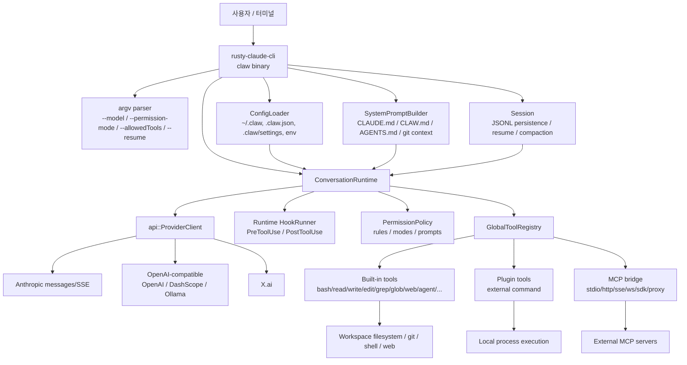
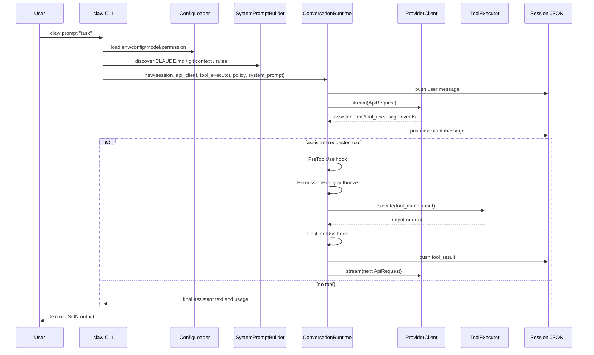
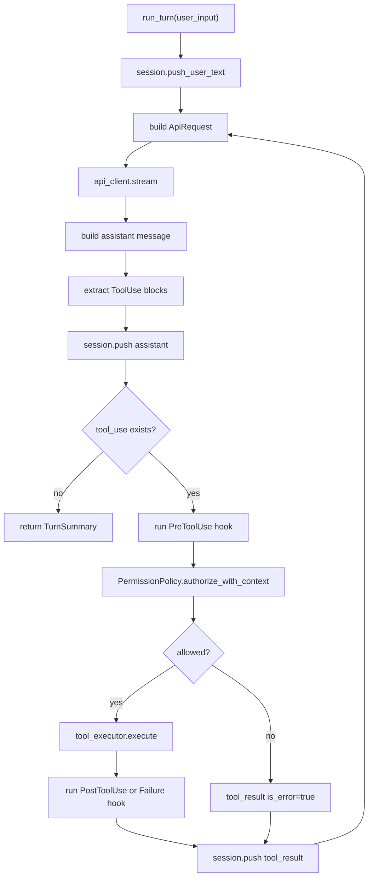
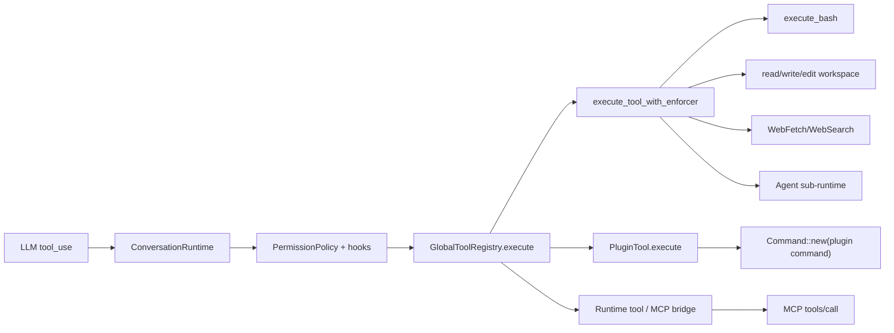
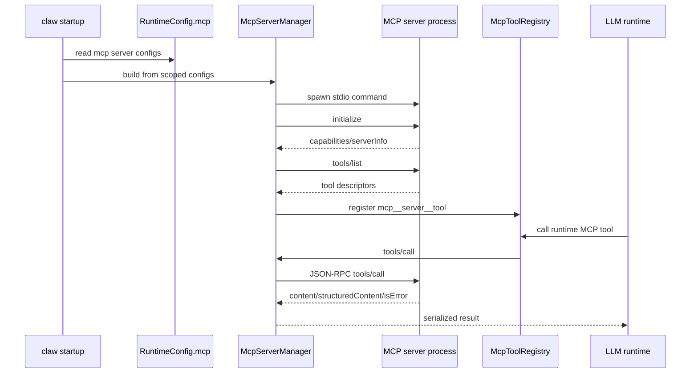
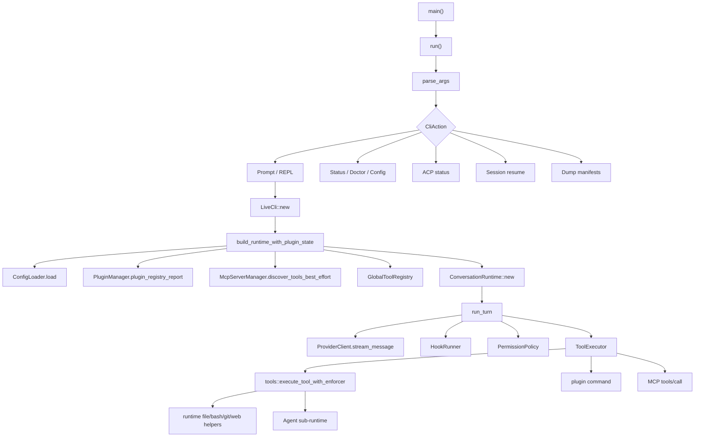

# ultraworkers/claw-code 상세 분석

- 분석 기준일: 2026-06-10
- 로컬 소스: `sources/ultraworkers__claw-code`
- 분석 커밋: `d229a9b022d4845d28a728677e6a6b7c22ec5a2e`
- 기본 브랜치: `main`
- 주 언어: Rust
- 라이선스: MIT
- GitHub 메타데이터: 공개 저장소, 생성일 2026-03-31, stars 193,577, forks 109,961, watchers 1,998, latest release 없음
- 저장소 설명: "An agent-managed museum exhibit, built in Rust with Gajae-Code / LazyCodex — developed and maintained with no human intervention."

## 1. 결론 요약

`ultraworkers/claw-code`는 일반적인 의미의 안정 제품이라기보다 Claude Code 계열 터미널 에이전트 표면을 Rust로 복제, 검증, 실험하는 "agent-managed museum exhibit"에 가깝다. README가 직접 "serious production project"가 아니라고 경고하고, 실제 업무용으로는 LazyCodex와 Gajae-Code를 보라고 안내한다. 따라서 이 레포의 가치는 완성된 실사용 에이전트라기보다, Claude Code류 CLI가 어떤 모듈과 권한, 세션, 도구, MCP, 플러그인 경계로 설계될 수 있는지를 관찰하는 데 있다.

핵심 구현은 `rust/` 워크스페이스다. `rust/crates/rusty-claude-cli`가 `claw` 바이너리이고, `runtime`이 대화 루프와 권한/세션/프롬프트/MCP/훅을, `api`가 Anthropic/OpenAI-compatible/X.ai/DashScope/Ollama 계열 provider를, `tools`가 로컬 도구 실행을, `plugins`가 `.claude-plugin/plugin.json` 기반 확장 실행을 담당한다. 루프 자체는 명확하다. CLI가 config와 model, permission mode를 해석하고, `ConversationRuntime::run_turn`이 API 스트림을 호출한 뒤 assistant의 `tool_use`를 뽑고, PreToolUse 훅과 권한 정책을 통과한 도구를 실행한 뒤 `tool_result`를 세션에 넣고 다시 모델을 호출한다.

검증 결과 Rust 본체는 `cargo check -p rusty-claude-cli`를 통과했다. `cargo run -q -p rusty-claude-cli -- --version`도 정상 동작했다. `claw acp --output-format json`은 의도대로 종료 코드 2와 `not_implemented`를 반환했다. Python companion의 `src/runtime.py`, `src/query_engine.py`, `src/tools.py`, `src/permissions.py`도 `py_compile`을 통과했다.

가장 중요한 리스크는 이 레포 자체가 "완성 제품이 아님"을 선언한다는 점, `cargo install claw-code`가 deprecated/wrong stub이라고 문서화된 배포 혼선, 루트와 `rust/` 하위에 세션/목표/로그성 산출물이 많이 커밋되어 있다는 점, `rust/.claw.json`이 `dontAsk`를 설정해 로컬 상태에서 `status`가 `danger-full-access` 권한 모드로 잡힌다는 점, 플러그인/훅/MCP가 외부 명령 실행 표면을 만든다는 점이다.

## 2. 레포지토리의 성격과 철학

### 2.1 "제품"보다 "전시물"

README의 자기 설명은 매우 이례적이다. 이 저장소는 스스로를 "agent-managed museum exhibit"라고 부르고, "serious production project"가 아니라고 말한다. 일반적인 오픈소스 CLI가 "설치해서 쓰라"고 말하는 것과 달리, 이 레포는 다음 메시지를 반복한다.

- 이 저장소의 canonical implementation은 `rust/`에 있다.
- crates.io의 `cargo install claw-code`는 이 저장소의 실사용 CLI가 아니라 deprecated stub이라고 경고한다.
- upstream binary `cargo install agent-code`는 `agent` 바이너리를 설치하며, 이 저장소의 `claw`와 같지 않다고 설명한다.
- ACP/Zed daemon은 아직 구현되지 않았고 `claw acp`는 상태만 알려준다.
- 실사용 대상으로는 LazyCodex와 Gajae-Code를 추천한다.

이 철학은 "기능을 팔기"보다 "AI 에이전트가 코딩 에이전트 표면을 어떻게 재현했는지 기록하기"에 가깝다. 그래서 기능 표면은 매우 넓지만, 레포 곳곳에 parity, snapshot, compatibility, session hygiene, bootstrap, manifest dump 같은 검증/감사 언어가 강하다.

### 2.2 Claude Code 호환 표면을 Rust로 재구성하려는 방향

이 레포는 Claude Code류 경험을 Rust로 재구성하려는 의도가 강하다. CLI 이름과 파일명은 `rusty-claude-cli`, `CLAUDE.md`, `.claude`, `.claw`, Claude model alias, ACP/Zed status 등 Claude Code 생태계와 맞닿아 있다. 동시에 `CLAW.md`, `.claw`, `claw` 바이너리, `clawcode.dev` 문구로 자기 이름을 분리하려 한다.

철학적으로 보면 다음의 조합이다.

- Claude Code의 사용자 경험과 tool surface를 최대한 비슷하게 만든다.
- Rust workspace로 성능과 타입 안정성, 단일 바이너리 형태를 얻는다.
- 실제 upstream/private 구현은 보이지 않으므로 mock parity harness, manifest dump, compatibility tests로 공개 코드의 동작 계약을 고정한다.
- agent가 agent CLI를 유지하는 실험적 "recursive engineering" 레포로 남긴다.

## 3. 발전 과정과 공개 표면

### 3.1 짧은 시간 대비 과도하게 큰 GitHub 지표

저장소 생성일은 2026-03-31이고 분석 기준 커밋은 2026-06-08이다. 생성 후 약 두 달 남짓한 저장소인데 stars 193,577, forks 109,961로 매우 크다. 이 수치는 일반적인 개발 생태계 성장 곡선과 맞지 않으므로, 인기도 자체를 신뢰의 근거로 보기는 어렵다. 보고서 관점에서는 "관심이 크다"보다 "비정상적으로 높은 social signal이므로 기술 검증을 분리해야 한다"가 맞다.

### 3.2 두 개의 코드 표면

저장소에는 크게 두 표면이 있다.

- `rust/`: canonical Rust workspace. 실제 `claw` 바이너리와 runtime/tool/provider 구현이 들어 있다.
- `src/`와 `tests/`: Python/reference/companion workspace. README가 primary runtime이 아니라고 설명하며, `src/reference_data/archive_surface_snapshot.json`은 `archive/claude_code_ts_snapshot/src`를 참조한다.

Python 쪽은 runtime이 아니라 "mirrored command/tool surface", snapshot, audit helper 성격이 강하다. 예를 들어 `src/tools.py`는 `reference_data/tools_snapshot.json`을 읽고, `execute_tool`은 실제 도구 실행 대신 "Mirrored tool ... would handle payload"류의 응답을 만든다. `src/runtime.py`의 `ClawRuntime`도 Python port에서 destructive bash를 gate하는 식의 보조 검증 표면이다.

### 3.3 커밋된 세션/목표/보드 산출물

루트와 Rust 하위에 `.claude/sessions`, `.claw/sessions`, `.omx/ultragoal`, `.omx/cc2`, `.port_sessions`가 있다. 예시는 다음과 같다.

- `.claude/sessions/session-*.json`
- `rust/.claw/sessions/session-*.jsonl`
- `.omx/ultragoal/ledger.jsonl`
- `.omx/ultragoal/get-goal-*.json`
- `.omx/cc2/board.json`, `.omx/cc2/board.md`

이는 이 저장소가 에이전트로 운영된 흔적을 일부러 남기는 성격일 수 있다. 동시에 보안 관점에서는 session transcript와 goal ledger가 커밋되는 습관 자체가 위험하다. 현재 샘플이 실제 개인 비밀을 포함한다고 단정할 수는 없지만, 구조적으로는 프롬프트, 경로, 모델 응답, 작업 목표가 공개될 수 있는 형태다.

## 4. Rust 워크스페이스 구조

`rust/Cargo.toml`은 `crates/*`를 workspace member로 잡고, version `0.1.3`, edition `2021`, license `MIT`, `unsafe_code = "forbid"` 정책을 둔다. `cargo metadata --format-version=1 --no-deps` 기준 주요 크레이트는 다음과 같다.

| 크레이트 | 역할 |
|---|---|
| `rusty-claude-cli` | `claw` 바이너리. argv parsing, REPL/one-shot prompt, status/doctor/acp/init/session/config/models/diff, terminal rendering |
| `runtime` | ConversationRuntime, session, permission, config, prompt, hooks, MCP stdio/client/server/bridge, sandbox, git context, usage, task/worker/lane 이벤트 |
| `api` | ProviderClient. Anthropic, OpenAI-compatible, X.ai, DashScope, Ollama-compatible routing, SSE stream, prompt cache |
| `tools` | Built-in tool registry and execution. bash/read/write/edit/glob/grep/web/todo/skill/agent/tool-search/notebook/task/worker/git/lsp 등 |
| `plugins` | `.claude-plugin/plugin.json` 로드, install registry, plugin tool command 실행, lifecycle/hook aggregation |
| `commands` | slash command parsing and rendering, agents/mcp/skills/plugin/config/diff/status command helpers |
| `compat-harness` | compatibility/parity helper |
| `mock-anthropic-service` | deterministic Anthropic-compatible mock service |
| `claw-analog` | 더 작은 agent harness. permission mode와 tool loop를 분리해서 보여주는 analog CLI |
| `claw-rag-service` | workspace RAG service. SQLite, embeddings, optional Qdrant |
| `telemetry` | telemetry/event/tracing type layer |

## 5. 전체 아키텍처



### 5.1 경계가 선명한 점

이 레포의 좋은 점은 대화 루프와 도구 실행 경계가 비교적 선명하다는 것이다.

- `ConversationRuntime`은 모델 이벤트를 받아 tool call을 실행할 뿐 provider별 HTTP 구현을 알지 않는다.
- provider별 차이는 `api::ProviderClient` 아래에 숨긴다.
- tool catalog와 실행은 `tools::GlobalToolRegistry`와 `execute_tool_with_enforcer`에 모인다.
- plugin tool은 built-in tool 이름과 충돌하지 못하게 검사한다.
- MCP tool은 서버 이름을 `mcp__server__tool` 형태로 normalize한다.
- prompt building은 `runtime::prompt`로 분리되어 `CLAUDE.md`, `CLAW.md`, `AGENTS.md`, `.claw/rules` 등을 한정된 크기로 주입한다.

### 5.2 경계가 넓고 위험한 점

반대로 실제 공격 표면도 넓다.

- `bash`, `PowerShell`, `REPL`, `Agent`, `Worker*`, `Task*`, `MCP`, `Plugin tool`, `Hook command`가 모두 로컬 실행 표면이다.
- MCP stdio transport는 config에 있는 command/args/env로 child process를 실행한다.
- Plugin tool은 manifest의 command를 실행하고 JSON input을 stdin/env로 전달한다.
- Hook은 shell command로 실행되고 PreToolUse 훅은 input 수정과 permission override까지 할 수 있다.
- `danger-full-access` 또는 `dontAsk` 설정이 들어가면 안전장치가 상당 부분 약해진다.

## 6. 사용자 실행 플로우

### 6.1 one-shot prompt

대표 명령은 다음이다.

```bash
cd rust
ANTHROPIC_API_KEY=... cargo run -p rusty-claude-cli -- prompt "say hello"
```

실제 흐름은 다음이다.



### 6.2 interactive REPL

인자 없이 `claw`를 실행하면 interactive REPL 경로로 들어간다. REPL은 기본적으로 같은 runtime building 경로를 쓰되, 사용자 입력마다 `LiveCli`가 prompt history, slash command, permission prompt, streaming renderer를 관리한다.

중요한 차이는 stdin 처리다. 코드 주석상 one-shot prompt에서도 permission mode가 `DangerFullAccess`일 때만 piped stdin을 prompt context로 소비한다. Prompt 모드에서 stdin을 소비해 버리면 승인 질문을 읽을 수 없기 때문이다. 이 설계는 실제 CLI 운영에서 중요한 UX/안전 절충이다.

### 6.3 resume/session 플로우

`--resume`과 `/session` 계열은 JSONL session file을 기준으로 동작한다.

- `Session`은 version, session_id, created/updated timestamps, messages, compaction, fork provenance, workspace_root, prompt_history, model을 가진다.
- session save는 JSONL snapshot을 만들고, 크기가 커지면 rotation한다.
- `workspace_root`를 세션에 묶어 잘못된 CWD에서 resume하는 문제를 줄이려 한다.
- `/compact`와 auto compaction은 token 사용량이 임계값을 넘을 때 세션을 줄인다.

`ConversationRuntime::run_turn`은 compaction된 session에 대해 tool executor health probe도 수행한다. probe는 `glob_search`에 매칭되지 않을 패턴을 보내 tool executor가 살아 있는지 확인한다.

### 6.4 status/doctor/acp

`status --output-format json`은 매우 많은 정보를 노출한다.

- binary provenance: commit, branch, dirty 여부, rustc version, target
- model source/raw/alias
- permission mode와 출처
- sandbox active/fallback reason
- memory files
- MCP validation
- hook validation
- workspace git state
- branch freshness
- required binary availability

분석 환경에서 실제 출력은 `permission_mode: "danger-full-access"`, `permission_mode_source: "config"`였다. 원인은 `rust/.claw.json`의 `permissions.defaultMode: "dontAsk"`로 보인다. 이 값은 개발 편의에는 유리하지만, 저장소를 분석하거나 실사용할 때 기본 권한이 넓어질 수 있다는 중요한 신호다.

`acp --output-format json`은 다음을 명확히 밝혔다.

- `status: "not_implemented"`
- `supported: false`
- `protocol.daemon: false`
- `protocol.json_rpc: false`
- `serve_starts_daemon: false`
- 종료 코드 2

즉 `claw acp serve`가 존재하더라도 실제 editor integration daemon은 아니다. 이 점을 문서가 숨기지 않고 machine-readable하게 드러내는 것은 좋은 설계다.

## 7. ConversationRuntime 내부 동작

`runtime/src/conversation.rs`의 `ConversationRuntime<C, T>`는 제네릭으로 API client와 tool executor를 받는다.

핵심 필드는 다음과 같다.

- `session`
- `api_client`
- `tool_executor`
- `permission_policy`
- `system_prompt`
- `max_iterations`
- `usage_tracker`
- `hook_runner`
- `auto_compaction_input_tokens_threshold`
- `hook_abort_signal`
- `session_tracer`

`run_turn`의 논리는 다음 단계로 읽힌다.

1. user input을 session에 저장한다.
2. `ApiRequest { system_prompt, messages }`를 만든다.
3. `api_client.stream(request)`를 호출한다.
4. streaming event를 assistant message, usage, prompt cache event로 조립한다.
5. assistant message 안의 `ContentBlock::ToolUse`를 모은다.
6. assistant message를 session에 저장한다.
7. tool call이 없으면 루프를 종료한다.
8. tool call마다 PreToolUse hook을 실행한다.
9. hook 결과가 input을 수정하면 modified input을 쓴다.
10. hook permission override와 permission rule을 합쳐 authorize한다.
11. 허용되면 `tool_executor.execute(tool_name, input)`를 호출한다.
12. tool 실패 시 PostToolUseFailure hook, 성공 시 PostToolUse hook을 실행한다.
13. tool result를 session에 저장한다.
14. 다시 모델을 호출한다.
15. max iterations를 넘으면 중단한다.

이 구조는 Claude Code류 agent loop의 표준 형태다. 다만 이 레포는 hook이 permission override를 줄 수 있으므로 hook 신뢰성이 매우 중요하다.



## 8. Provider/API 계층

`api::ProviderClient`는 enum으로 provider를 감싼다.

- `Anthropic(AnthropicClient)`
- `Xai(OpenAiCompatClient)`
- `OpenAi(OpenAiCompatClient)`

`ProviderClient::from_model`은 모델 이름을 alias resolution한 뒤 provider kind를 감지한다. 주요 동작은 다음이다.

- Claude 계열은 Anthropic client.
- Grok 계열은 X.ai.
- OpenAI-compatible은 OpenAI client.
- `OLLAMA_HOST`가 있으면 local Ollama를 우선한다.
- DashScope 모델은 `DASHSCOPE_API_KEY`와 DashScope base URL을 사용한다.
- stream/send 양쪽 인터페이스를 provider별 구현으로 dispatch한다.

이 설계의 장점은 runtime이 provider wire format을 몰라도 된다는 점이다. 단점은 모델 문자열과 환경 변수 조합에 따라 인증/엔드포인트가 바뀌므로, status/doctor가 없으면 사용자가 현재 어떤 backend에 요청을 보내는지 착각하기 쉽다는 점이다.

## 9. Tool 계층

### 9.1 GlobalToolRegistry

`tools::GlobalToolRegistry`는 세 종류의 tool을 합친다.

- built-in tools
- plugin tools
- runtime tools, 예: MCP bridge에서 발견한 도구

도구 이름은 `canonical_allowed_tool_name`으로 snake_case canonical form을 만든다. `--allowedTools`는 canonical name과 alias를 normalize한 뒤 사용 가능한 도구만 남긴다. 분석 환경의 `status` 출력은 available 도구에 다음 계열이 포함된다고 보여줬다.

- 파일/검색: `read_file`, `write_file`, `edit_file`, `glob_search`, `grep_search`
- 실행: `bash`, `power_shell`, `repl`
- 웹: `web_fetch`, `web_search`
- 세션/사용자 상호작용: `todo_write`, `ask_user_question`, `send_user_message`, `sleep`
- agent/task/worker/team/cron: `agent`, `task_create`, `task_get`, `task_list`, `worker_create`, `worker_send_prompt`, `team_create`, `cron_create` 등
- MCP: `mcp`, `list_mcp_resources`, `read_mcp_resource`, `mcp_auth`
- git/lsp: `git_status`, `git_diff`, `git_log`, `git_show`, `git_blame`, `lsp`
- 기타: `skill`, `tool_search`, `notebook_edit`, `structured_output`, `config`

### 9.2 Built-in tool 실행 흐름

`execute_tool_with_enforcer`는 tool name match로 분기한다.

- `bash`: JSON input을 `BashCommandInput`으로 파싱하고 command를 분류한 뒤 `execute_bash`.
- `read_file`: path permission을 분류하고 workspace read.
- `write_file`: path permission을 분류하고 workspace write.
- `edit_file`: old/new string 기반 편집.
- `glob_search`/`grep_search`: workspace 검색.
- `WebFetch`/`WebSearch`: HTTP client 기반 웹 접근. permission은 `DangerFullAccess`.
- `Agent`: sub-agent 작업을 만들고 thread에서 별도 runtime을 실행.
- `ToolSearch`: deferred/specialized tool 검색.
- `NotebookEdit`: notebook cell 편집.
- `PowerShell`, `REPL`, task/worker/team/cron 계열: 추가 실행/오케스트레이션 표면.



### 9.3 Bash permission 분류

`bash`는 단순히 항상 `DangerFullAccess`로 처리하지 않고, command 내용에 따라 required mode를 분류한다. read-only command 목록에는 `cat`, `head`, `tail`, `ls`, `find`, `grep`, `rg`, `awk`, `sed`, `file`, `stat`, `wc`, `sort`, `uniq`, `pwd`, `echo`, `printf` 등이 있다. 하지만 path에 `$`, Windows absolute path, `/` 절대경로, `~/`, `../` 탈출 등이 보이면 위험하게 본다.

별도의 `runtime::permission_enforcer`에도 read-only shell heuristic이 있다. 이곳은 shell metacharacter `;`, `|`, `&`, `$`, backtick, redirect, subshell 등을 보면 read-only로 보지 않고, `git`도 `status/log/diff/show/branch/rev-parse/ls-files/blame/describe/tag/remote` 같은 read-only subcommand만 허용한다.

장점은 "읽기 명령 일부 허용"으로 UX가 좋아진다는 점이다. 단점은 shell parsing을 heuristic으로 하는 이상 우회 가능성이 남는다는 점이다. 코드 주석도 `sed`의 `w`/`e`, `awk system()`류 잔여 위험을 인정한다.

## 10. 권한 모델

`runtime::permissions::PermissionMode`는 다음 다섯 가지다.

- `ReadOnly`
- `WorkspaceWrite`
- `DangerFullAccess`
- `Prompt`
- `Allow`

`PermissionPolicy`는 active mode와 tool별 required mode, allow/deny/ask rule, denied_tools를 합쳐 판단한다. 판단 순서는 대략 다음이다.

1. `denied_tools`에 있으면 무조건 거부.
2. deny rule match면 거부.
3. hook override가 `Deny`면 거부.
4. hook override가 `Ask`면 prompt 또는 거부.
5. ask rule이 있으면 prompt 또는 거부.
6. allow rule이 있거나 active mode가 충분하면 허용.
7. 부족하면 prompt 또는 거부.

중요한 포인트는 hook override가 표준 권한 평가에 영향을 준다는 점이다. 안전한 환경에서는 유용하지만, 악성/오염된 hook이 있으면 권한 경계 자체를 흔들 수 있다.

## 11. 프롬프트와 메모리 파일

`runtime/src/prompt.rs`는 system prompt를 여러 section으로 만든다.

- intro/system/task/action section
- dynamic boundary marker
- environment context: model family, working directory, date, platform
- project context: git status, git diff, git context
- instruction files
- config section

instruction discovery 대상은 다음이다.

- `CLAUDE.md`
- `CLAW.md`
- `AGENTS.md`
- `CLAUDE.local.md`
- `.claw/CLAUDE.md`
- `.claude/CLAUDE.md`
- `.claw/instructions.md`
- `.claw/rules`
- `.claw/rules.local`
- 외부 framework rules import

파일당 최대 4,000자, 총 instruction 최대 12,000자, git diff 최대 50,000자 제한이 있다. 이 제한은 prompt injection과 context 폭주를 완전히 막지는 못하지만, 무제한 주입보다는 낫다.

실제 `status` 출력에서 이 저장소는 두 memory file을 로드했다.

- 루트 `CLAUDE.md`
- `rust/CLAUDE.md`

둘 다 verification workflow와 working agreement를 안내한다.

## 12. MCP 구조

MCP 관련 코드는 크게 네 부분이다.

- `runtime/src/mcp.rs`: 이름 normalize, tool prefix, server signature, CCR proxy URL unwrap.
- `runtime/src/mcp_client.rs`: stdio/http/sse/ws/sdk/managed proxy transport bootstrap.
- `runtime/src/mcp_stdio.rs`: stdio MCP process spawn, initialize, tools/list, tools/call, resources/list/read.
- `runtime/src/mcp_tool_bridge.rs`: runtime tool registry에 MCP 도구를 등록하고, 호출 시 별도 thread에서 MCP manager를 통해 tools/call.



MCP는 유연하지만 위험하다. stdio server는 로컬 command를 그대로 spawn한다. remote server는 URL과 headers/header helper/OAuth를 포함할 수 있다. config provenance와 required/optional degraded handling은 있지만, 사용자가 신뢰하지 않는 MCP config를 켜면 model tool call이 외부 프로세스나 외부 네트워크 endpoint로 이어진다.

## 13. 플러그인과 훅 구조

`plugins` 크레이트는 `.claude-plugin/plugin.json`을 manifest로 본다. 주요 manifest 필드는 다음이다.

- `name`
- `version`
- `description`
- `permissions`
- `defaultEnabled`
- `hooks`
- `lifecycle`
- `tools`
- `commands`

Plugin tool은 다음 방식으로 실행된다.

1. plugin manifest에서 tool command와 args를 읽는다.
2. `Command::new(command)`로 process를 만든다.
3. stdin에 tool input JSON을 넣는다.
4. env로 `CLAWD_PLUGIN_ID`, `CLAWD_PLUGIN_NAME`, `CLAWD_TOOL_NAME`, `CLAWD_TOOL_INPUT`을 제공한다.
5. stdout/stderr/status를 수집한다.

Hook은 별도 shell command 실행 표면이다.

- `PreToolUse`
- `PostToolUse`
- `PostToolUseFailure`

PreToolUse hook은 도구명, 입력, payload를 받고, exit code 0이면 allow, 2이면 deny, 그 외는 failed로 해석된다. runtime 쪽 hook은 input update와 permission override까지 지원하므로, plugin/hook 공급망 신뢰가 중요하다.

## 14. Sub-agent 구조

`Agent` tool은 model이 별도 작업을 만들도록 해준다. 흐름은 다음과 같다.

1. `AgentInput`의 description과 prompt를 검사한다.
2. agent id, output markdown file, manifest json file을 만든다.
3. subagent type과 model을 resolve한다.
4. `build_agent_system_prompt`로 sub-agent prompt를 만든다.
5. sub-agent type에 맞는 allowed tools를 고른다.
6. manifest를 `running` 상태로 저장한다.
7. background thread를 spawn한다.
8. thread 안에서 `build_agent_runtime`으로 또 하나의 `ConversationRuntime`을 만들고 `run_turn`을 실행한다.
9. 최종 assistant text를 manifest에 저장하거나 실패 상태를 남긴다.

이 구조는 agent delegation 기능을 구현하지만, 실제로는 같은 provider/tool/permission 계층을 재귀적으로 쓰는 구조다. 따라서 상위 agent가 `Agent` tool을 허용하면 작업이 background thread로 분기되고, manifest/file side effect가 생긴다.

## 15. Sandbox와 로컬 실행

분석 환경의 `status`에서는 sandbox가 다음 상태였다.

- `enabled: true`
- `active: false`
- `filesystem_active: true`
- `filesystem_mode: workspace-only`
- `fallback_reason: namespace isolation unavailable (requires Linux with unshare)`
- macOS라 namespace/network isolation은 비활성

즉 macOS에서는 Linux namespace 수준의 sandbox를 기대하면 안 된다. filesystem workspace-only는 작동한다고 보고되지만, shell command, symlink, plugin command, MCP server, external tool은 항상 별도 검증이 필요하다.

## 16. Python companion 분석

Python `src/`는 primary runtime이 아니다. 분석한 핵심 파일은 다음이다.

- `src/tools.py`: `reference_data/tools_snapshot.json`을 로드하고 mirrored tool snapshot을 제공한다. 실제 tool execution은 "would handle payload" 식의 mirror 응답 중심이다.
- `src/permissions.py`: disallowed tool, shell/file read/write/edit류 workspace scope validation.
- `src/runtime.py`: `ClawRuntime`이 prompt를 mirrored command/tool로 route하고, destructive shell execution에 대한 denial을 추론한다.
- `src/query_engine.py`: max turns/budget/session persistence/streaming events가 있는 단순 query engine.
- `src/reference_data/archive_surface_snapshot.json`: archive root가 `archive/claude_code_ts_snapshot/src`라고 기록되어 있고 command/tool entry count를 가진다.

이 표면은 "실행 제품"이라기보다 "Claude Code TS snapshot 계열의 공개 가능한 surface를 mirror하고 테스트하는 보조 공간"으로 보는 것이 맞다.

## 17. 실제 실행 및 검증 결과

분석 중 수행한 로컬 검증은 다음과 같다.

| 명령 | 결과 |
|---|---|
| `cd rust && cargo metadata --format-version=1 --no-deps` | 성공. workspace member와 target 파싱 정상 |
| `cd rust && cargo check -p rusty-claude-cli` | 성공. Rust CLI 본체 type check 통과 |
| `cd rust && cargo run -q -p rusty-claude-cli -- --version` | 성공. Version 0.1.3, Git SHA `d229a9b022d4`, branch main, dirty false, target `aarch64-apple-darwin` 출력 |
| `cd rust && cargo run -q -p rusty-claude-cli -- acp --output-format json` | 종료 코드 2. `status: not_implemented`, daemon/json_rpc false 출력. 문서와 일치 |
| `cd rust && cargo run -q -p rusty-claude-cli -- status --output-format json` | 성공. binary/config/memory/sandbox/permission/workspace 상태 출력 |
| `python3 -m py_compile src/runtime.py src/query_engine.py src/tools.py src/permissions.py` | 성공. Python companion 핵심 파일 문법 검증 통과 |

실제 LLM 호출은 API key를 사용하지 않았기 때문에 수행하지 않았다. 대신 CLI 부트, status, ACP 상태, Rust type check, Python syntax check를 확인했다.

## 18. 차별점

### 18.1 자체 비판적 문서화

대부분의 에이전트 레포는 기능을 과장하는데, 이 레포는 자신이 production project가 아니라고 명시한다. `cargo install claw-code` 혼선, ACP 미구현, canonical Rust workspace 위치를 솔직하게 문서화한다. 이 투명성은 레포 평가에서 장점이다.

### 18.2 공개 코드 안의 "agent가 agent를 만든 흔적"

`.omx`, session, goal, board, parity harness, dump manifest, bootstrap plan 같은 산출물이 많다. 일반 제품 레포라면 지저분해 보이지만, 이 저장소의 정체성인 agent-managed exhibit와 맞닿아 있다.

### 18.3 Rust 중심의 명시적 agent loop

`ConversationRuntime`의 제네릭 구조는 학습 가치가 높다. provider와 tool executor를 trait로 분리하고, session/permission/hook/compaction/tracing을 runtime에 모은 방식은 다른 CLI agent 설계에도 참고 가능하다.

### 18.4 MCP, plugin, hook, sub-agent까지 한 코드베이스에서 관찰 가능

실사용 안정성은 별개로, Claude Code류 agent의 주요 확장 표면이 한 레포에 모여 있다. 도구 이름 canonicalization, allowedTools normalization, MCP tool prefix, plugin tool conflict check, hook event payload, session JSONL rotation 등 구현 디테일을 볼 수 있다.

## 19. 위험 요소와 이상한 점

### 19.1 저장소가 스스로 production이 아니라고 경고

사용자가 이 저장소를 업무 자동화 CLI로 바로 쓰는 것은 적절하지 않다. 레포 자체가 museum exhibit라고 말한다. 보고서 관점에서는 "아키텍처 연구용으로 유용, 운영용 신뢰도는 별도 검증 필요"라고 평가해야 한다.

### 19.2 배포/설치 혼선

README는 `cargo install claw-code`가 잘못된/deprecated stub이라고 경고한다. upstream `agent-code`는 `agent` 바이너리를 설치하고 이 저장소의 `claw`가 아니다. 이 혼선은 공급망 리스크다. 사용자가 이름만 보고 설치하면 다른 패키지를 실행할 수 있다.

### 19.3 비정상적으로 높은 stars/forks

생성 후 짧은 기간에 stars 193k, forks 109k는 매우 이례적이다. social proof를 신뢰 근거로 쓰면 안 된다. 실제 안전성과 품질은 소스, 빌드, 테스트, release provenance로 검증해야 한다.

### 19.4 기본 권한이 넓어질 수 있음

분석 환경에서 `rust/.claw.json`은 다음을 포함했다.

```json
{
  "permissions": {
    "defaultMode": "dontAsk"
  }
}
```

실제 `status`는 이를 `danger-full-access` config source로 해석했다. 개발/테스트용 레포라면 이해 가능하지만, 실사용자가 이 디렉터리에서 곧바로 `claw`를 실행하면 승인 없이 넓은 권한을 쓸 수 있다.

### 19.5 session/log/goal artifact 커밋

세션과 goal ledger가 저장소에 들어 있다. 현재 분석에서 민감정보 유출을 특정하지는 않았지만, 이러한 파일군은 운영 레포에서는 보통 `.gitignore` 대상이다. 특히 AI coding agent는 prompt와 tool output에 secrets, local path, branch, task context가 섞이기 쉽다.

### 19.6 Plugin/MCP/Hook 공급망

Plugin tool은 임의 command를 실행한다. MCP stdio도 임의 command를 spawn한다. Hook 역시 shell command다. 이 셋은 모두 "모델이 직접 실행하지는 않지만, 설정을 통해 모델 tool call이 외부 실행으로 연결되는 경로"다. 외부 marketplace/installed plugin/external dir/MCP config를 신뢰 없이 받아들이면 위험하다.

### 19.7 shell heuristic의 한계

read-only shell command 분류는 좋은 시도지만 완전한 parser가 아니다. 코드 주석도 residual gap을 인정한다. shell은 quoting, expansion, interpreter, symlink, command substitution, platform 차이로 우회 여지가 생기기 쉽다.

### 19.8 future-looking model alias

문서와 코드에 `claude-opus-4-7`, `claude-sonnet-4-6`, `claude-haiku-4-5-20251213` 같은 미래형/비표준처럼 보이는 alias가 나온다. 분석 기준일 현재 실제 provider availability와 일치한다고 단정할 수 없다. 이 레포의 mock/parity 성격과 결합해 "실제 API 제품 상태"와 분리해서 봐야 한다.

### 19.9 ACP 표면은 있지만 구현은 없음

`claw acp`와 `claw acp serve`가 존재하므로 editor integration이 되는 것처럼 보일 수 있다. 실제 출력은 명확히 not implemented다. 이건 숨기지 않은 점은 좋지만, 사용자 문서나 자동 탐지에서 오해할 수 있다.

### 19.10 Python companion과 Rust canonical 사이의 혼동

루트 `src/`가 커서 처음 보면 Python 구현도 제품 runtime처럼 보인다. 하지만 README와 실제 코드를 보면 primary runtime은 `rust/`다. 분석/기여자는 변경 대상이 어디인지 혼동하지 않아야 한다.

## 20. 평가

### 20.1 강점

- Rust type check가 실제로 통과하는 canonical CLI workspace가 있다.
- provider/runtime/tool/plugin/MCP/session 경계가 관찰 가능하게 나뉘어 있다.
- `status`, `doctor`, `dump-manifests`, `bootstrap-plan`, `acp status`처럼 introspection 표면이 넓다.
- ACP 미구현, install 혼선, production 비추천을 숨기지 않는다.
- `ConversationRuntime`의 agent loop가 학습하기 좋다.
- permission model과 hook/model/config provenance를 꽤 자세히 추적한다.
- MCP degraded startup, session workspace binding, auto compaction health probe 등 edge case를 다루려는 흔적이 많다.

### 20.2 약점

- 저장소 정체성이 실사용 제품이 아니므로 안정성 기준을 낮춰 봐야 한다.
- 커밋된 session/goal/log artifact가 많아 noise와 잠재적 정보 노출 위험이 있다.
- 기능 표면이 너무 넓어 실제 완성도와 문서 표 사이의 간극을 계속 검증해야 한다.
- default `dontAsk` 같은 repo-local config가 분석/사용 중 권한을 넓힌다.
- plugin/MCP/hook/sub-agent/worker/task 계층이 모두 local execution surface로 이어진다.
- crates.io 이름 혼선이 공급망 리스크다.

### 20.3 적합한 사용처

- Claude Code/Codex/Gemini CLI류 에이전트의 Rust 아키텍처를 공부할 때.
- tool loop, permission policy, MCP bridge, plugin hook, session persistence 설계를 비교 분석할 때.
- "AI가 agent CLI를 agent로 유지한 저장소"라는 사회기술적 현상을 분석할 때.

### 20.4 부적합한 사용처

- 팀 업무용 production coding agent.
- 민감 레포에서 승인 없는 자동 실행.
- 검증되지 않은 plugin/MCP config와 함께 쓰는 환경.
- crates.io install만으로 신뢰 가능한 CLI를 얻으려는 환경.

## 21. 핵심 호출 관계 요약



## 22. 최종 판단

`ultraworkers/claw-code`는 "어떤 AI coding agent를 바로 써야 하는가"라는 질문에는 보수적으로 답해야 하는 저장소다. 레포 자신도 실사용 제품이 아니라고 말한다. 하지만 "Claude Code류 터미널 에이전트는 어떤 레이어로 이루어지고, 무엇이 무엇을 호출하며, 위험 표면은 어디서 생기는가"라는 질문에는 매우 유용한 연구 샘플이다.

가장 중요한 설계 학습점은 다음이다.

- CLI agent의 본질은 provider client가 아니라 `ConversationRuntime` 같은 tool loop coordinator다.
- 안전성은 하나의 sandbox가 아니라 permission policy, hook trust, config provenance, session binding, MCP/plugin 공급망, shell parser의 합이다.
- introspection 명령은 운영 안전성에 중요하다. `status`가 model, permission, sandbox, memory files, MCP, binary provenance를 보여주는 것은 좋은 방향이다.
- 확장성은 곧 공격 표면이다. plugin, MCP, hook, worker, sub-agent가 많을수록 사용자에게는 강력하지만 감사해야 할 호출 경로도 폭증한다.

이 레포는 개인 학습/비교 분석용으로는 높은 가치가 있고, 운영용으로는 아직 낮은 신뢰 등급을 부여하는 것이 맞다.
