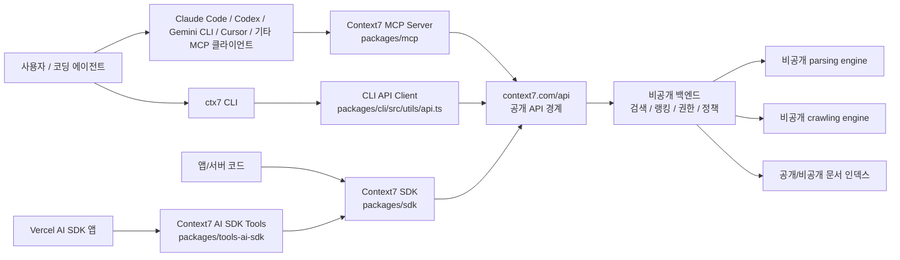
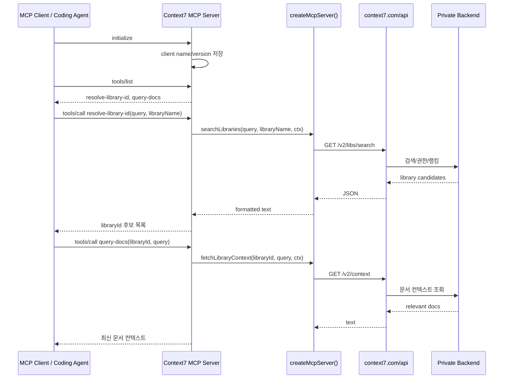
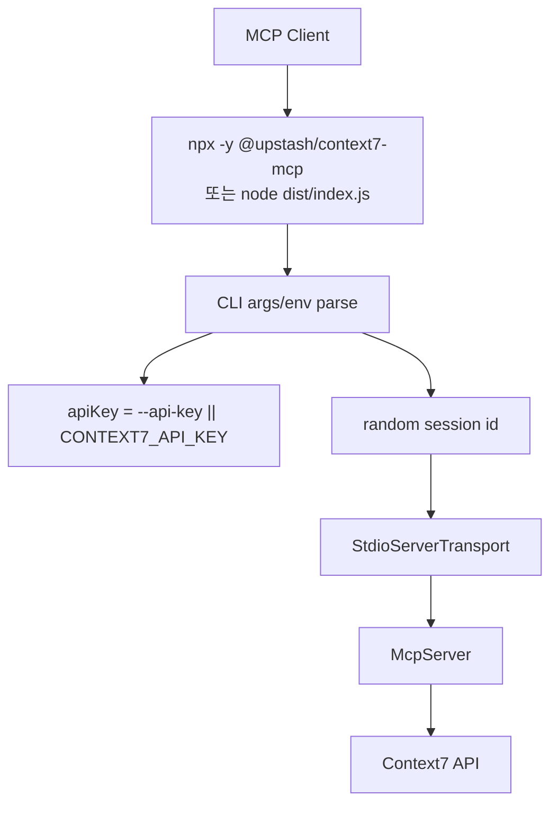
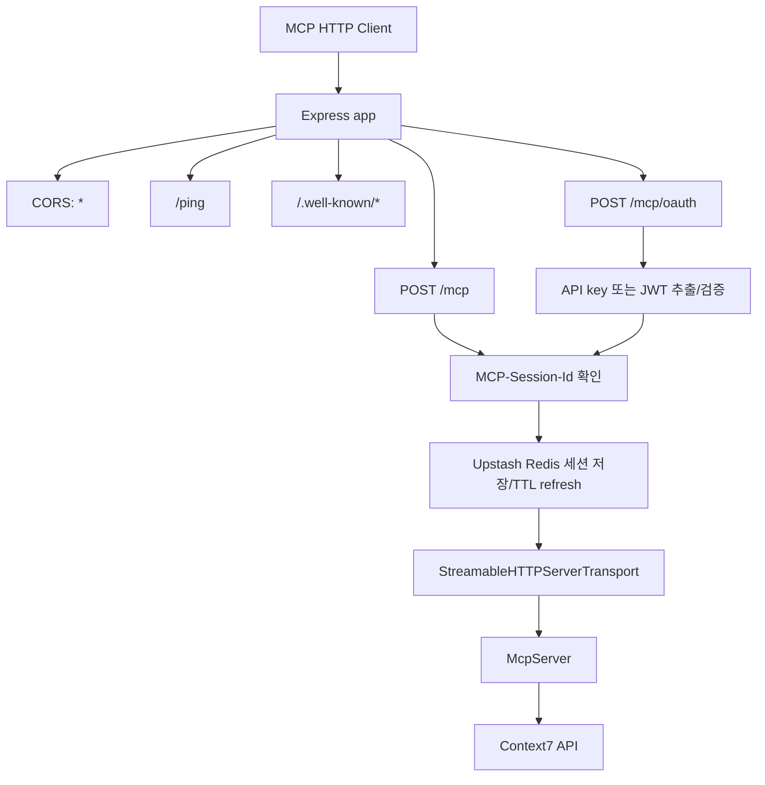
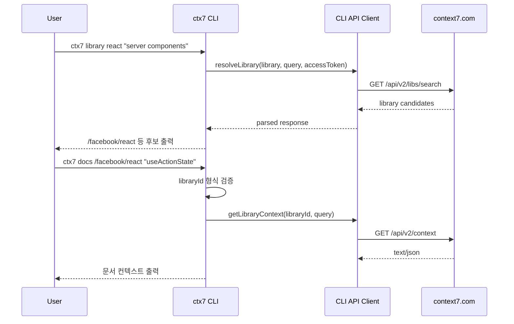
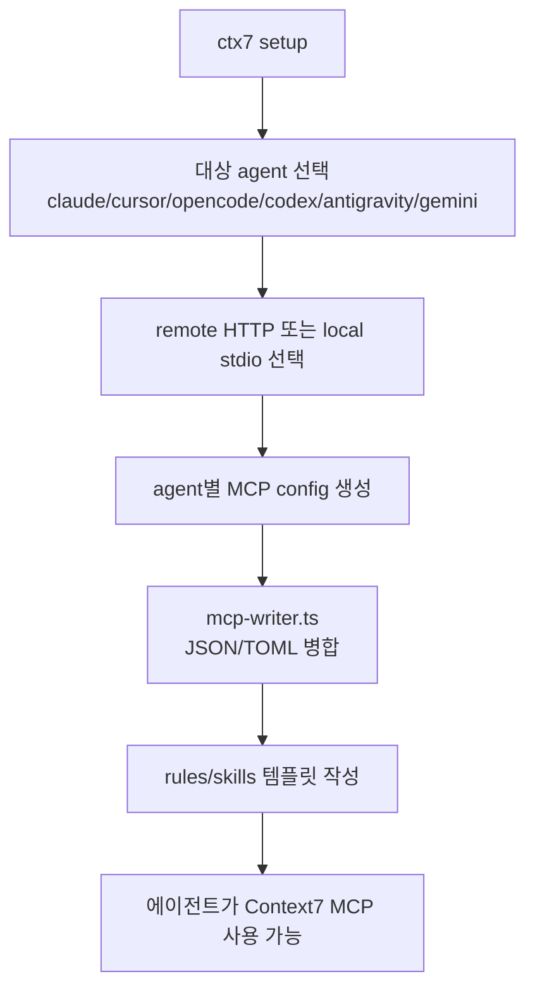

# upstash/context7 분석 보고서

## 1. 요약 평가

Context7은 Claude Code, Codex, Gemini CLI, Cursor, Cline류 에이전트가 오래된 학습 데이터나 부정확한 패키지 지식에 의존하지 않도록, 최신 라이브러리 문서를 MCP 도구와 CLI로 공급하는 문서 컨텍스트 레이어다. 이 레포지토리는 코딩 에이전트의 계획·실행·수정 루프 자체를 제공하지 않는다. 대신 에이전트가 “지금 이 라이브러리의 실제 문서”를 질의할 수 있게 만들어, 기존 에이전트의 약점인 문서 최신성 문제를 보완한다.

평가상 핵심은 세 가지다.

- 철학: 모델을 더 똑똑하게 만드는 것이 아니라, 모델이 작업 중에 참조하는 문서 컨텍스트를 최신화한다.
- 제품 표면: MCP 서버, CLI, 에이전트별 setup/skills/rules, TypeScript SDK, Vercel AI SDK 도구로 나뉜다.
- 검증 경계: 공개 레포는 클라이언트·MCP·CLI 계층이 중심이며, 실제 문서 파싱·크롤링·랭킹·저장 백엔드는 비공개라고 명시되어 있다.

따라서 이 레포는 “코딩 에이전트”라기보다 “AI 코딩 에이전트의 외부 기억/문서 검색 어댑터”로 보는 것이 정확하다. 장점은 통합 표면이 단순하고 에이전트에 붙이기 쉽다는 점이다. 위험은 문서 품질, 사용자 질의 프라이버시, 비공개 백엔드에 대한 감사 불가능성, HTTP MCP 서버 노출 설정, API key 취급 방식에 집중된다.

## 2. 기본 정보

- 저장소: `upstash/context7`
- 분석 커밋: `1f6212b`
- 기본 브랜치: `master`
- 생성일: 2025-03-26
- 최근 push: 2026-06-10
- 최신 릴리스 관측값: `ctx7@0.5.1` / 2026-06-05
- 언어: TypeScript 중심
- 라이선스: MIT
- 주요 패키지:
  - `@upstash/context7-mcp` `3.1.0`
  - `ctx7` `0.5.1`
  - `@upstash/context7-sdk` `0.3.0`
  - `@upstash/context7-tools-ai-sdk` `0.2.3`
  - `@upstash/context7-pi` `0.1.0`
- 공개 레포 파일 수: 약 322개

## 3. 프로젝트 철학과 발전 방향

Context7의 문제 정의는 명확하다. AI 코딩 에이전트는 패키지 버전, API 변경, 프레임워크별 권장 패턴을 자주 틀린다. 모델을 다시 학습시키지 않고 이 문제를 줄이는 방법은 실행 시점에 문서를 가져오는 것이다. Context7은 이 지점을 제품화한다.

README와 docs 기준으로 프로젝트는 두 가지 사용 모드를 전면에 둔다.

- CLI + Skills: `ctx7 library <name> <query>`, `ctx7 docs <libraryId> <query>` 형태로 사람이 직접 검색하거나, 에이전트 설정 파일과 rules/skills를 자동 삽입한다.
- MCP: `resolve-library-id`, `query-docs` 두 도구를 에이전트에게 제공해 작업 중 최신 문서를 가져오게 한다.

이 철학은 OpenHands, Codex, Cline, Gemini CLI 같은 “작업 실행 에이전트”와 다르다. Context7은 파일을 수정하거나 터미널 명령을 실행하는 주체가 아니다. 에이전트의 근거 자료를 개선하는 보조 계층이다. 그래서 서버 instruction에도 “리팩터링, 스크립트 작성, 비즈니스 로직 디버깅, 코드 리뷰, 일반 프로그래밍 개념에는 쓰지 말라”는 제한이 들어 있다.

발전 과정상 특징은 다음과 같다.

- 초기에는 MCP 서버와 공개 문서 검색이 중심이었고, 이후 CLI setup, 에이전트별 설정 자동화, skills/rules 생성이 추가된 구조로 보인다.
- 패키지는 monorepo 형태로 분화되었고, MCP/CLI/SDK/AI SDK adapter가 각각 별도 패키지로 제공된다.
- 공개 레포는 통합 계층을 다루며, 지원 API 백엔드, parsing engine, crawling engine은 비공개라고 README가 명시한다.
- Pro/Enterprise 문서에는 private source, policy, query storage control, enterprise LLM provider 같은 조직 사용 시나리오가 추가되어 있다.

## 4. 전체 아키텍처



공개 코드의 중심은 “요청을 어떤 헤더와 파라미터로 Context7 API에 넘기고, 응답을 에이전트가 읽기 좋은 형태로 돌려주는 것”이다. 검색 품질, 문서 파싱 방식, private sources 처리, 랭킹·reranking 알고리즘은 공개 레포만으로는 완전히 감사할 수 없다.

## 5. 패키지 구조

```text
packages/
  mcp/
    src/index.ts                MCP 서버 엔트리포인트
    src/lib/api.ts              Context7 API 호출
    src/lib/sessionStore.ts     HTTP MCP 세션 Redis 저장
    src/lib/jwt.ts              Clerk / Entra JWT 검증
    src/lib/encryption.ts       client IP 헤더 암호화
  cli/
    src/index.ts                ctx7 CLI 엔트리포인트
    src/commands/docs.ts        library/docs 명령
    src/setup/agents.ts         에이전트별 MCP 설정 생성
    src/setup/templates.ts      rules/skills 템플릿
    src/setup/mcp-writer.ts     JSON/TOML 설정 파일 병합/쓰기
    src/utils/api.ts            CLI API client
    src/utils/auth.ts           device auth, token 저장
  sdk/
    src/client.ts               Context7 SDK
    src/http/                   fetch wrapper, retry, error handling
  tools-ai-sdk/
    src/                        Vercel AI SDK용 tool wrapper
docs/
  howto/
  security/
server.json                     MCP registry manifest
```

## 6. MCP 서버 상세

MCP 서버의 진입점은 `packages/mcp/src/index.ts`다. CLI 옵션으로 transport, port, api key를 받는다.

- `--transport stdio|http`: 기본값은 `stdio`
- `--port`: HTTP 모드에서만 허용
- `--api-key`: stdio 모드에서만 허용
- HTTP 모드에서는 `--api-key` 플래그를 금지하고, 요청 헤더에서 인증 정보를 받는다.
- stdio 모드에서는 CLI 옵션 또는 `CONTEXT7_API_KEY` 환경 변수를 읽는다.

서버가 등록하는 실질 도구는 두 개다.

### 6.1 `resolve-library-id`

입력:

- `query`: 사용자가 찾는 라이브러리와 사용 목적
- `libraryName`: 라이브러리 이름

역할:

- Context7 API의 library search를 호출한다.
- 결과를 MCP 클라이언트가 읽기 쉬운 텍스트로 포맷한다.
- 필요한 경우 인증 프롬프트를 함께 반환한다.

중요한 instruction:

- query는 Context7 API로 전송되므로 비밀, 개인 정보, 독점 코드를 넣지 말라고 명시한다.
- 도구 annotation은 read-only, idempotent, non-destructive로 표시된다.

### 6.2 `query-docs`

입력:

- `libraryId`: `/owner/repo` 형태의 Context7 compatible library ID
- `query`: 찾을 문서 내용

역할:

- `/v2/context` API로 문서 컨텍스트를 요청한다.
- 응답 텍스트를 그대로 MCP tool result에 싣는다.
- 빈 응답이면 documentation not found 계열 안내를 반환한다.

### 6.3 MCP 도구 호출 흐름



### 6.4 Argument aliasing

서버는 MCP 클라이언트가 잘못된 argument 이름을 보내는 경우를 보정한다.

- `userQuery`, `question`을 `query`로 변경
- `context7CompatibleLibraryID`, `libraryID`, `libraryName`을 `libraryId`로 변경

이 장치는 LLM이 도구 schema를 약간 틀렸을 때 실패율을 낮춘다. 동시에 입력 오류를 조용히 보정하므로, 클라이언트나 프롬프트 버그가 드러나지 않을 수 있다. 특히 `query-docs`에서 `libraryName`을 `libraryId`로 매핑하는 것은 사용자가 일반 이름을 넣었는데 ID처럼 처리되는 혼동을 만들 수 있다.

### 6.5 Prompts/resources

서버 capabilities에는 prompts/resources/templates가 등록되어 있으나, 실제 list handler는 빈 배열을 반환한다. 도구 중심 MCP 서버라는 뜻이다.

## 7. Transport별 실행 구조

### 7.1 Stdio 모드



stdio 모드는 로컬 에이전트 통합에 가장 단순하다. MCP 클라이언트가 subprocess를 띄우고 stdin/stdout으로 JSON-RPC를 주고받는다. API key는 command argument나 환경 변수로 들어간다.

주의할 점은 command argument에 API key를 넣으면 프로세스 목록이나 설정 파일에 노출될 수 있다는 것이다. 이 레포의 setup writer는 agent별 특성에 맞춰 stdio command 또는 env/header를 구성하지만, 프로젝트 스코프 설정 파일에 key가 저장될 경우 실수로 커밋될 위험이 있다.

### 7.2 HTTP 모드



HTTP 모드는 Express로 열린다.

- `/mcp`: 익명 접근 허용
- `/mcp/oauth`: 인증 요구
- `.well-known/oauth-protected-resource`, `.well-known/oauth-authorization-server`: OAuth discovery/proxy
- `/ping`: health check
- GET MCP 요청은 405
- DELETE는 session 삭제
- initialize POST에서 random session id를 만들고 Redis에 저장
- 이후 POST는 `MCP-Session-Id`를 확인하고 session TTL을 refresh

HTTP session store는 Upstash Redis를 사용한다. `UPSTASH_REDIS_REST_URL`, `UPSTASH_REDIS_REST_TOKEN`이 없으면 `getRedis()`가 예외를 던진다. 즉 HTTP mode self-hosting은 Redis 환경 변수가 사실상 필요하다.

## 8. API 호출 계층

`packages/mcp/src/lib/api.ts`는 API base URL을 다음처럼 정한다.

- `CONTEXT7_API_URL` 환경 변수가 있으면 사용
- 없으면 `https://context7.com/api`

주요 호출:

- `GET /v2/libs/search?query=...&libraryName=...`
- `GET /v2/context?query=...&libraryId=...`

지원 기능:

- `HTTP_PROXY`, `HTTPS_PROXY` proxy 환경 변수 지원
- `NODE_EXTRA_CA_CERTS` 추가 CA 인증서 지원
- 429, 401, 404, 기타 HTTP 에러별 메시지 처리
- `generateHeaders()`로 source, version, session, client, api key, transport, client IP 정보를 구성

헤더는 Context7 API 입장에서 클라이언트 종류와 세션을 파악하는 중요한 관측 지점이다. 문서에는 query, libraryName/libraryId, API key, client name/version, transport, encrypted client IP가 전송된다고 되어 있다.

## 9. CLI 상세

CLI 진입점은 `packages/cli/src/index.ts`다.

주요 명령:

- `ctx7 library <name> <query>`: 라이브러리 ID 후보 검색
- `ctx7 docs <libraryId> <query>`: 문서 컨텍스트 조회
- `ctx7 setup`: Claude, Cursor, OpenCode, Codex, Antigravity, Gemini 설정 자동화
- `ctx7 remove`: 설정 제거
- auth 관련 명령
- upgrade/skills 관련 명령

### 9.1 CLI library/docs 흐름



CLI는 `CONTEXT7_API_KEY` 환경 변수를 access token보다 우선한다. docs 명령은 `/owner/repo` 형태를 요구하고, Git Bash가 `/owner/repo`를 Windows path처럼 바꾸는 문제를 보정하는 로직도 갖고 있다.

### 9.2 setup 흐름



에이전트별 설정 예시는 서로 다르다.

- Claude: `.mcp.json` 또는 `~/.claude.json`, `mcpServers`
- Cursor: `.cursor/mcp.json`
- OpenCode: `mcp`
- Codex: `.codex/config.toml` 또는 `~/.codex/config.toml`, `mcp_servers`
- Gemini/Antigravity: 각자의 설정 포맷

setup template는 Context7을 사용할 때의 guardrail도 함께 쓴다.

- 라이브러리/API 문서가 필요할 때 사용
- refactor, script from scratch, business logic debugging, code review, generic programming concept에는 사용하지 말 것
- secret, personal data, proprietary code를 query에 넣지 말 것
- resolve 후 docs 질의
- 불필요하게 3회 이상 command/tool call을 반복하지 말 것
- Codex CLI용 template에는 sandbox network 관련 안내도 들어 있다.

이 방식은 실용적이다. 사용자가 여러 에이전트 설정 파일을 직접 편집하지 않아도 된다. 반대로, 자동 생성된 rules가 에이전트의 행동 정책 일부가 되므로 사용자는 어떤 파일에 무엇이 쓰였는지 확인해야 한다.

## 10. SDK와 AI SDK 도구

`packages/sdk/src/client.ts`의 `Context7` class는 API key를 요구한다.

- 명시 config 또는 `CONTEXT7_API_KEY` 환경 변수에서 key를 읽는다.
- key가 `ctx7sk` prefix로 시작하지 않으면 경고한다.
- 기본 base URL은 `https://context7.com/api`
- retry 기본 5회
- cache는 `no-store`

주요 메서드:

- `searchLibrary`
- `getContext`

`packages/tools-ai-sdk`는 이 SDK를 Vercel AI SDK tool 형태로 감싼다. 설명문에는 MCP tool과 마찬가지로 query에 secret을 넣지 말라는 경고가 들어간다. 앱 개발자가 자신의 AI app에 Context7 검색 도구를 직접 붙이는 경로다.

## 11. 인증과 세션

### 11.1 API key

HTTP mode는 여러 헤더에서 API key를 추출한다.

- `Authorization: Bearer <token>`
- `Authorization: <token>`
- `context7-api-key`
- `x-api-key`
- `context7_api_key`
- `x_api_key`

JWT가 아니면 로컬에서 검증하지 않고 Context7 API로 전달한다. 이 구조는 MCP 서버가 API key 검증 책임을 백엔드로 넘기는 방식이다. self-hosted HTTP 서버를 공개망에 열면 `/mcp` 익명 경로와 non-JWT key forwarding 정책을 정확히 이해하고 노출해야 한다.

### 11.2 JWT

`packages/mcp/src/lib/jwt.ts`는 Clerk와 Entra 토큰 검증을 지원한다.

- Clerk issuer: `clerk.context7.com`
- Entra v2 issuer 지원
- Entra 설정은 `/v2/entra/config/:audience`에서 가져오고 5분 캐시
- 설정에 scope가 있으면 scope 검증

### 11.3 Session store

HTTP MCP session은 Upstash Redis에 저장된다.

- TTL: 7일
- refresh threshold: 1일
- key prefix: `#mcp#session#`
- Redis 오류 시 fail-open 성격의 로깅/계속 진행 주석이 있다.

코드 주석상 session id는 인증·인가 수단이 아니다. 따라서 session store failure가 바로 권한 우회는 아니지만, 운영자는 session lifecycle과 MCP transport 안정성 이슈로 봐야 한다.

## 12. 데이터 프라이버시와 private sources

문서의 data privacy 설명은 중요한 운영 전제를 제공한다.

Context7로 전송되는 것은 전체 코드베이스가 아니라 에이전트가 만든 query, libraryName/libraryId, API key, client name/version, transport, encrypted client IP다. 하지만 query는 사용자가 묻는 구현 의도, 내부 라이브러리명, 오류 메시지 일부를 포함할 수 있다. 그러므로 “코드 전체가 안 간다”와 “민감 정보가 절대 안 간다”는 다르다.

문서상 query는 LLM reranking에 사용될 수 있고, OpenAI/Gemini/Anthropic 같은 provider가 언급된다. 또한 품질 개선과 benchmarking을 위해 익명 저장될 수 있다. Enterprise는 자체 LLM provider, public docs 비활성화, query storage 비활성화 같은 제어를 제공한다고 문서화되어 있다.

private sources는 GitHub, GitLab, Bitbucket, other Git, Confluence, OpenAPI 등을 지원한다. Teamspace policy는 source type, library quality, manual list로 검색 결과를 제한할 수 있다. 이 기능들의 실제 구현은 공개 레포가 아니라 Context7 서비스 백엔드에 있다.

## 13. 숨겨진 계층과 감사 불가능한 영역

README는 다음 계층이 공개 레포에 없다고 명시한다.

- supporting API backend
- parsing engine
- crawling engine

이 때문에 공개 코드만으로는 아래 항목을 완전 검증할 수 없다.

- 문서 수집 주기와 실패 처리
- 문서 chunking 방식
- 랭킹과 reranking 로직
- LLM provider로 전달되는 실제 prompt 형식
- private source 권한 격리 방식
- 팀 정책 필터링의 서버 측 강제 지점
- API key quota, rate limit, abuse prevention
- 문서 신뢰도/품질 score 산정 방식

이는 오픈소스 통합 레포로서는 자연스러운 제품 경계이지만, 보안·컴플라이언스 관점에서는 “Context7이 어떤 문서를 왜 반환했는가”를 사용자가 자체 감사하기 어렵다는 뜻이다.

## 14. 위험 요소와 이상한 점

### 14.1 문서 품질 보증 부재

README는 community-contributed docs에 대해 정확성, 보안성, 완전성을 보장하지 않는다고 경고한다. 에이전트가 Context7 결과를 권위 있는 정답처럼 사용할 경우 잘못된 API 사용, 오래된 예제, 취약한 패턴이 코드에 반영될 수 있다.

### 14.2 query 프라이버시

도구 설명과 template는 secret/personal/proprietary data를 넣지 말라고 반복한다. 그러나 서버가 query를 hard sanitize하지는 않는다. 실제 보호는 에이전트가 query를 잘 작성한다는 전제에 크게 의존한다.

### 14.3 비공개 백엔드

검색·문서 추출·reranking 핵심은 공개되어 있지 않다. 기능적으로는 SaaS 제품 경계지만, “모든 설계와 이론을 소스만으로 이해”하려는 목적에서는 가장 큰 블랙박스다.

### 14.4 HTTP `/mcp` 익명 엔드포인트

HTTP 서버는 `/mcp`를 anonymous path로 열고 `/mcp/oauth`를 authenticated path로 둔다. 의도된 설계지만, self-hosting 사용자가 공개망에 열 때 abuse, quota 소모, proxy 오용 가능성을 따져야 한다.

### 14.5 CORS `*`

HTTP 서버는 CORS origin을 `*`로 설정한다. MCP HTTP endpoint를 브라우저 기반 클라이언트와 쉽게 연결하기 위한 선택으로 보이지만, 공개 배포 시 예상치 못한 웹 origin에서 요청이 들어올 수 있다. 인증 경로와 session handling이 이 전제를 견딜 수 있어야 한다.

### 14.6 HTTP 모드 Redis 의존성

HTTP session store는 Upstash Redis 환경 변수가 없으면 초기화가 실패한다. Docker/HTTP 실행 안내를 볼 때 사용자가 Redis 요구사항을 놓치기 쉽다.

### 14.7 API key local verification 없음

non-JWT API key는 로컬 MCP HTTP 서버에서 검증하지 않고 upstream으로 넘긴다. 이 자체는 단순한 proxy 구조지만, 운영자는 “이 서버가 인증 서버가 아니다”라고 이해해야 한다.

### 14.8 client IP encryption의 실질 보안 한계

`packages/mcp/src/lib/encryption.ts`는 AES-256-CBC로 client IP 헤더를 암호화한다. 기본 encryption key가 코드에 들어 있고, env key가 잘못되거나 암호화 실패 시 plaintext IP를 반환한다. 따라서 이는 네트워크/로그에서의 단순 노출을 줄이는 장치에 가깝고, Context7 서비스 운영자나 코드를 아는 공격자에 대한 강한 익명화로 보기는 어렵다.

### 14.9 argument aliasing이 오류를 숨김

LLM이 schema를 틀리는 문제를 보정하는 장점이 있지만, 잘못된 argument 이름이 계속 들어와도 실패하지 않는다. 이로 인해 클라이언트 prompt/schema 품질 문제가 늦게 발견될 수 있다.

### 14.10 버전 드리프트

`server.json`에는 MCP registry manifest와 package/MCPB URL 버전 정보가 들어 있는데, 현재 package version들과 차이가 보인다. MCP registry 소비자는 manifest가 최신 package와 동기화되어 있는지 확인해야 한다.

### 14.11 개발 문서 경로 불일치 가능성

developer 문서의 local development 예시에 `context7/src/index.ts` 형태 경로가 보이는데, 현재 monorepo 구조에서는 MCP entry가 `packages/mcp/src/index.ts`다. 문서가 이전 구조를 일부 반영하고 있을 가능성이 있다.

### 14.12 setup이 로컬 설정 파일을 수정

`ctx7 setup`은 여러 agent config와 rules/skills 파일을 생성하거나 병합한다. writer가 predefined path를 사용하므로 임의 path traversal 성격은 약하지만, 사용자는 프로젝트 설정 파일에 API key나 MCP server entry가 쓰이는지 확인해야 한다.

## 15. 사용 플로우별 실제 동작

### 15.1 에이전트에서 최신 문서를 찾는 경우

1. 사용자가 “Next.js app router cache 동작을 확인해”처럼 요청한다.
2. 에이전트 rules 또는 system prompt가 Context7 사용을 유도한다.
3. 에이전트가 `resolve-library-id`로 라이브러리 후보를 찾는다.
4. 에이전트가 적절한 `/vercel/next.js` 같은 libraryId를 선택한다.
5. `query-docs`로 구체 질문을 보낸다.
6. 응답 문서 context를 바탕으로 코드 변경이나 설명을 수행한다.

이 흐름에서 Context7은 파일을 직접 수정하지 않는다. 파일 변경 권한은 원래 에이전트가 가진다.

### 15.2 사람이 CLI로 문서를 확인하는 경우

1. `ctx7 library react "useActionState"` 실행
2. 후보 libraryId 확인
3. `ctx7 docs /facebook/react "useActionState"` 실행
4. 터미널에 관련 문서 출력

CLI는 에이전트 없이도 사용 가능하다. 결과는 문서 컨텍스트이므로, 사용자가 직접 판단해야 한다.

### 15.3 프로젝트에 Context7을 설치하는 경우

1. `ctx7 setup` 실행
2. 대상 에이전트 선택
3. remote HTTP 또는 local stdio 선택
4. agent별 MCP 설정 파일 갱신
5. rules/skills 템플릿 추가
6. 이후 에이전트가 작업 중 Context7 tool을 호출

setup은 편의성이 크지만, git diff로 생성·수정된 파일을 확인하는 절차가 필요하다.

### 15.4 앱 개발자가 SDK를 쓰는 경우

1. `Context7` client 생성
2. API key 제공
3. `searchLibrary` 또는 `getContext` 호출
4. 앱의 LLM prompt나 UI에 문서 context를 삽입

이 경로는 MCP와 무관하게 일반 TypeScript 앱에 Context7을 내장하는 형태다.

## 16. 런타임 검증

로컬 환경에서 확인한 상태:

- Node: `v23.4.0`
- npm: `10.9.2`
- pnpm: `11.5.1`
- `node_modules`: 미설치
- `packages/mcp/dist`: 미생성
- `packages/cli/dist`: 미생성

즉, clone 직후에는 빌드 산출물이 없어 MCP/CLI를 바로 실행할 수 없다. 패키지 설치와 build가 선행되어야 한다. 이번 분석에서는 소스 레벨 call graph와 실행 흐름을 기준으로 검토했다.

## 17. 차별점

Context7의 차별점은 에이전트 자체를 만들지 않고, 여러 에이전트가 공통으로 부족해하는 “최신 문서 컨텍스트”를 공급한다는 점이다.

- MCP 도구가 두 개라 mental model이 단순하다.
- setup command가 Claude, Cursor, OpenCode, Codex, Gemini 등 여러 에이전트를 직접 지원한다.
- CLI, MCP, SDK, AI SDK adapter가 같은 API를 향한다.
- 에이전트에게 무조건 쓰라고 하지 않고, 문서가 필요한 상황으로 사용 범위를 제한하는 template를 제공한다.
- private sources와 team policy는 기업 사용자가 기존 public docs 검색과 내부 문서 검색을 함께 다루는 방향으로 확장된다.

## 18. 종합 결론

Context7은 AI 코딩 에이전트 생태계에서 “실행 에이전트”가 아니라 “문서 근거 공급자”다. 구조는 비교적 단순하고 목적이 선명하다. 에이전트가 최신 라이브러리 문서를 가져오는 경로를 표준 MCP와 CLI로 제공하기 때문에, Codex/Gemini/Claude/Cursor 같은 도구의 응답 품질을 개선하는 보조 계층으로 유용하다.

다만 이 레포만으로 전체 시스템을 이해했다고 보기에는 한계가 있다. 검색 품질, 문서 파싱, 크롤링, private source 권한 처리, LLM reranking은 비공개 백엔드에 있다. 또한 query 프라이버시와 community docs 품질은 사용자가 운영 정책으로 관리해야 하는 영역이다.

실전 도입 관점에서는 다음 기준으로 판단하는 것이 좋다.

- 개인 개발: local stdio + env API key 방식이 가장 단순하다.
- 팀 개발: setup이 만든 config/rules를 코드 리뷰하고, API key가 저장소에 들어가지 않게 관리해야 한다.
- 기업/민감 코드: query storage, LLM provider, public docs 사용 여부, private source 권한 격리를 Enterprise 정책으로 확인해야 한다.
- self-host HTTP: Redis 요구사항, CORS, anonymous `/mcp`, API key forwarding 구조를 명확히 이해하고 배포해야 한다.
