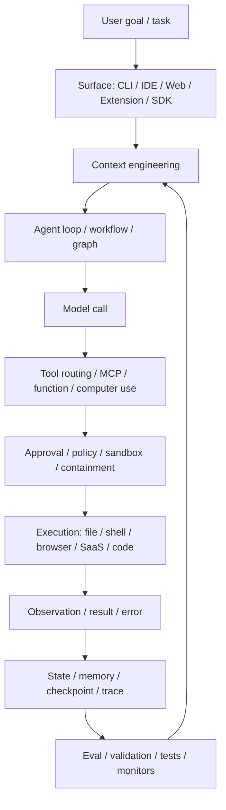
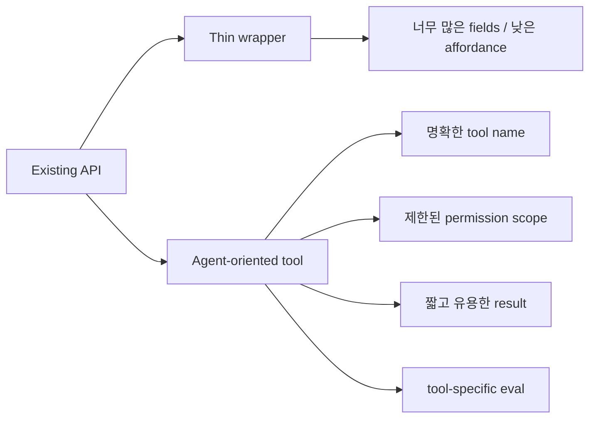
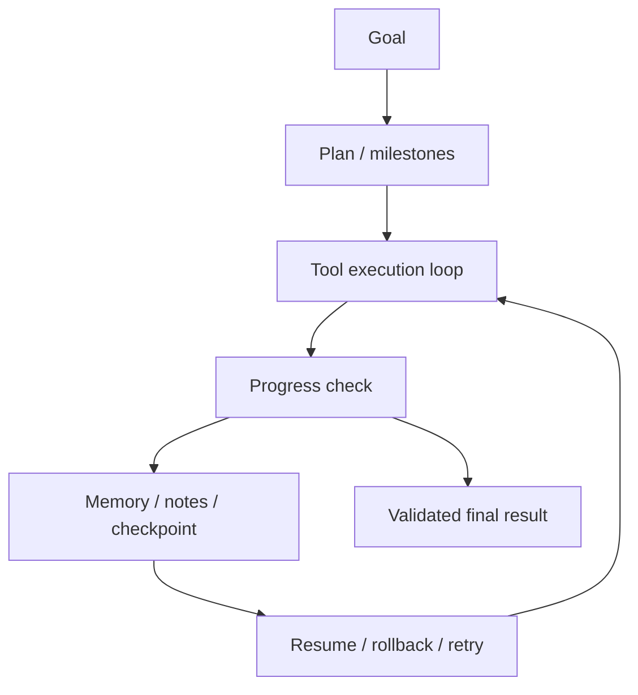
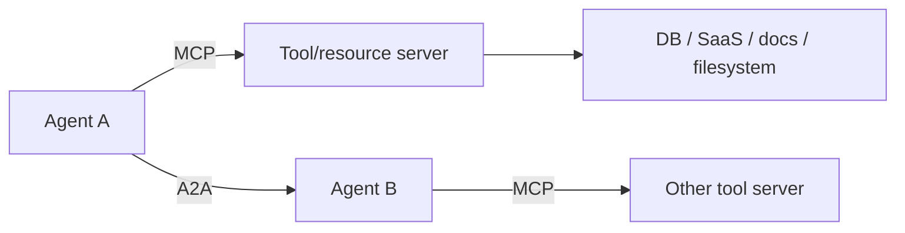

# 2026 AI 코딩 에이전트 설계 트렌드 종합 보고서

기준일: 2026-06-11 KST.  
근거 목록: `reports/research/02-evidence-catalog-100-sources.md`의 S001-S165.  
연결 대상: `reports/repositories/*.md` 30개 레포 분석과 `reports/comparisons/*.md`.

## 1. 요약

2026년 현재 AI 코딩 에이전트의 경쟁축은 "어떤 모델을 쓰는가"에서 "어떤 harness로 모델을 둘러싸는가"로 이동했다. Anthropic, OpenAI, Google, Microsoft 모두 표현은 다르지만 같은 방향을 보인다.

- Anthropic은 context engineering, harness, eval, containment를 전면에 둔다. 특히 장기 실행 agent와 Claude Code 운영 경험에서 compaction, sandboxing, auto approval, subagents, skills, MCP를 체계화한다. 근거: S001-S033.
- OpenAI는 Codex, Agents SDK, Responses API, tools, tracing, MCP/connectors를 하나의 agent platform으로 묶는다. 근거: S034-S058.
- Google은 ADK, Agent Engine, A2A를 통해 agent 개발, 실행, 평가, 배포, agent-to-agent protocol을 함께 밀고 있다. 근거: S059-S076.
- Microsoft는 AutoGen/Semantic Kernel을 Agent Framework와 Foundry Agent Service로 통합하며, multi-agent, state, telemetry, enterprise tool auth를 강조한다. 근거: S077-S097.
- 오픈소스 생태계는 LangGraph, AutoGen, CrewAI, Agno, MCP servers, browser-use, OpenHands, Aider, Cline 계열처럼 서로 다른 층위에서 같은 문제를 푼다. 근거: S098-S120.
- 벤치마크 쪽은 SWE-bench 이후 빠르게 확장됐지만, contamination, flawed tests, infrastructure noise, scoring exploit 문제가 본격적으로 제기됐다. 근거: S121-S165.

핵심 결론은 하나다. 에이전트는 모델이 아니라 `context + loop + tools + state + guardrails + evals + containment`의 합성물이다.

## 2. 2026년 agent stack

이 stack에서 30개 레포의 위치는 다음처럼 갈린다.

| Stack 층위 | 대표 레포 | 핵심 질문 |
|---|---|---|
| Surface | Codex, Gemini CLI, Cline, Continue, OpenHands, nanobrowser | 사용자가 agent를 어디서 만나고 무엇을 승인하는가 |
| Context | Aider, Context7, Continue, LangGraph, Codex skills | 어떤 정보를 넣고, 압축하고, 격리하고, 검색하는가 |
| Loop/runtime | Codex, LangGraph, AutoGen, CrewAI, Agno, SWE-agent | agent의 반복 실행과 중단/재개를 어떻게 표현하는가 |
| Tools/protocol | MCP servers, Composio, browser-use, OpenHands | agent가 외부 세계를 어떤 schema와 권한으로 호출하는가 |
| Guardrails | Codex, Claude Code 계열, OpenHands, browser agents | shell/file/browser/OAuth side effect를 어떻게 제한하는가 |
| State/memory | LangGraph, ADK, Hermes, Agno, Codex | 세션, scratchpad, memory, checkpoint를 어디에 저장하는가 |
| Eval | SWE-agent, OpenHands, Aider, Anthropic/OpenAI eval 자료 | 결과, trajectory, 비용, flake, 안전성을 어떻게 측정하는가 |

## 3. 트렌드 1: Prompt engineering에서 context engineering으로

### 관찰

Anthropic의 context engineering 글(S002), LangChain의 context engineering 글(S101), Google ADK의 Session/State/Memory 문서(S062-S065), OpenAI Codex Skills 문서(S047)는 모두 같은 방향을 가리킨다. 더 좋은 system prompt를 쓰는 것만으로는 장기 agent를 안정화하기 어렵다. agent가 매 turn 볼 정보, 보지 말아야 할 정보, 오래 보존할 정보, 즉시 버릴 정보를 runtime에서 관리해야 한다.

### 세부 전략

| 전략 | 의미 | 관련 레포 |
|---|---|---|
| Select | 필요한 file/doc/tool만 고른다 | Aider repo map, Continue indexing, Context7 |
| Compress | 오래된 대화와 관찰을 요약한다 | Codex thread/session, Claude Code compaction |
| Isolate | subagent나 graph node별로 context를 분리한다 | Claude subagents, AutoGen, LangGraph |
| Write | memory/checkpoint/note에 외부화한다 | LangGraph checkpoint, Hermes memory, ADK state |
| Retrieve | 필요할 때 문서/API/memory를 다시 가져온다 | Context7, MCP servers, ADK LoadMemory |
| Stabilize | 반복 prefix를 캐시/고정한다 | OpenAI prompt caching, Anthropic prompt caching |

### 30개 레포에 대한 의미

- `aider`는 "작게 고른 context"의 강한 사례다. repo map과 explicit file selection으로 long context noise를 줄인다.
- `gemini-cli`는 "큰 context"를 제품 가치로 내세운다. 그러나 S161/S162는 long context도 위치/검색 robustness를 따로 검증해야 함을 보여준다.
- `Context7`은 최신 library 문서를 context tool로 제공해 모델의 낡은 지식을 보완한다.
- `LangGraph`는 context를 graph state/checkpoint로 구조화한다.
- `oh-my-claudecode`, `oh-my-codex`, Codex Skills, Claude Skills는 context engineering을 reusable package로 만드는 흐름이다.

## 4. 트렌드 2: Tool use는 API wrapper가 아니라 agent interface 설계

### 관찰

Anthropic의 tool writing 글(S026), OpenAI tools/MCP 문서(S039-S041), Foundry tool best practice(S080-S081), ADK integrations(S068)은 모두 "tool schema와 결과가 agent에게 얼마나 잘 보이는가"를 강조한다. 과거에는 함수 호출을 JSON schema로 맞추는 것이 중심이었다. 지금은 tool name, namespace, permission, response size, error format, idempotency, traceability까지 포함한다.

### 레포 연결

- `modelcontextprotocol/servers`는 agent-tool boundary 표준을 제공하지만, server별 권한과 품질은 별도 검토가 필요하다.
- `Composio`는 외부 SaaS tool과 OAuth를 agent에게 붙인다. 생산성은 크지만 external side effect가 가장 큰 위험이다.
- `browser-use`와 `nanobrowser`는 browser action을 tool로 만든다. tool output은 DOM/element state와 action history다.
- `OpenHands`와 `Open Interpreter`는 file/shell/browser/OS action을 tool로 만든다.
- `Codex`는 `apply_patch`를 단순 shell command가 아니라 agent-friendly primitive로 다룬다.

## 5. 트렌드 3: Agent loop는 while loop에서 workflow/graph/thread runtime으로 진화

### 관찰

ReAct(S147)는 reasoning과 acting을 교차시키는 기본 원형이다. 그러나 장기 coding agent는 단순 `while not done`으로는 부족하다. Codex는 thread/session/turn runtime, LangGraph는 StateGraph/Pregel/checkpoint, AutoGen은 async message/team, ADK는 session/state/workflow agents, Microsoft Agent Framework는 state/workflow/telemetry를 제공한다.

### 패턴 비교

| 패턴 | 장점 | 약점 | 대표 |
|---|---|---|---|
| Simple ReAct loop | 단순하고 구현 쉬움 | 장기 상태, 승인, resume이 약함 | 작은 CLI agent, 초기 tool agents |
| Git/test loop | 결과 검증이 명확함 | 범위가 coding repo로 제한 | Aider, SWE-agent |
| Thread/session runtime | 제품 표면과 상태 관리가 쉬움 | 권한 matrix가 복잡 | Codex, Gemini CLI, Qwen Code |
| Graph runtime | HITL, checkpoint, branching에 강함 | 설계 비용과 graph 복잡도 | LangGraph |
| Multi-agent team | 병렬 탐색과 역할 분담 가능 | 비용/coordination overhead | AutoGen, CrewAI, Magentic-One |
| Managed cloud agent | auth, observability, deployment 제공 | vendor lock-in, cloud data boundary | Foundry Agent Service, OpenAI/Google platforms |

### 레포 연결

- `Codex`는 thread 기반 product runtime이 무엇인지 보여준다.
- `LangGraph`는 agent를 graph/durable execution 문제로 보는 가장 선명한 레퍼런스다.
- `AutoGen`과 `Magentic-One`은 multi-agent team이 어떻게 orchestrator/specialist 구조로 구현되는지 보여준다.
- `SWE-agent`는 issue repair를 benchmark-compatible loop로 좁힌다.

## 6. 트렌드 4: 장기 실행 agent의 핵심은 progress, memory, recovery

### 관찰

Anthropic long-running harness 글(S003, S004), Claude scientific computing 글(S027), LangGraph checkpoint(S098-S100), Google ADK state/memory(S063-S065), AutoGen state(S091)는 모두 장기 실행 agent에서 다음 문제가 반복됨을 보여준다.

- context window가 찬다.
- agent가 원래 목표를 잊는다.
- 중간 결과가 검증되지 않는다.
- 실패 후 어디서 재개해야 할지 모른다.
- memory가 도움이 되기도 하지만 오염원이 되기도 한다.

### 필요한 구성요소

### 레포 연결

- `LangGraph`: checkpoint와 interrupt로 pause/resume을 제공한다.
- `Codex`: thread/session/rollout/state DB로 장기 세션을 관리한다.
- `Hermes Agent`: memory/cron/messaging gateway로 personal long-running agent 성격이 강하다.
- `OpenHands`: workspace event stream과 sandbox에서 긴 task를 수행한다.
- `AutoGen`: team state와 human feedback을 저장/복원한다.

## 7. 트렌드 5: Permission prompt에서 containment와 auto-approval로

### 관찰

Claude Code sandboxing(S027), auto mode(S028), How we contain Claude(S008), OpenAI/Foundry tool approval docs(S040, S081), Codex CLI reference/config(S045, S048)는 모두 approval prompt만으로는 충분하지 않다는 점을 보여준다. 사용자는 반복 승인에 피로해지고, agent는 점점 더 많은 작업을 자율적으로 수행한다.

### 세 가지 접근

| 접근 | 설명 | 장점 | 위험 |
|---|---|---|---|
| Manual approval | action마다 사용자가 승인 | 이해하기 쉬움 | approval fatigue, 사용자가 제대로 안 봄 |
| Sandboxed autonomy | 정해진 filesystem/network boundary 안에서는 자유 실행 | 안전성과 속도 균형 | boundary 설정 비용 |
| Classifier/auto mode | 위험 action만 모델/정책이 판단 | friction 감소 | classifier miss, policy drift |

### 레포 연결

- `Codex`: approval policy, sandbox, permission profile을 계층화한다.
- `OpenHands`: Docker/workspace sandbox가 핵심이다.
- `browser-use`/`nanobrowser`: browser session 자체가 권한이므로 cookie/OAuth containment가 필요하다.
- `oh-my-*`: hook이 permission model을 우회하거나 확장할 수 있어 검토해야 한다.

## 8. 트렌드 6: MCP와 A2A로 tool-to-agent, agent-to-agent 경계가 표준화

### 관찰

MCP는 Anthropic에서 시작해 OpenAI Codex와 Claude Code 양쪽 공식 문서에 들어갔고(S021, S022, S040, S046), Google/A2A는 agent 간 통신을 표준화하려 한다(S070-S076). Microsoft Agent Framework 1.0도 A2A/MCP interop을 강조한다(S078).

### 의미

- MCP는 "agent가 tool을 어떻게 발견하고 호출하는가"의 표준이다.
- A2A는 "agent가 다른 agent에게 task를 어떻게 위임하는가"의 표준이다.
- `codex-plugin-cc`처럼 Claude Code와 Codex를 잇는 bridge는 아직 ad hoc이지만, 장기적으로 A2A 같은 protocol 요구가 커진다.

### 레포 연결

- `modelcontextprotocol/servers`: MCP 생태계 기본 reference.
- `Context7`: MCP를 documentation context에 특화.
- `Composio`: MCP/tool/auth/business integration을 제품화.
- `Goose`, `Cline`, `Codex`, `Claude Code`, `Gemini CLI`: MCP client/extension surface가 핵심 확장 포인트.

## 9. 트렌드 7: Multi-agent는 만능이 아니라 parallelism과 context isolation 도구

### 관찰

AutoGen/Magentic-One(S084-S096), Anthropic multi-agent research system(S029), CrewAI/Agno(S111-S112), CAMEL/MetaGPT/ChatDev(S157-S159)는 multi-agent의 가능성을 보여준다. 그러나 Anthropic의 Building Effective Agents(S001), AI Agents That Matter(S146), multi-agent research system의 비용 언급(S029)은 multi-agent가 항상 좋은 것은 아니라고 경고한다.

### 잘 맞는 경우

- 독립적인 subtask가 많다.
- 병렬 search/research가 유리하다.
- 각 agent가 다른 tool/context를 가져야 한다.
- 결과를 종합하는 lead agent가 명확하다.

### 잘 안 맞는 경우

- 모든 단계가 강하게 의존한다.
- shared code context가 자주 바뀐다.
- coordination overhead가 결과 품질을 넘는다.
- 단일 agent + 좋은 tool loop가 충분하다.

### 레포 연결

- `AutoGen/Magentic-One`: multi-agent 낙관론의 대표.
- `LangGraph`: multi-agent보다 state graph와 control flow를 우선시하는 대안.
- `CrewAI`: role/task metaphor로 multi-agent를 쉽게 만든다.
- `Aider`: single-agent Git loop가 충분히 강할 수 있음을 보여준다.
- `oh-my-*`: multi-agent/team metaphor가 vendor CLI 운영 layer로 내려온 예다.

## 10. 트렌드 8: Benchmark는 필요하지만 더 이상 단독 신호가 아니다

### 관찰

SWE-bench(S121-S123)는 coding agent 평가의 표준이 되었고 SWE-agent(S124)는 harness가 성능에 미치는 영향을 보여줬다. 그러나 OpenAI는 SWE-bench Verified가 frontier coding 능력을 더 이상 잘 측정하지 못한다고 주장했고(S058), Anthropic은 infrastructure noise를 정량화했으며(S006), Berkeley RDI는 여러 benchmark exploit을 보고했다(S144).

### 평가 기준의 변화

| 과거 | 현재 |
|---|---|
| final answer correctness | trajectory + final outcome |
| one-shot benchmark score | repeated runs + variance |
| static dataset | contamination-aware fresh tasks |
| model-only comparison | model + harness + budget + environment comparison |
| accuracy only | cost, latency, safety, autonomy, robustness |

### 레포 연결

- `SWE-agent`: benchmark repair harness 자체를 분석해야 한다.
- `OpenHands`: workspace automation은 runtime/sandbox가 score 일부다.
- `browser-use`: web benchmark는 UI flake와 web prompt injection을 고려해야 한다.
- `Aider`: 실제 Git/test workflow가 benchmark 점수와 다른 실사용 signal을 제공한다.

## 11. 트렌드 9: IDE, CLI, Web workspace가 수렴

### 관찰

Codex는 CLI/IDE/app/cloud 표면을 갖고, Claude Code는 terminal이면서 SDK/hooks/skills/plugins/subagents를 갖는다. Google/Microsoft는 SDK와 managed service를 함께 제공한다. OpenHands는 web workspace, Cline/Roo/Kilo는 IDE, Aider/Codex/Gemini/Qwen은 CLI에서 출발하지만 기능적으로 서로 가까워진다.

### 수렴 방향

- CLI는 app server와 thread store를 갖는다.
- IDE extension은 terminal/shell/MCP/browser action을 갖는다.
- Web workspace는 sandbox와 browser/file editor를 갖는다.
- SDK는 완제품 agent loop를 programmable surface로 노출한다.

### 의미

사용자는 "CLI냐 IDE냐"로 고르지만, 설계자는 "같은 runtime을 여러 surface에 어떻게 안전하게 노출할 것인가"를 고민해야 한다. Codex와 Claude Code 계열이 이 방향을 가장 분명히 보인다.

## 12. 트렌드 10: Privacy와 self-hosting은 계속 중요한 분기점

### 관찰

Tabby, Continue, Aider, Goose, nanobrowser, Open Interpreter는 local/BYOK/self-hosted 성격이 강하다. 반면 OpenAI/Google/Microsoft managed platforms는 auth, tracing, tool catalog, deployment를 제공한다.

| 방향 | 장점 | 단점 | 대표 |
|---|---|---|---|
| Local/BYOK/self-host | 코드/IP 통제, provider 선택 자유 | 설정/운영/보안 책임이 사용자에게 있음 | Aider, Tabby, Continue, nanobrowser, Goose |
| Managed platform | auth, observability, deployment, scaling 제공 | cloud data boundary, vendor lock-in | OpenAI Agents, Google ADK/Agent Engine, Microsoft Foundry |

이 갈등은 해결되지 않았다. 기업은 관리형 보안/감사를 원하면서도 코드/IP/credential 노출을 걱정한다. 따라서 앞으로 agent 제품은 hybrid/local execution, scoped credentials, trace redaction, tenant isolation을 더 강조할 가능성이 높다.

## 13. 30개 레포에 대한 종합 해석

| 레포군 | 가장 중요한 설계 질문 | 대표 위험 | 배워야 할 점 |
|---|---|---|---|
| 터미널 coding CLI | context와 shell/file 실행을 어떻게 통제하는가 | destructive command, context noise | Codex runtime, Aider Git loop |
| IDE agent | IDE 권한과 approval UX를 어떻게 보여주는가 | extension supply chain, workspace secret | Cline/Roo/Kilo mode, Continue indexing |
| Browser/computer-use | 관찰과 행동을 어떻게 격리하는가 | prompt injection, cookie/token leak | browser-use state abstraction, OpenHands sandbox |
| Personal agent | memory와 scheduled task를 어떻게 안전히 관리하는가 | 장기 memory 오염, forgotten automation | Hermes memory/cron, Goose extension |
| Framework/runtime | control flow와 state를 어떻게 모델링하는가 | 추상화가 실패 원인을 숨김 | LangGraph checkpoint, AutoGen teams |
| Tool/context infra | tool schema와 auth scope를 어떻게 제한하는가 | OAuth/token/supply chain | MCP, Context7, Composio |
| Benchmark harness | 점수가 실제 능력을 대표하는가 | contamination, flawed tests, flake | SWE-agent, SWE-bench critique |
| Vendor workflow layer | hook/template이 무엇을 실행하는가 | hidden execution path | oh-my-*, codex-plugin-cc |

## 14. 앞으로 봐야 할 신호

1. Official agent CLIs가 더 많은 app/workspace/cloud surface를 갖는지.
2. MCP server와 A2A agent registry가 실제 production adoption을 얻는지.
3. agent skills/plugins가 package manager처럼 supply chain 이슈를 낳는지.
4. browser/computer-use agent가 sandbox와 credential boundary를 얼마나 안정화하는지.
5. SWE-bench 이후 benchmark가 contamination과 infrastructure noise를 얼마나 줄이는지.
6. multi-agent가 coding task에서 실제 비용 대비 성능 이득을 내는지.
7. long context 모델의 향상이 context engineering 필요성을 줄이는지, 아니면 더 긴 작업만 가능하게 하는지.

## 15. 결론

이 리서치가 30개 레포 분석에 주는 가장 큰 교훈은 다음이다.

- 좋은 agent는 모델 wrapper가 아니다. 실행 환경과 검증 루프가 제품의 절반 이상이다.
- context는 많이 넣는 것이 아니라, 잘 고르고 잘 버리고 잘 외부화하는 문제다.
- tool은 API wrapper가 아니라 agent와 deterministic system 사이의 interface다.
- long-running autonomy는 permission prompt를 줄이는 문제가 아니라 containment와 recovery를 설계하는 문제다.
- multi-agent는 parallelism과 context isolation이 필요할 때 강하지만, 기본값이 되어서는 안 된다.
- benchmark는 필요하지만 수명이 있고, harness와 환경까지 함께 측정해야 한다.

따라서 각 레포를 이해할 때는 README의 기능 목록보다 "무엇이 무엇을 호출하고, 어떤 context를 넣고, 어느 경계에서 승인/격리/검증하는가"를 먼저 봐야 한다. 이 기준이 `reports/repositories`의 소스 흐름 분석과 `reports/comparisons`의 유사군 분류를 관통하는 공통 해석이다.
